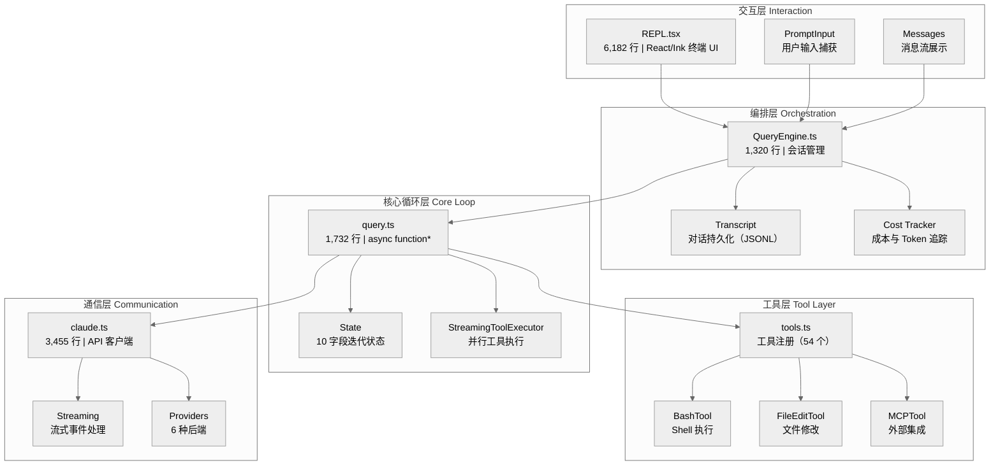
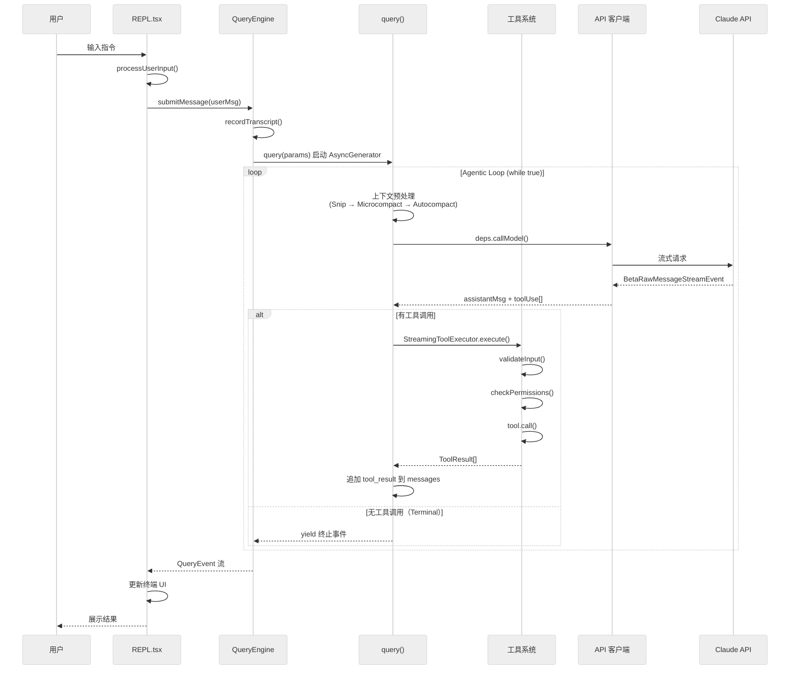
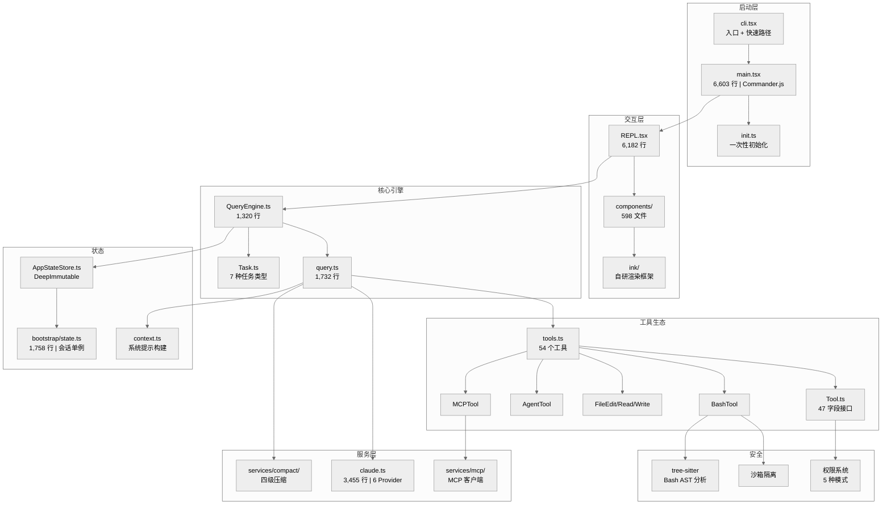

# 第一章 架构总览

Claude Code 是 Anthropic 推出的终端原生 AI 编程助手。与 IDE 集成的代码补全工具不同，它以独立 CLI 进程运行在用户终端中，拥有完整的 shell 访问能力，能自主规划并执行多步操作——从读文件、改代码到运行测试，整条链路由 AI 自主驱动。这种架构模式可以概括为三个关键词：**Terminal-Native**、**Agentic**、**Coding System**。

本章对 Claude Code 的整体架构做一次全景扫描：先看代码库规模，再拆解分层设计与核心数据流，最后梳理关键模块的定位与职责。

---

## 1.1 代码库概况

以下数据基于对代码库的实际统计（排除 `node_modules`、`.git`、`dist`）。

| 指标 | 数值 |
|------|------|
| 总文件数 | ~3,612 |
| TypeScript 文件（.ts） | ~2,388 |
| TSX 文件（.tsx） | ~558 |
| src/ 目录 TypeScript 代码行数 | ~546,000 |
| 内置工具目录 | 52 个 |
| `getAllBaseTools()` 注册工具 | 54 个（部分条件加载） |
| Hook 事件类型 | 27 种 |
| 任务类型 | 7 种 |
| API Provider | 6 种 |

### 各模块文件分布

| 模块目录 | 文件数 | 定位 |
|----------|--------|------|
| `src/utils/` | 797 | 工具函数库：权限、文件操作、Git 集成、安全存储等 |
| `src/components/` | 598 | React/Ink 终端 UI 组件 |
| `src/tools/` | 306 | 工具实现（每个工具独立子目录） |
| `src/services/` | 265 | 服务层：API 通信、MCP 协议、上下文压缩等 |
| `src/commands/` | 229 | 斜杠命令（`/help`、`/init`、`/doctor` 等，共 109 个条目） |
| `src/hooks/` | 147 | 自定义 React Hooks |
| `src/ink/` | 104 | 自研 Ink 渲染框架（fork 版） |
| `src/screens/` | 51 | UI 界面容器（REPL 等） |
| `packages/` | 45 | 子包（native modules、Computer Use MCP server 等） |
| `src/bridge/` | 34 | Remote Control / Bridge 模式 |
| `src/entrypoints/` | 19 | 入口点（CLI、SDK、初始化） |
| `src/tasks/` | 14 | 任务类型实现 |
| `src/memdir/` | 9 | 项目记忆系统（CLAUDE.md 发现与加载） |
| `src/state/` | 9 | 全局状态管理 |

### 关键文件行数

| 文件 | 行数 | 角色 |
|------|------|------|
| `src/main.tsx` | 6,603 | Commander.js CLI 定义：所有子命令、参数、主 action |
| `src/screens/REPL.tsx` | 6,182 | 交互式 REPL 界面（React/Ink） |
| `src/utils/messages.ts` | 5,559 | 消息处理与转换工具函数 |
| `src/services/api/claude.ts` | 3,455 | API 客户端：多 Provider 支持、流式通信 |
| `src/bootstrap/state.ts` | 1,758 | 会话级全局单例状态 |
| `src/query.ts` | 1,732 | Agentic Loop 核心：`while(true)` 主循环 |
| `src/services/compact/compact.ts` | 1,708 | 上下文压缩引擎 |
| `src/QueryEngine.ts` | 1,320 | 会话编排层：管理对话生命周期 |
| `src/Tool.ts` | 792 | 工具接口定义（47 个字段/方法） |
| `src/tools.ts` | 387 | 工具注册表：组装、过滤、去重 |

---

## 1.2 五层架构

Claude Code 的源码组织可以用五层模型来理解。这不是代码中的显式声明，而是对实际调用关系和职责边界的架构性描述：**交互层 → 编排层 → 核心循环层 → 工具层 → 通信层**，数据自上而下流动，每层专注自身职责。

### 各层职责

| 层 | 核心文件 | 职责 | 关键技术 |
|----|----------|------|----------|
| **交互层** | `src/screens/REPL.tsx` | 终端 UI 渲染、用户输入、消息展示、权限确认对话框 | React 19 + Ink（自研 fork）、Yoga 布局 |
| **编排层** | `src/QueryEngine.ts` | 管理多轮对话生命周期：Transcript 持久化、成本累计、文件历史快照、会话恢复 | AsyncGenerator 消费、JSONL Transcript |
| **核心循环层** | `src/query.ts` | 单轮 agentic loop：上下文压缩 → API 调用 → 工具执行 → 继续/终止判定 | `async function*`、`while(true)` 循环、State 状态对象 |
| **工具层** | `src/Tool.ts` + `src/tools.ts` | 定义统一工具接口（47 字段）、注册并组装工具列表、Zod Schema 验证、权限检查、并发控制 | Tool 接口、`getAllBaseTools()`、`filterToolsByDenyRules()` |
| **通信层** | `src/services/api/claude.ts` | 与 LLM API 的流式通信，支持 6 种 Provider（Anthropic Direct、AWS Bedrock、Google Vertex、Azure Foundry、OpenAI 兼容、Gemini） | Anthropic SDK、Prompt Cache、重试降级 |

这种分层的实际价值在于各层可独立演进：工具层新增一个 MCP 工具无需修改核心循环，通信层切换 Provider 无需调整编排逻辑，交互层替换 UI 框架无需触及 API 客户端。

---

## 1.3 核心数据流

理解 Claude Code 最有效的方式是追踪一条完整的请求路径：从用户输入到工具执行再到结果呈现。

### 数据流关键节点

**1. 入口与路由**（`src/entrypoints/cli.tsx` → `src/main.tsx`）

`cli.tsx` 是真正的入口点。它按优先级检查多条快速路径（`--version`、`--daemon-worker`、`remote-control` 等），大部分请求落入默认路径——加载 `main.tsx`。`main.tsx`（6,603 行）通过 Commander.js 定义全部子命令和 CLI 选项，其主 action handler 执行参数解析、服务初始化，最终启动 REPL。

**2. 会话编排**（`src/QueryEngine.ts`）

QueryEngine 是 UI 层与核心循环之间的边界。它管理对话状态（消息数组、权限上下文、文件历史快照）、成本追踪（`accumulateUsage` / `getTotalCost`）、Transcript 持久化（JSONL 格式），并消费 `query()` 返回的 AsyncGenerator 事件流。

**3. Agentic Loop**（`src/query.ts`）

这是整个系统的心脏。`query()` 是一个 `async function*`，内部运行 `while(true)` 循环。每次迭代经过以下阶段（通过 `queryCheckpoint` 标记追踪）：

1. **Snip 压缩**——裁剪过长的工具输出
2. **Microcompact 压缩**——移除冗余的系统信息
3. **Autocompact 压缩**——当 Token 超限时触发完整摘要压缩
4. **Setup**——构建请求参数
5. **API 调用**——流式发送请求并接收响应
6. **工具执行**——通过 StreamingToolExecutor 并行执行工具
7. **递归调用**——工具结果注入后进入下一次循环

循环的退出由 `Terminal` / `Continue` 类型控制（定义在 `src/query/transitions.ts`）：当 AI 响应不包含任何工具调用时，循环终止并返回。

**4. 工具执行**（`src/Tool.ts` + `src/tools.ts`）

每个工具实现统一的 `Tool` 接口（47 个字段/方法），核心执行链路为 `validateInput() → checkPermissions() → call() → ToolResult`。`getAllBaseTools()` 在 `tools.ts` 中组装完整工具列表，经过 `filterToolsByDenyRules()` 权限过滤后传给 API。

**5. API 通信**（`src/services/api/claude.ts`）

3,455 行的 API 客户端支持 6 种 Provider。`deps.callModel()` 发起流式请求，返回 `BetaRawMessageStreamEvent` 事件流。支持 Prompt Cache（`cache_control` 标记避免重复发送不变的上下文）、thinking blocks、多轮工具调用。

---

## 1.4 核心子系统

### 工具生态

**52 个工具目录**（`src/tools/*/`），通过 `getAllBaseTools()` 注册了 54 个工具实例（`ScheduleCronTool` 目录注册了 CronCreate / CronDelete / CronList 三个工具）。工具按条件加载——有些受 feature flag 控制（如 `SleepTool` 需要 `PROACTIVE` 或 `KAIROS`），有些受环境变量控制（如 `ConfigTool` 仅对 `USER_TYPE=ant` 启用），还有些受运行时检测（如 `GlobTool` / `GrepTool` 在有内嵌搜索工具时跳过）。

工具通过 MCP 协议进一步扩展：`assembleToolPool()` 将内置工具与 MCP 工具合并去重，内置工具在名称冲突时优先。

### 任务系统

`Task.ts` 定义了 7 种任务类型，覆盖从本地 Shell 执行到远程 Agent 协作的完整谱系：

| 类型 | ID 前缀 | 用途 |
|------|---------|------|
| `local_bash` | b | 本地 Shell 命令 |
| `local_agent` | a | 本地子 Agent |
| `remote_agent` | r | 远程 Agent 协作 |
| `in_process_teammate` | t | 进程内协作 Agent |
| `local_workflow` | w | 工作流编排 |
| `monitor_mcp` | m | MCP 服务器监控 |
| `dream` | d | 后台推理任务 |

任务生命周期遵循 `pending → running → completed/failed/killed` 状态机，由 `isTerminalTaskStatus()` 判断终态。每个任务通过 `getTaskOutputPath()` 获取独立输出文件，避免大型输出阻塞主循环。

### 状态管理

状态分为两个层次：

- **会话级全局状态**（`src/bootstrap/state.ts`，1,758 行）：模块级单例，包含 session ID、工作目录、项目根目录、Token 计数、模型覆盖等。
- **应用级响应式状态**（`src/state/AppStateStore.ts`）：通过 `DeepImmutable` 确保只读，基于 `useSyncExternalStore` 实现响应式更新。AppState 包含消息历史、活跃任务、MCP 连接、权限上下文、Bridge 状态等。

### 上下文工程

`src/context.ts` 负责组装发送给 Claude 的完整系统提示：Git 状态、CLAUDE.md 内容、MCP 服务器能力等。上下文由 `src/utils/claudemd.ts` 从项目目录层级中发现并加载 CLAUDE.md 文件。

当上下文超过 Token 预算时，触发四级压缩流水线（均有对应实现文件）：

1. **Snip**（`snipCompact.ts`）——裁剪过长的单条工具输出
2. **Microcompact**（`microCompact.ts`）——移除冗余系统信息
3. **Context Collapse**（`src/services/contextCollapse/`）——折叠搜索/读取类操作
4. **Autocompact**（`autoCompact.ts`）——生成对话摘要替换旧消息

### 权限与安全

工具执行前经过多层权限检查：

- **权限规则**：`alwaysAllowRules`（自动允许）、`alwaysDenyRules`（自动拒绝）、`alwaysAskRules`（强制询问）
- **权限模式**：`default`（交互式确认）、`plan`（规划模式）、`bypassPermissions`（跳过）、`auto`（自动）、`bubble`（向上冒泡）
- **Bash 安全**：`src/utils/bash/treeSitterAnalysis.ts` 使用 tree-sitter 对 Shell 命令进行 AST 级分析，检测注入风险
- **沙箱隔离**：高风险操作可通过沙箱机制约束执行环境

### Feature Flag 系统

通过 `import { feature } from 'bun:bundle'` 引入编译时特性门控。`feature('FLAG_NAME')` 在构建时求值，`false` 分支被死代码消除物理删除。运行时通过 `FEATURE_<FLAG_NAME>=1` 环境变量启用。Dev 模式默认启用 `BUDDY`、`TRANSCRIPT_CLASSIFIER`、`BRIDGE_MODE`、`AGENT_TRIGGERS_REMOTE`、`CHICAGO_MCP`、`VOICE_MODE` 六个特性。

### 扩展机制

- **MCP 协议**（`src/services/mcp/`）：完整的 MCP 客户端实现，支持多种传输协议（stdio、SSE、HTTP 等）
- **Hooks 系统**（`src/utils/hooks.ts`）：27 种事件类型（PreToolUse、PostToolUse、SessionStart、SubagentStart 等），支持在关键执行点注入 Shell 命令或自定义逻辑
- **Skills**（`src/tools/SkillTool/`）：预定义任务模板，支持从多种来源（用户设置、项目设置、MCP 等）加载

---

## 1.5 技术栈

| 技术领域 | 选型 | 用途 |
|----------|------|------|
| 运行时 | Bun (>= 1.3) | JavaScript 运行时、打包、测试框架 |
| 语言 | TypeScript | 类型安全 |
| UI | React 19 + Ink（自研 fork） | 终端声明式 UI，Yoga 布局引擎 |
| CLI | Commander.js | 命令行参数解析、子命令管理 |
| API SDK | @anthropic-ai/sdk | Anthropic API 流式调用 |
| Schema 验证 | Zod v4 | 运行时类型验证（工具输入 Schema） |
| 外部协议 | @modelcontextprotocol/sdk | MCP 服务器集成 |
| Lint/Format | Biome | 代码格式化与静态检查 |
| 包管理 | Bun Workspaces | Monorepo 管理 |
| 构建 | 自定义 `build.ts` | Code splitting 多文件打包，产物兼容 Node.js/Bun 双运行时 |

---

## 1.6 关键设计模式

1. **依赖注入**：QueryEngine 通过 config 对象接收所有依赖（tools、commands、mcpClients），便于测试和替换。
2. **策略模式**：每个工具通过 `checkPermissions()` 实现各自的权限策略（如 BashTool 检查命令白名单，FileEditTool 检查路径范围）。
3. **观察者模式**：AppState 通过 `subscribe` 机制通知组件状态变更，基于 `useSyncExternalStore` 订阅特定状态切片。
4. **条件编译**：`feature()` 宏在构建时求值，未启用的功能被物理移除，实现零运行时开销的特性门控。
5. **AsyncGenerator 驱动的流式管道**：`query()` 是 async generator，UI 层通过 `for await` 消费事件流，天然支持背压和取消。

---

## 1.7 快速查阅路径

当你带着具体问题来读代码时，以下映射帮助快速定位：

| 问题 | 关键文件 |
|------|----------|
| 用户输入后发生了什么？ | `REPL.tsx` → `QueryEngine.ts` → `query.ts` |
| 工具是怎么执行的？ | `Tool.ts`、`tools.ts`、`src/services/tools/StreamingToolExecutor.ts` |
| 为什么响应是流式的？ | `query.ts`（`async function*`）、`claude.ts`（流式事件） |
| 权限怎么控制的？ | `src/hooks/toolPermission/`、`src/utils/bash/` |
| 上下文满了怎么办？ | `src/services/compact/`（四级压缩） |
| MCP 怎么集成？ | `src/services/mcp/`、`MCPTool` |
| 多个 Agent 怎么协作？ | `src/coordinator/`、`src/Task.ts`、`src/tasks/` |
| 全局状态怎么管理？ | `src/bootstrap/state.ts`、`src/state/AppStateStore.ts` |
| Feature Flag 怎么用？ | `bun:bundle` 的 `feature()` 宏、`scripts/defines.ts` |
| 如何新增一个工具？ | 创建 `src/tools/YourTool/` 目录 + 在 `tools.ts` 的 `getAllBaseTools()` 注册 |

---

## 1.8 架构全景图

将上述所有子系统整合，Claude Code 的完整架构如下：

---

## 1.9 后续章节导读

基于本章建立的架构坐标，建议按以下顺序深入：

1. **启动流程** — 从 `cli.tsx` 到 REPL 的完整启动链路，理解快速路径设计与 Commander 参数定义
2. **核心循环** — `query.ts` 的 `while(true)` 循环细节，State 对象、压缩流水线、Terminal/Continue 判定
3. **工具系统** — Tool 接口 47 字段详解，工具注册、权限检查、并发执行
4. **上下文工程** — 系统提示构建、CLAUDE.md 发现机制、Token 预算管理与四级压缩
5. **权限与安全** — 权限模式、tree-sitter Bash 分析、沙箱隔离
6. **扩展开发** — MCP 集成、Hooks 系统、自定义 Agent 开发

每个主题都可以独立阅读，但遵循上述顺序有助于建立从宏观到微观的渐进式理解。

---

本章基于对以下源文件的分析：`src/entrypoints/cli.tsx`、`src/main.tsx`、`src/screens/REPL.tsx`、`src/QueryEngine.ts`、`src/query.ts`、`src/Tool.ts`、`src/tools.ts`、`src/Task.ts`、`src/services/api/claude.ts`、`src/services/compact/compact.ts`、`src/bootstrap/state.ts`、`src/state/AppStateStore.ts`、`src/context.ts`、`src/utils/model/providers.ts`、`src/entrypoints/sdk/coreTypes.ts`、`src/utils/bash/treeSitterAnalysis.ts`、`src/utils/hooks.ts`。所有数值均基于代码库实际统计。
