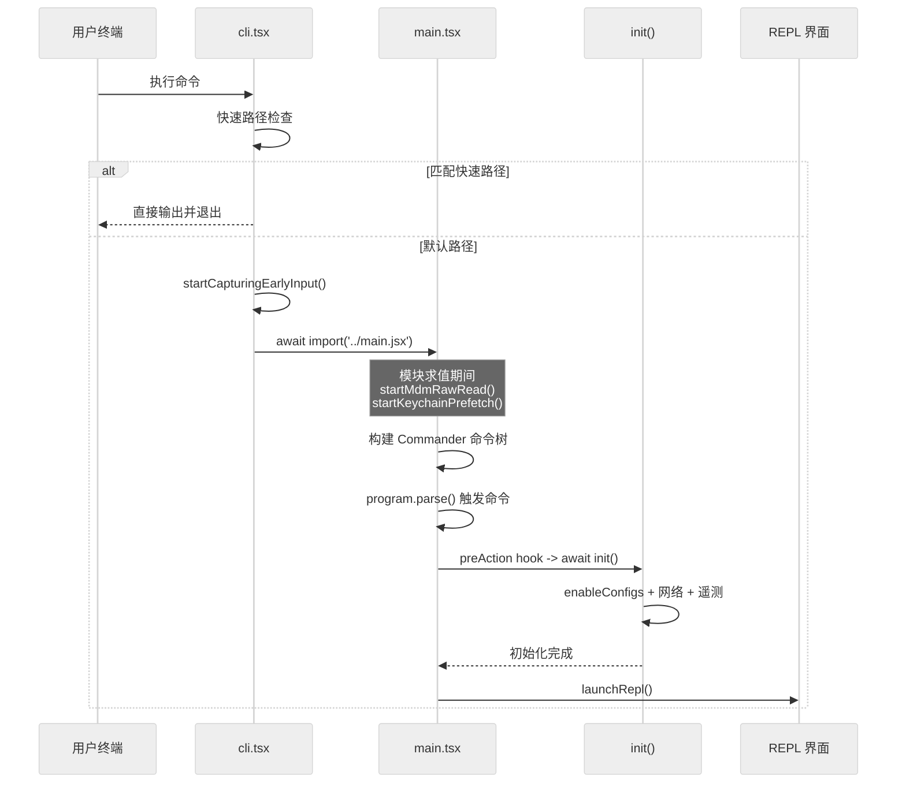
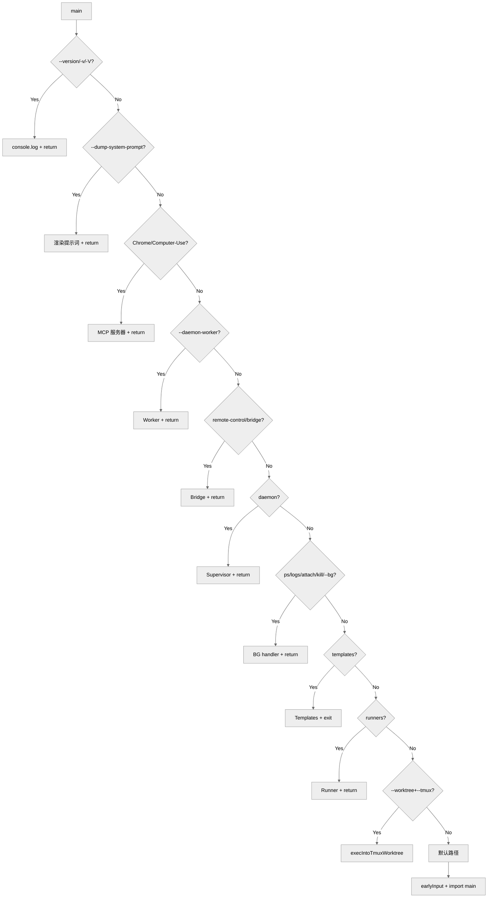
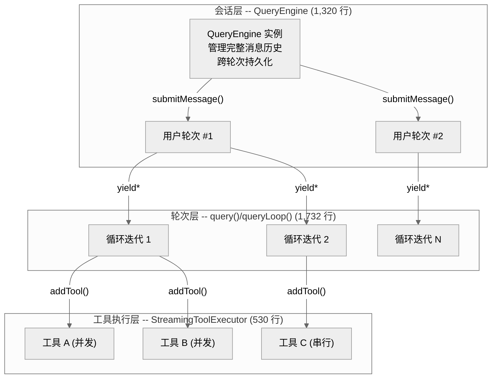
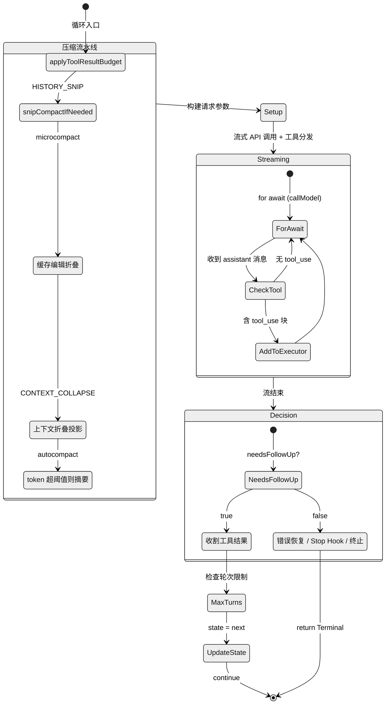

# 第 02 章 -- 从启动到运行

Claude Code 的一次完整会话，从用户敲下命令到 AI 自主执行多轮工具调用，横跨两个截然不同的阶段：**启动引导**和**核心循环**。前者的目标是用最少的时间让系统进入可交互状态；后者的目标是在给定的上下文窗口内完成尽可能多的有效工作。本章将这两个阶段作为一个连贯的执行流来剖析。

---

## 1. 入口点层级

整个启动链路由三个关键文件串联而成：

| 文件 | 行数 | 职责 |
|------|------|------|
| `src/entrypoints/cli.tsx` | 322 | 快速路径网关，特殊命令拦截 |
| `src/main.tsx` | 6,603 | Commander.js 命令树构建、preAction 初始化、执行模式分发 |
| `src/entrypoints/init.ts` | 344 | 配置激活、网络栈、遥测、安全环境注入 |

**cli.tsx** 是真正的进程入口。它的核心设计原则是：对于不需要完整运行时的命令，避免加载任何不必要的模块。所有导入都使用 `await import()`，保证快速路径零静态导入开销。

当没有匹配到任何快速路径时，cli.tsx 执行两件事：启动**早期输入捕获**（异步缓冲 stdin），然后动态导入 main.tsx。main.tsx 在模块求值阶段就触发了 MDM 配置子进程和 Keychain 预读，这些操作与后续约 135ms 的模块加载并行执行。main.tsx 通过 Commander.js 的 `preAction` 钩子延迟调用 init()，确保 `--help` 等不执行命令的场景不会触发初始化。



---

## 2. Fast-Path 级联机制

cli.tsx 的 `main()` 函数是一个线性的 if-else 级联。每个分支用 `feature()` 宏做构建时门控，Bun bundler 会将未启用的 `feature()` 替换为 `false` 常量，使得整个 if 块被死代码消除（DCE）。这意味着外部构建产物中物理上不存在那些被门控掉的代码路径。

以下是 cli.tsx 中**全部**快速路径的实际代码顺序（验证自 322 行源码）：

| # | 触发条件 | Feature Gate | 行为 |
|---|---------|-------------|------|
| 1 | `--version` / `-v` / `-V` | 无 | 输出 `MACRO.VERSION`，零模块加载 |
| 2 | `--dump-system-prompt` | `DUMP_SYSTEM_PROMPT` | 渲染系统提示词并输出 |
| 3 | `--claude-in-chrome-mcp` | 无 | 启动 Chrome 内嵌 MCP 服务器 |
| 4 | `--chrome-native-host` | 无 | Chrome 原生消息宿主 |
| 5 | `--computer-use-mcp` | `CHICAGO_MCP` | Computer Use MCP 服务器 |
| 6 | `--daemon-worker` | `DAEMON` | 守护进程的工作线程 |
| 7 | `remote-control`/`rc`/`remote`/`sync`/`bridge` | `BRIDGE_MODE` | 远程控制桥接模式 |
| 8 | `daemon` | `DAEMON` | 守护进程 supervisor |
| 9 | `ps`/`logs`/`attach`/`kill`/`--bg`/`--background` | `BG_SESSIONS` | 后台会话管理 |
| 10 | `new`/`list`/`reply` | `TEMPLATES` | 模板任务命令 |
| 11 | `environment-runner` | `BYOC_ENVIRONMENT_RUNNER` | 无头 BYOC 运行器 |
| 12 | `self-hosted-runner` | `SELF_HOSTED_RUNNER` | 自托管运行器 |
| 13 | `--worktree` + `--tmux` | 无 | tmux 工作树快速跳转 |
| 14 | `--update`/`--upgrade` | 无 | 重定向到 `update` 子命令 |
| 15 | `--bare` | 无 | 设置 `CLAUDE_CODE_SIMPLE=1`（不退出，继续加载） |
| - | 无匹配 | - | 默认路径：加载 main.tsx |

其中 `--version` 是最极致的优化：`MACRO.VERSION` 在构建时内联，运行时只执行一次 `console.log` 后返回，整个过程不触发任何动态导入。

值得注意的是 `--bare` 并非快速路径——它只设置环境变量后**继续**走默认路径。但因为 `CLAUDE_CODE_SIMPLE` 影响 main.tsx 模块求值期间的条件分支，所以必须在 `import('../main.jsx')` 之前设置。文件顶部还有一个类似设计：`ABLATION_BASELINE` 特性门控在任何函数调用之前，通过顶层代码块将一组环境变量设为 `'1'`，因为 BashTool/AgentTool 等模块在导入时就会捕获这些值。



---

## 2.1 三种执行模式

Fast-Path 级联结束后，main.tsx 的主 `.action()` 处理器根据交互性将执行分流为三条路径。判定逻辑在 `main.tsx` 的命令行参数解析阶段就已确定（main.tsx:1110）：

```typescript
const isNonInteractive =
  hasPrintFlag || hasInitOnlyFlag || hasSdkUrl || !process.stdout.isTTY
```

| 模式 | 触发条件 | 执行入口 | 特征 |
|------|---------|---------|------|
| **交互式 REPL** | 默认（TTY 且无 `-p`/`--sdk-url`） | `launchRepl()` | 完整 Ink TUI、信任对话框、通道/插件延迟加载 |
| **Headless** | `-p`/`--print` 或 `!process.stdout.isTTY` | `runHeadless()` (from `src/cli/print.js`) | 单轮/多轮无界面执行，自建 `headlessStore` 替代 Ink 状态 |
| **SDK** | `--sdk-url <url>` | 同 `runHeadless()`，额外传入 `sdkUrl` | headless 的超集：自动设置 `stream-json` 格式、启用 verbose、携带远程会话 ID |

三者的分叉点在 main.tsx:3652：

```typescript
if (isNonInteractiveSession) {
  // Headless / SDK 路径
  const headlessStore = createStore(headlessInitialState, onChangeAppState)
  // ... MCP 连接、插件初始化 ...
  const { runHeadless } = await import('src/cli/print.js')
  void runHeadless(inputPrompt, () => headlessStore.getState(), ...)
  return
}
// 交互式 REPL 路径
await launchRepl(root, { getFpsMetrics, stats, initialState }, sessionConfig, renderAndRun)
```

SDK 模式本质上是 headless 路径的参数变体——当 `--sdk-url` 存在时，main.tsx:1984 自动将 `inputFormat`/`outputFormat` 设为 `stream-json`、开启 `verbose`、激活 `print` 模式。`sdkUrl` 最终传入 `runHeadless()` 的 options 对象，用于建立与远程 SDK 服务器的连接。

**关键差异**：headless 路径不会渲染 Ink 组件（"Ink constructor would swallow console output in headless mode"——main.tsx:3220 注释），而是构建一个独立的 `headlessStore`（Zustand store）来管理 `AppState`。这个 store 替代了交互模式下 Ink 组件树中的状态管理，使得 MCP 连接、工具列表等状态在无 UI 环境下仍可更新。

---

## 3. 启动引导与初始化

### 3.1 Import-Gap 并行化

main.tsx 的前 25 行利用了一个巧妙的性能窗口：在 Bun 加载剩余约 135ms 的 import 语句期间，两个预加载操作已经在后台启动：

```typescript
// main.tsx:12
profileCheckpoint('main_tsx_entry')

// main.tsx:17 — 启动 plutil/reg query 子进程
startMdmRawRead()

// main.tsx:25 — 并行读取 macOS keychain
startKeychainPrefetch()

// ... 约 430 行 import 语句 ...

// main.tsx:451
profileCheckpoint('main_tsx_imports_loaded')
```

`startMdmRawRead()` 向操作系统查询企业 MDM 配置（macOS 上通过 plutil、Windows 上通过注册表查询），`startKeychainPrefetch()` 预读 OAuth 令牌和遗留 API key。这两个操作都是异步子进程，在 main.tsx 的 450+ 行 import 语句加载期间并行完成，然后在 preAction hook 中通过 `Promise.all([ensureMdmSettingsLoaded(), ensureKeychainPrefetchCompleted()])` 确保结果就绪。

### 3.2 init() 有序初始化

`init()` 被 `memoize` 包装，确保多次调用只执行一次。它包含约 20 个离散操作，按严格的依赖顺序排列。以下是经过逐行验证的完整操作序列：

| 阶段 | 操作 | 性质 |
|------|------|------|
| 配置激活 | `enableConfigs()` | 同步，激活设置系统 |
| 安全环境 | `applySafeConfigEnvironmentVariables()` | 同步，无需信任检查 |
| CA 证书 | `applyExtraCACertsFromConfig()` | 同步，必须在任何 TLS 连接前 |
| 进程清理 | `setupGracefulShutdown()` | 同步，注册退出钩子 |
| 事件/AB | `Promise.all([1PEventLogger, GrowthBook])` | fire-and-forget |
| OAuth | `populateOAuthAccountInfoIfNeeded()` | fire-and-forget |
| IDE 检测 | `initJetBrainsDetection()` | fire-and-forget |
| 仓库检测 | `detectCurrentRepository()` | fire-and-forget |
| 远程设置 | `initializeRemoteManagedSettingsLoadingPromise()` | 条件性，fire-and-forget |
| 策略限制 | `initializePolicyLimitsLoadingPromise()` | 条件性，fire-and-forget |
| 首次启动 | `recordFirstStartTime()` | 同步 |
| mTLS | `configureGlobalMTLS()` | 同步 |
| 代理 | `configureGlobalAgents()` | 同步 |
| 错误报告 | `initSentry()` | 同步 |
| API 预连接 | `preconnectAnthropicApi()` | fire-and-forget |
| 上游代理 | `initUpstreamProxy()` | 条件性（仅 CCR 环境），await |
| Shell 配置 | `setShellIfWindows()` | 同步 |
| 清理注册 | `registerCleanup(shutdownLspServerManager)` | 同步 |
| 清理注册 | `registerCleanup(cleanupSessionTeams)` | 同步 |
| Scratchpad | `ensureScratchpadDir()` | 条件性，await |

**关键顺序约束**：CA 证书配置（第 3 步）和代理配置（第 13 步）必须在 API 预连接（第 15 步）之前完成。预连接发送一个 fire-and-forget 的 HEAD 请求来预热 TCP+TLS 连接，这个耗时约 100-200ms 的操作与后续 preAction handler 中剩余的约 100ms 工作并行执行。

### 3.3 bootstrap/state.ts 与叶模块约束

`bootstrap/state.ts`（1,758 行）存放整个应用的全局运行时状态，是依赖图的叶节点——它被大量模块导入，但自身几乎不导入项目内模块。这通过自定义 ESLint 规则 `custom-rules/bootstrap-isolation` 强制执行。

实际上它有三个项目内运行时导入：
1. `randomUUID` — 来自 `src/utils/crypto.js`，有显式 eslint-disable
2. `resetSettingsCache` — 来自 `src/utils/settings/settingsCache.js`
3. `createSignal` — 来自 `src/utils/signal.js`

后两者使用 `src/` 路径别名（而非 `./` 相对路径），这绕过了 bootstrap-isolation 规则的检查逻辑，但仍是实际的运行时依赖。

state.ts 的 `State` 类型包含约 110 个字段，涵盖会话标识、项目根目录、token 统计、模型覆盖、权限模式等。其中有 4 个**粘性锁存**（sticky latch）字段：

- `afkModeHeaderLatched`
- `fastModeHeaderLatched`
- `cacheEditingHeaderLatched`
- `thinkingClearLatched`

每个锁存的类型是 `boolean | null`，语义为 `null`（未触发）到 `true`（已锁存）的单向转换。但它们并非真正不可逆——`clearBetaHeaderLatches()` 函数可以一次性将全部四个重置为 `null`，该函数在 `/clear` 和 `/compact` 命令时被调用。

---

## 4. 核心循环三层架构

启动引导完成后，用户输入进入核心循环。Claude Code 的 Agentic 对话系统采用三层嵌套设计：



| 层级 | 生命周期 | 核心状态 |
|------|---------|---------|
| **QueryEngine** | 整个会话 | `mutableMessages`（完整消息历史）、`totalUsage`、`readFileState`、`permissionDenials`、`discoveredSkillNames`、`loadedNestedMemoryPaths` |
| **query()/queryLoop()** | 单次用户请求 | `State`（messages、toolUseContext、turnCount、transition 等） |
| **StreamingToolExecutor** | 单次 API 响应 | `TrackedTool` 队列、并发状态、`siblingAbortController` |

**QueryEngine** 是会话的根对象。每次用户发送消息，都通过 `submitMessage()` 这个 AsyncGenerator 进入处理流程。它负责用户输入预处理（斜杠命令、附件）、会话持久化、权限拒绝跟踪，然后委托 `query()` 执行实际的 API 交互循环。一个关键设计是**早期持久化**：用户消息在进入 `query()` 之前就通过 `recordTranscript` 写入磁盘，确保即使进程在 API 响应前被终止，会话也可通过 `--resume` 恢复。

除了上表列出的四个核心状态字段外，QueryEngine 还维护两个**轮次作用域**的辅助集合（均为 `Set<string>`）：

- **`discoveredSkillNames`** — 记录当前轮次中通过 `processUserInputContext` 发现的技能（skill）名称，用于 `tengu_skill_tool_invocation` 遥测事件中的 `was_discovered` 标记。在每次 `submitMessage()` 入口处被 `clear()`，避免跨轮次累积（代码注释特别提到 SDK 模式下的长会话场景）。
- **`loadedNestedMemoryPaths`** — 记录已加载的嵌套记忆文件路径，防止同一记忆文件在多次 `processUserInputContext` 重建中被重复注入。

这两个集合通过 `QueryParams` 传递给 `query()`，使得轮次层可以感知会话层的发现状态。

`submitMessage()` 内部的 for-await 循环处理 9 种消息类型：`tombstone`、`assistant`、`progress`、`user`、`stream_event`、`attachment`、`stream_request_start`、`system`、`tool_use_summary`。其中 `attachment` 的处理逻辑最为复杂，包含三条分支（QueryEngine.ts:845-912）：

1. **结构化输出提取**（`attachment.type === 'structured_output'`）— 当 StructuredOutput 工具执行完成后，其结果通过 attachment 消息携带回来。`submitMessage()` 将 `attachment.data` 提取到局部变量 `structuredOutputFromTool`，后续在 `result` 消息中作为 `structuredOutput` 字段 yield 给调用方。

2. **max_turns 信号检测**（`attachment.type === 'max_turns_reached'`）— `query()` 层在达到轮次限制时不直接终止 `submitMessage()`，而是通过 attachment 消息传递信号。收到后，`submitMessage()` yield 一条 `type: 'result', subtype: 'error_max_turns'` 的 SDK 消息，携带实际轮次数、总花费、模型用量等统计信息，然后 return 终止生成器。在启用 `CLAUDE_CODE_EAGER_FLUSH` 或 `CLAUDE_CODE_IS_COWORK` 时，还会在 yield 前强制刷新会话存储。

3. **排队命令重放**（`attachment.type === 'queued_command'`）— 仅在 `replayUserMessages` 模式（SDK `--replay-user-messages` 标志）下激活。当用户在模型执行期间排队的命令被回放时，`submitMessage()` 将其 yield 为一条 `type: 'user'` 的 SDK 消息，携带 `isReplay: true` 标记和原始 `source_uuid`，使 SDK 调用方能区分实时输入和回放输入。

**query()** 本身是一个薄包装器，负责命令生命周期通知；真正的循环在 `queryLoop()` 中。`query()` 的签名是一个 `async function*` 生成器：

```typescript
export async function* query(
  params: QueryParams,
): AsyncGenerator<
  | StreamEvent
  | RequestStartEvent
  | Message
  | TombstoneMessage
  | ToolUseSummaryMessage,
  Terminal
>
```

---

## 5. queryLoop() 状态机

### 5.1 State 结构

`queryLoop()` 将所有需要跨迭代传递的可变状态封装在一个 `State` 对象中，避免使用 9 个独立的可变变量：

```typescript
type State = {
  messages: Message[]
  toolUseContext: ToolUseContext
  autoCompactTracking: AutoCompactTrackingState | undefined
  maxOutputTokensRecoveryCount: number
  hasAttemptedReactiveCompact: boolean
  maxOutputTokensOverride: number | undefined
  pendingToolUseSummary: Promise<ToolUseSummaryMessage | null> | undefined
  stopHookActive: boolean | undefined
  turnCount: number
  transition: Continue | undefined  // 上次迭代为何继续
}
```

每次循环开始时解构 State 到局部变量；`continue` 语句通过 `state = { ... }` 整体赋值来更新状态，同时在 `transition` 字段记录本次 continue 的原因，方便调试和测试断言。

### 5.2 记忆预取

一个容易误解的细节：`using pendingMemoryPrefetch = startRelevantMemoryPrefetch(...)` 声明在 `while(true)` 循环**之前**（query.ts:301），而非循环体内。代码注释明确说明：

> "Fired once per user turn -- the prompt is invariant across loop iterations, so per-iteration firing would ask sideQuery the same question N times."

`using` 关键字确保预取在生成器的所有退出路径上自动清理。消费点采用轮询（`settledAt`），永不阻塞。

### 5.3 循环迭代的完整流程

`while(true)` 循环体可分为以下阶段（以 `queryCheckpoint` 埋点为锚）：



**压缩流水线**按严格顺序执行五级处理：

1. **Tool Result Budget** — 对过长的工具结果应用截断
2. **Snip** — 修剪超过阈值的早期历史消息（`HISTORY_SNIP` 特性门控）
3. **Microcompact** — 折叠同一文件的重复读取
4. **Context Collapse** — 读时投影，将可折叠的操作序列替换为摘要视图（`CONTEXT_COLLAPSE` 特性门控）
5. **Autocompact** — 当 token 总量超过模型限制约 90% 时，用模型生成摘要替换详细历史

这五级设计的关键在于**梯度**：越靠前的压缩越轻量、越可逆，越靠后的越激进。Context Collapse 排在 Autocompact 之前——如果折叠就能降到阈值以下，就不必触发不可逆的全量摘要。

### 5.4 流式调用与工具分发

`queryLoop()` 通过 `for await (const message of deps.callModel(...))` 消费流式 API 响应。在流式接收期间，如果启用了 `streamingToolExecution`（通过 GrowthBook 门控），每收到一个包含 `tool_use` 块的 assistant 消息，就立即通过 `streamingToolExecutor.addTool()` 将其加入执行队列。工具在 API 仍在流式传输的同时就开始执行。

**StreamingToolExecutor** 的并发控制策略：

- 每个工具在 `addTool()` 时通过 `isConcurrencySafe(input)` 判断是否可并发
- `canExecuteTool()` 检查当前执行中的工具——如果都是并发安全的，新的并发安全工具可以加入；否则必须等待
- 工具状态经历 `queued -> executing -> completed -> yielded` 四个阶段

**关于 `isConcurrencySafe`**：这是一个**函数而非布尔值**，签名为 `isConcurrencySafe(input: z.infer<Input>): boolean`。大多数只读工具（Read、Grep、Glob、AgentTool、WebSearchTool、WebFetchTool 等）无条件返回 `true`；写操作工具（Edit、Write）使用默认值 `false`。但 **BashTool 是动态的**——它委托给 `this.isReadOnly?.(input)`，对纯只读命令（如 `ls`、`cat`、`git log`）返回 `true`，允许安全的 Bash 命令与其他只读操作并行执行。

当一个 Bash 工具出错时，`siblingAbortController` 会取消所有兄弟工具——但这个级联**仅对 Bash 错误触发**。代码注释解释：Bash 命令常有隐式依赖链（如 mkdir 失败后续命令无意义），而 Read/WebFetch 等工具相互独立。

---

## 6. 循环终止与错误恢复

### 6.1 Terminal 终止条件

当 `needsFollowUp` 为 `false`（API 响应无 tool_use 块）或出现不可恢复错误时，循环返回 `Terminal` 对象。以下是代码中**全部** Terminal.reason 值：

| reason | 触发条件 | 代码位置 |
|--------|---------|---------|
| `completed` | 模型自然结束（无工具调用且无错误） | line 1267, 1360 |
| `aborted_streaming` | 用户在 API 流式传输期间中断 | line 1054 |
| `aborted_tools` | 用户在工具执行期间中断 | line 1518 |
| `max_turns` | 达到 maxTurns 限制 | line 1714 |
| `prompt_too_long` | 不可恢复的 413 错误 | line 1178, 1185 |
| `image_error` | 不可恢复的媒体大小错误 | line 1178 (含 980) |
| `model_error` | API 调用抛出异常 | line 999 |
| `blocking_limit` | 非压缩模式下 token 硬限制 | line 646 |
| `hook_stopped` | 工具执行期间 hook 阻止继续 | line 1523 |
| `stop_hook_prevented` | Stop Hook 阻止自然终止后的完成 | line 1282 |

注意 `completed` 而非 `end_turn`——这是一个常见误解。另外，USD 预算检查不在 `query()` 层而在 **QueryEngine** 层：`submitMessage()` 的 for-await 循环在每收到一条消息后检查 `maxBudgetUsd`，超出时直接 yield 错误消息并 return，不产生 Terminal.reason。

### 6.2 错误恢复的七种 transition

循环不终止的情况下，`continue` 语句通过 `State.transition.reason` 记录继续原因。以下是全部 7 种 transition reason：

| transition reason | 含义 | 策略 |
|---------|------|------|
| `next_turn` | 正常工具调用继续 | 收集工具结果，进入下一迭代 |
| `collapse_drain_retry` | 413 错误后排空 Context Collapse 暂存 | 释放已折叠的上下文，重试 API 调用 |
| `reactive_compact_retry` | 413/媒体错误后强制全量压缩 | 生成摘要替换历史，重试 |
| `max_output_tokens_escalate` | 输出 token 达到 8K 默认上限 | 将限制提升到 64K 重试同一请求 |
| `max_output_tokens_recovery` | 64K 仍不够，注入续写提示 | 最多 3 次多轮续写 |
| `stop_hook_blocking` | Stop Hook 发现阻塞问题 | 将阻塞错误注入消息，让模型修正 |
| `token_budget_continuation` | Token 预算未用完 | 注入 nudge 消息，鼓励模型继续 |

**错误恢复采用梯度策略**。以 prompt_too_long (413) 为例：

1. 首先尝试 Context Collapse drain（轻量，保留粒度上下文）
2. 若 drain 后重试仍 413，尝试 Reactive Compact（全量摘要）
3. 若 compact 也无法恢复，才 yield 原始错误并终止

核心设计是**延迟揭示**（withholding）：可恢复的错误不会立即 yield 给上层。流式循环中，当检测到 prompt_too_long 或 media_size_error 时，将其标记为"withheld"，先尝试恢复。只有当所有恢复手段都失败时，才 yield 原始错误消息。

对于 `max_output_tokens`，恢复分两步：
1. **升级重试**：如果当前使用 8K 默认限制，直接以 `ESCALATED_MAX_TOKENS`（64,000）重试同一请求，无需注入任何消息
2. **多轮续写**：如果 64K 仍触发限制，注入恢复消息——"Output token limit hit. Resume directly -- no apology, no recap of what you were doing. Pick up mid-thought if that is where the cut happened. Break remaining work into smaller pieces."——最多重复 3 次

Autocompact 还有一个**熔断器**：`MAX_CONSECUTIVE_AUTOCOMPACT_FAILURES = 3`。代码注释引用了生产数据——"BQ 2026-03-10: 1,279 sessions had 50+ consecutive failures (up to 3,272) in a single session, wasting ~250K API calls/day globally"——解释了为何设置这个较低的阈值。熔断后不会直接终止循环，而是跳过后续压缩尝试；如果上下文仍过大，最终会通过其他路径（如 blocking_limit 或 prompt_too_long）终止。

### 6.3 从终止到下一轮

当 `query()` 通过 `return Terminal` 终止时，控制权回到 QueryEngine 的 `submitMessage()`。QueryEngine 进行后处理——记录 transcript、更新 usage 统计、执行结构化输出检查——然后等待下一次用户输入。整个系统回到安静状态，直到用户的下一条消息再次触发 `submitMessage()`。

---

## 设计要点回顾

**为什么分三层？** 这直接映射到三种不同的生命周期需求。会话级状态（消息历史、token 总量）必须跨轮次持久化；轮次级状态（压缩追踪、恢复计数）每次用户输入重置；工具级状态（执行队列、并发锁）每次 API 响应重置。将这三者耦合在一起会导致状态管理的复杂度失控。

**为什么用生成器？** `query()` 和 `submitMessage()` 都是 `async function*`，通过 `yield` 逐步产出事件。这使得调用方可以在每次 yield 点做出决策（如检查预算、处理 UI 更新），而不需要回调注册或事件总线。生成器的 `return` 值携带 `Terminal` 对象，干净地传达循环结束原因。

**为什么工具在流式期间就执行？** 一次 API 流式响应通常需要 5-30 秒。如果等流结束再执行工具，这段时间完全浪费。StreamingToolExecutor 让工具在流式接收期间就开始执行，并发安全的只读工具（Read、Grep、甚至只读 Bash）可以并行处理，显著降低总周转时间。

**启动优化的核心思路是什么？** 利用一切可以并行的间隙。CLI 入口加载 main.tsx 的 135ms 内同时跑 MDM 和 Keychain 预读；init() 的网络配置完成后立即发 fire-and-forget 的 API 预连接请求；早期输入捕获在整个初始化期间异步缓冲 stdin。最终目标是让用户在终端出现提示符时，后台已经完成了大部分"冷启动"工作。
