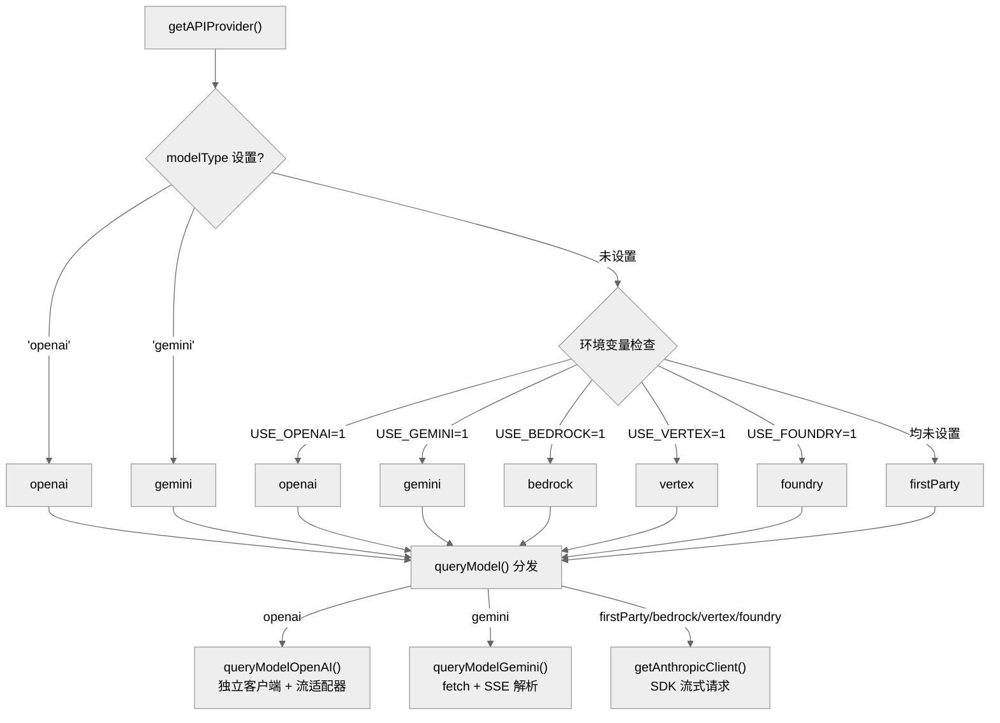
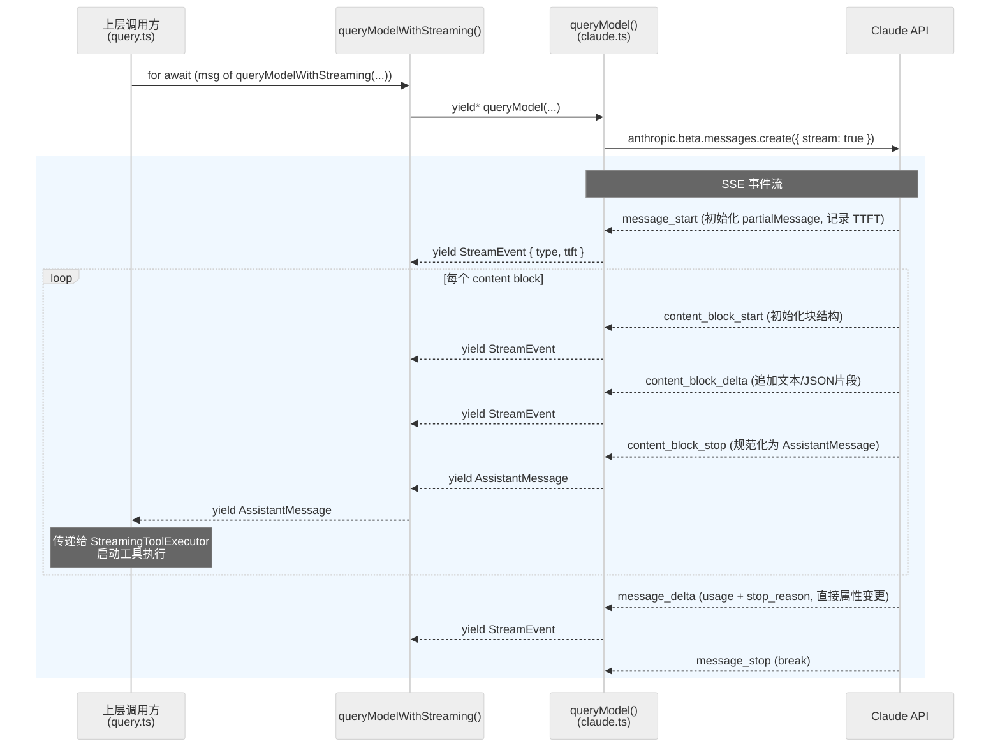

# 第3章 API层与流式处理

Claude Code 的 API 层负责将用户输入发送到模型后端并以流式方式接收响应。这一层的核心设计决策是：直接消费原始 SSE 事件流（`BetaRawMessageStreamEvent`），在流式接收过程中即时启动工具执行，以及通过多 Provider 架构支持 Anthropic 直连、Bedrock、Vertex、Foundry、OpenAI 兼容端点和 Gemini 等多种后端。

本章依次覆盖：Provider 分发与客户端工厂、SSE 事件驱动模型、StreamingToolExecutor 并发控制、OpenAI/Gemini 适配层、重试策略矩阵，以及 Prompt Cache 与可观测性。

---

## 1. 多 Provider 架构与请求分发

### 1.1 Provider 选择逻辑

系统支持六种 Provider 类型：`firstParty`（Anthropic 直连）、`bedrock`、`vertex`、`foundry`、`openai`、`gemini`。选择逻辑集中在 `src/utils/model/providers.ts` 的 `getAPIProvider()` 函数中，按以下优先级判定：

1. **`modelType` 设置**（最高优先级）：用户配置中的 `modelType` 字段。`modelType === 'openai'` 返回 `openai`，`modelType === 'gemini'` 返回 `gemini`。
2. **环境变量**：依次检查 `CLAUDE_CODE_USE_BEDROCK`、`CLAUDE_CODE_USE_VERTEX`、`CLAUDE_CODE_USE_FOUNDRY`、`CLAUDE_CODE_USE_OPENAI`、`CLAUDE_CODE_USE_GEMINI`。
3. **默认**：上述均不匹配时返回 `firstParty`。

注意 OpenAI 和 Gemini 各有两条启用路径：通过 `modelType` 设置（优先级高于环境变量），或者通过各自的 `CLAUDE_CODE_USE_*` 环境变量。

```
getAPIProvider() 选择顺序:

modelType='openai'  ─── openai
modelType='gemini'  ─── gemini
USE_BEDROCK=1       ─── bedrock
USE_VERTEX=1        ─── vertex
USE_FOUNDRY=1       ─── foundry
USE_OPENAI=1        ─── openai
USE_GEMINI=1        ─── gemini
(default)           ─── firstParty
```



### 1.2 请求分发点：queryModelWithStreaming

所有 API 调用的统一入口是 `claude.ts:766` 的 `queryModelWithStreaming()` 函数，签名为：

```typescript
export async function* queryModelWithStreaming({
  messages, systemPrompt, thinkingConfig, tools, signal, options,
}): AsyncGenerator<StreamEvent | AssistantMessage | SystemAPIErrorMessage, void>
```

该函数内部调用 `queryModel()`（`claude.ts:1031`），后者完成消息归一化、工具 schema 构建、媒体裁剪等共享预处理后，在 `claude.ts:1334-1351` 处根据 `getAPIProvider()` 结果分发到不同的后端：

- **OpenAI**：`yield* queryModelOpenAI(...)` — 动态导入 `./openai/index.js`
- **Gemini**：`yield* queryModelGemini(...)` — 动态导入 `./gemini/index.js`
- **Anthropic 系（firstParty/Bedrock/Vertex/Foundry）**：继续执行 `queryModel()` 后续的 Anthropic 特有逻辑（betas 头、thinking 配置、cache control 等），最终通过 `getAnthropicClient()` 创建客户端并发起流式请求

关键区分：OpenAI 和 Gemini 拥有独立的客户端实现，**不经过** `getAnthropicClient()`。Bedrock、Vertex、Foundry 通过 `getAnthropicClient()` 创建各自的 SDK 客户端并以 `as unknown as Anthropic` 类型断言返回——代码注释直言"we have always been lying about the return type"。

### 1.3 Anthropic 客户端工厂

`src/services/api/client.ts`（389 行）的 `getAnthropicClient()` 根据环境变量动态创建 SDK 客户端：

| Provider | SDK | 加载方式 | 认证方式 |
|----------|-----|---------|---------|
| firstParty | `Anthropic` | 直接实例化 | API Key / OAuth |
| Bedrock | `AnthropicBedrock` | `await import('@anthropic-ai/bedrock-sdk')` | AWS 默认凭证 / Bearer Token |
| Vertex | `AnthropicVertex` | `await import('@anthropic-ai/vertex-sdk')` | Google Cloud 默认凭证 |
| Foundry | `AnthropicFoundry` | `await import('@anthropic-ai/foundry-sdk')` | Azure AD Token / API Key |

动态 `await import()` 按需加载 SDK，避免用户不使用的 Provider 包进入启动路径。Bedrock 还支持按模型分区域（`ANTHROPIC_SMALL_FAST_MODEL_AWS_REGION`）。

### 1.4 buildFetch 请求包装器

`client.ts:360` 的 `buildFetch()` 为 firstParty 请求注入 `x-client-request-id` 头（`randomUUID()` 生成），使得即使请求因超时未返回服务端 request ID，也能在日志中关联客户端和服务端记录。该注入仅在 `getAPIProvider() === 'firstParty'` 且 base URL 指向 Anthropic 官方域名时启用，避免向第三方代理发送未知 header。

---

## 2. SSE 事件驱动模型

### 2.1 原始事件消费

Claude Code 选择直接消费 `BetaRawMessageStreamEvent` 而非使用 SDK 的高级 `BetaMessageStream` 包装器。代码通过 `anthropic.beta.messages.create({ stream: true })` 获取原始事件流，然后在 `queryModel()` 内部的 `for await (const part of stream)` 循环（`claude.ts:1976`）中逐事件处理。

这种设计给予了对流式过程的完全控制：可以在任意事件点执行副作用（记录 TTFT、启动工具执行、发射遥测），同时避免了高级包装器可能带来的额外开销。

### 2.2 事件类型与处理



流式响应遵循严格的时序：`message_start` -> `content_block_start` / `content_block_delta` / `content_block_stop` (重复) -> `message_delta` -> `message_stop`。每种事件在 `claude.ts` 的 `switch (part.type)` 中被处理：

**message_start**（`claude.ts:2016`）：初始化 `partialMessage` 状态，记录 TTFT（`Date.now() - start`），提取初始 usage 信息。

**content_block_start**（`claude.ts:2031`）：根据块类型初始化数据结构。支持的块类型包括：
- `text`：初始化空文本（避免 SDK 重复文本问题）
- `thinking`：初始化空 thinking 和 signature 字段
- `tool_use`：input 初始化为空字符串以接收后续 JSON 片段
- `server_tool_use`：同上，特别处理 advisor 工具

**content_block_delta**（`claude.ts:2089`）：按 delta 类型追加内容。每种 delta 类型都有严格的类型匹配验证：
- `text_delta` 只能应用于 `text` 块
- `thinking_delta` 只能应用于 `thinking` 块
- `input_json_delta` 只能应用于 `tool_use` / `server_tool_use` 块
- `signature_delta` 应用于 `thinking` 块（启用 `CONNECTOR_TEXT` feature 时也可应用于 `connector_text` 块）
- `connector_text_delta`：feature-gated，需要 `CONNECTOR_TEXT` 启用
- `citations_delta`：目前标记为 TODO

任何类型不匹配都会触发 `tengu_streaming_error` 遥测事件并抛出异常，防止状态污染。

**content_block_stop**（`claude.ts:2207` 附近）：将累积的内容块规范化为 `AssistantMessage` 对象，注入元数据（request ID、timestamp、research 数据等），通过 generator `yield` 传递到上层。

**message_delta**（`claude.ts:2249`）：携带最终的 usage 统计和 `stop_reason`。系统通过**直接属性变更**（而非对象替换）将这些信息回写到已 yield 的消息对象。这是一个关键的实现细节——代码注释明确解释：transcript 写队列持有消息引用并以 100ms 间隔延迟序列化，对象替换会断开引用导致数据丢失。

**message_stop**（`claude.ts:2331`）：简单 break，不做额外处理。

### 2.3 累积器与双 yield 策略

内容累积使用数组索引访问（`contentBlocks[part.index]`），直接映射 API 的事件序号。如果 delta 引用了不存在的索引，系统抛出 `RangeError`。

工具参数的 JSON 片段在流式过程中仅做字符串拼接，不进行 JSON 解析——完整解析推迟到 `content_block_stop` 时，避免了流式过程中的重复解析开销。

流式循环在每个事件后 yield 一个 `StreamEvent`（`claude.ts:2335-2339`，携带原始事件和可能的 TTFT），在每个 `content_block_stop` 时 yield 一个完整的 `AssistantMessage`。前者驱动实时 UI 更新，后者用于 transcript 记录和工具执行配对。

---

## 3. StreamingToolExecutor 并发控制

### 3.1 核心设计

`src/services/tools/StreamingToolExecutor.ts`（530 行）实现了流式工具执行的并发控制。当 `content_block_stop` 时 yield 出 `AssistantMessage` 后，上层代码（`query.ts`）调用 `StreamingToolExecutor.addTool()` 将工具加入执行队列。`addTool()` 内部立即调用 `void this.processQueue()` 尝试启动执行，实现了"边接收边执行"的流水线并行。

### 3.2 并发安全分类

每个 `TrackedTool` 有一个 `isConcurrencySafe` 属性，由工具定义的 `isConcurrencySafe(parsedInput.data)` 谓词计算。这决定了该工具是否可以与其他工具同时执行。

`canExecuteTool()` 的判定规则（`StreamingToolExecutor.ts:129-134`）：

1. 如果没有正在执行的工具，任何工具都可以立即启动
2. 如果新工具是并发安全的，且所有正在执行的工具也都是并发安全的，则可以并行执行
3. 否则排队等待

非并发安全的工具永远不会与其他工具同时执行——这保证了文件写入、Shell 命令等操作的独占性。

### 3.3 结果排序与兄弟取消

虽然工具可以并发执行完成顺序不确定，但 `getCompletedResults()` 按 `tools` 数组顺序遍历，确保结果按工具在响应中出现的顺序返回。

**兄弟取消机制**：当一个 Bash 工具执行失败时（且仅限 Bash 工具，`StreamingToolExecutor.ts:358-363` 检查 `block.name === BASH_TOOL_NAME`），系统通过 `siblingAbortController` 取消所有正在执行的兄弟工具，生成 "Cancelled: parallel tool call errored" 错误消息。该 AbortController 是 `toolUseContext.abortController` 的子控制器，取消兄弟不会终止父级查询。

### 3.4 工具状态生命周期

每个工具经历四个状态：`queued` -> `executing` -> `completed` -> `yielded`。额外机制包括：
- `discard()`：流式回退时丢弃所有待处理结果
- `pendingProgress`：进度消息独立缓冲，立即 yield 而不等待工具完成
- 取消原因区分 `user_interrupted` 和 `streaming_fallback`

---

## 4. OpenAI 兼容层

### 4.1 架构总览

OpenAI 兼容层（`src/services/api/openai/`，6 个源文件共约 998 行）通过适配器模式支持任意 OpenAI Chat Completions 协议端点（Ollama、DeepSeek、vLLM 等）。

启用方式：`CLAUDE_CODE_USE_OPENAI=1` 环境变量，或 `modelType: 'openai'` 设置。

分发时机：在 `queryModel()` 完成共享预处理（消息归一化、工具过滤、媒体裁剪）之后、Anthropic 特有逻辑（betas 头、thinking 配置、cache control）之前，通过 `yield* queryModelOpenAI(...)` 进入独立处理路径。

### 4.2 独立客户端

`openai/client.ts` 的 `getOpenAIClient()` 创建并缓存 `OpenAI` SDK 实例。关键环境变量：

| 变量 | 用途 |
|-----|------|
| `OPENAI_API_KEY` | API 密钥 |
| `OPENAI_BASE_URL` | 端点 URL（如 `http://localhost:11434/v1`）|
| `OPENAI_ORG_ID` | 组织 ID（可选）|
| `OPENAI_PROJECT_ID` | 项目 ID（可选）|

### 4.3 模型名映射

`openai/modelMapping.ts` 的 `resolveOpenAIModel()` 将 Anthropic 模型名转换为 OpenAI 模型名，优先级：

1. `OPENAI_MODEL`：全局覆盖
2. `OPENAI_DEFAULT_{FAMILY}_MODEL`：按模型族（haiku/sonnet/opus）配置
3. `ANTHROPIC_DEFAULT_{FAMILY}_MODEL`：向后兼容
4. 内置默认映射表（如 `claude-sonnet-4-*` -> `gpt-4o`，`claude-opus-4-*` -> `o3`）
5. 原样返回模型名

### 4.4 消息与工具转换

`convertMessages.ts` 将 Anthropic 消息格式转为 OpenAI 格式，`convertTools.ts` 转换工具 schema。这些转换在 `queryModelOpenAI()` 内部完成，对下游透明。

### 4.5 流适配器

`openai/streamAdapter.ts`（314 行）是兼容层的核心，将 OpenAI SSE 流转换回 `BetaRawMessageStreamEvent` 序列，使下游的事件处理循环（包括 `content_block_stop` 时的 `AssistantMessage` 构建）完全不需要修改。

关键映射：

| OpenAI | Anthropic |
|--------|-----------|
| `finish_reason: "stop"` | `stop_reason: "end_turn"` |
| `finish_reason: "tool_calls"` | `stop_reason: "tool_use"` |
| `finish_reason: "length"` | `stop_reason: "max_tokens"` |
| `delta.reasoning_content` | thinking 块 |
| `delta.tool_calls` | tool_use 块 |

**tool_use 强制逻辑**（`streamAdapter.ts:264-265`）：某些后端在存在 tool_calls 时仍然返回 `finish_reason: "stop"` 而非 `"tool_calls"`。适配器在发现存在 tool blocks 时会强制使用 `tool_use` 作为 stop_reason，确保查询循环正确执行工具。

---

## 5. Gemini 兼容层

### 5.1 架构总览

Gemini 兼容层（`src/services/api/gemini/`，7 个源文件共约 1238 行）支持 Google Gemini API。与 OpenAI 层类似，它拥有完全独立的客户端和环境变量体系。

启用方式：`CLAUDE_CODE_USE_GEMINI=1` 环境变量，或 `modelType: 'gemini'` 设置。

### 5.2 独立客户端

与 OpenAI 使用 SDK 不同，Gemini 客户端（`gemini/client.ts`）直接通过 `fetch` 发起 HTTP 请求到 Gemini 的 `streamGenerateContent` SSE 端点。`streamGeminiGenerateContent()` 是一个 `AsyncGenerator<GeminiStreamChunk, void>`，手动解析 SSE 帧。

默认 base URL 为 `https://generativelanguage.googleapis.com/v1beta`，可通过 `GEMINI_BASE_URL` 覆盖。认证通过 `x-goog-api-key` header 注入 `GEMINI_API_KEY`。

### 5.3 模型名映射

`gemini/modelMapping.ts` 的 `resolveGeminiModel()` 优先级：

1. `GEMINI_MODEL`：全局覆盖
2. `GEMINI_DEFAULT_{FAMILY}_MODEL`：按模型族配置
3. `ANTHROPIC_DEFAULT_{FAMILY}_MODEL`：向后兼容 fallback
4. **无匹配时 throw Error**（非原样返回）

这与 OpenAI 层不同。OpenAI 层在没有匹配时会原样返回模型名，而 Gemini 层要求必须通过环境变量显式配置模型映射。错误消息明确提示需要设置哪些变量。

### 5.4 消息与流转换

`gemini/convertMessages.ts` 和 `gemini/convertTools.ts` 处理格式转换。`gemini/streamAdapter.ts`（244 行）将 Gemini 的流式响应转换为 Anthropic 事件格式，模式与 OpenAI 适配器一致。`gemini/index.ts` 的 `queryModelGemini()` 编排整个流程，对外 yield `AssistantMessage` 和 `StreamEvent`。

---

## 6. 重试策略矩阵

### 6.1 withRetry 架构

`src/services/api/withRetry.ts`（822 行）实现了 API 请求的重试逻辑。函数返回类型为 `AsyncGenerator<SystemAPIErrorMessage, T>`，允许在重试等待期间 yield 系统消息通知上层。

### 6.2 错误类型与处理策略

| 错误类型 | 策略 | 关键代码 |
|---------|------|---------|
| **429 速率限制** | 读取 `retry-after` header，指数退避重试 | 前台查询重试 |
| **529 过载（前台）** | 最多 `MAX_529_RETRIES`(=3) 次重试后触发 fallback | 行335-351 |
| **529 过载（后台）** | 立即放弃（`CannotRetryError`）| 行318-324 |
| **401 未授权** | 强制刷新 OAuth token 后重试 | 行241-248 |
| **403 Token 已撤销** | `isOAuthTokenRevokedError()` 检查 | 行236 |
| **400 上下文溢出** | 减小 `max_tokens` 后重试 | 行388-419 |
| **ECONNRESET/EPIPE** | 禁用 keep-alive 后重试 | 行220-230 |

### 6.3 前台/后台分类

`FOREGROUND_529_RETRY_SOURCES` 白名单定义了哪些查询源视为"前台"（用户正在等待结果）。白名单包括 `repl_main_thread`（及其 outputStyle 变体）、`sdk`、`agent:*`、`compact`、`hook_agent`、`hook_prompt`、`verification_agent`、`side_question`、`auto_mode` 等。白名单外的源（如标题生成、建议、分类器）在 529 时立即失败，避免在容量级联时放大网关压力。

### 6.4 529 降级机制

当前台查询累计 529 错误达到 `MAX_529_RETRIES`(=3) 次时，如果 `options.fallbackModel` 已配置，系统抛出 `FallbackTriggeredError` 触发模型降级。fallbackModel 是**可配置的**（通过调用方传入），而非硬编码为特定模型。降级仅在非订阅者且使用非自定义 Opus 模型时触发。

### 6.5 持久重试模式

通过 `CLAUDE_CODE_UNATTENDED_RETRY` 环境变量启用，专为 CI/CD 等无人值守场景设计：

| 参数 | 值 |
|------|---|
| 最大退避 | 5 分钟（`PERSISTENT_MAX_BACKOFF_MS`）|
| 总运行上限 | 6 小时（`PERSISTENT_RESET_CAP_MS`）|
| 心跳间隔 | 30 秒（`HEARTBEAT_INTERVAL_MS`）|

心跳通过 yield `SystemAPIErrorMessage` 实现，防止宿主环境因空闲而终止会话。

### 6.6 Fast Mode 重试分支

Fast Mode 请求有独立的重试逻辑：
- 短 retry-after（< 20 秒，`SHORT_RETRY_THRESHOLD_MS`）：直接等待后重试
- 长或缺失 retry-after：进入冷却期，下限 10 分钟（`MIN_COOLDOWN_MS`）

---

## 7. 流式监控与健壮性

### 7.1 空闲超时看门狗

通过 `CLAUDE_ENABLE_STREAM_WATCHDOG` 环境变量启用（`claude.ts:1910`）。当流式过程中超过配置的空闲时间（`CLAUDE_STREAM_IDLE_TIMEOUT_MS`，默认 90 秒）未接收到任何事件时，系统强制释放流资源并触发非流式降级重试。

看门狗实现分级警告：空闲时间达到阈值一半时记录警告日志（`STREAM_IDLE_WARNING_MS = timeout / 2`），达到完整阈值时记录错误并发射 `tengu_streaming_idle_timeout` 遥测事件。

### 7.2 流式停滞检测

与看门狗互补，停滞检测在**下一个事件到达时**回顾性检查事件间隔（`claude.ts:1972`，`STALL_THRESHOLD_MS = 30_000`）。系统记录每次停滞的持续时间、总停滞次数和累计停滞时间，在流式完成后以 `tengu_streaming_stall_summary` 遥测事件汇总发射。

区别：看门狗用 `setTimeout` 主动检测静默连接丢失并采取行动（中止流）；停滞检测被动记录延迟指标用于事后分析，不中断流。

### 7.3 资源释放

无论流式循环是正常完成、被错误中断还是被看门狗超时中止，`clearStreamIdleTimers()` 和 `releaseStreamResources()` 确保定时器被清除、Response body 流被释放、SDK 的 Stream 资源被回收，防止原生 TLS 缓冲区等非堆内存泄漏。

---

## 8. Prompt Cache 与成本追踪

### 8.1 Cache Control

`claude.ts:345` 的 `getCacheControl()` 函数决定缓存策略：

- **基础**：所有请求使用 `type: 'ephemeral'` 缓存
- **1 小时 TTL**：当 `should1hCacheTTL()` 返回 true 时启用。条件包括：用户是 ant 员工或订阅者（在 GrowthBook 配置的 allowlist 范围内），或者 Bedrock 用户通过 `ENABLE_PROMPT_CACHING_1H_BEDROCK` 显式启用
- **全局 scope**：`scope === 'global'` 时附加
- **锁存机制**：`setPromptCache1hEligible()` 将 1h 缓存资格锁存到 bootstrap state，防止 GrowthBook 磁盘缓存中途更新导致同一会话内 TTL 混用

### 8.2 Cache Break 检测

`src/services/api/promptCacheBreakDetection.ts` 跟踪并分析缓存失效原因。当工具 schema 变化、系统提示更新等事件导致缓存失效时，记录详细信息用于优化。

### 8.3 Token 计量

Token 数据来自 `message_delta` 事件的 usage 字段（`claude.ts:2250` 调用 `updateUsage()`）。最终 usage 通过直接属性变更回写到已 yield 的消息对象。TTFT 在 `message_start` 时记录。

成本计算使用 `calculateUSDCost()` 结合模型信息和 usage 数据，结果通过 `addToTotalSessionCost()` 累加到会话级别。

---

## 9. 与对话循环的集成

### 9.1 Generator 链

整个 API 层通过 `AsyncGenerator` 链连接：

```
queryModelWithStreaming()           -- 公开入口
  └── withStreamingVCR()            -- VCR 录制/回放（调试用）
        └── queryModel()            -- 共享预处理 + Provider 分发
              ├── queryModelOpenAI()     -- OpenAI 路径
              ├── queryModelGemini()     -- Gemini 路径
              └── for await (stream)     -- Anthropic 流式循环
```

上层 `query.ts` 通过 `for await (const msg of queryModelWithStreaming(...))` 消费事件，将 `AssistantMessage` 传递给 `StreamingToolExecutor`，工具结果追加到消息历史后发起下一轮查询，形成 Agentic 循环。

### 9.2 客户端取消

`AbortController` 贯穿整个流式处理链。用户按下 Escape 或系统检测到需要中止时，`AbortSignal` 传播到 API 客户端取消底层 HTTP 请求，同时所有资源（流、定时器、工具执行）被清理。

---

## 10. 环境变量速查

| 环境变量 | 默认值 | 用途 |
|---------|--------|------|
| `CLAUDE_CODE_USE_BEDROCK` | - | 启用 Bedrock Provider |
| `CLAUDE_CODE_USE_VERTEX` | - | 启用 Vertex Provider |
| `CLAUDE_CODE_USE_FOUNDRY` | - | 启用 Foundry (Azure) Provider |
| `CLAUDE_CODE_USE_OPENAI` | - | 启用 OpenAI 兼容 Provider |
| `CLAUDE_CODE_USE_GEMINI` | - | 启用 Gemini Provider |
| `OPENAI_API_KEY` | - | OpenAI API 密钥 |
| `OPENAI_BASE_URL` | - | OpenAI 端点 URL |
| `OPENAI_MODEL` | - | 全局覆盖 OpenAI 模型名 |
| `GEMINI_API_KEY` | - | Gemini API 密钥 |
| `GEMINI_BASE_URL` | googleapis 默认 | Gemini 端点 URL |
| `GEMINI_MODEL` | - | 全局覆盖 Gemini 模型名 |
| `CLAUDE_ENABLE_STREAM_WATCHDOG` | false | 启用流式空闲超时看门狗 |
| `CLAUDE_STREAM_IDLE_TIMEOUT_MS` | 90000 | 流式空闲超时阈值（毫秒）|
| `CLAUDE_CODE_UNATTENDED_RETRY` | - | 启用持久重试模式 |
| `API_TIMEOUT_MS` | 600000 | API 请求总超时 |
| `ENABLE_PROMPT_CACHING_1H_BEDROCK` | - | Bedrock 用户启用 1h 缓存 TTL |

---

## 参考来源

| 文件 | 行数 | 说明 |
|------|------|------|
| `src/services/api/claude.ts` | 3455 | 核心 API 查询、流式事件处理 |
| `src/services/api/client.ts` | 389 | Anthropic 客户端工厂、buildFetch |
| `src/services/api/withRetry.ts` | 822 | 重试策略矩阵 |
| `src/services/tools/StreamingToolExecutor.ts` | 530 | 流式工具并发控制 |
| `src/services/api/openai/` | ~998 | OpenAI 兼容层 |
| `src/services/api/gemini/` | ~1238 | Gemini 兼容层 |
| `src/utils/model/providers.ts` | 52 | Provider 选择逻辑 |
| `src/services/api/promptCacheBreakDetection.ts` | - | 缓存失效检测 |
