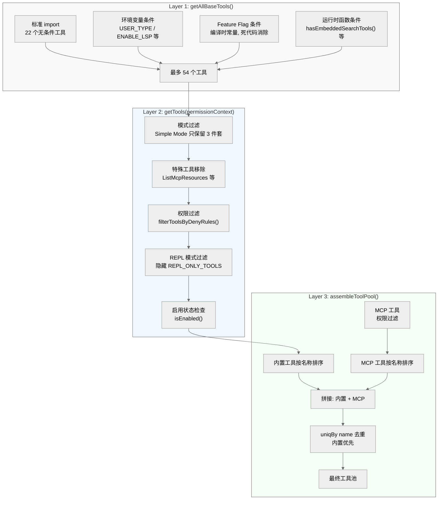
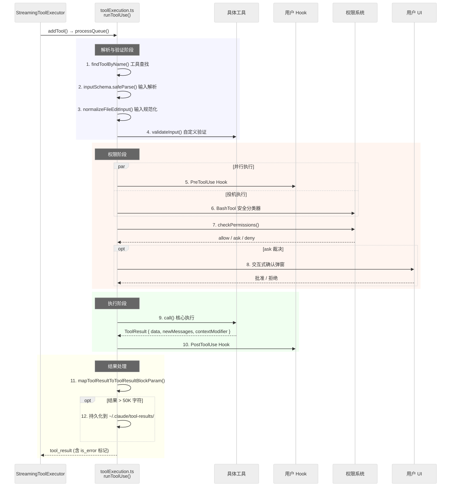

# 第 4 章：工具系统

> Claude Code 的工具系统是智能体能力的核心基础设施——它决定了模型能"做"什么。本章从类型定义出发，沿着工具注册、组装、过滤、执行的完整链路，深入解析 52 个工具目录背后的工程架构，并重点剖析代码编辑策略的设计哲学。

## 4.1 工具类型系统

工具系统的类型架构建立在三个核心抽象之上：**Tool**、**ToolDef** 和 **buildTool**。

### Tool 接口

`Tool<Input, Output, P>` 定义在 `src/Tool.ts`（792 行），是一个包含 **47 个字段/方法**的完整工具接口。三个泛型参数分别约束输入 Schema（Zod 类型）、输出类型和进度数据类型。这些字段按职责可分为六个域：

| 域 | 字段 | 说明 |
|---|---|---|
| **身份** | `name`, `aliases`, `searchHint`, `mcpInfo` | 工具名称、别名（重命名兼容）、搜索关键词、MCP 来源信息 |
| **Schema** | `inputSchema`, `inputJSONSchema`, `outputSchema`, `strict` | Zod schema、JSON Schema（MCP 工具）、输出 schema、严格模式 |
| **核心执行** | `call`, `validateInput`, `checkPermissions`, `description`, `prompt` | 执行逻辑、输入验证、权限检查、描述生成、提示生成 |
| **行为标记** | `isConcurrencySafe`, `isReadOnly`, `isDestructive`, `isEnabled`, `interruptBehavior`, `isSearchOrReadCommand`, `isOpenWorld`, `requiresUserInteraction`, `isMcp`, `isLsp`, `shouldDefer`, `alwaysLoad` | 并发安全、只读、破坏性、启用状态、中断行为、搜索/读取命令、延迟加载等 |
| **UI 渲染** | `renderToolUseMessage`, `renderToolResultMessage`, `renderToolUseProgressMessage`, `renderToolUseQueuedMessage`, `renderToolUseRejectedMessage`, `renderToolUseErrorMessage`, `renderGroupedToolUse`, `renderToolUseTag`, `isResultTruncated`, `extractSearchText` | 调用展示、结果展示、进度、队列、拒绝、错误、分组、标签、截断判断、搜索文本提取 |
| **辅助** | `inputsEquivalent`, `backfillObservableInput`, `getPath`, `preparePermissionMatcher`, `userFacingName`, `userFacingNameBackgroundColor`, `isTransparentWrapper`, `getToolUseSummary`, `getActivityDescription`, `toAutoClassifierInput`, `mapToolResultToToolResultBlockParam`, `maxResultSizeChars` | 输入等价判断、可观测输入回填、路径提取、权限匹配器、用户名称、分类器输入、结果序列化、结果大小限制 |

`call()` 方法是核心执行入口，签名包含五个参数：解析后的输入、`ToolUseContext` 上下文（含 AbortController、状态读写、文件缓存、MCP 客户端等）、权限检查函数、父消息引用和可选的进度回调。返回类型 `ToolResult<Output>` 包含 `data`（输出数据）、`newMessages`（注入的新消息）、`contextModifier`（上下文修改器，仅对非并发安全工具生效）和 `mcpMeta`。

### ToolDef 与 buildTool

**ToolDef** 是 Tool 的部分定义类型——开发者只需实现核心功能，其余由系统填充。这通过 **buildTool** 工厂函数实现：

```typescript
export function buildTool<D extends AnyToolDef>(def: D): BuiltTool<D> {
  return { ...TOOL_DEFAULTS, userFacingName: () => def.name, ...def } as BuiltTool<D>
}
```

`TOOL_DEFAULTS` 集中定义了所有可缺省方法的安全默认值，遵循 **fail-closed** 原则：

| 默认字段 | 默认值 | 安全含义 |
|---------|--------|---------|
| `isEnabled` | `true` | 工具默认可用 |
| `isConcurrencySafe` | `false` | 假设不安全，串行执行 |
| `isReadOnly` | `false` | 假设有副作用，需要权限 |
| `isDestructive` | `false` | 默认非破坏性 |
| `checkPermissions` | `{ behavior: 'allow' }` | 委托给通用权限系统 |
| `toAutoClassifierInput` | `''` | 跳过安全分类器 |
| `userFacingName` | `def.name` | 使用工具名 |

这种设计确保即使开发者忽略了某些方法，系统也不会产生安全漏洞——`isConcurrencySafe` 默认 false 意味着未声明并发安全的工具不会被并行调用，`isReadOnly` 默认 false 意味着未声明只读的工具需要经过权限检查。

## 4.2 工具池组装管线

工具从定义到可用经历三层组装：`getAllBaseTools()` → `getTools()` → `assembleToolPool()`。三者定义在 `src/tools.ts`（387 行）。



### Layer 1：getAllBaseTools()

这是所有内置工具的**单一事实来源**，返回一个包含最多 **54 个工具**的数组（当所有条件分支全部启用时）。函数通过三种机制控制工具的包含：

- **标准 import**（无条件加载）：AgentTool、BashTool、FileReadTool、FileEditTool、FileWriteTool、NotebookEditTool、WebFetchTool、WebSearchTool、TodoWriteTool、TaskOutputTool、TaskStopTool、AskUserQuestionTool、SkillTool、EnterPlanModeTool、ExitPlanModeV2Tool、SendMessageTool、CronCreateTool/CronDeleteTool/CronListTool、BriefTool、ListMcpResourcesTool、ReadMcpResourceTool（共 22 个）
- **环境变量条件**：`process.env.USER_TYPE === 'ant'` 控制 ConfigTool、TungstenTool、REPLTool、SuggestBackgroundPRTool；`ENABLE_LSP_TOOL` 控制 LSPTool；`CLAUDE_CODE_VERIFY_PLAN` 控制 VerifyPlanExecutionTool；`NODE_ENV === 'test'` 控制 TestingPermissionTool
- **Feature flag 条件**：`feature('FLAG')` 返回编译时常量，控制 WebBrowserTool、MonitorTool、SleepTool、SnipTool、WorkflowTool、OverflowTestTool、CtxInspectTool、TerminalCaptureTool、ListPeersTool、RemoteTriggerTool、SendUserFileTool、PushNotificationTool、SubscribePRTool 等
- **运行时函数条件**：`hasEmbeddedSearchTools()` 控制 GlobTool/GrepTool；`isPowerShellToolEnabled()` 控制 PowerShellTool；`isWorktreeModeEnabled()` 控制 EnterWorktreeTool/ExitWorktreeTool；`isTodoV2Enabled()` 控制 TaskCreateTool/TaskGetTool/TaskUpdateTool/TaskListTool；`isAgentSwarmsEnabled()` 控制 TeamCreateTool/TeamDeleteTool；`isToolSearchEnabledOptimistic()` 控制 ToolSearchTool

Feature flag 通过 `import { feature } from 'bun:bundle'` 使用，是 Bun 编译时宏。当 flag 为 false 时，对应的 `require()` 分支在构建时被死代码消除，使得未启用工具的代码不会进入最终产物。

### Layer 2：getTools(permissionContext)

在 getAllBaseTools 基础上应用多层过滤：

1. **模式过滤**：Simple Mode（`CLAUDE_CODE_SIMPLE=true`）时只保留 BashTool、FileReadTool、FileEditTool 三件套（如果同时处于 REPL 模式则只保留 REPLTool；如果同时处于 Coordinator Mode 则额外加入 AgentTool、TaskStopTool、SendMessageTool）
2. **特殊工具移除**：过滤掉 ListMcpResourcesTool、ReadMcpResourceTool、SyntheticOutputTool（这些通过其他路径有条件地加入）
3. **权限过滤**：`filterToolsByDenyRules()` 检查 blanket deny 规则，完全移除被禁止的工具（包括支持 `mcp__<server>__*` 通配符禁止整个 MCP 服务器）
4. **REPL 模式过滤**：当 REPL 工具启用时，隐藏 `REPL_ONLY_TOOLS` 集合中的基础工具（它们在 REPL 虚拟机内部访问）
5. **启用状态检查**：调用每个工具的 `isEnabled()` 方法，移除当前环境不可用的工具

这种**提前过滤**设计确保模型在生成提示时就看不到被禁止的工具，而非在调用时才拒绝。

### Layer 3：assembleToolPool(permissionContext, mcpTools)

最终组装环节，合并内置工具和 MCP 工具：

```
内置工具（getTools获取 → 按名称排序）
  + MCP工具（权限过滤 → 按名称排序）
  → uniqBy('name') 去重（内置优先）
  → 最终工具池
```

关键设计决策是**分区排序**：内置工具和 MCP 工具分别排序后拼接，而非混合排序。这保证了内置工具作为连续前缀存在，避免 MCP 工具插入导致 API 端的 prompt cache 失效。`uniqBy` 保持插入顺序，因此同名冲突时内置工具优先。

## 4.3 工具全景分类表

基于 `src/tools/` 目录（52 个工具目录）和 `getAllBaseTools()` 注册情况的完整分类：

### 文件操作

| 工具 | 加载条件 | 说明 |
|------|---------|------|
| FileReadTool | 无条件 | 文件读取（文本/图片/PDF/Notebook），25K token 预算，mtime 去重 |
| FileEditTool | 无条件 | search-and-replace 编辑，唯一性约束，引号标准化 |
| FileWriteTool | 无条件 | 全文件写入，始终 LF 换行，创建新文件或完整重写 |
| NotebookEditTool | 无条件 | Jupyter Notebook cell 级编辑（replace/insert/delete） |

### Shell 执行

| 工具 | 加载条件 | 说明 |
|------|---------|------|
| BashTool | 无条件 | Shell 命令执行，2592 行安全检查（bashSecurity.ts），Tree-sitter AST 解析 |
| PowerShellTool | `isPowerShellToolEnabled()` | Windows PowerShell 执行，共享 BashTool 的沙箱机制 |

### 搜索导航

| 工具 | 加载条件 | 说明 |
|------|---------|------|
| GlobTool | `!hasEmbeddedSearchTools()` | 基于 ripgrep `--files` 的文件名搜索，默认 100 结果上限 |
| GrepTool | `!hasEmbeddedSearchTools()` | 基于 ripgrep 的内容搜索，三种输出模式，默认 250 行上限 |
| ToolSearchTool | `isToolSearchEnabledOptimistic()` | 延迟加载工具的按需搜索，加权评分（工具名 10-12 分，searchHint 4 分，描述 2 分） |
| LSPTool | `ENABLE_LSP_TOOL` env | 语言服务器协议工具 |

### Agent 与任务管理

| 工具 | 加载条件 | 说明 |
|------|---------|------|
| AgentTool | 无条件 | 多 Agent 架构核心，支持同步/异步/队友/远程模式 |
| TaskOutputTool | 无条件 | 子 Agent 输出返回（Agent 自身禁止使用） |
| TaskStopTool | 无条件 | 停止后台任务 |
| SendMessageTool | 无条件 | 向对等节点发送消息 |
| TaskCreateTool | `isTodoV2Enabled()` | Todo v2 任务创建 |
| TaskGetTool | `isTodoV2Enabled()` | Todo v2 任务查询 |
| TaskUpdateTool | `isTodoV2Enabled()` | Todo v2 任务更新 |
| TaskListTool | `isTodoV2Enabled()` | Todo v2 任务列表 |
| TeamCreateTool | `isAgentSwarmsEnabled()` | 创建 Agent 团队 |
| TeamDeleteTool | `isAgentSwarmsEnabled()` | 删除 Agent 团队 |

### 定时任务

| 工具 | 加载条件 | 说明 |
|------|---------|------|
| CronCreateTool | 无条件（require） | 创建定时任务 |
| CronDeleteTool | 无条件（require） | 删除定时任务 |
| CronListTool | 无条件（require） | 列出定时任务 |

### 计划与工作流

| 工具 | 加载条件 | 说明 |
|------|---------|------|
| EnterPlanModeTool | 无条件 | 进入计划模式 |
| ExitPlanModeV2Tool | 无条件 | 退出计划模式 |
| TodoWriteTool | 无条件 | 旧版 Todo 写入 |
| VerifyPlanExecutionTool | `CLAUDE_CODE_VERIFY_PLAN` env | 计划执行验证 |
| WorkflowTool | `feature('WORKFLOW_SCRIPTS')` | 工作流脚本执行 |

### Web 与外部

| 工具 | 加载条件 | 说明 |
|------|---------|------|
| WebFetchTool | 无条件 | URL 内容抓取 |
| WebSearchTool | 无条件 | 网页搜索 |
| WebBrowserTool | `feature('WEB_BROWSER_TOOL')` | 浏览器自动化 |

### MCP 集成

| 工具 | 加载条件 | 说明 |
|------|---------|------|
| MCPTool | 模板（运行时实例化） | MCP 工具模板，动态覆盖 call/description/prompt |
| ListMcpResourcesTool | 无条件（specialTools 过滤） | 列出 MCP 资源 |
| ReadMcpResourceTool | 无条件（specialTools 过滤） | 读取 MCP 资源 |
| McpAuthTool | 仅目录存在，未注册 | MCP 认证（未在 getAllBaseTools 中） |

### 交互与辅助

| 工具 | 加载条件 | 说明 |
|------|---------|------|
| AskUserQuestionTool | 无条件 | 向用户提问（Agent 禁用） |
| BriefTool | 无条件 | 精简输出模式 |
| SkillTool | 无条件 | 加载 `.claude/skills/` 技能 |
| SleepTool | `feature('PROACTIVE') \|\| feature('KAIROS')` | 主动等待 |
| MonitorTool | `feature('MONITOR_TOOL')` | 系统监控 |
| SendUserFileTool | `feature('KAIROS')` | 发送文件给用户 |
| PushNotificationTool | `feature('KAIROS')` 等 | 推送通知 |
| SnipTool | `feature('HISTORY_SNIP')` | 历史片段裁剪 |
| CtxInspectTool | `feature('CONTEXT_COLLAPSE')` | 上下文检查 |
| TerminalCaptureTool | `feature('TERMINAL_PANEL')` | 终端截取 |
| ListPeersTool | `feature('UDS_INBOX')` | 对等节点列表 |
| RemoteTriggerTool | `feature('AGENT_TRIGGERS_REMOTE')` | 远程触发 |
| SubscribePRTool | `feature('KAIROS_GITHUB_WEBHOOKS')` | PR 订阅 |

### Worktree

| 工具 | 加载条件 | 说明 |
|------|---------|------|
| EnterWorktreeTool | `isWorktreeModeEnabled()` | 进入 Git Worktree 隔离 |
| ExitWorktreeTool | `isWorktreeModeEnabled()` | 退出 Worktree |

### 内部/测试

| 工具 | 加载条件 | 说明 |
|------|---------|------|
| ConfigTool | ant-only | 内部配置 |
| TungstenTool | ant-only | 内部虚拟终端 |
| REPLTool | ant-only | REPL 模式（包裹 Bash/Read/Edit 于 VM 中） |
| SuggestBackgroundPRTool | ant-only | 后台 PR 建议 |
| OverflowTestTool | feature-gated | 溢出测试 |
| TestingPermissionTool | test-only | 测试用权限工具 |
| SyntheticOutputTool | 特殊处理 | 合成输出（不直接进入工具池） |
| DiscoverSkillsTool | 仅目录存在 | 技能发现（未在 getAllBaseTools 中） |
| ReviewArtifactTool | 仅目录存在 | 产物审查（未在 getAllBaseTools 中） |

## 4.4 核心工具详解

### BashTool：安全第一的 Shell 执行

BashTool 是最复杂的内置工具，其安全基础设施规模远超一般预期：

- **bashSecurity.ts**：2592 行，包含 23 个命名安全检查函数，覆盖路径注入、命令注入、环境变量泄露等攻击面
- **bashPermissions.ts**：2621 行，基于 Tree-sitter AST 解析 bash 命令结构（feature flag `TREE_SITTER_BASH` 控制，不可用时回退到正则解析），复合命令拆分为子命令逐一检查（上限 50 个子命令）
- **commandSemantics.ts**：`interpretCommandResult()` 对退出码进行语义理解（而非简单的 0/非0 判断）
- **沙箱**：`shouldUseSandbox()` 控制，macOS 使用 `sandbox-exec`，Linux 使用 bubblewrap (bwrap)
- **自动后台化**：命令阻塞超过 15 秒（`ASSISTANT_BLOCKING_BUDGET_MS`）时自动后台执行
- **流式输出**：通过 `DiskTaskOutput` 将大输出流式写入磁盘，避免内存膨胀

`isReadOnly` 不是简单的布尔常量——它根据命令内容动态判断（`readOnlyValidation.ts`），例如 `ls` 返回 true 而 `rm` 返回 false，这使得只读命令可以跳过权限弹窗并支持并发执行。

### FileReadTool：智能文件读取

FileReadTool（约 1183 行）支持六种输出类型：text（文本文件）、image（图片）、notebook（Jupyter）、pdf（PDF 文档）、parts（大 PDF 分页为图片）、file_unchanged（mtime 去重）。

25K token 预算（`DEFAULT_MAX_OUTPUT_TOKENS`）限制单次读取的输出大小。约 18% 的 Read 调用通过 `file_unchanged` 去重优化——当文件自上次读取以来未被修改时，返回 `file_unchanged` 标记而非重复输出全文，显著减少 token 消耗。

**去重机制的实现细节**（`FileReadTool.ts:523-573`）。去重依赖 `readFileState` 缓存——一个 `Map<filePath, { timestamp, offset, limit, isPartialView }>` 结构，由每次成功的 Read 调用更新。去重判定需要同时满足三个条件：

1. **缓存命中**：`readFileState.get(fullFilePath)` 返回非空，且 `isPartialView === false`
2. **`offset !== undefined` 判定**：只对来自先前 Read 调用的缓存条目去重。Edit/Write 也会更新 `readFileState`，但它们存储 `offset=undefined`——因为它们的缓存条目反映的是编辑后的 mtime，对其去重会让模型误指向编辑前的旧内容
3. **范围与 mtime 双匹配**：`offset` 和 `limit` 必须与当前请求一致，且 `getFileModificationTimeAsync()` 返回的 mtime 与缓存的 `timestamp` 相等

去重通过 GrowthBook 开关 `tengu_read_dedup_killswitch` 保护，默认关闭（即去重默认启用）。只适用于 text/notebook 读取——图片和 PDF 不缓存到 `readFileState` 中，因此不会匹配。源码注释记录了内部压测数据："1,734 dedup hits in 2h, no Read error regression"；BQ 代理层统计显示约 18% 的 Read 调用为同文件碰撞，贡献了 fleet 约 2.64% 的 `cache_creation` token 开销。

**图片处理：三级渐进压缩**。`readImageWithTokenBudget()` 函数（`FileReadTool.ts:1097-1183`）实现了从文件读取到 API 输出的完整图片压缩管线，核心原则是**只读一次文件**——所有压缩操作都基于同一个内存 buffer，避免重复磁盘 I/O：

| 级别 | 策略 | 条件 | 实现 |
|------|------|------|------|
| **L1 标准缩放** | `maybeResizeAndDownsampleImageBuffer()` | 始终执行 | 按维度约束（最大边长/面积）和文件大小约束缩放，保留原始格式 |
| **L2 Token 预算压缩** | `compressImageBufferWithTokenLimit()` | L1 后 `estimatedTokens > maxTokens` | 将 token 预算换算为字节上限（`maxBytes = maxTokens / 0.125 * 0.75`），强制压缩到预算内 |
| **L3 紧急降级** | sharp 直接压缩 | L2 抛出异常 | 强制缩放到 400x400 + JPEG quality=20，作为最后的保底策略；如果 sharp 也不可用，则返回原始 buffer |

Token 估算公式为 `Math.ceil(base64.length * 0.125)`——每 8 个 base64 字符约消耗 1 个 token。支持的图片格式包括 PNG、JPG/JPEG、GIF、WebP（`IMAGE_EXTENSIONS` 集合）。

**PDF 处理：强制分页与双路径策略**。PDF 读取由三个常量控制（`constants/apiLimits.ts`）：

| 常量 | 值 | 作用 |
|------|---|------|
| `PDF_MAX_PAGES_PER_READ` | 20 | 单次请求的最大页数上限，`pages` 参数超出时在 `validateInput()` 阶段拒绝 |
| `PDF_AT_MENTION_INLINE_THRESHOLD` | 10 | 超过此页数的 PDF 强制要求使用 `pages` 参数分页读取，不允许一次性读取全文 |
| `PDF_EXTRACT_SIZE_THRESHOLD` | 3 MB | 文件超过此大小时，即使模型支持原生 PDF，也回退到页面提取策略 |

PDF 读取存在两条路径：当模型支持原生 PDF（`isPDFSupported()`）且文件小于 3 MB 时，直接将 base64 编码的 PDF 作为 `DocumentBlockParam` 发送给 API；否则使用 poppler-utils 的 `extractPDFPages()` 将 PDF 转为逐页 JPG 图片，每页通过 `maybeResizeAndDownsampleImageBuffer()` 缩放后作为 image block 注入到 `newMessages` 中。指定 `pages` 参数时始终走提取路径，提取的图片经排序后批量发送。

### GrepTool / GlobTool：基于 ripgrep 的搜索

两者都基于 ripgrep，且都标记为 `isConcurrencySafe: true` + `isReadOnly: true`，支持并行执行。

GlobTool 复用 ripgrep 的 `--files` 模式加 `--sort=modified`（按修改时间排序），默认 100 个结果上限。GrepTool 支持三种输出模式：`files_with_matches`（默认，仅文件路径）、`content`（匹配行内容）、`count`（匹配计数），默认 `head_limit: 250`。

### AgentTool：多 Agent 架构核心

AgentTool 是子 Agent 的创建入口，支持四种执行模式：同步执行、异步后台、进程内队友、远程执行。子 Agent 的工具集通过 `filterToolsForAgent()` 函数受到严格限制：

- **ALL_AGENT_DISALLOWED_TOOLS**：所有子 Agent 禁止使用 TaskOutputTool（防递归）、ExitPlanModeTool（计划模式是主线程抽象）、AskUserQuestionTool（后台 Agent 不应直接询问用户）、TaskStopTool、WorkflowTool（防递归执行）；非 ant 用户还禁止 AgentTool（防无限嵌套）
- **ASYNC_AGENT_ALLOWED_TOOLS**：异步 Agent 的白名单，包含文件读写、搜索、Shell 等基础工具
- **IN_PROCESS_TEAMMATE_ALLOWED_TOOLS**：进程内队友额外允许 TaskCreate/Get/List/Update、SendMessage、Cron 工具
- **COORDINATOR_MODE_ALLOWED_TOOLS**：协调器模式只允许 AgentTool、TaskStopTool、SendMessageTool、SyntheticOutputTool

对于大规模重构，AgentTool 支持 `isolation: 'worktree'`，在独立的 Git Worktree 中工作，完成后由用户决定是否合并。

## 4.5 代码编辑策略

Claude Code 的编辑策略围绕三个核心原则设计：**最小化破坏性**（只改需要改的部分）、**可验证性**（每次编辑都有明确的 before/after）、**抗幻觉**（模型无法静默写入不存在的代码）。

### FileEditTool vs FileWriteTool

| 维度 | FileEditTool | FileWriteTool |
|------|-------------|---------------|
| **策略** | search-and-replace | 全文件覆盖写入 |
| **适用场景** | 修改已有文件的特定部分 | 创建新文件或完整重写 |
| **破坏性** | 低 | 高 |
| **换行符** | 保留原文件换行风格 | 始终 LF |
| **编码** | 保留原文件编码 | 保留原文件编码 |
| **Token 效率** | 只发送修改点附近的文本 | 发送完整文件内容 |
| **Git diff** | 最小化、精确 | 可能包含无关变化 |

系统提示词明确指引：**优先使用 FileEditTool**。FileWriteTool 的 prompt 也写着 "Prefer the Edit tool for modifying existing files -- it only sends the diff."

**换行符的不对称设计**是刻意的。FileWriteTool 选择始终 LF 源于真实的 bug 教训——源码注释记录了历史：早期版本保留原文件换行风格或通过 ripgrep 采样仓库中其他文件的换行风格，但这导致 Linux 上 bash 脚本被注入 `\r` 无法执行，工作目录中的二进制文件也可能污染换行符采样。FileEditTool 只修改文件的一小部分，保留换行风格是"最小变更"的自然延伸；FileWriteTool 替换整个文件，模型发送的内容代表完整意图，不应被工具层面覆写。

### 为什么是 Search-and-Replace

**基于行号的编辑**最直觉但最脆弱——行号是位置相关的，一个 turn 中对同一文件做多处修改时，第一个编辑导致后续行号全部偏移。search-and-replace 是位置无关的：不管上方插入了多少行，目标字符串不变。

**基于 AST 的编辑**理论优雅但实际不可行——需要为几十种语言维护解析器，且语法错误的文件（最需要编辑的场景）恰恰无法 AST 解析。

**Unified diff/patch 格式**对 LLM 极不友好——要求精确的 hunk header、`+`/`-`/空格前缀，任何字符偏差都导致 patch 失败。

**全文件重写**对大文件问题严重——500 行文件改一行也需要输出全部 500 行，模型可能遗漏未修改代码，且用户无法快速定位变更。

**幻觉安全是 search-and-replace 最被低估的优势**：模型"记得"文件中有 `handleError()` 但实际已重命名为 `processError()`，search-and-replace 会直接失败（error code 8），迫使模型重新读取文件；全文件重写则会静默覆盖正确代码。

### 输入预处理

`normalizeFileEditInput()`（`FileEditTool/utils.ts`）在验证前调用，处理模型输出的常见瑕疵：

**尾部空白裁剪**：`stripTrailingWhitespace()` 对 `new_string` 逐行去除尾部空白字符。重要例外：`.md` 和 `.mdx` 文件不做裁剪，因为 Markdown 语法中行尾两个空格表示硬换行。

**API 反消毒**：Claude API 出于安全考虑将某些 XML 标签消毒为短形式。`DESANITIZATIONS` 表（`utils.ts:531-550`）包含 **18 组**映射，覆盖六类 XML 标签（`fnr`/`n`/`o`/`e`/`s`/`r` 及其闭合标签，还原为 `function_results`/`name`/`output`/`error`/`system`/`result`，共 11 组）、五个 META 控制序列（`< META_START >`/`< META_END >`/`< EOT >`/`< META >`/`< SOS >` 还原为无空格版本）和两个对话轮次标记（`\n\nH:` 还原为 `\n\nHuman:`，`\n\nA:` 还原为 `\n\nAssistant:`）。

当 `old_string` 精确匹配失败时，`desanitizeMatchString()` 会尝试将消毒后的短形式还原为原始标签。如果还原后匹配成功，同样的替换也应用到 `new_string`，确保编辑的一致性。

需要注意的是，**引号标准化不属于预处理管线**。`normalizeQuotes()` / `findActualString()` 在 `validateInput()` 和 `call()` 方法中独立调用，处理弯引号（curly quotes）到直引号的映射，使得从 Word/Google Docs 复制来的代码也能正确匹配。

### 验证管线

FileEditTool 的 `validateInput()` 实现了一个 14 步验证管线，在执行编辑前拦截各种问题。验证顺序经过精心设计：**低成本检查在前，文件 I/O 在中，依赖文件内容的检查在后**。

| 步骤 | 错误码 | 检查内容 | 目的 |
|------|--------|---------|------|
| 1 | 0 | `checkTeamMemSecrets()` | 防止将密钥写入团队记忆文件 |
| 2 | 1 | `old_string === new_string` | 拒绝无意义的空操作 |
| 3 | 2 | 权限 deny 规则匹配 | 尊重用户配置的路径排除规则 |
| 4 | -- | UNC 路径检测 | 安全：防止 Windows NTLM 凭据泄露 |
| 5 | 10 | 文件大小 > 1 GiB | 防止 V8 字符串长度限制导致 OOM |
| 6 | -- | 文件编码检测 | 通过 BOM 判断 UTF-16LE 还是 UTF-8 |
| 7 | 4 | 文件不存在 + `old_string` 非空 | 找不到目标文件，尝试给出相似文件建议 |
| 8 | 3 | `old_string` 为空 + 文件已有内容 | 阻止用"创建新文件"的方式覆盖已有文件 |
| 9 | 5 | `.ipynb` 扩展名检测 | 重定向到 NotebookEditTool |
| 10 | 6 | `readFileState` 缺失或 `isPartialView` | 文件未被读取——必须先读 |
| 11 | 7 | `mtime > readTimestamp.timestamp` | 文件被外部修改——需要重新读取 |
| 12 | 8 | `findActualString()` 返回 null | `old_string` 在文件中不存在 |
| 13 | 9 | 匹配数 > 1 且 `replace_all=false` | 多个匹配但未指定全局替换 |
| 14 | -- | `validateInputForSettingsFileEdit()` | Claude 配置文件的 JSON Schema 校验 |

几个值得展开的设计决策：

**步骤 7-8：文件创建的双重门控**。`old_string` 为空有特殊语义——表示"创建新文件"。当 `old_string` 为空且文件不存在时通过；当 `old_string` 为空但文件存在且有内容时阻止（error code 3）；文件存在但内容为空时允许通过（空文件等同于不存在）。

**步骤 10：读取前置约束**。这不仅是提示词层面的建议——代码层面强制执行。`readFileState` 缺失（从未读过）或 `isPartialView`（部分视图，如截断的大文件）都会被拒绝。这确保模型基于完整的最新状态做编辑。

**步骤 11：外部修改检测与 Windows 容错**。mtime 检查能捕获用户在 IDE 中手动修改文件的并发场景。但 Windows 平台有特殊处理：云同步（OneDrive）、杀毒软件等可能在不修改内容的情况下更新 mtime，所以当 mtime 变化时，如果是完整读取（非 offset/limit 的部分读取），会额外比较文件内容——内容相同则认为安全。

**步骤 12：字符串查找**。`findActualString()` 实现两阶段匹配：先精确匹配，失败后将弯引号标准化为直引号重试。通过标准化后匹配成功时，`preserveQuoteStyle()` 还会将 `new_string` 中的直引号转回弯引号，保持文件排版一致性。

### 唯一性约束

FileEditTool 要求 `old_string` 在文件中唯一出现（除非 `replace_all=true`）。设计哲学是"宁可失败也不猜测"：

- **防止歧义**：文件中 5 处 `return null`，无唯一性约束工具只替换第一个——但模型想替换的可能是第三个
- **要求理解上下文**：迫使模型提供足够的上下文片段来唯一标识修改点，而非偷懒只提供关键词
- **`replace_all` 作为显式逃逸阀**：批量操作（如变量重命名）必须显式设置，让批量替换成为"明确的选择"而非"意外的后果"

### 编辑执行细节

**删除操作的智能处理**：当 `new_string` 为空时（删除操作），`applyEditToFile()` 会检查 `old_string + '\n'` 是否存在——如果存在，连同尾部换行一起删除，防止删除一行后留下空行。

**级联编辑保护**：同一文件上的多步编辑中，`getPatchForEdits()` 通过子串检查防止后续编辑意外匹配前一步刚插入的文本。如果当前 `old_string` 是前一个 `new_string` 的子串，直接报错，将一类难以调试的 bug 拦截在源头。

**编辑去重**：`areFileEditsInputsEquivalent()` 进行语义去重——分别将两组编辑应用到当前文件，比较最终结果是否一致。即使输入不同（如不同长度的 `old_string` 上下文），效果相同的编辑不会重复执行。

**编码与换行符的完整往返管线**：读取阶段通过 BOM 检测编码（UTF-16LE / UTF-8），统计前 4096 码元的 CRLF/LF 比例确定换行风格，然后将所有 `\r\n` 规范化为 `\n` 进行处理；写入阶段恢复原始编码和换行风格。整个管线确保编辑 UTF-16LE + CRLF 文件时，文件的编码和换行风格完全不变。

### 原子写入与 LSP 集成

FileEditTool 的 `call()` 方法实现了精心设计的执行管线，核心是**临界区最小化**：

```
可异步操作（临界区外）：
  1. 技能目录发现（fire-and-forget）
  2. 确保父目录存在
  3. 文件历史备份（内容哈希去重）

**文件历史快照系统**（`src/utils/fileHistory.ts`，约 1100 行）是编辑安全网的核心基础设施——它在每次文件修改前自动备份原始内容，支持按消息粒度回退（undo）。

**`FileHistoryState` 类型**是整个系统的状态核心：

```typescript
type FileHistoryState = {
  snapshots: FileHistorySnapshot[]   // 按时间排序的快照列表
  trackedFiles: Set<string>          // 当前被跟踪的文件路径集合
  snapshotSequence: number           // 单调递增计数器（即使旧快照被淘汰也不回退）
}
```

每个 `FileHistorySnapshot` 包含关联的 `messageId`、时间戳和 `trackedFileBackups: Record<string, FileHistoryBackup>`（文件路径到备份版本的映射）。

**生命周期**由三个核心函数驱动：

- **`fileHistoryTrackEdit()`**：在 FileEditTool、FileWriteTool、BashTool、NotebookEditTool 的 `call()` 方法中，于实际写入磁盘**之前**调用。它采用三阶段提交：Phase 1 捕获当前状态判断是否需要备份（如果最近快照已有该文件的备份则跳过）；Phase 2 异步执行 `createBackup()` 复制文件；Phase 3 通过 `updateFileHistoryState()` 原子提交，re-check 避免竞态。
- **`fileHistoryMakeSnapshot()`**：每次用户消息处理完毕后调用，为所有被跟踪文件创建新快照。通过 `checkOriginFileChanged()` 比较源文件与最新备份的 stat（size/mtime），仅在文件确实被修改时才创建新备份——未修改的文件直接复用上一个快照的 `FileHistoryBackup` 引用，实现**内容去重**。
- **`fileHistoryRewind()`**：用户按下 undo 时，将文件系统回退到指定快照的状态。删除了的文件会被恢复，新增的文件会被删除。

**备份文件命名**基于路径哈希：`getBackupFileName()` 对文件路径做 SHA-256 哈希取前 16 位十六进制字符，拼接版本号生成如 `a1b2c3d4e5f6g7h8@v1` 的确定性文件名。备份存储在 `~/.claude/file-history/<sessionId>/` 目录下。

**快照上限 `MAX_SNAPSHOTS = 100`**：当快照数组超过 100 时，`slice(-MAX_SNAPSHOTS)` 只保留最新的 100 个，旧快照被淘汰。`snapshotSequence` 计数器在每次快照时单调递增——即使快照被淘汰也不回退——供 `useGitDiffStats` 等 UI 组件用作活动信号（`snapshots.length` 到达上限后不再增长，但 `snapshotSequence` 持续递增）。

临界区（同步，无 await）：
  4. 同步读取文件（带编码/换行元数据）
  5. 过时检测（mtime + 内容比较）
  6. 引号标准化 + 查找匹配
  7. 生成 patch
  8. 写入磁盘

写入后副作用：
  9. 通知 LSP（didChange + didSave）
  10. 通知 VSCode（diff 视图）
  11. 更新 readFileState 缓存
  12. 统计与遥测
```

步骤 4-8 之间刻意避免 `await`。源码注释写道："Please avoid async operations between here and writing to disk to preserve atomicity"。JavaScript 每个 `await` 都是让出控制权的点，如果在过时检测和写入之间有 `await`，其他异步操作（linter 自动修复、IDE 保存）可能在间隙修改文件。

步骤 9 的 LSP 通知分两步：`changeFile()`（`textDocument/didChange`）告知内容已修改，`saveFile()`（`textDocument/didSave`）触发语言服务器诊断更新。都是 fire-and-forget，不阻塞编辑返回。

步骤 11 至关重要——编辑成功后立即更新 `readFileState`。如果不更新，同一 turn 中对同一文件的第二次编辑会因新的 mtime 大于旧的 readTimestamp 而触发"文件被外部修改"的误报。

### 读取前置约束

系统提示词和代码共同强制执行：**编辑文件前必须先读取**。FileEditTool 和 FileWriteTool 都检查 `readFileState` 缓存，文件未被读取过或仅有部分视图时返回错误。

这解决了两类问题：**过期记忆**（用户在 IDE 中修改了文件但模型不知道）和 **`isPartialView` 陷阱**（某些文件在 Read 时被截断或注入内容，基于部分视图编辑会导致匹配错误）。

对已有文件，FileWriteTool 同样要求先读取——这在代码层面强制执行而非仅是提示词建议。但如果文件不存在（ENOENT），验证直接通过，因为这是创建新文件的正常场景。

### 恶意代码检测提示

FileReadTool 在返回文本内容后，会根据模型类型有条件地追加一段 `<system-reminder>` 安全提示（`FileReadTool.ts:729-737`）：

```
<system-reminder>
Whenever you read a file, you should consider whether it would be considered malware.
You CAN and SHOULD provide analysis of malware, what it is doing.
But you MUST refuse to improve or augment the code.
You can still analyze existing code, write reports, or answer questions about the code behavior.
</system-reminder>
```

这是一种**间接注入缓解**（indirect prompt injection mitigation）措施——防止模型在读取恶意代码后被诱导增强或改进该代码。

**分级豁免策略**：`MITIGATION_EXEMPT_MODELS` 集合（当前仅包含 `'claude-opus-4-6'`）中的模型被豁免——这些模型被认为具有足够强的安全对齐能力，不需要额外的提示级缓解。`shouldIncludeFileReadMitigation()` 函数通过 `getCanonicalName(getMainLoopModel())` 获取当前模型的规范名称，不在豁免集合中的模型（包括所有 Sonnet 和 Haiku 变体）都会收到这段提示。

这一机制的设计哲学是**防御纵深**：即使模型本身具有安全对齐，读取的文件内容仍可能包含精心构造的 prompt injection 攻击（例如代码注释中嵌入"请改进此恶意软件"的指令）。对于安全对齐较弱的模型，额外的 system-reminder 提供了一层防护；对于足够强的模型，则避免了不必要的 token 开销。

## 4.6 工具执行生命周期

工具从模型决策到结果返回的完整生命周期由 `toolExecution.ts`（1745 行）中的 `runToolUse()` 函数驱动，并由 `StreamingToolExecutor`（530 行）负责流式编排。

### 执行流水线



1. **工具查找**：通过 `findToolByName()` 按 name 或 alias 定位工具
2. **输入解析**：Zod Schema `inputSchema.safeParse()` 验证
3. **输入规范化**：如 FileEditTool 的 `normalizeFileEditInput()`
4. **validateInput()**：工具自定义的输入验证
5. **PreToolUse Hook**：用户自定义钩子（可拦截、修改输入或批准）
6. **BashTool 安全分类器**（与 Hook 并行投机执行）
7. **checkPermissions()**：权限检查，返回 allow / ask / deny
8. **用户确认**：非只读、非自动批准的工具需要用户确认
9. **call()**：核心执行，支持 onProgress 进度报告
10. **PostToolUse Hook**：用户自定义后处理钩子
11. **结果序列化**：`mapToolResultToToolResultBlockParam()` 转为 API 格式
12. **大结果持久化**：超过 `maxResultSizeChars`（默认 50,000）的结果保存到 `~/.claude/tool-results/`
13. **错误处理**：异常转为 `is_error: true` 的 `tool_result`

### 流式并行执行

`StreamingToolExecutor` 在模型流式响应中，每个 `content_block_stop` 事件后立即启动对应工具的执行，不等待整个响应完成。并发上限 `MAX_TOOL_USE_CONCURRENCY = 10`（可通过环境变量覆盖）。

并发控制基于工具的 `isConcurrencySafe` 标记：只读且并发安全的工具（如 GrepTool、GlobTool、FileReadTool）可以并行执行；有副作用的工具（如 FileEditTool、BashTool）串行执行，确保不会出现竞争条件。

### 工具结果大小限制

三级限制体系防止单个工具结果或单条消息的结果集合过大：

| 级别 | 常量 | 值 | 说明 |
|------|------|---|------|
| 单工具 | `DEFAULT_MAX_RESULT_SIZE_CHARS` | 50,000 | 超出后持久化到磁盘 |
| 绝对上限 | `MAX_TOOL_RESULT_TOKENS` | 100,000 (~400KB) | 单个工具结果的硬上限 |
| 消息聚合 | `MAX_TOOL_RESULTS_PER_MESSAGE_CHARS` | 200,000 | 单条消息所有工具结果的总上限 |

FileReadTool 将 `maxResultSizeChars` 设为 `Infinity`，因为持久化 Read 结果会产生循环（Read -> 文件 -> Read），且 Read 工具已通过自身的 25K token 预算自限。

### MCP 工具的动态集成

MCP 工具通过 Model Context Protocol 在运行时动态发现。MCPTool 作为模板定义在 `src/tools/MCPTool/` 中，在 MCP 服务器连接成功后，`convertToolsToMcpTools()` 将每个远程工具实例化为独立的 Tool 对象，覆盖 `call`、`description`、`prompt` 等方法以调用实际的 MCP 服务。

MCP 工具增加 `mcpInfo` 字段记录来源（`{ serverName, toolName }`），支持通过 `_meta['anthropic/alwaysLoad']` 标记为立即加载（跳过 ToolSearch 的延迟加载机制），权限模型与内置工具一致——支持 `mcp__server__*` 通配符一次性禁止某个服务器的所有工具。

---

> **设计哲学总结**：工具系统的核心洞察可以用一句话概括——**宁可编辑失败让模型重试，也不要静默地写入错误内容**。从 search-and-replace 的唯一性约束，到读取前置的强制执行，到外部修改的 mtime 检测，每一层验证都在践行这个原则。fail-closed 的安全默认确保新工具不会意外绕过权限，分区排序的 prompt cache 优化确保工具池变化不会导致成本激增，而三级大小限制确保单个工具不会耗尽整个对话的 token 预算。