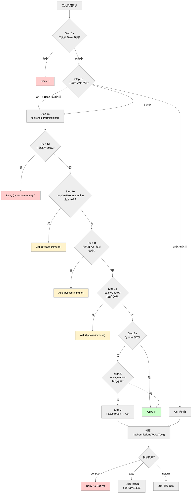
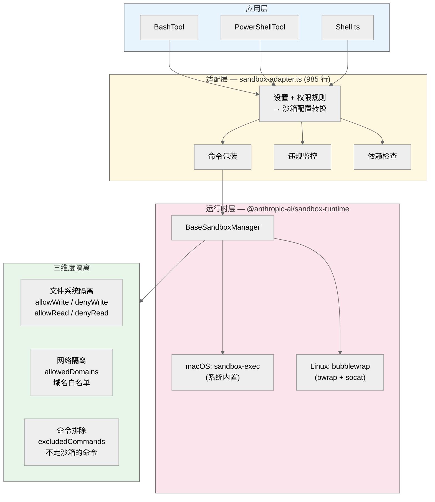

# 第05章 权限与安全

Claude Code 的权限系统是整个 Agent 架构的安全基石。它通过三级裁决体系、多层规则优先级、双阶段 AI 分类器和操作系统级沙箱隔离，在"自主高效"和"安全可控"之间实现平衡。本章从类型定义出发，逐层剖析权限检查的完整流水线、七种权限模式的运行机制、自动模式的分类器架构，以及沙箱隔离的实现细节。

---

## 5.1 三级裁决体系

每次工具调用都会经过权限检查，产出三种裁决之一：**Allow**、**Ask**、**Deny**。此外还有一个内部使用的 **Passthrough** 行为，表示"无明确规则命中，由下游逻辑决定"。

类型定义在 `src/types/permissions.ts:174-266`：

| 裁决 | 语义 | 关键字段 |
|------|------|---------|
| **Allow** | 自动放行 | `updatedInput?`（权限层可修改工具输入）、`userModified?`、`acceptFeedback?`、`contentBlocks?` |
| **Ask** | 弹出交互式确认 | `message`、`suggestions?`（权限更新建议，如 "Always allow"）、`metadata?`、`pendingClassifierCheck?` |
| **Deny** | 直接拒绝 | `message`、`decisionReason`（**必填**，告知 AI 被拒原因） |
| **Passthrough** | 无规则命中 | `message`、`suggestions?`、`pendingClassifierCheck?` |

Passthrough 在 `hasPermissionsToUseToolInner` 的最后一步（Step 3）被转换为 Ask；在外层 `hasPermissionsToUseTool` 中，再根据当前权限模式（dontAsk、auto、bypass 等）做最终转换。

**决策理由 PermissionDecisionReason** 是一个联合类型，涵盖 11 种来源：`rule`（匹配到规则）、`mode`（权限模式）、`subcommandResults`（Bash 复合命令的子命令结果）、`hook`（PreToolUse 钩子）、`classifier`（AI 分类器）、`safetyCheck`（敏感路径检查）、`sandboxOverride`、`permissionPromptTool`、`asyncAgent`、`workingDir`、`other`。每种理由携带不同的结构化数据，用于 UI 展示和日志追踪。

---

## 5.2 规则来源与优先级

### 5.2.1 八种规则来源

`PermissionRuleSource` 定义了八种规则来源（`src/types/permissions.ts:54-63`）：

| 来源 | 存储位置 | 用途 |
|------|---------|------|
| `session` | 内存 | 当前对话中用户临时授权 |
| `cliArg` | 命令行参数 | CI/CD 场景预授权（`--allowed-tools`） |
| `command` | Skill 声明 | 限制 Skill 可使用的工具集 |
| `userSettings` | `~/.claude/settings.json` | 个人全局偏好 |
| `projectSettings` | `.claude/settings.json` | 团队共享权限策略（提交到 Git） |
| `localSettings` | `.claude/settings.local.json` | 本地覆盖（gitignore） |
| `flagSettings` | `--settings` CLI 参数指定 | 临时配置覆盖 |
| `policySettings` | `managed-settings.json` / 远程 API | 企业管控，用户不可覆盖 |

### 5.2.2 设置源合并顺序

`SETTING_SOURCES` 数组定义了五层设置源的合并顺序（`src/utils/settings/constants.ts:6-21`），**后者覆盖前者**：

```
userSettings < projectSettings < localSettings < flagSettings < policySettings
```

即 **policySettings 优先级最高**，其次 flagSettings，然后 localSettings、projectSettings，最后 userSettings。这是所有设置合并（包括沙箱配置、autoMode 配置等）的统一顺序。

权限规则源在此基础上追加了三个非设置来源，完整数组为（`permissions.ts:108-113`）：

```typescript
const PERMISSION_RULE_SOURCES = [...SETTING_SOURCES, 'cliArg', 'command', 'session']
```

规则匹配时，`getAllowRules()` 等函数通过 `flatMap` 遍历所有来源收集规则。具体的匹配是 first-match 语义——在流水线的各步骤中，先命中的规则决定结果。

### 5.2.3 规则数据结构

`PermissionRule` 由三个字段组成（`src/types/permissions.ts:75-79`）：

```typescript
type PermissionRule = {
  source: PermissionRuleSource
  ruleBehavior: 'allow' | 'deny' | 'ask'
  ruleValue: PermissionRuleValue  // 注意：不是 string
}

type PermissionRuleValue = {
  toolName: string       // 工具名，如 "Bash"
  ruleContent?: string   // 可选的内容匹配，如 "git *"
}
```

`ruleValue` 是一个结构体而非简单字符串。用户在 settings.json 中写的 `"Bash(git *)"` 字符串会经过 `permissionRuleValueFromString()` 解析为 `{ toolName: "Bash", ruleContent: "git *" }` 的结构。当 `ruleContent` 缺失时，规则匹配整个工具。

特殊字符转义由 `permissionRuleParser.ts` 处理：先转义反斜杠（`\` -> `\\`），再转义括号（`(` -> `\(`、`)` -> `\)`），解析时逆向操作。

---

## 5.3 权限检查流水线

核心函数 `hasPermissionsToUseToolInner()`（`permissions.ts:1158-1319`）实现了完整的权限检查流水线。注意：行 473 处的 `hasPermissionsToUseTool` 是外层包装函数，负责在 inner 函数返回后做模式级转换（dontAsk -> deny、auto -> 分类器等）。

### 内层流水线（hasPermissionsToUseToolInner）



**Step 1a — 工具级 Deny**（行1171）：`getDenyRuleForTool()` 检查是否有 deny 规则匹配整个工具。命中则立即返回 Deny。

**Step 1b — 工具级 Ask + 沙箱例外**（行1184-1206）：`getAskRuleForTool()` 检查是否有 ask 规则。如果同时满足以下条件，则跳过 ask 规则，落入工具自身的权限检查：
- 工具是 Bash
- 沙箱已启用（`SandboxManager.isSandboxingEnabled()`）
- autoAllowBashIfSandboxed 开启
- 当前命令会在沙箱中运行（`shouldUseSandbox(input)`）

**Step 1c — 工具自身 checkPermissions**（行1214-1223）：调用 `tool.checkPermissions(parsedInput, context)`，每个工具实现自己的权限逻辑。例如 BashTool 执行 AST 解析、子命令规则匹配、安全检查；FileEditTool 检查路径安全性。

**Step 1d — 工具实现 Deny（bypass-immune）**（行1226-1228）：如果工具返回 deny，直接透传。此裁决不可被 bypass 模式覆盖。

**Step 1e — requiresUserInteraction（bypass-immune）**（行1231-1236）：如果工具声明了 `requiresUserInteraction()` 且返回 ask，同样不可被 bypass。

**Step 1f — 内容级 Ask 规则（bypass-immune）**（行1244-1250）：当工具的 checkPermissions 返回的 ask 裁决来自一条 `ruleBehavior === 'ask'` 的规则时（如 `Bash(npm publish:*)`），此裁决在 bypass 模式下仍然生效。

**Step 1g — 安全路径检查（bypass-immune）**（行1255-1260）：当决策理由类型为 `safetyCheck`（如对 `.git/`、`.claude/`、shell 配置文件的写入）时，即使在 bypass 模式下也必须提示用户。

**Step 2a — Bypass 模式检查**（行1262-1281）：经过上述四项 bypass-immune 检查后，如果当前模式是 `bypassPermissions`，或者 `plan` 模式且 `isBypassPermissionsModeAvailable` 为 true，则返回 Allow。

**Step 2b — Always-Allow 规则**（行1283-1297）：`toolAlwaysAllowedRule()` 检查是否有 allow 规则匹配当前工具+内容。命中则返回 Allow。

**Step 3 — Passthrough 转 Ask**（行1299-1310）：如果 toolPermissionResult 仍为 passthrough，将其转换为 ask 并返回。

### 外层转换（hasPermissionsToUseTool）

外层函数（行473起）在 inner 返回后做以下处理：

1. **Allow 时重置 denial 计数**：在 auto 模式下，任何成功的 allow 会重置连续拒绝计数（`recordSuccess`）。

2. **dontAsk 模式转换**（行508-517）：将所有 ask 裁决转换为 deny，附带 `DONT_ASK_REJECT_MESSAGE`。

3. **auto 模式处理**（行520起）：触发三级快速路径和双阶段分类器（详见 5.5 节）。

---

## 5.4 七种权限模式

### 模式定义

`src/types/permissions.ts:16-29` 定义了完整的权限模式体系：

| 模式 | 类型 | 行为特征 |
|------|------|---------|
| `default` | 外部 | 未匹配规则的操作需要用户确认 |
| `acceptEdits` | 外部 | 工作目录内的文件编辑自动放行 |
| `plan` | 外部 | 通过**系统提示指令**限制只读（见下文） |
| `dontAsk` | 外部 | 将 ask 转为 deny，适用于无人值守场景 |
| `bypassPermissions` | 外部 | 绕过大部分权限检查（bypass-immune 项除外） |
| `auto` | 内部 | AI 分类器自动决策（需 TRANSCRIPT_CLASSIFIER 功能标志） |
| `bubble` | 内部 | 子 Agent 权限冒泡，将决策委托给父 Agent |

前五种通过 `EXTERNAL_PERMISSION_MODES` 暴露给用户设置和 CLI。`auto` 在 `TRANSCRIPT_CLASSIFIER` 启用时加入 `INTERNAL_PERMISSION_MODES`。`bubble` 用于 `AgentTool/forkSubagent.ts` 中的子 Agent 场景，不面向用户。

### Plan Mode 的只读机制

Plan Mode 的"只读锁定"**主要通过系统提示词实现**，而非 `checkPermissions` 硬拒绝。`src/utils/messages.ts:3265` 注入的系统提示为：

> "Plan mode is active. The user indicated that they do not want you to execute yet -- you MUST NOT make any edits (with the exception of the plan file mentioned below), run any non-readonly tools (including changing configs or making commits), or otherwise make any changes to the system."

在权限流水线中，Plan 模式的行为类似 default 模式——未匹配规则的操作产生 ask 裁决，由用户确认。但如果用户最初从 bypass 模式进入 plan（`isBypassPermissionsModeAvailable` 为 true），则 plan 模式会像 bypass 一样自动放行（Step 2a）。

**模式切换** 由 `transitionPermissionMode()`（`permissionSetup.ts:597-646`）集中处理。进入 plan 模式时调用 `prepareContextForPlanMode()`（行1463-1493），保存 `prePlanMode`（切换前的模式）到上下文中；退出时恢复。如果从 auto 模式进入 plan，且配置允许 plan 期间使用 auto（`shouldPlanUseAutoMode()`），则 auto 语义在 plan 期间保持激活。

### 危险权限的可逆剥离

进入 auto 模式时，`stripDangerousPermissionsForAutoMode()`（`permissionSetup.ts:510-553`）会识别并移除过于宽泛的 allow 规则（如 `Bash(*)`、脚本解释器前缀），防止绕过分类器。被移除的规则暂存到 `strippedDangerousRules` 字段；离开 auto 模式时，`restoreDangerousPermissions()`（行561-579）将其恢复。这种"可逆剥离"设计确保了模式切换不会永久破坏用户的权限配置。

---

## 5.5 自动模式：双阶段 XML 分类器

自动模式是权限系统中最复杂的部分，通过 AI 分类器替代用户手动确认。核心逻辑在 `hasPermissionsToUseTool` 的 auto 分支（`permissions.ts:520`起）和 `yoloClassifier.ts` 中。

### 5.5.1 三级快速路径

在触发分类器 API 调用之前，系统尝试三级快速路径以减少延迟和成本：

**Tier 1 — acceptEdits 快速路径**（行600-656）：以 acceptEdits 模式重新运行 `tool.checkPermissions()`。如果工具在 acceptEdits 模式下会被放行（如工作目录内的文件编辑），则直接 allow，跳过分类器。但 **AgentTool 和 REPLTool 被排除**——REPL 代码可能包含 VM 逃逸，分类器必须看到完整的 JavaScript 代码而非内部工具调用。

**Tier 2 — 安全工具白名单**（行660-686）：`SAFE_YOLO_ALLOWLISTED_TOOLS`（`classifierDecision.ts:56-94`）定义了一组无需分类器检查的安全工具，包括：
- 只读工具：FileReadTool、GrepTool、GlobTool、LSPTool
- 搜索工具：ToolSearchTool、ListMcpResourcesTool、ReadMcpResourceTool
- 任务管理：TodoWriteTool、TaskCreate/Get/Update/List/Stop/OutputTool
- 计划/UI：AskUserQuestionTool、EnterPlanModeTool、ExitPlanModeTool
- 协调：TeamCreateTool、TeamDeleteTool、SendMessageTool、WorkflowTool
- 其他：SleepTool、YoloClassifierTool

**Tier 3 — 双阶段 XML 分类器**（行688起）：仅当前两级都未命中时才触发。

### 5.5.2 双阶段分类机制

分类器通过 `sideQuery`（独立 API 调用，不影响主对话 token 计数）实现。实现在 `classifyYoloActionXml()`（`yoloClassifier.ts:711`起），支持三种模式：`both`（默认双阶段）、`fast`（仅阶段 1）、`thinking`（仅阶段 2）。

**阶段 1（快速决策）**：
- 后缀：`"\nErr on the side of blocking. <block> immediately."`（`XML_S1_SUFFIX`，行550）
- max_tokens：基值 64（`both` 模式）或 256（`fast` 模式），加上模型的 thinking padding
- stop_sequences：`['</block>']`（仅 `both` 模式）
- 解析 `<block>no</block>` → 立即放行（快速路径）
- 解析 `<block>yes</block>` → 进入阶段 2
- 无法解析 → 视为 block（fail-closed）

**阶段 2（深度思考）**：
- 后缀：要求分类器遵循分类流程、使用 `<thinking>` 标签推理（`XML_S2_SUFFIX`，行560-561）
- max_tokens：4096 + thinking padding
- 解析 `<thinking>` 获取推理过程，解析 `<block>` 和 `<reason>` 获取最终决策
- 无法解析 → 视为 block（fail-closed）

两个阶段共享相同的系统提示和用户内容，可从 Anthropic API 的 prompt caching（1h TTL）中受益。

### 5.5.3 分类器看到什么

`buildTranscriptEntries()`（`yoloClassifier.ts:302-360`）构建精简的转录记录，仅包含用户消息和工具调用区块。**助手文本被有意排除**——因为助手文本是模型生成的，可能被精心构造来影响分类器决策（社会工程攻击防护）。转录内容包裹在 `<transcript>` 标签中发送给分类器。

### 5.5.4 分类器配置来源

`getAutoModeConfig()`（`settings.ts:936-975`）从**四个**来源读取 autoMode 配置：

```typescript
for (const source of ['userSettings', 'localSettings', 'flagSettings', 'policySettings'])
```

**明确排除 projectSettings**——恶意项目可能通过注入分类器 allow/deny 规则实现远程代码执行（RCE）。

autoMode 支持三类规则：`allow`（允许描述列表）、`soft_deny`（软拒绝描述列表）、`environment`（环境描述）。用户配置通过 XML 标签替换机制注入分类器系统提示：外部用户模板使用 `<user_*_to_replace>` 标签包裹默认规则，用户设置**替换**对应部分。

### 5.5.5 失败保护与熔断

**Iron Gate 机制**：`tengu_iron_gate_closed` 功能标志（默认 true）控制 API 错误时的行为。Iron Gate 关闭时，API 错误导致分类器不可用，直接返回 Deny 并提示用户；打开时回退到用户提示。标志每 30 分钟刷新一次（`CLASSIFIER_FAIL_CLOSED_REFRESH_MS`，行106）。

**转录过长处理**：当分类器转录超过上下文窗口限制时，headless 模式抛出 AbortError，交互模式回退到用户提示。

**Denial Tracking 熔断**（`denialTracking.ts:1-45`）：追踪分类器的连续拒绝和总拒绝次数。

```typescript
export const DENIAL_LIMITS = {
  maxConsecutive: 3,  // 连续拒绝阈值
  maxTotal: 20,       // 总拒绝阈值
}
```

`shouldFallbackToPrompting()` 在连续拒绝 >= 3 或总拒绝 >= 20 时触发，从分类器模式降级为用户提示。`recordSuccess()` 重置连续计数但**不**重置总计数——这意味着总拒绝是单调递增的会话级指标。

---

## 5.6 规则匹配引擎

### 5.6.1 三种匹配模式

`shellRuleMatching.ts` 中的 `parsePermissionRule()`（行159起）将规则内容解析为三种匹配模式：

| 模式 | 语法 | 示例 | 语义 |
|------|------|------|------|
| **精确匹配** | 无通配符 | `npm install` | 完全匹配命令 |
| **前缀匹配** | `:*` 后缀 | `npm:*` | 匹配以 `npm` 开头的命令 |
| **通配符匹配** | 含 `*` | `git *` | `*` 匹配任意字符序列 |

通配符匹配有一个特殊行为：当模式以 ` *`（空格+通配符）结尾且只有一个未转义的 `*` 时，尾部的 ` .*` 变为可选 `( .*)?`，使得 `git *` 既匹配 `git add` 也匹配裸 `git`。这与前缀规则的语义对齐。

MCP 工具使用 `getToolNameForPermissionCheck()` 获取标准名称，支持服务器级前缀匹配（`mcp__server__*` 匹配该服务器所有工具）。

### 5.6.2 Bash 命令的安全检查

BashTool 的权限检查是最复杂的，通过 tree-sitter 进行 AST 解析。解析结果分为 simple（可分析）、too-complex（过于复杂）、parse-unavailable（解析器不可用），后两者遵循 **fail-closed** 原则——不理解的结构标记为需要审批。

系统定义了 23 项静态安全检查（`BASH_SECURITY_CHECK_IDS`），涵盖：
- 命令注入防护：COMMAND_SUBSTITUTION、PROCESS_SUBSTITUTION
- 环境攻击：IFS_INJECTION、ENV_VARIABLE_INJECTION
- Shell 特性：ZSH_DANGEROUS_COMMANDS、BRACE_EXPANSION
- 编码攻击：UNICODE_WHITESPACE、CONTROL_CHARACTERS
- 其他：SHELL_FUNCTION_DEFINITIONS、ALIAS_COMMANDS 等

### 5.6.3 环境变量安全处理

`SAFE_ENV_VARS` 白名单定义了约 30 个安全的环境变量（如 `NODE_ENV`、`RUST_BACKTRACE`、`PYTHONUNBUFFERED`、`TERM`、`TZ`），这些变量在规则匹配时被忽略（不参与命令指纹计算）。**未在白名单中的变量**（如 `PATH`、`LD_PRELOAD`、`NODE_OPTIONS`、`PYTHONPATH`、`BASH_ENV`）会保留参与匹配，因为它们可能被用于攻击。

### 5.6.4 不可建议的裸 Shell 前缀

`BARE_SHELL_PREFIXES` 列表包含不应被建议为"Always Allow"规则的 shell 前缀命令，包括：
- Shell 解释器：`sh`、`bash`、`zsh`、`fish`、`csh`、`tcsh`、`ksh`、`dash`
- 命令包装器：`env`、`xargs`、`nice`、`nohup`、`timeout`、`stdbuf`、`time`
- 权限提升：`sudo`、`doas`、`pkexec`
- Windows Shell：`cmd`、`powershell`、`pwsh`

这些前缀过于宽泛，如果用户选择"Always Allow"则等同于放行任意命令。

---

## 5.7 敏感文件与目录保护

`filesystem.ts` 定义了两类受保护资源：

**危险文件**（`DANGEROUS_FILES`，行57-68）：

```
.gitconfig, .gitmodules, .bashrc, .bash_profile, .zshrc, .zprofile,
.profile, .ripgreprc, .mcp.json, .claude.json
```

**危险目录**（`DANGEROUS_DIRECTORIES`，行74-79）：

```
.git, .vscode, .idea, .claude
```

路径检查通过 `normalizeCaseForComparison()` 统一转小写后比较，防止在 macOS/Windows 等大小写不敏感文件系统上通过混合大小写（如 `.cLauDe/Settings.locaL.json`）绕过检查。这一策略在 Linux 上也生效——保守处理优于遗漏。

对这些路径的写入操作产生 `safetyCheck` 类型的 ask 裁决，属于 bypass-immune 检查（Step 1g），在 bypassPermissions 模式下仍然需要用户确认。在 auto 模式下，`classifierApprovable` 标志控制分类器是否可以自动审批：敏感文件路径设为 true（分类器可以看到上下文后决定），而 Windows 路径绕过尝试和跨机器 bridge 消息设为 false（必须由用户确认）。

---

## 5.8 沙箱隔离机制

### 5.8.1 架构概览



沙箱隔离通过操作系统级进程隔离保护主机系统，架构分三层：

- **运行时层**：`@anthropic-ai/sandbox-runtime` 包提供 `BaseSandboxManager`，封装 macOS `sandbox-exec` 和 Linux `bubblewrap` 的平台差异
- **适配层**：`sandbox-adapter.ts`（约 985 行）将 Claude Code 的设置和权限规则转换为沙箱配置，提供命令包装、违规监控、依赖检查
- **应用层**：BashTool、PowerShellTool、Shell.ts 通过适配层调用沙箱

### 5.8.2 平台支持

| 平台 | 底层技术 | 依赖 | 支持状态 |
|------|---------|------|---------|
| macOS | sandbox-exec | 系统内置 | 支持 |
| Linux | bubblewrap | bwrap + socat | 支持 |
| WSL2 | bubblewrap | bwrap + socat | 支持（视为 Linux） |
| WSL1 | - | - | 不支持 |
| Windows 原生 | - | - | 不支持 |

### 5.8.3 三维度隔离能力

**文件系统隔离**：通过 allowWrite/denyWrite/allowRead/denyRead 四个列表控制。

默认 allowWrite 包含项目目录（`.`）和 Claude 临时目录（`getClaudeTempDir()`）。denyWrite 自动包含：
- 所有设置文件路径（`settings.json`、`settings.local.json`、managed-settings drop-in 目录）
- `.claude/skills` 目录（防止恶意代码注入技能文件）
- Git worktree 支持：如果检测到 worktree，主仓库路径加入 allowWrite

**网络隔离**：`allowedDomains` 控制沙箱内进程可访问的域名白名单，通过 `WebFetchTool` 的 allow 规则中的 `domain:` 前缀配置。

**命令排除**：`excludedCommands` 配置（默认空数组）允许指定不走沙箱的命令。

### 5.8.4 Git Bare Repository 攻击防护

攻击向量：攻击者在项目目录下植入 `HEAD`、`objects/`、`refs/` 等文件，配合 `config` 文件中的 `core.fsmonitor` 钩子，使 Git 将当前目录误认为 bare repository 并执行恶意代码。

防护策略（`sandbox-adapter.ts:257-280`）采用双层设计：
- **已存在的文件** → 加入 denyWrite（只读挂载），阻止修改
- **不存在的文件** → 记录到 `bareGitRepoScrubPaths`，命令执行后通过 `scrubBareGitRepoFiles()` 清理

之所以不对不存在的文件也做 denyWrite，是因为 bubblewrap 会为不存在的路径创建 0 字节 stub 文件，这会破坏沙箱内的 `git log HEAD` 等命令（"ambiguous argument"错误）。

### 5.8.5 配置优先级与管控

沙箱配置遵循 `SETTING_SOURCES` 的统一合并顺序（后者覆盖前者）：

```
policySettings > flagSettings > localSettings > projectSettings > userSettings
```

关键配置项及默认值：

| 配置项 | 默认值 | 说明 |
|--------|--------|------|
| `sandbox.enabled` | false | 是否启用沙箱 |
| `autoAllowBashIfSandboxed` | true | 沙箱化命令自动放行 |
| `allowUnsandboxedCommands` | true | 允许运行不走沙箱的命令 |
| `failIfUnavailable` | false | 沙箱不可用时是否拒绝执行 |
| `excludedCommands` | [] | 排除在沙箱外运行的命令 |

`areSandboxSettingsLockedByPolicy()`（行647起）检查 `flagSettings` 和 `policySettings` 中是否已设置沙箱配置——如果是，本地修改将无效。

当用户显式启用了 `sandbox.enabled` 但沙箱实际不可用时，`getSandboxUnavailableReason()` 会返回人类可读的原因字符串（如平台不支持、依赖缺失），在启动时向用户展示警告。

---

## 5.9 权限提示 UI 的 200ms 防误触

交互式权限提示（`interactiveHandler.ts`）涉及三个决策源竞速：用户操作（UI 回调）、PreToolUse Hook、分类器异步检查。

**解决竞态的机制**：

1. **`createResolveOnce` 守卫**（行70）：确保 `resolve()` 只被调用一次，无论哪个源先完成
2. **`userInteracted` 标志**（行71）：用户有任何交互后设为 true
3. **200ms 宽限期**（行115-118）：`GRACE_PERIOD_MS = 200`——权限提示弹出后的前 200ms 内，忽略用户输入（如意外按键），防止分类器结果被误取消
4. **人类意图优先**（行449）：`shouldContinue: () => !isResolved() && !userInteracted`——一旦用户有交互，分类器结果被丢弃

这套机制确保了：分类器可以在后台异步审批，但用户的显式操作始终具有最高优先级。

---

## 5.10 关键源文件索引

| 文件 | 行数 | 职责 |
|------|------|------|
| `src/types/permissions.ts` | ~442 | 纯类型定义，无运行时依赖 |
| `src/utils/permissions/permissions.ts` | ~1486 | 核心权限检查流水线 |
| `src/utils/permissions/permissionSetup.ts` | ~1533 | 模式切换、危险权限剥离/恢复 |
| `src/utils/permissions/yoloClassifier.ts` | ~1495 | 双阶段 XML 分类器实现 |
| `src/utils/permissions/denialTracking.ts` | ~45 | 拒绝追踪与熔断逻辑 |
| `src/utils/permissions/shellRuleMatching.ts` | ~228 | Shell 命令规则匹配引擎 |
| `src/utils/permissions/permissionRuleParser.ts` | ~198 | 规则字符串解析与转义 |
| `src/utils/permissions/permissionsLoader.ts` | ~296 | 规则加载与管控策略 |
| `src/utils/permissions/classifierDecision.ts` | ~100 | 安全工具白名单 |
| `src/utils/permissions/filesystem.ts` | ~1778 | 敏感文件/目录保护、路径安全检查 |
| `src/utils/sandbox/sandbox-adapter.ts` | ~985 | 沙箱适配层 |
| `src/hooks/toolPermission/handlers/interactiveHandler.ts` | ~536 | 交互式权限提示 UI |
