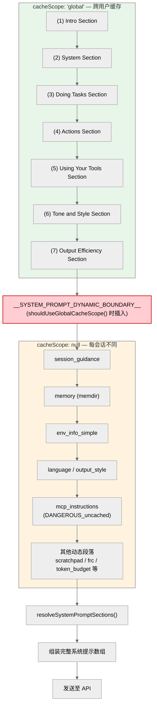
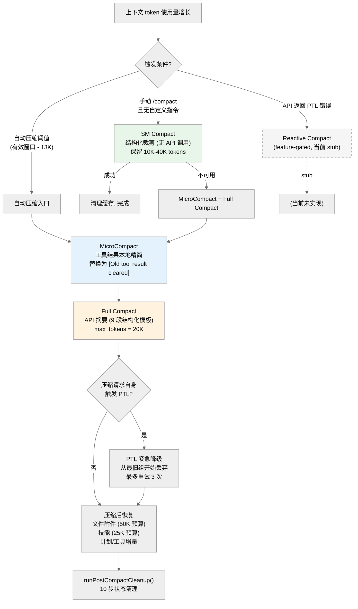

# 第06章 上下文管理

Claude Code 面临一个核心矛盾：大语言模型的能力来自上下文窗口，但上下文窗口是有限的。一次复杂的软件工程会话可能涉及数百个文件、上千条工具调用结果，轻松超过百万 token 的容量。本章从 token 预算管理、上下文组装管线、系统提示的段落化缓存架构，一直到多层压缩策略，完整呈现 Claude Code 如何在有限窗口内最大化信息密度。

---

## 6.1 上下文窗口与 Token 预算

### 6.1.1 窗口规格

Claude Code 支持两种上下文窗口规格：

| 规格 | 容量 | 激活方式 |
|------|------|----------|
| 标准窗口 | 200,000 tokens | 默认值（`MODEL_CONTEXT_WINDOW_DEFAULT`） |
| 大上下文 | 1,000,000 tokens | 模型 ID 含 `[1m]` 后缀 |

窗口大小由 `getContextWindowForModel()` 确定（`src/utils/context.ts`），按以下优先级链解析：

1. **环境变量覆盖** — `CLAUDE_CODE_MAX_CONTEXT_TOKENS`（仅 ant 用户）
2. **`[1m]` 后缀** — 模型 ID 中检测到 `[1m]` 时返回 1M
3. **模型能力配置** — `getModelCapability(model).max_input_tokens`（含 HIPAA 限制逻辑）
4. **Beta 头部检测** — `CONTEXT_1M_BETA_HEADER` 匹配
5. **Sonnet 1M 实验** — `getSonnet1mExpTreatmentEnabled()`
6. **ant 模型配置** — `resolveAntModel(model).contextWindow`
7. **默认值** — 200,000

### 6.1.2 有效窗口与阈值分层

**有效窗口**不等于总窗口。API 需要为输出预留空间，因此：

```
有效窗口 = 总窗口 - Math.min(模型输出上限, 20,000)
```

注意这里使用 **`Math.min`** 而非 `Math.max`——保留 `min(模型输出上限, 20K)` 用于压缩摘要输出。当 slot cap 启用时（生产默认），`getMaxOutputTokensForModel()` 返回 `CAPPED_DEFAULT_MAX_TOKENS = 8,000`，此时有效窗口为 200K - 8K = 192K。20,000 这个上限来自压缩摘要输出的 p99.99 统计值（实际为 17,387 tokens，向上取整为保守值）。

源码位于 `autoCompact.ts` 第 34-37 行：

```typescript
const reservedTokensForSummary = Math.min(
  getMaxOutputTokensForModel(model),
  MAX_OUTPUT_TOKENS_FOR_SUMMARY,  // 20_000
)
```

在有效窗口之上，系统定义了四层阈值：

| 阈值 | 计算公式 | 含义 |
|------|----------|------|
| **自动压缩阈值** | 有效窗口 - 13K | 触发自动压缩（`AUTOCOMPACT_BUFFER_TOKENS`） |
| **警告阈值** | 自动压缩阈值 - 20K | UI 显示黄色上下文警告 |
| **错误阈值** | 自动压缩阈值 - 20K | UI 显示红色上下文警告 |
| **阻塞限制** | 有效窗口 - 3K | 阻止继续输入，强制压缩 |

`calculateTokenWarningState()` 返回五个字段：

```typescript
{
  percentLeft: number
  isAboveWarningThreshold: boolean
  isAboveErrorThreshold: boolean       // 区分黄色/红色 UI 颜色
  isAboveAutoCompactThreshold: boolean
  isAtBlockingLimit: boolean
}
```

`isAboveErrorThreshold` 用于 `TokenWarning.tsx` 中区分黄色警告和红色错误两种视觉状态。

### 6.1.3 工具结果预算

工具结果有两级限制（`src/constants/toolLimits.ts`）：

| 限制 | 常量 | 值 |
|------|------|-----|
| 单工具结果 | `MAX_TOOL_RESULT_TOKENS` | 100,000 tokens（约 400KB） |
| 单消息聚合 | `MAX_TOOL_RESULTS_PER_MESSAGE_CHARS` | 200,000 字符 |

当工具结果超出限制时，系统将其持久化到磁盘，模型仅收到约 2KB 的预览（`PREVIEW_SIZE_BYTES = 2000`）加上文件路径，格式为 `<persisted-output>` 标签。

某些工具通过 `maxResultSizeChars: Infinity` 退出持久化机制（如 Read 工具），因为它们的结果对模型后续操作至关重要。

### 6.1.4 对话 Token 预算

用户可以通过自然语言设定 token 预算（如 "+500k"、"use 2M tokens"），由 `parseTokenBudget()`（`src/utils/tokenBudget.ts`）通过三组正则解析。系统会自动续期直到满足条件。续期终止的条件：token 使用量达到预算的 90% 以上（`COMPLETION_THRESHOLD = 0.9`），或者连续两轮的增量都低于 500 tokens（`DIMINISHING_THRESHOLD`）且续期次数已达 3 次以上，被判定为收益递减。

三层预算的优先级清晰：工具结果预算 > 自动压缩预算 > 对话 Token 预算。`query.ts` 的执行顺序验证了这一点——先 `applyToolResultBudget`，再 `microcompact`，再 `autocompact`，最后才是主循环尾部的对话 Token 预算检查。

### 6.1.5 tokenCountWithEstimation() — 混合计数算法

所有阈值判断（自动压缩、SM Compact 初始化等）统一使用 `tokenCountWithEstimation()`（`src/utils/tokens.ts`）作为上下文大小的**规范度量函数**。它采用"API 基线 + 启发式估算"的混合策略，避免了累加计数的双重计算问题。

**算法流程**：

1. **反向遍历查找 API usage** — 从消息数组末尾开始，找到最后一条带有真实 `usage` 的 assistant 消息（排除 `SYNTHETIC_MODEL` 和 `SYNTHETIC_MESSAGES`）。该 usage 包含 `input_tokens + cache_creation_input_tokens + cache_read_input_tokens + output_tokens`，代表该次 API 调用时的完整上下文大小。

2. **处理并行工具调用的消息拆分** — 当模型在一次响应中发出多个工具调用时，流式处理代码为每个 content block 生成独立的 assistant 记录，但它们共享相同的 `message.id`。消息数组中的布局为：
   ```
   [..., assistant(id=A), user(result), assistant(id=A), user(result), ...]
   ```
   如果只从最后一条 `id=A` 开始估算，会遗漏前面交错的 tool_result 消息。因此算法通过 `getAssistantMessageId()` 向前回溯，找到**同一 `message.id` 的第一条**记录作为锚点，确保所有交错的 tool_result 都被纳入估算范围。

3. **API 基线 + 后续消息估算** — 最终结果为：
   ```typescript
   getTokenCountFromUsage(usage) + roughTokenCountEstimationForMessages(messages.slice(i + 1))
   ```
   其中 `roughTokenCountEstimationForMessages()` 对锚点之后的所有新消息做启发式 token 估算。

4. **无 API 响应的回退** — 如果整个消息数组中没有任何 API usage（例如会话刚开始），退化为对所有消息做纯启发式估算。

**为什么不用累加计数**：随着上下文增长，每轮 API 调用的 `input_tokens` 已经包含了之前所有消息的 token 数，累加会严重双重计算。混合策略以最近一次 API 调用的精确计数为基线，只对"基线之后"的新增消息做估算，兼顾精度和实时性。

---

## 6.2 上下文组装管线

上下文组装是每轮 API 调用的前奏。管线的入口是 `fetchSystemPromptParts()`（`src/utils/queryContext.ts`），它用 `Promise.all` 并行获取三个组件：

```typescript
const [defaultSystemPrompt, userContext, systemContext] = await Promise.all([
  getSystemPrompt(tools, mainLoopModel, additionalWorkingDirectories, mcpClients),
  getUserContext(),
  getSystemContext(),
])
```

这三个组件的职责：

| 组件 | 来源 | 内容 |
|------|------|------|
| `defaultSystemPrompt` | `getSystemPrompt()`（`prompts.ts`） | 系统提示数组——静态段落 + 动态段落 |
| `userContext` | `getUserContext()`（`context.ts`） | CLAUDE.md 文件内容，带 lodash memoize 缓存 |
| `systemContext` | `getSystemContext()`（`context.ts`） | git 状态、日期等运行时上下文 |

**关键细节**：`getSystemPrompt()` **不是**由 `query.ts` 直接调用的。实际调用链为 `REPL.tsx` / `QueryEngine.ts` -> `queryContext.ts:fetchSystemPromptParts()` -> `getSystemPrompt()`。`query.ts` 仅接收已构建好的 `systemPrompt` 作为参数。

### 消息规范化

在发送到 API 之前，`normalizeMessagesForAPI()` 执行三项关键处理：附件注入（将 CLAUDE.md 等上下文作为 attachment 插入）、工具对完整性修复（确保每个 tool_result 都有配对的 tool_use）、以及图片格式处理。

---

## 6.3 系统提示的段落化架构

`src/constants/prompts.ts`（915 行）不是一个存储提示文本的文件——它是一个**提示编排器**。所有提示内容都通过函数动态生成，支持条件编译（`process.env.USER_TYPE`、`feature()` 门控），以及针对 prompt cache 优化的段落化架构。

### 6.3.1 两类段落：cached 与 DANGEROUS_uncached

段落化系统定义在 `src/constants/systemPromptSections.ts`（68 行），核心是两个工厂函数：

**`systemPromptSection(name, computeFn)`** — 创建缓存型段落。计算一次后，结果存入内存缓存，直到 `/compact` 或 resume 等事件清空缓存（通过 `clearSystemPromptSections()`）。

```typescript
function systemPromptSection(name, compute): SystemPromptSection {
  return { name, compute, cacheBreak: false }
}
```

**`DANGEROUS_uncachedSystemPromptSection(name, computeFn, reason)`** — 创建易变型段落。每轮重新计算，值变化时会打破 prompt cache。`DANGEROUS_` 前缀是工程纪律——任何人想创建 uncached 段落都必须面对这个刺眼的命名并提供理由。

```typescript
function DANGEROUS_uncachedSystemPromptSection(name, compute, _reason): SystemPromptSection {
  return { name, compute, cacheBreak: true }
}
```

`resolveSystemPromptSections()` 遍历所有段落：对非 `cacheBreak` 段落检查 `cache.has(s.name)`，命中返回缓存值；否则执行 `compute()` 并写入缓存。

缓存清空时机：

- **`/compact`** — 通过 `postCompactCleanup.ts` 调用 `clearSystemPromptSections()`
- **会话恢复** — `sessionRestore.ts` 中的 resume 和 worktree 切换路径

### 6.3.2 SYSTEM_PROMPT_DYNAMIC_BOUNDARY



整个系统提示数组被一个**分水岭标记**分为两个区域：

```typescript
export const SYSTEM_PROMPT_DYNAMIC_BOUNDARY = '__SYSTEM_PROMPT_DYNAMIC_BOUNDARY__'
```

位于 `prompts.ts` 第 115-116 行，代码注释明确警告不要修改 boundary 之前的内容。该标记的插入条件由 `shouldUseGlobalCacheScope()` 控制（`betas.ts`），条件为 first-party provider 且未禁用实验性 beta。

分割逻辑在 `splitSysPromptPrefix()`（`src/utils/api.ts`）中实现：

| 区域 | 内容 | cacheScope |
|------|------|------------|
| boundary 之前 | 七个静态段落（跨用户不变） | `'global'`（全局缓存） |
| boundary 之后 | 动态段落（用户/会话相关） | `null`（不缓存） |

**重要细节**：当全局缓存启用（`shouldUseGlobalCacheScope()` 为 true）且 boundary 存在时，动态块的 `cacheScope` 为 `null`。只有在全局缓存未启用的默认路径下，所有块才使用 `'org'` 作用域。两种情况不会同时出现。

---

## 6.4 七个静态段落

系统提示的静态区域由七个函数按固定顺序生成（`getSystemPrompt()` 返回数组的前七项）：

```typescript
return [
  getSimpleIntroSection(outputStyleConfig),
  getSimpleSystemSection(),
  outputStyleConfig === null || outputStyleConfig.keepCodingInstructions === true
    ? getSimpleDoingTasksSection() : null,
  getActionsSection(),
  getUsingYourToolsSection(enabledTools),
  getSimpleToneAndStyleSection(),
  getOutputEfficiencySection(),
  // === BOUNDARY MARKER ===
  ...(shouldUseGlobalCacheScope() ? [SYSTEM_PROMPT_DYNAMIC_BOUNDARY] : []),
  // --- Dynamic content ---
  ...resolvedDynamicSections,
].filter(s => s !== null)
```

### (1) Intro Section — `getSimpleIntroSection()`

声明身份（"交互式 agent，帮助用户完成软件工程任务"），注入 `CYBER_RISK_INSTRUCTION`（允许 CTF 安全研究，拒绝 DoS 等恶意行为），禁止随意生成/猜测 URL。

接受 `outputStyleConfig` 参数——当配置了 Output Style 时，身份描述变为"按 Output Style 响应用户查询"。

### (2) System Section — `getSimpleSystemSection()`

六条系统级约束：
- 非工具输出直接展示给用户（Markdown 格式）
- 工具在权限模式下运行，被拒绝后不能原样重试
- `<system-reminder>` 标签的说明
- 外部工具结果的 prompt injection 告警
- Hooks 反馈视为用户反馈
- 上下文窗口自动压缩机制说明

### (3) Doing Tasks Section — `getSimpleDoingTasksSection()`

编码风格和任务执行规范，核心原则：

- "不要加用户没要求的功能"
- "不要过度抽象——三行重复好过不成熟抽象"
- "先读代码再改代码"
- "不要轻易创建新文件"
- "方法失败时先诊断再换策略"
- "不给时间估计"

**条件行为**：当 `outputStyleConfig` 不为 null 且 `keepCodingInstructions` 为 false 时，整个段落被跳过。

### (4) Actions Section — `getActionsSection()`

安全行为框架。将操作分为四类：破坏性/不可撤销、对外可见、上传第三方、其他。核心原则是"blast radius 思维"——考虑可逆性和影响范围。"用户批准一次不等于授权所有同类操作。"

### (5) Using Your Tools Section — `getUsingYourToolsSection()`

工具使用规范，参数为 `enabledTools: Set<string>`。包含工具优先级表（优先用 Read/Edit/Write/Glob/Grep，而非 Bash），独立工具调用应并行，使用 TaskCreate 工具分解复杂工作。

当 REPL 模式启用时走完全不同的路径（大部分工具指导被跳过）。当 `hasEmbeddedSearchTools()` 为真时跳过 Glob/Grep 指导。

### (6) Tone and Style Section — `getSimpleToneAndStyleSection()`

不主动使用 emoji，`file_path:line_number` 格式引用代码位置，`owner/repo#123` 格式引用 GitHub，工具调用前不使用冒号。

### (7) Output Efficiency Section — `getOutputEfficiencySection()`

直奔主题、先答案后推理、跳过填充词。面向外部用户侧重简洁高效。

### ant 用户专属提示差异

当 `process.env.USER_TYPE === 'ant'` 时，多个静态段落和动态段落注入 ant 专属内容。以下是各段落中的差异汇总：

| 段落 | ant 差异 | 外部用户行为 |
|------|---------|-------------|
| **(3) Doing Tasks** | 默认不写注释——"Default to writing no comments. Only add one when the WHY is non-obvious"；注释不应解释代码做什么（WHAT），不应引用当前 task/fix/caller | 无此指导 |
| **(3) Doing Tasks** | 主动指出用户误解和相邻 bug——"You're a collaborator, not just an executor" | 无此指导 |
| **(3) Doing Tasks** | 报告前必须验证——"Never claim 'all tests pass' when output shows failures, never suppress or simplify failing checks... Equally, when a check did pass, state it plainly — do not hedge confirmed results with unnecessary disclaimers" | 无此指导 |
| **(3) Doing Tasks** | Claude Code 自身 bug 引导——推荐 `/issue`（模型问题）或 `/share`（产品 bug），并提示 Slack 反馈频道 | 无此指导 |
| **(6) Tone and Style** | **不含** "Your responses should be short and concise" | 包含简洁要求 |
| **(7) Output Efficiency** | 整段替换为 "Communicating with the user"——强调面向人而非控制台输出，要求流畅散文、倒金字塔结构、关键时刻更新进度 | 标准的 "Output efficiency" 段落 |
| **动态段落** `ant_model_override` | `getAntModelOverrideConfig()?.defaultSystemPromptSuffix` | 不存在 |
| **动态段落** `numeric_length_anchors` | "keep text between tool calls to <=25 words, final responses to <=100 words"（约 1.2% 输出 token 节省） | 不存在 |

这些差异通过编译时常量 `process.env.USER_TYPE` 实现条件编译。代码注释标注了 DCE（Dead Code Elimination）要求——`process.env.USER_TYPE === 'ant'` 必须内联在每个调用点，不能提升为 `const`，以确保构建器在外部构建中能将分支常量折叠为 `false` 并消除死代码。

---

## 6.5 动态段落注入

boundary 之后的动态区域由 `dynamicSections` 数组定义，通过 `resolveSystemPromptSections()` 统一解析。以下为各段落的注册方式和职责。

### (1) 会话特定指导 — `session_guidance`

函数 `getSessionSpecificGuidanceSection()` 生成，包含：
- AskUserQuestionTool 的条件说明
- 非交互式会话判断
- Agent 工具策略（fork vs subagent 模式）
- 技能调用说明
- 探索 Agent 建议（`areExplorePlanAgentsEnabled()` 门控）

### (2) 项目记忆 — `memory`

通过 `loadMemoryPrompt()` 注入，来自 memdir（auto memory）子系统。记忆存储在 `~/.claude/projects/<sanitized-base>/memory/`，分四种类型（user、feedback、project、reference），索引文件限制 200 行/25KB。

**注意**：这里的"记忆"是 memdir（auto memory）系统，不是 CLAUDE.md。CLAUDE.md 由 `getMemoryFiles()` / `getUserContext()` 处理，属于不同子系统，注入到 `userContext` 中。

### (3) 环境信息 — `env_info_simple`

`computeSimpleEnvInfo()` 注入运行时环境，使用 bullet 列表格式。内容包括：CWD、Git 状态、Worktree 说明、平台、Shell、OS 版本、模型名称/ID、知识截止日期、最新 Claude 模型家族信息、Claude Code 可用平台、Fast mode 说明。

子 Agent 使用不同的函数 `computeEnvInfo()`，输出为 `<env>` XML 标签包裹的格式。两者内容相近但格式不同。

### (4) 语言与输出风格 — `language` / `output_style`

`getLanguageSection()` 按用户语言偏好注入（技术术语保持原样）；`getOutputStyleSection()` 加载自定义输出风格配置。

### (5) MCP 服务器指令 — `mcp_instructions`

**唯一默认使用 `DANGEROUS_uncachedSystemPromptSection` 的段落**。原因：MCP 服务器可能在两轮之间连接或断开。当 MCP 指令增量更新启用时（`isMcpInstructionsDeltaEnabled()`），该段落返回 null——指令改通过 attachment 增量传递，避免打破 prompt cache。

### (6) 其他动态段落

| 段落 ID | 条件 | 内容 |
|---------|------|------|
| `scratchpad` | `isScratchpadEnabled()` | Scratchpad 临时目录指令 |
| `frc` | `CACHED_MICROCOMPACT` feature | Function Result Clearing 指令 |
| `summarize_tool_results` | 无条件 | 工具结果摘要指令 |
| `token_budget` | `TOKEN_BUDGET` feature | Token 预算行为指令 |
| `ant_model_override` | `USER_TYPE=ant` | ant 模型覆盖配置 |
| `numeric_length_anchors` | `USER_TYPE=ant` | 数字长度锚点（约 1.2% 输出 token 节省） |
| `brief` | `KAIROS` / `KAIROS_BRIEF` feature | Brief 工具段落 |

### (7) Proactive 模式快速路径

当 `proactiveModule?.isProactiveActive()` 为真时，`getSystemPrompt()` 走完全不同的简化路径，跳过七个静态段落和动态段落注册，直接返回一个精简的自主 agent 提示数组。

---

## 6.6 Prompt Cache 经济学

段落化架构的核心价值在于 prompt cache 优化。理解其工作方式需要把握三个层次：

**第一层：全局缓存（global scope）**

boundary 之前的七个静态段落对所有用户、所有会话完全相同（同一模型版本下），因此 `cacheScope: 'global'`。当全局缓存命中时，这部分（约占系统提示 60-70%）的读取成本接近零。

**第二层：段落级缓存（内存 memoize）**

`systemPromptSection` 创建的缓存型段落在进程内被 memoize——同一会话中多轮调用只计算一次。`DANGEROUS_uncached` 段落每轮重新计算。当前唯一默认的 DANGEROUS 段落是 MCP 指令。

**第三层：缓存失效控制**

以下事件触发缓存清空：

| 事件 | 影响范围 |
|------|----------|
| `/compact` | 清空所有段落缓存 + beta header latches |
| 会话恢复（resume） | 清空所有段落缓存 |
| Worktree 切换 | 清空所有段落缓存 |
| MCP 服务器连接变化 | 仅影响 `mcp_instructions` 段落 |
| boundary 前内容变化 | **全局缓存失效**（前缀匹配机制下的必然结果） |

这解释了代码注释为何反复警告"不要修改 boundary 之前的内容"——任何改动都会导致全球所有用户的全局缓存失效。

### DEFAULT_AGENT_PROMPT

子 Agent 有独立的提示入口。`DEFAULT_AGENT_PROMPT` 是一条精炼的指令，核心要求是"完成任务——不要镀金，但也不要半途而废"。

子 Agent 的环境信息通过 `enhanceSystemPromptWithEnvDetails()` 追加，包含：绝对路径要求、不使用冒号、避免 emoji、`computeEnvInfo()` 输出（`<env>` XML 格式）、以及条件性的 DiscoverSkills 指导。

#### enabledToolNames 与 DiscoverSkills 注入

`enhanceSystemPromptWithEnvDetails()` 接受一个可选的 `enabledToolNames: ReadonlySet<string>` 参数，用于控制是否向子 Agent 注入 DiscoverSkills 指导段落。

```typescript
export async function enhanceSystemPromptWithEnvDetails(
  existingSystemPrompt: string[],
  model: string,
  additionalWorkingDirectories?: string[],
  enabledToolNames?: ReadonlySet<string>,
): Promise<string[]>
```

在 `runAgent.ts` 中，`buildAgentSystemPrompt()` 将 `resolvedTools` 的工具名集合传入：

```typescript
const enabledToolNames = new Set(resolvedTools.map(t => t.name))
// ...
return await enhanceSystemPromptWithEnvDetails(
  prompts, resolvedAgentModel, additionalWorkingDirectories, enabledToolNames,
)
```

DiscoverSkills 指导的注入条件为三重门控：

1. `EXPERIMENTAL_SKILL_SEARCH` feature flag 已启用
2. `skillSearchFeatureCheck?.isSkillSearchEnabled()` GrowthBook 开关为真
3. `DISCOVER_SKILLS_TOOL_NAME` 存在于 `enabledToolNames` 中（即子 Agent 的工具集包含 DiscoverSkills 工具）

当 `enabledToolNames` 未提供时（如 `AgentTool.tsx` 在 `assembleToolPool` 之前构建提示），条件退化为 `?? true`——默认注入指导。这确保了即使在工具集尚未确定时，Agent 也能获得 Skill 发现的上下文。

---

## 6.7 压缩策略

当上下文接近窗口边界时，Claude Code 采用"从轻到重"的四层压缩策略。



### 6.7.1 MicroCompact — 工具结果精简

**源码**：`src/services/compact/microCompact.ts`（约 530 行）

MicroCompact 是最轻量的压缩手段——不调用 API，仅在本地替换旧的工具结果内容。只有白名单工具的结果会被压缩：

```
FileRead, BashTool/PowerShell, Grep, Glob, WebSearch, WebFetch, FileEdit, FileWrite
```

替换后的内容为固定字符串 `'[Old tool result content cleared]'`。图片和 PDF 估算为 2,000 tokens。

MicroCompact 有两条执行路径：

| 路径 | 名称 | 触发条件 |
|------|------|----------|
| A | 时间触发 | `maybeTimeBasedMicrocompact` — 需要配置 `enabled=true`（**默认关闭**）、主线程 querySource、且距最后一条 assistant 消息的间隔超过 `gapThresholdMinutes`（默认 60 分钟） |
| B | 缓存编辑 | `cachedMicrocompactPath` — 需要 `CACHED_MICROCOMPACT` feature flag + GrowthBook 开关 + 模型支持 cache editing。在此代码库中为 stub 实现 |

### 6.7.2 Session Memory Compact — 结构化裁剪

**源码**：`src/services/compact/sessionMemoryCompact.ts`（约 630 行）

SM Compact 不调用 API，而是通过智能裁剪保留最新的关键消息。裁剪参数：

```typescript
DEFAULT_SM_COMPACT_CONFIG = {
  minTokens: 10_000,      // 保留至少 10K tokens
  minTextBlockMessages: 5, // 保留至少 5 条文本消息
  maxTokens: 40_000,      // 最多保留 40K tokens
}
```

SM Compact 有一个关键限制：**不支持自定义指令**。`/compact` 命令入口中 `if (!customInstructions)` 才会尝试 SM compact。

`adjustIndexToPreserveAPIInvariants()` 确保裁剪不会破坏 API 不变量，执行三步处理：

1. **收集 tool_result ID** — 扫描保留范围内的所有 tool_result
2. **向前搜索配对的 tool_use** — 确保每个 tool_result 的 tool_use 也被保留
3. **处理 thinking block 共享** — 检测相同 `message.id` 的 assistant 消息（thinking block 分离），确保不会丢失 thinking 内容

### 6.7.3 Full Compact — API 摘要

**源码**：`src/services/compact/compact.ts`（约 1,708 行），压缩提示在 `prompt.ts`（约 374 行）

Full Compact 是最重量级的策略——调用 Claude API 对整个对话生成结构化摘要。核心流程：

1. **PreCompact hooks** — 执行用户配置的预压缩钩子
2. **`stripImagesFromMessages`** — 移除图片以减少 token 占用
3. **`stripReinjectedAttachments`** — 移除已重注入的附件
4. **`streamCompactSummary`** — 流式调用 API 生成摘要，含 PTL 重试
5. **`formatCompactSummary`** — 从响应中提取 `<summary>` 内容，剥离 `<analysis>` 草稿本
6. **清除文件状态缓存** — `readFileState.clear()`
7. **恢复压缩后上下文** — 文件附件、异步 agent 附件、计划、技能、工具增量
8. **SessionStart hooks** — 执行会话启动钩子
9. **重新追加会话元数据** — `reAppendSessionMetadata()`

#### 九段结构化摘要模板

`BASE_COMPACT_PROMPT` 要求模型按固定结构输出摘要：

1. Primary Request and Intent
2. Key Technical Concepts
3. Files and Code Sections
4. Errors and Fixes
5. Problem Solving
6. All User Messages
7. Pending Tasks
8. Current Work
9. Optional Next Step

模型首先在 `<analysis>` 标签内进行分析（"草稿本"），然后在 `<summary>` 标签内输出最终摘要。`formatCompactSummary()` 用正则 `/<analysis>[\s\S]*?<\/analysis>/` 剥离分析块，只保留 summary 内容。

#### 压缩后上下文恢复

Full Compact 后会重新注入关键上下文，预算为：

| 类型 | 总预算 | 单项上限 | 数量上限 |
|------|--------|---------|---------|
| 文件附件 | `POST_COMPACT_TOKEN_BUDGET = 50,000` | 5,000/文件 | 5 个文件 |
| 技能 | `POST_COMPACT_SKILLS_TOKEN_BUDGET = 25,000` | 5,000/技能 | — |

虽然 5 个文件每个最多 5K 只会消耗 25K，但总预算为 50K，为异步 agent 附件等其他内容留有余量。此外还会重注入计划附件、技能附件、工具/Agent 列表增量和 MCP 指令增量。

#### PTL 紧急降级

当压缩请求本身触发 prompt-too-long（CC-1180 场景），`truncateHeadForPTLRetry` 执行紧急降级：

1. 按 API 轮次分组（`groupMessagesByApiRound`）
2. 解析 tokenGap（需要释放的 token 数量）
3. 从最旧组开始丢弃
4. gap 不可解析时回退丢弃 20% 的组
5. 首条消息变为 assistant 时插入合成 user 标记
6. 最多重试 `MAX_PTL_RETRIES = 3` 次

### 6.7.4 Reactive Compact

通过 `REACTIVE_COMPACT` feature flag 控制。在此代码库中为 stub 实现（所有函数返回 false/null/空值）。设计意图是在 API 返回 prompt-too-long 错误时被动触发，而非主动预防。

### 6.7.5 压缩优先级链

`/compact` 命令的入口在 `src/commands/compact/compact.ts`（注意：不是 `src/services/compact/compact.ts`，后者是 `compactConversation` 的定义文件）。优先级链为：

```
1. 优先尝试 SM Compact（仅无自定义指令时）
   └─ 成功 → 清理缓存 → 返回

2. 若 SM Compact 不可用，检查 reactive-only 模式
   └─ 是 → 走 reactive compact 路径

3. 兜底：MicroCompact + Full Compact
   └─ 先 microcompactMessages 减少 token
   └─ 再 compactConversation 生成摘要
```

自动压缩的入口是 `autoCompactIfNeeded`（`autoCompact.ts`），其优先级链类似但不经过 reactive compact 路径。

### 6.7.6 熔断器与递归防护

**熔断器**：连续自动压缩失败超过 `MAX_CONSECUTIVE_AUTOCOMPACT_FAILURES = 3` 次后停止重试。这是基于生产数据的设计——BQ 统计显示 1,279 个会话出现 50+ 次连续失败，浪费约 250K API 调用/天。

**递归防护**：`shouldAutoCompact()` 对以下 querySource 直接返回 false，防止压缩操作自身触发压缩：
- `session_memory` — SM Compact 的 forked agent
- `compact` — Full Compact 的 forked agent
- `marble_origami` — 上下文折叠 agent（`CONTEXT_COLLAPSE` feature 下）

---

## 6.8 冻结决策与 ContentReplacementState

工具结果预算管理面临一个精妙的挑战：当 prompt cache 已经缓存了某次 API 调用的内容时，后续调用**必须保持前缀一致**才能命中缓存。这意味着一旦模型在某轮看到了完整的工具结果，后续就不能把它替换成预览——否则前缀变了，缓存失效。

`ContentReplacementState` 类型（`src/utils/toolResultStorage.ts`）管理这一"冻结决策"：

```typescript
export type ContentReplacementState = {
  seenIds: Set<string>           // 模型已见过的 tool_use ID
  replacements: Map<string, string>  // 已替换的 tool_use ID -> 替换内容
}
```

### 三类分区

`partitionByPriorDecision()` 将每轮的候选工具结果分为三类：

| 分类 | 条件 | 处理 |
|------|------|------|
| **mustReapply** | ID 在 `replacements` 中 | 重新应用缓存的替换（保持前缀稳定） |
| **frozen** | ID 在 `seenIds` 中但不在 `replacements` 中 | 不可替换（模型已见过完整内容） |
| **fresh** | ID 不在 `seenIds` 中 | 可以进行新的替换决策 |

### 时序控制

状态更新的时序经过精心设计，防止并发场景下的竞态条件：

- **未被持久化的候选** — ID **同步**添加到 `seenIds`（第 840-842 行）
- **被持久化的候选** — ID 在 `await` 完成后**原子性**添加到 `seenIds` 和 `replacements`（第 865-869 行）

这确保了不会出现"X 在 seenIds 中但不在 replacements 中"的中间状态（对于需要替换的 ID），避免另一个线程错误地将其判定为 frozen。

### 会话恢复

`reconstructContentReplacementState()` 从消息历史和替换记录重建状态，用于会话恢复。所有消息中的候选 ID 都被加入 `seenIds`（因为如果 ID 在历史消息中，说明模型曾经见过），记录中的替换映射被恢复到 `replacements`。

还存在 `reconstructForSubagentResume` 变体，处理 fork 子 Agent 恢复的特殊场景——需要从父 Agent 的 live state 继承替换映射，填补 sidechain 记录中的空白。

---

## 6.9 压缩后状态清理

`runPostCompactCleanup()`（`src/services/compact/postCompactCleanup.ts`，77 行）集中管理压缩后的状态清理。完整步骤：

| 步骤 | 函数 | 条件 |
|------|------|------|
| 1 | `resetMicrocompactState()` | 无条件 |
| 2 | `resetContextCollapse()` | `CONTEXT_COLLAPSE` feature + 主线程 |
| 3 | `getUserContext.cache.clear?.()` | 主线程 |
| 4 | `resetGetMemoryFilesCache('compact')` | 主线程 |
| 5 | `clearSystemPromptSections()` | 无条件 |
| 6 | `clearClassifierApprovals()` | 无条件 |
| 7 | `clearSpeculativeChecks()` | 无条件 |
| 8 | `clearBetaTracingState()` | 无条件 |
| 9 | `sweepFileContentCache()` | `COMMIT_ATTRIBUTION` feature |
| 10 | `clearSessionMessagesCache()` | 无条件 |

**关键设计决策**：`sentSkillNames` **故意不清理**。注释解释了原因——压缩后重新注入完整的 `skill_listing`（约 4K tokens）纯粹是 `cache_creation` 开销，而模型仍然拥有 SkillTool schema、`invoked_skills` 附件保留了已使用的技能内容、动态添加由 `skillChangeDetector` 处理。

主线程与子 Agent 的清理范围不同：子 Agent（querySource 以 `agent:` 开头）与主线程共享 module-level 状态，因此 `getUserContext.cache.clear?.()` 和 `resetGetMemoryFilesCache()` 仅在主线程压缩时执行，避免子 Agent 压缩时腐蚀主线程状态。

---

## 6.10 关键代码索引

| 文件 | 行数 | 职责 |
|------|------|------|
| `src/constants/prompts.ts` | 915 | 系统提示编排——七个静态段落 + 动态段落注册 + 子 Agent 提示 |
| `src/constants/systemPromptSections.ts` | 68 | 段落化缓存系统——`systemPromptSection` / `DANGEROUS_uncached` / `resolve` |
| `src/utils/queryContext.ts` | 179 | 上下文组装入口——`fetchSystemPromptParts()` |
| `src/utils/api.ts` | 718 | prompt cache 分割——`splitSysPromptPrefix()` |
| `src/utils/context.ts` | 222 | 窗口大小解析——`getContextWindowForModel()` |
| `src/services/compact/autoCompact.ts` | 351 | 自动压缩——阈值计算、`calculateTokenWarningState`、熔断器 |
| `src/services/compact/microCompact.ts` | 530 | MicroCompact——工具结果本地精简 |
| `src/services/compact/sessionMemoryCompact.ts` | 630 | SM Compact——结构化裁剪 + `adjustIndexToPreserveAPIInvariants` |
| `src/services/compact/compact.ts` | 1,708 | Full Compact——API 摘要 + PTL 重试 + 压缩后恢复 |
| `src/services/compact/prompt.ts` | 374 | 压缩提示模板——9 段结构化摘要 + `formatCompactSummary` |
| `src/services/compact/postCompactCleanup.ts` | 77 | 压缩后清理——10 步缓存/状态重置 |
| `src/commands/compact/compact.ts` | 287 | `/compact` 命令入口——优先级链（SM -> reactive -> micro+full） |
| `src/constants/toolLimits.ts` | 56 | 工具结果预算常量 |
| `src/utils/toolResultStorage.ts` | 1,040 | ContentReplacementState + 冻结决策 + 持久化 |
| `src/utils/tokenBudget.ts` | 73 | Token 预算解析——`parseTokenBudget()` |
| `src/query/tokenBudget.ts` | 93 | Token 预算续期逻辑——收益递减检测 |
