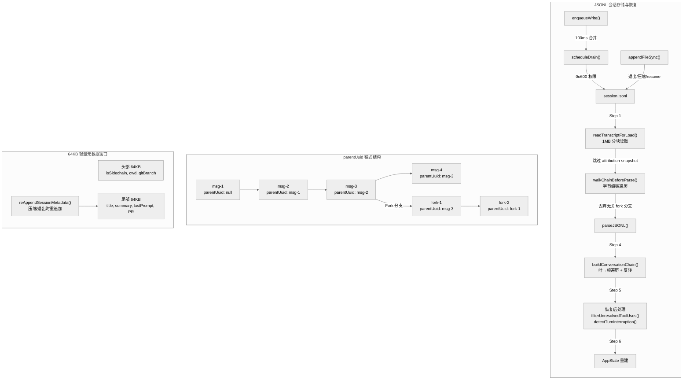
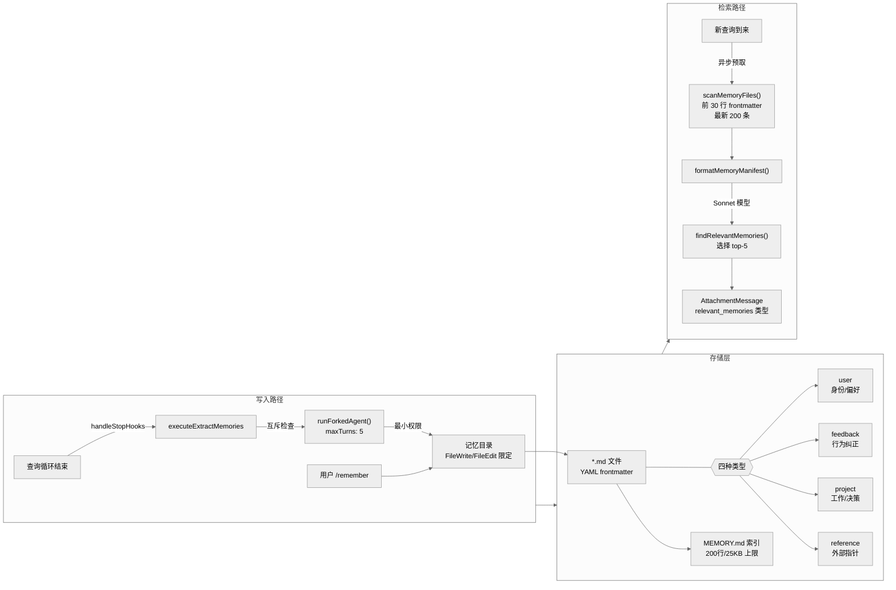

# 第07章 会话与记忆

Claude Code 的会话持久化与记忆系统是其实现跨会话连续性的核心基础设施。会话转录以 JSONL 格式追加写入磁盘，通过 `parentUuid` 链式结构支持分支和恢复；记忆系统则在四类型分类法的约束下，由后台 Forked Agent 自动提取持久化知识，并通过 Sonnet 驱动的语义检索在新会话中召回相关记忆。

---

## 7.1 JSONL 追加格式

### 7.1.1 文件路径规则

会话转录文件的存储路径遵循固定的项目级命名规则：

```
~/.claude/projects/{sanitized-cwd}/{session-id}.jsonl
```

路径中的 `sanitized-cwd` 由 `sanitizePath()` 函数生成（`sessionStoragePortable.ts`），将所有非字母数字字符替换为短横线：

```typescript
// sessionStoragePortable.ts:312
const sanitized = name.replace(/[^a-zA-Z0-9]/g, '-')
```

当路径超过 200 字符（`MAX_SANITIZED_LENGTH`）时，追加哈希后缀以保证唯一性。Bun 环境使用 `Bun.hash`，Node.js 回退到 `simpleHash`（内部调用 `djb2Hash`）：

```typescript
// sessionStoragePortable.ts:316-318
const hash = typeof Bun !== 'undefined'
  ? Bun.hash(name).toString(36)
  : simpleHash(name)
return `${sanitized.slice(0, MAX_SANITIZED_LENGTH)}-${hash}`
```

子 Agent 转录写入独立的 JSONL 文件，位于会话目录下的 `subagents/` 子目录：

```
{projectDir}/{sessionId}/subagents/agent-{agentId}.jsonl
{projectDir}/{sessionId}/subagents/agent-{agentId}.meta.json  // 元数据
```

远程 Agent 元数据则写入 `remote-agents/` 子目录：

```
{projectDir}/{sessionId}/remote-agents/remote-agent-{taskId}.meta.json
```

### 7.1.2 Entry 类型体系

JSONL 文件中每行是一个 JSON 对象（Entry）。`Entry` 是一个联合类型（`logs.ts`），涵盖以下所有条目类型：

| 类型 | 说明 |
|------|------|
| `TranscriptMessage` | 对话消息（user/assistant/attachment/system），包含 `uuid`、`parentUuid`、`timestamp`（ISO 字符串）等字段 |
| `SummaryMessage` | 压缩摘要，包含 `leafUuid` 和 `summary` 字段 |
| `CustomTitleMessage` | 用户设置的会话标题 |
| `AiTitleMessage` | AI 生成的会话标题（优先级低于 custom-title） |
| `LastPromptMessage` | 最后的用户提示 |
| `TaskSummaryMessage` | 周期性 fork 生成的进行中工作摘要（供 `claude ps` 显示） |
| `TagMessage` | 会话标签 |
| `AgentNameMessage` / `AgentColorMessage` / `AgentSettingMessage` | Agent 外观和配置 |
| `PRLinkMessage` | GitHub PR 关联 |
| `ModeEntry` | 会话模式（coordinator/normal） |
| `WorktreeStateEntry` | Worktree 状态 |
| `ContentReplacementEntry` | 内容替换记录（上下文压缩产物） |
| `FileHistorySnapshotMessage` | 文件历史快照 |
| `AttributionSnapshotMessage` | 归因快照 |
| `QueueOperationMessage` | 消息队列操作 |
| `SpeculationAcceptMessage` | 推测执行接受记录 |
| `ContextCollapseCommitEntry` | 上下文折叠提交（type 为混淆命名 `marble-origami-commit`） |
| `ContextCollapseSnapshotEntry` | 上下文折叠快照（type 为 `marble-origami-snapshot`） |

其中 `TranscriptMessage` 的格式示例：

```json
{
  "type": "user",
  "uuid": "a1b2c3d4-e5f6-7890-abcd-ef1234567890",
  "parentUuid": "98765432-abcd-ef01-2345-678901234567",
  "message": { "role": "user", "content": "..." },
  "timestamp": "2026-04-11T10:30:00.000Z",
  "isSidechain": false,
  "cwd": "/home/user/project",
  "sessionId": "session-uuid",
  "version": "2.1.888",
  "userType": "ant"
}
```

注意 `timestamp` 是 ISO 字符串格式，不是 Unix 数字时间戳。`SummaryMessage` 包含必要的 `leafUuid` 字段，用于定位摘要对应的链叶节点。

### 7.1.3 parentUuid 链式机制



对话消息通过 `parentUuid` -> `uuid` 形成单向链表。每条消息指向其逻辑上的前一条消息，从而构建完整的对话历史。

**分支（Fork）**：子 Agent 的转录写入独立 JSONL 文件，fork 继承 parent UUID，共享主链前缀。

**压缩边界**：当上下文压缩发生时，边界消息的 `parentUuid` 被设为 `null`，标志着新链的起点。`isCompactBoundaryMessage()` 函数检测这类消息。

**链构建**：`buildConversationChain()`（`sessionStorage.ts:2070-2094`）从叶节点沿 `parentUuid` 向上遍历至根节点，反转后返回从根到叶的有序消息数组：

```typescript
export function buildConversationChain(
  messages: Map<UUID, TranscriptMessage>,
  leafMessage: TranscriptMessage,
): TranscriptMessage[] {
  const transcript: TranscriptMessage[] = []
  const seen = new Set<UUID>()
  let currentMsg: TranscriptMessage | undefined = leafMessage
  while (currentMsg) {
    if (seen.has(currentMsg.uuid)) {
      // 环检测 — 防止死循环
      break
    }
    seen.add(currentMsg.uuid)
    transcript.push(currentMsg)
    currentMsg = currentMsg.parentUuid
      ? messages.get(currentMsg.parentUuid)
      : undefined
  }
  transcript.reverse()
  return recoverOrphanedParallelToolResults(messages, transcript, seen)
}
```

最后调用的 `recoverOrphanedParallelToolResults()` 处理两种丢失模式：
1. **Sibling assistant orphaned**：单 parent 遍历跳过了同一消息的兄弟 assistant 块及其 tool_result
2. **Progress-fork**（遗留，pre-#23537）：旧转录中 progress 消息参与了链，工具结果被遗落

### 7.1.4 追加写入的原子性保证

写入路径分为异步队列和同步直写两条：

**异步队列**（正常运行时）：

```
enqueueWrite() -> scheduleDrain() -> 100ms 合并批写
```

`FLUSH_INTERVAL_MS = 100`，即 100ms 内的多次写入合并为一次磁盘 I/O。文件模式始终为 `0o600`（仅文件所有者可读写）。

**同步直写**（进程退出、元数据重追加）：

`appendEntryToFile()` 使用 `fs.appendFileSync()`，文件模式同为 `0o600`。被 `reAppendSessionMetadata()` 在压缩、退出和 `--resume` 接管时调用。

**UUID 去重**：`appendEntry()` 通过 `messageSet.has(entry.uuid)` 检测重复，防止同一消息被写入两次。

---

## 7.2 会话恢复的完整链路

会话恢复是将磁盘上的 JSONL 文件重建为内存中对话状态的过程，涉及多个模块协作。

### 7.2.1 恢复流程

```
readTranscriptForLoad() -> parseJSONL() -> loadTranscriptFile()
  -> buildConversationChain() -> deserializeMessagesWithInterruptDetection()
    -> restoreSessionStateFromLog()
```

**Step 1: readTranscriptForLoad**（`sessionStoragePortable.ts:717+`）

单次前向分块读取（chunk size 1MB），在文件描述符级别完成两项优化：
- 跳过 `attribution-snapshot` 行（大块归因数据不参与恢复）
- 检测并处理压缩边界（`compact_boundary`）— 遇到边界时清空已读内容，仅保留边界之后的数据

对超过 5MB（`SKIP_PRECOMPACT_THRESHOLD`）的文件启用此优化路径。

**Step 2: walkChainBeforeParse**（`sessionStorage.ts:3307+`）

对大文件在完整 JSON 解析前先做字节级链遍历，通过提取 `uuid` 和 `parentUuid` 字段值（纯字节扫描，不解析 JSON），提前丢弃不在当前链路上的 fork 分支行，减少后续 `parseJSONL` 的工作量。

**Step 3: progressBridge**（`sessionStorage.ts:3624-3646`）

旧版转录中 progress 消息参与了 `parentUuid` 链，新版已将 progress 移出 Entry 联合类型。恢复时需要桥接：记录每个 progress 的 `uuid -> parentUuid` 映射，将后续消息的 `parentUuid` 重写为最近的非 progress 祖先。

**Step 4: buildConversationChain**

如 7.1.3 节所述，从叶节点沿链遍历并反转。

**Step 5: 恢复后处理**（`conversationRecovery.ts`）

- `filterUnresolvedToolUses()`：移除没有对应 tool_result 的 tool_use
- `filterOrphanedThinkingOnlyMessages()`：移除只有思考内容无实际输出的 assistant 消息
- `detectTurnInterruption()`：检测对话是否中途中断

中断检测逻辑：当最后一条消息是 `tool_result` 类型的 user 消息（且非 terminal tool result）时，判定为 `interrupted_turn`，自动注入 `"Continue from where you left off."` 的 `isMeta: true` 用户消息，使模型在恢复后自动继续。

**Step 6: 状态重建**

分散在 `sessionRestore.ts`（`restoreSessionStateFromLog`、`restoreAgentFromSession`、`restoreWorktreeForResume`）和 `conversationRecovery.ts`（`loadConversationForResume`）中，重建 AppState、Agent 状态、Worktree 环境等。

### 7.2.2 64KB 轻量元数据窗口

完整恢复代价高昂。对于 `--resume` 的列表展示（选择哪个会话恢复），只需要每个会话的摘要信息。`readLiteMetadata` 只读取文件头尾各 64KB（`LITE_READ_BUF_SIZE = 65536`）：

- **头部 64KB**：提取 `isSidechain`、`projectPath`（cwd）、`teamName`、`agentSetting`、`gitBranch`
- **尾部 64KB**：提取 `customTitle`、`aiTitle`、`summary`（AI 摘要）、`tag`、`lastPrompt`、`prUrl`/`prNumber`/`prRepository`（PR 关联）

`reAppendSessionMetadata()` 在压缩、退出和 `--resume` 接管时将关键元数据重追加到文件末尾，确保它们始终落在尾部 64KB 窗口内。重追加的条目包括：`last-prompt`、`custom-title`、`tag`、`agent-name`、`agent-color`、`agent-setting`、`mode`、`worktree-state`、`pr-link`。

---

## 7.3 四类型记忆分类法



记忆系统采用封闭分类法，仅包含四种类型（`memoryTypes.ts`）：

```typescript
export const MEMORY_TYPES = ['user', 'feedback', 'project', 'reference'] as const
```

| 类型 | 用途 | 作用域倾向 |
|------|------|-----------|
| `user` | 用户身份、角色、偏好 | 始终 private |
| `feedback` | 行为纠正和肯定 — 同时记录失败和成功 | 默认 private |
| `project` | 进行中的工作、决策、目标 — 要求将相对日期规范化为绝对日期 | 倾向 team |
| `reference` | 外部系统指针和文档引用 | 通常 team |

### 严格排除规则

以下内容**不得保存为记忆**，即使用户明确要求：

- 代码模式和架构（可从代码推导）
- Git 历史和提交信息
- 调试方案和临时细节
- CLAUDE.md 已涵盖的内容

### 记忆存储格式

每条记忆是一个独立的 Markdown 文件，带 YAML frontmatter：

```markdown
---
name: "memory title"
description: "one-line description for retrieval"
type: "user"
---

Memory content here...
```

`description` 是语义检索的核心依据 — Sonnet 模型基于 description 判断哪些记忆与当前查询相关。

---

## 7.4 MEMORY.md 索引与语义检索

### 7.4.1 MEMORY.md 索引

`MEMORY.md` 是记忆目录的索引文件，每次会话通过 `getUserContext()` -> `getMemoryFiles()` -> `getAutoMemEntrypoint()` 加载到用户上下文中（效果等同于系统提示词的一部分）。

容量限制：200 行 / 25KB（`MAX_ENTRYPOINT_LINES = 200`、`MAX_ENTRYPOINT_BYTES = 25_000`）。超出时按行截断优先，再按字节截断。

注意：当 `tengu_moth_copse` GrowthBook flag 开启时，MEMORY.md 索引可能不注入。

### 7.4.2 Sonnet 驱动的语义检索

当新查询到来时，系统异步预取相关记忆（`pendingMemoryPrefetch`）：

**1. 扫描阶段**（`memoryScan.ts`）：

`scanMemoryFiles()` 并行读取记忆目录中每个 `.md` 文件的前 30 行（`FRONTMATTER_MAX_LINES = 30`）提取 frontmatter。按修改时间排序，保留最新 200 条（`MAX_MEMORY_FILES = 200`）。

**2. 格式化清单**：

`formatMemoryManifest()` 将扫描结果格式化为文本清单：

```
- [user] preferences.md (2026-04-11T10:30:00.000Z): User prefers terse responses
- [project] auth-migration.md (2026-04-10T08:00:00.000Z): OAuth migration status
```

**3. 选择阶段**（`findRelevantMemories.ts`）：

将清单和用户查询发送给 Sonnet 模型（`getDefaultSonnetModel()`），选择最多 5 个最相关的记忆文件。

**4. 注入阶段**：

选中的记忆文件被完整读取，作为 `AttachmentMessage`（attachment type 为 `relevant_memories`）注入对话。这不是 `isMeta: true` 的普通用户消息，而是专门的 Attachment 消息类型，在 `query.ts` 中通过 `pendingMemoryPrefetch` 异步完成。

```typescript
// attachments.ts:500
{ type: 'relevant_memories', memories: [...] }
```

整个预取过程对用户透明，延迟约 250ms（AKI 端点）。

---

## 7.5 后台 Forked Agent 自动提取

### 7.5.1 触发机制

每个完整查询循环结束后（模型产生无工具调用的最终响应），`executeExtractMemories` 作为 `handleStopHooks` 的一部分被调用。

触发频率由 GrowthBook flag `tengu_bramble_lintel` 控制（默认值 1，即每轮都触发）。代码中没有"6 条消息"的硬编码阈值 — `countModelVisibleMessagesSince` 仅用于日志和传递给提取 prompt 的参考值，不参与触发判断。

```typescript
// extractMemories.ts:374-385
if (!isTrailingRun) {
  turnsSinceLastExtraction++
  if (
    turnsSinceLastExtraction <
    (getFeatureValue_CACHED_MAY_BE_STALE('tengu_bramble_lintel', null) ?? 1)
  ) {
    return
  }
}
turnsSinceLastExtraction = 0
```

### 7.5.2 互斥与并发防护

- **与主 Agent 互斥**：`hasMemoryWritesSince()` 检查主 Agent 本轮是否已写入记忆目录。如果是，跳过后台提取并推进游标。
- **并发防护**：`inProgress` 标志防止两个提取 Agent 同时运行。当新请求到达时，暂存到 `pendingContext`，当前运行结束后在 `finally` 块中执行 trailing run。

### 7.5.3 Forked Agent 模式

使用 `runForkedAgent()` 创建主对话的完美 fork，共享 Prompt Cache：

```typescript
// extractMemories.ts:415-427
const result = await runForkedAgent({
  promptMessages: [createUserMessage({ content: userPrompt })],
  cacheSafeParams,
  canUseTool,
  querySource: 'extract_memories',
  forkLabel: 'extract_memories',
  skipTranscript: true,    // 不记录到主转录
  maxTurns: 5,             // 硬限 5 轮，防止兔子洞
})
```

### 7.5.4 最小权限

`createAutoMemCanUseTool()` 精确限制 Forked Agent 的工具权限：

| 权限 | 工具 |
|------|------|
| **无限制** | FileRead、Grep、Glob（只读工具） |
| **限定目录** | FileWrite、FileEdit — 仅允许写入记忆目录 |
| **只读命令** | Bash — 仅当 `tool.isReadOnly(input)` 返回 true |
| **允许** | REPL（当启用时，内部操作仍受上述限制） |
| **拒绝** | 其他所有工具 |

---

## 7.6 记忆目录路径计算

记忆目录（auto-memory）的路径计算有一个重要特性：优先使用 canonical git root 作为 key。

```typescript
// paths.ts:203-205
function getAutoMemBase(): string {
  return findCanonicalGitRoot(getProjectRoot()) ?? getProjectRoot()
}
```

这使得同一 repo 的多个 worktree 共享同一个记忆目录。而主转录目录使用的是 `getOriginalCwd()` 作为 key — 两者使用不同的基路径。

完整解析顺序：
1. `CLAUDE_COWORK_MEMORY_PATH_OVERRIDE` 环境变量（全路径覆盖）
2. `autoMemoryDirectory` settings.json 配置（仅 policy/local/user 来源，出于安全原因排除 projectSettings）
3. `{memoryBase}/projects/{sanitized-git-root}/memory/`（默认计算）

---

## 7.7 Session Memory

Session Memory 是独立于 auto-memory 的另一条记忆管线，自动维护当前对话的 Markdown 摘要文件。

### 7.7.1 Feature Gate

Session Memory 受 `tengu_session_memory` GrowthBook flag 门控（`sessionMemory.ts:81`）：

```typescript
function isSessionMemoryGateEnabled(): boolean {
  return getFeatureValue_CACHED_MAY_BE_STALE('tengu_session_memory', false)
}
```

配置可通过 `tengu_sm_config` GrowthBook 远程覆盖。

### 7.7.2 文件路径

Session Memory 文件位于会话级目录下，而非全局文件：

```
{projectDir}/{sessionId}/session-memory/summary.md
```

由 `getSessionMemoryPath()`（`filesystem.ts:269-271`）计算：

```typescript
export function getSessionMemoryPath(): string {
  return join(getSessionMemoryDir(), 'summary.md')
}
```

### 7.7.3 触发阈值

Session Memory 的更新由多个阈值共同控制（`sessionMemoryUtils.ts`）：

```typescript
export const DEFAULT_SESSION_MEMORY_CONFIG: SessionMemoryConfig = {
  minimumMessageTokensToInit: 10000,  // 初始化需达到 10K token
  minimumTokensBetweenUpdate: 5000,   // 两次更新间隔 5K token
  toolCallsBetweenUpdates: 3,         // 两次更新间隔 3 次工具调用
}
```

触发逻辑（`shouldExtractMemory()`）：
1. 首次需达到 `minimumMessageTokensToInit`（10K token）才会初始化
2. 之后在以下条件之一满足时触发：
   - token 阈值 AND 工具调用阈值均满足
   - token 阈值满足 AND 最后一个 assistant 轮次无工具调用（自然对话间隙）
3. token 阈值是**必要条件** — 即使工具调用阈值满足，也必须等 token 阈值满足

---

## 7.8 CLAUDE.md 与记忆的层级关系

CLAUDE.md 文件和记忆系统构成了一个分层的知识注入体系：

| 层级 | 来源 | 注入位置 |
|------|------|---------|
| 1 | 管理指令 `/etc/claude-code/CLAUDE.md` | 系统提示词 |
| 2 | 用户指令 `~/.claude/CLAUDE.md` | 系统提示词 |
| 3 | 项目指令 `{projectRoot}/CLAUDE.md` | 用户上下文 |
| 4 | 本地指令 `CLAUDE.local.md` | 用户上下文 |
| 5 | 记忆索引 `memory/MEMORY.md` | 用户上下文 |
| 6 | 按需召回的记忆文件 | `AttachmentMessage`（`relevant_memories` 类型） |

层级 1-5 在每次会话中自动加载。层级 6 是按需语义检索的结果，作为 Attachment 消息注入而非普通用户消息。

---

## 7.9 记忆的时效性管理

### 新鲜度标记

`memoryAge.ts` 提供人类可读的时间距离和新鲜度警告：

| 天数 | 显示 | 是否追加警告 |
|------|------|-------------|
| 0 天 | "today" | 否 |
| 1 天 | "yesterday" | 否 |
| N 天 | "N days ago" | 是 |

2 天及以上的记忆会追加警告文本：

> This memory is N days old. Memories are point-in-time observations, not live state -- claims about code behavior or file:line citations may be outdated. Verify against current code before asserting as fact.

### 信任召回规则

`TRUSTING_RECALL_SECTION`（`memoryTypes.ts`）要求模型在使用记忆内容前进行验证：

1. 验证记忆中提到的文件路径是否仍存在
2. 验证函数名和签名是否与当前代码一致
3. 验证 feature flag 和配置值是否仍然有效

---

## 7.10 安全性：记忆路径不可信

记忆路径的安全验证分为两个独立模块：

### 团队记忆路径（`teamMemPaths.ts`）

`sanitizePathKey()` 执行多层检测：
- 空字节注入检测
- URL 编码遍历检测（`%2e%2e%2f`，decode 后检查 `..` 和 `/`）
- Unicode 规范化攻击检测（NFKC 规范化后比较）
- 反斜杠和绝对路径拒绝
- 符号链接解析防护（`realpathDeepestExisting()` 递归解析，检测 dangling symlink）

### 个人记忆路径（`paths.ts`）

`validateMemoryPath()` 进行不同但类似的安全验证：
- 绝对路径检查
- 长度限制
- 驱动器根/UNC 路径拒绝
- 空字节检测

### 项目级设置排除

出于安全考虑，`autoMemoryDirectory` 的 `projectSettings` 来源被排除（`.claude/settings.json` 提交在仓库中）。恶意仓库可能设置 `autoMemoryDirectory: "~/.ssh"` 来获取对敏感目录的写入权限。仅 `policySettings`、`flagSettings`、`localSettings`、`userSettings` 可配置此项。

---

## 7.11 关键源文件索引

| 功能领域 | 主要文件 |
|---------|---------|
| JSONL 读写核心 | `src/utils/sessionStorage.ts`、`src/utils/sessionStoragePortable.ts` |
| Entry 类型定义 | `src/types/logs.ts` |
| 会话恢复 | `src/utils/sessionRestore.ts`、`src/utils/conversationRecovery.ts` |
| 记忆类型分类 | `src/memdir/memoryTypes.ts` |
| 记忆路径计算 | `src/memdir/paths.ts` |
| 记忆扫描 | `src/memdir/memoryScan.ts` |
| 记忆检索 | `src/memdir/findRelevantMemories.ts` |
| MEMORY.md 加载/构建提示 | `src/memdir/memdir.ts` |
| 记忆新鲜度 | `src/memdir/memoryAge.ts` |
| 后台提取 Agent | `src/services/extractMemories/extractMemories.ts`、`prompts.ts` |
| Session Memory | `src/services/SessionMemory/sessionMemory.ts`、`sessionMemoryUtils.ts` |
| 团队记忆路径安全 | `src/memdir/teamMemPaths.ts` |
| Agent 记忆 | `src/tools/AgentTool/agentMemory.ts` |
| 记忆注入（Attachment） | `src/utils/attachments.ts` |
