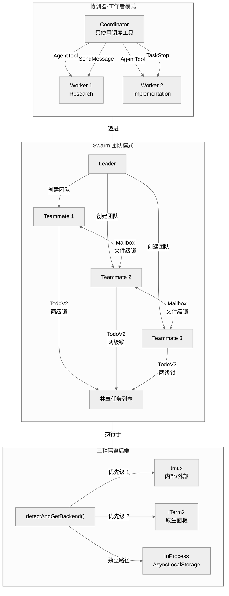
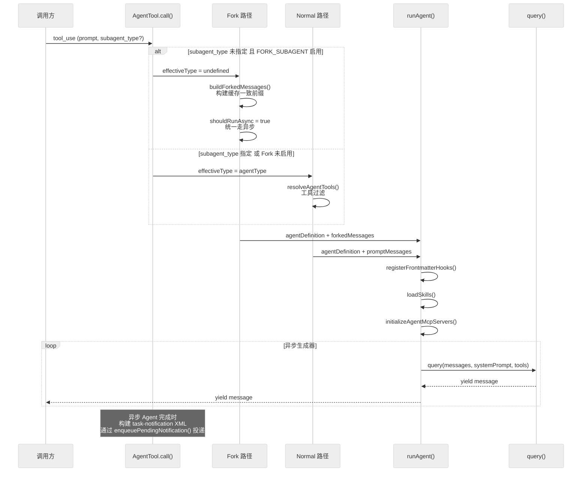

# 第 8 章 多 Agent 架构

Claude Code 的多 Agent 体系是一套分层递进的并行执行框架。从最简单的单子 Agent 到协调器-工作者模式，再到 Swarm 团队模式，三个层级共享同一套底层基础设施：`AgentTool` 工具、`ToolUseContext` 上下文隔离和 `<task-notification>` 结果通知机制。本章以代码验证为基础，逐层解析这套多 Agent 架构的设计与实现。

---

## 8.1 三种递进模式

| 模式 | 入口条件 | 核心特征 |
|------|----------|----------|
| 子 Agent | 默认可用，通过 AgentTool 调用 | 单个子 Agent 执行特定任务 |
| 协调器-工作者 | `feature('COORDINATOR_MODE')` + `CLAUDE_CODE_COORDINATOR_MODE=1` | 主线程只做调度，所有实现工作交给 Worker |
| Swarm 团队 | `isAgentSwarmsEnabled()` 三重门控 | 多个 Teammate 并行协作，共享任务列表和信箱 |

这三种模式的递进关系体现在：子 Agent 是基础执行单元；协调器模式在此之上限制主线程只能使用调度工具；Swarm 模式则进一步引入多 Agent 并行、信箱通信和文件级锁同步。



### 上下文经济学

多 Agent 设计的核心动机是上下文经济学。主线程上下文窗口有限且不可回收，而每个子 Agent 拥有独立的上下文窗口：

- **主线程直接执行 10 步任务**：消耗 10 步的上下文
- **委派给子 Agent**：主线程仅消耗约 2 步（发送 + 接收结果）
- **Fork 子 Agent**：通过 `buildForkedMessages()` 构建缓存一致的前缀，利用 Anthropic API 的 prompt cache 机制（cache read 成本为 input 的 10%），大幅降低 token 成本

---

## 8.2 协调器-工作者模式

### 8.2.1 门控机制

协调器模式通过编译期 feature flag 和运行期环境变量双重门控（`src/coordinator/coordinatorMode.ts:36-41`）：

```typescript
export function isCoordinatorMode(): boolean {
  if (feature('COORDINATOR_MODE')) {
    return isEnvTruthy(process.env.CLAUDE_CODE_COORDINATOR_MODE)
  }
  return false
}
```

### 8.2.2 协调器工具集

协调器的工具被严格限制。`src/constants/tools.ts:105-110` 定义核心白名单：

```typescript
export const COORDINATOR_MODE_ALLOWED_TOOLS = new Set([
  AGENT_TOOL_NAME,       // 派发 Worker
  TASK_STOP_TOOL_NAME,   // 终止 Worker
  SEND_MESSAGE_TOOL_NAME,// 向已有 Worker 发送后续消息
  SYNTHETIC_OUTPUT_TOOL_NAME, // 结构化输出
])
```

`src/utils/toolPool.ts:35-40` 的 `applyCoordinatorToolFilter()` 在过滤时额外放行 PR activity subscription MCP 工具（以 `subscribe_pr_activity` / `unsubscribe_pr_activity` 结尾的工具名），因为订阅管理是协调层行为，不应委派给 Worker。

### 8.2.3 协调器系统提示词

`getCoordinatorSystemPrompt()` 从第 111 行到 `coordinatorMode.ts` 文件末尾（第 369 行），约 258 行函数体，定义了协调器的完整行为规范。

**四阶段工作流**（协调器系统提示词第 200-230 行）：

| 阶段 | 执行者 | 目的 |
|------|--------|------|
| Research | Workers（并行） | 调查代码库、理解问题 |
| Synthesis | 协调器自身 | 综合发现，撰写实现规格 |
| Implementation | Workers | 按规格实施变更 |
| Verification | Workers | 验证变更正确性 |

**核心铁律**：`coordinatorMode.ts:259` 明确规定 "Never write 'based on your findings'"。协调器必须在 Synthesis 阶段自行理解 Worker 的研究发现，然后用具体的文件路径、行号和变更说明撰写 Worker 的实现指令，而不是把理解工作推给 Worker。

**Continue vs Spawn 决策**：协调器系统提示词 Section 5 定义了详细的决策表——当 Worker 的已有上下文与下一个任务高度重叠时使用 `SendMessage` 继续，否则用 `AgentTool` 派发新 Worker。

---

## 8.3 AgentTool 调度链路

`AgentTool.tsx`（1834 行）是所有子 Agent 派发的入口。其核心调度逻辑在 `call()` 方法中实现。

### 8.3.1 Fork 与 Normal 分支



AgentTool 的第一个关键决策是判定走 Fork 路径还是 Normal 路径（`AgentTool.tsx:475-483`）：

```typescript
const effectiveType =
  subagent_type ??
  (isForkSubagentEnabled() ? undefined : GENERAL_PURPOSE_AGENT.agentType)
const isForkPath = effectiveType === undefined
```

逻辑：
- 如果用户显式指定了 `subagent_type`，直接使用
- 如果未指定且 Fork 实验开启（`isForkSubagentEnabled()` 为 true），走 Fork 路径（effectiveType 为 undefined）
- 如果未指定且 Fork 实验关闭，使用默认的 General Purpose Agent

`isForkSubagentEnabled()`（`forkSubagent.ts:32-38`）受三个条件约束：`feature('FORK_SUBAGENT')` 编译期开关为真、不在协调器模式下、不在非交互会话中。Fork 与协调器互斥——协调器已经拥有自己的调度模型。

### 8.3.2 Fork 路径的缓存优化

Fork 路径的核心设计目标是最大化 prompt cache 命中率。多个 Fork 子 Agent 必须产生字节级相同的 API 请求前缀：

1. **系统提示词继承**：使用父级已渲染的 `renderedSystemPrompt`（`AgentTool.tsx:728`），而非重新构建。重新构建可能因 GrowthBook 状态变化导致字节差异。
2. **工具定义一致**：`useExactTools: true`（`AgentTool.tsx:908`）让子 Agent 直接使用父级的工具数组，不经过 `resolveAgentTools()` 过滤。
3. **占位 tool_result**：`buildForkedMessages()`（`forkSubagent.ts:107-110`）为所有 tool_use 块构建统一的占位结果 `'Fork started -- processing in background'`（`forkSubagent.ts:93`），只有最后一个 text block（指令）不同，从而最大化共享前缀。

`CacheSafeParams` 类型（`src/utils/forkedAgent.ts:57-68`）封装了缓存安全所需的五个参数：系统提示词、用户上下文、系统上下文、ToolUseContext 和 Fork 上下文消息。

### 8.3.3 异步判定

`shouldRunAsync` 的判定条件（`AgentTool.tsx:825-832`）：

```typescript
const shouldRunAsync =
  (run_in_background === true ||
    selectedAgent.background === true ||
    isCoordinator ||
    forceAsync ||
    assistantForceAsync ||
    (proactiveModule?.isProactiveActive() ?? false)) &&
  !isBackgroundTasksDisabled
```

其中 `forceAsync` 在 Fork 实验开启时为 true（所有 Fork 派发统一走异步），`assistantForceAsync` 在 KAIROS 模式下生效。`isBackgroundTasksDisabled` 由环境变量 `CLAUDE_CODE_DISABLE_BACKGROUND_TASKS` 控制。

此外，同步 Agent 还支持自动转后台机制：`getAutoBackgroundMs()`（`AgentTool.tsx:151-159`）在条件满足时返回 120,000ms（120 秒），超时后同步 Agent 自动转为后台任务。

### 8.3.4 异步 Agent 生命周期

异步 Agent 通过 `registerAsyncAgent()` 注册到任务系统。完成时，`LocalAgentTask.tsx:338-343` 构建 `<task-notification>` XML 并通过 `enqueuePendingNotification()` 投递：

```xml
<task-notification>
<task-id>{agentId}</task-id>
<output-file>{outputPath}</output-file>
<status>completed|failed|killed</status>
<summary>{human-readable status summary}</summary>
<result>{agent's final text response}</result>
<usage>
  <total_tokens>N</total_tokens>
  <tool_uses>N</tool_uses>
  <duration_ms>N</duration_ms>
</usage>
<worktree>...</worktree>
</task-notification>
```

通知使用原子 `notified` 标志防止重复投递（`LocalAgentTask.tsx:295-308`）：`updateTaskState` 原子检查并设置 `task.notified`。

---

## 8.4 runAgent() -- 子 Agent 初始化与执行

`runAgent.ts`（973 行）是子 Agent 的初始化和执行引擎。

### 8.4.1 异步生成器模式

`runAgent()` 是一个 `async function*` 异步生成器（`runAgent.ts:248`），而非普通的 async 函数：

```typescript
export async function* runAgent({
  agentDefinition,
  promptMessages,
  toolUseContext,
  // ... 20+ 参数
}): AsyncGenerator<Message, void> {
```

它通过 `for await...of query()` 逐消息 yield，实现流式处理：

```typescript
for await (const message of query({
  messages: initialMessages,
  systemPrompt: agentSystemPrompt,
  // ...
})) {
  // 过滤、记录、yield
  if (isRecordableMessage(message)) {
    await recordSidechainTranscript([message], agentId, lastRecordedUuid)
    yield message
  }
}
```

子 Agent 与主 Agent 使用完全相同的 `query()` 函数（`runAgent.ts:748`）。

### 8.4.2 Hooks 注册

Frontmatter hooks 通过 `registerFrontmatterHooks()` 注册（`runAgent.ts:568`），传入 `isAgent: true` 将 Stop hooks 转换为 SubagentStop hooks。注意：代码中不存在名为 `registerAgentHooks()` 的函数。

```typescript
if (agentDefinition.hooks && hooksAllowedForThisAgent) {
  registerFrontmatterHooks(
    rootSetAppState,
    agentId,
    agentDefinition.hooks,
    `agent '${agentDefinition.agentType}'`,
    true, // isAgent - converts Stop to SubagentStop
  )
}
```

当 hooks 被锁定为 plugin-only 模式时，非 admin-trusted 来源的 Agent 的 frontmatter hooks 注册会被跳过。

### 8.4.3 Skills 加载

Skills 通过内联逻辑加载（`runAgent.ts:578-646`），而非独立的注册函数。流程：

1. `getSkillToolCommands()` 获取所有可用 skill 命令列表
2. 遍历 Agent frontmatter 中声明的 `skills` 数组
3. `resolveSkillName()` 尝试三种策略解析 skill 名称（精确匹配、plugin 前缀、后缀匹配）
4. `getCommand()` 获取具体 skill 定义
5. `skill.getPromptForCommand()` 加载 skill 内容
6. 通过 `createUserMessage()` 将内容作为消息添加到 `initialMessages`

### 8.4.4 MCP 服务器初始化

`initializeAgentMcpServers()`（`runAgent.ts:649-656`）合并父级 MCP 客户端和 Agent 特定的 MCP 配置。签名为 `(agentDefinition, parentClients)`。只有新创建的 inline MCP 客户端在 Agent 结束时清理（通过 `finally` 块调用 `mcpCleanup()`），父级客户端保持不变。

当 MCP 被锁定为 plugin-only 模式时（`runAgent.ts:117-128`），跳过非 admin-trusted Agent 的 frontmatter MCP 配置。

### 8.4.5 上下文隔离

`createSubagentContext()`（`src/utils/forkedAgent.ts:345`）基于"默认隔离、显式共享"原则创建子 Agent 上下文。关键隔离字段包括：

- 独立的 `messages` 数组
- 独立的 `readFileState` 缓存
- 独立的 `abortController`（异步 Agent 获得新的，同步 Agent 共享父级的）
- 独立的 `localDenialTracking`、`discoveredSkillNames` 等

同步 Agent 共享父级的 `setAppState`，异步 Agent 则完全隔离。

---

## 8.5 Swarm 团队模式

### 8.5.1 门控机制

`isAgentSwarmsEnabled()`（`src/utils/agentSwarmsEnabled.ts:24-44`）实现分级门控：

1. **Ant 内部用户**：直接返回 true
2. **外部用户**：需要 `CLAUDE_CODE_EXPERIMENTAL_AGENT_TEAMS=1` 环境变量或 `--agent-teams` CLI flag
3. **远程关闭开关**：GrowthBook gate `tengu_amber_flint`，默认值为 `true`（即 GrowthBook 不可达时默认放行）。这是一个远程关闭开关，用于紧急情况下全局禁用

### 8.5.2 TaskState 类型体系

`src/tasks/types.ts:12-19` 定义了七种 TaskState 变体：

```typescript
export type TaskState =
  | LocalShellTaskState
  | LocalAgentTaskState
  | RemoteAgentTaskState
  | InProcessTeammateTaskState
  | LocalWorkflowTaskState
  | MonitorMcpTaskState
  | DreamTaskState
```

其中 `InProcessTeammateTaskState`（`src/tasks/InProcessTeammateTask/types.ts`）包含 `TeammateIdentity`、`AbortController`、`permissionMode`、`pendingUserMessages`、`isIdle` 等字段，是 Swarm 模式下 InProcess 执行的核心状态类型。

消息数组设有 **50 条**上限，常量名为 `TEAMMATE_MESSAGES_UI_CAP`（`types.ts:101`）：

```typescript
export const TEAMMATE_MESSAGES_UI_CAP = 50
```

超出时通过 `slice(-(TEAMMATE_MESSAGES_UI_CAP - 1))` 丢弃最旧的消息。

### 8.5.3 Mailbox 信箱系统

信箱系统是 Swarm 模式下 tmux/iTerm2 Teammate 之间的异步通信机制。

**信箱路径**（`src/utils/teammateMailbox.ts:56-65`）：

```
~/.claude/teams/{team-name}/inboxes/{agent-name}.json
```

**并发控制**：使用 `proper-lockfile` 做文件级锁，锁选项定义在 `teammateMailbox.ts:35-41`：

```typescript
const LOCK_OPTIONS = {
  retries: {
    retries: 10,    // 最多重试 10 次
    minTimeout: 5,  // 最小 5ms
    maxTimeout: 100, // 最大 100ms
  },
}
```

指数退避重试 **10 次**，间隔 5-100ms。整个文件约 1,187 行，涵盖消息读写、标记已读、锁管理等完整操作。

### 8.5.4 TodoV2 任务系统

TodoV2（`src/utils/tasks.ts`，862 行）实现了文件级锁的分布式任务管理，支持多个并发 Agent 共享任务列表。

**存储结构**：每个任务一个独立的 `{taskId}.json` 文件，加上目录级 `.lock` 和 `.highwatermark` 文件。

**两级锁机制**：
- **任务级锁**（`tasks.ts:566`）：对单个 `taskPath` 加锁，用于更新单个任务
- **目录级锁**（`tasks.ts:293`, `tasks.ts:628`）：对 `.lock` 文件加锁，执行跨任务原子操作（如 `claimTaskWithBusyCheck`）

`claimTaskWithBusyCheck`（`tasks.ts:618-638`）在目录级锁保护下原子执行：读取所有任务 -> 检查 Agent 忙碌状态 -> 认领任务。

TodoV2 的锁选项比 Mailbox 更激进（`tasks.ts:102-107`）：

```typescript
const LOCK_OPTIONS = {
  retries: {
    retries: 30,    // 30 次重试
    minTimeout: 5,
    maxTimeout: 100,
  },
}
```

注释说明这是为 ~10+ 个并发 swarm agent 设计的，30 次重试给出约 2.6 秒的总等待窗口。

**taskListId 解析的 5 层优先级**（`tasks.ts:199-210`）：
1. `CLAUDE_CODE_TASK_LIST_ID` 环境变量
2. InProcess teammate context 的 `teamName`
3. `getTeamName()`（进程级 teammate 的团队名）
4. `leaderTeamName`（Leader 创建团队时设置）
5. `getSessionId()`（独立会话兜底）

---

## 8.6 三种 Worker 隔离后端

Swarm 模式的 Teammate 可以在三种后端中执行。`detectAndGetBackend()`（`src/utils/swarm/backends/registry.ts:136-254`）按以下优先级检测：

| 优先级 | 条件 | 后端 | 说明 |
|--------|------|------|------|
| 1 | 已在 tmux 内（`isInsideTmux()`） | tmux | 直接复用当前 tmux session |
| 2 | 在 iTerm2 内 + `it2` CLI 可用 | iTerm2 | 使用原生 iTerm2 面板 |
| 3 | tmux 可用（外部安装） | tmux | 创建外部 tmux session |
| — | 以上均不可用 | 抛错 | `detectAndGetBackend()` 抛出安装指引错误 |

```
detectAndGetBackend() 决策流程：
  已在 tmux 内？ -> tmux（isNative: true）
  在 iTerm2 内？
    用户偏好 tmux？ -> 跳过 iTerm2 检测
    it2 CLI 可用？ -> iTerm2（isNative: true）
    tmux 可用？ -> tmux（isNative: false, needsIt2Setup: true）
    都不可用？ -> 抛错
  tmux 可用？ -> tmux（isNative: false）
  都不可用？ -> 抛错
```

注意还有一个 `getPreferTmuxOverIterm2()` 偏好设置，用户可以在 iTerm2 环境下主动选择使用 tmux 而非原生面板。

**InProcess 后端**是独立于 `detectAndGetBackend()` 的另一条路径，由 `isInProcessEnabled()`（`registry.ts:351`）控制。InProcess **不在** `detectAndGetBackend()` 的优先级链中——当 `teammateMode === 'in-process'`、非交互式会话（`-p` 模式）、或 `markInProcessFallback()` 标记了回退时启用。InProcess 后端（`src/utils/swarm/inProcessRunner.ts`）使用 `AsyncLocalStorage` 提供上下文隔离，每个 Teammate 在独立的异步上下文中运行。

检测结果被缓存（`cachedDetectionResult`），整个进程生命周期内后端选择固定不变。

---

## 8.7 Worktree 隔离环境

Git Worktree 为 Agent 提供文件系统级别的隔离，避免多个 Agent 同时修改同一份工作目录产生冲突。

### 8.7.1 Worktree 创建

Agent worktree slug 格式为 `agent-{earlyAgentId.slice(0, 8)}`（`AgentTool.tsx:860`），其中 `createAgentId()` 返回 `a` + 16 hex 字符，`slice(0, 8)` 取 `a` + 7 hex，最终形如 `agent-a1b2c3d4`。

Worktree 目录位于 `.claude/worktrees/<slug>/`。Slug 验证规则（`worktree.ts:49,66-80`）：
- 最长 64 字符（`MAX_WORKTREE_SLUG_LENGTH = 64`）
- 只允许 `[a-zA-Z0-9._-]`
- 禁止 `..` 和绝对路径

创建使用 `git worktree add -B`（覆盖式分支创建）。快速恢复路径通过 `readWorktreeHeadSha()` 检测已存在的 worktree。

### 8.7.2 进入和退出工具

`EnterWorktreeTool` 和 `ExitWorktreeTool` 提供运行时的 worktree 管理。

`ExitWorktreeTool` 支持两种策略（`ExitWorktreeTool.ts:33`）：
- `keep`：保留 worktree
- `remove`：删除 worktree（需要 `discard_changes: true` 显式确认）

Remove 策略执行多层安全检查：
1. `countWorktreeChanges()` 检测未提交变更
2. 如果有变更且未设置 `discard_changes: true`，拒绝操作
3. `countWorktreeChanges()` 返回 null（无法确定）时采用 fail-closed 策略，拒绝操作

### 8.7.3 孤立 Worktree 清理

`cleanupStaleAgentWorktrees()` 清理超过 30 天（`DEFAULT_CLEANUP_PERIOD_DAYS = 30`）的孤立 worktree。清理条件（`worktree.ts:1098-1118`）：
- 无未提交的 tracked 文件（`git status --porcelain -uno`）
- 所有提交已推送远程（`git rev-list HEAD --not --remotes`）
- 非当前会话的 worktree

---

## 8.8 内建 Agent 类型

`src/tools/AgentTool/builtInAgents.ts` 注册内建 Agent。根据环境条件动态组装可用列表：

| Agent 类型 | 主要特征 | 模型 | 特殊配置 |
|-----------|----------|------|----------|
| General Purpose | 默认通用子 Agent | 继承 | - |
| Explore | 只读搜索，跳过 CLAUDE.md 和 gitStatus | 外部: haiku, 内部: inherit | `omitClaudeMd: true` |
| Plan | 只读规划，跳过 gitStatus | 继承 | `omitClaudeMd: true` |
| Verification | 验证变更正确性 | 继承 | 禁止 Agent/Edit/Write/NotebookEdit/ExitPlanMode |
| Claude Code Guide | 面向非 SDK 入口的引导 Agent | - | 仅非 SDK 入口启用 |
| Statusline Setup | 状态栏配置 | - | - |

Explore 和 Plan Agent 受 `areExplorePlanAgentsEnabled()` 控制（feature flag `BUILTIN_EXPLORE_PLAN_AGENTS` + GrowthBook gate `tengu_amber_stoat`）。

Verification Agent 受独立的 feature flag `VERIFICATION_AGENT` 和 GrowthBook gate `tengu_hive_evidence`（默认 false）控制。其系统提示词定义了两类反模式（verification avoidance 和 "seduced by the first 80%"）以及 `VERDICT: PASS|FAIL|PARTIAL` 判决格式。它的 `disallowedTools` 排除 Agent、ExitPlanMode、FileEdit、FileWrite 和 NotebookEdit，确保验证者只能观察不能修改。

在协调器模式下，`getCoordinatorAgents()`（`src/coordinator/workerAgent.ts`）提供协调器专属的 Agent 列表，当前该文件为 stub（4 行），返回空数组。

### Fork 子 Agent

Fork 不注册在 `builtInAgents` 中，而是以合成 Agent 定义存在于 `forkSubagent.ts:60-71`：

```typescript
export const FORK_AGENT = {
  agentType: 'fork',
  tools: ['*'],
  maxTurns: 200,
  model: 'inherit',
  permissionMode: 'bubble',
  source: 'built-in',
  // getSystemPrompt 未使用 -- Fork 直接继承父级已渲染的系统提示词
  getSystemPrompt: () => '',
}
```

Fork 通过 `permissionMode: 'bubble'` 将权限提示冒泡到父终端，`model: 'inherit'` 保持与父级相同的模型以确保上下文长度一致。

---

## 8.9 四层工具过滤流水线

`agentToolUtils.ts:70-116` 的 `filterToolsForAgent()` 实现四层过滤：

1. **MCP 工具始终放行**：`tool.name.startsWith('mcp__')` 的工具直接通过，绕过所有后续过滤
2. **全局禁止列表**（`ALL_AGENT_DISALLOWED_TOOLS`）：所有 Agent 均不可使用的工具
3. **自定义 Agent 禁止列表**（`CUSTOM_AGENT_DISALLOWED_TOOLS`）：仅对非内建 Agent 生效
4. **异步白名单**（`ASYNC_AGENT_ALLOWED_TOOLS`）：异步 Agent 只能使用白名单内的工具

在此之上，`resolveAgentTools()` 还应用 Agent 自身 `disallowedTools` 配置。

InProcess Teammate 有特殊豁免：即使作为异步 Agent，也允许使用 AgentTool（用于派发同步子 Agent）和 `IN_PROCESS_TEAMMATE_ALLOWED_TOOLS` 中的任务工具。

---

## 8.10 权限透传

### InProcess Teammate 权限桥接

InProcess Teammate 通过 `getLeaderToolUseConfirmQueue()`（`src/utils/swarm/leaderPermissionBridge.ts:34-36`）获取 Leader 的权限审批队列，实现权限请求冒泡到主终端。

### Agent 权限模式继承

`runAgent.ts:412-498` 的权限处理逻辑：

1. Agent 自身定义了 `permissionMode` 时，覆盖父级模式
2. 但如果父级是 `bypassPermissions`、`acceptEdits` 或 `auto` 模式，父级优先（这些更宽松的模式不应被收紧）
3. 异步 Agent 设置 `shouldAvoidPermissionPrompts: true`，自动拒绝需要交互的权限请求
4. `permissionMode: 'bubble'` 的 Agent 例外，总是显示提示（冒泡到父终端）
5. 提供 `allowedTools` 时替换所有 session 级 allow rules，但保留 SDK 的 `cliArg` 规则

---

## 8.11 关键源文件索引

| 文件 | 行数 | 职责 |
|------|------|------|
| `src/tools/AgentTool/AgentTool.tsx` | 1,834 | Agent 派发入口，fork/normal 分支，异步/同步路由 |
| `src/tools/AgentTool/runAgent.ts` | 973 | Agent 初始化和执行引擎（异步生成器） |
| `src/tools/AgentTool/forkSubagent.ts` | 210 | Fork 实验，`buildForkedMessages()`，递归防护 |
| `src/tools/AgentTool/agentToolUtils.ts` | 687 | 四层工具过滤，Agent 结果处理 |
| `src/tools/AgentTool/builtInAgents.ts` | 72 | 内建 Agent 注册逻辑 |
| `src/coordinator/coordinatorMode.ts` | 369 | 协调器模式门控和系统提示词 |
| `src/utils/forkedAgent.ts` | 689 | `CacheSafeParams`，`createSubagentContext()` |
| `src/utils/teammateMailbox.ts` | 1,187 | 信箱系统，文件级锁通信 |
| `src/utils/tasks.ts` | 862 | TodoV2 任务系统，两级锁机制 |
| `src/utils/agentSwarmsEnabled.ts` | 44 | Swarm 模式三重门控 |
| `src/utils/swarm/` | 21 文件, ~7,200 行 | 后端检测、InProcess 运行器、权限桥接 |
| `src/utils/swarm/backends/registry.ts` | 464 | 后端优先级检测和缓存 |
| `src/tasks/types.ts` | 46 | 七种 TaskState 联合类型定义 |
| `src/tasks/InProcessTeammateTask/types.ts` | ~120 | InProcess Teammate 状态和消息上限 |
| `src/tasks/LocalAgentTask/LocalAgentTask.tsx` | 804 | 异步 Agent 任务管理和通知生成 |
