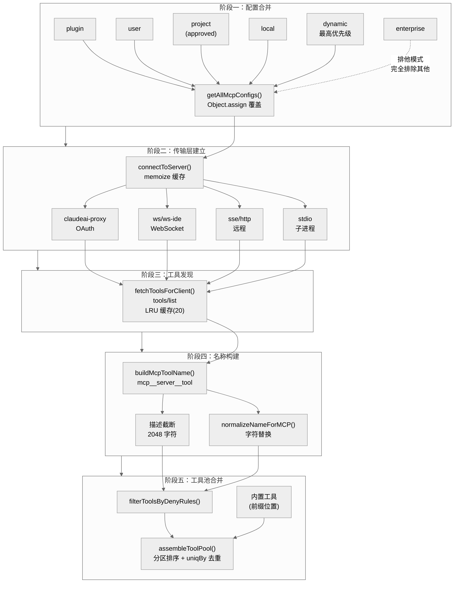
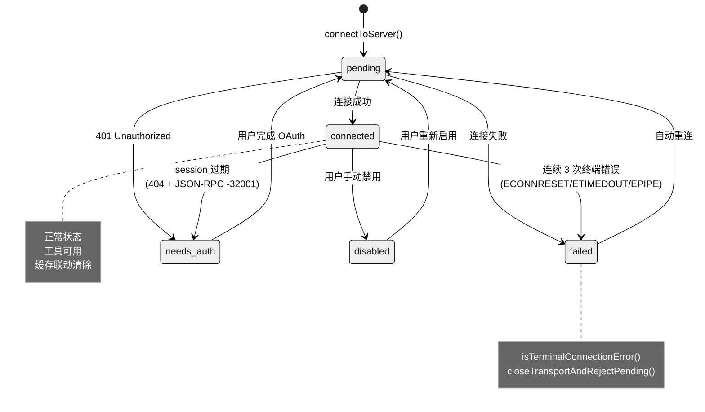

# 第九章 MCP 协议集成

MCP（Model Context Protocol）是 Claude Code 与外部工具提供者之间的通信协议。通过 MCP，Claude Code 能够在运行时动态发现并调用第三方工具服务器提供的能力，使模型的工具箱从内置工具扩展到几乎无限的外部生态。

本章基于 `src/services/mcp/` 目录下的实际代码，剖析 MCP 集成的完整架构：从配置加载到传输层建立，从工具发现到执行调用，从认证体系到安全隔离。

---

## 9.1 三角架构

MCP 集成遵循三方协作模型：

- **Client**：Claude Code 进程本身，负责管理与各 MCP Server 的连接，发现可用工具并路由调用请求。核心实现在 `client.ts`，使用 `@modelcontextprotocol/sdk/client/index.js` 提供的 `Client` 类。
- **Server**：外部工具提供者，每个 Server 暴露一组工具（tools）、资源（resources）和命令（commands）。Server 可以是本地 stdio 进程，也可以是远程 HTTP/SSE/WebSocket 服务。
- **LLM**：Claude 模型通过 `tool_use` 消息表达调用意图，Client 将请求路由到对应 Server 执行后，将结果作为 `tool_result` 回传给模型。

这个三角架构的关键设计决策是：MCP 工具与内置工具共享完全相同的执行链路。`fetchToolsForClient()`（client.ts）将 MCP 工具转换为标准 `Tool` 接口，包含 `checkPermissions()`、`call()`、`isReadOnly()` 等方法。`assembleToolPool()`（tools.ts）将 MCP 工具与内置工具合并到同一工具池。对于模型和权限系统而言，MCP 工具与内置工具没有本质区别。

---

## 9.2 五阶段流水线：从配置到可用工具

MCP 工具从配置文件到被模型调用，需要经过五个阶段。这是一条严格有序的流水线，每个阶段的输出是下一个阶段的输入。



### 阶段一：配置合并

`getAllMcpConfigs()` 函数（config.ts）负责从多种来源收集 MCP 服务器定义。系统定义了七种配置作用域（`ConfigScopeSchema`，types.ts）：

| 作用域 | 来源 | 说明 |
|--------|------|------|
| `dynamic` | 运行时注入 | 最高优先级，覆盖所有其他配置 |
| `local` | `.claude/settings.local.json` | 本地开发配置 |
| `project` | `.claude/settings.json` | 项目级配置（需审批） |
| `user` | 用户全局配置 | 个人 MCP 服务器 |
| `enterprise` | 企业管理配置 | 排他控制模式（见下文） |
| `claudeai` | Claude.ai 远程配置 | 最低优先级 |
| `managed` | 受管策略 | 插件管控 |

合并逻辑核心是 `Object.assign()` 的属性覆盖——后写入的作用域覆盖先写入的。`getClaudeCodeMcpConfigs()` 中合并顺序为 plugin -> user -> project(approved) -> local，local 覆盖 project 覆盖 user。dynamic 通过展开语法 `{ ...claudeCodeConfigs, ...dynamicMcpConfig }` 获得最高优先级。

**Enterprise 排他控制**是一个值得特别注意的设计：当企业配置存在时（`doesEnterpriseMcpConfigExist()` 返回 true），系统不走正常的合并流程，而是直接返回仅包含企业服务器的配置集。代码注释明确说明了设计意图——"enterprise customers often do not want their users to be able to add their own MCP servers"。这不是简单的优先级覆盖，而是完全排除其他所有作用域的排他模式。所有配置都经过 Zod Schema（`McpServerConfigSchema`，types.ts）验证，确保类型安全。

### 阶段二：传输层建立

`connectToServer()` 函数（client.ts）根据配置中的 `type` 字段选择传输层实现。该函数使用 lodash 的 `memoize` 装饰器缓存连接对象，缓存键由 `getServerCacheKey()` 生成，格式为 `${name}-${JSON.stringify(serverRef)}`。相同配置的重复连接请求会直接返回缓存的连接对象。

连接建立有并发控制：本地服务器（stdio/sdk）默认并发 3（`getMcpServerConnectionBatchSize()`），远程服务器默认并发 20（`getRemoteMcpServerConnectionBatchSize()`），均可通过环境变量覆盖。

### 阶段三：工具发现

连接建立后，`fetchToolsForClient()` 调用 MCP 协议的 `tools/list` 端点获取服务器暴露的工具列表。该函数使用 LRU 缓存（容量 20，由常量 `MCP_FETCH_CACHE_SIZE` 定义），以服务器名称为键。LRU 策略确保在服务器数量较多时不会无限增长缓存。

### 阶段四：名称构建与描述截断

每个 MCP 工具需要一个全局唯一的名称。`buildMcpToolName()`（mcpStringUtils.ts）按 `mcp__${serverName}__${toolName}` 格式拼接，其中服务器名和工具名都经过 `normalizeNameForMCP()`（normalization.ts）标准化——将所有非字母数字及非下划线短横线的字符替换为下划线。对于 claude.ai 来源的服务器名称，还会折叠连续下划线并去除首尾下划线，防止与 `__` 分隔符冲突。

值得注意的是，虽然 `normalizeNameForMCP` 的注释引用了 `^[a-zA-Z0-9_-]{1,64}$` 模式，但代码中并未实施 64 字符的长度截断——仅做字符集替换，不限制长度。

工具描述被截断至 2048 字符（`MAX_MCP_DESCRIPTION_LENGTH`）。这个限制的背景是：OpenAPI 生成的 MCP 服务器常把 15-60KB 的端点文档塞入 `tool.description`，截断是为了控制发送给模型的 token 开销。服务器的 `instructions` 字段也使用同一常量截断。

### 阶段五：工具池合并

`assembleToolPool()`（tools.ts）将内置工具和 MCP 工具合并为最终的工具列表。合并策略有两个关键设计：

1. **分区排序**：内置工具和 MCP 工具各自按名称排序，内置工具作为连续前缀。这是为了 prompt-cache 稳定性——服务端的缓存策略在最后一个内置工具之后设置断点，如果 MCP 工具穿插在内置工具之间，会导致缓存失效。
2. **名称去重**：使用 `uniqBy(..., 'name')` 去重，由于内置工具排在前面，同名冲突时内置工具优先。这防止了 MCP 工具意外覆盖内置工具行为。

在合并之前，MCP 工具会经过 `filterToolsByDenyRules()` 过滤，确保被管理员禁止的工具不会进入工具池。

---

## 9.3 八种传输层

`McpServerConfigSchema`（types.ts）是八种配置类型的 Zod union，对应不同的传输层实现。`connectToServer()` 中的 switch 分支处理每种类型：

| 类型 | 传输方式 | 典型场景 |
|------|----------|----------|
| `stdio` | 子进程 stdin/stdout | 本地工具（默认类型） |
| `sse` | Server-Sent Events | 远程 HTTP 长连接 |
| `http` | Streamable HTTP | 远程 HTTP（MCP 规范推荐） |
| `sse-ide` | SSE（IDE 内部） | VS Code 等 IDE 扩展 |
| `ws-ide` | WebSocket（IDE 内部） | IDE 扩展（支持认证头） |
| `ws` | WebSocket | 远程双向通信 |
| `claudeai-proxy` | Streamable HTTP + OAuth | Claude.ai 代理服务器 |
| `sdk` | 进程内传输 | Agent SDK 内部使用（不走 `connectToServer`） |

其中 `sdk` 类型较为特殊：代码中明确 `throw new Error('SDK servers should be handled in print.ts')`，它不走常规的 `connectToServer` 路径，而是使用 `SdkControlClientTransport` 进行进程内通信。`TransportSchema`（types.ts）枚举了 6 种类型（stdio, sse, sse-ide, http, ws, sdk），而 `McpServerConfigSchema` 的 union 更完整地包含了全部 8 种。

### stdio 传输与进程生命周期

stdio 传输是最常用的本地传输方式。`StdioClientTransport` 启动子进程，通过 stdin/stdout 交换 JSON-RPC 消息。

**环境变量展开**：stdio 配置中的 `env` 字段支持通过 `expandEnvVarsInString()`（envExpansion.ts）展开环境变量。该函数使用正则 `/\$\{([^}]+)\}/g`，仅支持 `${VAR}` 和 `${VAR:-default}` 两种语法。**不支持**裸 `$VAR` 语法（不带花括号）。未定义的变量保持原样（返回 `${VAR}` 原文）不会被替换为空字符串，同时记录到 `missingVars` 数组供错误报告使用。

**进程清理信号升级**：stdio 服务器关闭时采用渐进式信号升级策略，确保 Docker 容器等需要显式信号的场景也能正确清理：

1. 发送 `SIGINT`，等待 100ms
2. 检查进程存活，若仍在运行则发送 `SIGTERM`，等待 400ms
3. 再次检查存活，若仍在运行则发送 `SIGKILL` 强制终止
4. 600ms failsafe 超时作为兜底——无论进程状态如何，超时后停止监控

整个过程通过 50ms 间隔的 `setInterval` 轮询进程存活状态，确保进程提前退出时能立即清理定时器。

### 远程传输的认证集成

SSE 和 HTTP 传输都通过 `ClaudeAuthProvider` 实现 OAuth 2.0 认证。`ClaudeAuthProvider`（auth.ts）实现了 MCP SDK 的 `OAuthClientProvider` 接口，支持授权码流程 + PKCE。

对于 `ws-ide` 传输，认证通过 `X-Claude-Code-Ide-Authorization` 请求头传递 IDE 提供的 token。

`claudeai-proxy` 传输使用 `StreamableHTTPClientTransport`，由 `createClaudeAiProxyFetch()` 注入 OAuth bearer token 并实现 401 自动重试。

### 请求超时的 Bun 优化

`wrapFetchWithTimeout()`（client.ts）使用独立的 `setTimeout` + `AbortController` 为每个请求创建超时，而非使用 `AbortSignal.timeout()`。代码注释解释了原因：Bun 运行时对 `AbortSignal.timeout` 的 GC 存在问题——每个请求会滞留约 2.4KB 原生内存长达 60 秒，即使请求已毫秒级完成。GET 请求不设置超时，因为 MCP 传输中的 GET 是长期存活的 SSE 流。

---

## 9.4 连接管理

### React Hook 驱动

`useManageMCPConnections()`（useManageMCPConnections.ts）是管理所有 MCP 服务器连接生命周期的 React Hook。它初始化连接、注册事件处理器、管理自动重连、同步连接状态到 AppState。

`MCPConnectionManager`（MCPConnectionManager.tsx）通过 React Context API 对外暴露连接管理功能，提供 `useMcpReconnect` 和 `useMcpToggleEnabled` 两个 hooks 供 UI 组件使用。

### 连接状态

`MCPServerConnection` 类型（types.ts）定义了五种连接状态：



| 状态 | 含义 |
|------|------|
| `connected` | 正常连接，可用 |
| `pending` | 连接建立中 |
| `failed` | 连接失败（可能重试） |
| `needs-auth` | 需要用户完成认证流程 |
| `disabled` | 用户手动禁用 |

### 错误检测与自动重连

远程传输（SSE/HTTP/claudeai-proxy）的错误处理有两层机制：

**连续终端错误计数**：`isTerminalConnectionError()` 检测 ECONNRESET、ETIMEDOUT、EPIPE、EHOSTUNREACH、ECONNREFUSED 等错误。连续 3 次终端错误（`MAX_ERRORS_BEFORE_RECONNECT = 3`）后，主动调用 `closeTransportAndRejectPending()` 关闭传输层并拒绝所有挂起的请求 Promise。非终端错误会重置计数器。

**Session 过期检测**：`isMcpSessionExpiredError()` 检测 HTTP 404 + JSON-RPC 错误码 -32001 的组合。两个条件同时满足才判定为 session 过期（避免普通 404 的误判）。检测到过期后立即关闭传输并触发重连。

### 缓存清理联动

连接关闭时（`client.onclose`），系统联动清除四类缓存：工具缓存（`fetchToolsForClient.cache`）、资源缓存（`fetchResourcesForClient.cache`）、命令缓存（`fetchCommandsForClient.cache`）和连接缓存（`connectToServer.cache`）。如果 MCP_SKILLS feature 启用，还会清除 skills 缓存。这确保重连后会获取最新的工具列表，而非使用过期数据。

---

## 9.5 工具注解映射

MCP 工具的元数据注解被映射为 Claude Code 的 Tool 接口属性：

| MCP 注解 | Tool 属性 | 含义 |
|----------|-----------|------|
| `readOnlyHint` | `isReadOnly()` / `isConcurrencySafe()` | 只读工具，可安全并发 |
| `destructiveHint` | `isDestructive()` | 破坏性操作 |
| `openWorldHint` | `isOpenWorld()` | 影响外部世界 |
| `title` | `userFacingName()` | 用户可见的工具显示名 |

注解均为可选字段，未提供时回退到合理默认值（`readOnlyHint` 默认 false 意味着默认不并发安全，`destructiveHint` 默认 false）。

权限检查方面，所有 MCP 工具的 `checkPermissions()` 统一返回 `{ behavior: 'passthrough' }`，表示需要通过交互式权限提示获取用户确认。这与内置工具可以声明 `allow` 或 `deny` 行为不同——MCP 工具来自不受信任的外部源，必须经过用户确认。

---

## 9.6 工具执行链路

MCP 工具被模型调用时，执行链路如下：

1. **MCPTool.call()**：从 `fetchToolsForClient()` 返回的工具闭包中发起调用
2. **ensureConnectedClient()**：确认连接仍然有效，必要时重建连接
3. **callMCPToolWithUrlElicitationRetry()**：执行实际的 MCP `tools/call` 请求，支持 URL elicitation 重试
4. **Session 过期重试**：捕获 `McpSessionExpiredError` 后最多重试一次（`MAX_SESSION_RETRIES = 1`）

### 结果处理

**文本内容**：通过 `truncateMcpContentIfNeeded()`（mcpValidation.ts）智能截断，默认上限 25000 token（`DEFAULT_MAX_MCP_OUTPUT_TOKENS`）。超出限制的内容被持久化到文件，模型收到的是一条指引消息，说明如何通过 Read 工具分段读取完整输出。

**二进制内容**：通过 `persistBinaryContent()`（mcpOutputStorage.ts）处理。所有二进制 blob 无条件持久化到磁盘——不存在大小阈值判断。存储路径为 `${projectDir}/${sessionId}/tool-results/`（由 `getToolResultsDir()` 在 toolResultStorage.ts 中定义），文件扩展名根据 MIME 类型映射（`extensionForMimeType()`）。写入后返回文件路径供模型通过 Read 工具访问。

`isBinaryContentType()` 判断内容是否为二进制：`text/*` 和 JSON/XML 等结构化文本被视为非二进制，其余 `application/*` 类型（如 PDF、Office 文档）被视为二进制。

---

## 9.7 OAuth 认证体系

### 核心认证流程

`ClaudeAuthProvider`（auth.ts）实现了完整的 OAuth 2.0 授权码流程 + PKCE。它作为 MCP SDK 的 `OAuthClientProvider` 接口实现，被 SSE 和 HTTP 传输使用。

连接超时默认 30 秒（`getConnectionTimeoutMs()` 返回 30000，可通过 `MCP_TIMEOUT` 环境变量覆盖）。

### 认证失败处理

当远程服务器返回 401 时，`handleRemoteAuthFailure()` 将服务器标记为需要认证（`needs-auth` 状态），并调用 `setMcpAuthCacheEntry()` 写入认证缓存文件（位于 `~/.claude/mcp-needs-auth-cache.json`），缓存 TTL 为 15 分钟（`MCP_AUTH_CACHE_TTL_MS = 15 * 60 * 1000`）。这避免了在短时间内反复尝试已知需要认证的服务器。

### XAA 跨应用访问

`xaa.ts` 实现了跨应用访问（Cross-App Access）协议，包含 RFC 8693 Token Exchange 和 RFC 7523 JWT Bearer Grant。`xaaIdpLogin.ts` 实现 IdP OIDC 登录。配置通过 `McpXaaConfigSchema`（types.ts）定义——它是一个简单的 boolean flag，实际的 IdP 连接详情来自全局 `settings.xaaIdp` 配置。

### OAuth Step-up

`wrapFetchWithStepUpDetection()`（auth.ts）检测 403 Forbidden + `insufficient_scope` 响应，标记 step-up pending 状态，后续重定向到授权流程获取更高权限范围。认证服务器的 metadata URL 必须使用 HTTPS（通过 `McpOAuthConfigSchema` 中的 `.startsWith('https://')` 约束强制执行）。

---

## 9.8 安全隔离机制

MCP 的安全设计贯穿多个层面：

**权限 passthrough**：所有 MCP 工具的 `checkPermissions()` 返回 `passthrough`，强制每次调用都通过交互式权限提示。用户可以通过 `addRules` 建议将特定工具加入本地白名单。

**Deny 规则过滤**：`filterToolsByDenyRules()` 在工具池合并前过滤被管理员禁止的工具。权限检查使用完全限定的 `mcp__server__tool` 名称（由 `getToolNameForPermissionCheck()` 返回），防止 MCP 工具通过与内置工具同名来绕过针对内置工具的 deny 规则。

**Enterprise 排他控制**：企业配置存在时完全排除其他作用域的服务器。`filterMcpServersByPolicy()` 对企业服务器本身也应用策略过滤。

**名称标准化**：`normalizeNameForMCP()` 确保工具名只包含安全字符，防止名称注入。

**描述截断**：2048 字符上限防止恶意服务器通过超长描述进行 prompt 注入。

**进程隔离**：stdio 服务器运行在独立子进程中，通过信号升级策略确保可靠清理。子进程使用 `subprocessEnv()` 构建的受控环境变量集。

**并发控制**：本地和远程连接的并发批量限制防止资源耗尽。

---

## 9.9 实时同步机制

MCP 协议支持三类列表变更通知，`useManageMCPConnections` 为每个连接注册对应的处理器：

| 通知类型 | 触发行为 |
|----------|----------|
| `ToolListChangedNotification` | 刷新工具列表 |
| `PromptListChangedNotification` | 刷新 prompts 和 skills |
| `ResourceListChangedNotification` | 刷新资源和 skills |

收到通知后，Hook 会清除对应的缓存并重新获取数据，将更新批量同步到 AppState。状态更新使用 16ms 的批量刷新窗口（`MCP_BATCH_FLUSH_MS`），将多个服务器的并发连接回调合并为单次 `setAppState` 调用，减少不必要的重渲染。

AppState 中的 `mcp` 对象包含 `clients`、`tools`、`commands`、`resources` 四个核心子状态。

---

## 9.10 官方注册表

系统启动时，`prefetchOfficialMcpUrls()`（officialRegistry.ts）从 Anthropic 官方注册表拉取已知 MCP 服务器列表：

```
https://api.anthropic.com/mcp-registry/v0/servers?version=latest&visibility=commercial
```

返回的 URL 经过标准化（去除查询参数和尾部斜杠）后存入 `Set`。`isOfficialMcpUrl()` 函数可查询某个 URL 是否在官方注册表中。这一信息可能影响 UI 展示或信任级别判断。预拉取有 5 秒超时，失败不影响正常功能。如果环境变量 `CLAUDE_CODE_DISABLE_NONESSENTIAL_TRAFFIC` 被设置，则跳过预拉取。

---

## 9.11 关键代码路径索引

| 模块 | 路径 | 核心职责 |
|------|------|----------|
| 传输层分发 | `src/services/mcp/client.ts` | `connectToServer` 按 type 分发到八种传输 |
| 配置合并 | `src/services/mcp/config.ts` | `getClaudeCodeMcpConfigs` + `getAllMcpConfigs` |
| 类型定义 | `src/services/mcp/types.ts` | 七种作用域、八种 Config union、五种连接状态 |
| 工具发现 | `src/services/mcp/client.ts` | `fetchToolsForClient`，LRU(20)，Tool 接口映射 |
| 名称工具 | `src/services/mcp/mcpStringUtils.ts` | `buildMcpToolName`、`mcpInfoFromString` |
| 名称标准化 | `src/services/mcp/normalization.ts` | `normalizeNameForMCP`（字符替换，无长度限制） |
| 环境变量展开 | `src/services/mcp/envExpansion.ts` | 仅 `${VAR}` 语法 |
| 工具池合并 | `src/tools.ts` | `assembleToolPool`（分区排序 + uniqBy 去重） |
| OAuth 认证 | `src/services/mcp/auth.ts` | `ClaudeAuthProvider`（PKCE + step-up） |
| XAA 跨应用访问 | `src/services/mcp/xaa.ts` | RFC 8693 Token Exchange + RFC 7523 JWT Bearer |
| 连接管理 Hook | `src/services/mcp/useManageMCPConnections.ts` | 连接生命周期、重连、通知处理 |
| 连接管理组件 | `src/services/mcp/MCPConnectionManager.tsx` | Context Provider（reconnect/toggle） |
| 官方注册表 | `src/services/mcp/officialRegistry.ts` | `prefetchOfficialMcpUrls`、`isOfficialMcpUrl` |
| 二进制持久化 | `src/utils/mcpOutputStorage.ts` | `persistBinaryContent`（无大小阈值） |
| 结果存储 | `src/utils/toolResultStorage.ts` | `getToolResultsDir` = `projectDir/sessionId/tool-results/` |
| 输出验证 | `src/utils/mcpValidation.ts` | `truncateMcpContentIfNeeded`（25000 token 上限） |
