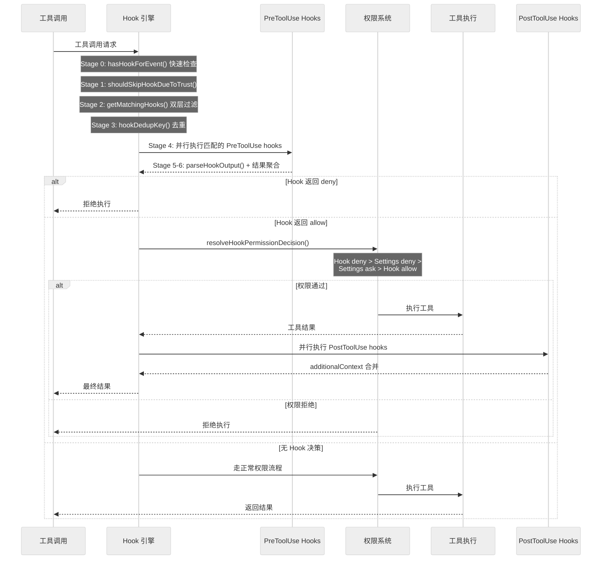
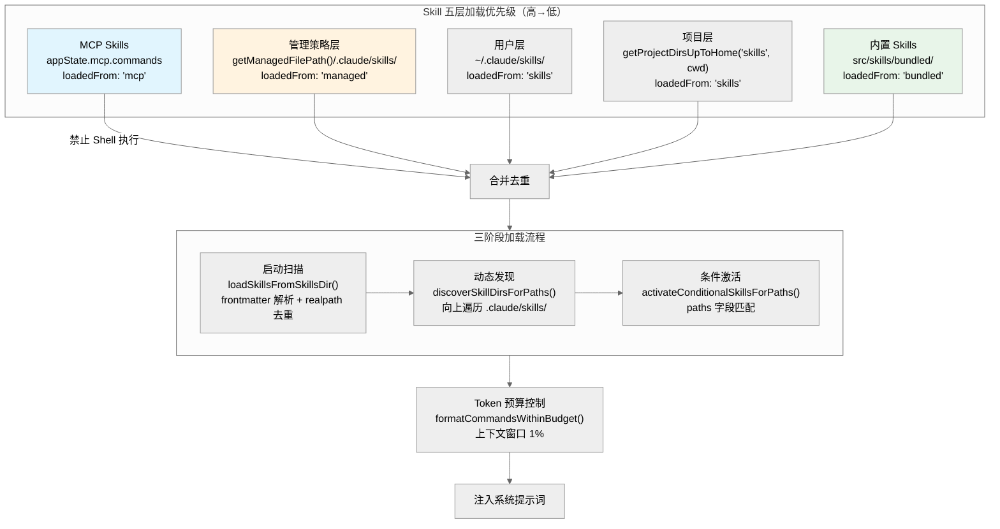

# 第 10 章 Hooks 与扩展

Claude Code 的扩展体系由四层机制构成：**Hooks**（事件驱动的生命周期拦截）、**Skills**（Markdown 定义的能力包）、**Plugins**（带有 Manifest 的完整扩展包）、**Agents**（自定义 AI 角色定义）。四者通过统一的配置层、权限模型和会话管理机制协同工作，形成一个"零侵入"的扩展体系——核心查询循环无需为扩展修改一行代码。

**参考源码**：

| 模块 | 路径 | 说明 |
|------|------|------|
| Hook 核心引擎 | `src/utils/hooks.ts` (5,177 行) | 事件调度、匹配、执行、聚合 |
| Hook 子模块 | `src/utils/hooks/` (21 个文件) | 各类型执行器、快照管理、会话 hook |
| Hook 事件定义 | `src/entrypoints/sdk/coreTypes.ts` | `HOOK_EVENTS` 常量数组 |
| Hook 类型 Schema | `src/schemas/hooks.ts` | 四种可持久化 hook 类型的 Zod schema |
| Hook 响应 Schema | `src/types/hooks.ts` | `syncHookResponseSchema` 定义 |
| 权限粘合层 | `src/services/tools/toolHooks.ts` | `resolveHookPermissionDecision()` |
| Skill 加载 | `src/skills/loadSkillsDir.ts` | 五层发现、frontmatter 解析、懒加载 |
| SkillTool 执行器 | `src/tools/SkillTool/SkillTool.ts` | 统一 Skill 调用入口 |
| Skill Token 预算 | `src/tools/SkillTool/prompt.ts` | `formatCommandsWithinBudget()` |
| Plugin 系统 | `src/utils/plugins/` (44 个 .ts 文件) | 市场、加载、安装、协调 |
| Agent 加载 | `src/tools/AgentTool/loadAgentsDir.ts` | 六层优先级合并 |
| 内置 Agent | `src/tools/AgentTool/built-in/` | 6 个预定义 Agent |
| Settings 配置源 | `src/utils/settings/constants.ts` | `SETTING_SOURCES` 五源定义 |

---

## 10.1 扩展体系概览

四种扩展机制的定位各不相同，但可以自由组合：

| 机制 | 形态 | 触发方式 | 典型用途 |
|------|------|---------|---------|
| **Hook** | settings.json 中的事件处理器 | 27 种生命周期事件自动触发 | CI 门控、权限拦截、遥测上报 |
| **Skill** | SKILL.md 文件（Markdown + YAML frontmatter） | 用户 `/` 命令或模型自动调用 | 封装可复用的提示词和工作流 |
| **Plugin** | 完整包（manifest.json + skills + hooks + tools） | 市场安装或本地注册 | 第三方工具集成 |
| **Agent** | AGENT.md 文件（Markdown + YAML frontmatter） | `AgentTool.call()` 或用户 `/agent` 命令 | 定义专用 AI 角色（验证器、探索器等） |

**组合关系**：Plugin 内部可以包含 Skills、Hooks 和 Agent 定义。Skill 的 frontmatter 可以定义 Hook（通过 `registerFrontmatterHooks()` 注册为会话级 hook）。Agent 定义可以预加载 Skills 并挂载 MCP 服务器。

---

## 10.2 Hook 事件全景

### 27 种事件

所有 Hook 事件定义在 `src/entrypoints/sdk/coreTypes.ts` 的 `HOOK_EVENTS` 常量数组中：

```typescript
export const HOOK_EVENTS = [
  'PreToolUse', 'PostToolUse', 'PostToolUseFailure',
  'Notification', 'UserPromptSubmit', 'SessionStart', 'SessionEnd',
  'Stop', 'StopFailure', 'SubagentStart', 'SubagentStop',
  'PreCompact', 'PostCompact', 'PermissionRequest', 'PermissionDenied',
  'Setup', 'TeammateIdle', 'TaskCreated', 'TaskCompleted',
  'Elicitation', 'ElicitationResult', 'ConfigChange',
  'WorktreeCreate', 'WorktreeRemove', 'InstructionsLoaded',
  'CwdChanged', 'FileChanged',
] as const
```

### 事件分类与匹配字段

`getMatchingHooks()` 内部通过 switch 语句为每个事件确定 `matchQuery`——这是第一层过滤的匹配键：

| 事件类别 | 事件 | Matcher 字段 | 匹配含义 |
|----------|------|-------------|---------|
| **工具生命周期** | `PreToolUse` / `PostToolUse` / `PostToolUseFailure` | `tool_name` | 工具名称 |
| **权限** | `PermissionRequest` / `PermissionDenied` | `tool_name` | 工具名称 |
| **会话** | `SessionStart` | `source` | 启动来源 |
| **会话** | `SessionEnd` | `reason` | 结束原因 |
| **设置** | `Setup` | `trigger` | 触发源 |
| **压缩** | `PreCompact` / `PostCompact` | `trigger` | 触发源 |
| **子 Agent** | `SubagentStart` / `SubagentStop` | `agent_type` | Agent 类型 |
| **通知** | `Notification` | `notification_type` | 通知类型 |
| **MCP 交互** | `Elicitation` / `ElicitationResult` | `mcp_server_name` | MCP 服务器名 |
| **配置** | `ConfigChange` | `source` | 配置源 |
| **文件** | `FileChanged` | `basename(file_path)` | 文件名（取 basename） |
| **指令** | `InstructionsLoaded` | `load_reason` | 加载原因 |
| **无匹配字段** | `UserPromptSubmit` / `Stop` / `TeammateIdle` / `TaskCreated` / `TaskCompleted` / `CwdChanged` / `WorktreeCreate` / `WorktreeRemove` | -- | 无条件匹配（matchQuery 为 undefined） |
| **错误** | `StopFailure` | `error` | 错误信息 |

---

## 10.3 Hook 配置来源与合并

### 三通道聚合架构

`getHooksConfig()` (`hooks.ts:1630-1704`) 从三个渠道聚合 Hook 配置：

**通道一：Settings 快照源**（启动时由 `captureHooksConfigSnapshot()` 冻结）

底层 `SETTING_SOURCES` (`settings/constants.ts:7-22`) 定义了 5 个 settings 源，后序覆盖前序：

| 优先级 | Settings 源 | 路径/来源 |
|--------|------------|----------|
| 1 | `userSettings` | `~/.claude/settings.json` |
| 2 | `projectSettings` | `.claude/settings.json` |
| 3 | `localSettings` | `.claude/settings.local.json` |
| 4 | `flagSettings` | `--settings` CLI 参数指定 |
| 5 | `policySettings` | `managed-settings.json` 或远程 API |

快照一经冻结即不再自动更新。但存在 `updateHooksConfigSnapshot()` 允许通过 `/hooks` 命令手动刷新——它先 `resetSettingsCache()` 清除缓存再重新读取 settings。

**通道二：注册源**（运行时动态）

`getRegisteredHooks()` 返回 SDK 回调和插件原生 hooks。插件 hooks 带有 `pluginRoot` 属性标识来源。当策略要求 `shouldAllowManagedHooksOnly()` 时，带 `pluginRoot` 的 hooks 被过滤。

**通道三：会话源**（按 sessionId 隔离）

`getSessionHooks()` 返回 frontmatter hooks（由 Skill/Agent 定义中的 `hooks` 字段通过 `registerFrontmatterHooks()` 注册）。`getSessionFunctionHooks()` 返回函数 hooks（如 `registerStructuredOutputEnforcement()` 注册的结构化输出强制检查）。两者均按 `sessionId` 隔离，防止一个 Agent 的 hooks 泄漏到另一个。

### 双层过滤

`getMatchingHooks()` (`hooks.ts:1741-`) 实施两层过滤：

1. **Matcher 匹配**：`matchesPattern()` (`hooks.ts:1484-`) 支持三种模式——精确匹配、管道分隔多值（如 `Write|Edit`）、正则表达式。通配 `*` 或省略 matcher 则无条件匹配。

2. **if 条件过滤**：`prepareIfConditionMatcher()` 预编译 `if` 字段，复用权限系统的匹配引擎（支持 `Bash(git *)` 等权限规则语法）进行二次过滤。

两层之间还有**去重层**：`hookDedupKey()` 按 `pluginRoot\0payload` 生成去重键，通过 Map 去重防止同一 hook 从不同路径重复加载。

---

## 10.4 六种执行方式

Hook 支持六种执行类型，四种可持久化到 settings.json（有 Zod schema），两种仅供内部编程使用：

### 可持久化类型

| 类型 | Zod Schema | 默认超时 | 执行方式 |
|------|-----------|---------|---------|
| `command` | `BashCommandHookSchema` | 10 分钟 | Shell 子进程，stdin 接收 JSON 输入，stdout 输出结果 |
| `prompt` | `PromptHookSchema` | 30 秒 | 调用 LLM（默认 Haiku），通过 `createUserMessage()` 构建消息避免递归触发 `UserPromptSubmit` |
| `http` | `HttpHookSchema` | 10 分钟 | POST 请求，五层安全防护 |
| `agent` | `AgentHookSchema` | 60 秒 | 子 Agent 验证器，独立 `hookAgentId` 上下文，工具集被过滤（禁止 Plan Mode 和嵌套 Agent） |

### 内部类型

| 类型 | 注册方式 | 典型用途 |
|------|---------|---------|
| `callback` | `getRegisteredHooks()` SDK 接口 | 文件访问追踪、归因分析等内部回调 |
| `function` | `getSessionFunctionHooks()` | Agent Hook 的 `registerStructuredOutputEnforcement()` 等 |

### Command Hook 的字段

Command hook 是最常用的类型，除了 `command` 和 `if` 外还支持：
- `shell`：Shell 解释器选择（`bash` 使用 `$SHELL`，`powershell` 使用 pwsh）
- `timeout`：覆盖默认 10 分钟超时（单位：秒）
- `statusMessage`：Hook 执行时 spinner 显示的自定义消息
- `once`：执行一次后自动移除
- `async`：后台执行，不阻塞主流程
- `asyncRewake`：后台执行，退出码 2 时通过 `enqueuePendingNotification()` 以 `task-notification` 模式唤醒模型

### Prompt Hook 的递归防护

Prompt Hook 内部通过 `createUserMessage()` 而非 `processUserInput()` 构建消息。代码注释明确说明原因：

```typescript
// Create user message directly - no need for processUserInput which would
// trigger UserPromptSubmit hooks and cause infinite recursion
const userMessage = createUserMessage({ content: processedPrompt })
```

### Agent Hook 的隔离机制

Agent Hook 在 `asAgentId()` 创建的独立 ID 下运行。工具集通过 `ALL_AGENT_DISALLOWED_TOOLS` 过滤。`registerStructuredOutputEnforcement()` 注册一个 Stop 事件的 function hook，检查是否调用了 `SyntheticOutputTool`，强制结构化输出。

### HTTP Hook 的五层安全防护

1. **URL 白名单**：`getHttpHookPolicy().allowedUrls` 检查
2. **环境变量限制**：`interpolateEnvVars()` 仅处理 `allowedEnvVars` 列表中声明的变量
3. **CRLF 防护**：`sanitizeHeaderValue()` 移除 `\r\n\x00`
4. **SSRF 防护**：`ssrfGuardedLookup()` 阻止私有 IP 地址
5. **沙箱代理**：`getSandboxProxyConfig()` 路由至沙箱网络代理

HTTP Hook **不支持** `SessionStart` 和 `Setup` 事件。代码在这两个事件上显式过滤掉 `type === 'http'` 的 hooks。

### Callback 快速路径

当所有匹配的 hooks 均为内部 callback 时，引擎启用快速路径——跳过 JSON 序列化、AbortSignal 创建、span/progress 事件和结果解析循环：

```typescript
// Fast-path: all hooks are internal callbacks (sessionFileAccessHooks,
// attributionHooks). These return {} and don't use the abort signal, so we
// can skip span/progress/abortSignal/processHookJSONOutput/resultLoop.
// Measured: 6.01us -> ~1.8us per PostToolUse hit (-70%).
```

---

## 10.5 Hook 返回值语义

### 退出码协议

| 退出码 | 含义 | 处理方式 |
|--------|------|---------|
| 0 | 成功 | 正常处理 stdout |
| 1 | 一般错误 | 记录错误，不阻塞 |
| 2 | 阻塞性错误 | 阻止继续执行；`asyncRewake` 模式下唤醒模型 |

### JSON 输出 Schema

`syncHookResponseSchema` (`types/hooks.ts:50-`) 定义了标准输出结构：

**顶级字段**：
- `continue`：是否继续（默认 true）
- `suppressOutput`：隐藏 stdout（默认 false）
- `stopReason`：`continue: false` 时显示的消息
- `decision`：`'approve'` 或 `'block'`
- `reason`：决策解释
- `systemMessage`：显示给用户的警告信息

**`hookSpecificOutput`**（discriminated union，按 `hookEventName` 区分）：
- `PreToolUse`：`permissionDecision`、`updatedInput`、`additionalContext`
- `PostToolUse`：`additionalContext`、`updatedMCPToolOutput`
- `UserPromptSubmit`：`additionalContext`
- `SessionStart`：`additionalContext`、`initialUserMessage`、`watchPaths`
- `PermissionRequest`：`decision`（含 `behavior: 'allow'|'deny'` 和可选 `updatedInput`/`updatedPermissions`）
- `PermissionDenied`：`retry`
- `Elicitation`/`ElicitationResult`：`action`、`content`
- `CwdChanged`/`FileChanged`：`watchPaths`
- `WorktreeCreate`：`worktreePath`

注意：`permissionDecision` 是 `hookSpecificOutput` 内部的字段（`hookEventName: 'PreToolUse'` 时），而非顶级字段。

### 多 Hook 结果聚合

当同一事件匹配多个 Hook 时，遵循以下聚合规则：
- **拒绝优先**：任一 Hook 返回 `preventContinuation` 或 `blockingError`，整体即阻止继续
- **上下文合并**：多个 Hook 的 `additionalContexts` 被收集并拼接
- **权限决策优先级**：在 `runPreToolUseHooks()` (`toolHooks.ts`) 中按 deny > ask > allow 优先级处理

### 权限粘合层

`resolveHookPermissionDecision()` (`toolHooks.ts:332-433`) 实现了 Hook 权限决策与 settings 规则的交叉裁决：

**优先级链**（从高到低）：

1. **Hook deny**：直接生效，不检查其他规则
2. **Hook allow + settings deny rule**：settings deny 覆盖 hook allow
3. **Hook allow + settings ask rule**：仍弹出用户确认对话框
4. **Hook allow + 无 settings 规则**：hook 决策生效
5. **无 hook 决策或 ask**：走正常权限流程

特殊机制：如果工具需要用户交互（`requiresUserInteraction`）且 Hook 提供了 `updatedInput`，视为 Hook 代替了用户交互：

```typescript
const interactionSatisfied =
  requiresInteraction && hookPermissionResult.updatedInput !== undefined
```

---

## 10.6 同步、异步与 asyncRewake

Hook 支持三种执行模式：

**同步模式**（默认）：多个匹配的 Hook 通过 `all()` 工具函数（`utils/generators.ts`）并行执行 AsyncGenerator，支持 `concurrencyCap` 参数进行并发控制。结果在 `for await` 循环中逐个收集。

**异步模式**（`async: true`）：当 `hook.async && !forceSyncExecution` 时，Hook 进程被 backgrounding，通过 `registerPendingAsyncHook()` 注册到 `AsyncHookRegistry`。主流程不等待完成。

**asyncRewake 模式**（`asyncRewake: true`）：后台执行，但在进程完成时检查退出码——退出码 0 静默成功；退出码 2 通过 `enqueuePendingNotification()` 以 `task-notification` 模式注入消息，唤醒模型处理。

---

## 10.7 七阶段执行流水线



`executeHooks()` (`hooks.ts:2090-`) 实现了 Stage 0 到 Stage 6 的七阶段流水线：

| Stage | 函数/逻辑 | 说明 |
|-------|----------|------|
| 0 | `hasHookForEvent()` | 快速存在性检查——只检查三个来源是否有对应事件的配置，不检查 matcher。故意过度近似以实现零成本快速路径 |
| 1 | `shouldSkipHookDueToTrust()` | 信任检查——交互模式下要求工作区信任已接受 |
| 2 | `getMatchingHooks()` | Matcher 匹配 + if 条件双层过滤 |
| 3 | `hookDedupKey()` 去重 | 在 `getMatchingHooks()` 内部完成，防止重复执行 |
| 4 | 并行执行 | `hookPromises.map()` + `all(hookPromises)`，hookInput 在进入循环前一次性 JSON 序列化 |
| 5 | `parseHookOutput()` | 检查首字符是否为 `{`，决定 JSON 或纯文本处理 |
| 6 | 结果聚合 | `for await (const result of all(hookPromises))` 循环中按规则聚合 |

---

## 10.8 工作区信任机制

`shouldSkipHookDueToTrust()` (`hooks.ts:287-297`) 是所有 Hook 的安全门控：

```typescript
export function shouldSkipHookDueToTrust(): boolean {
  // In non-interactive mode (SDK), trust is implicit - always execute
  const isInteractive = !getIsNonInteractiveSession()
  if (!isInteractive) {
    return false
  }
  // In interactive mode, ALL hooks require trust
  const hasTrust = checkHasTrustDialogAccepted()
  return !hasTrust
}
```

逻辑清晰地分为两条路径：
- **非交互模式**（SDK/CI）：信任隐式成立，`return false`（不跳过 hook）
- **交互模式**：检查工作区信任对话框是否已接受，未接受则 `return true`（跳过 hook）

注意代码使用中间变量 `isInteractive` 避免双重否定的可读性问题。这是一个安全关键函数——它在 `executeHooks()` 入口处调用，注释标注 "SECURITY: ALL hooks require workspace trust in interactive mode"。

---

## 10.9 Skill 设计哲学与加载层级

### Prompt as Capability

Skill 的核心设计理念是"提示词即能力"——一个 SKILL.md 文件就是一个可被发现、调用、组合的能力单元。相比 Tool 的编程式接口，Skill 是声明式的：通过 Markdown 正文定义行为，通过 YAML frontmatter 声明元数据。

### LoadedFrom 类型

`LoadedFrom` 类型定义在 `src/skills/loadSkillsDir.ts:67`（注意：不在 `src/skills/types.ts`，该文件不存在）：

```typescript
export type LoadedFrom =
  | 'commands_DEPRECATED'
  | 'skills'
  | 'plugin'
  | 'managed'
  | 'bundled'
  | 'mcp'
```

### 五层加载优先级

`getSkillDirCommands()` (`loadSkillsDir.ts:638-804`) 从五个来源发现 Skills：



| 优先级 | 来源 | 路径 | LoadedFrom |
|--------|------|------|-----------|
| 1 | 管理策略层 | `getManagedFilePath()/.claude/skills/` | `'managed'` |
| 2 | 用户层 | `~/.claude/skills/` | `'skills'` |
| 3 | 项目层 | `getProjectDirsUpToHome('skills', cwd)` | `'skills'` |
| 4 | 内置 Skills | `src/skills/bundled/` | `'bundled'` |
| 5 | MCP Skills | `appState.mcp.commands` | `'mcp'` |

### 三阶段加载流程

1. **启动扫描**（`loadSkillsFromSkillsDir()` 第 407-480 行）：遍历子目录，查找 SKILL.md，解析 frontmatter，通过 `getFileIdentity()` 做 `realpath()` 去重。

2. **动态发现**（`discoverSkillDirsForPaths()` 第 861-915 行）：从文件路径向上遍历查找 `.claude/skills/` 目录。当工具操作新目录下的文件时，自动发现路径附近的 Skills。

3. **条件激活**（`activateConditionalSkillsForPaths()` 第 997-1058 行）：带 `paths` 字段的 Skill 存入 `conditionalSkills` Map，只有当操作文件匹配指定路径时才激活。

### 懒加载

`estimateSkillFrontmatterTokens()` 只使用 `name`、`description`、`whenToUse` 三个字段估算 token 开销。Skill 的完整 Markdown 正文在 `getPromptForCommand()` 调用时才读取——发现阶段零正文加载。

### Frontmatter 字段

`parseSkillFrontmatterFields()` (`loadSkillsDir.ts:185-265`) 支持以下字段：

| 字段 | 类型 | 说明 |
|------|------|------|
| `name` | string | 显示名称 |
| `description` | string | 功能描述 |
| `when_to_use` | string | 模型何时应调用此 Skill |
| `version` | string | 版本号 |
| `user-invocable` | boolean | 用户可通过 `/` 命令调用 |
| `disable-model-invocation` | boolean | 禁止模型自动调用 |
| `paths` | string[] | 条件激活的路径模式 |
| `context` | `'fork'` | Fork 模式执行 |
| `agent` | boolean | 以 Agent 身份运行 |
| `model` | string | 覆盖模型（支持 `"inherit"`） |
| `effort` | string | 覆盖努力级别 |
| `allowed-tools` | string[] | 允许使用的工具列表 |
| `argument-hint` / `arguments` | string | 参数提示 |
| `hooks` | HooksSettings | Skill 级 Hook 定义 |
| `shell` | string | Shell 解释器选择 |

### 提示词替换管道

`getPromptForCommand()` (`loadSkillsDir.ts:344-399`) 实现四阶段替换：

1. **基础目录前缀**：`Base directory for this skill: ${baseDir}` 前置到正文
2. **参数替换**：`substituteArguments()` 处理 `$1`、`$2` 等占位符
3. **环境变量替换**：`${CLAUDE_SKILL_DIR}` 和 `${CLAUDE_SESSION_ID}`
4. **内联 Shell 执行**：`executeShellCommandsInPrompt()` 并行执行所有 `!` 引用的 shell 命令。**MCP Skills 被显式排除**——`if (loadedFrom !== 'mcp')` 检查在第 374 行确认。

### Token 预算与截断策略

Skill 列表的系统提示注入受 token 预算约束（`src/tools/SkillTool/prompt.ts`）：

| 常量 | 值 | 说明 |
|------|-----|------|
| `SKILL_BUDGET_CONTEXT_PERCENT` | 0.01 (1%) | 上下文窗口的 1% |
| `DEFAULT_CHAR_BUDGET` | 8,000 | 无法获取窗口大小时的回退值 |
| `MAX_LISTING_DESC_CHARS` | 250 | 列表中每个 Skill 描述的最大字符数 |
| `MIN_DESC_LENGTH` | 20 | 描述低于此值时进入极端模式 |

`formatCommandsWithinBudget()` 实施三级降级策略：
1. **全量尝试**：所有 Skill 完整描述
2. **分区处理**：bundled Skills 保留完整，其他 Skills 均分剩余预算
3. **极端模式**：当 `maxDescLen < MIN_DESC_LENGTH` 时，非 bundled Skills 仅保留名称

使用频率影响排序。`getSkillUsageScore()` 的排名算法：

```
score = usageCount * max(0.5^(daysSinceUse / 7), 0.1)
```

七天半衰期指数衰减，最低因子 0.1 确保高频使用的旧 Skill 不会完全消失。记录写入有 60 秒去抖（`SKILL_USAGE_DEBOUNCE_MS = 60_000`）。

---

## 10.10 SkillTool 执行器

### 统一入口

所有 Skill 通过 `SkillTool` (`src/tools/SkillTool/SkillTool.ts`) 统一执行。`SKILL_TOOL_NAME = 'Skill'`。用户手动调用通过 slash command 路径（`processSlashCommand.tsx`），模型自动调用通过 `SkillTool.call()`。

### 执行流程

`SkillTool.call()` 方法（第 581-842 行）：

1. **查找**：`findCommand()` 定位目标 Skill
2. **权限检查**：`checkPermissions()` 四层权限验证（详见 10.14 节）
3. **分流**：检查 `command.context === 'fork'`
4. **Fork 路径**：`executeForkedSkill()` 在独立子 Agent 中运行
5. **Inline 路径**：`processPromptSlashCommand()` 在当前上下文中展开

### Inline 模式

Inline Skill 通过 `contextModifier`（第 776-841 行）修改当前上下文：
- `allowedTools` 合并到 `alwaysAllowRules.command`
- 模型覆盖通过 `resolveSkillModelOverride()`
- 努力级别覆盖 `effortValue`

### Fork 模式

Fork Skill 通过 `runAgent()` 创建子 Agent 运行，拥有独立的会话上下文和工具集。子 Agent 结果通过 `maxResultSizeChars: 100_000` 限制大小。

### Inline vs Fork 对比

`command.context === 'fork'` 是分流的唯一判据。两种模式的核心差异：

| 维度 | Inline 模式 | Fork 模式 |
|------|-----------|----------|
| **执行位置** | 主对话流——通过 `processPromptSlashCommand()` 展开为消息，注入当前上下文 | 独立子 Agent——通过 `executeForkedSkill()` -> `runAgent()` 创建隔离会话 |
| **Token 预算** | 共享主会话的上下文窗口，Skill 内容占用主窗口 token | 独立上下文窗口，拥有自己的 token 预算，不消耗主会话容量 |
| **上下文影响** | 会影响主对话——Skill 的提示和输出留在主消息流中，后续对话轮次可见 | 完全隔离——子 Agent 的内部消息不污染主对话，仅通过 `maxResultSizeChars: 100_000` 限制的结果返回 |
| **上下文修改** | 通过 `contextModifier` 就地修改：`allowedTools` 合并到 `alwaysAllowRules.command`、`model` 覆盖、`effort` 覆盖 | 通过 `prepareForkedCommandContext()` 构建独立上下文，Agent 定义可合并 effort |
| **适用场景** | 轻量 Skill——提示注入、工具权限调整、模型/努力级别覆盖，内容需留在对话历史中供后续引用 | 重量级 Skill——独立的多步工作流（如 `/simplify` 启动 3 个并行子 Agent、`/batch` 批量操作），避免污染主上下文 |
| **Frontmatter 触发** | 默认行为（`context` 字段不设置或不为 `'fork'`） | `context: 'fork'` 声明 |
| **Hook 注册** | 通过 `processPromptSlashCommand()` 内部调用 `registerFrontmatterHooks()`，hooks 在主会话注册 | 通过子 Agent 的 `registerFrontmatterHooks()` 注册，hooks 按子 Agent 的 `sessionId` 隔离 |
| **遥测标记** | `execution_context: 'inline'` | `execution_context: 'fork'` |

**设计意图**：Inline 模式适合"修改当前对话行为"的场景（如调整工具权限、切换模型），Fork 模式适合"执行独立任务"的场景（如代码审查、批量操作）。Fork 的关键优势是上下文隔离——Skill 执行的中间过程不会膨胀主会话的上下文窗口。

### 压缩后恢复

当会话压缩（compact）发生后，已调用的 Skill 通过 `createSkillAttachmentIfNeeded()` (`compact.ts:1497`) 重新注入：

| 常量 | 值 | 说明 |
|------|-----|------|
| `POST_COMPACT_MAX_TOKENS_PER_SKILL` | 5,000 | 每个 Skill 的最大 token |
| `POST_COMPACT_SKILLS_TOKEN_BUDGET` | 25,000 | 所有 Skill 的总预算 |

按 `invokedAt` 降序排列（最近使用优先），超出预算时截断。`addInvokedSkill()` (`bootstrap/state.ts`) 按 `agentId` 隔离跟踪。

---

## 10.11 Plugin 系统全景

### Plugin 结构

Plugin 是带有 `manifest.json` 的完整扩展包，可以包含 Skills、Hooks、Tools、MCP 服务器、Agent 定义等。Plugin manifest 通过 `schemas.ts` 的 Zod schema 验证。

### 六个来源

Plugin 发现来自多个渠道：

| 来源 | 加载入口 | 说明 |
|------|---------|------|
| 内置插件 | `src/plugins/builtinPlugins.ts` | `registerBuiltinPlugin()` 注册 |
| 市场插件 | `src/utils/plugins/marketplaceManager.ts` | 官方和第三方市场 |
| 管理策略插件 | `src/utils/plugins/managedPlugins.ts` | 企业管控 |
| 用户插件 | `~/.claude/plugins/` | 用户本地安装 |
| CLI 标志指定 | `--plugin` 参数 | 临时加载 |
| 容器预装 | `CLAUDE_CODE_PLUGIN_SEED_DIR` 环境变量 | 只读回退层 |

用户插件默认目录由 `getPluginsDirectory()` (`pluginDirectories.ts`) 计算：`join(getClaudeConfigHomeDir(), 'plugins')`，即 `~/.claude/plugins/`。支持通过 `CLAUDE_CODE_PLUGIN_CACHE_DIR` 环境变量覆盖。还支持 cowork 模式（`--cowork` 或 `CLAUDE_CODE_USE_COWORK_PLUGINS`），此时目录名变为 `cowork_plugins`。

### 依赖解析

`dependencyResolver.ts` 是纯函数模块（无 I/O），提供：
- **循环依赖检测**：DFS 栈检测 `stack.includes(id)`
- **版本兼容性**：支持 semver 范围约束
- **跨市场安全边界**：检测跨 marketplace 依赖

实际安装逻辑在 `pluginInstallationHelpers.ts` 和 `reconciler.ts` 中。`reconciler.ts` 实现声明式协调模型——计算期望状态与实际状态的差异后自动安装缺失、清理多余、更新过期。

### 热重载与生命周期

核心文件：
- `pluginLoader.ts`：插件加载器，plugins 目录中最大的文件
- `pluginAutoupdate.ts`：自动更新机制
- `pluginBlocklist.ts`：插件黑名单
- `zipCache.ts`：ZIP 缓存（避免重复下载）
- `orphanedPluginFilter.ts`：孤儿插件清理
- `officialMarketplaceStartupCheck.ts`：启动时市场检查

---

## 10.12 自定义 Agent 定义

### 六层优先级

`getActiveAgentsFromList()` (`loadAgentsDir.ts:193-221`) 实现 Agent 去重合并，通过 `Map.set()` 后写入覆盖前写入：

```typescript
const agentGroups = [
  builtInAgents,    // 1 - 最低优先级（先写入，可被覆盖）
  pluginAgents,     // 2
  userAgents,       // 3 - source: 'userSettings'
  projectAgents,    // 4 - source: 'projectSettings'
  flagAgents,       // 5 - source: 'flagSettings'
  managedAgents,    // 6 - 最高优先级（source: 'policySettings'，最后写入）
]
```

按 `agentType` 作为去重键，同名 Agent 后序覆盖前序。这意味着企业管理策略的 Agent 定义拥有最终决定权。

### Agent 类型

三种 Agent 定义类型：

| 类型 | 来源 | 特点 |
|------|------|------|
| `BuiltInAgentDefinition` | `source: 'built-in'` | `getSystemPrompt()` 动态函数 |
| `CustomAgentDefinition` | 多种 `SettingSource` | 用户/项目/管理策略定义 |
| `PluginAgentDefinition` | `source: 'plugin'` | 来自插件包 |

### 内置 Agent

`src/tools/AgentTool/built-in/` 包含 6 个预定义 Agent：

| Agent | 文件 | 用途 |
|-------|------|------|
| Claude Code Guide | `claudeCodeGuideAgent.ts` | 使用指导 |
| Explore | `exploreAgent.ts` | 代码库探索 |
| General Purpose | `generalPurposeAgent.ts` | 通用子任务 |
| Plan | `planAgent.ts` | 计划制定 |
| Verification | `verificationAgent.ts` | 验证检查 |
| Statusline Setup | `statuslineSetup.ts` | 状态栏配置 |

### Markdown Agent 定义格式

AGENT.md 文件使用 YAML frontmatter + Markdown 正文。`AgentJsonSchema` 支持以下字段：

| 字段 | 类型 | 说明 |
|------|------|------|
| `description` | string | Agent 描述 |
| `tools` | string[] | 允许使用的工具 |
| `disallowedTools` | string[] | 禁止使用的工具 |
| `prompt` | string | 系统提示词 |
| `model` | string | 模型（支持 `"inherit"` 转换） |
| `effort` | string | 努力级别 |
| `permissionMode` | string | 权限模式 |
| `mcpServers` | object | Agent 级 MCP 服务器 |
| `hooks` | HooksSettings | Agent 级 Hook 定义 |
| `maxTurns` | number | 最大对话轮次 |
| `skills` | string[] | 预加载的 Skills |
| `initialPrompt` | string | 初始提示词 |
| `memory` | `'user'|'project'|'local'` | 记忆持久化范围 |
| `background` | boolean | 后台执行 |
| `isolation` | `'worktree'|'remote'` | 隔离模式 |

### 高级集成

- **Agent 级 MCP 服务器**：通过 `initializeAgentMcpServers()` (`runAgent.ts`) 在 Agent 启动时初始化独立的 MCP 连接
- **Skills 预加载**：`skills` 字段声明预加载的 Skill 列表
- **Memory 持久化**：`memory` 字段支持 `'user'`/`'project'`/`'local'` 三种范围
- **Worktree 隔离**：`isolation: 'worktree'` 在独立 Git worktree 中执行

---

## 10.13 内置 Skills

`initBundledSkills()` (`src/skills/bundled/index.ts`) 注册所有内置 Skills。当前版本包含：

### 无条件注册

| Skill | 说明 |
|-------|------|
| `/update-config` | 配置更新 |
| `/keybindings` | 键位绑定管理 |
| `/verify` | 验证检查 |
| `/debug` | 调试模式——`enableDebugLogging()`，工具限制为 `['Read', 'Grep', 'Glob']`，`disableModelInvocation: true` |
| `/lorem-ipsum` | Lorem Ipsum 生成 |
| `/skillify` | 将操作转化为 Skill |
| `/remember` | 记忆管理 |
| `/simplify` | 代码简化——启动 3 个并行子 Agent 审查 |
| `/batch` | 批量操作——`disableModelInvocation: true`，检查 `getIsGit()` |
| `/stuck` | 卡住时的自救指南 |
| `/loop` | 循环执行（无需 feature flag，直接注册） |
| `/cron-list` / `/cron-delete` | 定时任务管理 |
| `/dream` | 梦境模式 |

### Feature-gated 注册

| Skill | Feature Flag | 说明 |
|-------|-------------|------|
| `/hunter` | `REVIEW_ARTIFACT` | 代码审查 |
| `/schedule-remote-agents` | `AGENT_TRIGGERS_REMOTE` | 远程 Agent 调度 |
| `/claude-api` | `BUILDING_CLAUDE_APPS` | Claude API 开发辅助 |
| `/claude-in-chrome` | 条件性（`shouldAutoEnableClaudeInChrome()`） | Chrome 浏览器集成 |
| `/run-skill-generator` | `RUN_SKILL_GENERATOR` | Skill 生成器 |

---

## 10.14 安全模型

### SAFE_SKILL_PROPERTIES 白名单

`SAFE_SKILL_PROPERTIES` (`SkillTool.ts:876-909`) 定义了 **30 个**安全属性。Skill 如果只包含这些属性中的值，则不需要额外权限确认。任何新增到 `PromptCommand` 的属性默认需要权限审批——白名单是"默认拒绝"的安全设计。

30 个属性分两组：

**PromptCommand 组**（14 个）：`type`、`progressMessage`、`contentLength`、`argNames`、`model`、`effort`、`source`、`pluginInfo`、`disableNonInteractive`、`skillRoot`、`context`、`agent`、`getPromptForCommand`、`frontmatterKeys`

**CommandBase 组**（16 个）：`name`、`description`、`hasUserSpecifiedDescription`、`isEnabled`、`isHidden`、`aliases`、`isMcp`、`argumentHint`、`whenToUse`、`paths`、`version`、`disableModelInvocation`、`userInvocable`、`loadedFrom`、`immediate`、`userFacingName`

### 四层权限检查

`checkPermissions()` (`SkillTool.ts:433-579`) 实施四层检查：

1. **Deny 规则匹配**（第 470-488 行）：支持 `prefix:*` 通配符，命中即拒绝
2. **Remote canonical skill 处理**（第 489-505 行）：远程经典 Skill 的特殊放行逻辑
3. **Allow 规则匹配**（第 508-524 行）：命中即允许
4. **Safe properties 检查**（第 530-539 行）：`skillHasOnlySafeProperties()` 检查 Skill 是否只含安全属性

### MCP Skills 的特殊限制

MCP 来源的 Skills 受到显式限制——`if (loadedFrom !== 'mcp')` 检查确保 MCP Skills 不能执行内联 Shell 命令（`executeShellCommandsInPrompt()` 被跳过）。这是安全隔离的显式实现，而非通过抽象层过滤。

### 内置 Skill 文件安全

`bundledSkills.ts` 中的文件写入使用安全标志防止符号链接攻击：

```typescript
const SAFE_WRITE_FLAGS =
  process.platform === 'win32'
    ? 'wx'  // Windows 上 O_EXCL 的数字值在 libuv 中会 EINVAL
    : fsConstants.O_WRONLY | fsConstants.O_CREAT | fsConstants.O_EXCL | O_NOFOLLOW
```

`resolveSkillFilePath()` 还实施路径遍历验证——检测 `..` 和 `isAbsolute()` 防止逃逸。

### Hook 与 Agent 的 frontmatter 注册

Skill 和 Agent 定义中的 `hooks` 字段通过 `registerFrontmatterHooks()` (`hooks/registerFrontmatterHooks.ts`) 注册为会话级 hooks。对于 Agent，Stop hooks 被自动转换为 SubagentStop，确保 Agent 结束时正确触发清理逻辑。

---

## 10.15 关键设计模式总结

1. **零侵入扩展**：核心查询循环不感知 Hook/Skill/Plugin 的存在，所有扩展通过事件注入和工具注册实现
2. **最严限制胜出**：权限裁决中 deny 覆盖 allow，settings 规则覆盖 hook 决策
3. **配置快照防护**：启动时冻结 Hook 配置，防止运行时配置篡改
4. **懒加载与预算控制**：Skill 发现阶段只读 frontmatter，正文按需加载，系统提示注入受 token 预算约束
5. **会话隔离**：会话级 hooks 和 function hooks 按 sessionId 隔离，防止跨 Agent 泄漏
6. **安全默认**：新属性默认需要权限审批（白名单模式），MCP Skills 禁止 Shell 执行，HTTP hooks 五层防护
