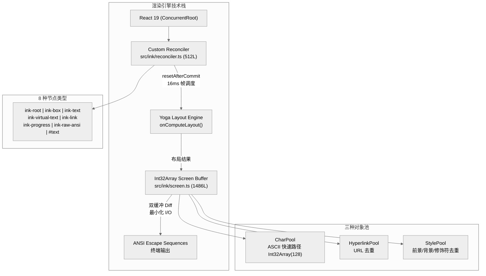
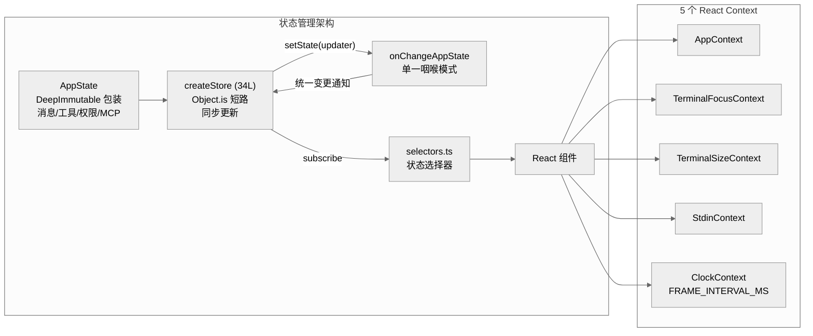

# 第 11 章 终端界面

Claude Code 的终端界面是一个完整的 React 应用，运行在终端而非浏览器中。它用 React 19 驱动一套自研的终端渲染引擎，在 ANSI 转义序列之上实现了 Int32Array 双缓冲、虚拟滚动、W3C 事件派发、Vim 键绑定等能力。本章从渲染管线到输入处理，逐层剖析这套终端 UI 的工程实现。

## 11.1 React-in-Terminal 技术栈



### 自研渲染引擎

`src/ink/` 目录包含 **104 个文件**，约 647KB 的自研渲染代码。这是对社区 Ink 框架的深度 fork，保留了 React Reconciler 架构但重写了几乎所有关键子系统：

| 改造项 | 说明 |
|--------|------|
| React 版本 | 升级到 React 19（`^19.2.4`），使用 ConcurrentRoot |
| 事件系统 | W3C 三阶段派发（捕获 -> 目标 -> 冒泡） |
| 屏幕模式 | AlternateScreen 全屏接管 |
| 渲染管线 | Int32Array 双缓冲 + BigInt64Array 批量清零 |
| 文本选择 | hit-test + selection 实现终端内选区 |
| 滚动 | 虚拟滚动引擎（非 DOM 原生滚动） |
| 搜索 | 屏幕缓冲层面的搜索高亮 |

框架定义了 7 种元素类型加 1 种文本节点。`src/ink/dom.ts` 中的 `ElementNames` 联合类型为：

```
'ink-root' | 'ink-box' | 'ink-text' | 'ink-virtual-text'
| 'ink-link' | 'ink-progress' | 'ink-raw-ansi'
```

加上 `TextName = '#text'`。整个 UI 树由这 8 种节点构建。

### React 19 自定义 Reconciler

`src/ink/reconciler.ts`（512 行，约 14.3KB）通过 `react-reconciler` 库创建自定义 Reconciler 实例。第 224 行开始调用 `createReconciler<>`，关键的 React 19 标志是第 235 行：

```typescript
null, // UpdatePayload - not used in React 19
```

React 19 的 `commitUpdate` 直接接收 old/new props（第 426 行），无需 `prepareUpdate()` 中间步骤。`resetAfterCommit` 在第 247 行实现，核心逻辑是依次调用 `onComputeLayout()` 和 `onRender()`——前者执行 Yoga 布局计算，后者将布局结果写入屏幕缓冲。

帧调度使用 16ms 节流（`FRAME_INTERVAL_MS = 16`，`src/ink/constants.ts`），对应约 60fps 的刷新率。

## 11.2 Int32Array 双缓冲屏幕

`src/ink/screen.ts`（1,486 行，约 49KB）是渲染管线的核心——一块 Int32Array 构成的屏幕缓冲。

### 打包整数编码

每个 cell 占用 2 个 Int32Array 槽位：

- **word0**: 字符池索引（charId）
- **word1**: 复合字段，编码为 `(styleId << 17) | (hyperlinkId << 2) | width`

关键常量（第 336-339 行）：

```typescript
const STYLE_SHIFT = 17
const HYPERLINK_SHIFT = 2
const WIDTH_MASK = 3  // 2 bits
```

`packWord1` 函数实现打包：

```typescript
function packWord1(styleId, hyperlinkId, width) {
  return (styleId << STYLE_SHIFT) | (hyperlinkId << HYPERLINK_SHIFT) | width
}
```

这种设计将样式查询压缩为一次位移操作，避免了对象分配和哈希表查找。

### BigInt64Array 批量清零

`screen.ts` 在 Int32Array 之上叠加了一个 `BigInt64Array` 视图（共享同一个 `ArrayBuffer`），利用 `cells64.fill(0n)` 一次性清零整块屏幕。第 353 行定义 `EMPTY_CELL_VALUE = 0n`，第 532 行执行清零。

### 三种对象池

为避免重复存储相同的字符、样式和超链接数据，screen.ts 实现了三种对象池：

| 池 | 类 | 行号 | 说明 |
|----|------|------|------|
| 字符 | `CharPool` | 第 21 行 | ASCII 快速路径使用 `Int32Array(128)` 数组直查 |
| 超链接 | `HyperlinkPool` | 第 57 行 | URL 去重 |
| 样式 | `StylePool` | 第 112 行 | 前景/背景/修饰符组合去重 |

### 双缓冲 Diff

双缓冲的前后帧变量名为 `prevCells` 和 `nextCells`（第 1231-1232 行）。Diff 算法逐行比较两帧的 Int32Array 数据，只输出差异 cell 对应的 ANSI 转义序列，最小化终端 I/O。

## 11.3 流式 Markdown 渲染

`src/components/Markdown.tsx` 中的 `StreamingMarkdown` 组件（第 163 行）处理 API 返回的流式文本。核心挑战是：token 逐个到达时，Markdown 语法可能尚未闭合，逐 token 做全量解析代价高昂。

### 稳定前缀优化

`stablePrefixRef`（第 180 行）维护一个单调递增的"已稳定"文本边界。已稳定区域的解析结果可以缓存复用，只需对新到达的尾部增量解析。如果新 token 破坏了前缀的有效性（例如回退），则重置整个前缀。

### 纯文本快速路径

`TOKEN_CACHE_MAX = 500`（第 25 行）限制 token 缓存大小。`hasMarkdownSyntax()` 函数（第 35 行）检查前 500 个字符是否包含 Markdown 语法标记。纯文本内容跳过完整 GFM 解析，直接渲染。

## 11.4 权限弹窗的 200ms 保护机制

当 Claude 请求执行工具时，终端会弹出权限确认对话框。`src/hooks/toolPermission/handlers/interactiveHandler.ts` 第 115 行定义了 `GRACE_PERIOD_MS = 200`。

这个延迟的保护对象是**分类器流程**而非直接防止用户误按 Allow。第 113 行注释明确说明：

> ignore interactions in the first 200ms to prevent accidental keypresses from canceling the classifier prematurely

在权限弹窗显示的前 200ms 内，用户的任何按键都会被忽略，防止上一次输入的残余按键意外中断正在运行的安全分类器检查。

### Shimmer 动画隔离

分类器检查期间，`ClassifierCheckingSubtitle` 组件显示一个闪烁动画。`useShimmerAnimation` hook 在 requesting 模式下以 50ms 间隔（20fps）更新 `glimmerIndex`。该动画被有意隔离在独立组件中，因为 50ms 的更新频率如果触发整个对话框重渲染会造成不必要的性能开销。

## 11.5 虚拟滚动

`src/hooks/useVirtualScroll.ts` 实现了终端环境下的虚拟滚动。与浏览器 DOM 不同，终端没有原生滚动容器，所有滚动逻辑必须手动实现。

### 五个核心常量

| 常量 | 值 | 说明 |
|------|-----|------|
| `DEFAULT_ESTIMATE` | 3 | 未测量 item 的默认高度估计（行数） |
| `OVERSCAN_ROWS` | 80 | 视口外预渲染行数 |
| `SCROLL_QUANTUM` | 40 | 滚动量化粒度（`OVERSCAN_ROWS >> 1`） |
| `MAX_MOUNTED_ITEMS` | 300 | 同时挂载的最大 item 数 |
| `SLIDE_STEP` | 25 | 滑动窗口每次移动的最大步幅 |

### 高度缓存

高度缓存使用 `Map<string, number>`（第 163 行），键为消息的字符串 key。当终端 resize 时，缓存不会被清空，而是按列数比例缩放已缓存的高度值（第 151-159 行），避免重测所有 item 带来的约 600ms 渲染峰值。

### 滚动量化

`scrollTop` 被量化到 `SCROLL_QUANTUM`（40 行）粒度的 bin 中（第 242 行 `Math.floor(target / SCROLL_QUANTUM)`）。这确保微小的滚动变化不会触发 `Object.is` 检测到的状态变更，从而避免不必要的重渲染。`SLIDE_STEP` 限制窗口每帧最多移动 25 个 item，防止大幅跳跃导致的 mount/unmount 风暴。

## 11.6 Vim 模式

`src/vim/` 目录包含 5 个文件（motions.ts、operators.ts、textObjects.ts、transitions.ts、types.ts），实现终端输入的 Vim 键绑定。

### 两模式状态机

Vim 状态机只有 **2 种模式**——INSERT 和 NORMAL。`VimState` 类型定义（types.ts 第 50-51 行）：

```typescript
| { mode: 'INSERT'; insertedText: string }
| { mode: 'NORMAL'; command: CommandState }
```

不存在 Visual 模式或 Command-line 模式。这是一个面向单行输入的精简 Vim 实现，而非完整的 Vim 编辑器。

### CommandState：11 种判别式联合体

在 NORMAL 模式内部，`CommandState` 联合体（types.ts 第 60-75 行）定义了 11 种命令解析状态：

```
idle | count | operator | operatorCount | operatorFind
| operatorTextObj | find | g | operatorG | replace | indent
```

`transitions.ts` 中的 `transition()` 函数是纯函数——接收当前状态和输入，返回新状态，不产生副作用。

### 操作符组合

类型系统定义了三类原语——操作符（d/c/y）、移动（h/l/w/b 等）、文本对象（w/W/"/'/(等），三者可自由组合。`operators.ts` 提供 `executeOperatorMotion`、`executeOperatorTextObj`、`executeOperatorFind` 分别处理三种组合执行。

`PersistentState`（types.ts 第 81-86 行）保存跨命令的状态：`lastChange`（点重复）、`lastFind`（查找重复）、`register`（yank 寄存器）。

### VimTextInput 组件

`src/components/VimTextInput.tsx`（69 行，约 2.3KB）是一个薄包装组件，调用 `useVimInput` hook。实际的 Vim 逻辑分散在 `src/vim/` 目录和 `src/hooks/useVimInput.ts` 中。

## 11.7 搜索高亮

`useSearchHighlight()` hook（`src/ink/hooks/use-search-highlight.ts`，第 18 行）实现了全局搜索高亮。与 React 重渲染无关——搜索直接在屏幕缓冲层面操作 cell 样式。

`StylePool.withCurrentMatch()` 为匹配项创建高亮样式变体，`StylePool.withInverse()` 为当前选中匹配创建反色样式。命中测试（`src/ink/hit-test.ts`）将鼠标坐标映射到 cell，再映射到组件和文本位置，支持终端内的选区操作。

## 11.8 REPL 核心组件

`src/screens/REPL.tsx`（**6,182 行，约 272KB**）是整个应用的主界面组件。这是 React Compiler 反编译输出，包含大量 `_c()` memoization 调用。

### 组件层次

核心嵌套关系：

```
REPL > KeybindingSetup > AlternateScreen > FullscreenLayout
  > ScrollBox > VirtualMessageList > Messages
```

`AlternateScreen` 接管终端的备用屏幕缓冲区，`FullscreenLayout` 管理全屏布局和 `stickyScroll` 行为，`VirtualMessageList` 调用 `useVirtualScroll` 实现消息列表的虚拟化渲染。

### 对话历史

对话历史持久化到 `~/.claude/history.jsonl`（`src/history.ts` 第 115 行和第 299 行），支持跨会话的历史记录查询。

## 11.9 状态管理



### 34 行 Store

`src/state/store.ts` 仅 34 行，实现了完整的状态管理：

```typescript
export function createStore<T>(
  initialState: T,
  onChange?: OnChange<T>,
): Store<T> {
  let state = initialState
  const listeners = new Set<Listener>()
  return {
    getState: () => state,
    setState: (updater: (prev: T) => T) => {
      const prev = state
      const next = updater(prev)
      if (Object.is(next, prev)) return
      state = next
      onChange?.({ newState: next, oldState: prev })
      for (const listener of listeners) listener()
    },
    subscribe: (listener: Listener) => {
      listeners.add(listener)
      return () => listeners.delete(listener)
    },
  }
}
```

没有引入 Zustand 或任何第三方状态库。`Object.is` 短路相同引用的更新，`onChange` 回调是唯一的状态变更观测点。

### AppState 与集中化变更通知

`AppStateStore.ts`（569 行）定义了 `AppState` 类型（用 `DeepImmutable<>` 包装），包含消息、工具、权限、MCP 连接等全部应用状态。

`onChangeAppState`（`src/state/onChangeAppState.ts`）是"单一咽喉"模式——所有状态变更都经过这个函数。注释中详细说明了此前存在 8 条以上不同的权限模式变更路径，其中只有 2 条正确通知了 CCR（Claude Code Router），集中化后统一解决了这个问题。

### 5 个 React Context

| Context | 位置 | 职责 |
|---------|------|------|
| `AppContext` | `ink/components/AppContext.tsx` | 应用级状态 |
| `TerminalFocusContext` | `ink/components/TerminalFocusContext.tsx` | 终端焦点管理 |
| `TerminalSizeContext` | `ink/components/TerminalSizeContext.tsx` | 终端尺寸 |
| `StdinContext` | `ink/components/StdinContext.tsx` | 标准输入 |
| `ClockContext` | `ink/components/ClockContext.tsx` | 全局时钟（基于 FRAME_INTERVAL_MS） |

## 11.10 W3C 事件系统

`src/ink/events/dispatcher.ts` 中的 `Dispatcher` 类（第 161 行）实现了 W3C 标准的三阶段事件派发：捕获阶段沿父链向下传播，到达目标后冒泡阶段向上回传。事件优先级区分为 `DiscreteEventPriority`（按键、点击等离散事件）和 `ContinuousEventPriority`（鼠标移动等连续事件），直接对接 React Reconciler 的调度优先级。

### 焦点管理

`src/ink/focus.ts` 中的 `FocusManager`（第 15 行）使用栈式结构管理焦点。硬限制 32 个条目（`MAX_FOCUS_STACK = 32`，第 4 行），超出时自动移除栈底元素。`handleNodeRemoved` 方法处理节点被移除时的焦点回退。

### 键绑定系统

`src/keybindings/defaultBindings.ts` 定义了约 21 个键绑定上下文（Global、Chat、Autocomplete、Settings、Scroll、Help、MessageSelector 等）。键绑定支持 Emacs 风格的和弦序列（chord），如 `ctrl+x` 前缀组合键。用户可通过 `~/.claude/keybindings.json` 自定义绑定，由 `src/keybindings/loadUserBindings.ts` 加载并经 Zod schema 验证。

## 11.11 成本追踪与 Token 可视化

`src/cost-tracker.ts` 提供实时成本追踪：

- `formatCost()`（第 177 行）：超过 $0.50 保留 2 位小数，否则 4 位——大额开销一目了然，小额操作保留精度
- `formatTotalCost()`（第 228 行）：汇总所有模型的累计开销
- `getCanonicalName()` 将模型 ID 归一化为显示名称（如将带版本号的完整 ID 映射为 `claude-sonnet-4-20250514` 等简称）
- 完整追踪 `cache_read` 和 `cache_write` token，在输出中展示缓存命中比例

## 11.12 设计取舍

Claude Code 的终端 UI 做了几个非显而易见的工程决策：

**自研而非复用**：Ink 框架不支持全屏模式、虚拟滚动、搜索高亮等需求。与其在第三方框架上不断 patch，不如 fork 后深度改造。104 个文件的代价换来了对渲染管线的完全控制。

**Int32Array 而非对象模型**：用位运算打包 cell 数据，看似增加了代码复杂度，但 BigInt64Array 批量清零和连续内存布局带来的性能收益在长对话（数千条消息）场景下至关重要。

**34 行 Store 而非 Zustand**：应用状态模型复杂（权限、MCP、消息流、工具状态），但状态管理模式简单——单一数据源、同步更新、`Object.is` 短路。自研 Store 消除了依赖，且 `onChangeAppState` 单一咽喉模式直接解决了多路径变更通知的一致性问题。

**2 模式 Vim 而非完整 Vim**：Claude Code 的输入场景是单行/多行提示文本，不需要 Visual 模式或 Command-line 模式。精简到 INSERT/NORMAL 两模式配合 11 种 CommandState 子状态，在保持组合能力（操作符 x 移动 x 文本对象）的同时控制了实现复杂度。
