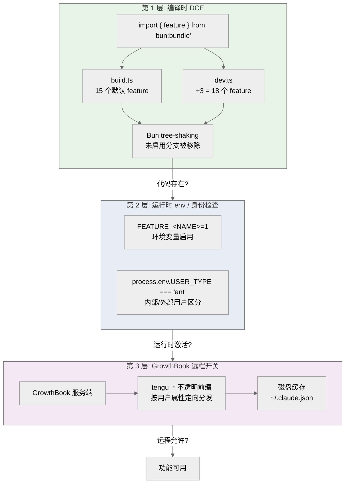
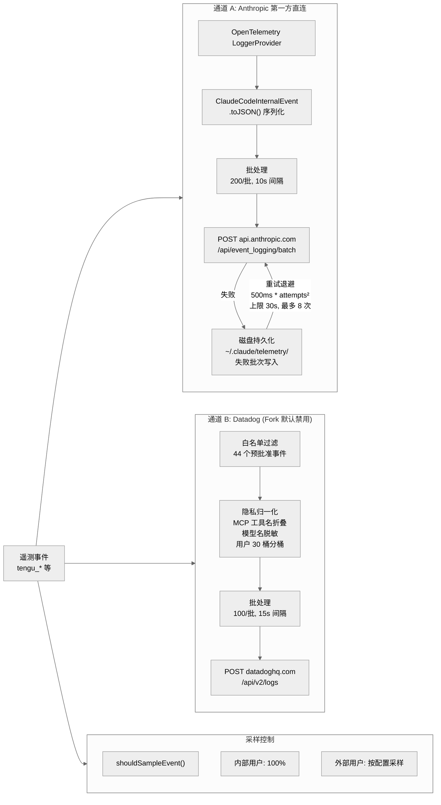

# 第 12 章 基础设施

Claude Code 的基础设施层是整个系统的地基——它不参与对话、不渲染界面、不执行工具，但它管理着全局状态、配置合并、安全存储、信号传播、遥测采集和功能开关。这些模块的共同特点是：被几乎所有上层模块依赖，却尽可能不依赖任何上层模块。本章合并了全局单例、配置系统、安全存储、取消原语、Git 工具库、Feature Flag、遥测管线、GrowthBook、远程设置和熔断机制等全部基础设施话题。

## 12.1 Bootstrap 全局单例——叶模块设计

`src/bootstrap/state.ts` 是整个代码库中最大的单文件（约 1758 行 / 55KB），也是最典型的「叶模块」。它的设计原则是：**被所有人导入，但自己尽量不导入任何人**。

### 12.1.1 导入隔离

state.ts 有 20 条 import 语句，但其中大部分是 `type` 导入——类型在运行时会被完全擦除。真正的运行时导入只有六个：

| 导入 | 来源 | 说明 |
|------|------|------|
| `realpathSync` | `fs` | Node.js 标准库 |
| `sumBy` | `lodash-es` | 纯工具函数 |
| `cwd` | `process` | Node.js 标准库 |
| `randomUUID` | `src/utils/crypto.js` | 带 eslint-disable 注释 |
| `resetSettingsCache` | `src/utils/settings/settingsCache.js` | 路径别名绕过规则 |
| `createSignal` | `src/utils/signal.js` | 路径别名绕过规则 |

ESLint 规则 `custom-rules/bootstrap-isolation` 禁止 state.ts 从项目内部导入模块。但这条规则只检查 `./` 和 `/` 前缀的相对路径——`src/` 路径别名绕过了检查。state.ts 第 15 行的注释明确记录了这一行为。因此实际上有 3 个 `src/` 运行时导入，其中 `randomUUID` 需要显式 eslint-disable，而 `resetSettingsCache` 和 `createSignal` 则利用了路径别名的规则盲区。

### 12.1.2 约 100 个全局字段

`State` 类型定义了 98 个显式字段（外加 `replBridgeActive` 仅限内部用户条件性添加），总计约 99 个。这些字段通过 210 个 `export function` 以 getter/setter 形式暴露——外部代码不直接访问 `STATE` 对象，必须通过函数调用。

字段按用途分为六大类：

```
会话标识    sessionId, sessionProjectDir, cwd, projectRoot
API/模型    currentModel, modelOverride, maxTurns, thinkingBudgetTokens
统计计数    tokenCounts, inputTokens, outputTokens, cacheCreationTokens
MCP/集成    mcpClients, mcpClientStates, mcpConnectionErrors
遥测/指标   sessionCounter, meterProvider, loggerProvider, tracerProvider
UI/交互     isInteractive, isNonInteractiveConfirm, afkMode, thinkingClear
```

### 12.1.3 Sticky-on Latch 模式

state.ts 中有四个特殊的布尔字段采用「粘性锁存」设计：

- `afkModeHeaderLatched`
- `fastModeHeaderLatched`
- `cacheEditingHeaderLatched`
- `thinkingClearLatched`

类型均为 `boolean | null`，语义是三态：`null` 表示未触发，一旦被设为 `true` 就永远不会回退。这种设计的背景是 API 的 prompt cache 机制——对于 50-70K token 的 prompt cache，更改 HTTP header 会导致缓存失效。Latch 确保 header 在会话生命周期内保持稳定，避免因 header 变化而浪费缓存投入。

### 12.1.4 原子会话切换

`switchSession()` 函数同时更新 `sessionId` 和 `sessionProjectDir`，然后通过 Signal（见 12.4 节）发出 `sessionSwitched` 事件。这种原子更新确保了不会出现 sessionId 和 projectDir 不匹配的中间状态。

交互时间的更新采用批处理设计：`interactionTimeDirty` 标志 + `updateLastInteractionTime()` 标记脏位 + `flushInteractionTime()` 实际写入。这避免了高频交互场景下的磁盘写入风暴。

## 12.2 配置系统——五层合并

Claude Code 的配置分为两个维度：运行时配置（JSON 文件直接读取）和持久化设置（Zod 验证 + 多源合并）。

### 12.2.1 运行时配置

`src/utils/config.ts` 定义了 `GlobalConfig`（`~/.claude.json`）和 `ProjectConfig`（`.claude/config.json`）两个配置层级。值得注意的是，`getGlobalConfig()` 使用了 `globalConfigCache.config` 缓存快速路径——大部分调用直接命中缓存。

在错误处理路径中存在一个重入防护 `insideGetConfig`：当配置文件解析出错时，错误处理会调用 `logEvent`，而 `logEvent` 链路最终可能回到 `getGlobalConfig()`。这个守卫阻断了递归链 `getConfig error → logEvent → shouldSampleEvent → getGlobalConfig → getConfig`。注意：守卫并非包裹整个 `getGlobalConfig()` 函数体，仅在错误处理的 `logEvent` 调用处生效。

### 12.2.2 持久化设置——五层优先级

`src/utils/settings/constants.ts` 中的 `SETTING_SOURCES` 数组定义了五个配置来源，**后者覆盖前者**：

```
1. userSettings    ~/.claude/settings.json         用户全局
2. projectSettings .claude/settings.json           项目级别
3. localSettings   .claude/settings.local.json     本地覆盖（不入版本控制）
4. flagSettings    CLI --settings 标志传入           命令行覆盖
5. policySettings  managed-settings.d/             企业策略
```

第五层使用 systemd 风格的 drop-in 目录 `managed-settings.d/`。`loadManagedFileSettings()` 按字母序加载目录中的 JSON 文件（注释中给出了 `10-otel.json`、`20-security.json` 的示例命名），这让企业管理员可以通过文件名前缀控制加载顺序。

### 12.2.3 Zod v4 Schema 验证

设置系统使用 Zod v4（`import { z } from 'zod/v4'`）进行运行时校验。为避免在模块加载时就解析整个 Schema 树（大量字段 + 嵌套），引入了 `lazySchema` 工厂函数（定义在 `src/utils/lazySchema.ts`，仅 8 行）：

```typescript
export function lazySchema<T>(factory: () => T): () => T {
  let cached: T | undefined
  return () => (cached ??= factory())
}
```

首次调用时构建 Schema 并缓存，后续调用直接返回。`src/utils/settings/types.ts` 通过 `import { lazySchema } from '../lazySchema.js'` 导入并使用它。

### 12.2.4 CLAUDE.md @include 指令系统

`src/utils/claudemd.ts`（约 1480 行）不仅负责发现和加载 Memory 文件，还实现了一套 `@include` 指令系统，允许 CLAUDE.md 文件引用外部文件。

**引用语法**：支持四种路径形式——`@path`（相对路径，等同于 `@./path`）、`@./relative/path`（相对于当前文件）、`@~/home/path`（用户主目录）、`@/absolute/path`（绝对路径）。路径中的空格可用 `\ ` 转义，`#` 后缀被视为 fragment identifier 并剥离。

**叶文本节点限定**：`@include` 路径不是简单的正则全文匹配——`extractIncludePathsFromTokens()` 使用 `marked` 的 Lexer 将内容解析为 AST，只从 `text` 类型的叶节点中提取 `@` 引用。`code` 和 `codespan` 类型的节点被跳过，确保代码块中的 `@path` 不会被误解析为 include 指令。HTML 注释节点中的 `@path` 同样被忽略（注释先被剥离，残余文本才被扫描）。Lexer 使用 `{ gfm: false }` 配置，避免 `~/path` 被 GFM 解析为删除线标记。

**循环引用检测**：`processMemoryFile()` 维护一个 `processedPaths: Set<string>` 集合，所有路径在加入前通过 `normalizePathForComparison()` 标准化（处理 Windows 盘符大小写差异），已处理的路径直接跳过。此外有 `MAX_INCLUDE_DEPTH = 5` 的硬性深度限制。符号链接路径会同时注册原始路径和解析后路径，防止通过符号链接绕过循环检测。

**TEXT_FILE_EXTENSIONS 白名单**：`parseMemoryFileContent()` 首先检查文件扩展名是否在 `TEXT_FILE_EXTENSIONS` 集合中（约 100 种文本文件扩展名，涵盖 `.md`、`.json`、`.py`、`.ts`、`.go`、`.rs` 等），不在白名单中的文件（如图片、PDF）被静默跳过，防止二进制数据被加载到 Memory 上下文中。

## 12.3 安全存储与 OAuth

### 12.3.1 分层存储策略

`src/utils/secureStorage/index.ts` 中的 `getSecureStorage()` 根据平台选择存储后端：

- **macOS**：`createFallbackStorage(macOsKeychainStorage, plainTextStorage)` — 优先使用 Keychain，失败时退化为明文
- **其他平台**：直接使用 `plainTextStorage`

macOS Keychain 后端通过 `security` 命令行工具交互：`read()` 使用 `security find-generic-password`，`update()` 使用 `security add-generic-password`。

### 12.3.2 三层可靠性保障

Keychain 交互是出了名的不可靠（进程竞争、锁超时、权限对话框），因此实现了三层防护：

**TTL 缓存**：`KEYCHAIN_CACHE_TTL_MS = 30_000`（30 秒）。在 TTL 窗口内直接返回内存缓存，避免频繁调用外部命令。

**Stale-While-Error**：当 `security` 命令失败且存在过期缓存时，继续使用陈旧数据（相关 issue #23192 记录了 Keychain 的不可靠性）。

**异步去重**：`readAsync()` 检查 `keychainCacheState.readInFlight`，若已有 Promise 在飞则返回同一个。实现还包含 generation 检查以处理并发失效——如果在等待期间 cache 被主动清空（generation 变化），会重新发起请求。

此外，`security` 命令的 stdin 写入有 `SECURITY_STDIN_LINE_LIMIT = 4096 - 64` 字节硬限，64 字节安全边际防止截断导致的数据损坏。

### 12.3.3 init.ts 遥测延迟加载与配置错误处理

`src/entrypoints/init.ts` 是整个应用的一次性初始化入口（通过 `memoize` 确保幂等）。其中有两个值得关注的设计决策：

**OTel 延迟加载**：遥测初始化被刻意推迟到信任对话框之后。`initializeTelemetryAfterTrust()` 在用户接受信任对话后才被调用，其内部通过 `await import('../utils/telemetry/instrumentation.js')` 惰性加载约 400KB 的 OpenTelemetry + protobuf 模块。gRPC 导出器（约 700KB 的 `@grpc/grpc-js`）在 `instrumentation.ts` 内部进一步惰性加载。注释明确记录了这一策略：

```
// Lazy-load instrumentation to defer ~400KB of OpenTelemetry + protobuf
```

同样，1P 事件日志和 GrowthBook 也通过 `Promise.all([import(...), import(...)])` 动态导入，避免在启动路径上加载 OpenTelemetry sdk-logs。`telemetryInitialized` 布尔标志防止双重初始化，失败时重置以允许重试。

**ConfigParseError 双路径处理**：当配置文件解析失败时，`init()` 的 catch 块根据交互模式采取不同策略：
- **交互模式**：动态导入 `InvalidConfigDialog` React 组件，展示 Ink 对话框让用户修复配置
- **非交互模式**（如 `--json` 管道、VM 沙箱）：直接将错误写入 stderr 并调用 `gracefulShutdownSync(1)` 退出，避免 Ink 渲染破坏 JSON 消费者

```typescript
if (getIsNonInteractiveSession()) {
  process.stderr.write(`Configuration error in ${error.filePath}: ${error.message}\n`)
  gracefulShutdownSync(1)
  return
}
return import('../components/InvalidConfigDialog.js').then(m =>
  m.showInvalidConfigDialog({ error })
)
```

注意 `InvalidConfigDialog` 的导入是动态的（注释说明"to avoid loading React at init"），因为交互式 UI 路径不应拖慢正常启动。

### 12.3.4 OAuth 初始化

`src/entrypoints/init.ts` 中，OAuth 账户信息的预取使用 fire-and-forget 模式：`void populateOAuthAccountInfoIfNeeded()`。这允许 OAuth token 在后台刷新，不阻塞启动流程。OAuth 客户端实现位于 `src/services/oauth/` 目录。

## 12.4 信号原语与级联取消

### 12.4.1 Signal 事件原语

`src/utils/signal.ts`（43 行）实现了一个轻量级的类型安全事件原语：

```typescript
export function createSignal<T extends unknown[] = []>() {
  const listeners = new Set<(...args: T) => void>()
  return {
    subscribe: (fn: (...args: T) => void) => {
      listeners.add(fn)
      return () => { listeners.delete(fn) }
    },
    emit: (...args: T) => { listeners.forEach(fn => fn(...args)) },
    clear: () => { listeners.clear() },
  }
}
```

文件头注释提到这个抽象替代了代码库中约 15 处的重复实现。在 state.ts 中，`sessionSwitched = createSignal<[id: SessionId]>()` 用于会话切换通知，`onSessionSwitch` 暴露 subscribe 方法。

### 12.4.2 级联取消——AbortController 树

`src/utils/abortController.ts`（99 行）实现了父子 AbortController 的级联取消。核心函数 `createChildAbortController` 的设计包含三重内存安全保证：

1. **WeakRef 持有子控制器**——父级不会阻止子级被垃圾回收
2. **`{once: true}` 监听器**——触发后自动移除，不会泄漏
3. **模块级 `propagateAbort` 函数（使用 `.bind()`）**——避免为每对父子关系创建闭包

此外有一个快速路径优化：如果父级的 `signal.aborted` 已经为 `true`，直接返回已中止的子控制器，跳过所有监听器注册。当子级自行 abort 时，会主动移除父级上的监听器，进一步减少泄漏风险。

这个设计支撑了 Claude Code 中所有嵌套异步操作的取消传播——从顶层会话取消到子 agent 取消到单个工具调用取消。

## 12.5 Git 工具库

`src/utils/git/gitFilesystem.ts` 提供了对 Git 仓库结构的底层抽象。

### 12.5.1 三种 Git 布局的透明处理

`resolveGitDir` 函数（带 memoization 缓存）检查 `.git` 是文件还是目录：

- **正常仓库**：`.git` 是目录，直接返回
- **Worktree/Submodule**：`.git` 是文件，内容为 `gitdir: <path>`，解析该指针

这使上层代码无需关心工作区的实际 Git 拓扑。

### 12.5.2 引用名安全验证

`isSafeRefName()` 实现白名单验证，阻止通过 Git 引用名进行注入攻击：

| 检查 | 防御目标 |
|------|----------|
| 拒绝 `-` 开头 | 参数注入（`--exec` 等） |
| 拒绝 `..` | 路径遍历 |
| 拒绝 `.` 和空路径组件 | 文件系统欺骗 |
| 正则白名单 `/^[a-zA-Z0-9/._+@-]+$/` | 仅允许已知安全字符 |

## 12.6 Feature Flag 三层门控



Claude Code 的功能控制分为三个互相正交的层次：编译时死代码消除（DCE）、运行时身份检查、GrowthBook 远程开关。

### 12.6.1 编译时 DCE

通过 `import { feature } from 'bun:bundle'` 导入的 `feature()` 函数在构建时被替换为布尔常量。未启用的分支会被 Bun 的 tree-shaking 完全移除，不进入最终产物。

**build.ts 默认启用 15 个 feature**：

```
AGENT_TRIGGERS_REMOTE, CHICAGO_MCP, VOICE_MODE,
SHOT_STATS, PROMPT_CACHE_BREAK_DETECTION, TOKEN_BUDGET,
AGENT_TRIGGERS, ULTRATHINK, BUILTIN_EXPLORE_PLAN_AGENTS, LODESTONE,
EXTRACT_MEMORIES, VERIFICATION_AGENT, KAIROS_BRIEF, AWAY_SUMMARY, ULTRAPLAN
```

**dev.ts 额外启用 3 个**（共 18 个）：`BUDDY`、`TRANSCRIPT_CLASSIFIER`、`BRIDGE_MODE`。

运行时还可以通过 `FEATURE_<NAME>=1` 环境变量启用任意 feature。代码库中约有 88 个唯一的编译时 feature flag。

典型用法如 SleepTool 的条件加载：`feature('PROACTIVE') || feature('KAIROS')`。

### 12.6.2 运行时身份检查

`process.env.USER_TYPE === 'ant'` 在代码中广泛使用，控制内部/外部用户看到不同的功能集。这与编译时 flag 互补：编译时 flag 决定代码是否存在，身份检查决定运行时是否激活。

### 12.6.3 GrowthBook 远程开关

GrowthBook 提供服务端控制的功能开关，使用 `tengu_*` 不透明前缀命名（如 `tengu_frond_boric`、`tengu_marble_sandcastle`）。这些开关可以按用户属性（`USER_TYPE`、`rateLimitTier`、仓库指纹等）进行定向分发。详见 12.8 节。

### 12.6.4 Thinking Mode 配置与能力检测

`src/utils/thinking.ts` 定义了 Thinking（扩展思考）功能的三层配置体系。

**ThinkingConfig 类型**：

```typescript
type ThinkingConfig =
  | { type: 'adaptive' }          // 模型自主决定是否思考
  | { type: 'enabled'; budgetTokens: number }  // 强制启用 + token 预算
  | { type: 'disabled' }          // 禁用
```

**提供商感知的能力检测**：`modelSupportsThinking()` 不是简单的模型名匹配，而是按 API 提供商分层判断：
- 先查 `get3PModelCapabilityOverride()`（第三方模型的显式能力覆盖）
- Anthropic 内部用户：通过 `resolveAntModel()` 解析内部代号，匹配即返回 `true`
- 1P/Foundry：所有 Claude 4+ 模型支持（排除 `claude-3-` 前缀）
- 3P（Bedrock/Vertex）：仅 Opus 4+ 和 Sonnet 4+ 支持

`modelSupportsAdaptiveThinking()` 更严格，目前仅允许 `opus-4-6` 和 `sonnet-4-6` 变体。对于未知模型字符串，1P 和 Foundry 默认返回 `true`（因为新模型需要 adaptive thinking 才能正常测试），3P 默认返回 `false`。代码注释多次强调：**不要在未通知 model launch DRI 和 research 的情况下修改这些默认值，否则会严重影响模型质量和 bashing 指标。**

**Ultrathink 双重门控**：`isUltrathinkEnabled()` 要求同时满足编译时 feature flag `ULTRATHINK` 和 GrowthBook 远程开关 `tengu_turtle_carbon`。用户在输入中包含 `ultrathink` 关键词（`/\bultrathink\b/i`）会触发更深层思考模式，UI 层使用彩虹色渲染该关键词。

## 12.7 遥测管线——双通道架构



遥测系统由两条独立的数据通道组成，各自承担不同的职责。

### 12.7.1 通道 A：Anthropic 第一方直连

基于 OpenTelemetry LoggerProvider 构建，独立于客户自己的 OTLP 遥测实例。

**配置常量**：

| 参数 | 默认值 | 说明 |
|------|--------|------|
| `DEFAULT_LOGS_EXPORT_INTERVAL_MS` | 10000 | 批次刷新间隔 |
| `DEFAULT_MAX_EXPORT_BATCH_SIZE` | 200 | 每批最大事件数 |
| `DEFAULT_MAX_QUEUE_SIZE` | 8192 | 队列上限 |

**序列化格式**：事件结构由 protobuf schema 定义（`ClaudeCodeInternalEvent`、`GrowthbookExperimentEvent`），但实际传输使用 `.toJSON()` 方法转为 JSON 后通过 HTTP POST 发送到 `https://api.anthropic.com/api/event_logging/batch`。不是二进制 Protocol Buffers。

**容错设计**：
- 磁盘持久化：失败的批次写入 `~/.claude/telemetry/` 目录，文件名格式 `1p_failed_events.{sessionId}.{BATCH_UUID}.json`
- 重试退避：`baseBackoffDelayMs * attempts^2`（默认基数 500ms、上限 30000ms、最大 8 次）
- 远程可调：`tengu_1p_event_batch_config` GrowthBook 配置可热更新 `scheduledDelayMillis`、`maxExportBatchSize`、`maxQueueSize`、`maxAttempts`、`path`、`baseUrl` 等参数

**热插拔安全性**：`reinitialize1PEventLoggingIfConfigChanged()` 执行四步原子操作：1) 置空 logger → 2) forceFlush 旧 buffer → 3) 创建新 Provider → 4) 后台 shutdown 旧 Provider。磁盘持久化文件使用 `BATCH_UUID + sessionId` 稳定键名，确保重建过程中不丢失数据。

### 12.7.2 通道 B：Datadog 第三方可观测

**注意：在 Fork 版本中，Datadog 通道已被有效禁用。** `datadog.ts` 中的端点和密钥默认为空字符串：

```typescript
const DATADOG_LOGS_ENDPOINT = process.env.DATADOG_LOGS_ENDPOINT ?? ''
const DATADOG_CLIENT_TOKEN = process.env.DATADOG_API_KEY ?? ''
```

初始化时检查 `if (!DATADOG_LOGS_ENDPOINT || !DATADOG_CLIENT_TOKEN)` 直接返回。原始 Anthropic 版本使用 `https://http-intake.logs.us5.datadoghq.com/api/v2/logs`，Fork 版本需要通过环境变量自行配置才能启用。

**白名单过滤**：`DATADOG_ALLOWED_EVENTS` 集合包含 44 个预批准事件类型（7 个 `chrome_bridge_*` + 37 个 `tengu_*`），未在名单中的事件直接丢弃。

**批处理参数**：`DEFAULT_FLUSH_INTERVAL_MS = 15000`（15 秒），`MAX_BATCH_SIZE = 100`。

**隐私归一化**：
- MCP 工具名：以 `mcp__` 开头的一律折叠为 `"mcp"`，防止基数爆炸
- 模型名：对外部用户，不在 `MODEL_COSTS` 映射中的模型归为 `"other"`
- 用户分桶：`parseInt(SHA256(userId).slice(0, 8), 16) % 30`，将用户映射到 30 个桶

### 12.7.3 采样控制

`shouldSampleEvent()` 实现了灵活的采样逻辑：无配置返回 null（全量记录）、采样率 >= 1 返回 null（全量）、<= 0 返回 0（丢弃）、中间值按概率采样。

启动剖析器（`src/utils/startupProfiler.ts`，194 行）有独立的采样配置：`STATSIG_SAMPLE_RATE = 0.005`（0.5%）。内部用户 100% 采样。值得注意的是，**代码内部存在不一致**：常量值为 0.5%，但文件头注释（第 6 行）和内部注释（第 127 行）均写 0.1%。实际行为以常量 0.005 为准。

### 12.7.4 数据采集：三层元数据

每个遥测事件附带三层元数据（`src/services/analytics/metadata.ts`，约 32KB/973 行）：

| 层级 | 内容 | 字段数 |
|------|------|--------|
| 环境指纹 | platform, arch, terminal, packageManagers, runtimes, isCi, WSL 等 | 30+ |
| 进程健康 | uptime, rss, heapTotal, heapUsed, cpuUsage, cpuPercent 等 | 9 |
| 仓库指纹 | SHA256(remote URL) 前 16 字符 | 1 |

### 12.7.5 隐私保护设计

**工具输入截断**（`metadata.ts`）：

| 参数 | 值 |
|------|-----|
| `TOOL_INPUT_STRING_TRUNCATE_AT` | 512 字符 |
| `TOOL_INPUT_STRING_TRUNCATE_TO` | 128 字符 + "..." |
| `TOOL_INPUT_MAX_JSON_CHARS` | 4096 |
| `TOOL_INPUT_MAX_COLLECTION_ITEMS` | 20 |
| `TOOL_INPUT_MAX_DEPTH` | 2 |

`OTEL_LOG_TOOL_DETAILS=1` 环境变量控制是否记录截断后的工具输入。注意：这个开关决定的是「是否记录」，而非「是否截断」——即使开启，截断仍然生效。

**Bash 命令文件扩展名追踪**：`FILE_COMMANDS` 集合包含 17 种特定命令（rm, mv, cp, touch, mkdir, chmod, chown, cat, head, tail, sort, stat, diff, wc, grep, rg, sed），仅对这些命令的目标文件提取扩展名，不记录完整路径或文件内容。

### 12.7.6 Opt-out 路径

**用户可以关闭遥测。** `src/utils/privacyLevel.ts` 定义了三级隐私控制：

```typescript
type PrivacyLevel = 'default' | 'no-telemetry' | 'essential-traffic'
```

| 环境变量 | 效果 | 隐私级别 |
|----------|------|----------|
| （未设置） | 全部启用 | `default` |
| `DISABLE_TELEMETRY=1` | 禁用分析/遥测（Datadog、1P 事件、反馈调查） | `no-telemetry` |
| `CLAUDE_CODE_DISABLE_NONESSENTIAL_TRAFFIC=1` | 禁用全部非必要网络流量（遥测 + 自动更新 + grove + release notes 等） | `essential-traffic` |

`isTelemetryDisabled()` 在 `no-telemetry` 和 `essential-traffic` 两个级别下均返回 `true`。此外，`CLAUDE_CODE_DISABLE_LOCAL_GATES` 可禁用本地 GrowthBook 默认值。

`isAnalyticsDisabled()` 还检查 `NODE_ENV === 'test'`（精确匹配 test，development 模式下分析仍然启用）、Bedrock/Vertex 第三方供应商、`CLAUDE_CODE_USE_FOUNDRY` 等条件。

### 12.7.7 Undercover Mode——归因剥离与代号混淆

`src/utils/undercover.ts`（89 行）实现了一套"卧底模式"，专为 Anthropic 内部工程师向公共/开源仓库贡献代码设计。当激活时，系统会从 commit message 和 PR 描述中剥离所有 Anthropic 内部归因信息。

**激活逻辑**（`isUndercover()`）：
- 仅对 `USER_TYPE === 'ant'` 的内部构建生效（外部构建中所有函数被 DCE 为 trivial return）
- `CLAUDE_CODE_UNDERCOVER=1` 环境变量强制开启
- 否则自动检测：除非确认当前仓库在 `INTERNAL_MODEL_REPOS` 允许名单中（`commitAttribution.ts` 定义，包含 `anthropics/claude-cli-internal` 和 `anthropics/anthropic`），否则默认开启
- **无 force-off 选项**——注释明确说明 "This guards against model codename leaks — if we're not confident we're in an internal repo, we stay undercover"

**归因剥离内容**（`getUndercoverInstructions()`）：系统提示注入一段 `## UNDERCOVER MODE — CRITICAL` 指令，禁止在 commit/PR 中出现：
- 内部模型代号（Capybara、Tengu 等动物名）
- 未发布的模型版本号（如 opus-4-7、sonnet-4-8）
- 内部仓库名、Slack 频道、短链接
- "Claude Code" 字样或任何 AI 身份暗示
- Co-Authored-By 行或其他归因信息

**首次提示**：`shouldShowUndercoverAutoNotice()` 在自动检测激活（非环境变量强制）且用户未见过提示时返回 true，触发一次性说明对话框。`hasSeenUndercoverAutoNotice` 标志持久化在全局配置中。

## 12.8 GrowthBook 功能开关

`src/services/analytics/growthbook.ts`（约 45KB/1256 行）实现了完整的 GrowthBook 客户端，提供远程功能开关和 A/B 实验能力。

### 12.8.1 初始化与刷新

- 非适配器模式下使用 `remoteEval: true`（服务端计算分组）
- 用户定向属性包括 `USER_TYPE`、`rateLimitTier`、`firstTokenTime`、`apiBaseUrlHost`、`github` (GitHubActionsMetadata) 等
- 刷新间隔：内部用户 20 分钟，外部用户 6 小时

### 12.8.2 磁盘缓存

远程评估结果通过 `syncRemoteEvalToDisk()` 写入 `~/.claude.json` 的 `cachedGrowthBookFeatures` 字段。`getFeatureValue_CACHED_MAY_BE_STALE` 读取该缓存——函数名中的 `CACHED_MAY_BE_STALE` 是对调用者的显式警告。

### 12.8.3 值读取优先级链

`getFeatureValue_CACHED_MAY_BE_STALE()` 实现了五级优先级链：

```
1. CLAUDE_INTERNAL_FC_OVERRIDES 环境变量    开发者调试覆盖
2. growthBookOverrides 配置文件覆盖         config.json 中的覆盖
3. remoteEvalFeatureValues 内存缓存         最新的远程评估结果
4. cachedGrowthBookFeatures 磁盘缓存        上次成功的远程评估
5. getLocalGateDefault() → defaultValue     本地硬编码默认值
```

第 5 级实际包含两步：先查 `LOCAL_GATE_DEFAULTS`（约 32 个条目的本地预设），再回退到调用者传入的 `defaultValue`。

### 12.8.4 模型代号系统

GrowthBook 标志使用不透明的 `tengu_*` 命名。代码库中还存在其他代号体系：

| 代号 | 出处 | 用途 |
|------|------|------|
| Tengu | 分析事件/标志广泛使用 | 产品内部标识 |
| Capybara | `buddy/types.ts` (String.fromCharCode 编码) | 模型代号 |
| Fennec | `migrations/migrateFennecToOpus.ts` | 旧模型代号 (`fennec-latest → opus`) |
| Numbat | `constants/prompts.ts` | 未来模型代号 |

**代号保护机制**：
- `maskModelCodename()` 函数：保留前 3 字符 + 星号填充
- `buddy/types.ts` 中所有物种名使用 `String.fromCharCode(0x63, 0x61, ...)` 十六进制编码构造，避免与构建时代号扫描器碰撞（原始仓库中 `scripts/excluded-strings.txt` 定义了敏感字符串名单，Fork 版本中该文件不存在）
- 卧底模式（`src/utils/undercover.ts`，89 行）：`isUndercover()` 检查 `USER_TYPE === 'ant'`、`CLAUDE_CODE_UNDERCOVER` 环境变量和仓库类型，无 force-off 选项

**Capybara v8 行为缺陷对系统提示的影响**：

Capybara（模型代号之一）v8 版本存在多个已知行为缺陷，这些缺陷直接驱动了 `src/constants/prompts.ts` 中若干 ant-only 系统提示段落的设计：

1. **stop_sequence 误触发**（`src/utils/messages.ts`）：当 tool_reference 扩展的 `<functions>...</functions>` 标签出现在 prompt 尾部时，Capybara 模型以约 10% 的概率采样到 stop sequence（A/B 测试数据：21/200 vs 对照组 0/200）。修复方式是在 tool_result 后注入一个兄弟 text block 作为干净的 turn boundary，阻止模型将函数标签误认为对话结束。

2. **过度注释倾向**：`@[MODEL LAUNCH]` 注释标记了 Capybara 特有的过度注释问题。系统提示中增加了严格的 ant-only 注释规范——"Default to writing no comments. Only add one when the WHY is non-obvious"——并计划在模型停止默认过度注释后移除或弱化。

3. **虚假声明率升高**（FC rate 29-30% vs v4 的 16.7%）：`@[MODEL LAUNCH]: False-claims mitigation for Capybara v8` 标记的段落注入了结果如实报告的指令——禁止声称"所有测试通过"当输出显示失败，禁止压缩或简化失败检查以伪造绿色结果，同时也禁止对已确认的结果添加不必要的免责声明。

## 12.9 远程托管设置与熔断

### 12.9.1 远程设置获取

`src/services/analytics/remoteManagedSettings/index.ts` 实现了远程配置的获取与缓存：

| 常量 | 值 | 说明 |
|------|-----|------|
| `SETTINGS_TIMEOUT_MS` | 10000 | 单次请求超时 |
| `DEFAULT_MAX_RETRIES` | 5 | 最大重试次数 |
| `POLLING_INTERVAL_MS` | 3600000 | 轮询间隔（1 小时） |

端点：`GET {BASE_API_URL}/api/claude_code/settings`。实现了 stale-while-revalidate 策略 + ETag 缓存（`If-None-Match` header）+ 5 次指数退避重试。

### 12.9.2 "接受或退出"安全对话框

远程设置可能推送安全检查要求。`handleSecurityCheckResult()` 在用户拒绝时调用 `gracefulShutdownSync(1)` 退出程序。非交互模式（`!getIsInteractive()`）下跳过安全检查，返回 `'no_check_needed'`。

### 12.9.3 紧急熔断开关

系统内置了多个远程可控的熔断机制：

| 熔断开关 | 位置 | 作用 |
|----------|------|------|
| `bypassPermissionsKillswitch` | `utils/permissions/` | 禁用权限绕过（恢复权限检查） |
| `tengu_marble_sandcastle` + `tengu_penguins_off` | `utils/fastMode.ts` | Penguin 模式控制 |
| `/api/claude_code_penguin_mode` | `utils/fastMode.ts` | Penguin 模式 API 端点 |
| `tengu_frond_boric` | `sinkKillswitch.ts` | 分析通道总开关 |

分析通道 killswitch 有一个循环依赖陷阱：`sinkKillswitch.ts` 注释明确警告「Must NOT be called from inside is1PEventLoggingEnabled() - growthbook.ts:isGrowthBookEnabled() calls that, so a lookup here would recurse.」

## 12.10 启动性能剖析

`src/utils/startupProfiler.ts`（194 行）提供双模式启动性能度量：

**采样模式**：100% 内部用户 + 0.5% 外部用户（基于 `STATSIG_SAMPLE_RATE = 0.005`）。采样决策在启动时一次性做出，未采样的用户不承担任何 profiling 开销。

**详细模式**：设置 `CLAUDE_CODE_PROFILE_STARTUP=1` 环境变量启用，输出完整的分段时间报告和内存快照。

`PHASE_DEFINITIONS` 定义了四个度量阶段：

| Phase | Checkpoint 对 | 含义 |
|-------|---------------|------|
| `import_time` | 启动 → 导入完成 | 模块加载耗时 |
| `init_time` | 导入完成 → 初始化完成 | 系统初始化耗时 |
| `settings_time` | 初始化完成 → 设置加载完成 | 配置读取耗时 |
| `total_time` | 启动 → 设置加载完成 | 总启动耗时 |

遥测事件名为 `tengu_startup_perf`。

## 12.11 对 Fork 项目的影响

基础设施层是 Fork 项目需要重点关注的区域。以下是关键的定制点：

**遥测控制**：
- 最简方案：`DISABLE_TELEMETRY=1` 禁用所有分析
- 更彻底：`CLAUDE_CODE_DISABLE_NONESSENTIAL_TRAFFIC=1` 禁用全部非必要网络流量
- Datadog 在 Fork 版本中已默认禁用（端点为空字符串），无需额外处理

**GrowthBook**：
- 不设置 `CLAUDE_GB_ADAPTER_URL` 和 `CLAUDE_GB_ADAPTER_KEY` 时，GrowthBook 依赖 `is1PEventLoggingEnabled()`
- 若分析禁用，GrowthBook 也随之禁用
- 无自定义配置时，系统回退到 `LOCAL_GATE_DEFAULTS` 或代码中的 `defaultValue`
- `CLAUDE_CODE_DISABLE_LOCAL_GATES` 可进一步禁用本地默认值

**Feature Flag**：
- 编译时 flag 通过 `build.ts` 的 `DEFAULT_BUILD_FEATURES` 数组控制
- 运行时可通过 `FEATURE_<NAME>=1` 环境变量启用任意 feature
- 修改默认启用列表只需编辑 `build.ts` 和 `scripts/dev.ts`

**安全存储**：
- macOS 以外的平台使用明文存储，Token 安全性取决于文件系统权限
- 可通过实现 `SecureStorage` 接口添加自定义后端（如 Linux 的 libsecret）

---

**参考来源**

| 文件 | 大小 | 核心职责 |
|------|------|----------|
| `src/bootstrap/state.ts` | ~55KB / 1758L | 全局单例 |
| `src/utils/config.ts` | - | 运行时配置 |
| `src/utils/settings/` | - | 持久化设置 + Zod Schema |
| `src/utils/lazySchema.ts` | 8L | Schema 惰性构建 |
| `src/utils/secureStorage/` | - | 安全存储抽象 |
| `src/utils/signal.ts` | 43L | Signal 事件原语 |
| `src/utils/abortController.ts` | 99L | 级联取消 |
| `src/utils/git/gitFilesystem.ts` | - | Git 布局抽象 |
| `src/utils/privacyLevel.ts` | ~55L | 隐私级别控制 |
| `src/utils/startupProfiler.ts` | 194L | 启动性能剖析 |
| `src/utils/thinking.ts` | ~163L | Thinking 模式配置与能力检测 |
| `src/utils/undercover.ts` | 89L | 卧底模式 / 归因剥离 |
| `src/utils/claudemd.ts` | ~1480L | CLAUDE.md 发现、加载与 @include 指令 |
| `src/utils/commitAttribution.ts` | - | Git 归因与仓库分类 |
| `src/entrypoints/init.ts` | ~345L | 一次性初始化（遥测延迟加载、ConfigParseError 处理） |
| `src/constants/prompts.ts` | - | 系统提示（含 Capybara 缺陷缓解） |
| `src/services/analytics/firstPartyEventLogger.ts` | - | 第一方遥测 |
| `src/services/analytics/firstPartyEventLoggingExporter.ts` | - | 第一方导出器 |
| `src/services/analytics/datadog.ts` | - | Datadog 通道 |
| `src/services/analytics/metadata.ts` | ~32KB / 973L | 元数据采集 |
| `src/services/analytics/growthbook.ts` | ~45KB / 1256L | GrowthBook 客户端 |
| `src/services/analytics/sinkKillswitch.ts` | - | 分析通道熔断 |
| `src/services/analytics/remoteManagedSettings/` | 6 files / ~34KB | 远程设置 |
| `build.ts` | - | 构建配置 (15 默认 feature) |
| `scripts/dev.ts` | - | 开发配置 (18 默认 feature) |
