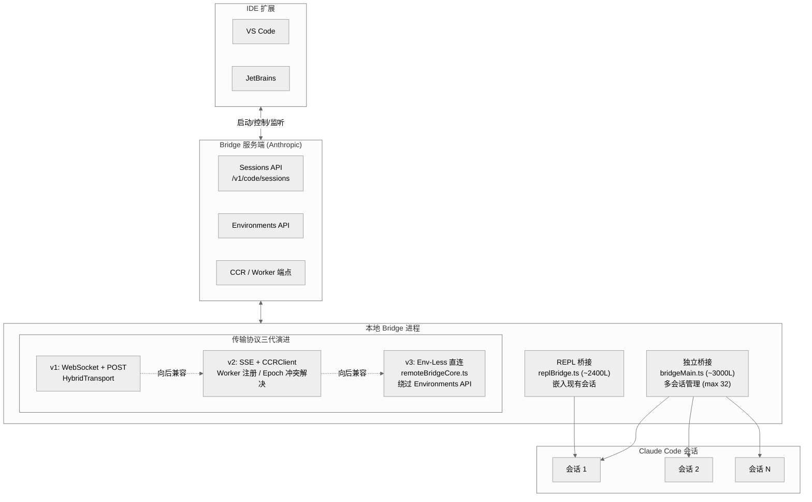
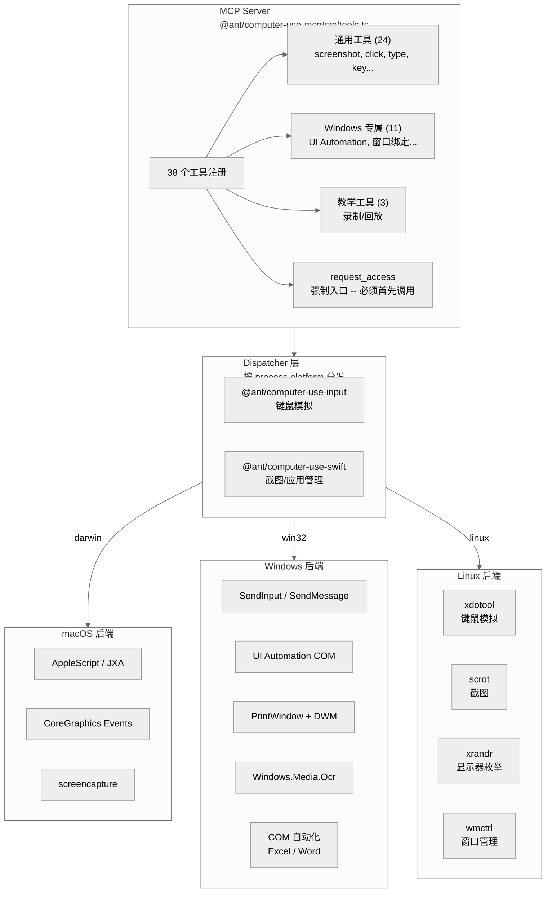

# 第 13 章 前沿能力

Claude Code 的核心 REPL 之外，还存在若干独立的"前沿能力"子系统。它们各自 feature-gated、各自拥有独立的协议栈与传输层，但最终都通过相同的 `queryModel()` 管道和 61 个工具系统与用户交互。本章覆盖五大前沿能力：Bridge 远程控制、Computer Use 跨平台屏幕操控、语音模式、OpenAI/Gemini 兼容层、以及 Chrome 浏览器控制。

---

## 13.1 Bridge 远程控制协议



Bridge 系统是 Claude Code 与 IDE 扩展（VS Code、JetBrains）之间的双向通信层。它让远端 IDE 能够启动、控制、监听一个运行在本地或远程机器上的 Claude Code 会话。整个系统由 `src/bridge/` 目录下的 34 个 `.ts` 文件构成（33 个根级文件 + `src/entrypoints/sdk/controlTypes.ts`），feature-gated by `BRIDGE_MODE`。

### 13.1.1 两种桥接入口

Bridge 提供两种独立的入口：

| 入口 | 文件 | 职责 |
|------|------|------|
| 独立桥接 | `bridgeMain.ts` (~3,000 行) | 作为独立进程运行，支持多会话管理 |
| REPL 桥接 | `replBridge.ts` (~2,400 行) | 嵌入现有 REPL 会话，将 I/O 桥接到远端 |

独立桥接支持三种生成模式：`single-session`（单会话共享目录）、`worktree`（git worktree 隔离）、`same-dir`（同目录多会话）。每种模式通过 `sessionRunner.ts` (~550 行) 管理子进程生命周期。

### 13.1.2 传输协议三代演进

Bridge 的传输层经历了三代演进，每一代都保持向后兼容：

**v1: WebSocket + POST**

`replBridgeTransport.ts` 文件开头注释说明了 v1 的架构：`HybridTransport (WS reads + POST writes to Session-Ingress)`。读方向用 WebSocket，写方向用 HTTP POST 到 Session-Ingress 端点。v1 不使用 SSE 序列号，重连时由服务端消息游标处理重放。

**v2: SSE + CCRClient**

v2 引入了四项关键改进：

1. **Worker 注册** -- `registerWorker()` 在 `workSecret.ts` 中实现，建立 worker 身份
2. **Epoch 冲突解决** -- 每次 transport 创建携带 epoch 号，避免多实例冲突
3. **投递追踪** -- `reportDelivery(eventId, status)` 支持 `'processing' | 'processed'` 两种公开状态（`received` 由 CCRClient 在每个 SSE frame 内部自动触发，不暴露于公共接口）
4. **状态报告** -- `reportState(state)` 向后端上报 `requires_action` 等状态

v2 的写入路径通过 `CCRClient.writeEvent` 走 `/worker/*` 端点，而非 SSETransport 的 Session-Ingress POST。CCRClient 内置 20 秒默认心跳间隔（`replBridgeTransport.ts` 行 138-139），可选配抖动因子。

**v3: 无环境桥接（Env-Less）**

`remoteBridgeCore.ts` (~1,000 行) 实现了 v3 协议，由 `tengu_bridge_repl_v2` GrowthBook flag 门控。v3 完全绕过 Environments API 的轮询/分发层，采用三步直连：

```
1. POST /v1/code/sessions              (OAuth, 无 env_id)  -> session.id
2. POST /v1/code/sessions/{id}/bridge  (OAuth)             -> {worker_jwt, expires_in, api_base_url, worker_epoch}
3. createV2ReplTransport(worker_jwt, worker_epoch)         -> SSE + CCRClient
```

关键设计：`/bridge` 端点每次调用都 bump epoch -- 调用本身就是注册，无需独立的 `/worker/register` 步骤。令牌刷新通过 `createTokenRefreshScheduler` 主动调用 `/bridge` 获取新 JWT。

### 13.1.3 多会话容量管理

独立桥接模式支持最多 32 个并发会话（`SPAWN_SESSIONS_DEFAULT = 32`，`bridgeMain.ts` 行 83），受 `tengu_ccr_bridge_multi_session` GrowthBook gate 门控。

容量管理通过三级轮询间隔实现：

| 容量状态 | 配置项 | 语义 |
|---------|--------|------|
| `not_at_capacity` | `multisession_poll_interval_ms_not_at_capacity` | 有空闲槽位，高频轮询 |
| `partial_capacity` | `multisession_poll_interval_ms_partial_capacity` | 部分占用，中频轮询 |
| `at_capacity` | `multisession_poll_interval_ms_at_capacity` | 满载，低频轮询等待释放 |

GrowthBook 每 5 分钟刷新一次配置。当会话完成释放容量时，`capacityWake.ts` 中的 `wake()` 方法通过 `AbortController` 中断当前的休眠周期，强制轮询循环立即重新检查新任务。

### 13.1.4 退避与崩溃恢复

退避策略由 `DEFAULT_BACKOFF` 常量定义（`bridgeMain.ts` 行 72-78）：

| 类型 | 初始延迟 | 上限 | 放弃 |
|------|---------|------|------|
| 连接错误 | 2 秒 | 2 分钟 | 10 分钟 |
| 一般错误 | 500 毫秒 | 30 秒 | 10 分钟 |

崩溃恢复依赖 `bridgePointer.ts` 中的指针文件。指针包含 `sessionId`、`environmentId`、`source: 'standalone' | 'repl'` 三个字段，TTL 为 4 小时（与后端 `BRIDGE_LAST_POLL_TTL` 一致）。写入同一内容即刷新 mtime，匹配后端滚动 TTL 语义。进程下次启动时检测到有效指针，可通过 `--session-id` 恢复。

环境重建有硬上限：`MAX_ENVIRONMENT_RECREATIONS = 3`（`replBridge.ts` 行 583 和 1920 均定义），超过后放弃重连。

### 13.1.5 关于 Bridge 部署

`bridgeConfig.ts` 中定义了 `CLAUDE_BRIDGE_BASE_URL` 和 `CLAUDE_BRIDGE_OAUTH_TOKEN` 两个环境变量，但它们的使用严格限制于 Anthropic 内部：

```typescript
export function getBridgeBaseUrlOverride(): string | undefined {
  return (
    (process.env.USER_TYPE === 'ant' && process.env.CLAUDE_BRIDGE_BASE_URL) ||
    undefined
  )
}
```

这是一个 **ant-only 开发覆盖**，仅在 `USER_TYPE === 'ant'` 时生效。外部用户的 Bridge 连接始终走 OAuth 生产配置。本仓库不包含独立可部署的 Bridge Server 包。

---

## 13.2 Computer Use 跨平台屏幕操控



Computer Use 通过 `CHICAGO_MCP` feature flag 启用（dev 和 build 默认均启用），以 MCP Server 形式提供屏幕截图、鼠标键盘模拟、应用管理等能力。

### 13.2.1 工具注册

MCP Server 在 `packages/@ant/computer-use-mcp/src/tools.ts` 中注册了 **38 个工具**，分为三类：

**通用工具（24 个）** -- 全平台可用：

`request_access`, `screenshot`, `zoom`, `left_click`, `double_click`, `triple_click`, `right_click`, `middle_click`, `type`, `key`, `scroll`, `left_click_drag`, `mouse_move`, `open_application`, `switch_display`, `list_granted_applications`, `read_clipboard`, `write_clipboard`, `wait`, `cursor_position`, `hold_key`, `left_mouse_down`, `left_mouse_up`, `computer_batch`

**Windows 专属工具（11 个）** -- 依赖 UI Automation 和窗口绑定机制：

| 工具 | 功能 |
|------|------|
| `window_management` | 窗口列表、定位、调整 |
| `click_element` | 通过 UI Automation 按名称点击元素 |
| `type_into_element` | 通过 UI Automation 向元素输入文字 |
| `open_terminal` | 打开终端并启动 AI agent CLI |
| `bind_window` | 将窗口绑定到会话作用域 |
| `activate_window` | 激活绑定窗口并确保键盘焦点 |
| `prompt_respond` | 响应对话框/弹窗 |
| `status_indicator` | 显示操作状态指示器 |
| `virtual_keyboard` | 虚拟键盘输入 |
| `virtual_mouse` | 虚拟鼠标操控 |
| `mouse_wheel` | 滚轮模拟 |

**教学工具（3 个）** -- 用于录制/回放操作序列：

`request_teach_access`, `teach_step`, `teach_batch`

`request_access` 是第一个注册的工具，也是会话的强制入口 -- 任何其他工具调用前都必须先通过它获取用户授权。

### 13.2.2 macOS 后端

macOS 后端由两个包组成：

**`@ant/computer-use-input`** -- 键鼠模拟。`backends/darwin.ts` 使用 **AppleScript (osascript) 和 JXA (JavaScript for Automation)**，通过 CoreGraphics 事件和 System Events 实现鼠标移动、点击、键盘输入。注意：虽然 `index.ts` 注释中提到了 "enigo"（历史遗留描述），但实际实现完全基于 osascript/JXA，没有 Rust native module 调用。

**`@ant/computer-use-swift`** -- 截图与应用管理。`backends/darwin.ts` 使用 AppleScript/JXA/screencapture 实现显示器信息查询、应用列表/激活/隐藏、以及截图。

macOS 还有两个平台特有的辅助机制位于 `src/utils/computerUse/`：`drainRunLoop.ts`（CFRunLoop 排空，确保异步事件分发）和 `escHotkey.ts`（全局 Escape 热键退出）。

### 13.2.3 Windows 后端

Windows 后端架构更为复杂，实现分散在两个位置：

- `packages/@ant/computer-use-input/src/backends/win32.ts` -- 键鼠模拟
- `src/utils/computerUse/platforms/win32.ts` -- 平台适配
- `src/utils/computerUse/win32/` -- 14 个专属文件

Windows 独有能力包括：

| 层级 | 技术 | 文件 |
|------|------|------|
| 全局输入模拟 | SendInput / SendMessage | `windowMessage.ts` |
| 窗口绑定输入 | 将输入限制在绑定窗口内 | `virtualCursor.ts` |
| 截图 | PrintWindow + DWM 缩略图 | `windowCapture.ts` |
| 元素操作 | UI Automation COM 接口 | `uiAutomation.ts` |
| 窗口管理 | 窗口枚举/定位/边框绘制 | `windowEnum.ts`, `windowBorder.ts` |
| 剪贴板 | Win32 API | 通过通用工具调用 |
| OCR | Windows.Media.Ocr | `ocr.ts` |
| COM 自动化 | Excel / Word 操控 | `comExcel.ts`, `comWord.ts` |

### 13.2.4 Linux 后端

Linux 后端已有**完整实现**，基于 X11 生态工具链：

**`@ant/computer-use-input/src/backends/linux.ts`（173 行）** -- 基于 **xdotool** 实现全部输入模拟：

- 鼠标移动：`xdotool mousemove --sync`
- 鼠标点击/按下/释放：`xdotool click|mousedown|mouseup`
- 滚动：通过 `xdotool click` 模拟滚轮按键（button 4/5 上下，6/7 左右）
- 键盘输入：`xdotool key|keydown|keyup`，内置完整的按键名映射表
- 文字输入：`xdotool type --delay 12`
- 前台应用信息：`xdotool getactivewindow` + `/proc/{pid}/exe` + `/proc/{pid}/comm`

**`@ant/computer-use-swift/src/backends/linux.ts`（278 行）** -- 实现三大 API：

| API | 工具 | 功能 |
|-----|------|------|
| `DisplayAPI` | xrandr | 显示器枚举（解析 `xrandr --query` 输出） |
| `ScreenshotAPI` | scrot | 全屏/区域截图，结果转 base64 |
| `AppsAPI` | wmctrl, xdotool, xdg-open | 窗口管理、应用启动、.desktop 文件解析 |

`index.ts` 行 30-31 已包含 `process.platform === 'linux'` 分支，会自动加载 Linux 后端。依赖工具：`xdotool`（必需）、`scrot`（截图）、`xrandr`（显示器）、`wmctrl`（可选，窗口管理，有 `commandExists` 检查后降级到 `ps`）。

---

## 13.3 语音模式

语音模式实现了 Push-to-Talk 语音输入，通过 WebSocket 将音频流式传输到 Anthropic 的 `voice_stream` STT 端点进行语音识别。Feature flag `VOICE_MODE`，dev 和 build 默认启用。

### 13.3.1 三层门控机制

语音功能可用性由 `src/voice/voiceModeEnabled.ts`（54 行）中的三层检查控制：

```
isVoiceModeEnabled() = hasVoiceAuth() && isVoiceGrowthBookEnabled()
```

| 层级 | 检查 | 失败含义 |
|------|------|---------|
| Feature Flag | `feature('VOICE_MODE')` | 构建时未启用语音能力 |
| GrowthBook Kill-Switch | `tengu_amber_quartz_disabled` 默认 `false` | 紧急关停开关；默认"未禁用"，新安装无需等待 GrowthBook 初始化即可使用 |
| OAuth Auth | `hasVoiceAuth()` | 需要 Anthropic OAuth 令牌（API key、Bedrock、Vertex、Foundry 均不可用） |

**为什么需要 OAuth？** 语音功能依赖 `voice_stream` WebSocket 端点（路径 `/api/ws/speech_to_text/voice_stream`），属于 claude.ai 消费级基础设施，不暴露给 API key 用户。

OAuth 检查的性能考量：首次调用会在 macOS 上执行 `security` 命令访问 keychain（~20-50ms），后续调用命中缓存。`getClaudeAIOAuthTokens()` 内部带有 memoize，令牌刷新（约每小时一次）会清除缓存。

### 13.3.2 Push-to-Talk 与流式转录

`src/hooks/useVoice.ts` 实现了 hold-to-talk 交互：长按快捷键录音，释放后停止并提交。自动重复的按键事件通过内部计时器处理 -- 当一段时间内没有新按键到达时，录音自动停止。

音频录制支持两种后端：macOS 原生音频模块和 SoX（跨平台 fallback）。

`src/services/voiceStreamSTT.ts` 实现了 WebSocket 流式转录：

- 协议使用 JSON 控制消息（`KeepAlive`、`CloseStream`）和二进制音频帧
- 服务端返回 `TranscriptText`（中间/最终转录）和 `TranscriptEndpoint` 消息
- KeepAlive 间隔 8 秒
- Finalize 超时：无数据 1.5 秒、安全上限 5 秒

**STT 模型选择**：默认使用 Deepgram 基础模型。当 `tengu_cobalt_frost` GrowthBook gate 启用时，升级到 **Deepgram Nova 3**（通过 conversation_engine 路由，设置 `stt_provider=deepgram-nova3`）。Nova 3 是一个可选的 gated 路径，并非始终使用。

---

## 13.4 OpenAI / Gemini 兼容层

兼容层通过流适配器模式，让全部 61 个工具和完整 REPL 运行在第三方 LLM 端点上。对 `claude.ts` 的侵入极小 -- 仅在 `queryModel()` 中插入约 15 行提前返回分支（行 1331-1351），位于 Anthropic 专有逻辑（betas、thinking、caching）之前、共享预处理（消息规范化、工具过滤、媒体裁剪）之后。

### 13.4.1 流适配器模式

核心设计：在 `queryModel()` 中检测 provider 类型，提前返回到对应的适配器：

```typescript
if (getAPIProvider() === 'openai') {
  const { queryModelOpenAI } = await import('./openai/index.js')
  yield* queryModelOpenAI(messagesForAPI, systemPrompt, filteredTools, signal, options)
  return
}

if (getAPIProvider() === 'gemini') {
  const { queryModelGemini } = await import('./gemini/index.js')
  yield* queryModelGemini(messagesForAPI, systemPrompt, filteredTools, signal, options, thinkingConfig)
  return
}
```

适配器内部将 Anthropic 格式的请求转换为目标格式，发送请求，再将响应流转换回 `BetaRawMessageStreamEvent`，下游代码完全无感知。

### 13.4.2 OpenAI 兼容层

通过 `CLAUDE_CODE_USE_OPENAI=1` 环境变量启用，支持任意 OpenAI Chat Completions 协议端点（Ollama、DeepSeek、vLLM 等）。

**目录结构** -- `src/services/api/openai/`，6 个源文件 + 4 个测试文件：

| 文件 | 职责 |
|------|------|
| `client.ts` | HTTP 客户端，发送 Chat Completions 请求 |
| `convertMessages.ts` | Anthropic 消息格式 -> OpenAI 消息格式 |
| `convertTools.ts` | Anthropic 工具定义 -> OpenAI function calling 格式 |
| `streamAdapter.ts` | OpenAI SSE 流 -> `BetaRawMessageStreamEvent` |
| `modelMapping.ts` | 模型名解析与映射 |
| `index.ts` | 入口，组装转换管道并暴露 `queryModelOpenAI` |

**模型映射优先级**（`modelMapping.ts`）：

1. `OPENAI_MODEL` -- 直接覆盖（最高优先级）
2. `OPENAI_DEFAULT_{FAMILY}_MODEL` -- 按模型族映射（如 `OPENAI_DEFAULT_SONNET_MODEL`）
3. `ANTHROPIC_DEFAULT_{FAMILY}_MODEL` -- 向后兼容 fallback
4. `DEFAULT_MODEL_MAP` 内置映射表（如 `claude-opus-4-6` -> `o3`）
5. 原样透传模型名

**流转换亮点**：
- `delta.reasoning_content` 自动转换为 Anthropic 的 thinking content block
- `usage.prompt_tokens_details.cached_tokens` 映射到 `cache_read_input_tokens`

### 13.4.3 Gemini 兼容层

通过 `CLAUDE_CODE_USE_GEMINI=1` 环境变量启用，使用独立的环境变量体系，不与 OpenAI 或 Anthropic 配置混杂。

**目录结构** -- `src/services/api/gemini/`，**7 个源文件** + 4 个测试文件：

| 文件 | 职责 |
|------|------|
| `client.ts` (97 行) | HTTP 客户端，SSE 流式请求 `streamGenerateContent?alt=sse` |
| `convertMessages.ts` (298 行) | Anthropic 消息格式 -> Gemini Content 格式 |
| `convertTools.ts` (284 行) | Anthropic 工具定义 -> Gemini FunctionDeclaration 格式 |
| `streamAdapter.ts` (244 行) | Gemini SSE 流 -> `BetaRawMessageStreamEvent` |
| `modelMapping.ts` (37 行) | 模型名解析与映射 |
| `index.ts` (192 行) | 入口，组装转换管道并暴露 `queryModelGemini` |
| `types.ts` (86 行) | Gemini API 请求/响应类型定义 |

**模型映射与 OpenAI 的关键区别**：

Gemini 的 `resolveGeminiModel()` 优先级与 OpenAI 类似（`GEMINI_MODEL` > `GEMINI_DEFAULT_*_MODEL` > `ANTHROPIC_DEFAULT_*_MODEL`），但**最后的 fallback 行为不同**：当无法从模型名中识别出 family（haiku/sonnet/opus）时，原样返回模型名；但当识别到 family 却找不到任何映射时，**抛出 Error** 而非原样透传：

```typescript
throw new Error(
  `Gemini provider requires GEMINI_MODEL or ${geminiEnvVar} (or ${sharedEnvVar} for backward compatibility) to be configured.`,
)
```

这要求用户必须显式配置 Gemini 模型映射，不像 OpenAI 有内置的默认映射表可以降级。

**Gemini API 端点**：默认 `https://generativelanguage.googleapis.com/v1beta`，可通过 `GEMINI_BASE_URL` 覆盖。认证通过 `x-goog-api-key` 头传递 `GEMINI_API_KEY`。

**环境变量汇总**：

| 变量 | 用途 |
|------|------|
| `CLAUDE_CODE_USE_GEMINI` | 启用 Gemini provider |
| `GEMINI_API_KEY` | API 密钥（必填） |
| `GEMINI_BASE_URL` | API 端点（可选） |
| `GEMINI_MODEL` | 直接指定模型（最高优先级） |
| `GEMINI_DEFAULT_HAIKU_MODEL` | Haiku 级别映射 |
| `GEMINI_DEFAULT_SONNET_MODEL` | Sonnet 级别映射 |
| `GEMINI_DEFAULT_OPUS_MODEL` | Opus 级别映射 |
| `GEMINI_SMALL_FAST_MODEL` | 快速任务使用的模型（可选） |

---

## 13.5 Chrome 浏览器控制

`@ant/claude-for-chrome-mcp` 是一个独立于 Computer Use 的浏览器控制系统，通过 `--chrome` CLI 参数启用。它不依赖 `CHICAGO_MCP` feature flag，有自己的 MCP Server 和通信协议。

### 13.5.1 架构

包含 8 个源文件：

| 文件 | 职责 |
|------|------|
| `index.ts` | 包入口 |
| `mcpServer.ts` | MCP Server 实例化与注册 |
| `browserTools.ts` | 工具定义（18 个） |
| `toolCalls.ts` | 工具调用路由 |
| `bridgeClient.ts` | 与 Chrome 扩展通信 |
| `mcpSocketClient.ts` | Socket 客户端 |
| `mcpSocketPool.ts` | Socket 连接池管理 |
| `types.ts` | 类型定义 |

### 13.5.2 工具清单

Chrome MCP 注册了 **18 个工具**：

| 工具 | 功能 |
|------|------|
| `javascript_tool` | 在页面上下文执行 JavaScript |
| `read_page` | 读取页面 DOM 内容 |
| `find` | 页面内搜索 |
| `form_input` | 表单输入 |
| `computer` | 基础鼠标/键盘操控 |
| `navigate` | 页面导航 |
| `resize_window` | 调整窗口尺寸 |
| `gif_creator` | 录制操作为 GIF |
| `upload_image` | 上传图片到页面 |
| `get_page_text` | 提取页面纯文本 |
| `tabs_context_mcp` | 获取标签页上下文 |
| `tabs_create_mcp` | 创建新标签页 |
| `update_plan` | 更新操作计划 |
| `read_console_messages` | 读取控制台消息 |
| `read_network_requests` | 读取网络请求 |
| `shortcuts_list` | 列出快捷键 |
| `shortcuts_execute` | 执行快捷键 |
| `switch_browser` | 切换浏览器实例 |

### 13.5.3 Computer Use vs Chrome MCP 对比

| 维度 | Computer Use | Chrome MCP |
|------|-------------|------------|
| 工具数量 | 38 个 | 18 个 |
| 交互方式 | 像素坐标操控 | DOM/语义操控 |
| 连接方式 | MCP Server (CHICAGO_MCP) | Chrome 扩展 Native Messaging |
| 截图方式 | 屏幕级截图 | 页面级截图/GIF |
| 适用场景 | 桌面应用、任意 GUI | 纯浏览器自动化 |
| 跨平台 | macOS + Windows + Linux | 任何运行 Chrome 的平台 |

两者可以同时启用：Computer Use 操控桌面和非浏览器应用，Chrome MCP 操控浏览器内部。

---

## 13.6 与其他章节的关联

- **API 查询管道**：OpenAI/Gemini 兼容层在 `queryModel()` 中插入提前返回分支，位于消息规范化之后、Anthropic 特有逻辑之前
- **工具系统**：Computer Use 的 38 个工具通过 MCP 协议注册，与 Claude Code 的 61 个内建工具并行运行
- **权限系统**：Bridge 的权限回调（`bridgePermissionCallbacks.ts`）和 Computer Use 的 `request_access` 工具都接入统一的权限管道
- **Feature Flag**：所有前沿能力统一使用 `import { feature } from 'bun:bundle'` + GrowthBook 双层门控
- **Provider 系统**：`getAPIProvider()` 在 `src/utils/model/providers.ts` 中扩展了 `'openai'` 和 `'gemini'` 两种 provider 类型
