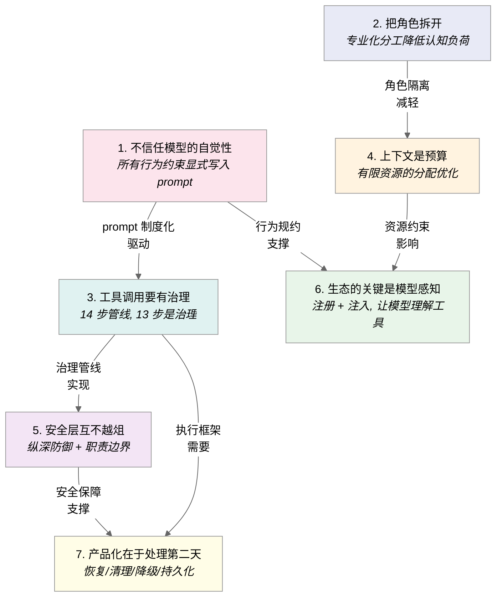
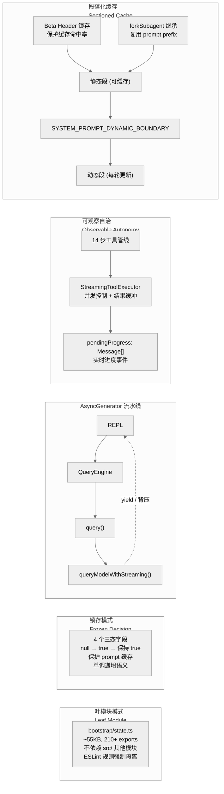

# 第 14 章 设计原则

Claude Code 的架构并非凭空搭建，而是从大量 LLM 工程实践中提炼出的一组设计原则的具体投射。这些原则塑造了代码库中每一个关键决策 -- 从工具调用的治理深度到上下文窗口的资源化管理，从安全层的职责划分到 Agent 角色的专业化分工。

本章从代码出发，提炼七条核心设计原则。每条原则都有明确的代码锚点，不做无法验证的声明。

---

## 14.1 七条设计原则

### 14.1.1 原则一：不信任模型的自觉性

**核心洞察：** LLM 不会主动遵守你没有明确写进 prompt 的规则。所有行为约束必须以文本形式显式注入上下文窗口。

这条原则认定，LLM 的行为完全由其接收到的 prompt 内容决定。你不能指望模型"知道"某个工具应该怎么用、某个文件不应该改 -- 除非你在 prompt 中写得清清楚楚。这不是对模型能力的否定，而是工程上的现实主义：在生产系统中，隐式依赖不可靠。

**代码体现：**

prompt 工程在 Claude Code 中达到了制度化的程度。`src/constants/prompts.ts` 是一个超过 900 行的文件，集中定义了系统级行为规范。它不是简单的"你是一个助手"式描述，而是对模型行为的精确规约 -- `getSimpleDoingTasksSection()`（第 200 行）和 `getActionsSection()`（第 256 行）分别定义了任务执行规范和操作行为规范。

prompt 的制度化不止于系统级。46 个工具各自维护独立的 `prompt.ts` 文件（位于 `src/tools/*/prompt.ts`），这些文件不是一句话的功能描述，而是针对该工具的详细行为说明，告诉模型在什么场景下该用这个工具、怎么用、有什么限制。这种"每工具一份行为手册"的设计，确保了即使工具数量不断增长，每个工具的行为期望也始终显式可控。

行为规约之所以重要，是因为它把"希望模型怎么做"从隐式期望转化为了可版本控制、可审查、可测试的工程制品。当模型行为出现偏差时，你可以检查 prompt 而不是猜测模型"为什么没想到"。

### 14.1.2 原则二：把角色拆开

**核心洞察：** 单个通用 Agent 的认知负荷和 prompt 干扰会随任务复杂度超线性增长。专业化分工 -- 让不同角色各司其职 -- 是扩展 Agent 能力的基本策略。

这条原则的出发点很朴素：一个需要同时探索代码库、制定计划、验证实现的 Agent，其 prompt 会变得又长又矛盾。探索需要广度优先的搜索策略，规划需要结构化的分解能力，验证需要对抗性的怀疑态度 -- 这三种认知模式在同一个 prompt 中会互相干扰。

**代码体现：**

Claude Code 实现了三种内置的专业化 Agent，各自位于 `src/tools/AgentTool/built-in/` 目录下：

1. **Explore Agent**（`exploreAgent.ts`）-- 负责代码库探索和信息发现，prompt 引导模型采用广度搜索策略
2. **Plan Agent**（`planAgent.ts`）-- 负责任务分解和执行计划制定，prompt 引导模型进行结构化规划
3. **Verification Agent**（`verificationAgent.ts`）-- 负责实现验证，采用对抗性角色设计

Verification Agent 的设计最能体现角色分离的价值。它的系统 prompt 开头就声明：`"Your job is not to confirm the implementation works — it's to try to break it."`（你的工作不是确认实现可用 -- 而是尝试打破它）。同时施加了 CRITICAL 限制，禁止修改项目文件。这种对抗性角色 + 只读权限的组合，确保验证者无法"通过修复问题来通过验证" -- 它只能报告问题，由其他 Agent 来修复。

角色分离不止于 Agent。在更宏观的层面，Claude Code 还有 Swarm 团队系统（`src/utils/swarm/`），支持多 Agent 协作。Agent 之间的分工模式 -- 探索、规划、验证 -- 映射了软件工程中基本的工作流：先理解问题，再制定方案，最后验证结果。

### 14.1.3 原则三：工具调用要有治理

**核心洞察：** 工具调用是 LLM Agent 与外部世界的唯一交互通道。如果这个通道缺乏治理，所有安全性和可靠性保证都将落空。

这可能是七条原则中工程深度最大的一条。LLM 的自然语言输出是无害的 -- 真正有影响的是工具调用。一次未经检查的 `rm -rf /` 或一个向外部 URL 发送敏感信息的请求，后果都不可逆。因此，工具调用管道的每一步都必须经过治理。

**代码体现：**

`src/services/tools/toolExecution.ts`（1745 行）实现了一个 14 步的工具执行管线。这个管线不是"调用前检查一下权限"这种程度的治理，而是从输入解析到输出处理的全流程覆盖：

| 步骤 | 职责 | 代码锚点 |
|------|------|----------|
| 1 | 工具查找 | `findToolByName` |
| 2 | MCP metadata 解析 | `extractMcpToolDetails` |
| 3 | Input schema 校验 | Zod schema parse |
| 4 | 语义输入验证 | `tool.validateInput?.()` |
| 5 | Bash 预测分类器启动 | `startSpeculativeClassifierCheck` |
| 6 | PreToolUse hooks 执行 | `runPreToolUseHooks` |
| 7 | Hook 权限结果解析 | `resolveHookPermissionDecision` |
| 8 | 权限决策 | `canUseTool` |
| 9 | 输入修正（hook 可修改输入） | `processedInput = permissionDecision.updatedInput` |
| 10 | 工具执行 | `tool.call()` |
| 11 | 分析与追踪 | analytics/tracing |
| 12 | PostToolUse hooks | `runPostToolUseHooks` |
| 13 | 结构化输出处理 | `structured_output` 检查 |
| 14 | 失败后处理 hooks | `runPostToolUseFailureHooks` |

这 14 步中，执行本身（步骤 10）只占一步，而治理逻辑占了 13 步。这个比例本身就说明了设计意图：工具调用的"包装"远比调用本身重要。

值得注意的是步骤 5 -- 在权限检查之前就启动了 Bash 预测分类器。这是一种性能优化：分类器的计算与权限检查并行进行，但只有权限通过后分类器的结果才会被使用。这种"乐观并行 + 悲观决策"的模式，在不牺牲安全性的前提下减少了延迟。

### 14.1.4 原则四：上下文是预算

**核心洞察：** 上下文窗口不是无限的记事本，而是有限的计算资源。每一个注入上下文的 token 都有机会成本 -- 它挤占了其他信息的空间。

这条原则改变了对上下文窗口的基本认知。传统做法是"尽量多给模型信息"，但在 Claude Code 的实践中，上下文窗口是预算：你得决定把有限的资源花在哪里，而不是无脑往里填。

**代码体现：**

这条原则的工程化体现最为丰富，涉及多个子系统。

**静态/动态分区：** `prompts.ts` 中定义了 `SYSTEM_PROMPT_DYNAMIC_BOUNDARY`（第 115 行），它是一个分隔标记，将系统 prompt 分为两个区域 -- 标记之前的内容是静态的（跨轮次不变），标记之后的内容是动态的（每轮可能更新）。这个分隔的意义在于 prompt 缓存：静态部分可以在多轮对话中复用缓存，只有动态部分需要重新计算，从而显著降低 API 开销。

**锁存优化：** `bootstrap/state.ts` 中有四个三态锁存字段（`afkModeHeaderLatched`、`fastModeHeaderLatched`、`cacheEditingHeaderLatched`、`thinkingClearLatched`），类型均为 `boolean | null`，初始值 `null`。语义是 Sticky-on latch：一旦从 `null` 变为 `true`，就永远保持 `true`（直到 `/clear` 或 `/compact` 显式重置）。这个设计确保 beta header 在会话中不会反复切换，避免因 header 变化导致 prompt 缓存失效。

**四级压缩管线：** 当上下文接近预算上限时，`query.ts` 按以下顺序执行四级压缩：

1. **Snip**（`snipCompact.ts`）-- 最轻量的压缩，裁剪冗余细节
2. **Microcompact**（`microcompact`）-- 对话级别的局部压缩
3. **Collapse**（`contextCollapse`，feature-gated by `CONTEXT_COLLAPSE`）-- 结构化的上下文折叠
4. **Autocompact**（`autocompact`）-- 全局自动压缩，必要时重写对话历史

这四级压缩形成了渐进式的资源回收机制 -- 先尝试低成本的局部优化，再逐步升级到高成本的全局重写。

**Token 估算三级精度：** `src/services/tokenEstimation.ts` 实现了三种不同精度（和成本）的 token 计数方式：

- `roughTokenCountEstimation(content, bytesPerToken=4)` -- 纯算术，零成本
- `countTokensViaHaikuFallback()` -- 使用 Haiku 模型代理计数，低成本
- `countMessagesTokensWithAPI()` -- 精确 API 计数，高成本

不同场景选择不同精度：粗估用于快速判断是否接近阈值，精确计数用于压缩决策前的关键检查。这种分级策略本身就体现了"上下文是预算"的思想 -- 连估算上下文大小这件事本身，都要做成本/精度的权衡。

**按需注入：** `getMcpInstructionsSection()`（`prompts.ts` 第 161 行）只为当前连接状态的 MCP server 生成指令，断开的 server 不浪费 token。`skillSearch/prefetch.ts` 实现了 Skill 的按需发现和注入。这些机制的共同思想是：不需要的信息就不该占用上下文空间。

### 14.1.5 原则五：安全层互不越俎

**核心洞察：** 安全性不应由单一的集中检查点提供，而应由多个独立的安全层各自负责自己的职责域。每一层只处理自己理解的风险类型，层与层之间不越界、不替代。

这条原则借鉴了纵深防御（Defense in Depth）的经典安全理念，但加入了一个关键限定：层与层之间存在严格的职责边界。一层的"允许"不能覆盖另一层的"拒绝" -- 这避免了典型的安全反模式（某个上游的 allow 绕过了下游的安全检查）。

**代码体现：**

权限模型是这条原则最直接的体现。`resolveHookPermissionDecision()`（`src/services/tools/toolHooks.ts` 第 332 行）是安全语义的关键粘合层，它的行为规则精确地编码了层间关系：

- **Hook allow 不绕过规则检查：** 即使 PreToolUse hook 返回 `allow`，仍会调用 `checkRuleBasedPermissions` 检查规则层的决策（第 373 行）
- **规则层 deny 覆盖 hook allow：** 如果规则层返回 `deny`，hook 的 `allow` 无效（第 386-390 行）
- **deny 直接生效：** 任何层的 `deny` 都立即终止，不给下游层"翻盘"的机会（第 408-410 行）
- **交互需求不可跳过：** 需要用户交互的工具，即使 hook allow，也必须提供 `updatedInput` 来满足交互要求，否则走标准权限流程（第 356 行）

权限规则本身来自多个源头。`PermissionRuleSource` 类型（`src/types/permissions.ts` 第 54 行）定义了 8 种规则来源：`userSettings`（用户全局）、`projectSettings`（项目共享）、`localSettings`（本地 gitignored）、`flagSettings`（CLI 参数）、`policySettings`（企业管理策略）、`cliArg`（命令行参数）、`command`（命令触发）、`session`（会话级）。这些来源在 `SETTING_SOURCES`（`src/utils/settings/constants.ts`）中有明确的优先级顺序 -- 后面的源覆盖前面的。

**Bash 工具的纵深防御：**

Bash 工具作为最危险的工具（可以执行任意命令），拥有最深的安全纵深：

1. **安全框架**（`bashSecurity.ts` 整体）-- 包装所有检查的统一入口
2. **tree-sitter AST 解析** -- 使用 tree-sitter 将命令解析为语法树，而非依赖字符串匹配
3. **23 项静态验证器** -- `bashSecurity.ts` 中 23 个 `validate*` 函数，覆盖注入攻击、危险变量、重定向滥用、Unicode 混淆、转义逃逸等细粒度风险类别
4. **ML 分类器**（`yoloClassifier.ts`）-- 基于机器学习的命令安全分类
5. **用户确认** -- 权限对话框系统
6. **OS 级沙箱**（`shouldUseSandbox.ts`）-- 操作系统层面的进程隔离

这六层中，每一层解决的问题不同：AST 解析防止结构性混淆（如用引号拆分关键词），静态验证器捕获已知危险模式，ML 分类器处理模式识别难以覆盖的边缘情况，沙箱则提供最后的兜底。关键设计是 **fail-closed** -- 任何一层检测到风险，整个调用被拒绝，不需要所有层都同意"安全"。

### 14.1.6 原则六：生态的关键是模型感知

**核心洞察：** 外部工具和扩展（MCP server、Skill、自定义 Agent）要想被模型有效使用，必须在系统 prompt 中被模型"看见"。生态扩展不只是注册一个 API endpoint -- 它需要让模型理解什么时候该用、怎么用、有什么限制。

这条原则解决的是生态扩展的"最后一公里"问题。很多 AI Agent 框架支持动态添加工具，但往往止步于"工具能被调用"。Claude Code 的做法更进一步：不仅让工具能被调用，还让模型理解工具。

**代码体现：**

**MCP 指令注入：** `getMcpInstructionsSection()`（`prompts.ts` 第 161 行）为每个连接状态的 MCP server 生成专门的指令段落，注入系统 prompt。这意味着当一个 MCP server 注册了新工具时，模型不仅能调用它，还能在 prompt 中看到这个工具的使用指南。

**Skill 发现机制：** `skillSearch/prefetch.ts` 负责 skill 的动态发现，`DiscoverSkillsTool` 将可用 skill 列表注入到模型的感知范围中。skill 不是被模型"试出来"的，而是在 prompt 中被主动推荐的。

**Agent 列表注入：** `prompts.ts` 中导入了 `EXPLORE_AGENT` 和 `areExplorePlanAgentsEnabled`，Agent 描述被注入系统 prompt。模型因此知道什么时候该调用 Explore Agent 来搜索代码库，什么时候该调用 Plan Agent 来制定计划。

这三种机制的共同模式是：**注册 + 注入**。注册使工具在技术层面可调用，注入使工具在认知层面被模型理解。没有后者，前者就是一个模型可能永远不会主动使用的"暗 API"。

### 14.1.7 原则七：产品化在于处理第二天

**核心洞察：** 原型系统只需要处理正常路径。产品级系统必须处理会话恢复、错误恢复、资源清理、状态持久化 -- 所有"第二天"才会暴露的问题。

这条原则关注的不是功能本身，而是功能在持续运行环境中的健壮性。一个 Agent 能成功执行一次任务不算什么，能在崩溃后恢复、在长时间运行后不泄漏资源、在网络波动下优雅降级 -- 这才是产品化的要求。

**代码体现：**

**Agent 清理链：** `runAgent.ts`（973 行）在 Agent 生命周期结束时执行一条完整的清理链：

- `writeAgentMetadata()`（第 738 行）-- 持久化 Agent 元数据
- `registerPerfettoAgent()`/unregister（第 358/832 行）-- 性能追踪的注册与注销
- `cleanupAgentTracking()`（第 825 行）-- Agent 追踪状态清理
- `killShellTasksForAgent()`（第 847 行）-- 终止 Agent 启动的所有 shell 进程
- Todos entry 清理（第 835-842 行）-- 清理任务状态
- Session hooks 和克隆文件状态清理

这条清理链看起来像样板代码，但删掉任何一步都会导致真实问题：`killShellTasksForAgent` 防止僵尸进程堆积，todos 清理防止状态污染泄漏到下一个 Agent。

**会话恢复：** `claude --resume` 能从 JSONL 追加存储中恢复对话状态（`main.tsx` 第 1555 行定义 `-r, --resume [value]` 选项）。对话的每一轮都以追加方式写入，因此即使进程异常退出，已完成的轮次也不会丢失。

**错误恢复矩阵：** 不同错误类型有不同的恢复策略：

| 错误类型 | 恢复策略 | 代码位置 |
|----------|----------|----------|
| 429 (Rate Limit) | 指数退避重试 | `withRetry.ts` |
| 529 (Server Error) | 降级到 fallback 模型 | `withRetry.ts` `fallbackModel` 机制 |
| prompt-too-long | 触发紧急压缩 | `query.ts` reactive compact |
| max_output_tokens | 自动提升输出限制 | `query.ts` recoverable error 处理 |

其中 529 降级的目标模型由 `fallbackModel` 配置决定，不硬编码为特定模型名。这种可配置的降级策略确保了在不同部署环境下的灵活性。

**任务状态管理：** `Task.ts` 中定义了 7 种 `TaskType` 变体（`local_bash`、`local_agent`、`remote_agent`、`in_process_teammate`、`local_workflow`、`monitor_mcp`、`dream`）和 5 种 `TaskStatus` 变体（`pending`、`running`、`completed`、`failed`、`killed`），覆盖了任务从创建到终止的完整生命周期。

---

## 14.2 核心工程模式

七条设计原则在代码层面催生了一组反复出现的工程模式。这些模式不是某个框架的套路，而是在解决 LLM Agent 特有问题时自然演化出来的。

### 14.2.1 叶模块模式（Leaf Module Pattern）

`bootstrap/state.ts`（~55KB，210+ 个 `export function`）是整个应用的全局状态仓库，但它被设计为一个**叶节点** -- 不依赖 `src/` 下的任何其他模块。文件第 17 行有 `eslint-disable-next-line custom-rules/bootstrap-isolation` 注释，表明有一条自定义 ESLint 规则强制执行这种隔离。唯一的例外（`crypto.js` 导入）被显式标记为 lint 豁免。

这种设计解决了一个实际问题：全局状态模块如果依赖其他模块，就容易产生循环依赖。通过强制隔离，`bootstrap/state.ts` 可以被任何模块安全导入而不引发初始化顺序问题。代价是所有状态必须通过 getter/setter 暴露，模块内部代码量较大 -- 但这个代价换来了依赖图的确定性。

### 14.2.2 锁存模式（Frozen Decision Pattern）

beta header 的三态锁存（`null` -> `true` -> 保持 `true`）已在原则四中讨论。这个模式值得独立提取，因为它解决了一个 LLM Agent 中的特有问题：当某些决策会影响 prompt 缓存时，这些决策必须是单调的（monotonic）。

四个锁存字段 -- `afkModeHeaderLatched`、`fastModeHeaderLatched`、`cacheEditingHeaderLatched`、`thinkingClearLatched` -- 均在 `bootstrap/state.ts` 中定义，类型为 `boolean | null`。`clearBetaHeaderLatches()` 只在 `/clear` 和 `/compact` 时调用。

锁存的语义很简单：一旦某个 beta header 在某轮对话中被设置为 true，它就不应该再变回 false，因为变回去会改变请求的 header 组合，进而使已缓存的 prompt 失效。通过锁存，header 组合在会话中是单调递增的，缓存命中率得到保护。

### 14.2.3 AsyncGenerator 流水线

`query.ts` 第 219 行定义了 `export async function* query(...)`，第 241 行定义了 `async function* queryLoop(...)`，文件中有 20+ 处 `yield` 语句。这种 `async function*` 模式贯穿 REPL -> QueryEngine -> query() -> queryModelWithStreaming() 的整条链路。

AsyncGenerator 在 LLM Agent 中的价值是**背压（backpressure）语义**：消费者可以控制拉取速度，生产者在消费者未准备好时自动暂停。相比回调或事件发射，AsyncGenerator 的流式管道更容易推理控制流 -- 数据沿管道单向流动，每一级都可以在 yield 点被暂停或恢复。

### 14.2.4 可观察自治（Observable Autonomy）

14 步工具执行管线（原则三）与 `StreamingToolExecutor`（`src/services/tools/StreamingToolExecutor.ts`）的组合，实现了一种"工具自主执行，但过程全程可见"的模式。

`StreamingToolExecutor` 管理工具执行的并发控制和结果缓冲，支持 `pendingProgress: Message[]` 进度事件。这意味着即使多个工具并发执行，每个工具的状态变化都能被 UI 层实时消费和展示。用户看到的不是"模型在思考..."的黑盒，而是每个工具调用的实时进度。

这种可观察性不仅是用户体验需求，更是调试需求。当 Agent 行为异常时，实时进度流提供了比日志更即时的诊断信息。

### 14.2.5 段落化缓存（Sectioned Cache）

系统 prompt 的缓存优化不是简单的"缓存整个 prompt"，而是一种精细的分段策略：

- `SYSTEM_PROMPT_DYNAMIC_BOUNDARY` 将 prompt 分为可缓存的静态段和不可缓存的动态段
- `systemPromptSections.ts` 实现了 memoized sections 机制，`DANGEROUS_uncachedSystemPromptSection` 明确标记哪些段落不应缓存
- 四个 beta header 锁存确保 header 组合的单调性，保护缓存命中率
- `forkSubagent.ts` 让子 Agent 继承父级对话上下文，从而复用已缓存的 prompt prefix

这些机制组合起来，形成了一个多级缓存策略：prompt 结构层面的静态/动态分区、header 层面的锁存保护、Agent 层面的继承复用。其共同目标是最大化 prompt 缓存命中率，减少重复的 token 计算。

---

## 14.3 LLM-Native 工程范式

回顾七条原则和核心工程模式，可以提炼出一种工程范式 -- 不是传统软件工程范式的简单迁移，而是围绕 LLM 特性重新组织的工程思维。

**以 LLM 为核心决策者：** 系统的核心循环是 LLM 的推理 -> 工具调用 -> 结果反馈 -> 继续推理。所有工程基础设施（工具系统、权限模型、上下文管理）都是为了让这个核心循环更安全、更高效、更可控地运行。

**以上下文窗口为核心资源约束：** 传统系统的瓶颈通常是 CPU、内存或网络。LLM Agent 的核心瓶颈是上下文窗口。所有关于"要不要注入这条信息"、"什么时候该压缩"、"怎么分区缓存"的决策，本质上都是在有限预算内的资源分配问题。

**以行为制度化为核心质量保障：** 传统系统通过类型系统、单元测试、代码审查来保证质量。LLM Agent 的行为质量还依赖于 prompt -- 900+ 行的系统 prompt、40 个工具级 prompt、3 个 Agent 级 prompt 共同构成了一套行为规约体系。这套规约和代码一样需要版本控制、审查和维护。

---

## 14.4 对 Fork 项目的启示

七条原则对 Fork 或从头构建 LLM Agent 的项目有直接的指导意义：

**应该保留的核心机制：**

- **14 步工具执行管线** -- 这是安全性和可靠性的基础。简化管线会导致安全层缺失
- **四级压缩管道** -- 渐进式上下文回收是长对话可用性的关键
- **叶模块模式** -- 状态管理的依赖隔离避免了大型代码库中最常见的架构退化
- **AsyncGenerator 流水线** -- 背压语义对流式 UI 和资源控制都很重要

**应该遵守的设计约束：**

- **不要破坏安全层的层次性** -- 不要为了"方便"让某一层绕过另一层的检查
- **不要合并 Agent 角色** -- 角色分离的价值在长期使用中才显现，但合并的代价也在长期中累积
- **保留 Feature flag 机制** -- 它不仅是功能开关，还是渐进式发布和 A/B 测试的基础
- **`runAgent.ts` 的清理链不是样板代码** -- 删掉它会导致进程泄漏和状态污染

---

## 14.5 章节关联索引

七条设计原则在本系列的各章中都有对应的深度解析：

| 原则 | 主要关联章节 |
|------|-------------|
| 不信任模型的自觉性 | 第 17 章（系统提示构建）、第 8 章（工具架构） |
| 把角色拆开 | 第 21 章（Sub-Agent 机制）、第 23 章（协调器与 Swarm） |
| 工具调用要有治理 | 第 8 章（工具架构）、第 13 章（权限模型） |
| 上下文是预算 | 第 19 章（上下文压缩）、第 20 章（Token 预算管理） |
| 安全层互不越俎 | 第 13 章（权限模型）、第 14 章（沙箱隔离）、第 25 章（Hooks） |
| 生态的关键是模型感知 | 第 24 章（MCP 集成）、第 26 章（Skills）、第 27 章（自定义 Agent） |
| 产品化在于处理第二天 | 第 7 章（多轮对话）、第 5 章（Agentic 对话循环） |

核心工程模式同样分布在多个章节中：

| 模式 | 主要关联章节 |
|------|-------------|
| 叶模块模式 | 第 4 章（核心架构总览） |
| 锁存模式 | 第 20 章（Token 预算管理） |
| AsyncGenerator 流水线 | 第 5 章（Agentic 对话循环）、第 6 章（流式响应） |
| 可观察自治 | 第 8 章（工具架构） |
| 段落化缓存 | 第 17 章（系统提示构建）、第 20 章（Token 预算管理） |

---

## 14.6 小结

七条设计原则并非抽象的哲学宣言，而是每一条都有明确代码锚点的工程决策。它们共同回答了一个核心问题：**如何让一个 LLM Agent 在生产环境中安全、高效、可维护地运行？**

答案的核心是三个词：**显式**（所有行为期望都写进 prompt）、**分层**（安全、角色、职责都有明确边界）、**节制**（上下文是预算，不是无限的记事本）。

这些原则不随具体模型的迭代而失效。GPT-4、Claude、Gemini -- 无论底座模型如何演进，"行为需要显式约束"、"安全需要纵深防御"、"上下文是有限资源"这些工程现实不会改变。原则的持久性，恰恰在于它们锚定在 LLM 的基本特性上，而非某个模型版本的特定行为上。
