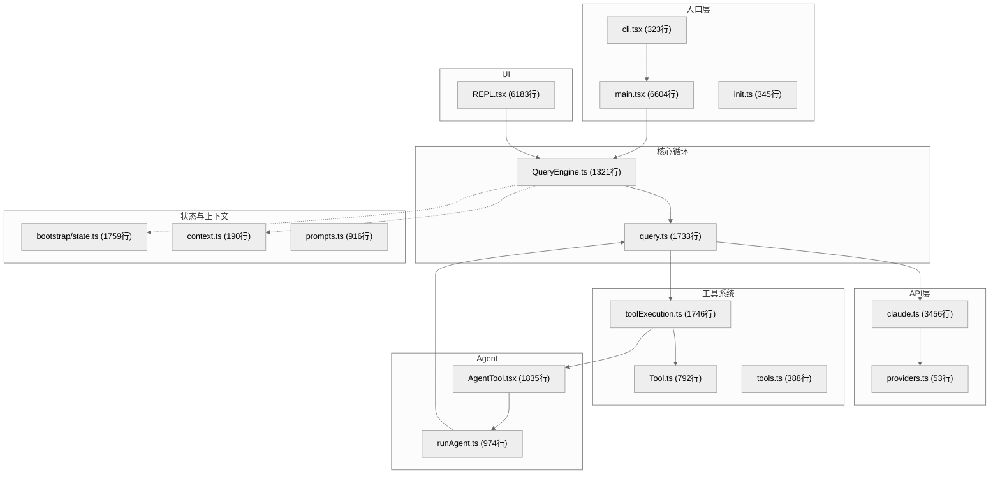

# 第15章 附录

> 本章汇集三大参考资料：关键文件索引、术语表、环境变量速查。适合在阅读其他章节时随时查阅。

---

## 15.1 关键文件索引

以下列出代码库中最重要的 25 个源文件，按功能分组。行数由 `wc -l` 实测（基于 v2.1.888），标注的是大致量级。

### 入口与启动

| 文件 | 行数 | 职责 |
|------|------|------|
| `src/entrypoints/cli.tsx` | ~323 | 真正的入口点。`main()` 函数按优先级处理多条快速路径（`--version`、`--daemon-worker`、`bridge` 等），默认路径加载 `main.tsx` |
| `src/main.tsx` | ~6604 | Commander.js CLI 定义。注册所有子命令（`mcp`、`server`、`auth`、`doctor` 等），主 `.action()` 处理器负责权限、MCP、会话恢复、REPL/Headless 模式分发 |
| `src/entrypoints/init.ts` | ~345 | 一次性初始化：遥测、配置加载、信任对话框 |

### 核心循环

| 文件 | 行数 | 职责 |
|------|------|------|
| `src/query.ts` | ~1733 | 主 API 查询函数。发送消息到 Claude API，处理流式响应、工具调用，管理对话轮次循环 |
| `src/QueryEngine.ts` | ~1321 | 高层编排器，包装 `query()`。管理会话状态、压缩、文件历史快照、归因和轮次级记账 |

### 工具系统

| 文件 | 行数 | 职责 |
|------|------|------|
| `src/Tool.ts` | ~792 | Tool 接口定义（`Tool` 类型，47 字段）及工具查找工具函数（`findToolByName`、`toolMatchesName`） |
| `src/tools.ts` | ~388 | 工具注册表。组装工具列表，部分工具通过 `feature()` 或 `process.env.USER_TYPE` 条件加载 |
| `src/services/tools/toolExecution.ts` | ~1746 | 工具执行引擎。并发调度、超时控制、Hooks 触发（pre/post tool use）、错误处理 |

### API 层

| 文件 | 行数 | 职责 |
|------|------|------|
| `src/services/api/claude.ts` | ~3456 | 核心 API 客户端。构建请求参数（系统提示、消息、工具、betas），调用 Anthropic SDK 流式端点，处理 `BetaRawMessageStreamEvent` |
| `src/utils/model/providers.ts` | ~53 | Provider 选择逻辑。按优先级判断使用哪个后端：OpenAI > Gemini > Bedrock > Vertex > Foundry > firstParty |

### Agent 系统

| 文件 | 行数 | 职责 |
|------|------|------|
| `src/tools/AgentTool/AgentTool.tsx` | ~1835 | AgentTool 主实现。`call()` 方法创建子 Agent 会话，管理前台/后台任务切换、内存快照 |
| `src/tools/AgentTool/runAgent.ts` | ~974 | Agent 运行器。构建子 Agent 上下文（受限工具集、权限降级），调用 `query()` 执行子会话 |

### 权限与安全

| 文件 | 行数 | 职责 |
|------|------|------|
| `src/utils/permissions/permissions.ts` | ~1487 | 权限判定核心。`checkToolPermission()` 实现四层规则匹配（settings > session allow > deny rules > ask） |
| `src/types/permissions.ts` | ~442 | 权限类型定义。`PermissionMode`（`default`/`plan`/`bypassPermissions`）、`PermissionResult`、规则结构 |

### 上下文与提示

| 文件 | 行数 | 职责 |
|------|------|------|
| `src/context.ts` | ~190 | 构建 API 调用的系统/用户上下文（git 状态、日期、CLAUDE.md 内容、记忆文件） |
| `src/constants/prompts.ts` | ~916 | 系统提示模板。组装完整的 system prompt，包含角色定义、工具说明、环境信息 |
| `src/utils/claudemd.ts` | ~1480 | CLAUDE.md 发现与加载。递归搜索项目层级中的 CLAUDE.md 文件并合并内容 |

### 状态管理

| 文件 | 行数 | 职责 |
|------|------|------|
| `src/bootstrap/state.ts` | ~1759 | 模块级单例：会话 ID、CWD、项目根、token 计数、模型覆盖、客户端类型、权限模式等全局状态 |
| `src/state/AppState.tsx` | ~201 | 中央应用状态类型和 Context Provider。包含消息列表、工具集、权限、MCP 连接等 |
| `src/state/store.ts` | ~35 | Zustand 风格 store 工厂函数（`createStore`） |

### 终端 UI

| 文件 | 行数 | 职责 |
|------|------|------|
| `src/screens/REPL.tsx` | ~6183 | 交互式 REPL 屏幕（React/Ink 组件）。处理用户输入、消息展示、工具权限提示、键盘快捷键 |
| `src/ink/reconciler.ts` | ~513 | 自定义 Ink reconciler。管理终端渲染树的协调与更新 |

### 类型定义

| 文件 | 行数 | 职责 |
|------|------|------|
| `src/types/message.ts` | ~168 | 消息类型层级（UserMessage、AssistantMessage、SystemMessage 等） |

### 构建与配置

| 文件 | 行数 | 职责 |
|------|------|------|
| `build.ts` | ~100 | 构建脚本。执行 `Bun.build()` with code splitting，后处理 `import.meta.require` 兼容 Node.js |
| `scripts/defines.ts` | ~19 | MACRO 定义集中管理。版本号、feature flag 默认值等编译时常量 |

---

## 15.2 术语表

按字母顺序排列。

### A

**AgentTool**
子 Agent 工具。通过 `Task` 工具名暴露给模型，调用时创建独立的子会话（拥有受限工具集和降级权限），可前台或后台运行。对应 `src/tools/AgentTool/`。

**Autocompact（自动压缩）**
当上下文窗口使用率超过阈值（通常 ~80%）时，自动触发会话压缩。由 `QueryEngine` 在轮次间检查，调用 Claude 自身生成对话摘要，替换早期消息以释放 token 空间。

**AppState**
中央应用状态，通过 React Context 传递。包含消息列表、工具注册表、权限设置、MCP 连接等。由 `src/state/AppState.tsx` 定义，`store.ts` 提供 Zustand 风格的访问。

### B

**Beta Header**
发送给 Anthropic API 的 `anthropic-beta` 请求头，用于启用实验性功能（如 extended thinking、interleaved thinking、prompt caching）。由 `src/utils/betas.ts` 管理。

### C

**CLAUDE.md**
项目级配置文件。Claude Code 启动时递归搜索项目层级中的 CLAUDE.md 文件，合并内容后注入系统提示，作为项目特定的指令和上下文。

### F

**Feature Flag（功能标志）**
通过 `import { feature } from 'bun:bundle'` 在代码中使用，`feature('FLAG_NAME')` 返回布尔值。运行时通过 `FEATURE_<FLAG_NAME>=1` 环境变量启用。典型标志包括 `BUDDY`、`DAEMON`、`BRIDGE_MODE`、`VOICE_MODE` 等。

### H

**Hooks（钩子）**
用户可配置的脚本扩展点。支持四个时机：`PreToolUse`（工具调用前）、`PostToolUse`（工具调用后）、`Notification`（通知时）、`Stop`（会话结束时）。在 `settings.json` 或 `.claude/settings.json` 中配置。

### M

**MCP（Model Context Protocol）**
模型上下文协议。标准化的工具/资源扩展协议，支持 `stdio` 和 `sse` 两种传输方式。Claude Code 既作为 MCP 客户端（连接外部 MCP 服务器）也作为 MCP 服务器（`claude mcp serve`）。

### P

**PermissionMode（权限模式）**
控制工具执行的安全级别。三种模式：`default`（每次询问用户）、`plan`（读操作自动批准，写操作询问）、`bypassPermissions`（全部自动批准，仅限 `--dangerously-skip-permissions`）。

**Prompt Cache（提示缓存）**
利用 Anthropic API 的 `ephemeral` cache control，对系统提示和早期消息设置缓存断点。相同前缀的后续请求可复用缓存，显著降低 token 成本和延迟。由 `services/api/claude.ts` 中的 `insertCachePoints()` 实现。

**Provider（API 提供商）**
API 后端选择。支持六种：Anthropic 直连（firstParty）、AWS Bedrock、Google Vertex、Azure Foundry、OpenAI 兼容、Gemini。优先级由 `providers.ts` 中的 `getAPIProvider()` 决定。

### Q

**query()**
核心查询函数（`src/query.ts`）。接收消息和配置，调用 Claude API，处理流式响应，执行工具调用，循环直到模型返回 `end_turn` 或达到停止条件。

**QueryEngine**
高层查询编排器（`src/QueryEngine.ts`）。包装 `query()` 函数，额外管理会话状态、自动压缩、文件历史快照和归因。是 REPL 和 Headless 模式的直接调用对象。

### S

**Streaming（流式处理）**
API 响应以 Server-Sent Events 形式逐块返回。`claude.ts` 处理 `message_start`、`content_block_start`、`content_block_delta`、`message_delta` 等事件类型，实时更新 UI。

### T

**Tool（工具）**
模型可调用的能力单元。每个工具包含 `name`、`description`、`inputSchema`、`call()` 方法和可选的 React 渲染组件。代码库包含 61 个工具目录（`src/tools/`），涵盖文件操作、搜索、Bash 执行、Agent 等。

**ToolUseContext**
工具执行上下文对象。包含 `readFileTimestamps`（文件读取时间戳）、`abortController`、`options`（包含 `sessionId`、`messageId` 等）。在工具调用链中传递，用于权限判定和状态追踪。

---

## 15.3 环境变量速查

以下环境变量经过源码 `grep` 验证（排除纯内部/测试用变量），按功能分组。

### API Provider 选择

| 变量 | 说明 |
|------|------|
| `CLAUDE_CODE_USE_OPENAI=1` | 启用 OpenAI 兼容层（最高优先级） |
| `CLAUDE_CODE_USE_GEMINI=1` | 启用 Gemini API |
| `CLAUDE_CODE_USE_BEDROCK=1` | 启用 AWS Bedrock |
| `CLAUDE_CODE_USE_VERTEX=1` | 启用 Google Vertex AI |
| `CLAUDE_CODE_USE_FOUNDRY=1` | 启用 Azure Foundry |

### Anthropic 直连配置

| 变量 | 说明 |
|------|------|
| `ANTHROPIC_API_KEY` | Anthropic API 密钥 |
| `ANTHROPIC_AUTH_TOKEN` | 替代认证 token |
| `ANTHROPIC_BASE_URL` | 自定义 API 基础 URL |
| `ANTHROPIC_MODEL` | 直接指定模型名（覆盖默认选择） |
| `ANTHROPIC_DEFAULT_HAIKU_MODEL` | Haiku 级别模型映射 |
| `ANTHROPIC_DEFAULT_SONNET_MODEL` | Sonnet 级别模型映射 |
| `ANTHROPIC_DEFAULT_OPUS_MODEL` | Opus 级别模型映射 |
| `ANTHROPIC_BETAS` | 手动指定 beta 头（逗号分隔） |

### OpenAI 兼容层

| 变量 | 说明 |
|------|------|
| `OPENAI_API_KEY` | OpenAI 兼容端点的 API 密钥 |
| `OPENAI_BASE_URL` | 端点 URL（如 `http://localhost:11434/v1`） |
| `OPENAI_MODEL` | 直接指定模型（最高优先级） |
| `OPENAI_DEFAULT_HAIKU_MODEL` | Haiku 级别映射 |
| `OPENAI_DEFAULT_SONNET_MODEL` | Sonnet 级别映射 |
| `OPENAI_DEFAULT_OPUS_MODEL` | Opus 级别映射 |
| `OPENAI_DEFAULT_HAIKU_MODEL_NAME` | 显示名称（Haiku） |
| `OPENAI_DEFAULT_SONNET_MODEL_NAME` | 显示名称（Sonnet） |
| `OPENAI_DEFAULT_OPUS_MODEL_NAME` | 显示名称（Opus） |
| `OPENAI_DEFAULT_HAIKU_MODEL_DESCRIPTION` | 显示描述（Haiku） |
| `OPENAI_DEFAULT_SONNET_MODEL_DESCRIPTION` | 显示描述（Sonnet） |
| `OPENAI_DEFAULT_OPUS_MODEL_DESCRIPTION` | 显示描述（Opus） |

### Gemini 配置

| 变量 | 说明 |
|------|------|
| `GEMINI_API_KEY` | Gemini API 密钥（必填） |
| `GEMINI_BASE_URL` | API 端点（默认 `https://generativelanguage.googleapis.com/v1beta`） |
| `GEMINI_MODEL` | 直接指定模型（最高优先级） |
| `GEMINI_DEFAULT_HAIKU_MODEL` | Haiku 级别映射 |
| `GEMINI_DEFAULT_SONNET_MODEL` | Sonnet 级别映射 |
| `GEMINI_DEFAULT_OPUS_MODEL` | Opus 级别映射 |
| `GEMINI_SMALL_FAST_MODEL` | 快速任务使用的轻量模型 |

### Feature Flags

通过 `FEATURE_<FLAG>=1` 启用。以下列出主要标志：

| 变量 | 说明 |
|------|------|
| `FEATURE_BUDDY` | Buddy 通知功能 |
| `FEATURE_DAEMON` | Daemon 长驻进程模式 |
| `FEATURE_BRIDGE_MODE` | 远程控制 / Bridge 模式 |
| `FEATURE_VOICE_MODE` | Push-to-Talk 语音输入 |
| `FEATURE_CHICAGO_MCP` | Computer Use（屏幕操控） |
| `FEATURE_AGENT_TRIGGERS_REMOTE` | 远程 Agent 触发 |
| `FEATURE_BG_SESSIONS` | 后台会话（`ps`/`attach`/`kill`） |
| `FEATURE_PROACTIVE` | 主动建议模式 |
| `FEATURE_KAIROS` | Kairos 会话管理 |
| `FEATURE_FORK_SUBAGENT` | 子 Agent fork 模式 |
| `FEATURE_SSH_REMOTE` | SSH 远程连接 |
| `FEATURE_COORDINATOR_MODE` | 协调器模式 |
| `FEATURE_UDS_INBOX` | Unix Domain Socket 通信 |
| `FEATURE_ULTRAPLAN` | UltraPlan 规划功能 |
| `FEATURE_TORCH` | Torch 功能 |
| `FEATURE_TRANSCRIPT_CLASSIFIER` | 转录分类器 |
| `FEATURE_TEMPLATES` | 模板系统 |
| `FEATURE_MCP_SKILLS` | MCP Skills 集成 |
| `FEATURE_WORKFLOW_SCRIPTS` | 工作流脚本 |

### 行为控制

| 变量 | 说明 |
|------|------|
| `CLAUDE_CODE_ENTRYPOINT` | 入口标识（`cli`/`sdk-cli`/`sdk-ts`/`sdk-py`/`mcp`/`remote` 等） |
| `CLAUDE_CODE_COORDINATOR_MODE=1` | 启用协调器模式 |
| `CLAUDE_CODE_SIMPLE=1` | 简化工具集模式 |
| `CLAUDE_CODE_REMOTE=1` | 远程模式 |
| `CLAUDE_CODE_PROACTIVE=1` | 主动建议模式 |
| `CLAUDE_CODE_BRIEF=1` | 简洁输出模式 |
| `CLAUDE_CODE_ACTION=1` | GitHub Action 模式 |
| `CLAUDE_CODE_EFFORT_LEVEL` | 推理努力级别 |
| `CLAUDE_CODE_AGENT` | 指定使用的 Agent 定义 |
| `CLAUDE_CODE_MAX_OUTPUT_TOKENS` | 最大输出 token 数 |
| `MAX_THINKING_TOKENS` | 最大思考 token 数 |
| `API_TIMEOUT_MS` | API 请求超时（毫秒） |
| `CLAUDE_CODE_MAX_TOOL_USE_CONCURRENCY` | 工具并发上限（默认 10） |

### UI 与终端

| 变量 | 说明 |
|------|------|
| `CLAUDE_CODE_DISABLE_TERMINAL_TITLE` | 禁用终端标题设置 |
| `CLAUDE_CODE_DISABLE_VIRTUAL_SCROLL` | 禁用虚拟滚动 |
| `CLAUDE_CODE_DISABLE_MESSAGE_ACTIONS` | 禁用消息操作按钮 |
| `CLAUDE_CODE_SYNTAX_HIGHLIGHT` | 语法高亮控制 |
| `CLAUDE_CODE_ACCESSIBILITY=1` | 无障碍模式 |
| `CLAUDE_CODE_TMUX_TRUECOLOR` | tmux 真彩色控制 |
| `CLAUDE_CODE_DEBUG_REPAINTS` | 调试重绘 |

### 隐私与安全

| 变量 | 说明 |
|------|------|
| `DISABLE_TELEMETRY=1` | 禁用遥测 |
| `CLAUDE_CODE_DISABLE_NONESSENTIAL_TRAFFIC` | 禁用非必要网络流量 |
| `DISABLE_COST_WARNINGS=1` | 禁用费用警告 |
| `CLAUDE_CODE_DISABLE_CLAUDE_MDS=1` | 禁用 CLAUDE.md 加载 |
| `CLAUDE_CODE_DISABLE_POLICY_SKILLS` | 禁用策略级 Skills |
| `CLAUDE_CODE_DISABLE_EXPERIMENTAL_BETAS` | 禁用实验性 betas |
| `DISABLE_INTERLEAVED_THINKING` | 禁用交错思考 |

### OAuth 与认证

| 变量 | 说明 |
|------|------|
| `CLAUDE_CODE_OAUTH_TOKEN` | OAuth access token |
| `CLAUDE_CODE_OAUTH_REFRESH_TOKEN` | OAuth refresh token |
| `CLAUDE_CODE_OAUTH_SCOPES` | OAuth scope 范围 |
| `CLAUDE_CODE_OAUTH_CLIENT_ID` | OAuth 客户端 ID 覆盖 |
| `CLAUDE_CODE_CUSTOM_OAUTH_URL` | 自定义 OAuth URL |
| `CLAUDE_CODE_API_KEY_FILE_DESCRIPTOR` | 通过文件描述符传递 API key |
| `CLAUDE_CODE_API_KEY_HELPER_TTL_MS` | API key helper 缓存 TTL |
| `NODE_EXTRA_CA_CERTS` | 自定义 CA 证书路径 |
| `CLAUDE_CODE_CLIENT_CERT` | 客户端证书 |

### 命令开关

| 变量 | 说明 |
|------|------|
| `DISABLE_DOCTOR_COMMAND=1` | 禁用 `/doctor` 命令 |
| `DISABLE_COMPACT=1` | 禁用 `/compact` 命令 |
| `DISABLE_LOGIN_COMMAND=1` | 禁用 `/login` 命令 |
| `DISABLE_LOGOUT_COMMAND=1` | 禁用 `/logout` 命令 |
| `DISABLE_FEEDBACK_COMMAND=1` | 禁用 `/feedback` 命令 |
| `DISABLE_BUG_COMMAND=1` | 禁用 `/bug` 命令 |
| `DISABLE_UPGRADE_COMMAND=1` | 禁用 `/upgrade` 命令 |
| `DISABLE_EXTRA_USAGE_COMMAND=1` | 禁用 `/extra-usage` 命令 |
| `DISABLE_INSTALL_GITHUB_APP_COMMAND=1` | 禁用 GitHub App 安装命令 |

### 内部/高级

| 变量 | 说明 |
|------|------|
| `USER_TYPE` | 用户类型（`ant` 为 Anthropic 内部，`external` 为外部） |
| `CLAUDE_CODE_SESSION_ID` | 会话 ID 覆盖 |
| `CLAUDE_CODE_IDLE_THRESHOLD_MINUTES` | 空闲超时阈值（分钟，默认 75） |
| `CLAUDE_CODE_IDLE_TOKEN_THRESHOLD` | 空闲 token 阈值（默认 100,000） |
| `API_MAX_INPUT_TOKENS` | API 最大输入 token（触发压缩阈值） |
| `API_TARGET_INPUT_TOKENS` | 压缩后目标 token 数 |
| `MAX_STRUCTURED_OUTPUT_RETRIES` | 结构化输出最大重试次数（默认 5） |
| `CLAUDE_CODE_EAGER_FLUSH` | 即时刷新模式 |
| `CLAUDE_CODE_IS_COWORK` | 协作模式 |
| `CLAUDE_CODE_EMIT_TOOL_USE_SUMMARIES` | 工具使用摘要输出 |
| `CLAUDE_CODE_DISABLE_FAST_MODE` | 禁用快速模式 |
| `CLAUDE_CODE_DISABLE_ADVISOR_TOOL` | 禁用 Advisor 工具 |
| `CLAUDE_CODE_ENABLE_CFC` | 启用 Claude for Chrome |
| `CLAUDE_CODE_ADDITIONAL_DIRECTORIES_CLAUDE_MD` | 额外 CLAUDE.md 搜索目录 |
| `GITHUB_ACTIONS=1` | GitHub Actions 环境标识 |
| `VOICE_STREAM_BASE_URL` | 语音流 WebSocket URL 覆盖 |

---

## 15.4 快速查阅图：系统架构分层

---

> **导航**：[返回目录](./README.md) | [上一章：设计原则](./14-设计原则.md)
