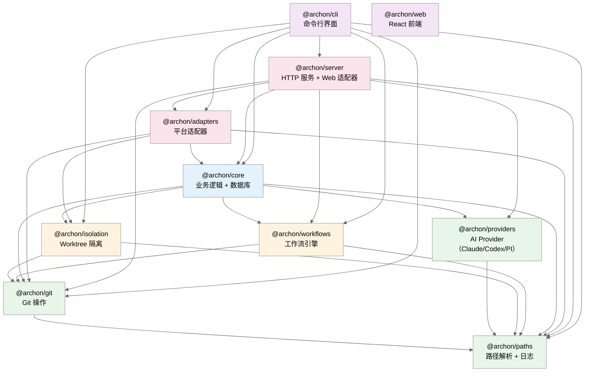
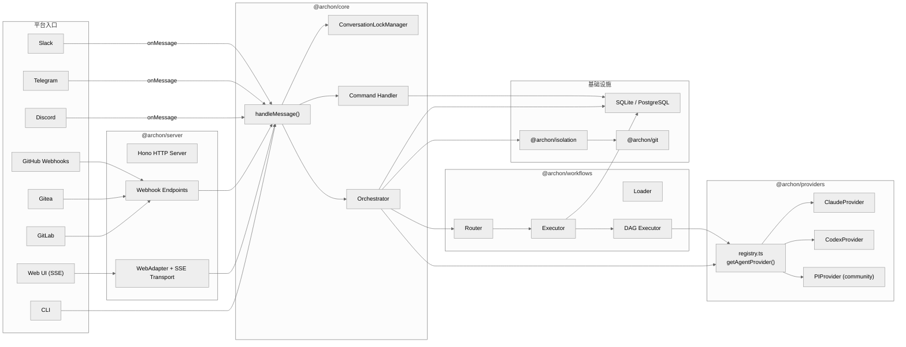

# 第一章：全局概览

> Archon 是一个面向 AI 编码助手的工作流引擎。将开发流程（计划、实现、验证、代码审查、PR 创建）定义为 YAML 工作流，并在所有项目中可靠运行。

## 1.1 系统定位

Archon 是一个**远程智能体编码平台**（Remote Agentic Coding Platform），其核心价值主张是：

1. **多平台统一入口**：从 Slack、Telegram、GitHub、Discord、Gitea、GitLab、Web UI 或 CLI 中的任何一个发送指令，由同一个后端处理
2. **YAML 驱动的工作流引擎**：用声明式 DAG 定义多步骤 AI 编码任务，支持节点级并发、条件分支、人工审批门、循环迭代
3. **隔离即默认**：每个任务自动创建 Git Worktree，避免分支冲突，支持并行开发
4. **双 AI 后端**：同时支持 Claude Code SDK 和 OpenAI Codex SDK，可按工作流节点切换

## 1.2 技术栈

| 层次 | 技术 |
|------|------|
| 运行时 | Bun (TypeScript) |
| HTTP 框架 | Hono + OpenAPI (via `@hono/zod-openapi`) |
| 前端 | React + Vite + Tailwind CSS v4 + shadcn/ui + Zustand |
| 实时通信 | Server-Sent Events (SSE) |
| 数据库 | SQLite（默认，零配置） / PostgreSQL（可选） |
| 模式验证 | Zod |
| AI SDK | `@anthropic-ai/claude-agent-sdk` + `@openai/codex-sdk` |
| 日志 | Pino (结构化 JSON) |
| 包管理 | Bun Workspaces (monorepo) |

## 1.3 代码规模

```
总计 TypeScript 文件：331 个（不含 .d.ts）
总计代码行数：~110,000 行
包数量：11 个（含 docs-web；v0.3.x 新增独立的 @archon/providers）
数据库表：8 个
```

## 1.4 Monorepo 包结构



**依赖方向（从底到顶）：**
- **基础层**（绿色）：`@archon/paths` → `@archon/git`、`@archon/providers` — 零业务逻辑，纯工具/能力库
- **引擎层**（橙色）：`@archon/isolation` + `@archon/workflows` — 隔离和工作流核心
- **业务层**（蓝色）：`@archon/core` — 数据库、编排器、命令处理（AI Provider 通过 `@archon/providers/registry` 取得）
- **接口层**（红色/紫色）：`@archon/adapters` + `@archon/server` + `@archon/cli` + `@archon/web`

> v0.3.x 重构亮点：原本位于 `@archon/core/clients/` 的 Claude/Codex 客户端被抽离为独立包 `@archon/providers`，并新增了社区维护的 `pi-coding-agent` Provider（`packages/providers/src/community/pi/`）。`@archon/workflows` 不直接依赖 providers，而是通过 `WorkflowDeps.getAssistantClient()` 注入。

`@archon/web` 是纯前端包，不依赖任何 `@archon/*` 后端包——它通过 OpenAPI 生成的类型（`api.generated.d.ts`）与后端通信。

## 1.5 核心架构图



## 1.6 核心循环

Archon 的核心循环是**消息驱动的**：

```
用户消息到达 → 平台适配器接收 → handleMessage() 入口
  → 获取会话锁（ConversationLockManager）
  → 加载/创建会话上下文（Conversation + Session + Codebase）
  → 路由判断：
    ├── 斜杠命令（/clone, /workflow, /status...）→ Command Handler → 直接响应
    └── 自然语言 → Orchestrator
        → Router 分析意图 → 匹配工作流？
            ├── 是 → Workflow Executor → DAG 执行（多节点、并发、循环、审批）
            └── 否 → 直接 AI 对话（archon-assist 兜底）
        → 流式响应回平台
```

## 1.7 数据从哪里进来，从哪里出去

| 数据入口 | 说明 |
|----------|------|
| 平台消息 | Slack/Telegram/Discord 用户消息、GitHub/Gitea/GitLab webhook |
| Web UI 消息 | 通过 REST API POST 到 `/api/conversations/:id/message` |
| CLI 命令 | `archon workflow run <name> <msg>` |
| YAML 工作流 | `.archon/workflows/` 目录中的工作流定义文件 |
| 配置文件 | `.archon/config.yaml`（全局 + 仓库级） |

| 数据出口 | 说明 |
|----------|------|
| 平台响应 | AI 生成的文本流式推送到各平台 |
| Git 变更 | AI 在 worktree 中编写代码，创建 commits |
| SSE 事件流 | Web UI 实时接收结构化事件 |
| 工作流产物 | 保存到 `~/.archon/workspaces/{owner}/{repo}/artifacts/runs/{id}/` |
| 数据库 | 会话、消息、工作流运行记录持久化 |

## 1.8 关键文件索引（Top 20 by 代码行数）

> 行数为 v0.3.10（HEAD `88d01099`）快照。

| 文件 | 行数 | 职责 |
|------|------|------|
| `packages/workflows/src/dag-executor.ts` | 3,184 | DAG 工作流执行引擎 |
| `packages/server/src/routes/api.ts` | 2,698 | REST API 路由定义 |
| `packages/cli/src/commands/setup.ts` | 1,928 | CLI 交互式设置向导 |
| `packages/core/src/orchestrator/orchestrator-agent.ts` | 1,557 | AI 会话编排器 |
| `packages/isolation/src/providers/worktree.ts` | 1,227 | Worktree 隔离提供者 |
| `packages/core/src/handlers/command-handler.ts` | 1,150 | 斜杠命令处理 |
| `packages/cli/src/commands/workflow.ts` | 1,129 | CLI workflow 子命令 |
| `packages/providers/src/claude/provider.ts` | 1,055 | Claude Provider（v0.3.x 抽离） |
| `packages/core/src/db/workflows.ts` | 1,007 | 工作流数据库操作 |
| `packages/adapters/src/forge/github/adapter.ts` | 952 | GitHub 适配器 |
| `packages/adapters/src/community/forge/gitea/adapter.ts` | 912 | Gitea 适配器 |
| `packages/workflows/src/executor.ts` | 831 | 工作流执行协调器 |
| `packages/adapters/src/community/forge/gitlab/adapter.ts` | 798 | GitLab 适配器 |
| `packages/server/src/index.ts` | 729 | 服务器启动和适配器初始化 |
| `packages/workflows/src/validator.ts` | 680 | 资源验证（命令/MCP/技能） |
| `packages/providers/src/codex/provider.ts` | 665 | Codex Provider（v0.3.x 抽离） |
| `packages/cli/src/cli.ts` | 659 | CLI 入口和命令分发 |
| `packages/workflows/src/schemas/dag-node.ts` | 638 | DAG 节点 Zod schema |
| `packages/isolation/src/resolver.ts` | 561 | 6 步隔离解析引擎 |
| `packages/web/src/lib/api.ts` | 529 | 前端 REST 客户端 |
