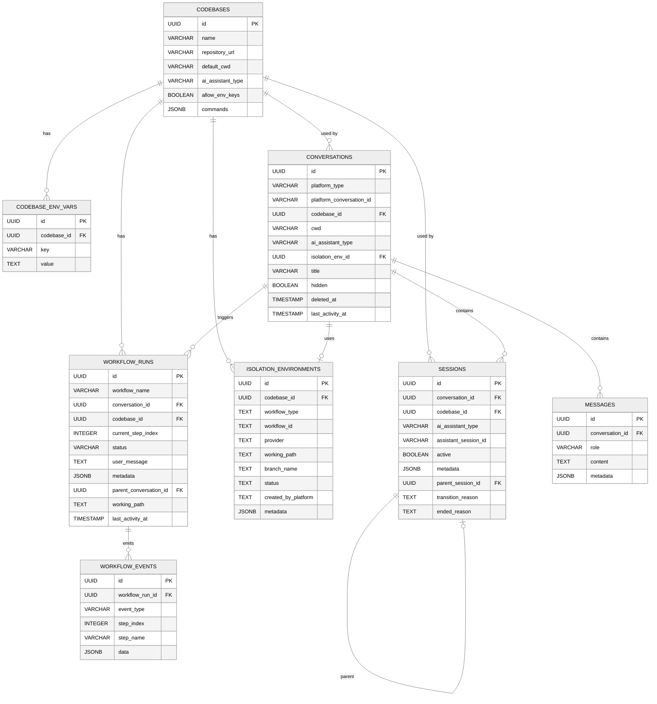

# 第二章：数据模型与数据库

> Archon 使用 8 张表来跟踪代码库注册、会话管理、消息历史、隔离环境和工作流执行状态。支持 SQLite（默认）和 PostgreSQL 双后端。

## 2.1 数据库自动检测

Archon 的数据库选择完全自动：

- **未设置 `DATABASE_URL`** → SQLite，数据文件位于 `~/.archon/archon.db`，零配置
- **设置了 `DATABASE_URL`** → PostgreSQL，适合高并发场景（20+ 并发工作流）

关键实现在 `packages/core/src/db/connection.ts`，通过 `IDatabase` 接口抽象，提供 `SqlDialect` 来处理方言差异（UUID 生成、时间函数、JSON 操作等）。

## 2.2 ER 图



## 2.3 表详解

### 2.3.1 `remote_agent_codebases` — 代码库注册

存储通过 `/clone` 命令或 Web UI 注册的仓库信息。

| 字段 | 说明 |
|------|------|
| `name` | 仓库名（如 `owner/repo`） |
| `repository_url` | Git 远程 URL |
| `default_cwd` | 默认工作目录（clone 路径或本地路径） |
| `ai_assistant_type` | 默认 AI 助手（`claude` / `codex`），默认 `claude` |
| `allow_env_keys` | 环境变量泄漏门控的同意位 |
| `commands` | JSONB，存储命令文件路径索引 |

`allow_env_keys` 是安全特性：当目标仓库的 `.env` 包含敏感密钥时，env-leak-gate 会阻止 AI subprocess 继承这些变量，除非用户明确同意。

### 2.3.2 `remote_agent_codebase_env_vars` — 代码库环境变量

每个代码库可以配置注入到 Claude SDK subprocess 中的环境变量。通过 Web UI 或 `config.yaml` 中的 `env:` 管理。

### 2.3.3 `remote_agent_conversations` — 会话

核心实体，跟踪一次完整的人机对话。

| 字段 | 说明 |
|------|------|
| `platform_type` | 平台类型（`web`、`telegram`、`slack`、`github`、`discord`、`cli` 等） |
| `platform_conversation_id` | 平台特定 ID（Slack: `thread_ts`、Telegram: `chat_id`、GitHub: `owner/repo#42`） |
| `isolation_env_id` | 关联的隔离环境（worktree） |
| `title` | AI 生成的会话标题 |
| `hidden` | `true` = 后台工作流的 worker 会话，不在 UI 列表中显示 |
| `deleted_at` | 软删除标记 |
| `last_activity_at` | 用于检测过期会话 |

**唯一约束**：`(platform_type, platform_conversation_id)` — 同一平台不会有重复会话。

### 2.3.4 `remote_agent_sessions` — AI SDK 会话

Session 是不可变的（immutable）。每次状态转换创建新的 Session，旧的被标记为非活跃。

| 字段 | 说明 |
|------|------|
| `assistant_session_id` | Claude/Codex SDK 的原生会话 ID，用于 resume |
| `active` | 当前是否为活跃会话 |
| `parent_session_id` | 指向前一个 session，形成审计链 |
| `transition_reason` | 创建原因：`first-message`、`plan-to-execute`、`reset-requested` 等 |
| `ended_reason` | 结束原因：`reset-requested`、`cwd-changed`、`conversation-closed` 等 |

**Session 状态转换链**（通过 `parent_session_id` 追溯）：

```
Session A (first-message) → Session B (plan-to-execute) → Session C (reset-requested)
```

### 2.3.5 `remote_agent_isolation_environments` — 隔离环境

以工作为中心的设计，而非以会话为中心。

| 字段 | 说明 |
|------|------|
| `workflow_type` | 工作类型：`issue`、`pr`、`review`、`thread`、`task` |
| `workflow_id` | 工作标识符：`42`、`pr-99`、`thread-abc123` |
| `provider` | 总是 `worktree` |
| `working_path` | 文件系统路径 |
| `branch_name` | Git 分支名 |
| `status` | `active` 或 `destroyed` |

**部分唯一索引**：`UNIQUE(codebase_id, workflow_type, workflow_id) WHERE status = 'active'` — 同一工作项只能有一个活跃环境。

### 2.3.6 `remote_agent_workflow_runs` — 工作流运行

| 字段 | 说明 |
|------|------|
| `status` | `pending` → `running` → `completed` / `failed` |
| `current_step_index` | 当前执行到的步骤索引 |
| `user_message` | 用户的原始指令 |
| `metadata` | JSONB，存储节点完成状态、输出等 |
| `working_path` | 工作目录（可能是 worktree 路径） |
| `parent_conversation_id` | 来源会话（用于后台 dispatch） |
| `last_activity_at` | 用于检测孤立运行 |

### 2.3.7 `remote_agent_workflow_events` — 工作流事件

轻量级 UI 事件日志，每个工作流运行的步骤级事件。

| event_type | 说明 |
|------------|------|
| `step_started` | 步骤开始 |
| `step_completed` | 步骤完成 |
| `step_failed` | 步骤失败 |
| `artifact_created` | 产物创建 |
| 等 | ... |

### 2.3.8 `remote_agent_messages` — 消息历史

| 字段 | 说明 |
|------|------|
| `role` | `user` / `assistant` / `system` |
| `content` | 消息文本 |
| `metadata` | JSONB，可包含 tool call 信息、分类标记 |

## 2.4 数据库抽象层

```
packages/core/src/db/
├── connection.ts          # 连接管理，自动检测 SQLite/PostgreSQL
├── adapters/
│   ├── types.ts           # IDatabase + SqlDialect 接口
│   ├── sqlite.ts          # SQLite 适配器（bun:sqlite）
│   └── postgres.ts        # PostgreSQL 适配器（pg）
├── codebases.ts           # 代码库 CRUD
├── conversations.ts       # 会话 CRUD + 软删除
├── sessions.ts            # Session CRUD + 审计链
├── isolation-environments.ts  # 隔离环境 CRUD
├── workflows.ts           # 工作流运行 CRUD
├── workflow-events.ts     # 工作流事件 CRUD
└── messages.ts            # 消息 CRUD
```

**IDatabase 接口**：

```typescript
interface IDatabase {
  query<T>(sql: string, params?: unknown[]): Promise<{ rows: readonly T[]; rowCount: number }>;
  close(): Promise<void>;
}
```

**SqlDialect 方言抽象**处理 PostgreSQL 和 SQLite 的差异：
- `generateUuid()` — PostgreSQL: `gen_random_uuid()`，SQLite: 内联生成
- `now()` — PostgreSQL: `NOW()`，SQLite: `datetime('now')`
- `jsonMerge()` — PostgreSQL: `jsonb_set()`，SQLite: `json_set()`
- `nowMinusDays()` — PostgreSQL: `NOW() - INTERVAL '? days'`，SQLite: `datetime('now', '-? days')`

## 2.5 迁移策略

迁移文件位于 `migrations/` 目录，共 22 个文件（`000_combined.sql` 到 `021_add_allow_env_keys_to_codebases.sql`）。

- `000_combined.sql` 是"终态"快照（幂等），包含全部 `CREATE TABLE IF NOT EXISTS` 和 `ALTER TABLE ADD COLUMN IF NOT EXISTS`
- SQLite 使用自动内联迁移（由适配器在启动时运行）
- PostgreSQL 手动运行：`psql $DATABASE_URL < migrations/000_combined.sql`

## 2.6 关键设计决策

1. **所有表名前缀 `remote_agent_`**：避免与共享数据库中的其他应用冲突
2. **Session 不可变**：通过 `parent_session_id` 链式追溯历史，支持审计
3. **软删除**：`conversations.deleted_at` 非空表示已删除，查询需过滤
4. **隔离环境以工作为中心**：`(workflow_type, workflow_id)` 而非 `conversation_id` 作为主键，支持跨平台共享
5. **JSONB 灵活字段**：`metadata`、`commands` 等字段使用 JSONB，避免频繁加列

## 2.7 本章关键文件

| 文件 | 行数 | 职责 |
|------|------|------|
| `migrations/000_combined.sql` | 315 | 完整数据库 schema（幂等） |
| `packages/core/src/db/connection.ts` | ~200 | 数据库连接管理和自动检测 |
| `packages/core/src/db/workflows.ts` | 930 | 工作流运行 CRUD（最大的 DB 模块） |
| `packages/core/src/db/conversations.ts` | ~300 | 会话 CRUD + 软删除 |
| `packages/core/src/db/sessions.ts` | ~250 | Session CRUD + 审计链 |
| `packages/core/src/db/isolation-environments.ts` | ~200 | 隔离环境 CRUD |
| `packages/core/src/db/messages.ts` | ~150 | 消息持久化 |
