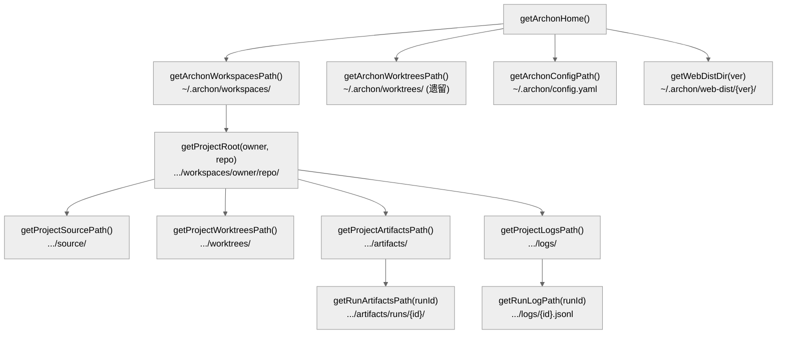

# 第三章：基础层 — @archon/paths 与 @archon/git

> 基础层是整个系统的地基：路径解析、日志、Git 操作。零业务逻辑，被所有上层包依赖。

## 3.1 @archon/paths — 路径解析与日志

### 3.1.1 职责

`@archon/paths` 是依赖图底部的包，只有三个外部依赖（`dotenv`、`pino`、`pino-pretty`），零 `@archon/*` 依赖。它提供四个关注点：

1. **目录路径解析** — Archon 所有数据目录的路径计算
2. **结构化日志** — Pino logger 工厂
3. **构建时常量** — 区分开发模式和编译二进制
4. **CWD 环境变量清洗** — 防止 Bun 自动加载的 `.env` 泄漏

### 3.1.2 文件清单

| 文件 | 行数 | 职责 |
|------|------|------|
| `archon-paths.ts` | 414 | 全部目录路径工具函数 |
| `logger.ts` | 120 | Pino logger 工厂 |
| `bundled-build.ts` | 18 | 构建时常量（二进制 vs 开发） |
| `strip-cwd-env.ts` | 94 | CWD .env 泄漏 + Claude Code 标记清洗 |
| `strip-cwd-env-boot.ts` | 13 | 副作用入口（import 时立即执行） |
| `update-check.ts` | 154 | GitHub 发布版本检查 + 缓存 |
| `index.ts` | 46 | 统一导出 |

### 3.1.3 Archon 目录结构

```
~/.archon/                                    # ARCHON_HOME
├── workspaces/owner/repo/                   # 项目中心布局
│   ├── source/                              # Clone 或 symlink → 本地路径
│   ├── worktrees/                           # 此项目的 Git worktrees
│   ├── artifacts/
│   │   ├── runs/{workflow-run-id}/          # 每次运行的产物
│   │   └── uploads/{convId}/               # Web UI 文件上传（临时）
│   └── logs/{workflow-run-id}.jsonl         # 工作流执行日志
├── worktrees/                               # 遗留全局 worktrees（兼容旧版）
├── web-dist/{version}/                      # 缓存的 Web UI 分发包
├── vendor/codex/                            # Codex 原生二进制
├── update-check.json                        # 更新检查缓存（1小时 TTL）
├── archon.db                                # SQLite 数据库
├── config.yaml                              # 全局配置
└── .env                                     # 环境变量
```

路径计算的核心是 `getArchonHome()`（`archon-paths.ts:56`）：

```typescript
function getArchonHome(): string {
  if (isDocker()) return '/.archon';              // Docker 环境
  if (process.env.ARCHON_HOME) return expandTilde(process.env.ARCHON_HOME);  // 自定义
  return join(homedir(), '.archon');              // 默认 ~/.archon
}
```

所有其他路径函数都基于此构建：



### 3.1.4 日志系统

基于 Pino 的结构化日志（`logger.ts`）。

**配置策略**：
- 检测 `process.stdout.isTTY` 且 `NODE_ENV !== 'production'` → 使用 `pino-pretty` 美化输出
- 否则 → 标准 JSON 格式（适合管道和日志收集）
- `pino-pretty` 作为**目标流**（destination stream）而非 worker-thread transport，避免 Bun 编译二进制中的 `require.resolve` 崩溃

**使用模式**：

```typescript
import { createLogger } from '@archon/paths';
const log = createLogger('orchestrator');  // 创建子 logger
log.info({ conversationId }, 'session_started');
log.error({ err, conversationId }, 'session_failed');
```

事件命名规范：`{domain}.{action}_{state}`，如 `workflow.step_started`、`isolation.create_failed`。

**日志级别**：`fatal(60)` > `error(50)` > `warn(40)` > `info(30)` > `debug(20)` > `trace(10)`，默认 `info`。

### 3.1.5 CWD 环境变量清洗

这是一个关键安全机制（`strip-cwd-env.ts`）。问题来源：

1. **Bun 自动加载 CWD `.env`**：当从目标仓库目录运行 `archon` 时，该仓库的 `.env`（可能包含数据库密码、API 密钥等）会泄漏到 Archon 进程
2. **嵌套 Claude Code 会话标记**：从 Claude Code 终端启动 Archon 时，父 shell 导出的 `CLAUDECODE=1` 等标记会导致子进程死锁

**两趟清洗**：

```
Pass 1 — CWD .env 泄漏
  遍历 ['.env', '.env.local', '.env.development', '.env.production']
  用 dotenv.config({ processEnv: {} }) 只读解析，不写入 process.env
  收集所有 key → 从 process.env 中删除

Pass 2 — Claude Code 标记
  删除 CLAUDECODE
  删除所有 CLAUDE_CODE_* （保留 AUTH 相关的三个）
  删除 NODE_OPTIONS、VSCODE_INSPECTOR_OPTIONS
```

`strip-cwd-env-boot.ts` 是纯副作用模块——import 时立即执行 `stripCwdEnv()`。CLI 和 Server 的入口文件都将其作为**第一个 import**。

### 3.1.6 构建时常量

`bundled-build.ts` 导出三个常量：

| 常量 | 开发值 | 编译二进制值 |
|------|--------|-------------|
| `BUNDLED_IS_BINARY` | `false` | `true` |
| `BUNDLED_VERSION` | `'dev'` | 实际版本号 |
| `BUNDLED_GIT_COMMIT` | `'unknown'` | 实际 commit hash |

构建脚本 `scripts/build-binaries.sh` 在 `bun build --compile` 前覆盖此文件，编译后通过 EXIT trap 还原。

### 3.1.7 更新检查

`update-check.ts` 实现了带缓存的 GitHub Release 检查：

- 缓存文件：`~/.archon/update-check.json`
- 缓存 TTL：1 小时（`STALENESS_MS = 3_600_000`）
- API 超时：3 秒（`FETCH_TIMEOUT_MS = 3000`）
- 目标 URL：`https://api.github.com/repos/coleam00/Archon/releases/latest`
- 仅在 `BUNDLED_IS_BINARY === true` 时触发（开发模式永不检查）
- 网络错误静默吞掉，返回 `null`

---

## 3.2 @archon/git — Git 操作抽象

### 3.2.1 职责

封装所有 Git CLI 操作，提供类型安全的接口。唯一依赖 `@archon/paths`。

### 3.2.2 文件清单

| 文件 | 行数 | 职责 |
|------|------|------|
| `types.ts` | 55 | Branded types + GitResult 联合类型 |
| `exec.ts` | 23 | `execFileAsync` + `mkdirAsync` 包装器 |
| `worktree.ts` | 271 | Worktree 操作（创建、删除、列表、查找） |
| `branch.ts` | 351 | 分支操作（checkout、merge 检测、提交） |
| `repo.ts` | 292 | 仓库操作（clone、sync、远程 URL） |
| `index.ts` | 50 | 统一导出 |

### 3.2.3 Branded Types

`types.ts` 定义了三个品牌类型（branded types），通过运行时验证防止字符串混用：

```typescript
type RepoPath = string & { readonly __brand: unique symbol };
type BranchName = string & { readonly __brand: unique symbol };
type WorktreePath = string & { readonly __brand: unique symbol };

// 构造器拒绝空字符串
function toRepoPath(path: string): RepoPath { ... }
function toBranchName(name: string): BranchName { ... }
function toWorktreePath(path: string): WorktreePath { ... }
```

### 3.2.4 GitResult 联合类型

所有 Git 操作返回判别联合类型，强制调用者检查结果：

```typescript
type GitError = { code: string; message: string; stderr?: string };
type GitResult<T> = { ok: true; value: T } | { ok: false; error: GitError };
```

### 3.2.5 execFileAsync

`exec.ts` 封装 `child_process.execFile`，确保：
- 使用 `execFile`（非 `exec`）防止 shell 注入
- 返回 `{ stdout, stderr }` 或抛出异常
- 所有 Git 操作通过此函数执行

### 3.2.6 核心操作

**Worktree 操作** (`worktree.ts`)：

| 函数 | 说明 |
|------|------|
| `listWorktrees(repoPath)` | 列出所有 worktree，解析 `git worktree list --porcelain` |
| `findWorktreeByBranch(repoPath, branch)` | 按分支名查找 worktree |
| `worktreeExists(worktreePath)` | 检查 worktree 是否存在 |
| `isWorktreePath(path)` | 检查路径是否是 worktree |
| `removeWorktree(repoPath, worktreePath)` | 删除 worktree |
| `getCanonicalRepoPath(path)` | 获取规范化的仓库路径 |
| `extractOwnerRepo(path)` | 从路径提取 owner/repo |
| `getWorktreeBase(repoPath)` | 获取 worktree 基础目录 |

**分支操作** (`branch.ts`)：

| 函数 | 说明 |
|------|------|
| `getDefaultBranch(repoPath)` | 获取默认分支（main/master） |
| `checkout(repoPath, branch)` | 切换分支 |
| `hasUncommittedChanges(repoPath)` | 检查是否有未提交变更（错误时保守返回 `true`） |
| `commitAllChanges(repoPath, message)` | 暂存并提交所有变更 |
| `isBranchMerged(repoPath, branch, into)` | 检查分支是否已合并 |
| `isPatchEquivalent(repoPath, branch, into)` | 检查两个分支是否补丁等价 |
| `isAncestorOf(repoPath, ancestor, descendant)` | 检查祖先关系 |
| `getLastCommitDate(repoPath, branch)` | 获取最后提交日期 |

**仓库操作** (`repo.ts`)：

| 函数 | 说明 |
|------|------|
| `findRepoRoot(path)` | 查找 Git 仓库根目录 |
| `getRemoteUrl(repoPath)` | 获取远程 URL |
| `cloneRepository(url, targetPath)` | Clone 仓库 |
| `syncWorkspace(sourcePath)` | 同步工作空间（fetch + fast-forward） |
| `syncRepository(repoPath)` | 同步仓库 |
| `addSafeDirectory(path)` | 添加到 `safe.directory` 配置 |

### 3.2.7 设计决策

1. **`hasUncommittedChanges()` 在错误时返回 `true`**：保守策略，防止数据丢失——不确定时假设有未提交变更
2. **绝不使用 `exec()`**：所有 git 命令通过 `execFileAsync('git', [...args])` 执行，防止 shell 注入
3. **绝不执行 `git clean -fd`**：这会永久删除未跟踪文件，改用 `git checkout .`
4. **syncWorkspace 在创建 worktree 前自动调用**：确保 worktree 基于最新代码

## 3.3 本章关键文件

| 文件 | 行数 | 职责 |
|------|------|------|
| `packages/paths/src/archon-paths.ts` | 414 | 全部目录路径计算 |
| `packages/paths/src/logger.ts` | 120 | Pino 结构化日志工厂 |
| `packages/paths/src/strip-cwd-env.ts` | 94 | CWD 环境变量清洗 |
| `packages/paths/src/update-check.ts` | 154 | 更新检查 + 缓存 |
| `packages/git/src/types.ts` | 55 | Branded types + GitResult |
| `packages/git/src/worktree.ts` | 271 | Worktree 操作 |
| `packages/git/src/branch.ts` | 351 | 分支操作 |
| `packages/git/src/repo.ts` | 292 | 仓库操作 |
