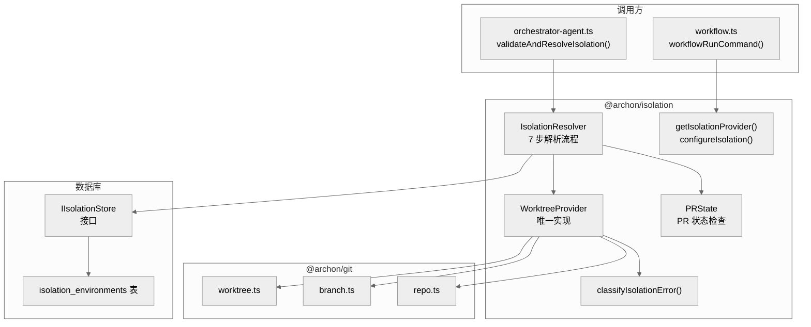
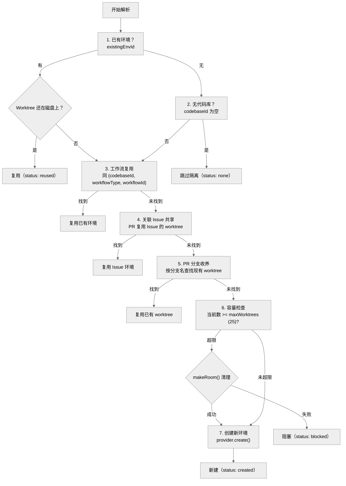

# 第四章：隔离系统 — @archon/isolation

> 每个任务自动获得一个隔离的 Git Worktree，避免分支冲突，支持并行开发。隔离是默认行为，不隔离需要显式选择退出。

## 4.1 设计哲学

Archon 的隔离系统遵循"**隔离即默认**"（isolation by default）原则：

- 每个 @mention（GitHub issue、PR comment）自动创建 worktree
- 每个 CLI `workflow run` 自动创建 worktree（除非 `--no-worktree`）
- Worktree 创建很廉价——简洁优先于效率
- 数据模型以**工作**（work）为中心，而非以**会话**（conversation）为中心
- 同一个隔离环境可以跨平台共享（GitHub issue 和 PR 使用同一个 worktree）

## 4.2 架构总览



## 4.3 文件清单

| 文件 | 行数 | 职责 |
|------|------|------|
| `types.ts` | 308 | 接口和类型定义 |
| `errors.ts` | 105 | 错误分类器和 IsolationBlockedError |
| `factory.ts` | 38 | Provider 工厂函数 |
| `resolver.ts` | 451 | 7 步隔离解析流程 |
| `store.ts` | 17 | IIsolationStore 接口定义 |
| `worktree-copy.ts` | 179 | 文件复制工具 |
| `pr-state.ts` | 91 | PR 状态检查 |
| `providers/worktree.ts` | 1,017 | WorktreeProvider（唯一实现） |
| `index.ts` | ~40 | 统一导出 |

## 4.4 核心类型

```typescript
// 隔离请求 — 描述需要什么样的隔离
interface IsolationRequest {
  codebaseId: string;
  codebaseName: string;
  sourcePath: string;       // 仓库源路径
  workflowType: string;     // 'issue' | 'pr' | 'review' | 'thread' | 'task'
  workflowId: string;       // '42', 'pr-99', 'thread-abc123'
  branchName?: string;      // 可选显式分支名
  fromBranch?: string;      // 可选基分支
  platform?: string;        // 创建平台
}

// 隔离提示 — 轻量级上下文，由适配器提供
interface IsolationHints {
  existingEnvId?: string;   // 已有环境 ID
  workflowType?: string;
  workflowId?: string;
  branchName?: string;
  fromBranch?: string;
  linkedIssueNumbers?: number[];  // PR 关联的 issue
}

// 隔离结果
interface IsolationResolution {
  status: 'created' | 'reused' | 'none' | 'blocked';
  environment?: IsolationEnvironment;
  workingPath?: string;
}
```

## 4.5 IsolationResolver — 7 步解析流程

`resolver.ts` 是隔离系统的核心决策引擎。当收到隔离请求时，按以下 7 步顺序尝试：



### 步骤详解

| 步骤 | 条件 | 行为 |
|------|------|------|
| **1. 已有环境** | `existingEnvId` 非空 | 验证 worktree 还在磁盘上 → 复用 |
| **2. 无代码库** | 没有关联的 codebase | 返回 `status: 'none'`，跳过隔离 |
| **3. 工作流复用** | 同 `(codebaseId, workflowType, workflowId)` 有活跃环境 | 复用该环境 |
| **4. 关联 Issue** | PR 有 linked issues，检查 issue 是否有环境 | PR 复用 issue 的 worktree |
| **5. PR 分支收养** | 按分支名 `findWorktreeByBranch()` 查找 | 收养已有 worktree |
| **6. 容量检查** | 活跃环境数 >= `maxWorktrees`（默认 25） | 调用 `makeRoom()` 尝试清理最旧的已销毁环境 |
| **7. 创建新环境** | 前述步骤都未命中 | `provider.create()` → `store.create()` |

**容错设计**：如果第 7 步 `store.create()` 失败但 `provider.create()` 已成功，会 best-effort 清理孤立的 worktree，然后重新抛出异常。

## 4.6 WorktreeProvider

`providers/worktree.ts`（1,017 行）是 `IIsolationProvider` 的唯一实现。

### 创建流程

```
1. syncWorkspace(sourcePath)  — 从 origin fetch + fast-forward
2. 确定分支名：显式指定 or 自动生成 archon/task-{workflow}-{timestamp}
3. 确定基分支：fromBranch or getDefaultBranch()
4. 确定 worktree 路径：项目级 or 遗留全局
5. git worktree add -b <branch> <path> <base>
6. syncArchonToWorktree()  — 复制 .archon/ 配置到 worktree
7. 返回 { workingPath, branchName }
```

### 自动分支命名

当用户未指定分支名时，自动生成格式为：
```
archon/task-{workflowType}-{timestamp}
```
例如：`archon/task-issue-1703123456789`

### Worktree 路径布局

优先使用项目级路径（注册过的仓库）：
```
~/.archon/workspaces/owner/repo/worktrees/{branch-name}/
```

对未注册仓库的遗留回退：
```
~/.archon/worktrees/{branch-name}/
```

## 4.7 错误处理

### classifyIsolationError

将 Git 底层错误映射为用户友好的消息：

| 错误模式 | 用户消息 |
|----------|---------|
| `permission denied` / `eacces` | 权限不足 |
| `timeout` | 操作超时 |
| `no space left` / `enospc` | 磁盘空间不足 |
| `not a git repository` | 不是 Git 仓库 |
| `branch not found` | 分支不存在 |

### IsolationBlockedError

特殊错误类型，表示**所有消息处理必须停止**。当隔离创建失败时抛出——用户已经收到了错误通知，不应再做任何处理。

```typescript
// 调用方必须检查此错误
try {
  await provider.create(request);
} catch (error) {
  if (!isKnownIsolationError(err)) throw err;  // 未知错误 = 编程 bug
  const userMessage = classifyIsolationError(err);
  // ... 发送 userMessage 给用户
}
```

## 4.8 IIsolationStore 接口

隔离系统通过接口与数据库解耦：

```typescript
interface IIsolationStore {
  create(env: IsolationEnvironment): Promise<void>;
  findActive(codebaseId: string, workflowType: string, workflowId: string): Promise<IsolationEnvironment | null>;
  findByCodebase(codebaseId: string, status?: string): Promise<IsolationEnvironment[]>;
  markDestroyed(envId: string): Promise<void>;
  markDestroyedBestEffort(envId: string): Promise<void>;  // 不抛异常
  countActive(codebaseId: string): Promise<number>;
}
```

`markDestroyedBestEffort()` 记录错误但不抛异常——清理操作不应阻塞主流程。

## 4.9 `.archon/` 同步

当创建 worktree 时，`syncArchonToWorktree()` 将主仓库的 `.archon/` 目录复制到 worktree 中，确保工作流定义、命令文件和配置在 worktree 中可用。

## 4.10 设计决策

| 决策 | 原因 |
|------|------|
| 以工作为中心而非会话为中心 | 同一个 issue 的 worktree 可以跨平台共享（GitHub → Slack） |
| 每次 @mention 都创建 worktree | 简洁优先于效率；worktree 创建成本低 |
| maxWorktrees 默认 25 | 防止磁盘耗尽，超限时自动清理最旧环境 |
| 部分唯一索引 `WHERE status = 'active'` | 允许同一工作流有多个已销毁的历史环境 |
| syncWorkspace 在创建前执行 | 确保 worktree 基于最新代码 |
| store.create() 失败时清理 worktree | 防止孤立的 worktree 占用磁盘 |

## 4.11 本章关键文件

| 文件 | 行数 | 职责 |
|------|------|------|
| `packages/isolation/src/resolver.ts` | 451 | 7 步隔离解析引擎 |
| `packages/isolation/src/providers/worktree.ts` | 1,017 | Worktree 创建/销毁 |
| `packages/isolation/src/types.ts` | 308 | 核心接口定义 |
| `packages/isolation/src/worktree-copy.ts` | 179 | 文件复制工具 |
| `packages/isolation/src/errors.ts` | 105 | 错误分类和 IsolationBlockedError |
| `packages/isolation/src/pr-state.ts` | 91 | PR 状态检查 |
| `packages/isolation/src/store.ts` | 17 | IIsolationStore 接口 |
| `packages/isolation/src/factory.ts` | 38 | Provider 工厂 |
