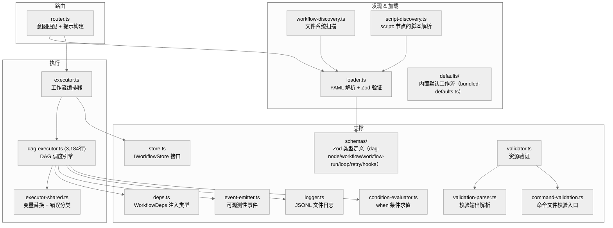
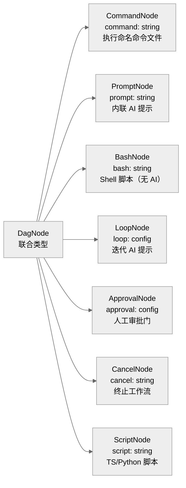
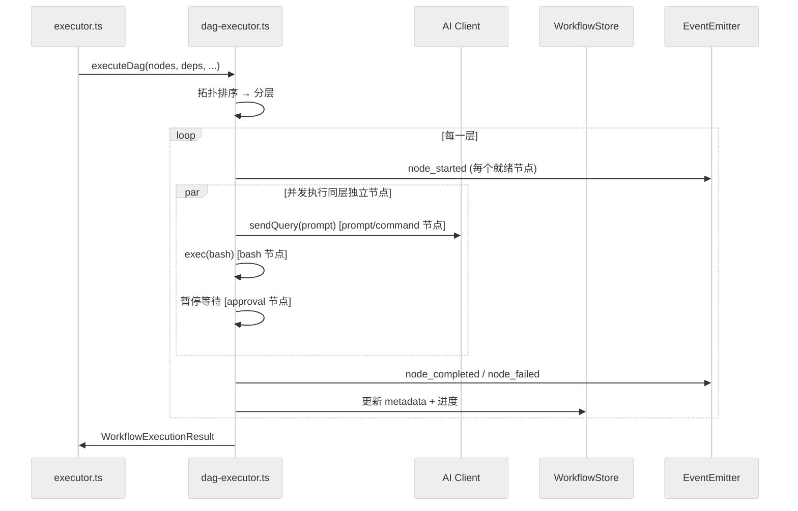

# 第五章：工作流引擎 — @archon/workflows

> 将开发流程（计划、实现、验证、代码审查）定义为 YAML DAG，由引擎调度执行。支持 7 种节点类型、并发、条件分支、循环迭代、人工审批门。

## 5.1 架构总览

`@archon/workflows` 是 Archon 的核心价值所在。它只依赖 `@archon/git` 和 `@archon/paths`，通过依赖注入（`WorkflowDeps`）接收数据库和 AI Provider 工厂——因此与 `@archon/core` 和 `@archon/providers` 都无循环依赖。



## 5.2 文件清单

| 文件 | 行数 | 职责 |
|------|------|------|
| `dag-executor.ts` | 3,184 | DAG 执行引擎（最大文件） |
| `executor.ts` | 831 | 工作流执行协调器 |
| `validator.ts` | 680 | 命令文件/MCP/技能目录验证 |
| `executor-shared.ts` | 532 | 变量替换、错误分类、命令加载 |
| `loader.ts` | 504 | YAML 解析和验证 |
| `workflow-discovery.ts` | 372 | 文件系统工作流发现 |
| `router.ts` | 266 | 工作流意图路由和名称解析 |
| `event-emitter.ts` | 261 | 可观测性事件系统 |
| `logger.ts` | 237 | JSONL 文件日志 |
| `condition-evaluator.ts` | 174 | `when:` 条件表达式求值 |
| `script-discovery.ts` | 170 | `script:` 节点脚本发现/选择 |
| `deps.ts` | 115 | WorkflowDeps 注入类型（v0.3.x 大幅瘦身） |
| `store.ts` | 113 | IWorkflowStore 接口 |
| `validation-parser.ts` | 64 | 校验输出解析 |
| `command-validation.ts` | 15 | 命令文件校验封装 |
| `schemas/dag-node.ts` | 638 | DAG 节点 Zod schema |
| `schemas/workflow-run.ts` | 169 | 工作流运行状态 schema |
| `schemas/workflow.ts` | 162 | 工作流定义 schema |
| `schemas/index.ts` | 121 | schemas 统一导出 |
| `schemas/hooks.ts` | 88 | Claude SDK hooks schema |
| `schemas/loop.ts` | 33 | loop 节点 schema |
| `schemas/retry.ts` | 23 | retry 配置 schema |
| `defaults/bundled-defaults.ts` | — | 内置默认工作流（`generate:bundled` 自动生成） |

## 5.3 工作流定义格式

所有工作流都使用 **DAG（有向无环图）**格式。一个典型的工作流 YAML：

```yaml
name: implement-feature
description: Plan and implement a feature with validation
provider: claude
model: sonnet

nodes:
  - id: plan
    prompt: "Create an implementation plan for: $ARGUMENTS"
    output_format:
      type: json_schema
      schema:
        type: object
        properties:
          tasks: { type: array, items: { type: string } }

  - id: review-plan
    approval:
      message: "Review the implementation plan above"
      capture_response: true
    depends_on: [plan]

  - id: implement
    command: execute
    depends_on: [review-plan]

  - id: test
    bash: "bun run test"
    depends_on: [implement]

  - id: iterate
    loop:
      until: "COMPLETE"
      max_iterations: 5
    prompt: "Fix failing tests. Signal COMPLETE when done."
    depends_on: [test]
```

## 5.4 DAG 节点类型

共 7 种节点类型，互斥（一个节点只能是其中一种）：



| 节点类型 | 运行方式 | 输出捕获 | AI 参与 |
|---------|---------|---------|---------|
| `command:` | 加载 `.archon/commands/` 中的命名文件，交给 AI 执行 | 是（AI 响应） | 是 |
| `prompt:` | 内联提示文本，交给 AI 执行 | 是（AI 响应） | 是 |
| `bash:` | 执行 shell 脚本，stdout 作为 `$nodeId.output` | 是（stdout） | 否 |
| `script:` | 通过 `bun` 或 `uv` 运行 TS/Python 脚本 | 是（stdout） | 否 |
| `loop:` | 迭代执行 AI 提示直到完成条件 | 是（最终 AI 响应） | 是 |
| `approval:` | 暂停等待人工审批/拒绝 | 可选（`capture_response: true`） | 否 |
| `cancel:` | 终止工作流并记录原因 | 否 | 否 |

### 通用节点选项

每个节点共享的基础字段（`dagNodeBaseSchema`）：

| 字段 | 类型 | 说明 |
|------|------|------|
| `id` | string | 节点唯一标识符 |
| `depends_on` | string[] | 依赖的上游节点 ID |
| `when` | string | 条件表达式，为 false 时跳过节点 |
| `trigger_rule` | enum | 依赖合并策略 |
| `model` | string | 覆盖工作流级模型 |
| `provider` | 'claude' \| 'codex' | 覆盖工作流级提供者 |
| `context` | 'fresh' \| 'shared' | 上下文策略 |
| `output_format` | object | 结构化 JSON 输出（Claude only） |
| `allowed_tools` / `denied_tools` | string[] | 工具白/黑名单（Claude only） |
| `hooks` | object | SDK 钩子配置（Claude only） |
| `mcp` | string | MCP 服务器配置文件路径（Claude only） |
| `skills` | string[] | 技能预加载（Claude only） |
| `idle_timeout` | number | 空闲超时（毫秒） |
| `retry` | object | 重试配置 |
| `effort` / `thinking` / `maxBudgetUsd` / `systemPrompt` / `fallbackModel` / `betas` / `sandbox` | various | Claude SDK 高级选项 |

### Trigger Rules

控制当多个上游依赖的结果不一致时如何决策：

| 规则 | 说明 |
|------|------|
| `all_success` | 所有依赖必须成功（默认） |
| `one_success` | 至少一个成功即可 |
| `none_failed_min_one_success` | 无失败且至少一个成功 |
| `all_done` | 所有依赖完成即可（不论成功/失败） |

## 5.5 工作流发现与加载

### 发现流程

`workflow-discovery.ts` 扫描三个来源（优先级从低到高）：

1. **内置默认** — `packages/workflows/src/defaults/`（编译二进制中嵌入）
2. **全局工作流** — `~/.archon/.archon/workflows/`
3. **仓库工作流** — `.archon/workflows/`（递归搜索）

同名工作流按优先级覆盖：仓库 > 全局 > 内置。

### 加载流程

`loader.ts` 的 `parseWorkflow()` 函数：

```
YAML 文件 → yaml.parse() → dagNodeSchema.safeParse() 验证每个节点
  → validateDagStructure() 检查：
    ├── DAG 无环检测（拓扑排序）
    ├── depends_on 引用验证（是否指向存在的节点 ID）
    ├── $nodeId.output 引用验证
    └── 节点 ID 唯一性检查
  → 返回 WorkflowDefinition
```

**弹性加载**：一个 YAML 文件解析失败不会中止整个发现过程。错误被收集到 `WorkflowLoadResult.errors` 中，`/workflow list` 命令会显示这些错误。

### 模型验证

在加载时验证 provider/model 兼容性：
- Claude 模型：`sonnet`、`opus`、`haiku`、`claude-*`、`inherit`
- Codex 模型：除 Claude 别名外的任何模型
- 不兼容组合在 `parseWorkflow()` 阶段即失败

> v0.3.x 起，provider/model 兼容性的真正实现已移到 `@archon/providers/registry.ts` 中（每个 provider 实现 `capabilities.ts` 描述自己支持的模型），workflows 层通过 `WorkflowDeps.getProviderCapabilities?.()` 注入查询。

## 5.6 路由器

`router.ts` 负责将用户消息匹配到工作流。

### 4 层名称解析

`resolveWorkflowName()` 按以下顺序尝试匹配：

1. **精确匹配** — `name === input`
2. **大小写不敏感** — `name.toLowerCase() === input.toLowerCase()`
3. **后缀匹配** — `name.endsWith('-' + input)`
4. **子串匹配** — `name.includes(input)`

如果第 3-4 层有多个匹配，返回歧义错误。

### AI 路由

当用户发送自然语言消息时，路由器使用 AI 判断意图：

```
构建提示 → 列出所有可用工作流名称和描述
  → AI 返回 /invoke-workflow <name> <args>
  → 解析并执行
  → 如果没有匹配 → 回退到 archon-assist
```

路由 AI 调用使用 `tools: []` 禁用工具调用，确保只做意图判断不执行操作。

## 5.7 DAG 执行器

`dag-executor.ts`（3,184 行）是最复杂的文件，实现了完整的 DAG 调度引擎。

### 执行模型



### 节点状态机

```
pending → running → completed
                  → failed (可重试)
                  → skipped (when 条件不满足)
pending → skipped (上游失败 + trigger_rule 不满足)
```

### 并发执行

同一拓扑层（topological layer）中没有依赖关系的节点并发执行：

```
Layer 0: [plan]
Layer 1: [implement, review]     ← 并发执行
Layer 2: [test]
Layer 3: [create-pr]
```

使用 `Promise.allSettled()` 等待一层完成后再执行下一层。

### 变量替换

`executor-shared.ts` 处理所有变量替换：

| 变量 | 说明 | 替换时机 |
|------|------|---------|
| `$1`, `$2`, `$3` | 位置参数 | 执行前 |
| `$ARGUMENTS` | 全部参数 | 执行前 |
| `$ARTIFACTS_DIR` | 运行产物目录 | 执行前（目录预创建） |
| `$WORKFLOW_ID` | 工作流运行 ID | 执行前 |
| `$BASE_BRANCH` | 基分支 | 执行前 |
| `$DOCS_DIR` | 文档目录 | 执行前 |
| `$nodeId.output` | 上游节点输出 | 节点执行前（运行时） |
| `$LOOP_USER_INPUT` | 循环用户反馈 | 循环恢复时 |
| `$REJECTION_REASON` | 拒绝原因 | on_reject 提示中 |

### `when` 条件求值

`condition-evaluator.ts` 支持简单的表达式语法：

```yaml
- id: fix-bug
  when: "$classify.output.type == 'BUG'"
  depends_on: [classify]
```

可以引用上游节点的 `$nodeId.output` 和 JSON 属性路径。

### 循环节点

`loop` 节点重复执行 AI 提示直到完成条件：

```yaml
- id: iterate
  loop:
    until: "COMPLETE"        # 完成信号关键字
    max_iterations: 10       # 最大迭代次数
    interactive: false        # 是否需要人工参与每轮
  prompt: "Fix the tests. Signal COMPLETE when done."
```

### 审批节点

`approval` 节点暂停工作流等待人工决策：

```yaml
- id: review
  approval:
    message: "Please review the implementation above"
    capture_response: true    # 将审批评论存为 $review.output
    on_reject:
      prompt: "Apply reviewer feedback: $REJECTION_REASON"
      max_attempts: 3
```

工作流暂停后，通过 `archon workflow approve <id>` 或 `archon workflow reject <id> <reason>` 恢复。

### 错误分类与重试

`executor-shared.ts` 对 AI 执行错误进行分类：

| 错误类型 | 是否可重试 | 示例 |
|---------|----------|------|
| 过载 / 速率限制 | 是 | Claude API 429 |
| 超时 | 是 | 网络超时 |
| 权限错误 | 否 | API key 无效 |
| 预算超限 | 否 | maxBudgetUsd 超出 |

节点级重试配置：

```yaml
- id: implement
  prompt: "Implement the feature"
  retry:
    max_attempts: 3
    backoff: exponential
    initial_delay_ms: 1000
```

### 恢复（Resume）

工作流失败后可以恢复执行：
1. `archon workflow resume <run-id>`
2. 加载运行状态（metadata 中记录了每个节点的完成状态）
3. 跳过已完成的节点
4. 从失败/待执行的节点重新开始

## 5.8 依赖注入

`@archon/workflows` 通过 `WorkflowDeps` 接口接收所有外部依赖（`deps.ts`，115 行）：

```typescript
import type {
  IAgentProvider,
  ProviderCapabilities,
  ProviderDefaultsMap,
} from '@archon/providers/types';

export type AgentProviderFactory = (provider: string) => IAgentProvider;

export interface WorkflowDeps {
  store: IWorkflowStore;
  // AI Provider 工厂 — 由 @archon/core 包装 @archon/providers 的 getAgentProvider
  getAgentProvider: AgentProviderFactory;
  loadConfig: (cwd: string) => Promise<WorkflowConfig>;
}
```

设计要点：

- **不再有"mirror copies"**：v0.3.x 起 `IAgentProvider`、`MessageChunk`、`SendQueryOptions`、`ProviderCapabilities` 等类型从 `@archon/providers/types` 直接导入并 re-export，避免重复声明导致的类型漂移
- **`@archon/core`** 提供适配器把核心数据库桥接到 `IWorkflowStore`，并把 `@archon/providers/registry.getAgentProvider()` 桥接到 `getAgentProvider`
- 旧名 `getAssistantClient` 已废弃，仍可见的 `WorkflowTokenUsage` 等别名仅为向后兼容

## 5.9 可观测性

### EventEmitter

`event-emitter.ts` 提供工作流执行的实时事件：

```typescript
// 注册运行
emitter.registerRun(runId, conversationId);

// 订阅事件
emitter.subscribeForConversation(conversationId, (event) => {
  // event.type: 'step_started' | 'step_completed' | 'node_started' | ...
});
```

监听器错误永远不会传播到执行器——fire-and-forget 模式，内部捕获并记录。

### JSONL 日志

`logger.ts` 将详细执行日志写入 JSONL 文件：`~/.archon/workspaces/{owner}/{repo}/logs/{runId}.jsonl`

## 5.10 设计决策

| 决策 | 原因 |
|------|------|
| 零 `@archon/core` 依赖 | 避免循环依赖，通过 WorkflowDeps 注入 |
| Zod 验证而非 TypeScript 类型 | 运行时验证 YAML 输入，提供详细错误消息 |
| flat schema + superRefine（非 z.union） | YAML 节点无显式类型判别符 |
| 弹性加载 | 一个工作流文件出错不影响其他工作流 |
| 拓扑排序分层并发 | 最大化并行度，同时保证依赖顺序 |
| Promise.allSettled | 一个节点失败不会立即中止同层其他节点 |
| $nodeId.output 引用 | 节点间数据传递无需共享状态 |
| 内置默认工作流 | 零配置即可使用常见开发流程 |

## 5.11 本章关键文件

| 文件 | 行数 | 职责 |
|------|------|------|
| `packages/workflows/src/dag-executor.ts` | 3,036 | DAG 调度引擎 |
| `packages/workflows/src/executor.ts` | 719 | 工作流执行协调 |
| `packages/workflows/src/validator.ts` | 612 | 资源验证 |
| `packages/workflows/src/schemas/dag-node.ts` | 608 | DAG 节点 Zod schema |
| `packages/workflows/src/executor-shared.ts` | 413 | 变量替换 + 错误分类 |
| `packages/workflows/src/loader.ts` | 412 | YAML 解析 + 验证 |
| `packages/workflows/src/workflow-discovery.ts` | 307 | 工作流发现 |
| `packages/workflows/src/router.ts` | 266 | 意图路由 + 名称解析 |
| `packages/workflows/src/event-emitter.ts` | 261 | 可观测性事件 |
| `packages/workflows/src/schemas/workflow.ts` | 120 | 工作流定义 schema |
