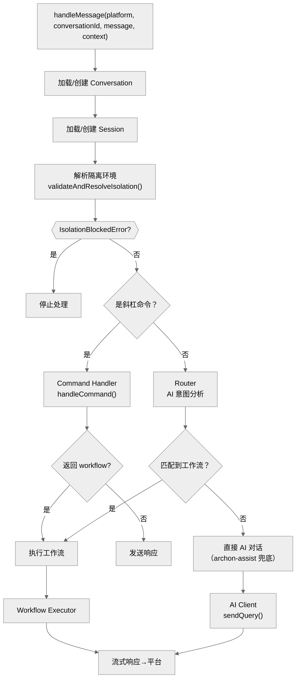

# 第六章：核心业务逻辑 — @archon/core

> 编排器、AI 客户端、命令处理、数据库操作——所有业务逻辑的中枢。

## 6.1 职责

`@archon/core` 是连接一切的中间层：

- **Orchestrator**：管理 AI 对话，路由消息到工作流或直接 AI 会话
- **AI Clients**：Claude Agent SDK 和 Codex SDK 的适配器
- **Command Handler**：处理斜杠命令（`/clone`、`/workflow`、`/status` 等）
- **Database**：所有数据库操作的封装
- **Services**：后台清理任务
- **State**：Session 状态机
- **Workflow Store Adapter**：桥接 core DB 到 `@archon/workflows` 的 `IWorkflowStore`

## 6.2 核心流程：handleMessage()

`handleMessage()`（`orchestrator-agent.ts:~line 1`）是系统的中央入口点。所有平台消息最终都流经此函数。



### 关键步骤

1. **加载会话上下文**：根据 `(platform_type, platform_conversation_id)` 查找或创建 Conversation
2. **加载 Session**：找到活跃 Session，或根据 `TransitionTrigger` 创建新 Session
3. **解析隔离**：如果有 `isolationHints`，通过 `IsolationResolver` 解析到 worktree
4. **路由决策**：
   - 斜杠命令 → `handleCommand()` 处理
   - 自然语言 → Router 分析意图 → 匹配工作流或直接 AI 对话
5. **执行**：调用工作流执行器或 AI 客户端
6. **流式响应**：通过 `platform.sendMessage()` 流式推送给用户

## 6.3 AI 客户端

### IAssistantClient 接口

```typescript
interface IAssistantClient {
  sendQuery(
    prompt: string,
    cwd: string,
    resumeSessionId?: string,
    options?: AssistantRequestOptions
  ): AsyncGenerator<MessageChunk>;

  getType(): string;
}
```

`sendQuery()` 返回 `AsyncGenerator<MessageChunk>`，支持流式消费。`MessageChunk` 是判别联合类型：

| type | 说明 |
|------|------|
| `assistant` | AI 文本响应 |
| `system` | 系统消息 |
| `thinking` | AI 思考过程 |
| `tool` | 工具调用 |
| `tool_result` | 工具结果 |
| `result` | 最终结果（含 token 用量、cost 等） |
| `rate_limit` | 速率限制信息 |
| `workflow_dispatch` | 工作流分派 |

### ClaudeClient

`clients/claude.ts`（~500 行）封装 `@anthropic-ai/claude-agent-sdk`：

- 使用 `query()` API 启动 Claude Code SDK subprocess
- 配置 `permissionMode: 'bypassPermissions'`（无人值守运行）
- 支持 Session resume（通过 `resume` 参数）
- 环境变量注入（`buildSubprocessEnv()`）
- 支持 MCP 服务器配置、工具白/黑名单、结构化输出
- 流式解析 SDK 事件 → 转换为 `MessageChunk`

### CodexClient

`clients/codex.ts`（~400 行）封装 `@openai/codex-sdk`：

- 使用 Codex SDK 的 turn-based API
- 支持 `modelReasoningEffort`、`webSearchMode`
- 支持 Session resume
- 支持 `additionalDirectories` 和 `codexBinaryPath` 配置

### 客户端工厂

```typescript
function getAssistantClient(type: string): IAssistantClient {
  switch (type) {
    case 'claude': return new ClaudeClient();
    case 'codex': return new CodexClient();
    default: throw new Error(`Unknown assistant type: ${type}`);
  }
}
```

## 6.4 命令处理器

`handlers/command-handler.ts`（1,150 行）处理所有斜杠命令：

| 命令 | 说明 |
|------|------|
| `/clone <url>` | 克隆仓库并注册 |
| `/load-commands <folder>` | 从文件夹加载命令 |
| `/getcwd` / `/setcwd` | 获取/设置工作目录 |
| `/repos` | 列出所有注册的仓库 |
| `/repo <name>` | 切换到指定仓库 |
| `/repo-remove <name>` | 删除仓库注册 |
| `/worktree` | 显示当前 worktree 信息 |
| `/workflow list` / `reload` / `status` / `cancel` / `resume` | 工作流管理 |
| `/commands` | 列出可用命令 |
| `/status` | 显示当前会话状态 |
| `/reset` | 重置会话 |
| `/reset-context` | 清除上下文，保留 Session |
| `/init` | 初始化仓库 |
| `/help` | 显示帮助信息 |

命令返回 `CommandResult`：
```typescript
interface CommandResult {
  success: boolean;
  message: string;
  modified?: boolean;    // 是否修改了会话状态
  workflow?: {           // 如果需要执行工作流
    definition: WorkflowDefinition;
    args: string;
  };
}
```

## 6.5 Session 状态机

`state/session-transitions.ts` 管理 Session 的生命周期。Session 是**不可变**的——状态变化通过创建新 Session 实现。

### TransitionTrigger

```typescript
type TransitionTrigger =
  | 'first-message'        // 首次消息
  | 'plan-to-execute'      // 从计划到执行
  | 'reset-requested'      // 用户请求重置
  | 'cwd-changed'          // 工作目录变更
  | 'isolation-changed'    // 隔离环境变更
  | 'conversation-closed'  // 会话关闭
```

### 转换规则

| 函数 | 用途 |
|------|------|
| `shouldCreateNewSession(trigger)` | 判断是否需要新 Session |
| `shouldDeactivateSession(trigger)` | 判断是否需要停用当前 Session |
| `detectPlanToExecuteTransition(message)` | 检测 plan→execute 转换 |
| `getTriggerForCommand(command)` | 命令到触发器的映射 |

只有 `plan-to-execute` 立即创建新 Session；其他触发器先停用当前 Session，下次消息时再创建新的。

## 6.6 配置系统

`config/config-loader.ts` 加载两级配置：

1. **全局配置**：`~/.archon/config.yaml`
2. **仓库配置**：`.archon/config.yaml`

合并后生成 `MergedConfig`。

```typescript
interface GlobalConfig {
  assistants?: {
    claude?: { model?: string; settingSources?: ('project' | 'user')[] };
    codex?: { model?: string; modelReasoningEffort?: string; ... };
  };
  botName?: string;
  defaults?: {
    loadDefaultCommands?: boolean;
    loadDefaultWorkflows?: boolean;
  };
  allowTargetRepoKeys?: boolean;
}
```

## 6.7 后台服务

### Cleanup Service

`services/cleanup-service.ts`（~400 行）定期清理过期资源：

- **Session 清理**：删除超过 `SESSION_RETENTION_DAYS`（默认 30 天）的非活跃 Session
- **隔离环境清理**：清理不再被引用的已销毁环境
- **Worktree 清理**：删除磁盘上已不存在的 worktree 记录

### Title Generator

`services/title-generator.ts` 使用轻量级 AI 模型为会话生成标题（可通过 `TITLE_GENERATION_MODEL` 配置模型）。

## 6.8 Workflow Store Adapter

`workflows/store-adapter.ts` 桥接 `@archon/core` 的数据库到 `@archon/workflows` 的 `IWorkflowStore` 接口：

```typescript
function createWorkflowStore(): IWorkflowStore {
  // 将 core 的 DB 查询封装为 IWorkflowStore 接口方法
  return {
    createRun: (...) => workflowDb.createRun(...),
    updateRun: (...) => workflowDb.updateRun(...),
    getRun: (...) => workflowDb.getRun(...),
    failOrphanedRuns: (...) => workflowDb.failOrphanedRuns(...),
    // ...
  };
}
```

## 6.9 工具函数

| 函数 | 文件 | 用途 |
|------|------|------|
| `ConversationLockManager` | `utils/conversation-lock.ts` | 控制每个会话的并发访问 |
| `classifyAndFormatError()` | `utils/error-formatter.ts` | 格式化用户友好的错误消息 |
| `scanPathForSensitiveKeys()` | `utils/env-leak-scanner.ts` | 扫描 .env 文件中的敏感密钥 |
| `getLinkedIssueNumbers()` | `utils/github-graphql.ts` | GitHub GraphQL 查询关联 issue |
| `getPort()` | `utils/port-allocation.ts` | Worktree 感知的端口分配 |
| `syncArchonToWorktree()` | `utils/worktree-sync.ts` | 同步 .archon/ 到 worktree |
| `sanitizeCredentials()` | `utils/credential-sanitizer.ts` | 清洗日志中的凭证 |

### ConversationLockManager

确保同一会话的消息串行处理（防止并发消息导致竞态条件）：

```typescript
const lockManager = new ConversationLockManager(maxConcurrent: 10);

// 获取锁并执行
await lockManager.acquireLock(conversationId, async () => {
  await handleMessage(adapter, conversationId, message);
});
```

超过 `maxConcurrent` 的请求排队等待。

## 6.10 本章关键文件

| 文件 | 行数 | 职责 |
|------|------|------|
| `packages/core/src/orchestrator/orchestrator-agent.ts` | 1,387 | AI 会话编排器 |
| `packages/core/src/handlers/command-handler.ts` | 1,150 | 斜杠命令处理 |
| `packages/core/src/db/workflows.ts` | 930 | 工作流数据库操作 |
| `packages/core/src/clients/claude.ts` | ~500 | Claude Agent SDK 客户端 |
| `packages/core/src/clients/codex.ts` | ~400 | Codex SDK 客户端 |
| `packages/core/src/services/cleanup-service.ts` | ~400 | 后台清理服务 |
| `packages/core/src/types/index.ts` | 383 | 核心类型定义 |
| `packages/core/src/db/conversations.ts` | ~300 | 会话数据库操作 |
| `packages/core/src/workflows/store-adapter.ts` | ~150 | Workflow Store 适配器 |
