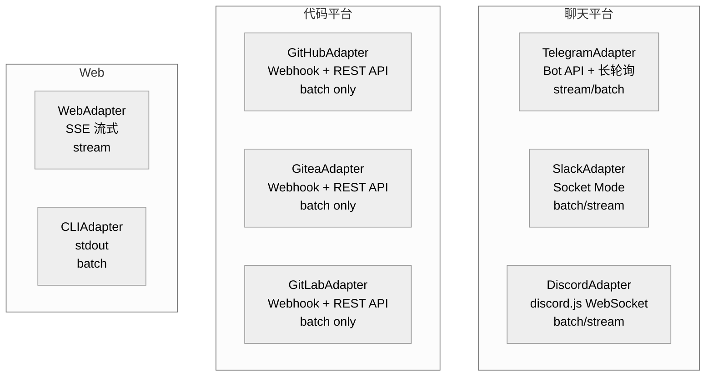

# 第七章：平台适配器 — @archon/adapters

> 六个平台、一个接口。Slack、Telegram、Discord、GitHub、Gitea、GitLab 通过统一的 `IPlatformAdapter` 接入系统。

## 7.1 适配器模型

所有平台适配器实现 `IPlatformAdapter` 接口：

```typescript
interface IPlatformAdapter {
  sendMessage(conversationId: string, message: string, metadata?: MessageMetadata): Promise<void>;
  ensureThread(originalConversationId: string, messageContext?: unknown): Promise<string>;
  getStreamingMode(): 'stream' | 'batch';
  getPlatformType(): string;
  start(): Promise<void>;
  stop(): void;
  sendStructuredEvent?(conversationId: string, event: MessageChunk): Promise<void>;
  emitRetract?(conversationId: string): Promise<void>;
}
```

## 7.2 适配器分类



## 7.3 适配器详解

### 7.3.1 聊天平台适配器

| 特性 | Telegram | Slack | Discord |
|------|---------|-------|---------|
| 连接方式 | Bot API 长轮询 | Socket Mode | discord.js WebSocket |
| 会话 ID | `chat_id` | `thread_ts` | Channel ID |
| 流式模式 | stream（默认） | batch（默认） | batch（默认） |
| 认证 | `TELEGRAM_BOT_TOKEN` | `SLACK_BOT_TOKEN` + `SLACK_APP_TOKEN` | `DISCORD_BOT_TOKEN` |
| 白名单 | `TELEGRAM_ALLOWED_USER_IDS` | `SLACK_ALLOWED_USER_IDS` | `DISCORD_ALLOWED_USER_IDS` |
| @mention 检测 | 不需要 | 需要 | 需要（DM 除外） |

**通用模式**：
- 消息到达 → 适配器内部鉴权 → 调用 `onMessage` 回调
- 未授权用户 → 静默拒绝（不返回错误）
- 记录未授权尝试（masking user ID）

### 7.3.2 代码平台适配器

| 特性 | GitHub | Gitea | GitLab |
|------|--------|-------|--------|
| 连接方式 | Webhook | Webhook | Webhook |
| 会话 ID | `owner/repo#number` | `owner/repo#number` | `project#number` |
| 触发 | Issue/PR comment @mention | Issue/PR comment @mention | Issue/MR note @mention |
| 签名验证 | HMAC SHA-256 (`X-Hub-Signature-256`) | HMAC SHA-256 (`X-Gitea-Signature`) | Token (`X-Gitlab-Token`) |
| 白名单 | `GITHUB_ALLOWED_USERS` | `GITEA_ALLOWED_USERS` | `GITLAB_ALLOWED_USERS` |

**GitHub 适配器特点**（952 行，最大的适配器）：
- 只处理 `issue_comment` 事件中的 @mention（描述中的 @mention 被忽略——防止文档示例误触发）
- Issue 上下文注入（将 issue body 作为对话上下文）
- PR 差异注入（`git diff` 作为代码审查上下文）
- 自动创建 worktree（每个 @mention 触发隔离解析）

### 7.3.3 Web 适配器

`WebAdapter`（在 `@archon/server` 中）实现了扩展的 `IWebPlatformAdapter` 接口：

```typescript
interface IWebPlatformAdapter extends IPlatformAdapter {
  sendStructuredEvent(conversationId: string, event: MessageChunk): Promise<void>;
  setConversationDbId(platformConversationId: string, dbId: string): void;
  setupEventBridge(workerConversationId: string, parentConversationId: string): () => void;
  emitLockEvent(conversationId: string, locked: boolean, queuePosition?: number): Promise<void>;
  registerOutputCallback(conversationId: string, callback: (text: string) => void): void;
  removeOutputCallback(conversationId: string): void;
}
```

### 7.3.4 CLI 适配器

`CLIAdapter`（在 `@archon/cli` 中）将 AI 响应流式输出到 stdout。默认 batch 模式。

## 7.4 认证模式

所有适配器遵循统一的认证模式：

```
1. 构造器中解析白名单环境变量
2. 消息处理器中检查授权（在调用 onMessage 之前）
3. 未授权 → 静默拒绝（不发送错误响应）
4. 记录未授权尝试（masking user ID 保护隐私）
```

当白名单为空/未设置时，接受所有用户。

## 7.5 消息分割

`utils/` 目录包含消息分割工具，用于处理平台消息长度限制：
- Telegram：4096 字符
- Discord：2000 字符
- Slack：4000 字符

长消息在 markdown 块边界处智能分割。

## 7.6 本章关键文件

| 文件 | 行数 | 职责 |
|------|------|------|
| `packages/adapters/src/forge/github/adapter.ts` | 952 | GitHub 适配器 |
| `packages/adapters/src/community/forge/gitea/adapter.ts` | 912 | Gitea 适配器 |
| `packages/adapters/src/community/forge/gitlab/adapter.ts` | 798 | GitLab 适配器 |
| `packages/adapters/src/chat/telegram/` | ~400 | Telegram 适配器 |
| `packages/adapters/src/chat/slack/` | ~400 | Slack 适配器 |
| `packages/adapters/src/community/chat/discord/` | ~350 | Discord 适配器 |
| `packages/core/src/types/index.ts` | 384 | IPlatformAdapter 接口定义 |
