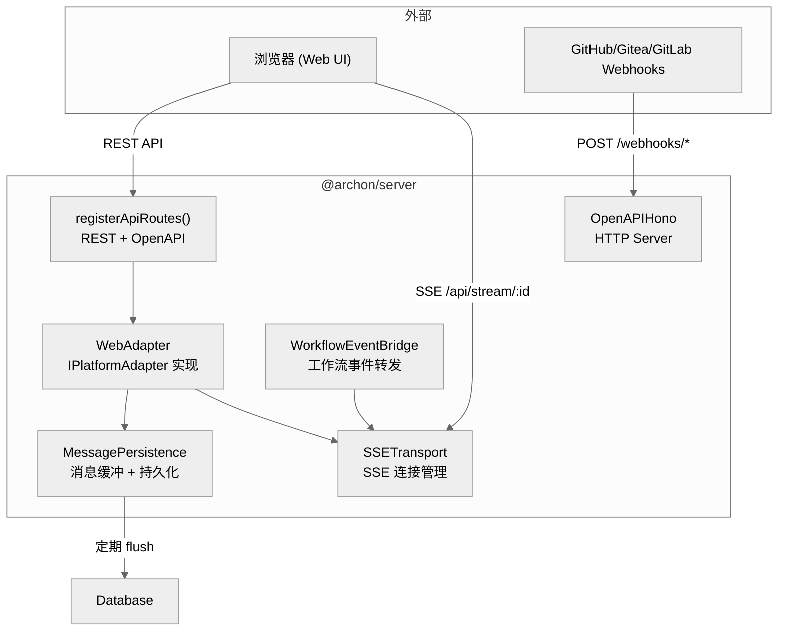

# 第八章：HTTP 服务器与 Web 适配器 — @archon/server

> Hono + OpenAPI 驱动的 HTTP 服务器，SSE 实时推送，Web UI 静态文件服务。

## 8.1 架构



## 8.2 服务器启动流程

`index.ts`（750 行）的 `startServer()` 启动序列：

```
1. 环境变量清洗（strip-cwd-env-boot）
2. 加载 .env（开发模式：repo root；二进制模式：~/.archon/.env）
3. 验证 AI 凭证（至少一种 Claude 或 Codex 凭证）
4. 测试数据库连接
5. 加载配置 + 启动环境泄漏扫描
6. 启动清理调度器
7. 标记孤立的工作流运行为失败
8. 初始化 ConversationLockManager
9. 创建 Web 适配器（SSETransport + Persistence + WorkflowEventBridge）
10. 初始化平台适配器（条件启动）
11. 创建 Hono 应用 + 注册 API 路由
12. 注册 Webhook 端点（GitHub/Gitea/GitLab）
13. 注册健康检查端点
14. 服务 Web UI 静态文件
15. 启动 Bun.serve()
16. 注册 SIGINT/SIGTERM 优雅关闭
```

## 8.3 SSE 实时推送

### SSETransport

管理所有 SSE 连接的注册表：

```typescript
class SSETransport {
  // 每个会话可以有多个 SSE 连接（多标签页）
  private streams: Map<string, Set<SSEWriter>>;

  // 发送事件到指定会话的所有连接
  emit(conversationId: string, event: SSEEvent): void;

  // 注册/移除 SSE 流
  addStream(conversationId: string, writer: SSEWriter): void;
  removeStream(conversationId: string, expectedStream: SSEWriter): void;
}
```

`removeStream()` 接受 `expectedStream` 参数防止竞态条件——React StrictMode 的双重挂载可能导致 unmount 移除了错误的流。

### SSE 端点

```
GET /api/stream/:conversationId → streamSSE() callback
  → 注册到 SSETransport
  → stream.onAbort() → 清理
  → 检查 stream.closed 后写入
```

## 8.4 消息持久化

### MessagePersistence

采用缓冲策略优化数据库写入：

```
AI 响应 → 累积到内存缓冲区
  → 定期 flush（每 N 秒）
  → 或在事件完成时 flush
  → 批量写入 messages 表
```

这避免了为每个 token 做一次 DB 写入。

## 8.5 工作流事件桥

### WorkflowEventBridge

将工作流执行器的事件（`step_started`、`step_completed`、`artifact_created` 等）转发到 SSE，使 Web UI 能实时显示工作流进度。

```typescript
class WorkflowEventBridge {
  constructor(private transport: SSETransport);

  // 订阅工作流事件并转发到 SSE
  bridge(runId: string, conversationId: string): () => void;
}
```

## 8.6 REST API 路由

`routes/api.ts`（2,623 行）定义了所有 REST API，使用 `@hono/zod-openapi` 实现类型安全和 OpenAPI 文档生成。

### 主要 API 端点

| 方法 | 路径 | 说明 |
|------|------|------|
| **会话管理** | | |
| GET | `/api/conversations` | 列出会话 |
| POST | `/api/conversations` | 创建会话 |
| PATCH | `/api/conversations/:id` | 更新会话 |
| DELETE | `/api/conversations/:id` | 软删除会话 |
| POST | `/api/conversations/:id/message` | 发送消息 |
| GET | `/api/conversations/:id/messages` | 获取消息历史 |
| **代码库** | | |
| GET | `/api/codebases` | 列出代码库 |
| GET | `/api/codebases/:id` | 获取代码库详情 |
| POST | `/api/codebases` | 注册代码库 |
| PATCH | `/api/codebases/:id` | 更新（env-leak 同意） |
| DELETE | `/api/codebases/:id` | 删除代码库 |
| **工作流** | | |
| GET | `/api/workflows` | 列出工作流 |
| GET | `/api/workflows/:name` | 获取单个工作流 |
| PUT | `/api/workflows/:name` | 保存/更新工作流 |
| DELETE | `/api/workflows/:name` | 删除工作流 |
| POST | `/api/workflows/validate` | 验证工作流（内存中） |
| **工作流运行** | | |
| POST | `/api/workflows/runs/:id/resume` | 恢复失败的运行 |
| POST | `/api/workflows/runs/:id/abandon` | 放弃运行 |
| DELETE | `/api/workflows/runs/:id` | 删除运行记录 |
| **命令** | | |
| GET | `/api/commands` | 列出命令 |
| **产物** | | |
| GET | `/api/artifacts/:runId/*` | 获取工作流产物文件 |
| **SSE** | | |
| GET | `/api/stream/:id` | SSE 事件流 |
| **系统** | | |
| GET | `/api/openapi.json` | OpenAPI 规范 |
| GET | `/api/update-check` | 更新检查 |
| GET | `/health` | 健康检查 |
| GET | `/health/db` | 数据库健康 |
| GET | `/health/concurrency` | 并发状态 |

### OpenAPI 集成

所有路由通过 `registerOpenApiRoute(createRoute({...}), handler)` 注册，自动生成 OpenAPI 3.0 规范。Zod schema 同时用于请求验证和文档生成。

## 8.7 Webhook 端点

| 路径 | 平台 | 签名验证 |
|------|------|---------|
| `POST /webhooks/github` | GitHub | `X-Hub-Signature-256` (HMAC SHA-256) |
| `POST /webhooks/gitea` | Gitea | `X-Gitea-Signature` (HMAC SHA-256) |
| `POST /webhooks/gitlab` | GitLab | `X-Gitlab-Token` (直接比较) |

所有 webhook 使用 `c.req.text()` 获取原始请求体（用于签名验证），然后 fire-and-forget 异步处理。

## 8.8 静态文件服务

生产模式下，Hono 服务 Web UI 的 SPA 文件：

```typescript
// 静态资源
app.use('/assets/*', serveStatic({ root: webDistPath }));
// SPA 回退 — 未匹配路由都返回 index.html
app.get('*', serveStatic({ root: webDistPath, path: 'index.html' }));
```

使用 `import.meta.dir` 而非相对路径，因为 `bun --filter` 会改变 CWD。

## 8.9 端口分配

`getPort()` 实现 worktree 感知的端口分配：

- **主仓库**：`PORT` 环境变量或默认 `3090`
- **Worktree**：基于路径哈希的确定性端口（3190-4089 范围）
- 同一 worktree 总是获得相同端口
- 可通过 `PORT=4000` 覆盖

## 8.10 优雅关闭

```
SIGINT/SIGTERM →
  1. 停止清理调度器
  2. 停止消息持久化定期 flush
  3. flush 所有缓冲消息
  4. 停止所有平台适配器
  5. 关闭数据库连接池
  6. process.exit(0)
```

## 8.11 本章关键文件

| 文件 | 行数 | 职责 |
|------|------|------|
| `packages/server/src/routes/api.ts` | 2,623 | REST API 路由定义 |
| `packages/server/src/index.ts` | 749 | 服务器启动和适配器初始化 |
| `packages/server/src/adapters/web/transport.ts` | ~200 | SSE 连接管理 |
| `packages/server/src/adapters/web/persistence.ts` | ~200 | 消息缓冲持久化 |
| `packages/server/src/adapters/web/workflow-bridge.ts` | ~100 | 工作流事件桥 |
| `packages/server/src/adapters/web/index.ts` | ~150 | WebAdapter 实现 |
