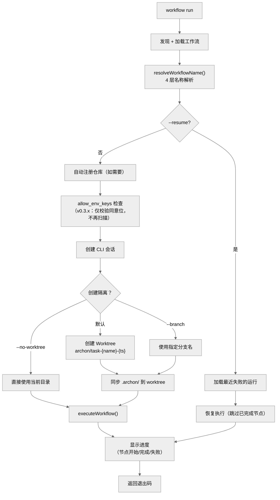

# 第九章：命令行界面 — @archon/cli

> `archon` CLI 是本地使用的主入口——从终端运行工作流、管理隔离环境、启动 Web 服务器。

## 9.1 命令结构

```
archon
├── chat <message>                    # 直接 AI 对话
├── setup                             # 交互式设置向导
├── workflow
│   ├── list [--json]                 # 列出工作流
│   ├── run <name> [msg] [options]    # 运行工作流
│   ├── status [--json] [--verbose]   # 运行状态
│   ├── resume <run-id>               # 恢复失败的运行
│   ├── abandon <run-id>              # 放弃运行
│   ├── approve <run-id> [comment]    # 审批门：批准
│   ├── reject <run-id> [reason]      # 审批门：拒绝
│   ├── cleanup [days]                # 清理旧记录
│   └── event emit                    # 发送工作流事件
├── isolation
│   ├── list                          # 列出隔离环境
│   └── cleanup [days|--merged]       # 清理
├── continue <branch> [msg]           # 在已有 worktree 上继续
├── complete <branch> [--force]       # 完成分支生命周期
├── validate
│   ├── workflows [name]              # 验证工作流
│   └── commands [name]               # 验证命令
├── skill
│   └── install [name]                # 安装 Claude Skill（v0.3.10 新增，PR #1445）
├── serve [--port] [--download-only]  # 启动 Web UI
├── version                           # 版本信息（也兼容 `--version` / `-V` / `-v`，PR #1444）
└── help                              # 帮助
```

## 9.2 启动流程

```
1. import '@archon/paths/strip-cwd-env-boot'  — 第一个 import，清洗环境
2. 加载 ~/.archon/.env（override: true）
3. registerBuiltinProviders() + registerCommunityProviders()  — 注册 AI Provider（v0.3.x）
4. 智能 Claude 认证默认值
5. 解析命令行参数（util.parseArgs）
6. 路由到具体命令
7. 最后关闭数据库连接
```

## 9.3 workflow run — 核心命令

`workflowRunCommand()` 是最复杂的 CLI 命令（`commands/workflow.ts`, 1,129 行）：



### 互斥选项

| 组合 | 规则 |
|------|------|
| `--branch` + `--no-worktree` | 互斥 |
| `--from` + `--no-worktree` | 互斥 |
| `--resume` + `--branch` | 互斥 |

### 默认行为

无标志时自动创建 worktree，分支名 `archon/task-{workflow}-{timestamp}`。这是**隔离即默认**的体现。

## 9.4 continue — 继续已有工作

```bash
archon continue fix/issue-42 "Fix the remaining tests"
archon continue fix/issue-42 --workflow archon-smart-pr-review "Review changes"
```

- 找到与分支名匹配的现有 worktree
- 注入先前的 git 日志和差异作为上下文（除非 `--no-context`）
- 默认使用 `archon-assist` 工作流

## 9.5 setup — 交互式设置

`commands/setup.ts`（1,928 行——第三大文件）实现了完整的设置向导：

- AI 凭证配置（Claude API key / OAuth、Codex tokens）
- 平台适配器配置（Telegram、Discord、Slack、GitHub）
- 数据库配置
- `--spawn` 标志可在新终端窗口中打开

## 9.6 serve — Web UI 服务器

```bash
archon serve              # 启动 Web UI（默认端口 3090）
archon serve --port 4000  # 指定端口
archon serve --download-only  # 仅下载 Web UI（不启动）
```

在编译二进制模式下，Web UI 从 GitHub Release 下载并缓存到 `~/.archon/web-dist/{version}/`。

## 9.7 会话 ID 格式

CLI 生成的会话 ID：`cli-{timestamp}-{random6}`
例如：`cli-1703123456789-a7f3bc`

## 9.8 CLIAdapter

`@archon/cli` 内的 CLIAdapter 实现 `IPlatformAdapter`：
- `sendMessage()` → 写入 stdout
- `getStreamingMode()` → 默认 `'batch'`
- `getPlatformType()` → `'cli'`
- 无认证（CLI 是本地工具）

## 9.9 本章关键文件

| 文件 | 行数 | 职责 |
|------|------|------|
| `packages/cli/src/commands/setup.ts` | 1,928 | 交互式设置向导 |
| `packages/cli/src/commands/workflow.ts` | 1,129 | workflow 子命令 |
| `packages/cli/src/cli.ts` | 659 | CLI 入口和命令分发 |
| `packages/cli/src/commands/isolation.ts` | 344 | isolation 子命令 |
| `packages/cli/src/commands/validate.ts` | 268 | validate 子命令 |
| `packages/cli/src/commands/continue.ts` | 249 | continue 命令 |
| `packages/cli/src/commands/serve.ts` | 186 | serve 命令 |
| `packages/cli/src/commands/version.ts` | 101 | version 命令（兼容 `--version`/`-V`/`-v`） |
| `packages/cli/src/commands/skill.ts` | 69 | `skill install`（v0.3.10 PR #1445） |
| `packages/cli/src/commands/chat.ts` | 19 | `chat` 命令 |
