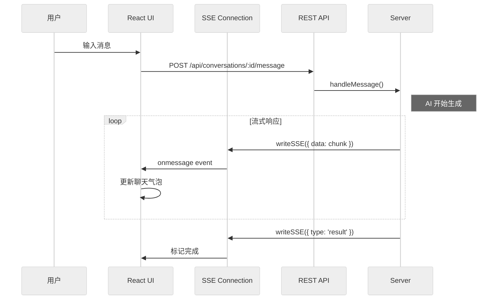

# 第十章：Web 前端 — @archon/web

> React + Vite + Tailwind + shadcn/ui 构建的单页应用，通过 SSE 实时接收 AI 响应和工作流事件。

## 10.1 技术栈

| 技术 | 用途 |
|------|------|
| React 19 | UI 框架 |
| Vite | 构建工具 |
| Tailwind CSS v4 | 样式 |
| shadcn/ui | 组件库 |
| Zustand | 状态管理 |
| React Router | 路由 |
| SSE (EventSource) | 实时通信 |

## 10.2 页面结构

```
App.tsx → React Router
├── / → DashboardPage        # 仪表板
├── /chat → ChatPage         # AI 对话界面
├── /workflows → WorkflowsPage     # 工作流列表
├── /workflows/builder → WorkflowBuilderPage  # 可视化工作流编辑器
├── /workflows/:id → WorkflowExecutionPage    # 工作流执行详情
└── /settings → SettingsPage       # 设置页面
```

## 10.3 目录结构

```
packages/web/src/
├── App.tsx                    # 路由配置
├── main.tsx                   # 入口
├── index.css                  # Tailwind 入口
├── lib/
│   ├── api.ts                 # REST API 客户端
│   ├── api.generated.d.ts     # 从 OpenAPI 生成的类型（2,584 行）
│   └── utils.ts               # 工具函数
├── stores/
│   └── workflow-store.ts      # Zustand 工作流状态
├── hooks/
│   ├── useSSE.ts              # 通用 SSE Hook
│   ├── useDashboardSSE.ts     # 仪表板 SSE
│   ├── useProviders.ts        # /api/providers 拉取
│   ├── useAutoScroll.ts       # 聊天自动滚动
│   ├── useClickOutside.ts     # 点击外部关闭
│   ├── useKeyboardShortcuts.ts# 全局快捷键
│   ├── useBuilderUndo.ts      # 工作流构建器撤销栈
│   ├── useBuilderKeyboard.ts  # 构建器快捷键
│   └── useBuilderValidation.ts# 构建器实时验证
├── contexts/                  # React Context Providers
├── routes/                    # 页面组件
│   ├── ChatPage.tsx
│   ├── DashboardPage.tsx
│   ├── WorkflowsPage.tsx
│   ├── WorkflowBuilderPage.tsx
│   ├── WorkflowExecutionPage.tsx
│   └── SettingsPage.tsx
└── components/
    ├── chat/                  # 对话 UI 组件
    ├── conversations/         # 会话列表
    ├── dashboard/             # 仪表板组件
    ├── layout/                # 布局组件
    ├── sidebar/               # 侧边栏
    ├── workflows/             # 工作流组件
    └── ui/                    # shadcn/ui 基础组件
```

## 10.4 关键架构

### API 客户端

`lib/api.ts` 封装所有 REST API 调用。类型来自 `api.generated.d.ts`——这个文件由 `bun generate:types` 从后端的 OpenAPI 规范自动生成。

**重要约束**：`@archon/web` 绝不直接 import `@archon/workflows` 或其他后端包。所有类型都通过 `api.generated.d.ts` 获取。

### SSE Hook

`useSSE` 自定义 Hook 管理 SSE 连接的生命周期：

```typescript
function useSSE(conversationId: string) {
  // 建立 EventSource 连接到 /api/stream/{conversationId}
  // 自动重连
  // 解析事件并更新 UI 状态
  // 组件卸载时关闭连接
}
```

### Zustand Store

`workflow-store.ts` 管理工作流相关的全局状态：

```typescript
interface WorkflowState {
  workflows: WorkflowDefinition[];
  selectedWorkflow: string | null;
  runningWorkflows: WorkflowRun[];
  // ... actions
  fetchWorkflows: () => Promise<void>;
  runWorkflow: (name: string, message: string) => Promise<void>;
}
```

## 10.5 实时通信流



## 10.6 工作流构建器

`WorkflowBuilderPage.tsx` 提供可视化的工作流编辑器：

- YAML 编辑器
- 节点图可视化
- 实时验证（调用 `POST /api/workflows/validate`）
- 保存/更新工作流（`PUT /api/workflows/:name`）

## 10.7 类型生成

前端类型由 `bun --filter @archon/web generate:types` 从后端的 OpenAPI 规范生成：

```bash
# 需要后端运行在 localhost:3090
bun run dev:server
bun --filter @archon/web generate:types
```

生成的 `api.generated.d.ts`（2,584 行）包含所有 API 请求/响应类型。`WorkflowRunStatus`、`WorkflowDefinition`、`DagNode` 等类型都从这里派生。

## 10.8 本章关键文件

| 文件 | 行数 | 职责 |
|------|------|------|
| `packages/web/src/lib/api.generated.d.ts` | 2,584 | 生成的 API 类型 |
| `packages/web/src/lib/api.ts` | 529 | REST API 客户端 |
| `packages/web/src/stores/workflow-store.ts` | 416 | Zustand 工作流状态 |
| `packages/web/src/hooks/useSSE.ts` | 259 | 通用 SSE Hook |
| `packages/web/src/App.tsx` | 87 | 路由配置 |
| `packages/web/src/hooks/useDashboardSSE.ts` | 48 | 仪表板专用 SSE |
| `packages/web/src/hooks/useProviders.ts` | 24 | `/api/providers` 数据获取 |
