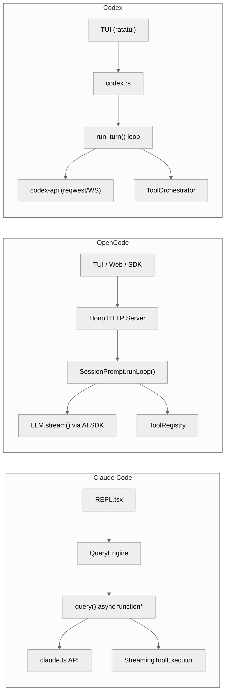

# 2. 核心循环 (Agent Loop)

这是三个系统最根本的区别之一——核心循环的实现方式决定了整体架构风格。

## 2.1 架构对比图



## 2.2 实现对比

| 方面 | Claude Code | OpenCode | Codex |
|------|-------------|----------|-------|
| **入口函数** | `query()` in `src/query.ts` (1,732 行) | `SessionPrompt.runLoop()` in `session/prompt.ts` (1,859 行) | `run_turn()` in `core/src/codex.rs` (8,211 行) |
| **循环机制** | `async function*` + `while(true)` + `yield` | `while(true)` + Effect.gen + `break`/`continue` | `loop {}` + tokio async |
| **状态管理** | 可变 `State` 对象 (10+ 字段) | 每次迭代从 SQLite 重新加载 | `Arc<Session>` + `TurnContext` 不可变快照 |
| **流式处理** | 自研 SSE 解析 (`claude.ts`) | Vercel AI SDK `streamText()` | WebSocket + HTTPS 流式 (自研 `codex-api`) |
| **工具执行** | `StreamingToolExecutor` (流式并行) | AI SDK 内置工具执行 | `ToolOrchestrator` (审批→沙箱→执行→升级重试) |
| **退出条件** | `stop_reason !== "tool_use"` + 7 种其他原因 | `lastAssistant.finish` 且无 tool_calls | `Ok(output)` 或不可重试错误 |
| **错误重试** | 模型降级 + 上下文反应式压缩 + 输出 token 升级 | `SessionRetry` 模块 + doom loop 检测 | 重试计数器 + WebSocket→HTTPS 传输降级 |

## 2.3 Claude Code: `query()` 详解

```typescript
// src/query.ts - 简化的核心循环
async function* queryLoop(params: QueryParams): AsyncGenerator<Message> {
  const state: State = { /* 10+ 字段 */ }

  while (true) {
    // 1. 上下文压缩检查
    await autoCompact(state.messages)

    // 2. 组装请求
    const request = buildRequest(state)

    // 3. 调用 API (流式)
    const stream = await claude.createStreamingResponse(request)

    // 4. 处理流式事件 + StreamingToolExecutor 并行执行工具
    for await (const event of stream) {
      if (event.type === 'content_block_start' && event.content_block.type === 'tool_use') {
        // 工具调用 (可在流式中并行执行)
      }
      yield event  // 向上层产出事件
    }

    // 5. 执行剩余工具 (分区: 只读并行, 写入串行)
    const results = await executeTools(toolCalls)
    state.messages.push(...results)

    // 6. 检查退出
    if (!needsFollowUp) break
  }
}
```

**关键特征**:
- `AsyncGenerator` (`async function*`)，调用者通过 `for await` 懒拉取事件
- `StreamingToolExecutor` (530 行) 在模型流式输出时就开始并行执行工具
- 工具分区: `isConcurrencySafe()` 为 true 的工具并行 (最多 10 个)，否则串行
- 多种退出原因: completed / aborted / prompt_too_long / image_error / model_error / stop_hook_prevented
- 错误恢复: 模型降级 (`FallbackTriggeredError`)、反应式上下文压缩 (413)、输出 token 升级 (8K→64K)

## 2.4 OpenCode: `SessionPrompt.runLoop()` 详解

```typescript
// session/prompt.ts - 简化的核心循环
const runLoop = Effect.fn("SessionPrompt.run")(function* (sessionID) {
  let step = 0

  while (true) {
    // 1. 从 DB 加载消息（每次重新加载，过滤已压缩）
    let msgs = yield* MessageV2.filterCompactedEffect(sessionID)

    // 2. 查找关键锚点
    const { lastUser, lastAssistant, lastFinished, tasks } = scanMessages(msgs)

    // 3. 退出条件检查
    if (lastAssistant?.finish && !hasToolCalls) break

    // 4. 处理特殊任务 (subtask, compaction)
    if (task?.type === "subtask") { yield* handleSubtask(task); continue }
    if (task?.type === "compaction") { yield* compaction.process(...); continue }

    // 5. 溢出检测 → 自动压缩
    if (isOverflow) { yield* compaction.create({ auto: true }); continue }

    // 6. 解析工具、组装系统提示
    const tools = yield* resolveTools({ agent, model, ... })

    // 7. 调用 LLM (通过 SessionProcessor)
    const result = yield* handle.process({ system, messages, tools, model })

    // 8. 处理结果
    if (result === "stop") break
    if (result === "compact") { yield* compaction.create(...) }
  }
})
```

**关键特征**:
- Effect.gen (`function*`)，不是 AsyncGenerator，而是 Effect 的协程
- 每次循环从 SQLite 重新加载消息（崩溃安全，状态始终一致）
- 工具执行由 AI SDK 内部管理，通过 `SessionProcessor.handleEvent()` 处理流式事件
- Doom loop 检测: 连续 3 次相同工具调用会触发 `doom_loop` 权限检查

## 2.5 Codex: `run_turn()` 详解

```rust
// core/src/codex.rs - 简化的核心循环
async fn run_turn(&self, turn_ctx: &TurnContext) -> Result<TurnOutput> {
    let mut retries = 0;

    loop {
        // 1. 克隆会话历史，组装 prompt
        let history = sess.clone_history().await.for_prompt();

        // 2. 发起流式请求 (WebSocket 预热, HTTPS 降级)
        match self.try_run_sampling_request(&turn_ctx, history).await {
            Ok(output) => return Ok(output),

            Err(e) if e.is_retryable() => {
                retries += 1;
                if retries >= max_retries {
                    // 尝试 WebSocket → HTTPS 传输降级
                    if try_transport_fallback() { retries = 0; continue }
                    return Err(e);
                }
                continue;
            }

            Err(e) => return Err(e),  // ContextWindowExceeded 等
        }
    }
}
```

**关键特征**:
- Rust `loop {}` + tokio async
- `TurnContext` 是不可变的 per-turn 配置快照
- WebSocket 连接预热 (`response.create` with `generate=false`) 减少延迟
- 传输层降级: WebSocket 失败自动回退到 HTTPS (重置重试计数器)
- 最大单文件: 8,211 行 `codex.rs` — 三者中最大

## 2.6 核心差异分析

| 差异点 | Claude Code | OpenCode | Codex | 评价 |
|--------|-------------|----------|-------|------|
| **数据新鲜度** | 内存状态，可能与持久化不同步 | 每次从 DB 加载，始终一致 | Arc 共享状态 + 异步通道 | OC 最安全，CX 最高效 |
| **并行工具执行** | 流式并行 + 分区并行 (最精细) | AI SDK 内置 (最简单) | Orchestrator + 沙箱 (最安全) | CC 控制最细粒度 |
| **yield/流式** | AsyncGenerator yield 给 UI | Bus 事件 + WebSocket SSE | async channels (mpsc) | OC 解耦最彻底 |
| **错误恢复** | 多层: 模型降级/上下文压缩/token升级 | Retry 模块 + doom loop | 重试 + 传输降级 | CC 最丰富 |
| **代码量** | query.ts + claude.ts ≈ 5,187 行 | prompt.ts + processor.ts ≈ 2,476 行 | codex.rs 单文件 8,211 行 | OC 最紧凑 (AI SDK 吸收了复杂性) |
