# 3. 工具系统

## 3.1 工具接口对比

| 方面 | Claude Code | OpenCode | Codex |
|------|-------------|----------|-------|
| **接口文件** | `src/Tool.ts` (792 行, ~40 方法/属性) | `tool/tool.ts` (141 行, 5 核心字段) | `tools/src/tool_definition.rs` (5 字段) + `ToolHandler` trait |
| **定义方式** | `buildTool(def)` 工厂函数 + `TOOL_DEFAULTS` | `Tool.define(id, Effect.succeed({...}))` | 工厂函数 (`create_shell_tool()` 等) |
| **参数验证** | Zod schema + `validateInput()` 二阶段 | Zod schema (在 `wrap()` 中间件中) | JSON Schema (serde 验证) |
| **执行入口** | `call(input, context, checkPermissions, parentMsg, progress)` | `execute(args, ctx): Effect<ExecuteResult>` | `ToolHandler::execute()` (trait 实现) |
| **权限集成** | 每个工具实现 `checkPermissions()` | 通过 `ctx.ask()` 委托给 Permission Service | Guardian 审批系统 |
| **并发标记** | `isConcurrencySafe()` + `isReadOnly()` 布尔方法 | 无显式标记 (AI SDK 管理) | `is_mutating()` 方法 (ToolHandler trait) |
| **结果截断** | `maxResultSizeChars`，超限持久化到磁盘 | `Truncate.Service` (2000 行/50KB)，超限持久化 | 未详细调查 |
| **MCP 工具** | `isMcp` 标志，`mcpInfo` 元数据 | 通过 AI SDK Tool 对象集成 | `ToolKind::Mcp` 专用处理 |

## 3.2 工具清单

| 类别 | Claude Code (~40+) | OpenCode (~17) | Codex (~25+) |
|------|-------------------|----------------|--------------|
| **文件** | FileRead, FileEdit, FileWrite, NotebookEdit | read, edit, write, multiedit, apply_patch | apply_patch_freeform, apply_patch_json |
| **Shell** | BashTool, PowerShellTool | bash | shell, shell_command, exec_command, write_stdin |
| **搜索** | GlobTool, GrepTool, ToolSearchTool, LSPTool | glob, grep, codesearch, lsp | list_dir, tool_search, tool_suggest |
| **Web** | WebFetchTool, WebSearchTool, WebBrowserTool | webfetch, websearch | web_search |
| **Agent/Task** | AgentTool, TaskCreate/Get/Update/List/Stop/Output, SendMessage, TeamCreate/Delete | task (单一工具) | spawn_agent, close_agent, wait_agent, list_agents, send_message, resume_agent, followup_task, report_agent_job_result, spawn_agents_on_csv |
| **交互** | AskUserQuestionTool | question | request_user_input |
| **规划** | EnterPlanMode, ExitPlanModeV2, VerifyPlanExecution | plan_exit | update_plan |
| **Skill** | SkillTool, DiscoverSkillsTool | skill | — (通过 skill 注入系统) |
| **其他** | BriefTool, CronCreate/Delete/List, MonitorTool, SleepTool, SnipTool, WorkflowTool, ConfigTool, REPLTool, Worktree 工具 | todowrite | js_repl, view_image, image_generation, code_mode, wait |
| **MCP** | ListMcpResources, ReadMcpResource | (通过 AI SDK) | list_mcp_resources, read_mcp_resource |

## 3.3 工具注册管线

```mermaid
%%{init: {'theme': 'neutral'}}%%
graph TB
    subgraph CC["Claude Code 三层管线"]
        CC1["getAllBaseTools()<br/>40+ 工具 (feature flag 条件加载)"] --> CC2["getTools()<br/>模式过滤 + 权限过滤 + 启用检查"]
        CC2 --> CC3["assembleToolPool()<br/>+ MCP 工具<br/>分区排序 + 去重 (内置优先)"]
    end

    subgraph OC["OpenCode 注册表"]
        OC1["ToolRegistry.layer<br/>初始化所有内置工具"] --> OC2["ToolRegistry.tools()<br/>按 Agent + Model 过滤"]
        OC2 --> OC3["resolveTools()<br/>+ MCP 工具<br/>+ ProviderTransform"]
    end

    subgraph CX["Codex ToolRouter"]
        CX1["ToolsConfig<br/>工厂函数生成定义"] --> CX2["ToolRouter<br/>+ MCP 工具 + 可发现工具"]
        CX2 --> CX3["ToolRegistry<br/>name → ToolHandler 映射"]
    end
```



**关键差异**:
- Claude Code: `assembleToolPool()` 对内置和 MCP 工具**分区排序再拼接**，保证 prompt cache 不失效；支持 `shouldDefer` 延迟加载
- OpenCode: `resolveTools()` 动态应用 `ProviderTransform.schema()` 适配不同 LLM 的 JSON Schema 差异；按模型能力换工具 (如 GPT 用 `ApplyPatchTool`)
- Codex: `ToolRouter` 合并静态配置 + MCP + 动态工具；`ToolHandler` trait 提供统一执行接口

## 3.4 工具执行流程

### Claude Code
```
runToolUse() → checkPermissionsAndCallTool()
  ├── Zod inputSchema.safeParse()
  ├── tool.validateInput()
  ├── runPreToolUseHooks() (Shell 命令, 可阻止)
  ├── canUseTool() (规则匹配 → AI 分类器 → 用户提示)
  ├── tool.call() 执行
  ├── runPostToolUseHooks()
  └── tool.mapToolResultToToolResultBlockParam()
```

### OpenCode
```
AI SDK streamText() 触发 tool-call
  ├── SessionProcessor.handleEvent()
  ├── wrap() 中间件: Zod 验证 + 截断
  ├── tool.execute(args, ctx)
  │   └── ctx.ask() (权限检查, Deferred 异步)
  └── 结果写入 DB
```

### Codex
```
ToolCallRuntime::handle_tool_call()
  ├── ToolRegistry 分发到 ToolHandler
  ├── run_pre_tool_use_hooks()
  ├── Guardian 审批 (Shell/Patch/Network/MCP)
  ├── SandboxManager 选择沙箱策略
  ├── Handler 执行 (可重试 + 沙箱升级)
  └── run_post_tool_use_hooks()
```

## 3.5 并行执行策略

| 方面 | Claude Code | OpenCode | Codex |
|------|-------------|----------|-------|
| **策略** | 分区: 只读并行 (max 10) + 写入串行 | AI SDK 内置 (逐步执行) | tokio tasks + RwLock |
| **标记** | `isConcurrencySafe()` 每工具声明 | 无 | `is_mutating()` 每 handler 声明 |
| **流式并行** | `StreamingToolExecutor` 在流式输出中就开始执行 | 流式中触发执行 | 非流式并行 |
| **文件** | `toolOrchestration.ts` (188 行) + `StreamingToolExecutor.ts` (530 行) | (AI SDK 内部) | `parallel.rs` (379 行) |

## 3.6 评价

- **Claude Code** 工具最多 (40+)，接口最复杂 (~40 方法)，并行策略最精细 (分区 + 流式并行)
- **OpenCode** 工具最精简 (17 个)，依赖 AI SDK 吸收复杂性，`wrap()` 中间件模式优雅
- **Codex** Agent 相关工具最丰富 (9 个 agent 工具 + CSV 批量)，通过 trait 系统实现类型安全，沙箱集成最深
