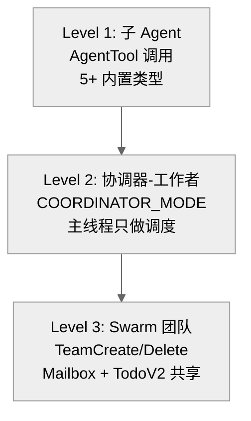

# 5. 多 Agent 架构

## 5.1 模式对比

| 方面 | Claude Code | OpenCode | Codex |
|------|-------------|----------|-------|
| **子 Agent 入口** | `AgentTool` (独立工具) | `TaskTool` (task 工具, `subagent_type` 参数) | `spawn_agent` / `spawn_agents_on_csv` (批量) |
| **Agent 类型** | 5+ 内置 + 用户自定义 + fork | 4 可见 + 3 隐藏 + 用户自定义 | 可配置角色 + 昵称系统 |
| **最大并发** | 无硬限制 | 无硬限制 | 6 (默认, 可配置) |
| **最大嵌套深度** | Fork 限制 1 层 | 通过权限规则隐式限制 | 1 (默认, 可配置) |
| **隔离方式** | 进程内 async generators + 独立 AbortController | 进程内 Effect session (独立 DB 记录) | 独立线程 (tokio task) |
| **协调器模式** | 专用 COORDINATOR_MODE | 无 | 无 (通过 mailbox 间接协调) |
| **通信机制** | XML `<task-notification>` 注入 + SendMessage | 同步返回 (阻塞等待) | Mailbox 系统 + 通知消息 |
| **进度可见** | TaskOutputTool, TaskStopTool | 无实时进度 | 异步通道推送 |

## 5.2 Claude Code: 三层递进模型



### 内置 Agent 类型 (`src/tools/AgentTool/built-in/`)
- `Explore` — 只读代码搜索 (省略 `claudeMd` 和 `gitStatus` 节省 token)
- `Plan` — 规划 Agent
- `generalPurposeAgent` — 通用工作者
- `verificationAgent` — 验证
- `claudeCodeGuideAgent` — 指南/帮助

### Fork Agent (`forkSubagent.ts`)
- 子 Agent 继承父级完整对话上下文和系统提示 (字节一致, 用于 prompt cache 共享)
- Fork 子级被明确告知 "Do NOT spawn sub-agents" — **最大嵌套深度 1**

### 协调器模式 (`coordinatorMode.ts`)
- 通过 `CLAUDE_CODE_COORDINATOR_MODE` 环境变量启用
- 主线程严格限制只能使用: `AgentTool`, `SendMessage`, `TaskStop`
- 工作者通过 `<task-notification>` XML 上报结果 (含 `<result>`, `<usage>`, `<summary>`)

### 子 Agent 隔离
每个子 Agent 获得:
- 独立 `AbortController` (异步 agent 不与父级关联)
- 克隆的 `readFileState` 缓存
- 独立 MCP 服务器连接 (可在父级基础上增加)
- 独立系统提示 (只读 agent 省略 claudeMd/gitStatus)
- 子 Agent 默认禁用 thinking

### 清理 (`runAgent.ts` 816-858行)
退出时清理: MCP 服务器、session hooks、prompt cache 追踪、文件状态缓存、Perfetto 注册、转录子目录、todos、bash tasks、monitor tasks — **非常全面**

## 5.3 OpenCode: 简洁 Effect 模型

### Agent 类型 (`agent/agent.ts`)
- `build` — 默认主 Agent
- `plan` — 规划模式 (禁止编辑工具)
- `general` — 子 Agent (多步并行任务)
- `explore` — 只读代码探索
- `compaction` — 隐藏 (压缩摘要)
- `title` — 隐藏 (标题生成)
- `summary` — 隐藏 (摘要生成)

### 执行流程
```
TaskTool.execute()
  ├── 根据 subagent_type 查找 Agent 定义
  ├── 创建新 Session (parentID 关联父级)
  ├── 运行子 Session 的 LLM prompt 循环
  ├── 阻塞等待子 Session 完成
  └── 返回最后一条文本作为 <task_result> XML
```

- 子 Session 是独立 DB 记录，有自己的消息历史
- 权限规则传播并过滤 (如子 Agent 可被禁止 `todowrite`, `task`)
- 支持通过 `task_id` 恢复之前的子 Agent
- Abort 信号通过 `ctx.abort` 事件传播

### 嵌套控制
- 没有 `task` 权限的 Agent 无法生成子 Agent
- `explore` Agent 禁止所有非只读工具 → 隐式禁止嵌套

## 5.4 Codex: 线程化 Agent + 注册表

### Agent 注册表 (`core/src/agent/registry.rs`)
- `AgentRegistry` 通过 `Mutex<ActiveAgents>` 追踪所有子 Agent
- 每个用户 Session 独立追踪

### 关键限制 (`core/src/config/mod.rs`)
```rust
pub(crate) const DEFAULT_AGENT_MAX_THREADS: Option<usize> = Some(6);   // 最多 6 个并发子 Agent
pub(crate) const DEFAULT_AGENT_MAX_DEPTH: i32 = 1;                     // 最多嵌套 1 层
```

### 深度控制 (`registry.rs`)
```rust
pub(crate) fn exceeds_thread_spawn_depth_limit(depth: i32, max_depth: i32) -> bool {
    depth > max_depth
}
```

### Fork 模式 (`control.rs`)
```rust
pub(crate) enum SpawnAgentForkMode {
    FullHistory,           // 完整历史
    LastNTurns(usize),     // 最近 N 轮
}
```

### 通信: Mailbox 系统 (`mailbox.rs`)
- Agent 间通过 mailbox 通信
- 结果通过 `format_subagent_notification_message` 格式化后转发给父线程
- 角色系统 (`role.rs`): 可配置角色 + 昵称 (从 `agent_names.txt` 分配)

### 批量生成
- `spawn_agents_on_csv`: 根据 CSV 文件批量生成 Agent — **三者中独有**

## 5.5 评价

| 维度 | Claude Code | OpenCode | Codex |
|------|-------------|----------|-------|
| **复杂度** | 最高 (3层递进 + 协调器 + Swarm) | 最低 (单层 TaskTool) | 中等 (注册表 + mailbox) |
| **批量能力** | TeamCreate 团队 | 无 | CSV 批量生成 |
| **隔离强度** | 中 (同进程, 独立 AbortController) | 低 (同进程, DB 隔离) | 高 (独立线程, tokio task) |
| **Prompt Cache** | Fork Agent 字节一致共享 | 无 | Fork 模式 (FullHistory/LastNTurns) |
| **通信方式** | XML 注入 + 工具 (SendMessage) | 同步返回 | Mailbox + 通知 |
| **适合场景** | 大规模任务编排 | 简单子任务委托 | 并行探索 (最多6线程) |
