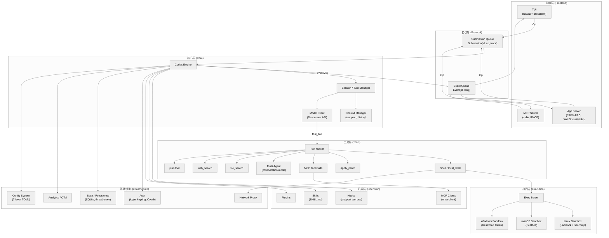
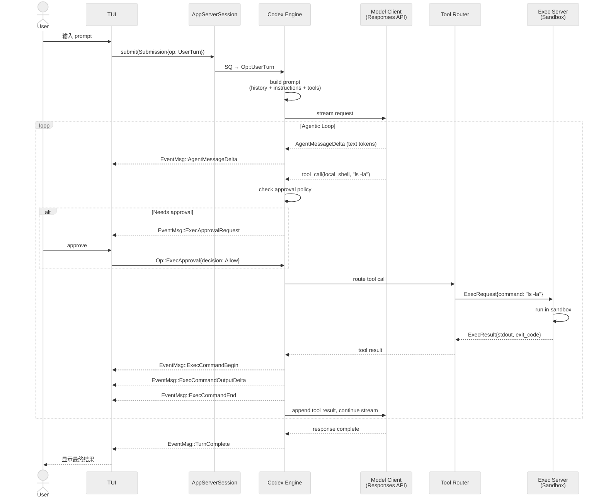

# 第一章 全局概览

## 一句话概括

Codex 是 OpenAI 的终端编码代理（CLI coding agent），用 Rust 编写，通过 **SQ/EQ（Submission Queue / Event Queue）** 异步协议在 **TUI / App Server / MCP Server** 三种前端与核心引擎之间通信，调用模型完成代码编写、命令执行、文件修改等编程任务。

---

## 1.1 项目概况

| 指标 | 数值 |
|------|------|
| 语言 | Rust (codex-rs)，另有 TypeScript SDK (codex-cli) |
| Rust 源文件数 | ~1458 个 `.rs` 文件 |
| Rust 代码行数 | ~230K 行（不含生成代码和锁文件） |
| Workspace crate 数 | ~94 个 |
| 构建系统 | Cargo workspace + Bazel (MODULE.bazel) |
| 许可证 | Apache 2.0 |

Codex 的 Rust 代码全部位于 `codex-rs/` 目录下，以一个大型 Cargo workspace 组织。TypeScript CLI (`codex-cli/`) 是面向 npm 的分发入口，会调用 Rust 编译产物。

---

## 1.2 分层架构图



---

## 1.3 核心循环

Codex 的运行本质上是一个 **agentic loop（代理循环）**：

1. **用户提交 Op** — 前端（TUI/App Server/MCP Server）将用户意图封装为 `Op` 枚举变体，通过 Submission Queue 提交给 Codex 引擎。
2. **构建 Prompt** — Codex 将对话历史、系统指令、工具定义、上下文注入（skills、apps、plugins 等）组装为 Responses API 请求。
3. **流式调用模型** — 通过 `ModelClient` 向 OpenAI Responses API 发起流式请求，逐 token 接收响应。
4. **处理工具调用** — 模型返回的 `function_call` / `tool_use` 被路由到对应的工具 handler（shell、apply_patch、MCP 等）。
5. **执行命令** — 需要执行 shell 命令时，通过 Exec Server 在沙箱中运行，结果返回给模型。
6. **循环直到完成** — 模型可能发出多次工具调用，每次结果回传后继续生成，直到模型认为任务完成。
7. **发射 EventMsg** — 整个过程中产生的事件（文本 delta、命令输出、审批请求、完成信号等）通过 Event Queue 回传给前端。

```
User → Op → Codex → [build prompt → stream model → tool call → execute → result → model ...] → TurnComplete → User
```

---

## 1.4 关键数据流（序列图）



---

## 1.5 三种前端

### 1.5.1 TUI（终端用户界面）

- **Crate**: `codex-tui`
- **技术栈**: ratatui + crossterm
- **用途**: 交互式终端体验，是最常用的前端
- **特点**: 支持文件搜索、diff 展示、审批弹窗、实时语音对话、模型选择器等丰富 UI
- **入口**: `codex` 命令（无子命令时默认启动 TUI）
- **通信**: TUI 内嵌一个 `AppServerSession`，通过它与 Codex 引擎交互

### 1.5.2 App Server（应用服务器）

- **Crate**: `codex-app-server`
- **技术栈**: JSON-RPC over WebSocket / stdio
- **用途**: 为 IDE 扩展（如 VS Code）提供后端服务
- **特点**: 多线程会话管理，支持远程控制，配置热重载
- **入口**: `codex app-server` 子命令
- **通信**: JSON-RPC 双向消息，支持多个并发连接

### 1.5.3 MCP Server

- **Crate**: `codex-mcp-server`
- **技术栈**: RMCP (Rust MCP SDK) over stdio
- **用途**: 将 Codex 暴露为 MCP 工具，供其他 AI 代理调用
- **特点**: 支持 `codex` 和 `codex_reply` 两个工具，审批通过 MCP elicitation 机制实现
- **入口**: `codex mcp-server` 子命令
- **通信**: JSON-RPC over stdio（MCP 标准协议）

---

## 1.6 模块总览表

下表列出 Codex Rust workspace 中的主要 crate，按功能分组：

### 前端与入口

| Crate | 说明 |
|-------|------|
| `cli` | CLI 入口，MultitoolCli，20+ 子命令分发 |
| `tui` | 终端 UI，基于 ratatui，全功能交互界面 |
| `app-server` | JSON-RPC 应用服务器，IDE 集成后端 |
| `app-server-protocol` | App Server 的 JSON-RPC 消息类型定义 |
| `app-server-client` | App Server 客户端库 |
| `mcp-server` | MCP 服务器，将 Codex 暴露为 MCP 工具 |
| `arg0` | argv[0] 分发逻辑，支持多二进制名称 |

### 协议与模型

| Crate | 说明 |
|-------|------|
| `protocol` | 核心协议定义：Op, EventMsg, Submission, Event |
| `models-manager` | 模型目录管理，支持 OpenAI / Ollama / LM Studio |
| `model-provider-info` | 模型提供商元数据 |
| `backend-client` | 后端 HTTP 客户端（Responses API） |
| `responses-api-proxy` | Responses API 本地代理 |
| `codex-backend-openapi-models` | OpenAPI 生成的后端模型类型 |

### 核心引擎

| Crate | 说明 |
|-------|------|
| `core` | Codex 引擎核心：会话管理、turn 处理、prompt 构建、工具调度 |
| `tools` | 工具 handler 注册与路由 |
| `core-skills` | 内置 skill 加载与渲染 |
| `shell-command` | Shell 命令解析与构建 |
| `shell-escalation` | 权限升级处理 |
| `apply-patch` | Git diff/patch 应用工具 |
| `file-search` | 代码库文件搜索 |
| `code-mode` | 代码模式提示词模板 |

### 执行与沙箱

| Crate | 说明 |
|-------|------|
| `exec` | 非交互式执行入口 |
| `exec-server` | 执行服务器，管理沙箱环境 |
| `execpolicy` | 命令执行策略引擎（allow/deny/prompt 规则） |
| `execpolicy-legacy` | 旧版执行策略（兼容） |
| `linux-sandbox` | Linux 沙箱（Landlock + seccomp-bpf） |
| `sandboxing` | 跨平台沙箱抽象 |
| `windows-sandbox-rs` | Windows 沙箱（Restricted Token） |
| `process-hardening` | 进程加固 |

### 扩展机制

| Crate | 说明 |
|-------|------|
| `codex-mcp` | MCP 客户端连接管理器 |
| `rmcp-client` | RMCP 客户端封装 |
| `hooks` | Hook 系统（pre/post tool use, session start 等） |
| `skills` | Skill 发现与加载 |
| `plugin` | 插件系统 |
| `instructions` | 指令文件加载（AGENTS.md 等） |
| `collaboration-mode-templates` | 协作模式模板 |

### 配置与状态

| Crate | 说明 |
|-------|------|
| `config` | TOML 配置类型定义、合并逻辑、profile 支持 |
| `state` | 持久化状态（SQLite） |
| `thread-store` | 对话线程存储 |
| `rollout` | Rollout 配置与状态管理 |
| `features` | Feature flag 系统 |

### 认证与安全

| Crate | 说明 |
|-------|------|
| `login` | 认证流程（设备码、API key、ChatGPT OAuth） |
| `keyring-store` | 系统 keyring 凭据存储 |
| `secrets` | 敏感信息管理 |
| `network-proxy` | 网络代理与审计 |

### 基础设施

| Crate | 说明 |
|-------|------|
| `analytics` | 使用分析事件 |
| `otel` | OpenTelemetry 集成 |
| `feedback` | 用户反馈收集 |
| `git-utils` | Git 操作工具 |
| `terminal-detection` | 终端类型检测 |
| `install-context` | 安装上下文信息 |

### 实验性功能

| Crate | 说明 |
|-------|------|
| `realtime-webrtc` | 实时语音对话（WebRTC） |
| `cloud-tasks` | Codex Cloud 任务管理 |
| `cloud-tasks-client` | Cloud 任务客户端 |
| `chatgpt` | ChatGPT Web 集成 |
| `v8-poc` | V8 引擎 PoC（实验性沙箱） |
| `codex-api` | Codex API 定义 |

### 工具库 (utils/)

| Crate | 说明 |
|-------|------|
| `absolute-path` | 绝对路径类型 |
| `cache` | 缓存工具 |
| `image` | 图像处理 |
| `pty` | 伪终端支持 |
| `string` | 字符串工具 |
| `cli` | CLI 通用工具 |
| `elapsed` | 计时工具 |
| `sandbox-summary` | 沙箱状态摘要 |
| `sleep-inhibitor` | 休眠抑制 |
| `approval-presets` | 审批预设 |
| `output-truncation` | 输出截断策略 |
| `json-to-toml` | JSON/TOML 转换 |
| `home-dir` | Home 目录解析 |
| `readiness` | 就绪状态探针 |
| `rustls-provider` | TLS 提供商 |
| `oss` | 开源版工具 |

---

## 1.7 关键设计决策

### 1.7.1 SQ/EQ 异步协议

Codex 的核心通信机制借鉴了 io_uring 的 SQ/EQ 模式。前端提交 `Submission{id, op, trace}` 到 Submission Queue，引擎处理后通过 Event Queue 发射 `Event{id, msg}` 系列事件。这种设计带来几个优势：

- **前端解耦** — TUI、App Server、MCP Server 共用同一协议，只需实现 Op 提交和 EventMsg 处理
- **异步非阻塞** — 前端提交后不阻塞等待，通过事件流接收进度
- **可序列化** — 所有 Op 和 EventMsg 都是 `Serialize + Deserialize`，天然支持跨进程通信
- **可追踪** — Submission 携带 W3C trace context，支持分布式追踪

### 1.7.2 多层沙箱

命令执行安全是 Codex 的核心关注点：

- **策略层**: `SandboxPolicy` 决定权限边界（只读 / workspace 写 / 完全访问 / 外部沙箱）
- **审批层**: `AskForApproval` 决定何时请求用户确认
- **ExecPolicy**: 基于规则的命令白名单/黑名单/提示系统
- **OS 沙箱**: Linux (Landlock + seccomp)、macOS (Seatbelt)、Windows (Restricted Token)
- **网络代理**: 通过 network-proxy 审计和控制网络访问

### 1.7.3 可扩展性

Codex 通过多种机制实现可扩展：

- **MCP 客户端** — 连接外部 MCP 服务器，动态发现和调用工具
- **Hooks** — 在工具执行前后注入自定义逻辑
- **Skills** — 通过 SKILL.md 文件定义领域专用技能
- **Plugins** — 通过 marketplace 安装和管理插件
- **Apps** — 集成外部应用（connectors）

### 1.7.4 Context Management

大模型的上下文窗口是有限资源，Codex 通过以下机制管理：

- **Auto-compact** — 当 token 使用量达到阈值时自动压缩对话历史
- **Remote compact** — 使用远程模型执行压缩任务
- **Thread store** — 持久化对话线程，支持 resume/fork
- **Output truncation** — 对过长的命令输出进行截断

---

## 1.8 本章关键文件表

| 文件路径 | 说明 |
|----------|------|
| `codex-rs/cli/src/main.rs` | CLI 入口，MultitoolCli 定义，子命令分发 |
| `codex-rs/core/src/codex.rs` | Codex 引擎核心，agentic loop 实现 |
| `codex-rs/protocol/src/protocol.rs` | 协议定义：Submission, Op, Event, EventMsg |
| `codex-rs/tui/src/app.rs` | TUI 应用主结构，事件处理 |
| `codex-rs/app-server/src/lib.rs` | App Server 启动与连接管理 |
| `codex-rs/mcp-server/src/lib.rs` | MCP Server stdio 通信实现 |
| `codex-rs/core/src/config/mod.rs` | 配置类型定义（Config 结构体） |
| `codex-rs/exec-server/` | 执行服务器与沙箱管理 |
| `codex-rs/tools/` | 工具 handler 注册 |

---

## 1.9 代码组织哲学

Codex 的代码组织体现了几个原则：

1. **协议优先** — `protocol` crate 是最底层的依赖，定义了所有前端和核心之间的契约。改动 protocol 会影响整个系统。

2. **关注点分离** — 配置（config）、执行策略（execpolicy）、沙箱（sandboxing）、认证（login）各自独立为 crate，通过 trait 和类型组合。

3. **平台抽象** — 通过 `cfg(target_os)` 和独立 crate（linux-sandbox、windows-sandbox-rs）处理平台差异，核心逻辑保持平台无关。

4. **渐进增强** — 实验性功能（realtime-webrtc、cloud-tasks、v8-poc）独立为 crate，不影响稳定功能路径。

5. **测试友好** — 大量 `*-test-client`、`*-mock-client` crate 提供测试支持，`app-server-test-client` 和 `cloud-tasks-mock-client` 等。

---

## 1.10 运行时架构

当用户执行 `codex "fix the bug"` 时，运行时组件的启动顺序大致如下：

1. **CLI 解析** — `MultitoolCli` 解析命令行参数，确定运行模式（TUI / exec / app-server 等）
2. **配置加载** — 7 层配置按优先级合并（admin → system → user → cwd → tree → repo → runtime）
3. **认证** — `AuthManager` 检查并获取有效的 API token
4. **引擎初始化** — 创建 `Codex` 实例，初始化 MCP 客户端、ExecPolicy、Hooks 等
5. **前端启动** — TUI 进入事件循环 / App Server 开始监听连接
6. **会话运行** — 用户交互通过 SQ/EQ 协议驱动 agentic loop
7. **优雅关闭** — `Op::Shutdown` 触发清理流程

整个运行时是异步的，基于 Tokio。主要的异步任务包括：

- **模型流处理** — 逐 token 接收和分发
- **命令执行** — 沙箱中的异步进程管理
- **MCP 通信** — 与外部 MCP 服务器的异步交互
- **网络代理** — 审计流量的异步转发
- **Hook 执行** — 异步运行 hook 命令和 prompt

---

## 1.11 与生态系统的关系

Codex 在 OpenAI 的产品生态中扮演以下角色：

- **CLI 原生** — 面向开发者的终端工具，不依赖浏览器或 GUI
- **IDE 后端** — 通过 App Server 为 VS Code 等 IDE 提供代理能力
- **MCP 生态** — 既是 MCP 客户端（调用外部工具）也是 MCP 服务器（被其他代理调用）
- **Responses API 消费者** — 使用 OpenAI 最新的 Responses API（非传统 Chat Completions）
- **Cloud Tasks** — 实验性的云端任务执行能力

---

*下一章将深入 CLI 入口与配置系统的实现细节。*
