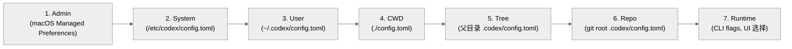
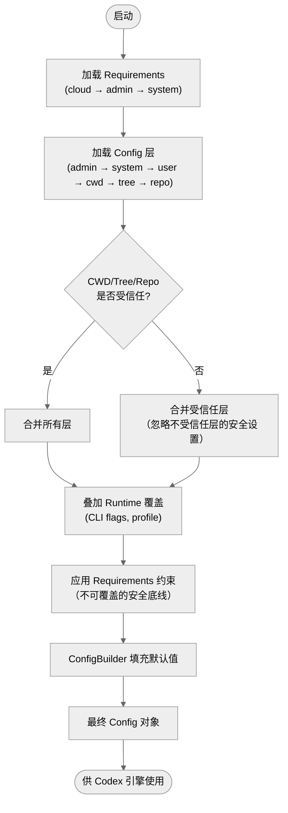

# 第二章 CLI 入口与配置系统

## 2.1 概述

Codex 的 CLI 入口基于 `clap` 框架，采用 **MultitoolCli** 模式：单一二进制文件通过子命令和 `argv[0]` 分发，支持 20+ 子命令覆盖交互式 TUI、非交互式执行、MCP 服务、认证管理、调试工具等全部功能。配置系统采用 TOML 格式，通过 7 层配置源按优先级合并，支持 profile、requirements 约束、运行时覆盖等高级特性。

---

## 2.2 CLI 入口：MultitoolCli

### 2.2.1 入口点

CLI 的入口在 `codex-rs/cli/src/main.rs`，核心结构体是 `MultitoolCli`：

```rust
#[derive(Debug, Parser)]
#[clap(
    author,
    version,
    subcommand_negates_reqs = true,
    bin_name = "codex",
)]
struct MultitoolCli {
    pub config_overrides: CliConfigOverrides,  // --model, --config 等全局选项
    pub feature_toggles: FeatureToggles,       // feature flag 开关
    remote: InteractiveRemoteOptions,          // 远程连接选项
    interactive: TuiCli,                       // TUI 参数（prompt 等）
    subcommand: Option<Subcommand>,            // 子命令
}
```

**关键设计**: 当没有子命令时，`MultitoolCli` 的顶层参数被转发给 TUI，实现 `codex "fix the bug"` 这样的便捷调用。`subcommand_negates_reqs = true` 确保子命令模式下不要求 TUI 参数。

### 2.2.2 argv[0] 分发

Codex 支持通过 `argv[0]`（可执行文件名）分发到不同功能。`arg0` crate 实现了这一逻辑：

```rust
arg0_dispatch_or_else(Arg0DispatchPaths { ... }, || {
    // 正常的 clap 解析路径
    MultitoolCli::parse()
})
```

这使得同一个二进制文件可以被符号链接为不同名称（如 `codex-exec-server`），从而直接执行对应功能，无需子命令。

### 2.2.3 全部子命令

| 子命令 | 别名 | 说明 | 可见性 |
|--------|------|------|--------|
| `exec` | `e` | 非交互式执行：接收 prompt，运行后输出结果退出 | 公开 |
| `review` | - | 非交互式代码审查 | 公开 |
| `login` | - | 认证管理（设备码/API key/ChatGPT OAuth） | 公开 |
| `logout` | - | 删除已存储的认证凭据 | 公开 |
| `mcp` | - | MCP 服务器管理（add/remove/list） | 公开 |
| `marketplace` | - | 插件市场管理 | 公开 |
| `mcp-server` | - | 以 MCP 服务器模式启动（stdio） | 公开 |
| `app-server` | - | 启动 App Server（JSON-RPC） | 公开（标注 experimental） |
| `app` | - | 启动桌面应用（仅 macOS） | 公开（仅 macOS） |
| `completion` | - | 生成 shell 自动补全脚本 | 公开 |
| `sandbox` | - | 在 Codex 沙箱内运行命令 | 公开 |
| `debug` | - | 调试工具（含子命令） | 公开 |
| `debug app-server` | - | App Server 调试 | 公开 |
| `debug prompt-input` | - | 渲染模型可见的 prompt 为 JSON | 公开 |
| `debug clear-memories` | - | 清除本地记忆状态 | 隐藏 |
| `apply` | `a` | 应用 Codex 产生的最新 diff 到本地工作树 | 公开 |
| `resume` | - | 恢复之前的交互式会话 | 公开 |
| `fork` | - | 从之前的会话创建分支 | 公开 |
| `cloud` | `cloud-tasks` | 浏览 Codex Cloud 任务，本地应用变更 | 公开（实验性） |
| `features` | - | 查看 feature flag 状态 | 公开 |
| `exec-server` | - | 启动独立的 exec-server 服务 | 公开（实验性） |
| `execpolicy` | - | ExecPolicy 工具 | 隐藏 |
| `responses-api-proxy` | - | 启动 Responses API 代理 | 隐藏 |
| `responses` | - | 发送原始 Responses API 请求 | 隐藏 |
| `stdio-to-uds` | - | stdio 到 Unix socket 中继 | 隐藏 |

### 2.2.4 TUI 启动流程

当没有子命令时（或显式运行 TUI），启动流程如下：

```
main()
  → arg0_dispatch_or_else()        // 检查 argv[0] 分发
  → MultitoolCli::parse()          // clap 解析参数
  → 无子命令分支
    → Config::load()               // 7 层配置加载
    → AuthManager::new()           // 初始化认证
    → codex_tui::run()             // 进入 TUI 事件循环
      → App::new()                 // 创建应用状态
      → AppServerSession::start()  // 启动与 Codex 引擎的会话
      → Terminal::draw()           // ratatui 渲染循环
```

### 2.2.5 非交互式 exec 模式

`codex exec` 子命令提供无 UI 的执行模式：

```
codex exec -p "fix all tests" --approval-policy=on-request
```

exec 模式下：
- 不启动 TUI，直接运行 agentic loop
- 支持 JSON 输出 (`--output-format json`)
- 可设置审批策略、沙箱策略、模型等
- 完成后以退出码反映结果
- 适用于 CI/CD 和脚本集成

---

## 2.3 配置系统

### 2.3.1 配置文件格式

Codex 使用 TOML 格式的配置文件，主文件名为 `config.toml`。示例：

```toml
model = "o4-mini"
approval_policy = "on-request"

[sandbox]
mode = "workspace-write"
writable_roots = ["/tmp/build"]

[mcp_servers.my-server]
command = "npx"
args = ["-y", "my-mcp-server"]

[tui]
theme = "dark"
```

### 2.3.2 七层配置加载

配置按以下优先级从低到高加载和合并（后加载的覆盖先前的）：



| 层级 | 来源 | 路径示例 | 说明 |
|------|------|----------|------|
| **Admin** | macOS Managed Preferences | MDM profile | 仅 macOS，企业设备管理 |
| **System** | 系统级配置 | `/etc/codex/config.toml` (Unix)<br/>`C:\ProgramData\OpenAI\Codex\config.toml` (Windows) | 系统管理员设置 |
| **User** | 用户配置 | `~/.codex/config.toml` | 个人偏好 |
| **CWD** | 当前目录 | `./config.toml` | 项目级配置（需要信任） |
| **Tree** | 目录树上溯 | 父目录的 `.codex/config.toml` | monorepo 子项目配置 |
| **Repo** | Git 仓库根 | `$(git root)/.codex/config.toml` | 仓库级配置 |
| **Runtime** | 运行时 | `--model`, UI 选择器 | 最高优先级 |

**信任机制**: CWD、Tree、Repo 层的配置来自不受信任的源（可能是他人的仓库），因此这些层的配置会被加载但标记为"需要信任"。只有在用户明确信任该目录后，这些层的安全相关设置（如 `approval_policy`）才会生效。

### 2.3.3 合并逻辑

配置合并在 `codex-config/src/merge.rs` 中实现，遵循以下规则：

1. **标量值**: 后加载的覆盖先前的（简单覆盖）
2. **Map/Table**: 深度合并，同 key 的值递归合并
3. **Array**: 默认替换（非追加）
4. **特殊字段**: 某些字段有自定义合并逻辑（如 `mcp_servers` 按名称合并）

```rust
pub fn merge_toml_values(base: &mut TomlValue, overlay: &TomlValue) {
    // 递归合并 TOML table
    // overlay 中的值覆盖 base 中的同名值
}
```

### 2.3.4 ConfigToml vs Config

系统中有两个主要的配置类型：

| 类型 | Crate | 用途 |
|------|-------|------|
| `ConfigToml` | `codex-config` | 直接对应 TOML 文件结构，所有字段 `Option<T>`，支持部分配置 |
| `Config` | `codex-core` | 完全解析后的运行时配置，所有字段有默认值，可直接使用 |

**转换流程**:
```
config.toml (文件)
  → ConfigToml (反序列化)
  → merge 多层 ConfigToml
  → ConfigBuilder
  → Config (最终运行时配置)
```

`ConfigToml` 的所有字段都是 `Option<T>`，这允许每一层只指定它关心的设置。合并后通过 `ConfigBuilder` 填充默认值，生成 `Config`。

### 2.3.5 ConfigToml 主要字段

```rust
pub struct ConfigToml {
    pub model: Option<String>,
    pub review_model: Option<String>,
    pub model_provider: Option<String>,
    pub model_context_window: Option<i64>,
    pub model_auto_compact_token_limit: Option<i64>,
    pub approval_policy: Option<AskForApproval>,
    pub approvals_reviewer: Option<ApprovalsReviewer>,
    pub shell_environment_policy: ShellEnvironmentPolicyToml,
    pub sandbox: Option<SandboxConfigToml>,
    pub model_providers: BTreeMap<String, ModelProviderInfo>,
    pub mcp_servers: BTreeMap<String, McpServerConfig>,
    pub history: Option<History>,
    pub tui: Option<Tui>,
    pub notify: Option<Notice>,
    pub otel: Option<OtelConfigToml>,
    pub analytics: Option<AnalyticsConfigToml>,
    pub feedback: Option<FeedbackConfigToml>,
    pub apps: Option<AppsConfigToml>,
    pub skills: Option<SkillsConfig>,
    pub features: Option<FeaturesToml>,
    pub memories: Option<MemoriesToml>,
    pub tools: Option<Tools>,
    pub plugins: BTreeMap<String, PluginConfig>,
    pub marketplaces: BTreeMap<String, MarketplaceConfig>,
    // ... 更多字段
}
```

---

## 2.4 Profile 支持

Codex 支持配置 profile，允许用户在同一 config.toml 中定义多套配置并按名称切换：

```toml
[profile.fast]
model = "gpt-4o-mini"
approval_policy = "never"

[profile.careful]
model = "o3"
approval_policy = "untrusted"
```

Profile 定义在 `codex-config/src/profile_toml.rs` 中：

```rust
pub struct ConfigProfile {
    // 与 ConfigToml 相同的字段子集
    pub model: Option<String>,
    pub approval_policy: Option<AskForApproval>,
    // ...
}
```

切换 profile 相当于在 runtime 层叠加一套配置覆盖。

---

## 2.5 Requirements 约束

除了 `config.toml`，Codex 还支持 `requirements.toml`，用于定义不可覆盖的安全约束：

```toml
[sandbox]
mode = "workspace-write"  # 强制最低沙箱级别

[network]
allowed_domains = ["api.openai.com"]
```

Requirements 与 Config 的关键区别：

| 特性 | config.toml | requirements.toml |
|------|-------------|-------------------|
| 用途 | 偏好设置 | 安全约束 |
| 可覆盖 | 高优先级层覆盖低优先级 | 低优先级层的约束不可被高优先级覆盖 |
| 来源 | 7 层配置源 | cloud、admin、system 层 |
| 典型使用者 | 开发者 | 企业管理员 |

Requirements 加载在 `codex-config/src/config_requirements.rs` 中实现，支持沙箱模式约束、网络域名约束、MCP 服务器约束等。

---

## 2.6 关键配置类型

### 2.6.1 AskForApproval（审批策略）

决定模型执行命令时是否需要用户确认：

| 变体 | 说明 |
|------|------|
| `UnlessTrusted`（"untrusted"） | 仅自动批准已知安全的只读命令，其余都需确认 |
| `OnFailure` | **已废弃**。命令在沙箱中自动执行，失败时升级到用户确认 |
| `OnRequest` | **默认值**。模型自行决定何时请求用户批准 |
| `Granular` | 细粒度控制：分别设置 shell 审批、规则审批、skill 审批、权限请求、MCP elicitation |
| `Never` | 永不请求批准，失败直接返回给模型 |

`Granular` 变体包含 `GranularApprovalConfig`：

```rust
pub struct GranularApprovalConfig {
    pub sandbox_approval: bool,      // shell 命令审批
    pub rules: bool,                 // execpolicy 规则触发的审批
    pub skill_approval: bool,        // skill 脚本执行审批
    pub request_permissions: bool,   // request_permissions 工具审批
    pub mcp_elicitations: bool,      // MCP elicitation 审批
}
```

### 2.6.2 SandboxPolicy（沙箱策略）

决定命令执行的权限边界：

| 变体 | 文件读 | 文件写 | 网络 | 适用场景 |
|------|--------|--------|------|----------|
| `DangerFullAccess` | 全部 | 全部 | 全部 | 完全不限制（危险） |
| `ReadOnly` | 可配置 | 禁止 | 可配置 | 安全的只读探索 |
| `ExternalSandbox` | 全部 | 全部 | 可配置 | 已有外部沙箱（如容器） |
| `WorkspaceWrite` | 可配置 | 仅 cwd + 指定目录 | 可配置 | **最常用**：写入限于工作区 |

`WorkspaceWrite` 是最典型的策略，允许模型读取文件系统、在工作目录中写入代码，但不能修改系统文件。

### 2.6.3 SandboxMode（简化沙箱模式）

`SandboxMode` 是 config.toml 中使用的简化枚举，映射到完整的 `SandboxPolicy`：

| SandboxMode | 对应 SandboxPolicy |
|-------------|-------------------|
| `ReadOnly` (默认) | `SandboxPolicy::ReadOnly` |
| `WorkspaceWrite` | `SandboxPolicy::WorkspaceWrite` |
| `DangerFullAccess` | `SandboxPolicy::DangerFullAccess` |

### 2.6.4 Permissions

权限系统在 `codex-protocol/src/permissions.rs` 中定义，提供细粒度的文件系统和网络权限控制：

- `FileSystemSandboxPolicy` — 文件系统沙箱策略
- `FileSystemSandboxEntry` — 单条文件系统权限条目
- `FileSystemAccessMode` — 读/写/执行
- `NetworkSandboxPolicy` — 网络沙箱策略

---

## 2.7 配置解析流程图



---

## 2.8 配置热重载

App Server 模式支持配置热重载。当 IDE 发送 `ReloadUserConfig` 操作时：

1. 重新加载 user 层配置文件
2. 与现有层合并
3. 发射 `SessionConfigured` 事件通知前端
4. 运行时行为（如 apps 启用/禁用）立即更新

TUI 也支持在运行时通过 UI 切换模型、审批策略等，这些变更通过 `Op::OverrideTurnContext` 传递给引擎。

---

## 2.9 CliConfigOverrides

命令行参数通过 `CliConfigOverrides` 结构体传递，该结构体在多个子命令间共享：

```rust
pub struct CliConfigOverrides {
    pub model: Option<String>,
    pub config: Vec<String>,           // --config key=value 对
    pub config_profile: Option<String>, // --profile 选择
    // ...
}
```

`--config` 参数支持点分路径设置任意 TOML 值：

```bash
codex --config sandbox.mode=workspace-write --config model=o4-mini "fix tests"
```

这些运行时覆盖构成第 7 层（runtime 层），拥有最高优先级。

---

## 2.10 配置诊断

Codex 提供了配置诊断能力，帮助用户理解最终配置的来源：

- `ConfigLayerStack` — 记录每一层的源文件路径和加载状态
- `ConfigLayerSource` — 标记每个配置值来自哪一层
- `ConfigError` / `ConfigLoadError` — 配置解析错误，包含文件位置信息
- `format_config_error_with_source()` — 格式化错误信息，显示来源文件和行号

App Server 的 `/config` 端点返回完整的层级信息，IDE 可以据此提供配置来源的可视化。

---

## 2.11 本章关键文件表

| 文件路径 | 说明 |
|----------|------|
| `codex-rs/cli/src/main.rs` | CLI 入口，MultitoolCli + Subcommand 枚举 |
| `codex-rs/config/src/config_toml.rs` | ConfigToml 结构体定义 |
| `codex-rs/config/src/merge.rs` | TOML 值合并逻辑 |
| `codex-rs/config/src/types.rs` | 配置辅助类型定义 |
| `codex-rs/config/src/profile_toml.rs` | Profile 支持 |
| `codex-rs/config/src/config_requirements.rs` | Requirements 约束定义 |
| `codex-rs/config/src/permissions_toml.rs` | 权限配置 TOML 类型 |
| `codex-rs/core/src/config/mod.rs` | Config 运行时类型定义 |
| `codex-rs/core/src/config_loader/mod.rs` | 7 层配置加载器 |
| `codex-rs/core/src/config_loader/layer_io.rs` | 配置层 I/O 操作 |
| `codex-rs/protocol/src/protocol.rs` | AskForApproval, SandboxPolicy 定义 |
| `codex-rs/protocol/src/config_types.rs` | SandboxMode, ApprovalsReviewer 等 |
| `codex-rs/arg0/` | argv[0] 分发逻辑 |
| `codex-rs/utils/cli/` | CliConfigOverrides 定义 |

---

*下一章将深入协议层，详解 SQ/EQ 模式以及 Op / EventMsg 的完整枚举。*
