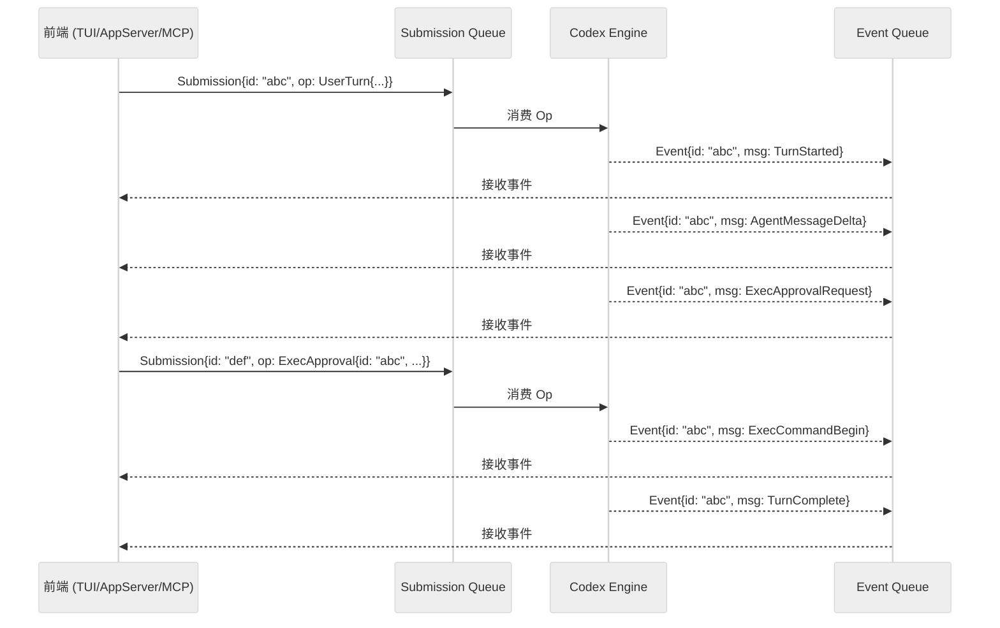
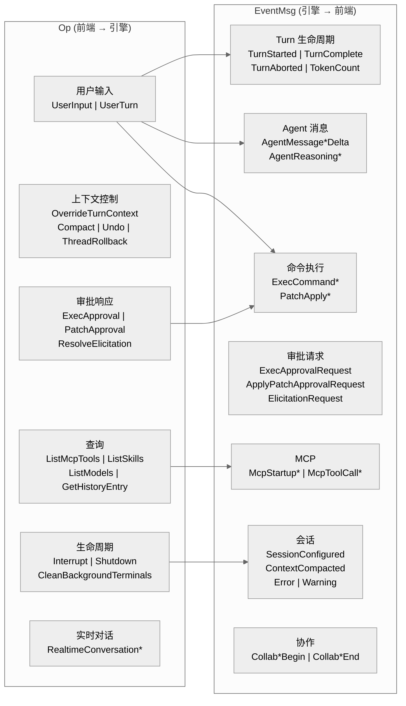

# 第三章 协议层

## 3.1 概述

协议层是 Codex 架构的脊梁。它定义了前端（TUI、App Server、MCP Server）与核心引擎之间的全部通信契约。协议采用 **SQ/EQ（Submission Queue / Event Queue）** 模式，灵感源自 Linux io_uring：前端提交操作请求（Submission），引擎异步产生事件流（Event）。

协议的所有类型定义在 `codex-rs/protocol/` crate 中，该 crate 是整个 workspace 中依赖最广的底层模块——几乎所有其他 crate 都依赖它。

---

## 3.2 SQ/EQ 模式

### 3.2.1 核心数据结构

**Submission（提交）**：前端发往引擎的请求

```rust
pub struct Submission {
    pub id: String,                          // 唯一标识，用于关联事件
    pub op: Op,                              // 操作载荷
    pub trace: Option<W3cTraceContext>,       // 可选 W3C 追踪上下文
}
```

**Event（事件）**：引擎发回前端的响应

```rust
pub struct Event {
    pub id: String,                          // 关联的 Submission id
    pub msg: EventMsg,                       // 事件载荷
}
```

**W3cTraceContext**：分布式追踪支持

```rust
pub struct W3cTraceContext {
    pub traceparent: Option<String>,         // W3C traceparent header
    pub tracestate: Option<String>,          // W3C tracestate header
}
```

### 3.2.2 通信模型



**关键特性**：

- **一对多**: 一个 Submission 可以产生多个 Event（通过相同的 `id` 关联）
- **异步**: 前端提交后不阻塞，事件异步到达
- **交叉**: 前端可以在等待事件的同时提交新的 Submission（如审批响应）
- **可序列化**: 所有类型都实现了 `Serialize + Deserialize`，支持 JSON-RPC 和其他序列化格式
- **可追踪**: 通过 W3C trace context 实现跨异步边界的分布式追踪

---

## 3.3 Op 枚举（操作请求）

`Op` 枚举定义了前端可以向引擎提交的所有操作类型。共计 **30+ 个变体**，按功能分组如下：

### 3.3.1 用户输入类

| 变体 | 说明 |
|------|------|
| `UserInput` | 旧版用户输入，携带 `Vec<UserInput>` items、可选 JSON Schema 约束和 client metadata |
| `UserTurn` | **推荐**。完整的 turn 上下文：items + cwd + approval_policy + sandbox_policy + model + effort + summary + service_tier + collaboration_mode + personality |
| `InterAgentCommunication` | 代理间通信，记录为 assistant 历史但使用标准 turn 生命周期 |

### 3.3.2 上下文控制类

| 变体 | 说明 |
|------|------|
| `OverrideTurnContext` | 覆盖后续 turn 的持久化上下文：cwd、approval_policy、sandbox_policy、model、effort、summary、service_tier、collaboration_mode、personality、windows_sandbox_level、approvals_reviewer |
| `Compact` | 请求压缩当前对话上下文 |
| `Undo` | 撤销最近一次 turn（栈式撤销） |
| `ThreadRollback` | 回退最近 N 个 user turn（仅影响上下文，不回退文件变更） |
| `SetThreadName` | 设置线程的用户可见名称（本地操作） |
| `SetThreadMemoryMode` | 设置线程是否参与记忆生成 |

### 3.3.3 审批与权限类

| 变体 | 说明 |
|------|------|
| `ExecApproval` | 批准/拒绝命令执行请求。字段：id、turn_id、decision (ReviewDecision) |
| `PatchApproval` | 批准/拒绝代码补丁应用。字段：id、decision |
| `ResolveElicitation` | 解析 MCP elicitation 请求。字段：server_name、request_id、decision、content、meta |
| `UserInputAnswer` | 回复 `request_user_input` 工具调用 |
| `RequestPermissionsResponse` | 回复 `request_permissions` 工具调用 |
| `DynamicToolResponse` | 回复动态工具调用请求 |

### 3.3.4 实时对话类

| 变体 | 说明 |
|------|------|
| `RealtimeConversationStart` | 开始实时语音对话流。参数：output_modality、prompt、session_id、transport、voice |
| `RealtimeConversationAudio` | 发送音频帧到实时对话 |
| `RealtimeConversationText` | 发送文本到实时对话 |
| `RealtimeConversationClose` | 关闭实时对话 |
| `RealtimeConversationListVoices` | 请求可用语音列表 |

### 3.3.5 查询与管理类

| 变体 | 说明 |
|------|------|
| `AddToHistory` | 追加条目到持久化跨会话消息历史 |
| `GetHistoryEntryRequest` | 按 log_id + offset 请求单条历史条目 |
| `ListMcpTools` | 请求所有已配置 MCP 服务器的工具列表 |
| `RefreshMcpServers` | 重新初始化 MCP 服务器并刷新工具缓存 |
| `ReloadUserConfig` | 热重载用户配置层 |
| `ListSkills` | 请求可用 skill 列表（可按 cwds 筛选） |
| `ListModels` | 请求可用模型列表 |
| `DropMemories` | 删除所有持久化记忆 |
| `UpdateMemories` | 触发一次启动记忆管线 |
| `Review` | 请求代码审查 |
| `RunUserShellCommand` | 执行用户发起的一次性 shell 命令（"!cmd" 语法） |

### 3.3.6 生命周期类

| 变体 | 说明 |
|------|------|
| `Interrupt` | 中断当前任务（不终止后台终端进程） |
| `CleanBackgroundTerminals` | 终止所有后台终端进程 |
| `Shutdown` | 请求关闭 Codex 实例 |

---

## 3.4 EventMsg 枚举（事件消息）

`EventMsg` 枚举定义了引擎向前端发射的所有事件类型。共计 **60+ 个变体**：

### 3.4.1 Turn 生命周期

| 变体 | 说明 |
|------|------|
| `TurnStarted` | Agent 开始处理一个 turn |
| `TurnComplete` | Agent 完成所有动作 |
| `TurnAborted` | Turn 被中断（含中断原因） |
| `TokenCount` | 当前会话的 token 使用统计 |

### 3.4.2 Agent 消息

| 变体 | 说明 |
|------|------|
| `AgentMessage` | Agent 完整文本消息 |
| `AgentMessageDelta` | Agent 文本流式增量 |
| `AgentMessageContentDelta` | Agent 消息内容增量（结构化） |
| `UserMessage` | 用户/系统输入消息（发送给模型的内容） |
| `AgentReasoning` | Agent 推理内容 |
| `AgentReasoningDelta` | Agent 推理流式增量 |
| `AgentReasoningRawContent` | 原始思维链内容 |
| `AgentReasoningRawContentDelta` | 原始思维链流式增量 |
| `AgentReasoningSectionBreak` | 推理段落分隔（新的标题块） |
| `ReasoningContentDelta` | 推理内容增量 |
| `ReasoningRawContentDelta` | 原始推理内容增量 |

### 3.4.3 命令执行

| 变体 | 说明 |
|------|------|
| `ExecCommandBegin` | 即将执行命令 |
| `ExecCommandOutputDelta` | 命令输出流式增量 |
| `ExecCommandEnd` | 命令执行完成 |
| `TerminalInteraction` | 终端交互事件（stdin/stdout） |

### 3.4.4 补丁与文件

| 变体 | 说明 |
|------|------|
| `PatchApplyBegin` | 即将应用代码补丁 |
| `PatchApplyEnd` | 补丁应用完成 |
| `TurnDiff` | Turn 产生的文件变更 diff |
| `ViewImageToolCall` | Agent 通过 view_image 工具查看了本地图片 |

### 3.4.5 审批请求

| 变体 | 说明 |
|------|------|
| `ExecApprovalRequest` | 命令执行审批请求 |
| `ApplyPatchApprovalRequest` | 补丁应用审批请求 |
| `RequestPermissions` | 权限请求 |
| `RequestUserInput` | 请求用户输入 |
| `ElicitationRequest` | MCP elicitation 请求 |
| `DynamicToolCallRequest` | 动态工具调用请求 |
| `DynamicToolCallResponse` | 动态工具调用响应 |
| `GuardianAssessment` | Guardian 子代理的审批评估结果 |

### 3.4.6 MCP 相关

| 变体 | 说明 |
|------|------|
| `McpStartupUpdate` | MCP 服务器启动进度 |
| `McpStartupComplete` | MCP 启动完成摘要 |
| `McpToolCallBegin` | MCP 工具调用开始 |
| `McpToolCallEnd` | MCP 工具调用结束 |
| `McpListToolsResponse` | MCP 工具列表响应 |

### 3.4.7 搜索与生成

| 变体 | 说明 |
|------|------|
| `WebSearchBegin` | Web 搜索开始 |
| `WebSearchEnd` | Web 搜索结束 |
| `ImageGenerationBegin` | 图像生成开始 |
| `ImageGenerationEnd` | 图像生成结束 |

### 3.4.8 会话管理

| 变体 | 说明 |
|------|------|
| `SessionConfigured` | 会话配置确认 |
| `ThreadNameUpdated` | 线程名称已更新 |
| `ModelReroute` | 模型被路由到不同的模型 |
| `ContextCompacted` | 对话历史已压缩 |
| `ThreadRolledBack` | 对话已回退 |
| `ShutdownComplete` | 关闭完成 |

### 3.4.9 错误与警告

| 变体 | 说明 |
|------|------|
| `Error` | 执行错误 |
| `Warning` | 非致命警告（turn 继续但通知用户） |
| `StreamError` | 模型流错误/断连（系统正在处理，如重试） |
| `DeprecationNotice` | 废弃通知 |

### 3.4.10 撤销

| 变体 | 说明 |
|------|------|
| `UndoStarted` | 撤销开始 |
| `UndoCompleted` | 撤销完成 |

### 3.4.11 代码审查

| 变体 | 说明 |
|------|------|
| `EnteredReviewMode` | 进入审查模式 |
| `ExitedReviewMode` | 退出审查模式 |

### 3.4.12 Hook 系统

| 变体 | 说明 |
|------|------|
| `HookStarted` | Hook 开始执行 |
| `HookCompleted` | Hook 执行完成 |

### 3.4.13 结构化项目事件

| 变体 | 说明 |
|------|------|
| `RawResponseItem` | 原始 Responses API 项目 |
| `ItemStarted` | 结构化项目开始 |
| `ItemCompleted` | 结构化项目完成 |
| `PlanUpdate` | 计划更新 |
| `PlanDelta` | 计划增量 |

### 3.4.14 Skills 相关

| 变体 | 说明 |
|------|------|
| `ListSkillsResponse` | Skill 列表响应 |
| `SkillsUpdateAvailable` | Skill 数据可能已更新 |

### 3.4.15 协作模式

| 变体 | 说明 |
|------|------|
| `CollabAgentSpawnBegin` | 协作代理生成开始 |
| `CollabAgentSpawnEnd` | 协作代理生成结束 |
| `CollabAgentInteractionBegin` | 协作代理交互开始 |
| `CollabAgentInteractionEnd` | 协作代理交互结束 |
| `CollabWaitingBegin` | 等待开始 |
| `CollabWaitingEnd` | 等待结束 |
| `CollabCloseBegin` | 协作关闭开始 |
| `CollabCloseEnd` | 协作关闭结束 |
| `CollabResumeBegin` | 协作恢复开始 |
| `CollabResumeEnd` | 协作恢复结束 |

### 3.4.16 实时对话

| 变体 | 说明 |
|------|------|
| `RealtimeConversationStarted` | 实时对话已启动 |
| `RealtimeConversationRealtime` | 实时对话流载荷 |
| `RealtimeConversationClosed` | 实时对话已关闭 |
| `RealtimeConversationSdp` | WebRTC SDP 载荷 |
| `RealtimeConversationListVoicesResponse` | 语音列表响应 |

### 3.4.17 其他

| 变体 | 说明 |
|------|------|
| `BackgroundEvent` | 后台事件 |
| `GetHistoryEntryResponse` | 历史条目查询响应 |

---

## 3.5 关键数据类型

### 3.5.1 UserInput（用户输入）

```rust
pub enum UserInput {
    Text { text: String, text_elements: Vec<TextElement> },
    Image { image_url: String },
    LocalImage { path: PathBuf },
    Skill { name: String, path: PathBuf },
    Mention { name: String, path: String },
}
```

| 变体 | 说明 |
|------|------|
| `Text` | 文本输入，支持 `TextElement` 富文本标记（如图片占位符）。`text` 最大 1MB |
| `Image` | Base64 编码的 data URI 图片 |
| `LocalImage` | 本地图片路径，序列化时自动转为 base64 |
| `Skill` | 用户选择的 skill（名称 + SKILL.md 路径） |
| `Mention` | 结构化 mention（如 `app://connector-id` 或 `plugin://name@marketplace`） |

### 3.5.2 SandboxPolicy（完整定义）

```rust
pub enum SandboxPolicy {
    DangerFullAccess,
    ReadOnly {
        access: ReadOnlyAccess,       // Restricted{include_platform_defaults, readable_roots} | FullAccess
        network_access: bool,
    },
    ExternalSandbox {
        network_access: NetworkAccess, // Restricted | Enabled
    },
    WorkspaceWrite {
        writable_roots: Vec<AbsolutePathBuf>,
        include_platform_writable_roots: bool,
        access: ReadOnlyAccess,
        network_access: bool,
    },
}
```

### 3.5.3 AskForApproval（完整定义）

```rust
pub enum AskForApproval {
    UnlessTrusted,                    // 仅自动批准已知安全的只读命令
    OnFailure,                        // 已废弃
    OnRequest,                        // 默认：模型决定何时请求
    Granular(GranularApprovalConfig), // 细粒度：5 个 bool 字段
    Never,                            // 永不请求
}
```

### 3.5.4 ReviewDecision

审批响应使用 `ReviewDecision` 枚举，通常包含 `Allow`（允许）、`Deny`（拒绝）等变体，前端在收到 `ExecApprovalRequest` 后，通过 `Op::ExecApproval` 携带 decision 回传。

---

## 3.6 W3C Trace Context 传播

Codex 通过 `W3cTraceContext` 实现跨异步边界的分布式追踪：

```
Frontend → Submission{trace: {traceparent, tracestate}} → Codex Engine
                                                            ↓
                                                    set_parent_from_w3c_trace_context()
                                                            ↓
                                                    OpenTelemetry spans 关联
```

流程：
1. 前端在提交 Submission 时附带 W3C trace context
2. 引擎通过 `set_parent_from_w3c_trace_context()` 将 span 关联到前端的 trace
3. 引擎内部的 OTel 集成（`codex-otel` crate）记录 span 到配置的后端
4. 跨进程的 MCP 调用、exec 执行等也传播 trace context

这使得从用户输入到模型调用到命令执行的完整链路都可以在 OTel 后端中追踪。

---

## 3.7 协议设计哲学

### 3.7.1 异步优先

协议天然异步。前端提交 Op 后不等待同步响应，而是通过 EventMsg 流异步接收结果。这避免了长时间运行的操作（如模型推理、命令执行）阻塞 UI。

### 3.7.2 前端解耦

三种前端（TUI、App Server、MCP Server）共享同一套 Op/EventMsg 协议。核心引擎不关心也不知道连接的是哪种前端。这使得新增前端（如未来的 Web UI）只需实现 Op 提交和 EventMsg 处理。

### 3.7.3 可序列化

所有协议类型都实现了 `Serialize + Deserialize`（serde）和 `JsonSchema`（schemars），这意味着：

- App Server 可以直接将 EventMsg 序列化为 JSON-RPC 通知
- MCP Server 可以将 Op 从 MCP 消息中反序列化
- 协议可以自动生成 JSON Schema 文档
- TypeScript 类型可以通过 `ts-rs` 自动生成（`#[derive(TS)]`）

### 3.7.4 向前兼容

协议通过 serde 的 `alias` 和 `rename` 属性支持多版本兼容：

```rust
#[serde(rename = "task_started", alias = "turn_started")]
TurnStarted(TurnStartedEvent),
```

上例中，v1 线路格式使用 `task_started`，v2 使用 `turn_started`，两者都能被正确反序列化。

### 3.7.5 类型安全

Rust 的枚举 + serde tagged union 确保了协议的类型安全。无效的消息在反序列化时立即失败，不会产生运行时的未定义行为。`#[non_exhaustive]` 标记（如 `UserInput`）允许在不破坏 API 兼容性的前提下添加新变体。

---

## 3.8 协议在各前端中的映射

| 前端 | Op 来源 | EventMsg 消费方式 |
|------|---------|------------------|
| **TUI** | 用户按键 → `AppCommand` → `Op` | `EventMsg` → `AppEvent` → ratatui Widget 渲染 |
| **App Server** | JSON-RPC request → deserialize → `Op` | `EventMsg` → serialize → JSON-RPC notification |
| **MCP Server** | MCP `tools/call` → map → `Op` | `EventMsg` → filter → MCP `tools/call` result / elicitation |

TUI 是最复杂的消费者，它将 EventMsg 映射为丰富的 UI 状态更新（文本渲染、进度条、审批弹窗、diff 视图等）。App Server 基本是 1:1 的 JSON 序列化转发。MCP Server 则需要将 Codex 的审批机制映射到 MCP 的 elicitation 机制。

---

## 3.9 协议流转完整图



---

## 3.10 本章关键文件表

| 文件路径 | 说明 |
|----------|------|
| `codex-rs/protocol/src/protocol.rs` | 核心协议定义：Submission, Op, Event, EventMsg, AskForApproval, SandboxPolicy |
| `codex-rs/protocol/src/user_input.rs` | UserInput 枚举（Text, Image, LocalImage, Skill, Mention） |
| `codex-rs/protocol/src/config_types.rs` | SandboxMode, ApprovalsReviewer, WindowsSandboxLevel, Personality, WebSearchMode |
| `codex-rs/protocol/src/approvals.rs` | 审批相关类型：ExecApprovalRequestEvent, ElicitationRequestEvent, GuardianAssessment* |
| `codex-rs/protocol/src/permissions.rs` | FileSystemSandboxPolicy, NetworkSandboxPolicy |
| `codex-rs/protocol/src/models.rs` | ResponseInputItem, ContentItem, ResponseItem 等模型交互类型 |
| `codex-rs/protocol/src/items.rs` | TurnItem, PlanItem, UserMessageItem |
| `codex-rs/protocol/src/request_permissions.rs` | RequestPermissionsEvent, RequestPermissionsResponse |
| `codex-rs/protocol/src/request_user_input.rs` | RequestUserInputEvent, RequestUserInputResponse |
| `codex-rs/protocol/src/dynamic_tools.rs` | DynamicToolCallRequest, DynamicToolResponse |
| `codex-rs/protocol/src/mcp.rs` | MCP 相关类型：CallToolResult, Tool, Resource |
| `codex-rs/protocol/src/plan_tool.rs` | UpdatePlanArgs |
| `codex-rs/app-server-protocol/` | App Server JSON-RPC 消息类型（Op/EventMsg 的 JSON-RPC 封装） |

---

*下一章将深入 Codex 核心引擎，解析 agentic loop 的实现细节。*
