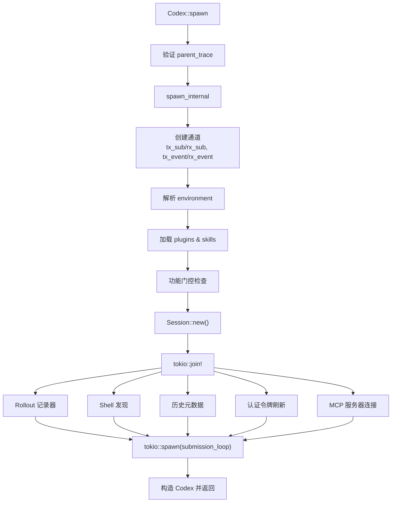
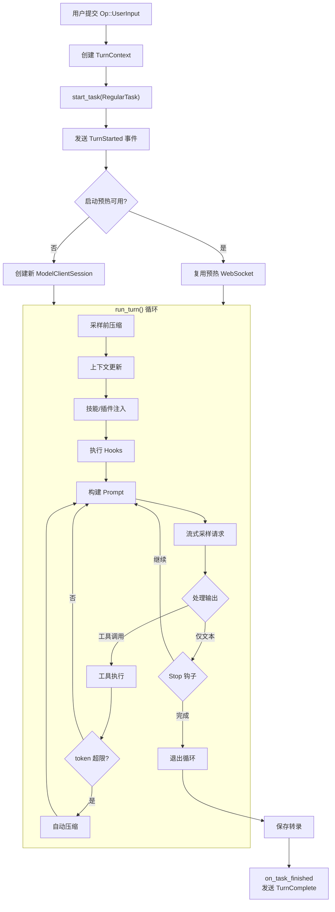
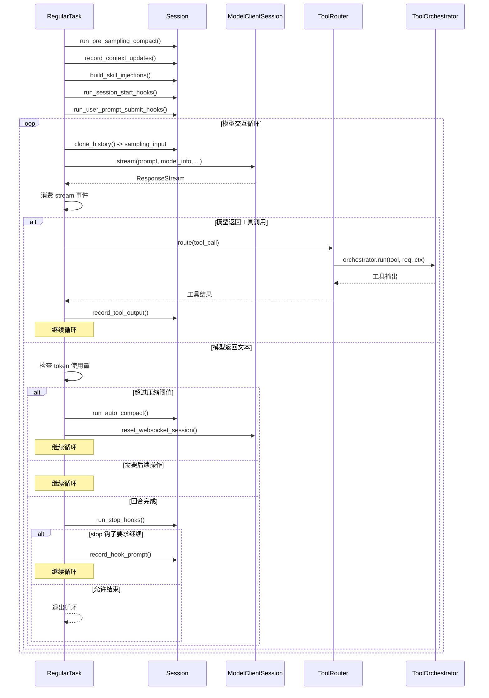

# 第四章 核心引擎

> 本章深入剖析 Codex 的核心运行时——从 `Codex` 结构体的队列对（queue-pair）架构，到会话（Session）的初始化流程，再到提交循环（submission loop）与回合（turn）生命周期的完整执行路径。

## 4.1 概述

Codex 核心引擎位于 `codex-rs/core/src/codex.rs`，是整个 CLI 代理的"心脏"。它的职责是：

1. **接收用户提交**（Submission）并将其分发给正确的处理函数
2. **管理会话状态**（Session），包括对话历史、模型客户端、工具路由等
3. **驱动回合生命周期**（Turn Lifecycle），协调模型采样、工具调用、上下文压缩等过程
4. **通过事件流**将结果反馈给前端（TUI / CLI / LSP）

整体架构采用**队列对模式**（Queue-Pair Pattern）：调用方通过一个 `Sender<Submission>` 发送操作请求，通过一个 `Receiver<Event>` 接收事件响应。这种设计将前端完全解耦于后端的异步执行逻辑。

## 4.2 Codex 结构体

```rust
// core/src/codex.rs:405
pub struct Codex {
    pub(crate) tx_sub: Sender<Submission>,
    pub(crate) rx_event: Receiver<Event>,
    pub(crate) agent_status: watch::Receiver<AgentStatus>,
    pub(crate) session: Arc<Session>,
    pub(crate) session_loop_termination: SessionLoopTermination,
}
```

### 4.2.1 字段解析

| 字段 | 类型 | 职责 |
|------|------|------|
| `tx_sub` | `Sender<Submission>` | 提交通道的发送端。所有用户操作（用户输入、中断、配置变更等）都封装为 `Submission` 发送到此通道 |
| `rx_event` | `Receiver<Event>` | 事件通道的接收端。引擎产生的所有事件（回合开始、模型输出、工具调用结果等）通过此通道返回给调用方 |
| `agent_status` | `watch::Receiver<AgentStatus>` | 基于 tokio `watch` 通道的状态订阅器。调用方可以随时读取当前代理状态（空闲、运行中、已完成等） |
| `session` | `Arc<Session>` | 会话的共享引用。`Session` 包含了对话历史、模型客户端、工具系统等所有运行时状态 |
| `session_loop_termination` | `SessionLoopTermination` | 后台提交循环的共享 future。多个调用方可以等待会话关闭完成 |

### 4.2.2 队列对架构

队列对的核心思想是将"请求"和"响应"分离到两个独立的异步通道中：

```
┌─────────────┐     tx_sub        ┌──────────────────┐     tx_event      ┌─────────────┐
│  Frontend    │ ──────────────>  │  submission_loop  │ ──────────────>  │  Frontend    │
│  (TUI/CLI)  │  Submission       │  (后台 tokio task)  │  Event            │  (TUI/CLI)  │
└─────────────┘                   └──────────────────┘                   └─────────────┘
                                          │
                                          │ 拥有 Arc<Session>
                                          ▼
                                  ┌──────────────────┐
                                  │     Session       │
                                  │  (对话状态、模型     │
                                  │   客户端、工具等)    │
                                  └──────────────────┘
```

提交通道（`tx_sub` / `rx_sub`）使用 `async_channel::bounded(512)` 创建，提供背压保护。事件通道（`tx_event` / `rx_event`）使用 `async_channel::unbounded()` 创建，确保事件生产不会阻塞引擎。

`Submission` 由 `Op` 枚举包装，代表所有可能的操作类型（用户输入、中断、配置变更、实时对话控制等）。每个 `Submission` 携带唯一 ID（UUID v7），使调用方能够关联请求与响应。

## 4.3 初始化：Codex::spawn()

### 4.3.1 入口函数

```rust
// core/src/codex.rs:454
pub(crate) async fn spawn(args: CodexSpawnArgs) -> CodexResult<CodexSpawnOk>
```

`spawn()` 是创建 Codex 实例的唯一入口。它接收一个 `CodexSpawnArgs` 结构体，包含所有初始化所需的依赖：

| 参数 | 说明 |
|------|------|
| `config` | 全局配置（Config） |
| `auth_manager` | 认证管理器 |
| `models_manager` | 模型管理器 |
| `environment_manager` | 环境管理器（Cloud Dev Environment） |
| `skills_manager` | 技能管理器 |
| `plugins_manager` | 插件管理器 |
| `mcp_manager` | MCP 服务器管理器 |
| `skills_watcher` | 技能文件变更监听器 |
| `conversation_history` | 初始对话历史 |
| `session_source` | 会话来源（根线程 / 子代理等） |
| `agent_control` | 子代理控制器 |
| `dynamic_tools` | 动态工具规格 |
| `inherited_shell_snapshot` | 继承的 shell 快照（子代理场景） |
| `inherited_exec_policy` | 继承的执行策略 |
| `parent_trace` | W3C 追踪上下文（用于分布式追踪） |

`spawn()` 的第一步是验证父追踪上下文的有效性，然后将实际工作委托给 `spawn_internal()`，并将整个过程包装在一个 `thread_spawn` span 中用于可观测性。

### 4.3.2 spawn_internal() 流程

`spawn_internal()` 是真正的初始化逻辑所在。其关键步骤：

**第一阶段：通道创建**

```rust
let (tx_sub, rx_sub) = async_channel::bounded(SUBMISSION_CHANNEL_CAPACITY); // 512
let (tx_event, rx_event) = async_channel::unbounded();
```

**第二阶段：前置初始化**

在创建 Session 之前，需要完成一系列准备工作：

1. **环境解析**：`environment_manager.current()` 获取当前开发环境（如果有）
2. **插件加载**：`plugins_manager.plugins_for_config()` 加载配置对应的插件
3. **技能加载**：`skills_manager.skills_for_config()` 加载技能文件并报告错误
4. **功能门控**：
   - 子代理深度达到上限时，禁用 `SpawnCsv` 和 `Collab` 功能
   - Node.js 运行时不可用时，禁用 `JsRepl` 和 `CodeMode` 功能

**第三阶段：Session::new()**

`Session::new()` 内部使用 `tokio::join!` 并行初始化多个子系统：

- **Rollout 记录器**：用于记录对话轨迹的持久化组件
- **Shell 发现**：检测用户的默认 shell（bash / zsh / powershell 等）
- **历史元数据**：加载已有对话历史的统计信息
- **认证 + MCP**：`tokio::join!` 并行完成认证令牌刷新与 MCP 服务器连接建立

这种并行初始化策略显著减少了启动延迟，因为认证和 MCP 连接通常涉及网络 I/O。

**第四阶段：启动提交循环**

```rust
let session_for_loop = Arc::clone(&session);
let session_loop_handle = tokio::spawn(async move {
    submission_loop(session_for_loop, config, rx_sub)
        .instrument(info_span!("session_loop", thread_id = %thread_id))
        .await;
});
```

最终构造 `Codex` 实例并返回 `CodexSpawnOk`，其中包含 `codex` 实例和 `thread_id`。

### 4.3.3 初始化流程图



## 4.4 submission_loop：主分发循环

```rust
// core/src/codex.rs:4701
async fn submission_loop(sess: Arc<Session>, config: Arc<Config>, rx_sub: Receiver<Submission>)
```

`submission_loop` 是一个持续运行的异步循环，从 `rx_sub` 通道接收 `Submission`，根据其携带的 `Op` 变体分发到对应的处理函数。

### 4.4.1 Op 变体分发

循环的核心是一个 `match sub.op.clone()` 表达式，涵盖了所有操作类型：

| Op 变体 | 处理方式 | 是否退出循环 |
|---------|---------|-------------|
| `Op::Interrupt` | `handlers::interrupt()` — 中断当前运行的任务 | 否 |
| `Op::CleanBackgroundTerminals` | 清理后台终端 | 否 |
| `Op::RealtimeConversationStart` | 启动实时语音对话 | 否 |
| `Op::RealtimeConversationAudio` | 处理音频数据 | 否 |
| `Op::RealtimeConversationText` | 处理文本输入 | 否 |
| `Op::RealtimeConversationClose` | 关闭实时对话 | 否 |
| `Op::RealtimeConversationListVoices` | 列出可用语音 | 否 |
| `Op::OverrideTurnContext` | 覆盖下一回合的配置（模型、权限、策略等） | 否 |
| `Op::UserInput` | 启动新回合（RegularTask） | 否 |
| `Op::Shutdown` | 关闭整个会话 | **是** |
| `Op::ReviewDecision` | 用户对工具调用的审批决策 | 否 |
| `Op::ConfigureSession` | 初始配置会话 | 否 |

### 4.4.2 关键设计特点

1. **单线程分发**：所有 `Op` 在同一个 tokio 任务中串行匹配，但实际工作（如回合执行）通过 `tokio::spawn` 派发到独立任务中并行执行
2. **退出机制**：只有 `Op::Shutdown` 返回 `true`（should_exit），导致循环终止
3. **span 追踪**：每个 submission 都被包装在独立的 tracing span 中，便于可观测性

## 4.5 回合生命周期（Turn Lifecycle）

回合是 Codex 与模型交互的基本单位。一个"回合"从用户提交输入开始，经过模型采样和可能的多次工具调用，到模型给出最终文本回复结束。

### 4.5.1 阶段一：TurnStarted

当 `submission_loop` 接收到 `Op::UserInput` 时，它创建一个 `TurnContext` 并调用 `Session::start_task()`，传入一个 `RegularTask` 实例。

```rust
// core/src/tasks/regular.rs:35
async fn run(
    self: Arc<Self>,
    session: Arc<SessionTaskContext>,
    ctx: Arc<TurnContext>,
    input: Vec<UserInput>,
    cancellation_token: CancellationToken,
) -> Option<String>
```

`RegularTask::run()` 的第一步是发送 `TurnStarted` 事件：

```rust
let event = EventMsg::TurnStarted(TurnStartedEvent {
    turn_id: ctx.sub_id.clone(),
    started_at: ctx.turn_timing_state.started_at_unix_secs().await,
    model_context_window: ctx.model_context_window(),
    collaboration_mode_kind: ctx.collaboration_mode.mode,
});
sess.send_event(ctx.as_ref(), event).await;
```

然后尝试消费启动预热（startup prewarm）的 WebSocket 连接。如果预热不可用或被取消，则在后续 `run_turn` 中创建新连接。

`RegularTask` 内部有一个循环结构：它持续调用 `run_turn()` 直到没有待处理的输入为止。这支持了用户在模型运行期间提交新输入的场景。

### 4.5.2 阶段二：run_turn() 内部循环

```rust
// core/src/codex.rs:6183
pub(crate) async fn run_turn(
    sess: Arc<Session>,
    turn_context: Arc<TurnContext>,
    input: Vec<UserInput>,
    prewarmed_client_session: Option<ModelClientSession>,
    cancellation_token: CancellationToken,
) -> Option<String>
```

`run_turn()` 是 Codex 最复杂的函数之一，它实现了完整的模型交互循环。以下是其内部步骤的详细分解：

#### 步骤 1：采样前压缩（Pre-Sampling Compaction）

```rust
let pre_sampling_compacted = run_pre_sampling_compact(&sess, &turn_context).await;
```

在向模型发送请求之前，检查对话历史是否超过了模型的上下文窗口限制。如果超过，执行压缩操作（summarize older messages）以释放空间。压缩后需要重置 WebSocket 会话，因为缓存的增量请求不再有效。

#### 步骤 2：上下文更新

```rust
sess.record_context_updates_and_set_reference_context_item(turn_context.as_ref()).await;
```

将最新的文件系统变更、环境变化等上下文信息注入到对话历史中。这确保模型在采样时能"看到"最新的项目状态。

#### 步骤 3：技能与插件注入

系统会收集与本次输入相关的技能（skills）和插件（plugins），将它们转化为对话项（ResponseItem）注入到历史中：

- **技能**：根据用户消息中的 `@skill` 提及匹配相关技能
- **插件**：根据 `plugin://` 协议提及解析插件能力
- **MCP 工具**：如果启用了 apps/connectors，加载 MCP 工具列表

#### 步骤 4：Hooks 执行

在采样前执行一系列钩子：

- `session_start_hooks`：会话首次启动时的初始化钩子
- `user_prompt_submit_hooks`：用户消息提交时的验证/增强钩子

钩子可以返回 `should_stop = true` 来阻止回合继续，或返回额外的上下文项注入到对话中。

#### 步骤 5：构建采样请求并流式传输

```rust
run_sampling_request(
    sess, turn_context, turn_diff_tracker,
    &mut client_session, turn_metadata_header,
    sampling_request_input, ...
).await
```

此函数：
1. 从对话历史构建 `Prompt`
2. 调用 `ModelClientSession::stream()` 发起流式请求
3. 消费 `ResponseStream` 中的事件
4. 处理模型输出中的文本和工具调用

#### 步骤 6：处理工具调用

当模型返回工具调用时，系统通过 `ToolRouter` 分发到对应的 `ToolHandler`：

1. 模型输出被解析为 `ToolCall` 列表
2. 每个工具调用经过 `ToolOrchestrator` 的审批 -> 沙箱选择 -> 执行 -> 重试流程
3. 工具输出被记录到对话历史中
4. 循环回到步骤 5，将工具结果作为新上下文发送给模型

#### 步骤 7：回合中自动压缩

```rust
if token_limit_reached && needs_follow_up {
    run_auto_compact(&sess, &turn_context, ...).await;
    client_session.reset_websocket_session();
    continue;
}
```

如果在回合执行过程中，总 token 使用量达到自动压缩阈值，系统会：
1. 执行中间压缩
2. 重置 WebSocket 会话
3. 继续循环（模型会基于压缩后的上下文继续工作）

#### 步骤 8：停止钩子与回合结束

当模型不再需要后续操作（`needs_follow_up = false`）时：

1. 执行 `stop` 钩子，让外部系统有机会检查输出或要求继续
2. 如果 stop 钩子返回 `should_block = true` 并提供了 continuation prompt，则将其注入对话并继续循环
3. 否则，记录最终的助手消息并退出循环

### 4.5.3 阶段三：TurnComplete

```rust
// core/src/tasks/mod.rs:321
sess.on_task_finished(Arc::clone(&ctx_for_finish), last_agent_message).await;
```

当 `run_turn()` 返回后，`start_task` 中的 spawned 任务会：

1. 尝试保存对话转录（带重试）
2. 如果任务未被取消，调用 `on_task_finished()` 发送 `TurnComplete` 事件
3. 通知 `done` waiter，允许等待者继续

`on_task_finished` 清理活跃回合状态并发送最终的完成事件给前端。

### 4.5.4 回合生命周期流程图



### 4.5.5 run_turn() 内部循环序列图



## 4.6 Session 结构体

```rust
// core/src/codex.rs:844
pub(crate) struct Session {
    pub(crate) conversation_id: ThreadId,
    tx_event: Sender<Event>,
    agent_status: watch::Sender<AgentStatus>,
    out_of_band_elicitation_paused: watch::Sender<bool>,
    state: Mutex<SessionState>,
    managed_network_proxy_refresh_lock: Mutex<()>,
    features: ManagedFeatures,
    pending_mcp_server_refresh_config: Mutex<Option<McpServerRefreshConfig>>,
    pub(crate) conversation: Arc<RealtimeConversationManager>,
    pub(crate) active_turn: Mutex<Option<ActiveTurn>>,
    mailbox: Mailbox,
    mailbox_rx: Mutex<MailboxReceiver>,
    idle_pending_input: Mutex<Vec<ResponseInputItem>>,
    pub(crate) guardian_review_session: GuardianReviewSessionManager,
    pub(crate) services: SessionServices,
    js_repl: Arc<JsReplHandle>,
    next_internal_sub_id: AtomicU64,
}
```

### 4.6.1 关键字段解析

| 字段 | 职责 |
|------|------|
| `conversation_id` | 会话的唯一标识符（ThreadId），在整个生命周期中不变 |
| `tx_event` | 事件通道的发送端，所有事件（回合状态、模型输出、错误等）通过此通道发送 |
| `agent_status` | `watch::Sender<AgentStatus>`，用于广播代理状态变更 |
| `state` | `Mutex<SessionState>`，包含对话历史、token 计数、配置覆盖等可变状态 |
| `features` | `ManagedFeatures`，功能标志集合，在会话生命周期内不可变 |
| `conversation` | 实时语音对话管理器（WebRTC） |
| `active_turn` | 当前活跃的回合。`Session` 同时最多只有一个活跃回合 |
| `mailbox` | 邮箱系统，用于进程间通信（如子代理通知父代理） |
| `idle_pending_input` | 空闲时积累的待处理输入项 |
| `guardian_review_session` | Guardian（自动审查器）的会话管理 |
| `services` | `SessionServices`，包含 `model_client`、`mcp_connection_manager`、`analytics_events_client` 等共享服务 |
| `js_repl` | JavaScript REPL 句柄 |
| `next_internal_sub_id` | 原子计数器，用于生成内部提交 ID |

### 4.6.2 Session 的核心职责

1. **对话历史管理**：维护完整的对话历史（`ConversationHistory`），支持追加、压缩、快照
2. **事件广播**：所有引擎产生的事件通过 `send_event()` / `send_event_raw()` 发送
3. **任务管理**：通过 `active_turn` 管理当前运行的任务，支持中断和取消
4. **配置动态覆盖**：允许在回合之间动态修改模型、权限策略等配置
5. **待处理输入缓冲**：当模型正在运行时，新的用户输入被缓冲到 `idle_pending_input`，在下一次循环迭代中被消费

### 4.6.3 Session 与 Codex 的关系

`Codex` 持有 `Arc<Session>` 的引用，`submission_loop` 也持有一个克隆。这意味着 `Session` 的生命周期与 `Codex` 实例绑定。当 `Op::Shutdown` 被处理时，`submission_loop` 退出，但 `Session` 本身由 `Arc` 引用计数管理，在所有引用释放后自动销毁。

## 4.7 TurnContext

```rust
// core/src/codex.rs:885
pub(crate) struct TurnContext {
    pub(crate) sub_id: String,
    pub(crate) config: Arc<Config>,
    pub(crate) auth_manager: Option<Arc<AuthManager>>,
    pub(crate) model_info: ModelInfo,
    pub(crate) provider: ModelProviderInfo,
    pub(crate) reasoning_effort: Option<ReasoningEffortConfig>,
    pub(crate) cwd: AbsolutePathBuf,
    pub(crate) approval_policy: Constrained<AskForApproval>,
    pub(crate) sandbox_policy: Constrained<SandboxPolicy>,
    pub(crate) tools_config: ToolsConfig,
    pub(crate) features: ManagedFeatures,
    // ... 更多字段
}
```

`TurnContext` 是回合级别的不可变上下文。每个回合创建一个新的 `TurnContext`，它包含了该回合的所有配置：模型选择、权限策略、沙箱策略、工作目录等。

这种设计的好处是：
- 回合之间的配置变更不会互相干扰
- 每个回合的配置是确定性的，便于调试和追踪
- `TurnContext` 可以安全地在多个异步任务间共享（`Arc<TurnContext>`）

## 4.8 AgentStatus 追踪

`AgentStatus` 通过 tokio 的 `watch` 通道实现状态广播。`watch` 通道的特点是：

- 只保留最新值（无历史缓冲）
- 多个接收方可以同时订阅
- 发送方写入时不阻塞
- 接收方总是能读到最新状态

```
Session (watch::Sender<AgentStatus>)
    │
    ├──> Codex (watch::Receiver) ──> 前端轮询
    ├──> codex_thread (subscribe_status()) ──> LSP 集成
    └──> 其他订阅者
```

`AgentStatus` 的值由 `agent_status_from_event()` 函数从事件流中推导：当 `TurnStarted` 事件产生时，状态变为"运行中"；当 `TurnComplete` 事件产生时，状态变为"空闲"。

## 4.9 codex_delegate.rs

`codex_delegate.rs` 文件包含了 `Codex` 的委托方法——即那些直接转发到 `Session` 的公开接口。它提供了一组便捷的方法，使外部调用者无需直接操作 `Session`：

- `submit()` / `submit_with_trace()`：提交操作
- `next_event()`：获取下一个事件
- `agent_status()`：获取当前代理状态
- `set_thread_memory_mode()`：设置线程级记忆模式

## 4.10 小结

Codex 核心引擎的设计体现了几个关键的架构决策：

1. **队列对解耦**：前端与后端完全异步分离，支持不同的前端实现（TUI、CLI、LSP）
2. **单活跃回合**：Session 同时只允许一个活跃回合，简化了并发控制
3. **回合级配置隔离**：每个回合拥有独立的 `TurnContext`，避免配置竞争
4. **递进式压缩**：采样前压缩 + 回合中自动压缩，确保长对话不会耗尽上下文窗口
5. **钩子系统**：在回合的关键节点（开始、提交、停止）提供扩展点
6. **可观测性优先**：每个操作都有 tracing span，每个状态变更都有事件

## 文件索引

| 文件路径 | 主要内容 |
|---------|---------|
| `core/src/codex.rs` | `Codex` 结构体、`Session` 结构体、`spawn()`、`submission_loop()`、`run_turn()` |
| `core/src/codex_delegate.rs` | `Codex` 的公开委托方法 |
| `core/src/tasks/regular.rs` | `RegularTask`——标准回合任务实现 |
| `core/src/tasks/mod.rs` | `SessionTask` trait、`start_task()`、`on_task_finished()` |
| `core/src/client.rs` | `ModelClient` / `ModelClientSession`——模型客户端（下一章详述） |
| `core/src/tools/router.rs` | `ToolRouter`——工具路由（第六章详述） |
