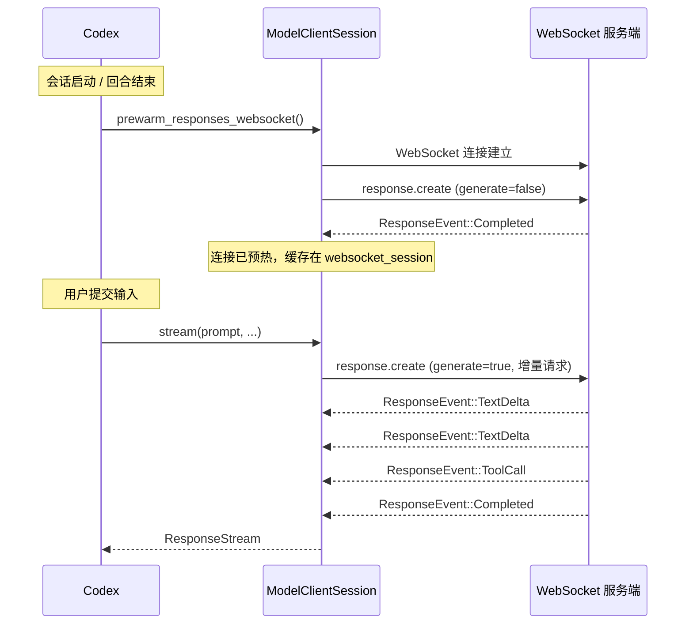
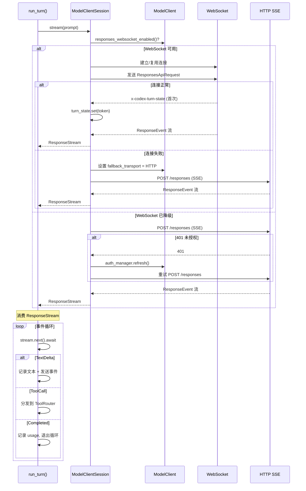

# 第五章 模型交互与流式传输

> 本章聚焦 Codex 如何与大语言模型通信：从会话级客户端（ModelClient）到回合级会话（ModelClientSession），从 WebSocket 优先的传输策略到 HTTP SSE 降级，以及请求构建与流式事件消费的完整路径。

## 5.1 概述

Codex 的模型交互层位于 `core/src/client.rs` 和 `core/src/client_common.rs`，负责：

1. 管理与模型 API 的认证和连接状态
2. 构建符合 Responses API 格式的请求
3. 优先使用 WebSocket 传输，自动降级到 HTTP SSE
4. 处理流式响应事件（文本增量、工具调用、完成信号）
5. 通过自定义 HTTP 头实现粘性路由和可观测性

## 5.2 ModelClient：会话级客户端

```rust
// core/src/client.rs:194
pub struct ModelClient {
    state: Arc<ModelClientState>,
}
```

`ModelClient` 的生命周期与 `Session` 绑定，包含在 `SessionServices` 中。它封装了以下会话级状态：

| 状态 | 说明 |
|------|------|
| `auth_manager` | 认证管理器，负责令牌刷新和 API 密钥管理 |
| `conversation_id` | 对话标识符，用于服务端关联请求 |
| `provider` | `ModelProviderInfo`，包含 API 端点、wire API 类型（Responses / Chat）、WebSocket 支持等 |
| `fallback_transport` | WebSocket 降级状态。一旦某个回合触发 HTTP 降级，后续回合也使用 HTTP |
| `auth_env_telemetry` | 认证环境遥测信息 |

### 5.2.1 关键设计：会话级 WebSocket 降级

WebSocket 降级是**会话级**的决策：一旦 WebSocket 在某个回合中失败并降级到 HTTP，该会话的所有后续回合都将使用 HTTP。这避免了在不稳定的 WebSocket 连接上反复重试，同时保证了会话内的传输一致性。

## 5.3 ModelClientSession：回合级会话

```rust
// core/src/client.rs:211
pub struct ModelClientSession {
    client: ModelClient,
    websocket_session: WebsocketSession,
    turn_state: Arc<OnceLock<String>>,
}
```

每个 Codex 回合创建一个新的 `ModelClientSession`。**不同回合之间绝对不能复用同一个 `ModelClientSession`**，因为它缓存了回合级的粘性路由令牌（turn state）。

### 5.3.1 WebSocket 会话状态

```rust
struct WebsocketSession {
    connection: Option<ApiWebSocketConnection>,
    last_request: Option<ResponsesApiRequest>,
    last_response_rx: Option<oneshot::Receiver<LastResponse>>,
    connection_reused: StdMutex<bool>,
}
```

| 字段 | 说明 |
|------|------|
| `connection` | 当前活跃的 WebSocket 连接。在同一回合内跨多次请求复用 |
| `last_request` | 上一次发送的完整请求。用于判断新请求是否为增量扩展 |
| `last_response_rx` | 上一次响应的 oneshot 接收端，用于获取 `response_id` 和 `items_added` |
| `connection_reused` | 标记连接是否被复用（vs 新建），用于遥测 |

### 5.3.2 粘性路由（Sticky Routing）

`turn_state` 是一个 `OnceLock<String>`，存储服务端在回合开始时通过 `x-codex-turn-state` 响应头返回的路由令牌。此令牌在同一回合的所有后续请求中通过 `x-codex-turn-state` 请求头回传，确保：

- 同一回合的所有请求被路由到同一个服务端实例
- 模型上下文在服务端保持连续
- 减少上下文重建的开销

**合约规则**：在回合开始时接收令牌，在回合内所有请求中回传，不得在不同回合之间传递。

## 5.4 Prompt 结构体

```rust
// core/src/client_common.rs:27
pub struct Prompt {
    pub input: Vec<ResponseItem>,
    pub(crate) tools: Vec<ToolSpec>,
    pub(crate) parallel_tool_calls: bool,
    pub base_instructions: BaseInstructions,
    pub personality: Option<Personality>,
    pub output_schema: Option<Value>,
}
```

`Prompt` 是发送给模型的完整请求载荷的逻辑表示：

| 字段 | 说明 |
|------|------|
| `input` | 对话上下文——`Vec<ResponseItem>` 包含用户消息、助手回复、工具调用和工具输出 |
| `tools` | 本回合可用的工具列表，包括内建工具和 MCP 工具 |
| `parallel_tool_calls` | 是否允许模型在单次响应中并行调用多个工具 |
| `base_instructions` | 系统指令（system prompt） |
| `personality` | 可选的个性配置（语气、风格等） |
| `output_schema` | 可选的结构化输出 schema（JSON Schema） |

### 5.4.1 get_formatted_input()

```rust
pub(crate) fn get_formatted_input(&self) -> Vec<ResponseItem> {
    let mut input = self.input.clone();
    let is_freeform_apply_patch_tool_present = self.tools.iter().any(|tool| match tool {
        ToolSpec::Freeform(f) => f.name == "apply_patch",
        _ => false,
    });
    if is_freeform_apply_patch_tool_present {
        reserialize_shell_outputs(&mut input);
    }
    input
}
```

当使用 **Freeform** 模式的 `apply_patch` 工具时，shell 命令的输出需要从 JSON 序列化格式转换为结构化文本格式。这是因为 Freeform 工具期望人类可读的输出格式，而非 JSON 对象。

`reserialize_shell_outputs()` 遍历所有对话项，找到 shell 工具调用及其对应的输出项，将输出从 JSON 反序列化为结构化文本表示。

## 5.5 流式传输架构

### 5.5.1 传输策略：WebSocket 优先

```rust
// core/src/client.rs:1425
pub async fn stream(
    &mut self,
    prompt: &Prompt,
    model_info: &ModelInfo,
    session_telemetry: &SessionTelemetry,
    effort: Option<ReasoningEffortConfig>,
    summary: ReasoningSummaryConfig,
    service_tier: Option<ServiceTier>,
    turn_metadata_header: Option<&str>,
) -> Result<ResponseStream>
```

`stream()` 方法是模型交互的统一入口。它根据 `wire_api` 和 WebSocket 可用性选择传输方式：

```
stream()
  └─ wire_api == Responses?
      ├─ WebSocket 启用且未降级?
      │    └─ stream_responses_websocket() ───┐
      │         ├─ 成功 → 返回 ResponseStream  │
      │         └─ 降级 → 切换到 HTTP          │
      └─ 否                                   │
           └─ stream_responses_api() ──────────┘
                └─ HTTP SSE 流式响应
```

### 5.5.2 WebSocket 传输

```rust
// core/src/client.rs:1231
async fn stream_responses_websocket(
    &mut self, prompt, model_info, ..., warmup: bool, ...
) -> Result<WebsocketStreamOutcome>
```

WebSocket 传输的优势：
- **持久连接**：同一回合内复用连接，避免 TCP/TLS 握手开销
- **双向通信**：支持增量请求（仅发送新增的对话项）
- **预热机制**：支持在回合开始前建立连接

返回 `WebsocketStreamOutcome` 枚举：
- `Stream(ResponseStream)`：成功建立流
- `FallbackToHttp`：WebSocket 不可用，需降级

### 5.5.3 HTTP SSE 传输

```rust
// core/src/client.rs:1134
async fn stream_responses_api(
    &mut self, prompt, model_info, ...,
) -> Result<ResponseStream>
```

HTTP SSE（Server-Sent Events）是降级传输方式。每次请求都发送完整的对话历史。内部实现了认证恢复循环：如果收到 401 未授权响应，通过 `AuthManager` 刷新令牌后重试。

### 5.5.4 ResponseStream

`ResponseStream` 是对 `mpsc::Receiver<Result<ResponseEvent>>` 的包装，提供统一的流式事件消费接口。无论底层使用 WebSocket 还是 HTTP SSE，上层代码都通过相同的 `stream.next().await` 模式消费事件。

## 5.6 WebSocket 预热（Prewarm）

预热是一种优化技术，在用户实际提交输入之前就建立 WebSocket 连接：

```rust
// 预热请求：v2 response.create with generate=false
stream_responses_websocket(prompt, ..., warmup: true, ...)
```

预热过程：
1. 在会话启动时（或上一回合结束后），发送一个 `warmup = true` 的 WebSocket 请求
2. 服务端建立连接但不开始生成（`generate = false`）
3. 客户端等待 `Completed` 事件确认预热完成
4. 当用户实际提交输入时，直接在已建立的连接上发送真正的请求

如果预热失败或超时，系统会优雅降级——在实际请求时创建新连接。

### 5.6.1 预热时序图



## 5.7 自定义 HTTP 头

Codex 使用一组自定义 HTTP 头在客户端和服务端之间传递元数据：

```rust
pub const X_CODEX_INSTALLATION_ID_HEADER: &str = "x-codex-installation-id";
pub const X_CODEX_TURN_STATE_HEADER: &str = "x-codex-turn-state";
pub const X_CODEX_TURN_METADATA_HEADER: &str = "x-codex-turn-metadata";
pub const X_CODEX_PARENT_THREAD_ID_HEADER: &str = "x-codex-parent-thread-id";
```

| 头名称 | 方向 | 用途 |
|--------|------|------|
| `x-codex-installation-id` | 请求 | Codex 安装实例标识，用于遥测和配额追踪 |
| `x-codex-turn-state` | 双向 | 粘性路由令牌。服务端在回合开始时通过响应头返回，客户端在后续请求中通过请求头回传 |
| `x-codex-turn-metadata` | 请求 | 每回合的可观测性元数据（JSON 格式），包含模型信息、遥测上下文等 |
| `x-codex-parent-thread-id` | 请求 | 父线程 ID（子代理场景），用于服务端关联父子对话 |

这些头在 `build_common_headers()` 函数中统一构建，并附加到每个 HTTP 和 WebSocket 请求中。

## 5.8 ResponseEvent

`ResponseEvent` 来自 `codex_api` crate，是流式响应的事件类型。主要变体包括：

| 变体 | 说明 |
|------|------|
| `OutputTextDelta` | 文本增量——模型生成的部分文本 |
| `OutputTextDone` | 文本完成——某个输出项的文本生成完毕 |
| `ReasoningSummaryTextDelta` | 推理摘要增量（适用于支持推理的模型） |
| `FunctionCallArgsDelta` | 工具调用参数增量 |
| `FunctionCallArgsDone` | 工具调用参数完成 |
| `ResponseCreated` | 响应创建确认 |
| `Completed` | 响应流结束，包含 usage 信息 |
| `Error` | 服务端错误 |
| `ServerEvent` | 通用服务端事件（用于遥测和诊断） |

这些事件通过 `ResponseStream`（mpsc 通道）从后台网络任务传递到 `run_turn()` 的消费循环中。

## 5.9 WebSocket 连接生命周期序列图



## 5.10 增量 WebSocket 请求

WebSocket 传输的一个关键优化是**增量请求**：当新请求是上一次请求的扩展时（即只追加了新的对话项），只发送增量部分而非完整历史。

判断逻辑：
1. `last_request` 非空
2. 新请求的 `input` 前缀与 `last_request.input` 完全匹配
3. 其他参数（tools、instructions 等）未变更

满足条件时，WebSocket 请求只包含新增的对话项，显著减少了网络传输量。

## 5.11 小结

Codex 模型交互层的设计亮点：

1. **传输透明**：上层代码不感知底层传输方式，统一使用 `ResponseStream`
2. **渐进降级**：WebSocket -> HTTP SSE，会话级降级避免反复重试
3. **粘性路由**：`x-codex-turn-state` 确保服务端状态一致性
4. **连接预热**：在用户输入前建立连接，减少首次响应延迟
5. **增量请求**：WebSocket 模式下只发送新增内容，降低带宽开销
6. **认证恢复**：HTTP 传输自动处理令牌过期和刷新

## 文件索引

| 文件路径 | 主要内容 |
|---------|---------|
| `core/src/client.rs` | `ModelClient`、`ModelClientSession`、`stream()`、WebSocket/HTTP 传输实现 |
| `core/src/client_common.rs` | `Prompt` 结构体、`ResponseStream`、`get_formatted_input()` |
| `codex-rs/codex-api/` | `ResponseEvent` 定义、API 请求构建 |
