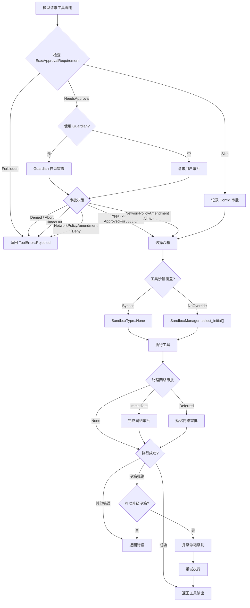

# 第六章 工具系统

> 本章全面解析 Codex 的工具系统——从工具规格的注册与暴露，到 ToolRouter 的分发、ToolOrchestrator 的审批-沙箱-执行-重试流程，再到每个内建 ToolHandler 的职责。

## 6.1 概述

Codex 的工具系统是代理能力的核心载体。当模型决定执行某个操作（运行 shell 命令、编辑文件、搜索代码等）时，它通过"工具调用"（tool call）表达意图，工具系统负责将这个意图转化为实际的副作用。

工具系统的架构分为四层：

```
模型输出 (tool calls)
    │
    ▼
┌─────────────────┐
│   ToolRouter    │  路由：将工具名映射到具体处理器
├─────────────────┤
│  ToolRegistry   │  注册表：存储所有已注册的处理器
├─────────────────┤
│ ToolOrchestrator│  编排：审批 → 沙箱 → 执行 → 重试
├─────────────────┤
│  ToolHandler    │  执行：具体工具的实现逻辑
└─────────────────┘
```

## 6.2 ToolHandler trait

```rust
// core/src/tools/registry.rs:38
pub trait ToolHandler: Send + Sync {
    type Output: ToolOutput + 'static;

    fn kind(&self) -> ToolKind;

    fn is_mutating(
        &self,
        _invocation: &ToolInvocation,
    ) -> impl std::future::Future<Output = bool> + Send {
        async { false }
    }

    fn pre_tool_use_payload(&self, _invocation: &ToolInvocation) -> Option<PreToolUsePayload> {
        None
    }

    fn post_tool_use_payload(
        &self,
        _call_id: &str,
        _payload: &ToolPayload,
        _result: &dyn ToolOutput,
    ) -> Option<PostToolUsePayload> {
        None
    }

    fn handle(
        &self,
        invocation: ToolInvocation,
    ) -> BoxFuture<'_, Result<Self::Output, FunctionCallError>>;
}
```

### 6.2.1 trait 方法解析

| 方法 | 用途 |
|------|------|
| `kind()` | 返回 `ToolKind::Function` 或 `ToolKind::Mcp`，用于路由时匹配载荷类型 |
| `is_mutating()` | 判断此次调用是否可能修改用户环境（文件系统、操作系统状态等）。防御性设计——有疑问时返回 `true` |
| `pre_tool_use_payload()` | 生成钩子载荷，在工具执行前触发 `pre_tool_use` 钩子 |
| `post_tool_use_payload()` | 生成钩子载荷，在工具执行后触发 `post_tool_use` 钩子 |
| `handle()` | 实际执行工具逻辑，返回工具输出或错误 |

### 6.2.2 ToolKind

```rust
pub enum ToolKind {
    Function,  // 内建函数工具（shell、apply_patch、list_dir 等）
    Mcp,       // MCP（Model Context Protocol）外部工具
}
```

`matches_kind()` 方法使用此枚举将工具调用的载荷类型与处理器匹配：
- `ToolKind::Function` 匹配 `ToolPayload::Function` 和 `ToolPayload::ToolSearch`
- `ToolKind::Mcp` 匹配 `ToolPayload::Mcp`

## 6.3 所有 ToolHandler 一览

| Handler | 文件 | 说明 | 是否可变 |
|---------|------|------|---------|
| `ShellHandler` | `handlers/shell.rs` | 执行 shell 命令（传统模式） | 是 |
| `ShellCommandHandler` | `handlers/shell.rs` | shell 命令的变体实现 | 是 |
| `UnifiedExecHandler` | `handlers/unified_exec.rs` | 统一执行处理器——合并 shell 和命令执行，支持后台终端 | 是 |
| `ApplyPatchHandler` | `handlers/apply_patch.rs` | 应用文件补丁（创建、修改、删除文件） | 是 |
| `ListDirHandler` | `handlers/list_dir.rs` | 列出目录内容 | 否 |
| `ViewImageHandler` | `handlers/view_image.rs` | 读取图像文件并以 base64 返回 | 否 |
| `JsReplHandler` | `handlers/js_repl.rs` | JavaScript REPL 执行 | 是 |
| `JsReplResetHandler` | `handlers/js_repl.rs` | 重置 JavaScript REPL 状态 | 是 |
| `McpHandler` | `handlers/mcp.rs` | 调用 MCP 服务器提供的外部工具 | 视具体工具 |
| `McpResourceHandler` | `handlers/mcp_resource.rs` | 读取 MCP 服务器提供的资源 | 否 |
| `CodeModeExecuteHandler` | `tools/code_mode/` | Code Mode 执行处理器——在受控环境中运行代码 | 是 |
| `CodeModeWaitHandler` | `tools/code_mode/` | 等待 Code Mode 执行完成 | 否 |
| `SpawnAgentHandler` (multi_agents) | `handlers/multi_agents.rs` | 生成子代理（v1 实现） | 否 |
| `multi_agents_v2` | `handlers/multi_agents_v2/` | 生成子代理（v2 实现，支持更丰富的配置） | 否 |
| `PlanHandler` | `handlers/plan.rs` | 管理任务计划（创建、更新、查询） | 是 |
| `RequestUserInputHandler` | `handlers/request_user_input.rs` | 向用户请求输入（阻塞等待用户回复） | 否 |
| `RequestPermissionsHandler` | `handlers/request_permissions.rs` | 请求提升权限（如文件系统写入、网络访问） | 否 |
| `ToolSearchHandler` | `handlers/tool_search.rs` | 搜索可用工具（用于动态工具发现） | 否 |
| `ToolSuggestHandler` | `handlers/tool_suggest.rs` | 工具建议——建议用户安装缺失的 MCP 工具 | 否 |
| `DynamicToolHandler` | `handlers/dynamic.rs` | 动态工具——由外部配置注入的自定义工具 | 视具体工具 |
| `UnavailableToolHandler` | `handlers/unavailable_tool.rs` | 不可用工具——当模型调用了已禁用的工具时返回错误提示 | 否 |
| `TestSyncHandler` | `handlers/test_sync.rs` | 测试同步辅助工具（仅测试环境） | 否 |
| `AgentJobsHandler` | `handlers/agent_jobs.rs` | 子代理任务管理（等待、关闭子代理） | 否 |

### 6.3.1 核心工具详解

**ShellHandler / UnifiedExecHandler**

Shell 执行是 Codex 最常用的工具。`UnifiedExecHandler` 是 `ShellHandler` 的进化版本，支持：
- 前台和后台命令执行
- 超时控制
- 工作目录配置
- 沙箱策略适配
- 输出截断（防止巨大输出耗尽上下文）

**ApplyPatchHandler**

文件编辑工具，接受类似 unified diff 格式的补丁并应用到文件系统。支持：
- 创建新文件
- 修改现有文件（精确的行级替换）
- 删除文件
- 自动处理路径解析（相对路径 → 绝对路径）

**McpHandler**

MCP（Model Context Protocol）工具的桥接层。将模型的工具调用翻译为 MCP 协议请求，发送到对应的 MCP 服务器，然后将结果翻译回模型可理解的格式。

## 6.4 ToolRouter

```rust
// core/src/tools/router.rs:37
pub struct ToolRouter {
    registry: ToolRegistry,
    specs: Vec<ConfiguredToolSpec>,
    model_visible_specs: Vec<ToolSpec>,
    parallel_mcp_server_names: HashSet<String>,
}
```

`ToolRouter` 是工具系统的入口，负责：

1. **工具注册**：从 `ToolsConfig` 和运行时参数构建完整的工具注册表
2. **规格暴露**：向模型暴露可用工具的规格（`model_visible_specs`），供模型在采样时选择
3. **调用路由**：将模型返回的工具调用名称映射到具体的 `ToolHandler` 实现

### 6.4.1 构建过程

```rust
impl ToolRouter {
    pub fn from_config(config: &ToolsConfig, params: ToolRouterParams<'_>) -> Self
}
```

`from_config()` 接收工具配置和运行时参数，通过 `build_specs_with_discoverable_tools()` 构建工具规格和注册表：

1. 根据 `ToolsConfig` 中的功能标志确定启用哪些内建工具
2. 加入 MCP 工具（来自 `mcp_tools` 参数）
3. 加入延迟加载的 MCP 工具（`deferred_mcp_tools`）
4. 为模型已调用但当前不可用的工具创建 `UnavailableToolHandler`
5. 加入可发现工具（`discoverable_tools`，通过 `tool_search` 动态发现）
6. 加入动态工具（`dynamic_tools`，外部配置注入）

### 6.4.2 Code Mode 过滤

当 `code_mode_only_enabled` 为 `true` 时，`model_visible_specs` 会过滤掉嵌套在 Code Mode 内部的工具，只暴露 Code Mode 的顶层接口。这防止模型绕过 Code Mode 的安全边界直接调用底层工具。

### 6.4.3 并行 MCP 工具

`parallel_mcp_server_names` 记录了支持并行调用的 MCP 服务器。对于这些服务器的工具，模型可以在单次响应中并行调用多个，提高执行效率。

## 6.5 ToolRegistry

`ToolRegistry` 是一个从工具名到 `ToolHandler` 的映射表。它的核心接口：

- `register(name, handler)`：注册一个新的处理器
- `get(name)`：根据名称查找处理器
- `handle(invocation)`：查找并执行对应的处理器

注册表在 `ToolRouter::from_config()` 中一次性构建，在回合生命周期内不可变。

## 6.6 ToolOrchestrator

```rust
// core/src/tools/orchestrator.rs:36
pub(crate) struct ToolOrchestrator {
    sandbox: SandboxManager,
}
```

`ToolOrchestrator` 是工具执行的编排器，实现了完整的"审批 → 沙箱选择 → 执行 → 重试"流程。

### 6.6.1 核心方法

```rust
pub async fn run<Rq, Out, T>(
    &mut self,
    tool: &mut T,
    req: &Rq,
    tool_ctx: &ToolCtx,
    turn_ctx: &TurnContext,
    approval_policy: AskForApproval,
) -> Result<OrchestratorRunResult<Out>, ToolError>
where
    T: ToolRuntime<Rq, Out>,
```

### 6.6.2 执行流程详解

**第一步：审批（Approval）**

根据 `ExecApprovalRequirement` 判断是否需要用户审批：

| 要求 | 行为 |
|------|------|
| `Skip` | 直接通过，记录 `Config` 来源的审批决策 |
| `Forbidden` | 拒绝执行，返回 `ToolError::Rejected` |
| `NeedsApproval` | 向用户（或 Guardian 自动审查器）请求审批 |

审批决策类型：

| 决策 | 含义 |
|------|------|
| `Approved` | 批准本次调用 |
| `ApprovedForSession` | 批准整个会话中的同类调用（缓存到 ApprovalStore） |
| `ApprovedExecpolicyAmendment` | 批准并修改执行策略 |
| `NetworkPolicyAmendment` | 网络策略修改（允许/拒绝） |
| `Denied` | 拒绝 |
| `Abort` | 中止整个回合 |
| `TimedOut` | Guardian 审批超时 |

**第二步：沙箱选择**

```rust
let initial_sandbox = match tool.sandbox_mode_for_first_attempt(req) {
    SandboxOverride::BypassSandboxFirstAttempt => SandboxType::None,
    SandboxOverride::NoOverride => self.sandbox.select_initial(
        &turn_ctx.file_system_sandbox_policy,
        turn_ctx.network_sandbox_policy,
        tool.sandbox_preference(),
        turn_ctx.windows_sandbox_level,
        has_managed_network_requirements,
    ),
};
```

`SandboxManager` 根据以下因素选择沙箱类型：
- 文件系统沙箱策略（只读 / 受限写入 / 完全访问）
- 网络沙箱策略（禁止网络 / 受限网络 / 完全网络）
- 工具自身的沙箱偏好
- Windows 沙箱级别
- 是否有受管网络需求

**第三步：执行**

```rust
let (run_result, deferred_network_approval) = Self::run_attempt(
    tool, req, tool_ctx, &attempt, has_managed_network_requirements
).await;
```

在选定的沙箱中执行工具。同时处理网络审批（如果需要）：
- `Immediate` 模式：在执行前完成网络审批
- `Deferred` 模式：在执行后异步完成网络审批

**第四步：重试（Retry with Escalation）**

如果首次执行被沙箱拒绝（如权限不足），编排器可以：
1. 提升沙箱级别（如从严格隔离升级到宽松隔离）
2. 在新的沙箱中重试执行
3. 由于之前已经获得了用户审批（缓存在 `ApprovalStore`），重试时不需要再次请求审批

### 6.6.3 审批流程图



## 6.7 ApprovalStore

`ApprovalStore` 缓存用户的审批决策，避免对同类工具调用重复请求审批。

### 6.7.1 缓存策略

当用户选择 `ApprovedForSession` 时，审批决策会被缓存。后续的同类调用（相同工具名 + 匹配的参数模式）直接通过，无需再次请求。

### 6.7.2 with_cached_approval()

`ApprovalStore` 提供 `with_cached_approval()` 方法，实现"检查缓存 → 未命中则请求 → 缓存结果"的完整流程：

```
with_cached_approval(tool_name, args)
    ├─ 缓存命中 → 返回 Approved
    ├─ 缓存未命中 → 请求用户审批
    │   ├─ Approved → 不缓存，仅本次有效
    │   ├─ ApprovedForSession → 缓存 + 返回 Approved
    │   └─ Denied → 返回 Denied
    └─ 返回审批结果
```

## 6.8 工具规格（Tool Specs）

工具规格（`ToolSpec`）定义了暴露给模型的工具描述，包括名称、参数 schema 和描述。

### 6.8.1 ToolSpec 变体

| 变体 | 说明 |
|------|------|
| `Function` | 标准函数工具（JSON Schema 参数） |
| `Freeform` | 自由格式工具（如 `apply_patch`，参数是自由文本） |
| `ResponsesApiNamespace` | Responses API 命名空间工具（如 `local_shell`） |
| `Mcp` | MCP 协议工具 |

### 6.8.2 ConfiguredToolSpec

`ConfiguredToolSpec` 是 `ToolSpec` 的配置化包装，包含：
- `spec: ToolSpec`：工具规格
- `name: ToolName`：工具名称
- `configured`：是否由用户显式配置

### 6.8.3 注册流程

```
ToolsConfig (功能标志)
    │
    ▼
build_specs_with_discoverable_tools()
    ├─ 内建工具 (Shell, ApplyPatch, ListDir, ...)
    ├─ MCP 工具 (来自 mcp_tools HashMap)
    ├─ 延迟 MCP 工具 (来自 deferred_mcp_tools)
    ├─ 不可用工具占位 (unavailable_called_tools)
    ├─ 可发现工具 (discoverable_tools)
    └─ 动态工具 (dynamic_tools)
    │
    ▼
ToolSpecBuilder::build()
    ├─ specs: Vec<ConfiguredToolSpec>  → ToolRouter.specs
    └─ registry: ToolRegistry          → ToolRouter.registry
```

### 6.8.4 模型可见性

并非所有注册的工具都暴露给模型。`model_visible_specs` 经过过滤：
- Code Mode 启用时，隐藏嵌套工具
- 某些内部工具（如 `TestSync`）不暴露给模型
- 不可用工具以特殊描述暴露，提示模型该工具不可用

## 6.9 工具执行上下文

### 6.9.1 ToolInvocation

```rust
pub struct ToolInvocation {
    pub call_id: String,
    pub tool_name: ToolName,
    pub payload: ToolPayload,
    pub session: Arc<Session>,
    pub turn: Arc<TurnContext>,
    pub turn_diff_tracker: SharedTurnDiffTracker,
}
```

`ToolInvocation` 封装了执行一次工具调用所需的全部上下文：
- 调用标识（`call_id`）用于关联请求和响应
- 工具名和载荷包含模型传入的参数
- `session` 和 `turn` 提供运行时上下文
- `turn_diff_tracker` 跟踪本回合中的文件变更

### 6.9.2 ToolPayload

```rust
pub enum ToolPayload {
    Function { arguments: String },
    Mcp { arguments: Value, server_name: String },
    ToolSearch { query: String },
}
```

| 变体 | 说明 |
|------|------|
| `Function` | 内建函数工具，参数为 JSON 字符串 |
| `Mcp` | MCP 工具，参数为 JSON Value + 服务器名称 |
| `ToolSearch` | 工具搜索查询 |

### 6.9.3 ToolOutput

`ToolOutput` trait 定义了工具输出的统一接口。具体实现包括：
- `FunctionToolOutput`：标准函数输出（文本 + 可选的结构化数据）
- `ExecToolCallOutput`：命令执行输出（stdout + stderr + exit code）

## 6.10 Hook 集成

工具系统在执行前后与 Hook 系统集成：

1. **pre_tool_use**：在工具执行前触发。钩子可以：
   - 修改工具参数
   - 阻止工具执行
   - 注入额外上下文

2. **post_tool_use**：在工具执行后触发。钩子可以：
   - 审计工具输出
   - 修改输出（如过滤敏感信息）
   - 记录遥测数据

Handler 通过 `pre_tool_use_payload()` 和 `post_tool_use_payload()` 方法提供钩子载荷。`ToolRegistry` 的 `handle()` 方法在调用 handler 前后自动运行钩子。

## 6.11 并行工具执行

当模型在单次响应中返回多个工具调用时，Codex 支持并行执行：

```rust
// core/src/tools/parallel.rs
```

并行执行的条件：
1. `Prompt.parallel_tool_calls = true`
2. 工具调用之间没有数据依赖
3. 对于 MCP 工具，所属服务器需在 `parallel_mcp_server_names` 中

并行执行使用 `tokio::join!` 或 `futures::join_all`，所有工具调用在各自的沙箱中独立执行。

## 6.12 网络审批

某些工具调用涉及网络访问（如 shell 命令中的 `curl`、MCP 工具调用外部 API 等）。网络审批系统提供额外的安全层：

```rust
// core/src/tools/network_approval.rs
pub enum NetworkApprovalMode {
    Immediate,  // 在执行前完成审批
    Deferred,   // 在执行后异步完成审批
}
```

- **Immediate**：适用于网络访问是工具核心行为的场景
- **Deferred**：适用于网络访问是可选的或附带的场景

## 6.13 小结

Codex 工具系统的设计特点：

1. **关注点分离**：路由（ToolRouter）、注册（ToolRegistry）、编排（ToolOrchestrator）、执行（ToolHandler）各司其职
2. **安全优先**：多层审批（exec policy → approval cache → user/guardian）+ 沙箱隔离
3. **可扩展**：通过 ToolHandler trait 和 MCP 协议支持任意工具扩展
4. **防御性设计**：`is_mutating()` 默认保守、不可用工具有友好提示、审批缓存避免重复干扰
5. **Hook 集成**：工具执行前后的钩子提供了丰富的扩展点
6. **渐进式沙箱**：首次尝试使用严格沙箱，拒绝后升级到宽松沙箱重试

## 文件索引

| 文件路径 | 主要内容 |
|---------|---------|
| `core/src/tools/router.rs` | `ToolRouter`——工具路由和规格构建 |
| `core/src/tools/registry.rs` | `ToolRegistry`、`ToolHandler` trait、`ToolKind` |
| `core/src/tools/orchestrator.rs` | `ToolOrchestrator`——审批/沙箱/执行/重试编排 |
| `core/src/tools/spec.rs` | 工具规格构建逻辑 |
| `core/src/tools/context.rs` | `ToolInvocation`、`ToolPayload`、`ToolOutput` |
| `core/src/tools/sandboxing.rs` | 沙箱选择和管理 |
| `core/src/tools/network_approval.rs` | 网络审批系统 |
| `core/src/tools/parallel.rs` | 并行工具执行 |
| `core/src/tools/handlers/shell.rs` | `ShellHandler`、`ShellCommandHandler` |
| `core/src/tools/handlers/unified_exec.rs` | `UnifiedExecHandler` |
| `core/src/tools/handlers/apply_patch.rs` | `ApplyPatchHandler` |
| `core/src/tools/handlers/list_dir.rs` | `ListDirHandler` |
| `core/src/tools/handlers/view_image.rs` | `ViewImageHandler` |
| `core/src/tools/handlers/js_repl.rs` | `JsReplHandler`、`JsReplResetHandler` |
| `core/src/tools/handlers/mcp.rs` | `McpHandler` |
| `core/src/tools/handlers/mcp_resource.rs` | `McpResourceHandler` |
| `core/src/tools/handlers/multi_agents.rs` | 子代理工具（v1） |
| `core/src/tools/handlers/multi_agents_v2/` | 子代理工具（v2） |
| `core/src/tools/handlers/plan.rs` | `PlanHandler` |
| `core/src/tools/handlers/request_user_input.rs` | `RequestUserInputHandler` |
| `core/src/tools/handlers/request_permissions.rs` | `RequestPermissionsHandler` |
| `core/src/tools/handlers/tool_search.rs` | `ToolSearchHandler` |
| `core/src/tools/handlers/tool_suggest.rs` | `ToolSuggestHandler` |
| `core/src/tools/handlers/dynamic.rs` | `DynamicToolHandler` |
| `core/src/tools/handlers/unavailable_tool.rs` | `UnavailableToolHandler` |
