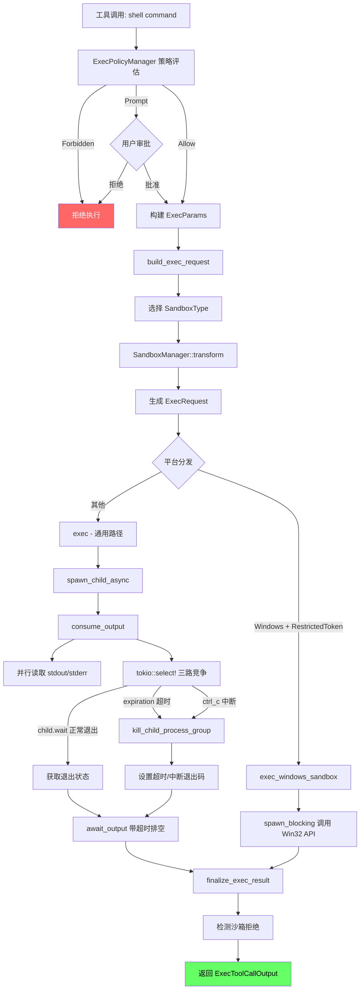

# 第七章 执行与沙箱系统

## 概述

Codex 作为一个 AI 编程代理,需要在用户机器上执行任意 shell 命令。这带来了一个核心矛盾:要让 AI 高效工作,就必须赋予它执行命令的能力;但不加限制的命令执行会带来严重的安全风险。Codex 的执行与沙箱系统正是为了解决这一矛盾而设计的——它提供了一套分层的安全机制,从策略审批到运行时隔离,确保命令在受控环境中执行。

本章将深入分析 Codex 的命令执行管线,涵盖执行参数模型、进程生命周期管理、跨平台沙箱实现、执行策略引擎以及 exec-server 抽象层。

## ExecParams:执行参数模型

### 结构定义

`ExecParams` 是命令执行的入口数据结构,定义在 `core/src/exec.rs:83`。它封装了执行一条命令所需的全部信息:

```rust
pub struct ExecParams {
    pub command: Vec<String>,           // 命令及参数,如 ["ls", "-la"]
    pub cwd: AbsolutePathBuf,           // 工作目录(绝对路径)
    pub expiration: ExecExpiration,     // 超时/取消策略
    pub capture_policy: ExecCapturePolicy, // 输出捕获策略
    pub env: HashMap<String, String>,   // 额外环境变量
    pub network: Option<NetworkProxy>,  // 网络代理配置
    pub sandbox_permissions: SandboxPermissions, // 沙箱权限覆盖
    pub windows_sandbox_level: WindowsSandboxLevel, // Windows 沙箱级别
    pub windows_sandbox_private_desktop: bool, // 是否使用私有桌面
    pub justification: Option<String>,  // 审批理由
    pub arg0: Option<String>,           // 可选的 argv[0] 覆盖
}
```

### 字段解析

**command** 是一个字符串向量,第一个元素为可执行程序路径,后续为参数。在执行前会通过 `split_first()` 拆分为 `(program, args)`。

**cwd** 使用 `AbsolutePathBuf` 类型确保工作目录始终为绝对路径。这避免了相对路径在不同上下文中解析不一致的问题。

**expiration** 控制命令的生命周期终结方式,是一个枚举:

```rust
pub enum ExecExpiration {
    Timeout(Duration),           // 固定超时时间
    DefaultTimeout,              // 使用默认超时(10秒)
    Cancellation(CancellationToken), // 通过 CancellationToken 取消
}
```

**capture_policy** 决定输出如何被采集:

- `ShellTool`:标准 shell 工具模式,带输出大小上限和超时行为
- `FullBuffer`:内部可信辅助命令模式,不限制输出大小,不使用超时

**network** 当设置了网络代理时,会通过 `network.apply_to_env(&mut env)` 将代理配置注入环境变量。

**sandbox_permissions** 使用 `SandboxPermissions` 枚举,允许工具调用覆盖默认沙箱权限。

**windows_sandbox_level** 区分 Windows 平台上的两种沙箱后端:标准 restricted-token 和提升的 Elevated(AppContainer)模式。

## 关键常量

执行系统定义了若干重要的常量,它们控制着命令执行的边界条件:

| 常量 | 值 | 用途 |
|------|------|------|
| `DEFAULT_EXEC_COMMAND_TIMEOUT_MS` | 10,000 (10秒) | 默认命令超时时间 |
| `MAX_EXEC_OUTPUT_DELTAS_PER_CALL` | 10,000 | 每次执行最多发送的流式输出事件数 |
| `IO_DRAIN_TIMEOUT_MS` | 2,000 (2秒) | 子进程终止后等待 stdout/stderr 排空的超时 |
| `READ_CHUNK_SIZE` | 8,192 (8KB) | 每次读取的字节数 |
| `AGGREGATE_BUFFER_INITIAL_CAPACITY` | 8,192 (8KB) | 聚合缓冲区初始容量 |
| `EXEC_OUTPUT_MAX_BYTES` | 继承自 `DEFAULT_OUTPUT_BYTES_CAP` | stdout/stderr 最大保留字节数 |
| `SIGKILL_CODE` | 9 | Unix SIGKILL 信号码 |
| `TIMEOUT_CODE` | 64 | 超时信号码 |
| `EXIT_CODE_SIGNAL_BASE` | 128 | Shell 惯例: 信号退出码 = 128 + 信号号 |
| `EXEC_TIMEOUT_EXIT_CODE` | 124 | 超时退出码(与 `timeout` 命令一致) |

`IO_DRAIN_TIMEOUT_MS` 的设计值得特别说明。当子进程被 kill 后,如果它的子孙进程继承了 stdout/stderr 的文件描述符,管道可能不会立即关闭。2 秒的超时确保读取任务不会无限阻塞。

## 执行流程

### 总体管线

命令执行从工具调用开始,经过策略检查、沙箱配置、进程创建、输出采集,最终返回结构化结果。以下是完整的执行路径:

```
process_exec_tool_call()
  └─> build_exec_request()        // 构建 ExecRequest
       ├─> select_sandbox_type()  // 选择沙箱类型
       └─> SandboxManager::transform() // 沙箱命令变换
  └─> sandboxing::execute_env()   // 统一执行入口
       └─> execute_exec_request()
            └─> get_raw_output_result()
                 ├─> [Windows] exec_windows_sandbox()
                 └─> [Unix] exec()
                      ├─> spawn_child_async()
                      └─> consume_output()
```

### build_exec_request:请求构建

`build_exec_request()` 函数将高层的 `ExecParams` 转换为具体的 `ExecRequest`。这个过程包括:

1. **沙箱类型选择**:调用 `select_process_exec_tool_sandbox_type()`,根据文件系统策略、网络策略和平台选择合适的 `SandboxType`。
2. **网络代理注入**:如果配置了 `NetworkProxy`,将代理环境变量注入到命令环境中。
3. **命令变换**:通过 `SandboxManager::transform()` 将原始命令包装为沙箱命令。例如在 Linux 上可能会在命令前加上 `bwrap` 参数。
4. **Windows 文件系统覆盖**:根据沙箱后端类型,计算额外的读/写路径覆盖和写入拒绝路径。

### spawn_child_async:进程创建

`spawn_child_async()` 负责创建子进程。它接受 `SpawnChildRequest`,配置进程的:

- 可执行文件路径和参数
- 工作目录
- 环境变量
- 标准 I/O 策略(管道重定向)
- 网络沙箱策略

返回一个 tokio `Child` 句柄,其 stdout 和 stderr 已被设置为 piped 模式。

### consume_output:输出采集与超时控制

`consume_output()` 是执行管线的核心异步函数。它同时处理输出读取、超时终止和信号中断:

```rust
async fn consume_output(
    mut child: Child,
    expiration: ExecExpiration,
    capture_policy: ExecCapturePolicy,
    stdout_stream: Option<StdoutStream>,
) -> Result<RawExecToolCallOutput>
```

执行逻辑分为三个并行阶段:

**阶段一:并行输出读取**

```rust
let stdout_handle = tokio::spawn(read_output(BufReader::new(stdout_reader), ...));
let stderr_handle = tokio::spawn(read_output(BufReader::new(stderr_reader), ...));
```

stdout 和 stderr 各自在独立的 tokio 任务中读取。每个任务以 `READ_CHUNK_SIZE` (8KB) 为单位读取数据,并可选地通过 `StdoutStream` 发送流式 delta 事件。

**阶段二:三路竞争等待**

```rust
tokio::select! {
    status_result = child.wait() => { ... }       // 正常退出
    _ = &mut expiration_wait => { ... }            // 超时
    _ = tokio::signal::ctrl_c() => { ... }         // Ctrl+C 中断
}
```

使用 `tokio::select!` 在三种终止条件间竞争:
- **正常退出**:子进程自然结束,获取退出状态
- **超时**:调用 `kill_child_process_group()` 和 `child.start_kill()` 终止整个进程组
- **Ctrl+C**:同样终止进程组,但使用 SIGKILL 退出码

**阶段三:带超时的输出排空**

```rust
let stdout = await_output(&mut stdout_handle, capture_policy.io_drain_timeout()).await?;
let stderr = await_output(&mut stderr_handle, capture_policy.io_drain_timeout()).await?;
```

在子进程终止后,等待最多 `IO_DRAIN_TIMEOUT_MS` (2秒) 让读取任务完成。如果超时,abort 任务并返回空输出。

### finalize_exec_result:结果处理

最终结果通过 `finalize_exec_result()` 转换为 `ExecToolCallOutput`。这个步骤包括:

- 检测 Unix 信号(超时信号 → `timed_out = true`)
- 将 `Vec<u8>` 转换为 UTF-8 字符串(`from_utf8_lossy`)
- 检测沙箱拒绝(`is_likely_sandbox_denied`)

`is_likely_sandbox_denied()` 通过在 stderr/stdout 中搜索关键词(如 "operation not permitted"、"landlock"、"seccomp")来启发式判断命令是否被沙箱阻止。

## 沙箱系统

### 架构概览

沙箱系统采用了分层抽象的设计。`codex-sandboxing` crate 负责平台无关的策略选择和命令变换,而具体的沙箱实现分散在各平台特定的模块中:

```
codex-sandboxing (crate)
  ├── SandboxManager        // 策略选择与命令变换
  ├── SandboxType (enum)    // 沙箱类型枚举
  └── SandboxCommand        // 待沙箱化的命令

core/src/sandboxing/mod.rs
  ├── ExecRequest           // 带沙箱信息的执行请求
  ├── ExecOptions           // 执行选项(超时、捕获策略)
  └── execute_env()         // 统一执行入口

平台实现:
  ├── linux-sandbox/        // Linux: Landlock + seccomp + bubblewrap
  ├── [macOS: Seatbelt]     // macOS: sandbox-exec
  └── windows_sandbox.rs    // Windows: Restricted Token / AppContainer
```

### ExecRequest 与 SandboxType

`ExecRequest` (定义在 `core/src/sandboxing/mod.rs`) 是沙箱化执行的核心数据结构:

```rust
pub struct ExecRequest {
    pub command: Vec<String>,
    pub cwd: AbsolutePathBuf,
    pub env: HashMap<String, String>,
    pub network: Option<NetworkProxy>,
    pub expiration: ExecExpiration,
    pub capture_policy: ExecCapturePolicy,
    pub sandbox: SandboxType,
    pub windows_sandbox_level: WindowsSandboxLevel,
    pub sandbox_policy: SandboxPolicy,
    pub file_system_sandbox_policy: FileSystemSandboxPolicy,
    pub network_sandbox_policy: NetworkSandboxPolicy,
    // ... 更多字段
}
```

`SandboxType` 枚举定义了所有支持的沙箱后端,`SandboxManager::select_initial()` 根据平台和策略配置自动选择最合适的类型。

### Linux 沙箱:Landlock + seccomp + bubblewrap

Linux 沙箱使用三层防护机制:

**Landlock LSM** (`linux-sandbox/src/landlock.rs`):Linux 安全模块,提供细粒度的文件系统访问控制。通过 `Ruleset` API 定义允许访问的路径和权限(读/写/执行)。Codex 使用 Landlock ABI 来限制子进程只能访问工作区内的文件。

**seccomp** (同文件):通过 BPF 程序过滤系统调用。当网络访问被禁止时,安装 seccomp 过滤器阻止 `socket()` 等网络相关的系统调用。关键函数 `apply_sandbox_policy_to_current_thread()` 在子进程线程内应用这些限制:

```rust
pub(crate) fn apply_sandbox_policy_to_current_thread(
    sandbox_policy: &SandboxPolicy,
    network_sandbox_policy: NetworkSandboxPolicy,
    cwd: &Path,
    apply_landlock_fs: bool,
    allow_network_for_proxy: bool,
    proxy_routed_network: bool,
) -> Result<()>
```

该函数首先设置 `PR_SET_NO_NEW_PRIVS`(防止通过 setuid 提权),然后安装 seccomp 过滤器。

**bubblewrap** (`linux-sandbox/src/bwrap.rs`):用户空间容器工具,提供 mount namespace 隔离。文件系统限制主要由 bubblewrap 而非 Landlock 处理(Landlock 保留为 legacy/backup)。

### macOS 沙箱:Seatbelt

macOS 使用 `sandbox-exec` (Seatbelt) 机制。通过 `CODEX_SANDBOX_ENV_VAR` 环境变量传递沙箱配置文件路径。Seatbelt 配置文件定义了允许的文件访问路径、网络权限等。调试工具位于 `cli/src/debug_sandbox/seatbelt.rs`。

### Windows 沙箱:Restricted Token + AppContainer

Windows 沙箱提供两种隔离级别:

**Restricted Token** (默认):创建一个权限受限的进程令牌。通过 `run_windows_sandbox_capture_with_extra_deny_write_paths()` 执行命令,支持额外的写入拒绝路径。这种模式开销较低,兼容性较好。

**Elevated (AppContainer)**:使用 Windows AppContainer 隔离机制,通过 `run_windows_sandbox_capture_elevated()` 执行。支持更精细的读/写根目录覆盖。当网络代理强制执行时,即使配置了默认级别也会自动提升到此模式(因为防火墙规则绑定到 AppContainer 身份)。

选择逻辑由 `windows_sandbox_uses_elevated_backend()` 决定:

```rust
fn windows_sandbox_uses_elevated_backend(
    sandbox_level: WindowsSandboxLevel,
    proxy_enforced: bool,
) -> bool {
    proxy_enforced || matches!(sandbox_level, WindowsSandboxLevel::Elevated)
}
```

Windows 沙箱执行在 `tokio::task::spawn_blocking` 中运行(因为底层 Win32 API 是同步的),并记录 `CreateProcessAsUserW` 失败的遥测指标。

## 执行策略引擎

### ExecPolicyManager

`ExecPolicyManager` (定义在 `core/src/exec_policy.rs`) 是命令审批系统的核心。它管理一组规则,决定每条命令是否需要用户审批:

```rust
pub(crate) struct ExecPolicyManager {
    policy: ArcSwap<Policy>,          // 热交换策略
    update_lock: tokio::sync::Mutex<()>, // 更新锁
}
```

使用 `ArcSwap` 允许运行时无锁替换策略,这对于配置热重载至关重要。

### 策略加载

策略从 `.rules` 文件加载。`load()` 方法搜索配置目录栈中的 `rules/` 子目录,读取所有 `.rules` 文件并解析为 `Policy` 对象:

```
配置目录/
  rules/
    default.rules    // 默认策略文件
    custom.rules     // 用户自定义规则
```

### 决策模型

通过 `codex_execpolicy` crate 实现,策略评估产生三种决策:

| 决策 | 含义 | 行为 |
|------|------|------|
| `Decision::Allow` | 命令被允许 | 直接执行 |
| `Decision::Prompt` | 需要确认 | 向用户展示审批请求 |
| `Decision::Forbidden` | 命令被禁止 | 拒绝执行 |

评估过程返回 `Evaluation` 结构,包含最终决策和所有匹配的 `RuleMatch` 列表。

### 安全命令检测

两个辅助函数提供快速路径判断:

- `is_known_safe_command()`:识别已知安全的命令(如 `ls`、`cat`、`echo`),可跳过审批
- `command_might_be_dangerous()`:识别可能危险的命令,强制要求审批

### BANNED_PREFIX_SUGGESTIONS

这是一个禁止作为前缀建议的命令列表(约 40 个条目),包括各种 shell 和脚本解释器:

```rust
static BANNED_PREFIX_SUGGESTIONS: &[&[&str]] = &[
    &["python3"], &["python3", "-c"],
    &["python"], &["git"],
    &["bash"], &["bash", "-lc"],
    &["sh"], &["sh", "-c"],
    &["pwsh"], &["powershell"],
    &["node"], &["node", "-e"],
    &["perl"], &["ruby"], &["php"],
    &["osascript"],
    // ... 更多
];
```

这些命令被禁止作为自动审批前缀,因为它们本身就是解释器——允许 `python3` 前缀就等于允许任意 Python 代码执行。

### 审批策略与 AskForApproval

`AskForApproval` 枚举定义了三种审批模式:

- `Never`:从不询问(自动拒绝需要审批的命令)
- `Always`:始终询问
- `Granular`:细粒度控制,分别配置 `sandbox_approval` 和 `rules` 两个维度

当策略决策为 `Prompt` 但审批模式为 `Never` 时,命令会被拒绝并附带原因:"approval required by policy, but AskForApproval is set to Never"。

### 动态规则修改

`ExecPolicyManager` 支持运行时规则修改。当用户审批一条命令时,可以通过 `blocking_append_allow_prefix_rule()` 或 `blocking_append_network_rule()` 添加新的允许规则,后续相同模式的命令将自动通过。

## Exec Server

### 架构

`exec-server` crate 提供了命令执行的服务化抽象,支持本地和远程两种执行模式。

### 核心 Trait

**ExecProcess**:代表一个正在运行的进程。定义了读取输出、写入输入和终止进程的接口。

**ExecBackend**:进程创建后端。`StartedExecProcess` 封装了已启动的进程。

**ExecutorFileSystem**:文件系统操作接口,支持读写文件、创建目录、获取元数据等。

### 模块结构

```
exec-server/src/
  ├── lib.rs                  // 公共导出
  ├── process.rs              // ExecBackend, ExecProcess trait
  ├── local_process.rs        // 本地进程实现
  ├── remote_process.rs       // 远程进程实现
  ├── environment.rs          // Environment, EnvironmentManager
  ├── local_file_system.rs    // 本地文件系统(LOCAL_FS)
  ├── remote_file_system.rs   // 远程文件系统
  ├── sandboxed_file_system.rs // 沙箱文件系统包装
  ├── fs_sandbox.rs           // 文件系统沙箱规则
  ├── server.rs               // 服务端主循环
  ├── client.rs               // ExecServerClient
  └── protocol.rs             // RPC 协议定义
```

### Environment 与 EnvironmentManager

`Environment` 代表一个执行环境实例,包含工作目录、环境变量和沙箱配置。`EnvironmentManager` 管理多个环境的生命周期。

`ExecEnvPolicy` 控制执行环境的策略,包括文件系统访问规则和网络权限。

### 本地 vs 远程执行

**本地执行**:直接使用操作系统进程 API,通过 `LocalFileSystem` (导出为 `LOCAL_FS`) 访问本地文件系统。

**远程执行**:通过 RPC 协议连接到远程 exec-server 实例。`ExecServerClient` 封装了连接管理和请求发送。`CODEX_EXEC_SERVER_URL_ENV_VAR` 环境变量指定远程服务器 URL。

**SandboxedFileSystem**:在实际文件系统上层增加沙箱检查,根据 `FileSystemSandboxContext` 决定是否允许文件操作。

### 协议

RPC 协议定义在 `protocol.rs` 中,包括:

- `ExecParams` / `ExecResponse`:命令执行
- `FsReadFileParams` / `FsWriteFileParams`:文件读写
- `FsCopyParams`、`FsCreateDirectoryParams`、`FsRemoveParams`:文件管理
- `ExecOutputDeltaNotification`:流式输出事件
- `ExecExitedNotification`:进程退出通知

## 命令执行流程图



## 核心文件索引

| 文件 | 职责 |
|------|------|
| `codex-rs/core/src/exec.rs` | 命令执行主逻辑:ExecParams、consume_output、超时控制 |
| `codex-rs/core/src/sandboxing/mod.rs` | 沙箱适配层:ExecRequest、execute_env 统一入口 |
| `codex-rs/core/src/exec_policy.rs` | 执行策略引擎:ExecPolicyManager、规则评估 |
| `codex-rs/core/src/windows_sandbox.rs` | Windows 沙箱辅助逻辑 |
| `codex-rs/core/src/windows_sandbox_read_grants.rs` | Windows 沙箱读权限授予 |
| `codex-rs/linux-sandbox/src/landlock.rs` | Linux Landlock + seccomp 实现 |
| `codex-rs/linux-sandbox/src/bwrap.rs` | Linux bubblewrap 容器集成 |
| `codex-rs/linux-sandbox/src/launcher.rs` | Linux 沙箱启动器 |
| `codex-rs/exec-server/src/lib.rs` | Exec Server 公共 API 导出 |
| `codex-rs/exec-server/src/process.rs` | ExecProcess / ExecBackend trait |
| `codex-rs/exec-server/src/environment.rs` | Environment / EnvironmentManager |
| `codex-rs/exec-server/src/sandboxed_file_system.rs` | SandboxedFileSystem 包装 |
| `codex-rs/cli/src/debug_sandbox/seatbelt.rs` | macOS Seatbelt 调试工具 |

## 设计亮点与权衡

### 进程组终止

Codex 使用 `kill_child_process_group()` 而非简单的 `child.kill()`。这确保了子进程创建的所有子孙进程都会被终止,防止僵尸进程泄漏。这在 AI 代理场景中尤为重要——模型可能生成会启动后台进程的命令。

### IO 排空超时

2 秒的 `IO_DRAIN_TIMEOUT_MS` 是一个精心选择的值。太短会丢失合法输出,太长会让用户感到延迟。如果读取任务在超时后仍未完成(通常因为子孙进程持有管道),直接 abort 任务并返回已收集的数据。

### 沙箱检测启发式

`is_likely_sandbox_denied()` 使用关键词匹配而非精确的系统调用追踪。这是一个务实的选择——精确检测需要平台特定的内核追踪机制,而关键词匹配在大多数情况下已经足够准确。函数还会排除已知的非沙箱退出码(2、126、127),避免误报。

### 热交换策略

`ArcSwap<Policy>` 允许在运行时更新执行策略而不阻塞正在进行的策略评估。当用户审批一条命令并添加前缀规则时,新策略会被原子地交换进去,后续的评估立即使用新规则。

### Windows 沙箱的 spawn_blocking

Windows 沙箱 API (`CreateProcessAsUserW`) 是同步的,因此在 `tokio::task::spawn_blocking` 中调用。这避免了阻塞异步运行时,但也意味着无法使用 tokio 的取消机制——超时只能通过传入 `timeout_ms` 参数由沙箱辅助进程自行处理。
