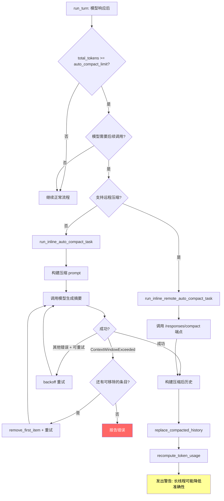
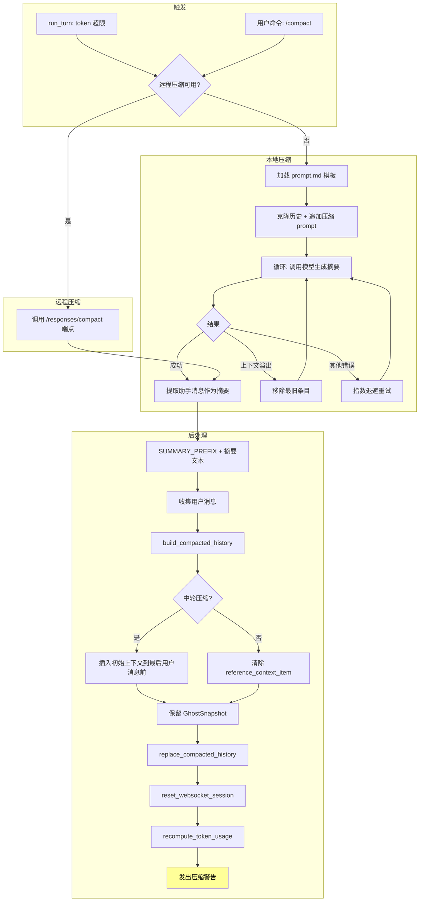

# 第八章 上下文管理与自动压缩

## 概述

大语言模型有一个根本性的约束:上下文窗口有限。当对话历史超出模型的上下文窗口时,要么截断历史(丢失重要信息),要么压缩历史(保留关键信息的摘要)。Codex 选择了后者,实现了一套自动压缩(compaction)系统,在对话过长时自动触发模型摘要,将冗长的历史替换为精炼的总结。

本章分析 Codex 的上下文管理器(`ContextManager`)如何追踪对话历史和 token 使用量,以及自动压缩系统如何在正确的时机触发并执行压缩。

## ContextManager:对话历史管理器

### 结构定义

`ContextManager` 定义在 `core/src/context_manager/history.rs`,是对话历史的核心管理器:

```rust
pub(crate) struct ContextManager {
    items: Vec<ResponseItem>,
    history_version: u64,
    token_info: Option<TokenUsageInfo>,
    reference_context_item: Option<TurnContextItem>,
}
```

**items**:有序的对话历史条目,最旧的在前,最新的在后。每个 `ResponseItem` 可以是用户消息、助手消息、工具调用、工具输出等。

**history_version**:历史版本号,每次历史被改写(压缩、回滚)时递增。下游组件可以通过比较版本号来判断历史是否发生了变化。

**token_info**:来自 API 响应的 token 使用信息,包括 prompt tokens、completion tokens 和上下文窗口大小。

**reference_context_item**:参考上下文快照,用于差异计算和生成模型可见的设置更新条目。当为 `None` 时,下一轮会话将作为无基线处理,触发完整的上下文状态重注入。回滚操作可能会清除此字段。

### record_items():记录历史条目

```rust
pub(crate) fn record_items<I>(&mut self, items: I, policy: TruncationPolicy)
where
    I: IntoIterator,
    I::Item: std::ops::Deref<Target = ResponseItem>,
```

`record_items()` 是历史记录的主入口。它接受一个可迭代的 `ResponseItem` 集合和截断策略,逐条处理并追加到历史中。

处理过程中有两个过滤条件:
1. 条目必须是 API 消息(`is_api_message`)或幽灵快照(`GhostSnapshot`)
2. 每条消息经过 `process_item()` 处理,应用截断策略

`TruncationPolicy` 控制工具输出的截断行为,防止单条巨大的工具输出占据过多上下文空间。

### for_prompt():准备模型输入

```rust
pub(crate) fn for_prompt(mut self, input_modalities: &[InputModality]) -> Vec<ResponseItem>
```

`for_prompt()` 将内部历史转换为可发送给模型的格式。这个方法消耗 `self`(注意是 `mut self` 而非 `&mut self`),返回处理后的条目列表。处理步骤包括:

1. **归一化**:调用 `normalize_history()`,根据输入模态修正历史。如果模型不支持图片输入(`InputModality::Image` 不在列表中),会从消息和工具输出中剥离图片。
2. **移除幽灵快照**:过滤掉所有 `GhostSnapshot` 条目。幽灵快照是内部记账用的,模型不应该看到。
3. 返回清理后的条目列表。

### estimate_token_count():Token 估算

```rust
pub(crate) fn estimate_token_count(&self, turn_context: &TurnContext) -> Option<i64>
```

由于精确的 token 计数需要调用 tokenizer(开销大),Codex 使用基于字节的启发式估算。核心逻辑在 `codex_utils_output_truncation` crate 中:

- `approx_token_count(text)`:根据文本字节数估算 token 数
- `approx_tokens_from_byte_count_i64(bytes)`:从字节数直接转换
- `approx_bytes_for_tokens(tokens)`:反向估算

估算公式考虑了基础指令(system prompt)的 token 数和所有历史条目的 token 数:

```rust
let base_tokens = approx_token_count(&base_instructions.text);
let items_tokens = self.items.iter()
    .map(estimate_item_token_count)
    .fold(0i64, i64::saturating_add);
Some(base_tokens + items_tokens)
```

这是一个粗略的下界估计,不是 tokenizer 级别的精确计数。对于触发压缩的决策来说,这个精度已经足够。

### 历史修改操作

**remove_first_item()**:移除最旧的条目。如果被移除的条目属于调用/输出对(如工具调用和对应的工具输出),还会移除对应的另一半,通过 `normalize::remove_corresponding_for()` 保持历史的一致性。

**remove_last_item()**:移除最新的条目,同样处理调用/输出对。每次移除都递增 `history_version`。

**replace()**:完整替换历史内容。压缩完成后调用此方法,用摘要替换旧历史。递增 `history_version`。

**replace_last_turn_images()**:将最后一轮中的工具输出图片替换为文本占位符。这用于在上下文紧张时减少图片占用的 token 数。

## TotalTokenUsageBreakdown:Token 用量分解

```rust
pub(crate) struct TotalTokenUsageBreakdown {
    pub last_api_response_total_tokens: i64,
    pub all_history_items_model_visible_bytes: i64,
    pub estimated_tokens_of_items_added_since_last_successful_api_response: i64,
    pub estimated_bytes_of_items_added_since_last_successful_api_response: i64,
}
```

这个结构体提供了 token 用量的精细分解:

**last_api_response_total_tokens**:上次 API 响应报告的总 token 数。这是最可靠的数据来源,因为来自服务端的真实计数。

**all_history_items_model_visible_bytes**:所有历史条目的模型可见字节数。这是客户端估算,用于在两次 API 调用之间追踪 token 变化。

**estimated_tokens_of_items_added_since_last_successful_api_response**:自上次成功 API 响应以来新增条目的估算 token 数。这个增量值加上 `last_api_response_total_tokens` 就是当前总 token 用量的估计。

**estimated_bytes_of_items_added_since_last_successful_api_response**:同上,但以字节为单位。

这种分解设计的精妙之处在于:它结合了服务端的精确计数(作为基线)和客户端的增量估算(用于实时追踪),避免了每次都需要调用 API 来获取精确 token 数。

## 自动压缩触发机制

### 触发条件

自动压缩在 `run_turn`(主对话循环)中检查触发。核心条件是:

```
当 total_usage_tokens >= auto_compact_limit 且模型需要后续调用时
```

`auto_compact_limit` 通常设置为模型上下文窗口的某个比例(例如 80%)。只有当模型的响应表明需要继续(例如还有工具调用要执行)时才触发压缩,避免在对话即将结束时做无用的压缩。

### 压缩决策树



## 压缩类型与 InitialContextInjection

### InitialContextInjection 枚举

```rust
pub(crate) enum InitialContextInjection {
    BeforeLastUserMessage,  // 中轮压缩:在最后一条用户消息前注入初始上下文
    DoNotInject,            // 预轮/手动压缩:不注入,下一轮自动重注入
}
```

这个枚举控制压缩后的历史中是否包含初始上下文(system prompt、指令等):

**BeforeLastUserMessage**(中轮压缩):当压缩发生在一轮对话的中间(模型正在执行工具调用),压缩后的历史必须包含初始上下文,因为模型将立即继续工作,不会有重新注入上下文的机会。上下文被插入到最后一条真实用户消息之前。

**DoNotInject**(预轮/手动压缩):当压缩发生在轮次之间或由用户手动触发时,压缩后清除 `reference_context_item`,让下一轮正常对话自动重新注入完整的初始上下文。

### 中轮 vs 预轮压缩

| 特性 | 中轮压缩 | 预轮/手动压缩 |
|------|---------|-------------|
| 触发时机 | 模型需要后续工具调用时 | 轮次开始前或用户命令 |
| InitialContextInjection | `BeforeLastUserMessage` | `DoNotInject` |
| 模型训练预期 | 摘要作为历史末尾项 | 摘要作为历史末尾项 |
| 上下文重注入 | 压缩时手动注入 | 下一轮自动注入 |
| reference_context_item | 保留当前值 | 清除(设为 None) |

## 压缩执行流程

### 入口函数

```rust
// 自动压缩(中轮)
pub(crate) async fn run_inline_auto_compact_task(
    sess: Arc<Session>,
    turn_context: Arc<TurnContext>,
    initial_context_injection: InitialContextInjection,
    reason: CompactionReason,
    phase: CompactionPhase,
) -> CodexResult<()>

// 手动压缩
pub(crate) async fn run_compact_task(
    sess: Arc<Session>,
    turn_context: Arc<TurnContext>,
    input: Vec<UserInput>,
) -> CodexResult<()>
```

自动压缩使用内置的压缩 prompt(从 `templates/compact/prompt.md` 加载),手动压缩则使用用户提供的输入。

### run_compact_task_inner_impl:核心实现

这个函数是压缩的实际执行逻辑:

**步骤 1:准备输入**

```rust
let mut history = sess.clone_history().await;
history.record_items(&[initial_input_for_turn.into()], turn_context.truncation_policy);
```

克隆当前历史并追加压缩 prompt 作为新的用户消息。

**步骤 2:发送给模型并重试循环**

```rust
loop {
    let turn_input = history.clone().for_prompt(&turn_context.model_info.input_modalities);
    let prompt = Prompt { input: turn_input, base_instructions, ... };
    let attempt_result = drain_to_completed(&sess, ..., &prompt).await;
    // 处理结果...
}
```

在循环中调用模型生成摘要。可能的结果:

- **成功**:跳出循环
- **上下文窗口溢出**:如果输入太长,移除最旧的历史条目(`remove_first_item`)并重试。这种逐条移除策略从头部开始,保留前缀缓存(因为大多数 LLM 提供商使用前缀匹配缓存)和近期消息。
- **其他错误**:使用指数退避重试,最多 `max_retries` 次。
- **中断**:直接返回错误。

**步骤 3:构建压缩后历史**

```rust
let summary_suffix = get_last_assistant_message_from_turn(history_items).unwrap_or_default();
let summary_text = format!("{SUMMARY_PREFIX}\n{summary_suffix}");
let user_messages = collect_user_messages(history_items);
let mut new_history = build_compacted_history(Vec::new(), &user_messages, &summary_text);
```

从模型的最后一条助手消息中提取摘要文本,加上 `SUMMARY_PREFIX`(从 `templates/compact/summary_prefix.md` 加载)构成完整摘要。

新历史包含:
1. 收集的用户消息(保留用户输入的上下文)
2. 摘要文本(作为压缩后的对话记录)

**步骤 4:注入初始上下文(如需)**

```rust
if matches!(initial_context_injection, InitialContextInjection::BeforeLastUserMessage) {
    let initial_context = sess.build_initial_context(turn_context.as_ref()).await;
    new_history = insert_initial_context_before_last_real_user_or_summary(
        new_history, initial_context
    );
}
```

中轮压缩时,在最后一条真实用户消息之前插入初始上下文。

**步骤 5:保留幽灵快照**

```rust
let ghost_snapshots: Vec<ResponseItem> = history_items.iter()
    .filter(|item| matches!(item, ResponseItem::GhostSnapshot { .. }))
    .cloned()
    .collect();
new_history.extend(ghost_snapshots);
```

幽灵快照(GhostSnapshot)在压缩中被保留——它们不发送给模型(在 `for_prompt` 中被过滤),但用于内部状态追踪。

**步骤 6:替换历史并更新状态**

```rust
sess.replace_compacted_history(new_history, reference_context_item, compacted_item).await;
client_session.reset_websocket_session();
sess.recompute_token_usage(&turn_context).await;
```

原子地替换历史,重置 WebSocket 会话(确保增量请求追踪不被旧状态污染),重新计算 token 用量。

最后发出一条警告:"长线程和多次压缩可能降低模型准确性。建议尽可能开始新线程。"

## 远程压缩

### should_use_remote_compact_task

```rust
pub(crate) fn should_use_remote_compact_task(provider: &ModelProviderInfo) -> bool {
    provider.supports_remote_compaction()
}
```

当模型提供商支持远程压缩时(例如通过 `/responses/compact` API 端点),优先使用远程压缩。远程压缩将摘要生成的工作交给服务端,有几个优势:

1. 服务端可以使用更优的压缩策略
2. 减少客户端的 token 消耗
3. 可能利用服务端的缓存

远程压缩的函数签名与本地压缩对称:

```rust
// 远程自动压缩
pub(crate) async fn run_inline_remote_auto_compact_task(...)
// 远程手动压缩
pub(crate) async fn run_remote_compact_task(...)
```

### 远程压缩内部实现

`compact_remote.rs` 中的 `run_remote_compact_task_inner()` 与本地版本结构类似,但不需要构建压缩 prompt——而是通过模型客户端的压缩端点发送当前历史,由服务端返回压缩后的结果。

## COMPACT_USER_MESSAGE_MAX_TOKENS

```rust
const COMPACT_USER_MESSAGE_MAX_TOKENS: usize = 20_000;
```

这个常量限制了压缩 prompt 中用户消息的最大 token 数。当对话历史非常长时,压缩 prompt 本身也可能很长。20,000 token 的上限确保压缩请求本身不会超出模型的上下文窗口,同时提供足够的空间让模型理解需要压缩的内容。

## 压缩 Prompt 模板

压缩系统使用两个模板文件:

**templates/compact/prompt.md**:压缩指令,告诉模型如何将对话历史压缩为简洁的摘要。通过 `include_str!` 在编译时嵌入:

```rust
pub const SUMMARIZATION_PROMPT: &str = include_str!("../templates/compact/prompt.md");
```

**templates/compact/summary_prefix.md**:摘要前缀,添加在模型生成的摘要文本之前,为压缩后的历史提供结构化的开头:

```rust
pub const SUMMARY_PREFIX: &str = include_str!("../templates/compact/summary_prefix.md");
```

## 分析追踪

`CompactionAnalyticsAttempt` 结构体记录压缩操作的分析数据:

```rust
pub(crate) struct CompactionAnalyticsAttempt {
    enabled: bool,
    thread_id: String,
    turn_id: String,
    trigger: CompactionTrigger,      // Auto | Manual
    reason: CompactionReason,        // UserRequested | ContextLimit | ...
    implementation: CompactionImplementation, // Responses | Remote
    phase: CompactionPhase,          // StandaloneTurn | MidTurn
    active_context_tokens_before: i64,
    started_at: u64,
    start_instant: Instant,
}
```

每次压缩操作都会记录:
- **触发方式**(`CompactionTrigger`):自动还是手动
- **原因**(`CompactionReason`):用户请求、上下文限制等
- **实现**(`CompactionImplementation`):本地 Responses 还是远程
- **阶段**(`CompactionPhase`):独立轮次还是中轮
- **压缩前后的 token 数**:用于衡量压缩效果

通过 `track()` 方法将分析事件发送到分析服务:

```rust
pub(crate) async fn track(self, sess: &Session, status: CompactionStatus, error: Option<String>) {
    let active_context_tokens_after = sess.get_total_token_usage().await;
    sess.services.analytics_events_client.track_compaction(CodexCompactionEvent { ... });
}
```

## 压缩流程图



## 核心文件索引

| 文件 | 职责 |
|------|------|
| `codex-rs/core/src/context_manager/history.rs` | ContextManager 主体:历史管理、token 估算、for_prompt |
| `codex-rs/core/src/context_manager/mod.rs` | 模块导出和公共辅助函数 |
| `codex-rs/core/src/context_manager/normalize.rs` | 历史归一化:移除孤立条目、修复调用/输出对 |
| `codex-rs/core/src/context_manager/updates.rs` | 上下文更新处理 |
| `codex-rs/core/src/compact.rs` | 本地压缩实现:prompt 构建、模型调用、历史替换 |
| `codex-rs/core/src/compact_remote.rs` | 远程压缩实现:通过 API 端点压缩 |
| `codex-rs/core/src/tasks/compact.rs` | 压缩任务调度 |
| `codex-rs/core/templates/compact/prompt.md` | 压缩指令模板 |
| `codex-rs/core/templates/compact/summary_prefix.md` | 摘要前缀模板 |

## 设计洞察

### 为什么不直接截断?

截断(丢弃最旧的消息)是最简单的策略,但会导致严重的上下文丢失。AI 代理的对话中,早期消息往往包含关键的项目背景、用户偏好和架构决策。压缩通过模型自身的理解力提取关键信息,保留了这些重要上下文。

### 渐进式降级

当压缩本身遇到上下文窗口溢出时,系统会逐条从头部移除历史条目,直到压缩 prompt 能放入上下文窗口。这种渐进式降级确保压缩操作本身不会因为历史太长而失败。

### 缓存感知的移除顺序

从历史头部(最旧)开始移除条目是刻意的设计。大多数 LLM 提供商使用前缀匹配缓存——保留头部的条目意味着后续请求更可能命中缓存。但当需要移除时,最旧的条目通常信息密度最低(因为它们的内容已被后续对话吸收),所以从头部移除是合理的。

### 幽灵快照的保留

`GhostSnapshot` 在压缩中被保留但对模型不可见。这是因为它们服务于客户端内部的状态追踪(如差异计算),与对话内容无关。在 `for_prompt()` 中被过滤掉确保不浪费 token,而在压缩后保留确保内部状态一致。
