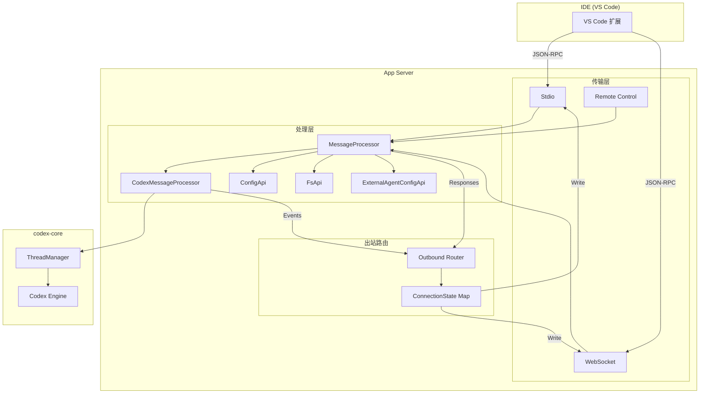

# 第十章 App Server 与 IDE 集成

## 10.1 什么是 App Server

App Server 是 Codex 面向 IDE（主要是 VS Code）的集成层。它将 codex-core 的全部能力封装为 JSON-RPC 服务，通过 HTTP、WebSocket 或标准输入输出（stdio）向外暴露。IDE 扩展作为 JSON-RPC 客户端连接到 App Server，发送请求（如"创建线程"、"开始对话轮次"、"列出技能"），接收响应和通知（如"轮次完成"、"文件变更"）。

从架构角色上看，App Server 处于三层结构的中间位置：

```
IDE 扩展 (VS Code)
    |  JSON-RPC over stdio / WebSocket
    v
App Server (app-server crate)
    |  Rust API 调用
    v
codex-core (核心引擎)
```

App Server 的设计目标有三个：
1. **协议隔离**：IDE 不需要知道 codex-core 的内部结构，只需要理解 JSON-RPC 协议。
2. **多连接支持**：WebSocket 模式下支持多个客户端同时连接。
3. **双向通信**：服务端可以主动向客户端推送通知（如审批请求、状态变更）。

## 10.2 传输层：三种模式

App Server 支持三种传输模式，由 `AppServerTransport` 枚举定义：

```rust
pub enum AppServerTransport {
    Stdio,                          // VS Code 默认模式
    WebSocket { bind_address: ... },// 独立服务模式
    Off,                           // 仅 Remote Control
}
```

### Stdio 模式

VS Code 扩展将 App Server 作为子进程启动，通过 stdin/stdout 交换 JSON-RPC 消息。这是最简单、最可靠的集成方式：

- 单客户端模式（`single_client_mode = true`）
- 客户端断开时服务器自动退出（`shutdown_when_no_connections = true`）
- 不需要端口绑定或认证

启动时调用 `start_stdio_connection()`，在 stdin/stdout 上建立一条 JSON-RPC 连接。

### WebSocket 模式

独立运行的 App Server 监听一个地址，接受 WebSocket 连接：

- 多客户端模式，支持并发连接
- 支持优雅信号重启（`graceful_signal_restart_enabled = true`）
- 可配置 WebSocket 认证策略（`AppServerWebsocketAuthSettings`）

启动时调用 `start_websocket_acceptor()`，在指定地址上接受新连接。

### Off 模式

不启动任何主动传输，仅通过 Remote Control 通道接受连接。这种模式用于远程控制场景，App Server 通过 ChatGPT 后端建立反向连接。

无论哪种模式，Remote Control 总是会尝试启动（如果 Feature::RemoteControl 已启用）。如果既没有传输层也没有 Remote Control，服务器会报错退出。

## 10.3 主循环架构

App Server 的核心入口是 `run_main_with_transport()`（lib.rs:355），整个启动流程分为三个阶段。

### 阶段一：初始化

```
config 加载 → 执行策略检查 → OTEL/tracing/feedback 初始化 → 状态数据库
```

初始化过程：

1. **配置加载**：通过 `ConfigBuilder` 两次构建配置。第一次用于预加载云端需求（cloud requirements），第二次合并云端需求后生成最终配置。配置错误不会阻塞启动，而是记录为 `ConfigWarningNotification` 后续推送给客户端。

2. **可观测性**：构建 OTEL provider、tracing subscriber（支持 JSON 和默认格式，由 `LOG_FORMAT` 环境变量控制）、feedback 层、日志数据库层。所有层通过 `tracing_subscriber::registry()` 组合。

3. **状态数据库**：初始化 SQLite（`StateRuntime::init`），用于线程持久化和日志存储。

### 阶段二：传输启动

根据传输模式启动对应的连接接受器，并始终尝试启动 Remote Control。

### 阶段三：双循环运行

这是 App Server 最核心的设计——**双循环架构**：

```
                    TransportEvent
                    (连接建立/消息到达)
                         |
                         v
                  +--------------+
                  | 处理器循环    |  (processor_handle)
                  | Processor    |
                  | Loop         |
                  +------+-------+
                         |
                    OutgoingEnvelope
                    OutboundControlEvent
                         |
                         v
                  +--------------+
                  | 出站路由循环  |  (outbound_handle)
                  | Outbound     |
                  | Router Loop  |
                  +--------------+
                         |
                         v
                    写入 WebSocket / stdout
```

#### 处理器循环（Processor Loop）

处理器循环通过 `transport_event_rx` 接收传输层事件，主要处理三类事件：

- **ConnectionOpened**：新客户端连接。创建 `ConnectionState`（包含初始化标志、实验性 API 标志、通知过滤集合），同时通过 `OutboundControlEvent::Opened` 通知出站路由循环。
- **InboundMessage**：客户端发来的 JSON-RPC 消息。分派到 `MessageProcessor::process_inbound()` 处理。
- **ConnectionClosed**：客户端断开。清理连接状态，检查是否需要关闭服务器。

此外还处理两个辅助信号：
- **thread_created_rx**：新线程创建后注册线程状态监听。
- **running_turn_count_rx**：监控正在运行的轮次数量，用于优雅关闭。

#### 出站路由循环（Outbound Router Loop）

出站路由循环维护一个 `HashMap<ConnectionId, OutboundConnectionState>`，通过两个通道接收数据：

1. **outbound_control_rx**：接收连接管理事件（`OutboundControlEvent`）
   - `Opened`：注册新连接的写入端
   - `Closed`：移除连接
   - `DisconnectAll`：优雅关闭时断开所有连接

2. **outgoing_rx**：接收要发送给客户端的消息（`OutgoingEnvelope`）。通过 `route_outgoing_envelope()` 根据消息的目标连接 ID 将消息写入对应连接。

#### OutboundControlEvent 协调

`OutboundControlEvent` 是连接两个循环的桥梁。当处理器循环检测到新连接时，它需要告诉出站路由循环"这里有一个新的写入端可以用了"。这个设计将连接的读端和写端分离：

- 读端在处理器循环中处理入站消息
- 写端在出站路由循环中处理出站消息
- 两个循环通过 `Arc<AtomicBool>` 共享连接状态（initialized、experimental_api_enabled）

### 优雅关闭

`ShutdownState` 管理关闭流程。在 WebSocket 模式下，收到 SIGTERM 时：
1. 进入 `Requested` 状态
2. 等待所有运行中的轮次完成
3. 断开所有连接
4. 退出

## 10.4 连接管理

每个连接由 `ConnectionId`（`u64`）标识，关联一个 `ConnectionState`：

```rust
struct ConnectionState {
    initialized: Arc<AtomicBool>,              // 是否完成 initialize 握手
    experimental_api_enabled: Arc<AtomicBool>, // 是否启用实验性 API
    opted_out_notification_methods: Arc<RwLock<HashSet<String>>>, // 通知过滤
}
```

连接状态在处理器循环和出站路由循环之间共享：
- `initialized`：客户端必须先发送 `initialize` 请求，之后才能发送其他请求。出站路由也会检查此标志，未初始化的连接不会收到大部分通知。
- `experimental_api_enabled`：客户端在 `initialize` 时声明是否支持实验性 API。标记为 `#[experimental]` 的方法只有在此标志为 true 时才允许调用。
- `opted_out_notification_methods`：客户端可以声明不希望收到哪些通知方法，出站路由会据此过滤。

出站侧有对应的 `OutboundConnectionState`，持有实际的消息写入器（`writer`）和断开连接的 sender。

## 10.5 MessageProcessor：请求调度中心

`MessageProcessor`（message_processor.rs）是入站请求的中央调度器，组合了四个子处理器：

```rust
struct MessageProcessor {
    codex: CodexMessageProcessor,    // 核心业务逻辑
    config_api: ConfigApi,           // 配置读写
    fs_api: FsApi,                   // 文件系统操作
    external_agent: ExternalAgentConfigApi, // 外部代理配置
    // + fs_watch, auth_manager, analytics 等
}
```

`MessageProcessor` 负责：

1. **请求解析**：将 JSON-RPC 消息解析为 `ClientRequest` 或 `ClientNotification`。
2. **权限检查**：检查连接是否已初始化、是否有实验性 API 权限。
3. **路由分派**：根据方法名将请求路由到对应的子处理器。
4. **响应封装**：将子处理器返回的结果封装为 `JSONRPCResponse` 或 `JSONRPCError`。

初始化（`initialize` 请求）的处理比较特殊：它直接在 `MessageProcessor` 中完成，设置连接的初始化标志、返回服务器能力声明（`InitializeResponse`）、推送积压的配置警告和状态通知。

### ThreadManager 集成

`MessageProcessor` 创建并持有 `codex_core::ThreadManager`，这是管理所有对话线程生命周期的核心组件。线程创建时通过 `thread_created_tx` 通知处理器循环，以便注册线程状态监听。

## 10.6 CodexMessageProcessor：协议翻译层

`CodexMessageProcessor`（codex_message_processor.rs，约 10,440 行）是 App Server 中最大、最复杂的组件。它是 JSON-RPC 协议与 codex-core 之间的翻译层，处理所有与"对话"相关的业务逻辑。

### 线程生命周期管理

```
thread/start   → 创建新线程，加载配置，启动 MCP 服务
thread/resume  → 恢复已有线程（从持久化存储加载）
thread/fork    → 复制线程（创建分支对话）
thread/archive → 归档线程（保留状态但释放资源）
thread/unarchive → 取消归档
thread/rollback → 回滚到指定消息点
thread/list    → 列出所有线程（从持久化存储）
thread/loaded/list → 列出当前加载在内存中的线程
thread/read    → 读取线程消息历史
```

每个活跃线程由 `CodexThread` 表示，包含：
- codex-core 的 `Codex` 实例
- MCP 连接管理器（`McpConnectionManager`）
- 技能加载结果
- 线程配置
- 事件处理通道

`ThreadManager` 管理线程的创建、恢复、归档、和资源清理。

### 轮次管理

```
turn/start     → 开始新的对话轮次（发送用户消息，等待助手回复）
turn/steer     → 在轮次进行中追加指导消息
turn/interrupt → 中断正在运行的轮次
```

轮次是用户与助手之间的一次交互。`turn/start` 会：
1. 构建用户消息（可包含文本、图像、文件引用）
2. 注入技能上下文
3. 启动 codex-core 的对话循环
4. 通过通知流式推送助手的回复、工具调用、审批请求等事件

### 其他功能域

- **Skills/Plugins**：技能列出、配置写入、插件安装/卸载
- **MCP**：MCP 服务器状态查询、刷新
- **文件搜索**：模糊文件搜索（`FuzzyFileSearchSession`）
- **审批**：工具调用审批决策的中继
- **Realtime**：实验性实时语音/文本交互

### 事件流转

CodexMessageProcessor 的核心工作模式是"事件翻译"：

```
codex-core Event → 翻译为 ServerNotification → 推送到出站通道
```

codex-core 通过事件通道推送各种事件（消息增量、工具调用、完成状态等），CodexMessageProcessor 将这些事件翻译为协议定义的通知类型，通过 `OutgoingMessageSender` 推送到出站路由循环。

## 10.7 Protocol v2：类型定义层

`app-server-protocol` crate 定义了 App Server 协议的全部类型，位于 `protocol/v2.rs`（约 8,773 行）。

### 设计特点

1. **serde camelCase**：所有类型使用 `#[serde(rename_all = "camelCase")]`，确保 JSON 字段名符合 JavaScript/TypeScript 惯例。
2. **ts-rs 导出**：类型标注 `#[ts(export)]`，通过 ts-rs 自动生成 TypeScript 类型定义，保证 IDE 扩展与 Rust 服务端的类型一致性。
3. **版本化**：协议定义按版本组织，v2 是当前版本。

### CodexErrorInfo 枚举

协议定义了丰富的错误类型，用于精确描述错误场景：

| 错误类型 | 含义 |
|---------|------|
| `ContextWindowExceeded` | 上下文窗口已满 |
| `UsageLimitExceeded` | 使用配额已用尽 |
| `ServerOverloaded` | 服务端过载 |
| `HttpConnectionFailed` | HTTP 连接失败 |
| `Unauthorized` | 认证失败 |
| `ConfigInvalid` | 配置无效 |
| `ProviderError` | 模型提供方返回错误 |

这些错误类型允许 IDE 扩展根据具体错误类型提供针对性的用户提示。

## 10.8 RPC 方法全表

App Server 的所有 RPC 方法定义在 `app-server-protocol/src/protocol/common.rs`（第 230 行起），通过宏声明。以下是完整方法列表：

### 线程管理

| 方法 | 说明 |
|------|------|
| `thread/start` | 创建新线程 |
| `thread/resume` | 恢复已有线程 |
| `thread/fork` | 复制线程 |
| `thread/archive` | 归档线程 |
| `thread/unarchive` | 取消归档 |
| `thread/rollback` | 回滚到指定点 |
| `thread/unsubscribe` | 取消订阅线程事件 |
| `thread/name/set` | 设置线程名称 |
| `thread/metadata/update` | 更新线程元数据 |
| `thread/memoryMode/set` | 设置记忆模式（实验性） |
| `thread/compact/start` | 开始上下文压缩 |
| `thread/shellCommand` | 在线程中执行 shell 命令 |
| `thread/backgroundTerminals/clean` | 清理后台终端（实验性） |
| `thread/list` | 列出所有线程 |
| `thread/loaded/list` | 列出已加载线程 |
| `thread/read` | 读取线程历史 |
| `thread/inject_items` | 注入消息项 |
| `thread/increment_elicitation` | 增加征询计数（实验性） |
| `thread/decrement_elicitation` | 减少征询计数（实验性） |

### 轮次管理

| 方法 | 说明 |
|------|------|
| `turn/start` | 开始对话轮次 |
| `turn/steer` | 追加指导消息 |
| `turn/interrupt` | 中断当前轮次 |

### 实时交互（实验性）

| 方法 | 说明 |
|------|------|
| `thread/realtime/start` | 开始实时会话 |
| `thread/realtime/appendAudio` | 追加音频数据 |
| `thread/realtime/appendText` | 追加文本数据 |
| `thread/realtime/stop` | 停止实时会话 |
| `thread/realtime/listVoices` | 列出可用语音 |

### 技能与插件

| 方法 | 说明 |
|------|------|
| `skills/list` | 列出可用技能 |
| `skills/config/write` | 写入技能配置 |
| `plugin/list` | 列出已安装插件 |
| `plugin/read` | 读取插件详情 |
| `plugin/install` | 安装插件 |
| `plugin/uninstall` | 卸载插件 |

### 文件系统

| 方法 | 说明 |
|------|------|
| `fs/readFile` | 读取文件 |
| `fs/writeFile` | 写入文件 |
| `fs/createDirectory` | 创建目录 |
| `fs/getMetadata` | 获取文件元信息 |
| `fs/readDirectory` | 读取目录 |
| `fs/remove` | 删除文件/目录 |
| `fs/copy` | 复制文件 |
| `fs/watch` | 监听文件变更 |
| `fs/unwatch` | 取消文件监听 |

### 配置与模型

| 方法 | 说明 |
|------|------|
| `config/read` | 读取配置 |
| `config/value/write` | 写入配置值 |
| `config/batchWrite` | 批量写入配置 |
| `config/mcpServer/reload` | 重新加载 MCP 服务器配置 |
| `model/list` | 列出可用模型 |

### 服务端通知

服务端主动推送的通知包括：

| 通知 | 说明 |
|------|------|
| `thread/started` | 线程已创建 |
| `thread/status/changed` | 线程状态变更 |
| `thread/archived` | 线程已归档 |
| `thread/unarchived` | 线程已取消归档 |
| `thread/closed` | 线程已关闭 |
| `thread/name/updated` | 线程名称已更新 |
| `thread/tokenUsage/updated` | Token 用量更新 |
| `thread/compacted` | 上下文已压缩 |
| `turn/started` | 轮次已开始 |
| `turn/completed` | 轮次已完成 |
| `turn/diff/updated` | 差异更新 |
| `turn/plan/updated` | 计划更新 |
| `skills/changed` | 技能变更 |
| `fs/changed` | 文件系统变更 |
| `model/rerouted` | 模型已重路由 |

## 10.9 客户端实现

App Server 提供两种客户端实现，用于不同的集成场景。

### InProcessAppServerClient

`InProcessAppServerClient`（in_process.rs）用于 TUI（终端界面）场景。TUI 和 App Server 运行在同一进程中，通过内存通道直接通信，无需序列化/反序列化开销。

这种设计使 TUI 能够复用 App Server 的全部协议和业务逻辑，而不是直接调用 codex-core API。统一的协议层确保了 TUI 和 IDE 扩展的行为一致性。

### RemoteAppServerClient

`RemoteAppServerClient`（位于 `app-server-client` crate）通过 WebSocket 连接远程 App Server。IDE 扩展使用这种客户端，它处理：

- WebSocket 连接建立和断线重连
- JSON-RPC 消息的序列化/反序列化
- 请求/响应的匹配（通过请求 ID）
- 通知的异步分发

## 10.10 架构总览



## 10.11 关键文件索引

| 文件 | 行数 | 职责 |
|------|------|------|
| `app-server/src/main.rs` | - | 可执行入口，解析 CLI 参数 |
| `app-server/src/lib.rs` | ~931 | 主循环：初始化、传输启动、双循环架构 |
| `app-server/src/message_processor.rs` | ~1,232 | 请求调度中心，组合子处理器 |
| `app-server/src/codex_message_processor.rs` | ~10,440 | 核心翻译层，线程/轮次/技能/MCP 等全部业务 |
| `app-server/src/transport/` | - | Stdio、WebSocket、Remote Control 传输实现 |
| `app-server/src/in_process.rs` | - | TUI 内嵌客户端 |
| `app-server/src/config_api.rs` | - | 配置读写 API |
| `app-server/src/fs_api.rs` | - | 文件系统 API |
| `app-server/src/outgoing_message.rs` | - | ConnectionId、OutgoingEnvelope、OutgoingMessageSender |
| `app-server-protocol/src/protocol/v2.rs` | ~8,773 | 协议 v2 全部类型定义（serde + ts-rs） |
| `app-server-protocol/src/protocol/common.rs` | - | RPC 方法名注册宏 |
| `app-server-client/` | - | RemoteAppServerClient（WebSocket 客户端） |

## 10.12 小结

App Server 是 Codex 对外集成的核心组件。它通过双循环架构实现了入站请求处理和出站消息路由的解耦，通过 `OutboundControlEvent` 协调两个循环的连接状态。`MessageProcessor` 作为调度中心将请求路由到四个子处理器，其中 `CodexMessageProcessor` 承担了绝大部分业务逻辑。协议层通过 serde + ts-rs 实现了 Rust 与 TypeScript 类型的双向同步，保证了 IDE 扩展与服务端的类型安全性。
