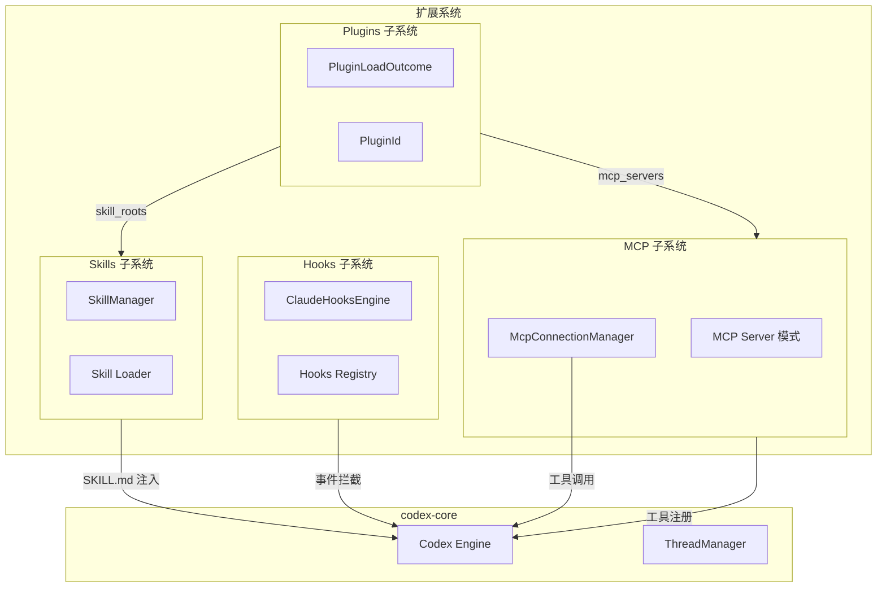

# 第十一章 扩展系统

Codex 的扩展系统由四个子系统组成：MCP（Model Context Protocol）、Hooks（钩子）、Plugins（插件）、Skills（技能）。它们各自独立又相互协作，共同构成了 Codex 的可扩展性架构。



## 11.1 MCP（Model Context Protocol）

MCP 是 Codex 与外部工具服务交互的标准协议。Codex 既是 MCP 客户端（连接外部 MCP 服务器使用其工具），也是 MCP 服务器（将自身能力暴露给其他 MCP 客户端）。

### 11.1.1 Codex 作为 MCP 客户端

#### McpConnectionManager

`McpConnectionManager`（codex-mcp/src/mcp_connection_manager.rs，约 1,773 行）是 MCP 客户端侧的核心组件。它管理到所有已配置 MCP 服务器的连接。

内部数据结构：

```rust
struct McpConnectionManager {
    clients: HashMap<String, AsyncManagedClient>,  // server_name → client
    tool_filter: HashMap<String, ToolFilter>,       // 工具过滤规则
    // ...
}
```

其中 `AsyncManagedClient` 封装了 `codex_rmcp_client::RmcpClient`，提供异步的 MCP 协议操作。

#### 工具命名规范

MCP 工具在模型可见的名称空间中使用全限定名：

```
mcp__<server_name>__<tool_name>
```

分隔符是双下划线 `__`。例如，名为 `github` 的 MCP 服务器提供的 `search_repos` 工具，其全限定名为 `mcp__github__search_repos`。

这个命名方案由 `mcp_tool_names.rs` 中的 `qualify_tools()` 函数实现，它将每个 MCP 服务器返回的原始工具列表转换为全限定名映射。

#### 连接生命周期

MCP 客户端的连接建立遵循以下流程：

```
配置解析 → 创建客户端实例 → JoinSet 并行启动 → 广播状态
```

详细步骤：

1. **配置解析**：从 Codex 配置和插件中收集所有 MCP 服务器配置。每个配置包含服务器名称、启动命令或 URL、环境变量、工具过滤规则等。`McpServerConfig` 结构体包含：
   - `enabled`：是否启用
   - `required`：是否必需（启动失败时是否阻塞）
   - `timeouts`：超时配置
   - `tool_filters`：工具白名单/黑名单

2. **创建客户端**：为每个已启用的 MCP 服务器创建 `RmcpClient` 实例。客户端支持两种传输方式：
   - **stdio**：启动子进程，通过 stdin/stdout 通信
   - **SSE/Streamable HTTP**：通过 HTTP 连接远程 MCP 服务器

3. **并行启动**：使用 Tokio 的 `JoinSet` 并行启动所有 MCP 客户端。每个客户端独立进行 MCP 协议握手（`initialize` 请求），获取服务器能力声明。

4. **广播状态**：启动过程中通过事件通道广播每个服务器的状态变更：
   - `McpStartupUpdateEvent`：单个服务器状态更新
   - `McpStartupCompleteEvent`：所有服务器启动完成
   - `McpStartupFailure`：服务器启动失败

#### 工具注册

连接建立后，工具注册流程：

```
RmcpClient → initialize() → list_tools() → ToolFilter 过滤 → 全限定名映射
```

1. 调用 `list_tools()` 获取服务器提供的所有工具。
2. 对每个工具应用 `ToolFilter`（支持白名单和黑名单模式）。
3. 通过 `qualify_tools()` 生成全限定名，注册到全局工具表中。

`ToolFilter` 支持两种模式：
- **白名单（allowlist）**：只允许指定的工具通过
- **黑名单（blocklist）**：排除指定的工具，允许其余工具

#### 工具调用

当模型请求调用一个 MCP 工具时，调用流程：

```
模型请求 mcp__github__search_repos
    → 解析全限定名，提取 server_name = "github", tool_name = "search_repos"
    → 在 clients 中查找 "github" 对应的客户端
    → 检查 ToolFilter 是否允许
    → 调用 client.call_tool("search_repos", arguments)
    → 返回结果
```

`call_tool()` 是 `McpConnectionManager` 的核心方法，处理工具调用的全部逻辑：参数验证、超时处理、错误封装。

#### Elicitation（征询）

MCP 协议支持 Elicitation 机制，允许 MCP 服务器在执行工具调用时向用户请求额外信息。

`ElicitationRequestManager` 使用 `oneshot` 通道管理征询请求：

```
MCP 服务器发起征询
    → McpConnectionManager 创建 oneshot channel
    → 通过事件通道将征询请求推送到 UI
    → 用户响应后通过 oneshot sender 返回结果
    → McpConnectionManager 将结果回传给 MCP 服务器
```

`ElicitationResponse` 包含用户的决定（接受/拒绝）和可选的表单数据。

### 11.1.2 Codex 作为 MCP 服务器

`mcp-server` crate 将 Codex 自身的工具能力暴露为 MCP 服务器。

#### 架构

```
外部 MCP 客户端
    |  stdio JSON-RPC
    v
mcp-server::MessageProcessor
    |
    v
codex_tool_runner → 工具执行
```

MCP 服务器通过 stdio 接收 JSON-RPC 请求，使用自己的 `MessageProcessor`（不同于 App Server 的同名结构）来调度请求。

#### 工具执行

`codex_tool_runner` 模块负责执行工具调用。它将 MCP 的 `call_tool` 请求翻译为 Codex 内部的工具执行逻辑。

#### 审批

MCP 服务器模式下的工具执行同样受安全策略约束：
- `exec_approval.rs`：命令执行审批
- `patch_approval.rs`：文件修改审批

这些审批机制确保外部 MCP 客户端不能绕过 Codex 的安全策略。

#### 工具处理器

`tool_handlers/` 目录包含各个工具的具体实现。每个工具处理器实现从 MCP 请求参数到实际操作的转换。

### 11.1.3 MCP 配置

MCP 服务器配置通过 Codex 的配置系统管理，支持多层级：

```toml
[mcpServers.github]
command = "github-mcp-server"
args = ["--token", "$GITHUB_TOKEN"]
enabled = true
required = false

[mcpServers.github.toolFilter]
type = "allowlist"
tools = ["search_repos", "get_file"]
```

配置支持动态重载（通过 `config/mcpServer/reload` RPC 方法）。

### 11.1.4 关键文件

| 文件 | 行数 | 职责 |
|------|------|------|
| `codex-mcp/src/mcp_connection_manager.rs` | ~1,773 | MCP 客户端连接管理器 |
| `codex-mcp/src/mcp_tool_names.rs` | - | 工具全限定名生成 |
| `codex-mcp/src/mcp/` | - | MCP 配置、工具过滤等 |
| `mcp-server/src/main.rs` | - | MCP 服务器入口 |
| `mcp-server/src/message_processor.rs` | - | MCP 服务器请求调度 |
| `mcp-server/src/codex_tool_runner.rs` | - | 工具执行 |
| `mcp-server/src/tool_handlers/` | - | 各工具处理器 |
| `rmcp-client/` | - | RMCP 客户端封装 |

## 11.2 Hooks 系统

Hooks 系统允许用户在 Codex 的关键事件点注入自定义逻辑。它通过 shell 命令执行钩子脚本，实现"事件→外部处理→决策反馈"的扩展模式。

### 11.2.1 事件类型

Hooks 系统定义了五种事件类型：

| 事件 | 触发时机 | 可以做什么 |
|------|---------|-----------|
| `SessionStart` | 会话启动时 | 初始化检查、环境设置 |
| `PreToolUse` | 工具调用前 | 审批/拦截工具调用 |
| `PostToolUse` | 工具调用后 | 结果检查、日志记录 |
| `UserPromptSubmit` | 用户提交提示时 | 输入过滤、预处理 |
| `Stop` | 助手停止时 | 清理、通知 |

每种事件有对应的 Request 和 Outcome 类型：
- `SessionStartRequest` / `SessionStartOutcome`
- `PreToolUseRequest` / `PreToolUseOutcome`
- `PostToolUseRequest` / `PostToolUseOutcome`
- `UserPromptSubmitRequest` / `UserPromptSubmitOutcome`
- `StopRequest` / `StopOutcome`

### 11.2.2 Hooks Registry

`Hooks` 结构体（hooks/src/registry.rs:31）是钩子系统的入口：

```rust
pub struct Hooks {
    after_agent: Vec<Hook>,          // 遗留的代理后钩子
    after_tool_use: Vec<Hook>,       // 遗留的工具后钩子
    engine: ClaudeHooksEngine,       // 新的钩子引擎
}
```

`Hooks` 维护两套机制：
- **遗留钩子**（`after_agent`、`after_tool_use`）：通过配置的 `legacy_notify_argv` 指定外部命令
- **新引擎**（`ClaudeHooksEngine`）：基于配置层的完整钩子系统

`Hooks::new()` 从 `HooksConfig` 初始化，`HooksConfig` 包含：
- `legacy_notify_argv`：遗留通知命令
- `feature_enabled`：是否启用新钩子引擎
- `config_layer_stack`：配置层，钩子引擎从中发现钩子定义
- `shell_program` / `shell_args`：执行钩子命令时使用的 shell

### 11.2.3 HookPayload

每次钩子调用都携带一个 `HookPayload`：

```rust
pub struct HookPayload {
    pub session_id: ThreadId,         // 当前会话 ID
    pub cwd: AbsolutePathBuf,         // 工作目录
    pub client: Option<String>,       // 客户端标识
    pub triggered_at: DateTime<Utc>,  // 触发时间
    pub hook_event: HookEvent,        // 具体事件数据
}
```

`HookPayload` 序列化为 JSON 后通过 stdin 传递给钩子脚本。

### 11.2.4 Hook I/O 协议

钩子的执行遵循标准的管道 I/O 协议：

```
Codex → JSON stdin → shell 命令 → JSON stdout → Codex
```

**输入**：`HookPayload` 的 JSON 序列化，包含事件类型、会话信息、相关上下文。

**输出**：钩子脚本返回 JSON，包含决策信息。不同事件类型有不同的输出模式：

**PreToolUse 输出**：
```json
{
  "decision": "approve" | "block" | "ask",
  "reason": "可选的原因说明"
}
```
- `approve`：自动批准工具调用
- `block`：阻止工具调用
- `ask`：交给用户决定

**PostToolUse 输出**：
```json
{
  "decision": "allow" | "deny",
  "reason": "可选的原因说明"
}
```
- `allow`：接受工具执行结果
- `deny`：拒绝结果（标记为失败）

### 11.2.5 HookResult 与执行流

`HookResult` 定义了钩子执行的三种结果：

```rust
pub enum HookResult {
    Success,                                        // 成功
    FailedContinue(Box<dyn Error + Send + Sync>),  // 失败但继续后续钩子
    FailedAbort(Box<dyn Error + Send + Sync>),     // 失败并中止操作
}
```

钩子按顺序执行。如果某个钩子返回 `FailedAbort`，后续钩子不再执行，操作被中止。

### 11.2.6 ClaudeHooksEngine

`ClaudeHooksEngine`（hooks/src/engine/）是新的钩子执行引擎，组件包括：

| 文件 | 职责 |
|------|------|
| `mod.rs` | 引擎主结构体 |
| `config.rs` | 从配置层发现钩子定义 |
| `discovery.rs` | 钩子发现逻辑 |
| `dispatcher.rs` | 钩子分发和执行 |
| `command_runner.rs` | shell 命令执行器 |
| `output_parser.rs` | 输出 JSON 解析 |
| `schema_loader.rs` | 输出 schema 加载 |

引擎支持两种操作模式：
- **preview**：预览将要执行哪些钩子（不实际执行），用于 UI 展示
- **run**：实际执行钩子

### 11.2.7 关键文件

| 文件 | 行数 | 职责 |
|------|------|------|
| `hooks/src/registry.rs` | ~163 | Hooks 注册表入口 |
| `hooks/src/types.rs` | ~292 | Hook、HookPayload、HookResult 等类型 |
| `hooks/src/engine/` | - | ClaudeHooksEngine 实现 |
| `hooks/src/events/` | - | 各事件类型的 Request/Outcome |
| `hooks/src/schema.rs` | - | JSON schema 定义 |

## 11.3 Plugin 系统

Plugin 系统将外部扩展包组织为统一的插件实体，每个插件可以提供技能根目录、MCP 服务器配置和应用连接器。

### 11.3.1 PluginId

`PluginId`（plugin/src/plugin_id.rs）是插件的唯一标识：

```rust
pub struct PluginId {
    pub plugin_name: String,       // 插件名
    pub marketplace_name: String,  // 市场名
}
```

格式为 `<name>@<marketplace>`，例如 `github-tools@openai`。名称只允许 ASCII 字母、数字、`-` 和 `_`。

解析方法：
```rust
PluginId::parse("github-tools@openai")
// → PluginId { plugin_name: "github-tools", marketplace_name: "openai" }
```

### 11.3.2 LoadedPlugin

`LoadedPlugin`（plugin/src/load_outcome.rs）表示已加载的插件实例：

```rust
pub struct LoadedPlugin<M> {
    pub config_name: String,                    // 配置中的名称
    pub manifest_name: Option<String>,          // 清单中的显示名
    pub manifest_description: Option<String>,   // 描述
    pub root: AbsolutePathBuf,                  // 插件根目录
    pub enabled: bool,                          // 是否启用
    pub skill_roots: Vec<AbsolutePathBuf>,      // 技能根目录列表
    pub disabled_skill_paths: HashSet<AbsolutePathBuf>,
    pub has_enabled_skills: bool,
    pub mcp_servers: HashMap<String, M>,        // MCP 服务器配置
    pub apps: Vec<AppConnectorId>,              // 应用连接器
    pub error: Option<String>,                  // 加载错误
}
```

一个插件的 `is_active()` 条件是 `enabled && error.is_none()`。

### 11.3.3 PluginLoadOutcome

`PluginLoadOutcome` 聚合了所有已加载插件的结果，并提供聚合查询方法：

```rust
pub struct PluginLoadOutcome<M> {
    plugins: Vec<LoadedPlugin<M>>,
    capability_summaries: Vec<PluginCapabilitySummary>,
}
```

三个核心聚合方法：

- `effective_skill_roots()`：收集所有活跃插件的技能根目录，去重并排序。这些根目录会被传递给 Skills 子系统进行技能发现。
- `effective_mcp_servers()`：收集所有活跃插件的 MCP 服务器配置，合并到统一的 HashMap 中。先注册的优先（`entry().or_insert_with()`）。
- `effective_apps()`：收集所有活跃插件的应用连接器，去重。

### 11.3.4 PluginCapabilitySummary

`PluginCapabilitySummary` 提供插件能力的模型可读摘要：

```rust
pub struct PluginCapabilitySummary {
    pub config_name: String,
    pub display_name: String,
    pub description: Option<String>,    // 经过安全处理
    pub has_skills: bool,
    pub mcp_server_names: Vec<String>,
    pub app_connector_ids: Vec<AppConnectorId>,
}
```

描述文本通过 `prompt_safe_plugin_description()` 处理：空白归一化、长度截断（最大 1024 字符）。这确保了插件描述在注入模型提示时不会过长或包含异常格式。

### 11.3.5 Plugin → Skills/MCP 的桥接

Plugin 系统通过 `EffectiveSkillRoots` trait 向 Skills 子系统暴露接口：

```rust
pub trait EffectiveSkillRoots {
    fn effective_skill_roots(&self) -> Vec<AbsolutePathBuf>;
}
```

这意味着 Skills 子系统不需要知道 Plugin 的内部结构，只需要知道"哪些目录下有技能"。同样，MCP 子系统通过 `effective_mcp_servers()` 获取需要连接的 MCP 服务器配置。

### 11.3.6 关键文件

| 文件 | 行数 | 职责 |
|------|------|------|
| `plugin/src/lib.rs` | ~55 | 模块导出、PluginCapabilitySummary |
| `plugin/src/plugin_id.rs` | ~64 | PluginId 解析与验证 |
| `plugin/src/load_outcome.rs` | ~162 | LoadedPlugin、PluginLoadOutcome |
| `plugin/src/plugin_namespace.rs` | ~70 | 插件命名空间 |

## 11.4 Skills 系统

Skills（技能）是 Codex 的知识注入机制。每个技能由一个 `SKILL.md` 文件定义，包含 YAML frontmatter（元数据）和 Markdown 正文（提示内容）。当技能被激活时，其内容作为上下文注入到模型的输入中。

### 11.4.1 SKILL.md 格式

```markdown
---
name: my-skill
description: 这个技能做什么
metadata:
  short-description: 简短描述
---

# 技能正文

这里是注入给模型的提示内容...
```

frontmatter 使用 YAML 格式，解析为 `SkillFrontmatter` 结构体。

### 11.4.2 SkillMetadata

`SkillMetadata`（core-skills/src/model.rs）是技能的完整元数据：

```rust
pub struct SkillMetadata {
    pub name: String,                    // 技能名称
    pub description: String,             // 描述
    pub short_description: Option<String>,
    pub interface: Option<SkillInterface>,      // UI 信息
    pub dependencies: Option<SkillDependencies>, // 依赖声明
    pub policy: Option<SkillPolicy>,            // 策略
    pub path_to_skills_md: AbsolutePathBuf,     // SKILL.md 路径
    pub scope: SkillScope,                       // 作用域
}
```

#### SkillInterface

```rust
pub struct SkillInterface {
    pub display_name: Option<String>,    // UI 显示名
    pub short_description: Option<String>,
    pub icon_small: Option<AbsolutePathBuf>,
    pub icon_large: Option<AbsolutePathBuf>,
    pub brand_color: Option<String>,
    pub default_prompt: Option<String>,  // 默认提示
}
```

#### SkillDependencies

```rust
pub struct SkillDependencies {
    pub tools: Vec<SkillToolDependency>,
}

pub struct SkillToolDependency {
    pub r#type: String,       // 依赖类型
    pub value: String,        // 依赖标识
    pub description: Option<String>,
    pub transport: Option<String>,
    pub command: Option<String>,
    pub url: Option<String>,
}
```

#### SkillPolicy

```rust
pub struct SkillPolicy {
    pub allow_implicit_invocation: Option<bool>,  // 是否允许隐式调用
    pub products: Vec<Product>,                   // 产品限制
}
```

`allow_implicit_invocation` 控制技能是否可以在没有用户明确提及的情况下被自动选择。默认为 `true`。

### 11.4.3 技能根目录

技能按作用域从多个根目录加载。根据 `SkillScope` 枚举，优先级从低到高：

| 作用域 | 来源 | 说明 |
|--------|------|------|
| `System` | `CODEX_HOME/skills/.system/` | Codex 内置系统技能 |
| `Admin` | 管理员配置指定 | 组织级技能 |
| `User` | `~/.codex/skills/` 等用户目录 | 用户自定义技能 |
| `Project` | 项目配置指定 | 项目级技能 |
| `Plugin` | 插件的 `skill_roots` | 插件提供的技能 |
| `Repo` | `.agents/skills/` | 仓库级技能 |

技能根目录的收集通过 `skill_roots()` 函数（core-skills/src/loader.rs）完成，它合并来自配置层和插件的所有根目录，并去重。

#### 系统技能安装

系统技能嵌入在 Codex 二进制中（通过 `include_dir!` 宏），在启动时安装到 `CODEX_HOME/skills/.system/`。安装使用指纹检查避免不必要的重复写入：

```rust
const SYSTEM_SKILLS_DIR: Dir = include_dir::include_dir!("$CARGO_MANIFEST_DIR/src/assets/samples");
```

指纹基于嵌入目录中所有文件路径和内容的哈希。如果指纹匹配现有的 marker 文件，跳过安装。

### 11.4.4 技能发现

技能发现使用 BFS（广度优先搜索）遍历，从每个根目录开始：

```rust
const MAX_SCAN_DEPTH: usize = 6;           // 最大递归深度
const MAX_SKILLS_DIRS_PER_ROOT: usize = 2000; // 每个根目录最大目录数
```

`discover_skills_under_root()` 的 BFS 逻辑：

1. 从根目录开始，将其加入队列
2. 对队列中每个目录，读取其内容
3. 如果找到 `SKILL.md` 文件，解析为 `SkillMetadata`
4. 将子目录加入队列（受深度和数量限制）
5. 对 User/Admin/Repo 作用域的技能，跟随符号链接
6. 超过 `MAX_SKILLS_DIRS_PER_ROOT` 时停止探索

目录级别的访问去重通过 `HashSet<AbsolutePathBuf>` 实现，避免符号链接导致的循环。

### 11.4.5 技能调用

技能的调用通过 `$skill-name` 提及语法触发：

```
用户输入: "请用 $code-review 审查这段代码"
```

调用流程：

1. **识别**：解析用户输入中的 `$skill-name` 引用
2. **查找**：在已加载的技能列表中匹配名称
3. **读取**：读取对应的 `SKILL.md` 文件内容
4. **注入**：将技能内容封装为 `<skill>` 标签的用户消息注入到对话中

注入的消息格式：
```xml
<skill name="code-review">
SKILL.md 的完整内容...
</skill>
```

除了显式提及，技能也可以被隐式调用（如果 `allow_implicit_invocation` 为 true），由系统根据上下文自动选择合适的技能。

### 11.4.6 SkillLoadOutcome

`SkillLoadOutcome` 是技能加载的聚合结果：

```rust
pub struct SkillLoadOutcome {
    pub skills: Vec<SkillMetadata>,           // 所有已加载技能
    pub errors: Vec<SkillError>,              // 加载错误
    pub disabled_paths: HashSet<AbsolutePathBuf>, // 被禁用的技能路径
    // ... 内部索引
}
```

提供查询方法：
- `is_skill_enabled()`：检查技能是否未被禁用
- `is_skill_allowed_for_implicit_invocation()`：检查技能是否可以被隐式调用
- `allowed_skills_for_implicit_invocation()`：返回所有可隐式调用的技能
- `skills_with_enabled()`：返回所有技能及其启用状态

`filter_skill_load_outcome_for_product()` 可以按产品过滤技能——某些技能只在特定产品（如 Codex CLI vs ChatGPT）中可用。

### 11.4.7 关键文件

| 文件 | 行数 | 职责 |
|------|------|------|
| `core-skills/src/model.rs` | ~197 | SkillMetadata、SkillLoadOutcome 等类型 |
| `core-skills/src/loader.rs` | - | 技能发现（BFS）、加载、根目录解析 |
| `core-skills/src/manager.rs` | - | SkillManager，技能生命周期管理 |
| `skills/src/lib.rs` | ~169 | 系统技能安装 |

## 11.5 四个子系统的协作

四个扩展子系统之间的数据流：

```
用户配置
    |
    v
Plugin 加载 → LoadedPlugin[]
    |                    |
    |  skill_roots       |  mcp_servers
    v                    v
Skills 发现          MCP 连接
    |                    |
    |  SkillMetadata[]   |  工具注册
    v                    v
codex-core (Codex 引擎)
    |
    |  事件流
    v
Hooks 拦截
    |
    v
最终执行 / 用户审批
```

关键交互点：

1. **Plugin → Skills**：插件通过 `effective_skill_roots()` 提供技能根目录，Skills 子系统扫描这些目录发现技能。
2. **Plugin → MCP**：插件通过 `effective_mcp_servers()` 提供 MCP 服务器配置，MCP 子系统建立对应的连接。
3. **Skills → Core**：加载的技能元数据注册到 codex-core，在对话中根据 `$skill-name` 提及或隐式匹配注入。
4. **MCP → Core**：MCP 工具注册到 codex-core 的工具表，模型可以调用这些工具。
5. **Hooks → Core**：钩子在工具调用前后拦截事件，可以批准、阻止或修改操作。

这种分层设计确保了每个子系统的职责清晰：Plugin 是"组织者"，Skills 和 MCP 是"能力提供者"，Hooks 是"策略执行者"。
