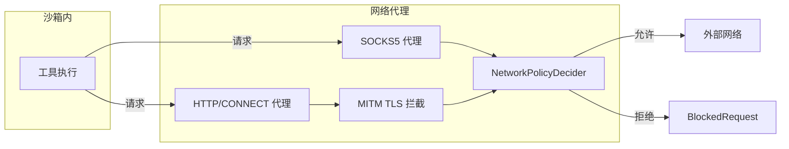
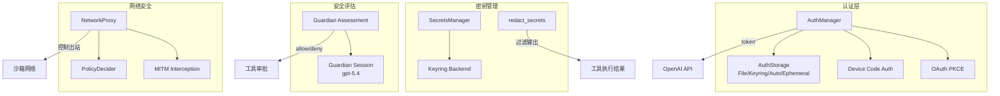

# 第十二章 认证与安全

## 12.1 认证系统

Codex 的认证系统位于 `login` crate，支持三种认证模式，覆盖了从 API Key 到 OAuth 的各种场景。

### 12.1.1 三种认证模式

```rust
pub enum CodexAuth {
    ApiKey(ApiKeyAuth),               // API Key 直接认证
    Chatgpt(ChatgptAuth),            // OAuth PKCE + 浏览器回调
    ChatgptAuthTokens(ChatgptAuthTokens), // 外部提供的 token
}
```

#### ApiKey 模式

最简单的认证方式。用户通过环境变量或配置提供 OpenAI API Key，直接用于 API 请求的 `Authorization: Bearer <key>` 头。

#### Chatgpt 模式（OAuth PKCE）

面向 ChatGPT 用户的标准 OAuth 2.0 认证流程，使用 PKCE（Proof Key for Code Exchange）增强安全性。流程分为两种路径：

**浏览器回调路径**：
1. 生成 PKCE 码对（code_verifier + code_challenge）
2. 启动本地 HTTP 服务器监听回调
3. 打开浏览器跳转到 OpenAI 授权页面
4. 用户登录并授权后，浏览器重定向到本地回调
5. 用授权码换取 access_token + refresh_token + id_token

**设备码路径**（Device Code Auth）：
适用于无法打开浏览器的环境（如远程 SSH）。

#### ChatgptAuthTokens 模式

外部系统提供 token，Codex 直接使用。适用于 IDE 集成场景——VS Code 扩展已有用户认证，通过 `ChatgptAuthTokens` 传递给 App Server。

### 12.1.2 设备码认证

设备码认证实现在 `device_code_auth.rs`（约 228 行），流程：

```
request_device_code()
    → POST /api/accounts/deviceauth/usercode
    → 返回 DeviceCode { verification_url, user_code, device_auth_id, interval }

用户在浏览器中访问 verification_url 并输入 user_code

poll_for_token()
    → 循环 POST /api/accounts/deviceauth/token
    → 每 interval 秒轮询一次
    → 最长等待 15 分钟
    → 成功返回 authorization_code + PKCE codes

exchange_code_for_tokens()
    → 用 authorization_code 换取 access_token / refresh_token / id_token
```

`DeviceCode` 结构体：
```rust
pub struct DeviceCode {
    pub verification_url: String,   // 用户访问的 URL
    pub user_code: String,          // 用户输入的验证码
    device_auth_id: String,         // 设备认证 ID（内部）
    interval: u64,                  // 轮询间隔（秒）
}
```

设备码流程的安全提示："Device codes are a common phishing target. Never share this code."

CLIENT_ID 常量：`app_EMoamEEZ73f0CkXaXp7hrann`。

### 12.1.3 Token 存储

Token 持久化通过 `AuthStorageBackend` trait 抽象，支持四种后端：

```rust
trait AuthStorageBackend: Debug + Send + Sync {
    fn load(&self) -> io::Result<Option<AuthDotJson>>;
    fn save(&self, auth: &AuthDotJson) -> io::Result<()>;
    fn delete(&self) -> io::Result<bool>;
}
```

四种实现：

| 后端 | 配置值 | 存储位置 | 适用场景 |
|------|--------|---------|---------|
| `FileAuthStorage` | `File` | `$CODEX_HOME/auth.json` | 简单场景 |
| `KeyringAuthStorage` | `Keyring` | 系统密钥链 | 安全优先 |
| `AutoAuthStorage` | `Auto` | 密钥链→文件回退 | 默认推荐 |
| `EphemeralAuthStorage` | `Ephemeral` | 内存 HashMap | 测试/临时 |

`AuthDotJson` 是存储结构：
```rust
pub struct AuthDotJson {
    pub auth_mode: Option<AuthMode>,
    pub openai_api_key: Option<String>,      // API Key
    pub tokens: Option<TokenData>,           // OAuth tokens
    pub last_refresh: Option<DateTime<Utc>>, // 上次刷新时间
    pub agent_identity: Option<AgentIdentityAuthRecord>,
}
```

#### FileAuthStorage

文件存储使用 `$CODEX_HOME/auth.json`，Unix 上设置 `0o600` 权限。读取时解析 JSON，写入时 `serde_json::to_string_pretty`。

#### KeyringAuthStorage

使用系统密钥链（macOS Keychain、Windows Credential Manager、Linux Secret Service）。密钥名通过 `compute_store_key()` 生成：`cli|<codex_home_path_sha256_prefix_16>`。

保存到密钥链后会清理残留的文件存储。

#### AutoAuthStorage

先尝试密钥链，失败时回退到文件：
- `load()`：密钥链 → 文件
- `save()`：密钥链 → 文件
- `delete()`：委托给密钥链（密钥链实现会同时清理文件）

#### EphemeralAuthStorage

全局静态 `HashMap<String, AuthDotJson>`，用于测试或不需要持久化的场景。

### 12.1.4 Token 刷新

`AuthManager`（login/src/auth/manager.rs，约 1,753 行）管理认证状态和 token 生命周期。

```rust
struct AuthManager {
    cached_auth: RwLock<CachedAuth>,  // 缓存的认证信息
    refresh_mutex: AsyncMutex<()>,    // 刷新互斥锁
    // ...
}
```

刷新策略：

1. **主动刷新**：通过 JWT 过期时间检查。解析 JWT claims，检查 `exp` 字段。如果接近过期，主动发起刷新。
2. **间隔刷新**：每 8 天强制刷新一次（`TOKEN_REFRESH_INTERVAL = 8`），即使 token 未过期。
3. **被动刷新**：API 请求返回 401 时触发刷新。

刷新使用 `https://auth.openai.com/oauth/token`（可通过 `CODEX_REFRESH_TOKEN_URL_OVERRIDE` 环境变量覆盖）。

#### UnauthorizedRecovery 状态机

当 API 返回 401 时，AuthManager 进入恢复流程：
1. 尝试刷新 token
2. 刷新成功 → 用新 token 重试请求
3. 刷新失败 → 根据失败原因给出具体提示

刷新失败的原因和消息：
- Refresh token 过期："Please log out and sign in again"
- Refresh token 已被使用（重放）："Please log out and sign in again"
- Refresh token 被撤销：同上
- 账户不匹配："You have since logged out or signed in to another account"

## 12.2 Secrets 管理

`secrets` crate（约 230 行）提供安全的密钥/凭证存储服务。

### 12.2.1 核心概念

**SecretName**：密钥名称，限制为 `A-Z`、`0-9`、`_`（大写字母、数字、下划线）。

```rust
pub struct SecretName(String);
// SecretName::new("GITHUB_TOKEN") → Ok
// SecretName::new("github-token") → Err (包含小写和连字符)
```

**SecretScope**：密钥作用域。

```rust
pub enum SecretScope {
    Global,                    // 全局密钥
    Environment(String),       // 环境级密钥
}
```

环境 ID 通过 `environment_id_from_cwd()` 从当前工作目录推导：优先使用 git 仓库根目录名，否则使用目录路径的 SHA256 前缀。

存储键格式：
- 全局：`global/SECRET_NAME`
- 环境级：`env/<environment_id>/SECRET_NAME`

### 12.2.2 SecretsManager

```rust
pub struct SecretsManager {
    backend: Arc<dyn SecretsBackend>,
}
```

`SecretsBackend` trait 定义了四个操作：

```rust
pub trait SecretsBackend: Send + Sync {
    fn set(&self, scope: &SecretScope, name: &SecretName, value: &str) -> Result<()>;
    fn get(&self, scope: &SecretScope, name: &SecretName) -> Result<Option<String>>;
    fn delete(&self, scope: &SecretScope, name: &SecretName) -> Result<bool>;
    fn list(&self, scope_filter: Option<&SecretScope>) -> Result<Vec<SecretListEntry>>;
}
```

当前唯一实现是 `LocalSecretsBackend`，使用系统密钥链（keyring）存储。密钥链 service 名为 `"codex"`，account 名通过 `compute_keyring_account()` 从 codex_home 路径哈希生成。

### 12.2.3 redact_secrets()

`sanitizer.rs` 中的 `redact_secrets()` 函数用于从输出文本中清除敏感信息。在将工具执行结果返回给模型或记录日志前，会通过此函数过滤已知的密钥值。

### 12.2.4 关键文件

| 文件 | 行数 | 职责 |
|------|------|------|
| `secrets/src/lib.rs` | ~230 | SecretName、SecretScope、SecretsManager |
| `secrets/src/local.rs` | ~411 | LocalSecretsBackend（keyring 实现） |
| `secrets/src/sanitizer.rs` | ~41 | redact_secrets() |

## 12.3 Guardian（守卫）

Guardian（core/src/guardian/）是 Codex 的安全评估系统，用于自动判断工具调用是否应该被批准。

### 12.3.1 设计理念

当工具调用需要审批时（`on-request` 策略），Guardian 可以在不打扰用户的情况下自动评估该操作是否安全。它使用一个独立的 AI 评审会话来分析操作上下文和风险。

核心原则：**失败关闭**（fail closed）——超时、执行失败、输出格式错误时，一律拒绝（交给用户决定）。

### 12.3.2 评估流程

```
工具调用需要审批
    → 构建 GuardianApprovalRequest
    → 重建紧凑的对话转录（保留用户意图 + 近期上下文）
    → 启动独立 guardian 评审会话（使用 gpt-5.4 模型）
    → 返回 GuardianAssessment JSON
    → 应用 allow/deny 决策
```

Guardian 使用专用模型（`GUARDIAN_PREFERRED_MODEL = "gpt-5.4"`），独立于主对话会话运行。评审会话克隆父配置，继承网络代理和白名单设置。

### 12.3.3 GuardianAssessment

```rust
pub struct GuardianAssessment {
    pub risk_level: GuardianRiskLevel,              // 风险等级
    pub user_authorization: GuardianUserAuthorization, // 用户授权判断
    pub outcome: GuardianAssessmentOutcome,          // 最终决策
    pub rationale: String,                           // 理由
}

pub enum GuardianAssessmentOutcome {
    Allow,   // 允许
    Deny,    // 拒绝
}
```

### 12.3.4 上下文限制

为避免 Guardian 评审消耗过多 token，对输入进行了严格限制：

| 参数 | 值 | 说明 |
|------|-----|------|
| `GUARDIAN_MAX_MESSAGE_TRANSCRIPT_TOKENS` | 10,000 | 消息转录最大 token |
| `GUARDIAN_MAX_TOOL_TRANSCRIPT_TOKENS` | 10,000 | 工具转录最大 token |
| `GUARDIAN_MAX_MESSAGE_ENTRY_TOKENS` | 2,000 | 单条消息最大 token |
| `GUARDIAN_MAX_TOOL_ENTRY_TOKENS` | 1,000 | 单条工具记录最大 token |
| `GUARDIAN_MAX_ACTION_STRING_TOKENS` | 16,000 | 操作描述最大 token |
| `GUARDIAN_RECENT_ENTRY_LIMIT` | 40 | 最近条目数限制 |
| `GUARDIAN_REVIEW_TIMEOUT` | 90 秒 | 评审超时 |

超出限制的内容使用 `truncated` 标签截断。

### 12.3.5 关键文件

| 文件 | 行数 | 职责 |
|------|------|------|
| `core/src/guardian/mod.rs` | ~109 | Guardian 模块入口、类型定义 |
| `core/src/guardian/approval_request.rs` | ~391 | 审批请求构建 |
| `core/src/guardian/prompt.rs` | ~564 | 提示构建、转录压缩 |
| `core/src/guardian/review.rs` | ~446 | 评审执行逻辑 |
| `core/src/guardian/review_session.rs` | ~977 | Guardian 评审会话管理 |

## 12.4 网络安全

`network-proxy` crate 实现了 Codex 的网络安全层，通过 MITM 代理控制所有出站网络请求。

### 12.4.1 NetworkProxy 架构



NetworkProxy 支持两种代理协议：

- **SOCKS5**（socks5.rs）：处理 TCP/UDP 流量的通用代理
- **HTTP/CONNECT**（http_proxy.rs）：处理 HTTP 和 HTTPS 流量

对于 HTTPS 流量，使用 MITM（中间人）拦截：
- 动态生成目标域名的 TLS 证书（certs.rs）
- 解密 HTTPS 请求以检查域名和路径
- 根据策略决定是否放行

### 12.4.2 NetworkPolicyDecider

`NetworkPolicyDecider`（network_policy.rs）是网络策略的执行者：

```rust
pub enum NetworkPolicyDecision {
    Deny,   // 拒绝
    Ask,    // 交给用户决定
}

pub enum NetworkDecisionSource {
    BaselinePolicy,  // 基线策略
    ModeGuard,       // 模式守卫
    ProxyState,      // 代理状态
    Decider,         // 策略决策器
}
```

策略请求包含：
```rust
pub struct NetworkPolicyRequest {
    pub protocol: NetworkProtocol,  // Http / HttpsConnect / Socks5Tcp / Socks5Udp
    pub host: String,
    // ...
}
```

`NetworkProtocol` 枚举区分四种协议类型，每种有对应的策略标识字符串。

### 12.4.3 域名白名单/黑名单

网络策略的核心是域名权限配置：

```rust
pub struct NetworkDomainPermissions {
    // 域名 → 权限（Allow / Deny）
}

pub struct NetworkUnixSocketPermissions {
    // Unix socket 路径 → 权限
}
```

配置支持：
- 精确域名匹配
- 通配符匹配
- Unix socket 路径控制

### 12.4.4 ConfigReloader

`ConfigReloader`（runtime.rs）支持运行时热重载网络策略配置。当用户修改配置文件时，代理可以在不重启的情况下更新策略。

### 12.4.5 BlockedRequest 观察者

```rust
pub trait BlockedRequestObserver: Send + Sync {
    fn on_blocked(&self, request: BlockedRequestArgs);
}
```

被拦截的请求通过观察者模式通知上层。`BlockedRequest` 包含被拦截请求的域名、协议、拦截原因等信息，用于日志记录和 UI 展示。

### 12.4.6 关键文件

| 文件 | 行数 | 职责 |
|------|------|------|
| `network-proxy/src/lib.rs` | ~56 | 模块导出 |
| `network-proxy/src/proxy.rs` | ~1,029 | NetworkProxy 主结构体、Builder |
| `network-proxy/src/network_policy.rs` | ~898 | NetworkPolicyDecider |
| `network-proxy/src/config.rs` | ~869 | 网络配置类型 |
| `network-proxy/src/http_proxy.rs` | ~1,319 | HTTP/CONNECT 代理 |
| `network-proxy/src/socks5.rs` | ~616 | SOCKS5 代理 |
| `network-proxy/src/mitm.rs` | ~482 | MITM TLS 拦截 |
| `network-proxy/src/certs.rs` | ~344 | 动态证书生成 |
| `network-proxy/src/runtime.rs` | ~1,779 | ConfigReloader、BlockedRequest |
| `network-proxy/src/state.rs` | ~419 | NetworkProxyState、约束验证 |
| `network-proxy/src/policy.rs` | ~465 | 策略匹配逻辑 |

## 12.5 安全架构总览



Codex 的安全架构分为四个层次：

1. **认证层**：确保用户身份合法，token 自动刷新
2. **密钥管理**：安全存储和使用敏感凭证，输出自动脱敏
3. **Guardian 评估**：AI 辅助的工具调用安全评审
4. **网络代理**：在网络层面控制工具的出站访问

这四个层次从不同维度保障安全：认证解决"谁在用"，密钥管理解决"凭证如何存"，Guardian 解决"操作是否安全"，网络代理解决"能访问什么"。它们共同构成了 Codex 的纵深防御体系。
