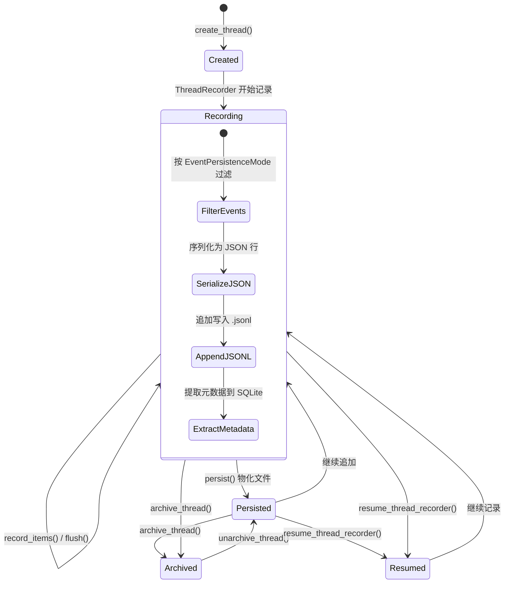

# 第13章 状态持久化与会话管理

Codex 的持久化层由四个独立子系统组成：`state` 提供 SQLite 结构化状态存储、`thread-store` 定义与存储无关的线程持久化接口、`rollout` 实现 JSONL 格式的会话录制与发现、`git-utils` 中的 Ghost Commit 机制提供文件级撤销能力。这四个子系统各司其职，共同构成了从会话创建、记录、恢复到归档的完整生命周期。

---

## 13.1 State：SQLite 状态数据库

### 13.1.1 双数据库架构

`state/` crate 是 Codex 的结构化持久化核心。它维护两个独立的 SQLite 数据库文件：

| 数据库 | 基础文件名 | 当前版本 | 完整文件名 | 用途 |
|--------|-----------|---------|-----------|------|
| State DB | `state` | v5 | `state_5.sqlite` | 线程元数据、Agent 作业、回填状态、远程控制注册 |
| Logs DB | `logs` | v2 | `logs_2.sqlite` | 日志条目，独立存储以减少锁竞争 |

文件名格式为 `{base_name}_{version}.sqlite`，由 `db_filename()` 函数生成。数据库默认存储在 Codex Home 目录下，可通过 `CODEX_SQLITE_HOME` 环境变量覆盖。

### 13.1.2 StateRuntime 入口

`StateRuntime` 是状态子系统的唯一入口点，封装了两个连接池和运行时配置：

```rust
pub struct StateRuntime {
    codex_home: PathBuf,
    default_provider: String,
    pool: Arc<SqlitePool>,          // State DB
    logs_pool: Arc<SqlitePool>,     // Logs DB
    thread_updated_at_millis: Arc<AtomicI64>,
}
```

初始化流程 `StateRuntime::init()` 执行以下步骤：

1. **创建目录**：确保 `codex_home` 目录存在
2. **清理旧版文件**：`remove_legacy_db_files()` 扫描目录，删除过期版本的 SQLite 文件（包括 `-wal`、`-shm`、`-journal` 辅助文件）
3. **打开数据库**：分别调用 `open_state_sqlite()` 和 `open_logs_sqlite()`
4. **运行迁移**：使用 sqlx 内置迁移器，但通过 `runtime_migrator()` 包装为容错版本——设置 `ignore_missing: true`，允许旧版二进制打开被新版迁移过的数据库
5. **配置 WAL 模式**：`base_sqlite_options()` 统一设置 WAL 日志模式、Normal 同步级别、5秒忙等待超时
6. **增量 VACUUM**：State DB 启用 `SqliteAutoVacuum::Incremental`，首次打开时执行一次 `VACUUM` 以持久化设置
7. **启动维护**：对 Logs DB 执行启动维护任务

连接池配置为最大 5 个连接，对于 CLI 工具的并发级别绰绰有余。

### 13.1.3 核心数据模型

State DB 存储的核心实体包括：

**ThreadMetadata** — 线程元数据记录，包含线程 ID、创建/更新时间戳（毫秒精度）、工作目录、CLI 版本、会话来源、模型提供商等信息。通过 `ThreadMetadataBuilder` 模式构建，支持增量更新。

**BackfillState** — 回填状态追踪。当 Codex 需要从 JSONL rollout 文件重建 SQLite 索引时，`BackfillState` 记录每个线程的回填进度。相关类型包括：
- `BackfillStatus`：回填状态枚举
- `BackfillStats`：回填统计信息
- `Stage1JobClaim` / `Stage1Output`：两阶段回填流水线的作业声明与输出

**AgentJob** — Agent 作业记录，用于追踪子 Agent 的生命周期：
- `AgentJobCreateParams`：创建参数
- `AgentJobItem` / `AgentJobItemCreateParams`：作业子项
- `AgentJobStatus` / `AgentJobItemStatus`：状态枚举
- `AgentJobProgress`：进度追踪

**LogEntry** — 日志条目，存储在独立的 Logs DB 中：
- `LogRow`：数据库行映射
- `LogQuery`：查询参数，支持按线程 ID、进程 UUID 过滤
- 分区大小限制：每分区最大 10 MiB 或 1000 行

### 13.1.4 分区与容量管理

Logs DB 采用分区策略控制存储膨胀：

```
分区规则：
- 每个非空 thread_id 构成一个分区
- 每个无 thread_id 但有 process_uuid 的组构成一个分区
- thread_id 和 process_uuid 均为空的行构成一个分区

分区限制：
- LOG_PARTITION_SIZE_LIMIT_BYTES = 10 MiB
- LOG_PARTITION_ROW_LIMIT = 1,000 行
```

启动时执行 `run_logs_startup_maintenance()` 清理超限分区。

### 13.1.5 迁移容错

`state/src/migrations.rs` 中定义了关键的迁移容错逻辑。标准 sqlx 迁移器会在发现数据库中存在未知的新版迁移记录时报错（`MigrateError::VersionMissing`）。Codex 通过 `runtime_migrator()` 创建容错版本：

```rust
fn runtime_migrator(base: &'static Migrator) -> Migrator {
    Migrator {
        migrations: Cow::Borrowed(base.migrations.as_ref()),
        ignore_missing: true,  // 关键：容忍未知的新版迁移
        locking: base.locking,
        no_tx: base.no_tx,
    }
}
```

这使得旧版 Codex 可以与新版并行运行——两个进程可以安全地共享同一个数据库文件。

---

## 13.2 Thread Store：存储无关的线程接口

### 13.2.1 ThreadStore Trait

`thread-store/` crate 定义了存储无关的线程持久化边界。核心是 `ThreadStore` trait，声明了完整的线程 CRUD 操作：

```rust
#[async_trait]
pub trait ThreadStore: Send + Sync {
    async fn create_thread(&self, params: CreateThreadParams)
        -> ThreadStoreResult<Box<dyn ThreadRecorder>>;
    async fn resume_thread_recorder(&self, params: ResumeThreadRecorderParams)
        -> ThreadStoreResult<Box<dyn ThreadRecorder>>;
    async fn append_items(&self, params: AppendThreadItemsParams)
        -> ThreadStoreResult<()>;
    async fn load_history(&self, params: LoadThreadHistoryParams)
        -> ThreadStoreResult<StoredThreadHistory>;
    async fn read_thread(&self, params: ReadThreadParams)
        -> ThreadStoreResult<StoredThread>;
    async fn list_threads(&self, params: ListThreadsParams)
        -> ThreadStoreResult<ThreadPage>;
    async fn set_thread_name(&self, params: SetThreadNameParams)
        -> ThreadStoreResult<()>;
    async fn update_thread_metadata(&self, params: UpdateThreadMetadataParams)
        -> ThreadStoreResult<StoredThread>;
    async fn archive_thread(&self, params: ArchiveThreadParams)
        -> ThreadStoreResult<()>;
    async fn unarchive_thread(&self, params: ArchiveThreadParams)
        -> ThreadStoreResult<StoredThread>;
}
```

设计原则：**应用层代码仅通过 `ThreadId` 操作线程**，具体实现负责将其解析为本地 rollout 文件、RPC 请求或其他后端存储。

### 13.2.2 ThreadRecorder

`ThreadRecorder` trait 表示一个线程的实时追加句柄：

```rust
#[async_trait]
pub trait ThreadRecorder: Send + Sync {
    fn thread_id(&self) -> ThreadId;
    async fn record_items(&self, items: &[RolloutItem]) -> ThreadStoreResult<()>;
    async fn persist(&self) -> ThreadStoreResult<()>;
    async fn flush(&self) -> ThreadStoreResult<()>;
    async fn shutdown(&self) -> ThreadStoreResult<()>;
}
```

四个生命周期方法形成递进关系：
- `record_items()`：按过滤策略将事件入队
- `persist()`：物化懒创建的线程，并将队列中的事件写入持久化层
- `flush()`：确保所有排队事件已写入且可读
- `shutdown()`：刷新后关闭 recorder

本地实现（`LocalThreadStore`）预期包装 `codex_rollout::RolloutRecorder`，保留其懒物化、过滤、刷新和关闭行为。

### 13.2.3 核心类型

**CreateThreadParams** — 线程创建参数：

| 字段 | 类型 | 说明 |
|------|------|------|
| `thread_id` | `ThreadId` | Codex 在打开持久化前预生成的 ID |
| `forked_from_id` | `Option<ThreadId>` | Fork 来源线程 |
| `source` | `SessionSource` | 运行时来源（CLI/VSCode/atlas/chatgpt） |
| `base_instructions` | `BaseInstructions` | 会话元数据中持久化的基础指令 |
| `dynamic_tools` | `Vec<DynamicToolSpec>` | 启动时可用的动态工具 |
| `event_persistence_mode` | `ThreadEventPersistenceMode` | 持久化粒度：Limited 或 Extended |

**StoredThread** — 存储层返回的线程摘要，包含 35+ 个字段，涵盖元数据（创建时间、模型、工作目录、Git 信息）、配置（approval_mode、sandbox_policy）、显示信息（preview、name、agent_nickname）、以及可选的历史记录。

**ThreadPage** — 分页查询结果，包含 `items: Vec<StoredThread>` 和 `next_cursor: Option<String>`。列表支持按 `CreatedAt` 或 `UpdatedAt` 排序，可按来源、模型提供商过滤，并支持全文搜索。

**ThreadEventPersistenceMode** — 控制事件持久化粒度：
- `Limited`：仅持久化最小重放面（legacy）
- `Extended`：持久化更丰富的事件面，供 app-server 历史重建使用

### 13.2.4 错误体系

`ThreadStoreError` 枚举覆盖四类故障：

| 变体 | 场景 |
|------|------|
| `ThreadNotFound` | 请求的线程不存在 |
| `InvalidRequest` | 调用方提供了无效的请求数据 |
| `Conflict` | 操作与当前存储状态冲突 |
| `Internal` | 实现层内部故障 |

---

## 13.3 Rollout：JSONL 会话录制

### 13.3.1 概述

`rollout/` crate 实现了 Codex 会话的 JSONL 文件持久化与发现。每个会话（线程）对应一个 `.jsonl` 文件，其中每行是一个序列化的 `RolloutItem`。

### 13.3.2 目录结构

```
{codex_home}/
  sessions/                          # 活跃会话
    {source}/                        # 按来源分组
      {date}/                        # 按日期分组（YYYY/MM/DD）
        {thread_id}.jsonl            # 会话文件
  archived_sessions/                 # 归档会话（同样的子结构）
```

常量定义：
- `SESSIONS_SUBDIR = "sessions"`
- `ARCHIVED_SESSIONS_SUBDIR = "archived_sessions"`

支持的交互式会话来源：
- `SessionSource::Cli`
- `SessionSource::VSCode`
- `SessionSource::Custom("atlas")`
- `SessionSource::Custom("chatgpt")`

### 13.3.3 RolloutRecorder

`RolloutRecorder` 是 JSONL 录制的核心组件，由 `RolloutRecorderParams` 配置创建。它实现了懒物化策略——在首次写入前不创建文件，减少空会话的磁盘开销。

录制流程：
1. **过滤**：根据 `EventPersistenceMode`（Limited/Extended）决定哪些 `RolloutItem` 变体应当持久化
2. **序列化**：将 `RolloutItem` 序列化为 JSON 行
3. **追加写入**：通过 `append_rollout_item_to_path()` 原子追加到 JSONL 文件
4. **刷新**：`flush()` 确保所有缓冲内容已写入磁盘

`should_persist_response_item_for_memories` 函数专门判断哪些响应事件应为记忆系统持久化。

### 13.3.4 会话发现与列表

`list.rs`（1291 行，是 rollout crate 中最大的文件）实现了会话发现逻辑：

- `get_threads()` / `get_threads_in_root()`：扫描目录树，发现所有会话文件
- `read_thread_item_from_rollout()`：从 JSONL 文件读取线程摘要
- `read_head_for_summary()`：仅读取文件头部获取预览信息
- `read_session_meta_line()`：解析会话元数据行
- `rollout_date_parts()`：从路径中提取日期组件
- `find_thread_path_by_id_str()` / `find_archived_thread_path_by_id_str()`：按 ID 查找会话文件路径

分页通过 `Cursor` 实现，`ThreadsPage` 返回 `items` 和 `next_cursor`。支持的排序方式通过 `ThreadSortKey` 枚举定义。`ThreadListConfig` 和 `ThreadListLayout` 控制列表的展示配置。

### 13.3.5 会话元数据

`metadata.rs`（443 行）处理会话元数据的提取与构建：

- `builder_from_items()`：从 `RolloutItem` 序列构建元数据摘要
- 元数据包含首条用户消息、模型信息、Token 用量、Git 信息等

### 13.3.6 会话名称索引

`session_index.rs`（263 行）提供基于名称的快速检索：

- `append_thread_name()`：追加线程名称到索引
- `find_thread_meta_by_name_str()`：按名称子串查找线程
- `find_thread_name_by_id()`：按 ID 查找线程名称

索引以文件形式存储，避免每次查找都需要扫描全部 JSONL 文件。

### 13.3.7 Rollout State DB

`state_db.rs`（546 行）将 rollout 元数据镜像到 SQLite 数据库以加速查询。这个模块是连接 JSONL 文件存储与 SQLite 结构化索引的桥梁。

### 13.3.8 保留策略

`policy.rs`（224 行）定义了事件持久化策略：

- `EventPersistenceMode`：控制哪些事件变体应当写入 JSONL
- `should_persist_response_item_for_memories`：专门判断记忆相关事件

---

## 13.4 Git Ghost Commits：文件级撤销

### 13.4.1 设计理念

Ghost Commit 机制为 Codex 的每个 Turn 提供文件级撤销能力。它在 Turn 开始前创建一个包含完整工作树快照的 Git 提交（不影响当前分支），在需要撤销时将工作树恢复到该快照状态。

### 13.4.2 GhostCommit 结构

```rust
pub struct GhostCommit {
    pub parent: String,                              // 快照时的 HEAD commit
    pub preexisting_untracked_files: HashSet<PathBuf>, // 快照前已存在的未跟踪文件
}
```

`parent` 字段记录创建快照时的 HEAD SHA，`preexisting_untracked_files` 记录快照前已存在的未跟踪文件——这些文件在恢复时需要保留，不应被删除。

### 13.4.3 创建流程

`create_ghost_commit()` 通过 `CreateGhostCommitOptions` 配置，执行以下步骤：

1. **解析仓库**：确认当前目录是 Git 仓库，获取仓库根路径
2. **记录 HEAD**：解析当前 HEAD commit SHA
3. **收集未跟踪文件**：使用 `git ls-files --others` 列出所有未跟踪文件
4. **过滤大文件/目录**：
   - 忽略超过阈值的大文件（默认 10 MiB，`DEFAULT_IGNORE_LARGE_UNTRACKED_FILES`）
   - 忽略包含大量文件的目录（默认 200 个文件，`DEFAULT_IGNORE_LARGE_UNTRACKED_DIRS`）
   - 始终忽略已知的大目录：`node_modules`、`.venv`、`dist`、`build`、`__pycache__` 等
5. **创建临时索引**：使用 `tempfile` 创建独立的 Git 索引文件
6. **暂存所有内容**：将跟踪文件和（符合条件的）未跟踪文件添加到临时索引
7. **创建 tree 对象**：通过 `git write-tree` 从临时索引生成 tree
8. **创建 commit**：通过 `git commit-tree` 创建孤立提交（消息默认为 "codex snapshot"）
9. **返回 GhostCommit**：包含 parent SHA 和预先存在的未跟踪文件列表

`force_include` 参数允许强制包含特定路径，即使它们会被默认规则排除。

### 13.4.4 恢复流程

`restore_ghost_commit()` 通过 `RestoreGhostCommitOptions` 配置，将工作树恢复到快照状态：

1. **读取快照 commit**：从 `GhostCommit` 获取快照 tree
2. **对比差异**：比较当前工作树与快照 tree 的差异
3. **恢复跟踪文件**：使用 `git checkout` 将修改的文件恢复到快照状态
4. **处理未跟踪文件**：删除快照中不存在且不在 `preexisting_untracked_files` 中的文件
5. **保留预先存在的文件**：不删除快照前就已经存在的未跟踪文件

### 13.4.5 GhostSnapshotConfig

快照行为通过 `GhostSnapshotConfig` 精细控制：

```rust
pub struct GhostSnapshotConfig {
    pub ignore_large_untracked_files: Option<i64>,  // 默认 10 MiB
    pub ignore_large_untracked_dirs: Option<i64>,    // 默认 200 文件
    pub disable_warnings: bool,
}
```

`GhostSnapshotReport` 记录快照过程中的排除情况：
- `large_untracked_dirs`：被排除的大目录列表
- `ignored_untracked_files`：被排除的大文件列表

---

## 13.5 会话生命周期



完整的会话生命周期：

1. **创建**：`ThreadStore::create_thread()` 返回 `ThreadRecorder`，同时在 SQLite 中创建 `ThreadMetadata` 记录
2. **录制**：`ThreadRecorder::record_items()` 按策略过滤事件，追加到 JSONL 文件
3. **物化**：`ThreadRecorder::persist()` 在懒创建模式下首次创建文件
4. **刷新**：`ThreadRecorder::flush()` 确保所有内容写入磁盘
5. **恢复**：`ThreadStore::resume_thread_recorder()` 重新打开已有线程的 recorder
6. **Fork**：通过 `CreateThreadParams::forked_from_id` 从已有线程分叉
7. **归档**：`archive_thread()` 将文件移至 `archived_sessions/`
8. **反归档**：`unarchive_thread()` 将文件移回 `sessions/`
9. **关闭**：`ThreadRecorder::shutdown()` 刷新并关闭

---

## 13.6 关键文件索引

| 文件路径 | 约行数 | 说明 |
|----------|--------|------|
| `state/src/lib.rs` | 60 | State crate 入口，导出所有公共类型和常量 |
| `state/src/runtime.rs` | 356 | `StateRuntime` 实现，SQLite 连接池管理 |
| `state/src/migrations.rs` | 29 | 迁移器定义，容错 `runtime_migrator()` |
| `state/src/paths.rs` | 9 | 文件修改时间工具函数 |
| `state/src/runtime/threads.rs` | — | 线程元数据 CRUD 操作 |
| `state/src/runtime/backfill.rs` | — | 回填状态管理 |
| `state/src/runtime/agent_jobs.rs` | — | Agent 作业管理 |
| `state/src/runtime/logs.rs` | — | 日志条目管理与分区维护 |
| `state/src/runtime/memories.rs` | — | 记忆存储操作 |
| `state/src/runtime/remote_control.rs` | — | 远程控制注册记录 |
| `thread-store/src/lib.rs` | 34 | Thread Store crate 入口 |
| `thread-store/src/store.rs` | 65 | `ThreadStore` trait 定义 |
| `thread-store/src/types.rs` | 228 | 所有参数和返回类型定义 |
| `thread-store/src/recorder.rs` | 28 | `ThreadRecorder` trait 定义 |
| `thread-store/src/error.rs` | 36 | `ThreadStoreError` 枚举 |
| `thread-store/src/local.rs` | — | `LocalThreadStore` 本地实现 |
| `rollout/src/lib.rs` | 66 | Rollout crate 入口，常量与导出 |
| `rollout/src/recorder.rs` | 1354 | `RolloutRecorder` 核心录制逻辑 |
| `rollout/src/list.rs` | 1291 | 会话发现与列表（最大文件） |
| `rollout/src/metadata.rs` | 443 | 会话元数据提取与构建 |
| `rollout/src/session_index.rs` | 263 | 线程名称索引 |
| `rollout/src/config.rs` | 100 | `RolloutConfig` 配置 |
| `rollout/src/policy.rs` | 224 | 事件持久化策略 |
| `rollout/src/state_db.rs` | 546 | Rollout 元数据到 SQLite 的桥接 |
| `git-utils/src/ghost_commits.rs` | 1786 | Ghost Commit 创建与恢复（最大文件） |
| `git-utils/src/operations.rs` | 239 | Git 命令封装 |
| `git-utils/src/lib.rs` | 116 | Git Utils crate 入口 |
| `git-utils/src/info.rs` | 708 | Git 仓库信息查询 |
| `git-utils/src/apply.rs` | 847 | Git apply 操作 |
| `git-utils/src/branch.rs` | 256 | 分支操作 |
