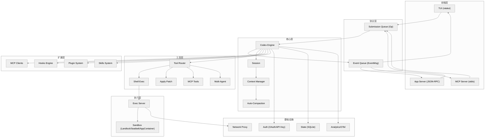

# Codex CLI 架构深度解析

> **Codex** 是 OpenAI 的终端编码代理（CLI coding agent），用 Rust 编写，通过异步 SQ/EQ 协议在多种前端与核心引擎之间通信。
>
> 代码库: ~1458 个 Rust 文件，~230K 行代码，94 个 workspace crate。
>
> 基于 commit `bd61737e8`（2026-04-16）生成。

---

## 目录

| 章节 | 标题 | 关键词 |
|------|------|--------|
| [01](01-全局概览.md) | 全局概览 | 架构图、模块总览、核心循环、数据流 |
| [02](02-CLI入口与配置系统.md) | CLI 入口与配置系统 | MultitoolCli、24 子命令、7 层配置、Profile |
| [03](03-协议层.md) | 协议层 | SQ/EQ、Op（30+ 变体）、EventMsg（60+ 变体） |
| [04](04-核心引擎.md) | 核心引擎 | Codex struct、submission_loop、Turn 生命周期 |
| [05](05-模型交互与流式传输.md) | 模型交互与流式传输 | ModelClient、WebSocket/SSE、Prompt、sticky routing |
| [06](06-工具系统.md) | 工具系统 | ToolRouter、20+ Handler、审批流程、ApprovalStore |
| [07](07-执行与沙箱系统.md) | 执行与沙箱系统 | ExecParams、Landlock/Seatbelt/AppContainer、ExecPolicy |
| [08](08-上下文管理与自动压缩.md) | 上下文管理与自动压缩 | ContextManager、token 估算、auto-compaction、remote compact |
| [09](09-TUI终端界面.md) | TUI 终端界面 | ratatui、App/ChatWidget/BottomPane、事件路由 |
| [10](10-App-Server与IDE集成.md) | App Server 与 IDE 集成 | JSON-RPC、双循环架构、Protocol v2、RPC 方法表 |
| [11](11-扩展系统.md) | 扩展系统 | MCP、Hooks、Plugins、Skills |
| [12](12-认证与安全.md) | 认证与安全 | OAuth/API Key、Token 刷新、Guardian、网络代理 |
| [13](13-状态持久化与会话管理.md) | 状态持久化与会话管理 | SQLite、ThreadStore、Rollout、Ghost Commit |
| [14](14-基础设施与可观测性.md) | 基础设施与可观测性 | Analytics、OTel、Feature Flags、Models Manager |
| [附录 A](附录A-关键文件索引.md) | 关键文件索引 | 120+ 文件，按子系统分类 |
| [附录 B](附录B-术语表.md) | 术语表 | 60+ 术语定义 |

---

## 阅读路径

### 路径一：初学者（2-3 小时）

按顺序阅读，建立完整心智模型：

```
01 全局概览 → 02 CLI入口 → 03 协议层 → 04 核心引擎 → 09 TUI → 附录B 术语表
```

### 路径二：快速查阅（30 分钟）

只读架构图和关键表格：

```
01 全局概览（架构图 + 模块总览表）→ 附录A 文件索引 → 附录B 术语表
```

### 路径三：开发者深入（按需）

根据你要修改的模块选择章节：

| 我要改… | 读这些章节 |
|---------|-----------|
| CLI 参数或配置 | 02 |
| 核心对话循环 | 03 + 04 + 05 |
| 添加新工具 | 06 + 07 |
| 沙箱或安全策略 | 07 + 12 |
| 上下文管理/compaction | 08 |
| TUI 界面 | 09 |
| IDE 集成 / App Server | 10 |
| MCP / Hooks / Plugins / Skills | 11 |
| 认证流程 | 12 |
| 会话持久化 | 13 |
| 遥测/Feature Flags | 14 |

---

## 架构一览



---

## 文档统计

| 指标 | 数值 |
|------|------|
| 章节数 | 14 + 2 附录 |
| 总文件大小 | ~268 KB |
| 覆盖 crate 数 | ~50+ / 94 |
| Mermaid 图表 | ~20+ |
| 文件索引条目 | 120+ |
| 术语表条目 | 60+ |
