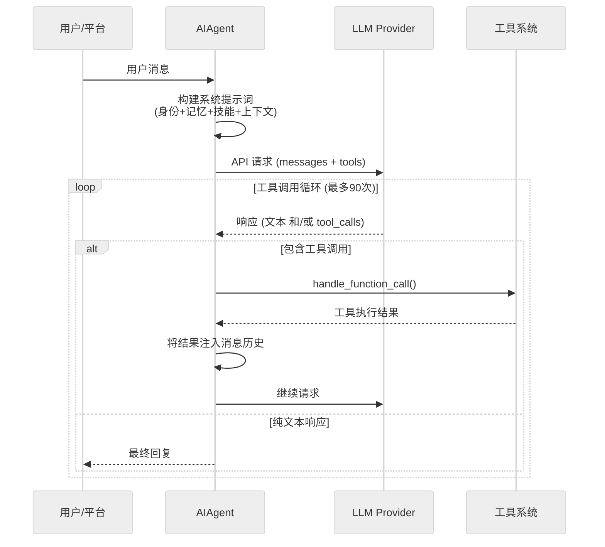
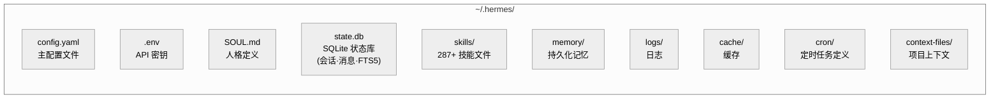
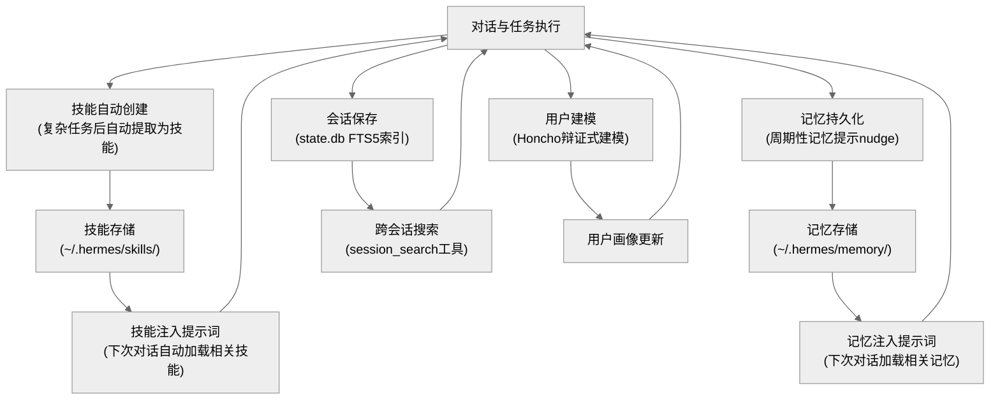

# 第一章：全局概览与架构

> **一句话概括**：Hermes Agent 是一个自我改进的 AI 代理系统，围绕"对话循环 + 工具调用"核心架构，通过技能学习、持久记忆、多平台网关和可插拔终端后端，实现跨会话的持续进化能力。

---

## 1.1 项目定位与规模

Hermes Agent 由 [Nous Research](https://nousresearch.com) 开发，版本 0.8.0，采用 MIT 许可证。它是一个**全栈 AI 代理**——不仅仅是一个聊天机器人，而是一个能自主执行任务、从经验中学习、并在多个通信平台上持续运行的智能系统。

### 代码规模

| 维度 | 数值 |
|------|------|
| Python 源文件（不含测试） | 282 个 |
| 源代码行数（不含测试） | 193,682 行 |
| 测试代码行数 | 176,179 行 |
| 内置技能文件（Markdown） | 287 个 |
| 支持的消息平台 | 16+ 个 |
| 内置工具 | 40+ 个 |
| 终端后端 | 6 种 |

### 各模块代码量

| 模块 | 行数 | 职责 |
|------|------|------|
| `tools/` | 40,855 | 工具实现（浏览器、终端、文件、Web、技能等） |
| `gateway/` | 40,789 | 多平台消息网关 |
| `hermes_cli/` | 39,774 | CLI 入口、配置、认证、模型管理 |
| 顶层文件 | 28,274 | 核心代理循环、CLI TUI、工具编排 |
| `agent/` | 16,152 | 代理内部组件（提示词、压缩、记忆、定价） |
| `plugins/` | 9,817 | 上下文引擎与记忆插件 |
| `environments/` | 7,307 | RL 训练环境 |
| `cron/` | 1,794 | 定时任务调度 |
| `acp_adapter/` | 1,784 | Agent Communication Protocol 适配器 |

---

## 1.2 系统架构总览

```mermaid
%%{init: {'theme': 'neutral'}}%%
graph TB
    subgraph Entry["入口层"]
        CLI["hermes (CLI TUI)<br/>cli.py · 9,878行"]
        HCLI["hermes 子命令<br/>hermes_cli/main.py"]
        GW["hermes gateway<br/>gateway/run.py · 8,836行"]
        ACP["hermes-acp<br/>acp_adapter/"]
    end

    subgraph Core["核心代理"]
        RA["AIAgent<br/>run_agent.py · 10,524行"]
        MT["工具编排<br/>model_tools.py"]
        TS["工具集定义<br/>toolsets.py"]
    end

    subgraph AgentPkg["代理内部 (agent/)"]
        PB["提示词构建<br/>prompt_builder.py"]
        CC["上下文压缩<br/>context_compressor.py"]
        MM["记忆管理<br/>memory_manager.py"]
        MD["模型元数据<br/>model_metadata.py"]
        SMR["智能路由<br/>smart_model_routing.py"]
        AC["辅助客户端<br/>auxiliary_client.py"]
        EC["错误分类<br/>error_classifier.py"]
    end

    subgraph Tools["工具系统 (tools/)"]
        REG["工具注册表<br/>registry.py"]
        TT["终端工具"]
        BT["浏览器工具"]
        WT["Web 工具"]
        FT["文件工具"]
        SKT["技能工具"]
        MEM["记忆工具"]
        DT["委托工具"]
        MCT["MCP 工具"]
    end

    subgraph Platforms["消息平台"]
        TG["Telegram"]
        DC["Discord"]
        SL["Slack"]
        MX["Matrix"]
        WA["WhatsApp"]
        SIG["Signal"]
        API["API Server"]
        MORE["Email/飞书/钉钉/..."]
    end

    subgraph Storage["持久化层"]
        DB["state.db (SQLite)<br/>hermes_state.py"]
        SKILLS["~/.hermes/skills/"]
        MEMORY["~/.hermes/memory/"]
        CONFIG["~/.hermes/config.yaml"]
        SOUL["SOUL.md"]
    end

    subgraph Infra["基础设施"]
        ENV["终端后端<br/>local/Docker/SSH/<br/>Daytona/Modal/Singularity"]
        CRON["Cron 调度器<br/>cron/"]
        PLUG["插件<br/>plugins/"]
    end

    CLI --> RA
    HCLI --> CLI
    GW --> RA
    ACP --> RA

    RA --> MT --> REG
    RA --> PB
    RA --> CC
    RA --> MM
    RA --> MD
    RA --> SMR
    RA --> AC
    RA --> EC

    REG --> TT & BT & WT & FT & SKT & MEM & DT & MCT

    GW --> TG & DC & SL & MX & WA & SIG & API & MORE

    RA --> DB
    SKT --> SKILLS
    MEM --> MEMORY
    RA --> CONFIG
    PB --> SOUL

    TT --> ENV
    RA --> CRON
    RA --> PLUG
```



---

## 1.3 三个入口点

系统在 `pyproject.toml:112-115` 定义了三个可执行入口：

```python
[project.scripts]
hermes = "hermes_cli.main:main"         # CLI 命令行工具
hermes-agent = "run_agent:main"          # 直接运行代理循环
hermes-acp = "acp_adapter.entry:main"    # ACP 服务器模式
```

### 入口 1：`hermes`（CLI 命令）

`hermes_cli/main.py` 是用户日常交互的主入口。它是一个 argparse 驱动的命令分发器：

- `hermes`（无参数）→ 启动交互式 TUI（`cli.py`）
- `hermes setup` → 运行设置向导
- `hermes model` → 模型选择
- `hermes gateway start` → 启动消息网关
- `hermes tools` → 配置工具集
- `hermes doctor` → 诊断检查
- `hermes cron` → 定时任务管理
- `hermes sessions browse` → 会话浏览器
- `hermes acp` → 启动 ACP 服务器
- `hermes honcho` → Honcho 记忆集成管理

支持 `--profile`/`-p` 参数切换配置 profile（`hermes_cli/main.py:77-80`），在任何模块导入前设置 `HERMES_HOME` 环境变量。

### 入口 2：`hermes-agent`（直接代理）

`run_agent.py` 的 `main()` 函数，通过 Python Fire 提供命令行接口，直接实例化 `AIAgent` 并运行对话循环。主要供开发者和批量运行使用。

### 入口 3：`hermes-acp`（ACP 服务器）

`acp_adapter/entry.py` 启动一个 Agent Communication Protocol 服务器，使 Hermes 可以作为编辑器集成的后端运行（类似 Copilot 模式）。

---

## 1.4 核心循环：请求→思考→工具→响应

Hermes 的核心是一个经典的**ReAct 循环**（Reasoning + Acting）：



**关键数字**：
- 默认最大迭代次数：**90**（父代理），**50**（子代理）
- `execute_code` 工具的迭代会被**退还**（不计入预算）
- 每次迭代包含一次 LLM API 调用和可能的工具执行

---

## 1.5 数据流向

### 数据从哪里进来

| 输入源 | 路径 |
|--------|------|
| CLI 终端 | `cli.py` → prompt_toolkit TUI → `AIAgent.run_conversation()` |
| Telegram/Discord/... | `gateway/platforms/*.py` → `gateway/session.py` → `AIAgent` |
| API Server | `gateway/platforms/api_server.py` → REST API → `AIAgent` |
| ACP 客户端 | `acp_adapter/server.py` → `AIAgent` |
| Cron 调度 | `cron/scheduler.py` → `cron/jobs.py` → `AIAgent` |
| 批量运行 | `batch_runner.py` → `AIAgent` |

### 数据从哪里出去

| 输出目标 | 机制 |
|----------|------|
| 终端显示 | Rich 格式化输出 + prompt_toolkit TUI |
| 消息平台 | 各平台 adapter 的 `send_message()` |
| 文件系统 | `write_file` / `patch` 工具 |
| 终端命令 | `terminal` 工具 → 终端后端执行 |
| 浏览器 | `browser_*` 工具 → Playwright/CamoFox |
| 外部 API | `web_search` / `web_extract` / MCP 工具 |
| SQLite 状态库 | `hermes_state.py` → `state.db` |
| 技能文件 | `skill_manage` 工具 → `~/.hermes/skills/` |
| 记忆文件 | `memory` 工具 → `~/.hermes/memory/` |
| 轨迹文件 | `agent/trajectory.py` → JSONL 文件 |

---

## 1.6 十大核心子系统

### 1. 代理循环 (`run_agent.py`)
10,524 行的核心文件，包含 `AIAgent` 类。负责对话管理、工具调用循环、系统提示词组装、流式响应处理、错误恢复和多 provider 支持。

### 2. 交互式 CLI (`cli.py`)
9,878 行的终端 TUI，基于 prompt_toolkit 构建。提供多行编辑、slash 命令自动补全、对话历史、中断重定向、流式工具输出显示。

### 3. 工具系统 (`tools/`)
40,855 行，40+ 工具。采用自注册模式：每个工具文件通过 `tools.registry.register()` 注册自己的 schema、handler 和元数据。`model_tools.py` 提供公共 API，`toolsets.py` 定义工具组合。

### 4. 消息网关 (`gateway/`)
40,789 行，支持 16+ 平台。`gateway/platforms/base.py` 定义了平台抽象基类，每个平台实现消息收发、语音转写、表情反应等平台特定功能。

### 5. CLI 管理 (`hermes_cli/`)
39,774 行，提供所有 `hermes` 子命令的实现：配置管理、认证、模型选择、网关管理、插件管理、技能配置等。

### 6. 代理内部 (`agent/`)
16,152 行，提供提示词构建、上下文压缩、记忆管理、模型元数据、智能路由、错误分类、使用计费等支撑功能。

### 7. 技能系统 (`skills/` + `tools/skills_*.py`)
287 个技能文件，按 26 个领域分类（软件开发、DevOps、数据科学、研究、社交媒体等）。技能是代理的"程序性记忆"——从经验中创建，在使用中改进。

### 8. 记忆与学习 (`tools/memory_tool.py` + `plugins/memory/`)
持久化记忆系统，支持本地文件和 Honcho（辩证式用户建模）两种后端。配合 FTS5 全文搜索（`hermes_state.py`）实现跨会话回忆。

### 9. 终端后端 (`tools/environments/`)
6 种执行环境：Local、Docker、SSH、Daytona（无服务器）、Modal（无服务器 GPU）、Singularity。代理的终端命令通过后端抽象层路由到对应环境。

### 10. Cron 调度 (`cron/`)
1,794 行，基于 croniter 的定时任务系统。支持自然语言定义任务，执行结果可投递到任意消息平台。

---

## 1.7 持久化架构



**状态数据库** (`state.db`)：SQLite WAL 模式，schema 版本 6（`hermes_state.py:35`），包含：
- `sessions` 表 — 会话元数据（来源、模型、token 用量、计费）
- `messages` 表 — 完整消息历史
- FTS5 虚拟表 — 全文搜索索引
- 支持通过 `parent_session_id` 链追踪压缩触发的会话分裂

---

## 1.8 Provider 抽象

Hermes 通过 OpenAI 兼容 API 接口支持多个 LLM provider：

| Provider | Base URL | 特点 |
|----------|----------|------|
| Nous Portal | `https://inference-api.nousresearch.com/v1` | Nous 自有推理服务 |
| OpenRouter | `https://openrouter.ai/api/v1` | 200+ 模型聚合 |
| OpenAI | OpenAI 默认 | GPT 系列 |
| Anthropic | 通过 `anthropic_adapter.py` 适配 | Claude 系列 |
| z.ai/GLM | 自定义 endpoint | 智谱 GLM |
| Kimi/Moonshot | 自定义 endpoint | 月之暗面 |
| MiniMax | 自定义 endpoint | MiniMax |
| Mistral | 通过 `mistralai` SDK | Mistral 系列 |
| 本地模型 | 任意 OpenAI 兼容 endpoint | Ollama/vLLM/etc. |

核心机制：
- `agent/model_metadata.py` — 模型能力检测、上下文长度管理、token 估算
- `agent/smart_model_routing.py` — 动态模型选择
- `agent/anthropic_adapter.py` — Anthropic API 到 OpenAI 格式的适配
- `agent/credential_pool.py` — API 密钥轮换与池化
- `agent/rate_limit_tracker.py` — 跨 provider 速率限制追踪

---

## 1.9 技术栈

| 层级 | 技术选型 |
|------|---------|
| 语言 | Python ≥ 3.11 |
| LLM 客户端 | `openai` SDK（主）+ `anthropic` SDK + `mistralai` SDK |
| CLI TUI | `prompt_toolkit` + `rich` |
| CLI 框架 | `argparse`（hermes_cli）+ `fire`（run_agent） |
| Web 工具 | `exa-py`（搜索）+ `firecrawl-py`（提取）+ `parallel-web` |
| 浏览器 | Playwright（通过 CamoFox） |
| 配置 | YAML (`pyyaml`) + `.env` (`python-dotenv`) |
| 数据验证 | `pydantic` |
| HTTP | `httpx[socks]` + `requests` |
| 模板 | `jinja2` |
| 持久化 | SQLite（WAL 模式）+ 文件系统 |
| 消息平台 | `python-telegram-bot`、`discord.py`、`slack-bolt`、`mautrix` 等 |
| TTS | `edge-tts`（免费）+ `elevenlabs`（高级） |
| STT | `faster-whisper`（本地） |
| 定时任务 | `croniter` |
| MCP | `mcp` SDK |
| RL 训练 | `atroposlib` + `tinker` |

---

## 1.10 目录结构速查

```
hermes-agent/
├── run_agent.py          # (10,524行) AIAgent 类 — 核心对话循环
├── cli.py                # (9,878行)  交互式 TUI
├── model_tools.py        # (577行)    工具编排公共 API
├── toolsets.py           # (655行)    工具集定义与组合
├── toolset_distributions.py # (364行) 工具分布逻辑
├── hermes_constants.py   # (269行)    共享常量（路径、URL）
├── hermes_state.py       # (1,238行)  SQLite 状态存储
├── hermes_logging.py     # (394行)    日志配置
├── hermes_time.py        # (104行)    时间工具
├── utils.py              # (214行)    通用工具函数
├── batch_runner.py       # (1,287行)  批量轨迹生成
├── trajectory_compressor.py # (1,457行) 轨迹压缩（训练用）
├── mcp_serve.py          # (867行)    MCP 服务器模式
├── rl_cli.py             # (446行)    RL 训练 CLI
│
├── agent/                # (16,152行) 代理内部组件
│   ├── prompt_builder.py #   系统提示词构建
│   ├── context_compressor.py # 上下文压缩
│   ├── memory_manager.py #   记忆管理
│   ├── model_metadata.py #   模型元数据
│   ├── smart_model_routing.py # 智能路由
│   ├── auxiliary_client.py #  辅助 LLM 客户端
│   ├── anthropic_adapter.py # Anthropic 适配器
│   ├── error_classifier.py #  错误分类
│   ├── credential_pool.py #   密钥池
│   ├── usage_pricing.py  #   使用计费
│   └── ...               #   (共 28 个文件)
│
├── tools/                # (40,855行) 工具实现
│   ├── registry.py       #   工具注册表
│   ├── terminal_tool.py  #   终端命令执行
│   ├── browser_tool.py   #   浏览器自动化
│   ├── web_tools.py      #   Web 搜索与提取
│   ├── file_tools.py     #   文件操作
│   ├── skills_hub.py     #   技能中心
│   ├── memory_tool.py    #   持久化记忆
│   ├── mcp_tool.py       #   MCP 集成
│   ├── delegate_tool.py  #   子代理委托
│   ├── approval.py       #   工具审批
│   └── ...               #   (共 57 个文件)
│
├── tools/environments/   #   终端后端
│   ├── base.py           #   后端抽象基类
│   ├── local.py          #   本地执行
│   ├── docker.py         #   Docker 容器
│   ├── ssh.py            #   SSH 远程
│   ├── daytona.py        #   Daytona 无服务器
│   ├── modal.py          #   Modal GPU
│   └── singularity.py    #   Singularity 容器
│
├── gateway/              # (40,789行) 消息网关
│   ├── run.py            #   网关主进程
│   ├── session.py        #   会话管理
│   ├── config.py         #   网关配置
│   ├── delivery.py       #   消息投递
│   ├── hooks.py          #   钩子系统
│   └── platforms/        #   平台适配器
│       ├── base.py       #   平台基类
│       ├── telegram.py   #   Telegram
│       ├── discord.py    #   Discord
│       ├── slack.py      #   Slack
│       ├── matrix.py     #   Matrix
│       ├── api_server.py #   REST API
│       └── ...           #   (共 24 个文件)
│
├── hermes_cli/           # (39,774行) CLI 命令实现
│   ├── main.py           #   入口与命令分发
│   ├── config.py         #   配置管理
│   ├── setup.py          #   设置向导
│   ├── auth.py           #   认证
│   ├── gateway.py        #   网关管理命令
│   ├── models.py         #   模型管理
│   └── ...               #   (共 44 个文件)
│
├── skills/               # (287个技能) 社区技能库
│   ├── software-development/
│   ├── devops/
│   ├── data-science/
│   ├── research/
│   └── ...               #   (25+ 领域)
│
├── plugins/              # (9,817行)  插件系统
│   ├── context_engine/   #   上下文引擎
│   └── memory/           #   记忆插件
│
├── cron/                 # (1,794行)  定时调度
│   ├── scheduler.py      #   调度器
│   └── jobs.py           #   任务执行
│
├── acp_adapter/          # (1,784行)  ACP 适配器
├── environments/         # (7,307行)  RL 训练环境
└── tests/                # (176,179行) 测试套件
```

---

## 1.11 "自我改进"闭环

Hermes 的核心差异化特性是其**学习闭环**——系统在使用过程中持续积累知识和能力：



四个学习通道：
1. **技能学习**：复杂任务完成后，代理自动将解决方案提取为可复用技能
2. **记忆持久化**：通过 prompt 中的周期性"nudge"，代理被提示将重要信息存入持久记忆
3. **会话搜索**：所有对话通过 FTS5 索引，代理可以搜索自己的历史对话
4. **用户建模**：通过 Honcho 集成，建立跨会话的辩证式用户理解

---

## 1.12 阅读路径建议

### 初学者路径（理解系统做什么）
1. 本章（全局概览）
2. 第 2 章（核心代理循环）— 理解一条消息如何被处理
3. 第 5 章（工具系统）— 理解代理能做什么
4. 第 6 章（技能系统）— 理解学习机制

### 开发者路径（理解系统怎么做）
1. 本章（全局概览）
2. 第 2 章（核心代理循环）
3. 第 3 章（代理内部组件）
4. 第 5 章（工具系统）
5. 第 14 章（模型路由与 Provider 抽象）
6. 第 15 章（安全与审批）

### 运维路径（理解系统怎么部署和运行）
1. 本章（全局概览）
2. 第 4 章（交互式 CLI）
3. 第 8 章（网关与消息平台）
4. 第 9 章（终端后端与环境）
5. 第 12 章（Cron 调度与自动化）
6. 第 19 章（配置与设置）

---

## 1.13 关键文件索引

| 文件 | 行数 | 核心职责 |
|------|------|---------|
| `run_agent.py` | 10,524 | AIAgent 类，对话循环，工具调用 |
| `cli.py` | 9,878 | 交互式 TUI，prompt_toolkit 界面 |
| `gateway/run.py` | 8,836 | 网关主进程，平台管理 |
| `hermes_cli/main.py` | 5,929 | CLI 入口与命令分发 |
| `tools/skills_hub.py` | 2,775 | 技能中心，社区技能发现与安装 |
| `agent/auxiliary_client.py` | 2,613 | 辅助 LLM 客户端（标题、压缩等） |
| `tools/browser_tool.py` | 2,387 | 浏览器自动化 |
| `tools/mcp_tool.py` | 2,195 | MCP 协议集成 |
| `tools/web_tools.py` | 2,103 | Web 搜索与内容提取 |
| `gateway/platforms/base.py` | 1,998 | 平台适配器基类 |
| `hermes_cli/models.py` | 1,899 | 模型管理 |
| `gateway/platforms/api_server.py` | 1,838 | REST API 接口 |
| `tools/terminal_tool.py` | 1,777 | 终端命令执行 |
| `hermes_state.py` | 1,238 | SQLite 状态存储 |
