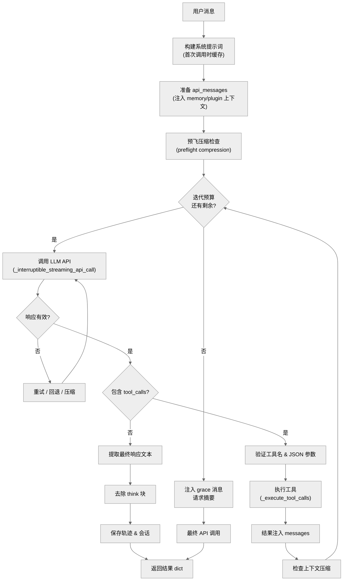

# 第二章: 核心 Agent 循环

本章对 hermes-agent 的主对话循环进行全面技术剖析 -- 从接收用户消息、构建系统提示词、调用 LLM API、解析响应、检测并执行工具调用,到最终返回结果的完整流程。

---

## 2.1 架构总览

hermes-agent 的核心是一个 **工具调用循环(tool-calling loop)**:用户发送消息后,Agent 反复调用 LLM API,每次 LLM 可能返回文本响应(结束循环)或工具调用请求(执行工具、将结果注入上下文、再次调用 LLM),直到产生最终文本响应或迭代预算耗尽。



---

## 2.2 AIAgent 类解剖

### 2.2.1 构造函数签名

`AIAgent.__init__()` 定义于 `run_agent.py:516`,接受约 60 个参数,涵盖模型配置、工具集、回调函数、会话管理等所有维度。关键参数:

| 参数 | 默认值 | 作用 |
|------|--------|------|
| `base_url` | `None` | LLM API 端点 |
| `api_key` | `None` | 认证密钥 |
| `provider` | `None` | 提供商标识(`"openrouter"`, `"anthropic"`, `"nous"` 等) |
| `api_mode` | 自动检测 | `"chat_completions"`, `"codex_responses"`, `"anthropic_messages"` |
| `model` | `""` | 模型名称 |
| `max_iterations` | `90` | 单轮对话最大 LLM 调用次数 |
| `tool_delay` | `1.0` | 工具调用间隔(秒) |
| `enabled_toolsets` | `None` | 启用的工具集列表 |
| `max_tokens` | `None` | 单次响应最大 token 数 |
| `reasoning_config` | `None` | 推理配置(如 `{"effort": "medium"}`) |
| `session_id` | 自动生成 | 会话标识,格式 `YYYYMMDD_HHMMSS_<6位hex>` |
| `iteration_budget` | `IterationBudget(max_iterations)` | 迭代预算对象 |
| `fallback_model` | `None` | 备用模型链(dict 或 list) |
| `credential_pool` | `None` | API 密钥轮换池 |

### 2.2.2 API 模式自动检测

构造函数中有一段精密的 API 模式检测逻辑(`run_agent.py:645-661`):

1. 如果 `api_mode` 显式指定为 `chat_completions`/`codex_responses`/`anthropic_messages`,直接使用
2. 如果 `provider == "openai-codex"` 或 URL 包含 `chatgpt.com/backend-api/codex`,使用 `codex_responses`
3. 如果 `provider == "anthropic"` 或 URL 包含 `api.anthropic.com`,使用 `anthropic_messages`
4. 如果 URL 以 `/anthropic` 结尾(第三方 Anthropic 兼容端点),使用 `anthropic_messages`
5. 否则默认 `chat_completions`

此外,GPT-5.x 系列模型和直连 OpenAI URL 会被自动升级到 `codex_responses` 模式(`run_agent.py:678-682`)。

### 2.2.3 关键实例变量

构造函数初始化了大量状态变量,以下是按功能分组的关键变量:

**客户端与连接:**
- `self.client` -- OpenAI 兼容客户端(chat completions / codex 模式)
- `self._anthropic_client` -- Anthropic 原生客户端(anthropic_messages 模式)
- `self._client_kwargs` -- 客户端构建参数,用于重建连接
- `self._fallback_chain` -- 备用提供商链(`run_agent.py:954-962`)

**工具系统:**
- `self.tools` -- 当前可用工具的 OpenAI 格式 schema 列表
- `self.valid_tool_names` -- 合法工具名集合,用于验证 LLM 输出

**会话状态:**
- `self._session_messages` -- 消息历史
- `self._cached_system_prompt` -- 缓存的系统提示词(一次构建,跨轮次复用)
- `self._todo_store` -- TodoStore 实例(内存中的任务列表)
- `self._memory_store` -- MemoryStore 实例(MEMORY.md + USER.md)
- `self._memory_manager` -- 外部记忆提供商插件管理器

**上下文管理:**
- `self.context_compressor` -- 上下文压缩器(ContextCompressor 或插件引擎)
- `self.compression_enabled` -- 是否启用自动压缩(默认 `True`)
- `self._use_prompt_caching` -- 是否启用 Anthropic 提示缓存

**迭代控制:**
- `self.iteration_budget` -- IterationBudget 实例
- `self._budget_exhausted_injected` -- 是否已注入预算耗尽消息
- `self._budget_grace_call` -- 是否允许 grace call

**中断机制:**
- `self._interrupt_requested` -- 中断标志
- `self._interrupt_message` -- 触发中断的消息
- `self._execution_thread_id` -- 执行线程 ID,用于定向中断

**Token 统计:**
- `self.session_prompt_tokens`, `session_completion_tokens`, `session_total_tokens` 等
- `self.session_estimated_cost_usd` -- 累计估算费用

---

## 2.3 系统提示词构建

系统提示词由 `_build_system_prompt()` 方法组装(`run_agent.py:3041-3206`),采用分层架构,按固定顺序拼接以下部分:

### 构建层次(按顺序)

| 层 | 来源 | 说明 |
|----|------|------|
| 1. Agent 身份 | `SOUL.md` 或 `DEFAULT_AGENT_IDENTITY` | 优先读取工作目录下的 SOUL.md;找不到则使用内置身份字符串 |
| 2. 工具行为指导 | `MEMORY_GUIDANCE`, `SESSION_SEARCH_GUIDANCE`, `SKILLS_GUIDANCE` | 仅在对应工具加载时注入 |
| 3. Nous 订阅提示 | `build_nous_subscription_prompt()` | 订阅相关的功能提示 |
| 4. 工具使用强制 | `TOOL_USE_ENFORCEMENT_GUIDANCE` | 告诉模型实际调用工具而非描述意图;根据模型名决定是否注入 |
| 5. 模型特定指导 | `GOOGLE_MODEL_OPERATIONAL_GUIDANCE` / `OPENAI_MODEL_EXECUTION_GUIDANCE` | Gemini/GPT 系列专用操作规范 |
| 6. 用户/网关系统消息 | `system_message` 参数 | 如果调用者提供了自定义系统消息 |
| 7. 持久记忆 | `self._memory_store` | MEMORY.md 和 USER.md 的冻结快照 |
| 8. 外部记忆提供商 | `self._memory_manager` | 插件提供的系统提示词块 |
| 9. Skills 提示 | `build_skills_system_prompt()` | 已加载技能的加载指令 |
| 10. 上下文文件 | `build_context_files_prompt()` | AGENTS.md, .cursorrules 等项目文件 |
| 11. 时间戳 | 当前日期时间 | 格式: `Wednesday, April 12, 2026 3:45 PM` |
| 12. 环境提示 | `build_environment_hints()` | WSL, Termux, ChromeOS 等执行环境信息 |
| 13. 平台提示 | `PLATFORM_HINTS[platform]` | WhatsApp/Telegram/Discord 等平台格式化指南 |

各层之间用 `"\n\n"` 连接。最终结果缓存在 `self._cached_system_prompt` 中,只在首次调用和上下文压缩后重建,以最大化 Anthropic 前缀缓存命中率。

### 缓存策略

- **首次调用**: 如果 `_cached_system_prompt is None`,检查 session DB 中是否有已存储的系统提示词(用于网关模式续接会话)
- **续接会话**: 复用 DB 中的提示词以保持 Anthropic 缓存前缀一致(`run_agent.py:7684-7695`)
- **新会话**: 从零构建并存入 session DB(`run_agent.py:7698-7719`)
- **压缩后**: 清除缓存,重新构建(因为记忆内容可能已变)

### 临时系统提示词

`ephemeral_system_prompt` 不参与缓存/存储,仅在 API 调用时追加到系统提示词末尾(`run_agent.py:7968-7969`)。这用于批处理或特殊场景。

---

## 2.4 对话循环 (`run_conversation`)

`run_conversation()` 是 Agent 的核心入口,定义于 `run_agent.py:7527-10292`。以下是一次完整调用的逐步追踪:

### 2.4.1 前置准备 (7555-7848)

1. **安装安全 stdio 包装器** -- `_install_safe_stdio()` 防止断管 OSError 崩溃
2. **设置日志上下文** -- `set_session_context(session_id)` 关联日志记录
3. **恢复主运行时** -- 如果上一轮激活了 fallback,恢复主提供商
4. **消毒用户输入** -- `_sanitize_surrogates()` 清理非法 surrogate 字符
5. **重置重试计数器** -- `_invalid_tool_retries`, `_invalid_json_retries` 等归零
6. **重建迭代预算** -- `IterationBudget(self.max_iterations)` 每轮重建
7. **初始化消息列表** -- 复制 `conversation_history` 避免变更调用方数据
8. **恢复 todo 状态** -- 从历史消息中 hydrate TodoStore(网关模式)
9. **追加用户消息** -- `messages.append({"role": "user", "content": user_message})`
10. **构建/加载系统提示词** -- 缓存逻辑(见 2.3 节)
11. **预飞压缩** -- 检查历史是否已超过压缩阈值,最多执行 3 轮压缩(`run_agent.py:7730-7779`)
12. **Plugin pre_llm_call 钩子** -- 收集插件上下文注入用户消息
13. **外部记忆预取** -- `self._memory_manager.prefetch_all(query)` 一次预取,循环内复用

### 2.4.2 主循环条件

```python
while (api_call_count < self.max_iterations and self.iteration_budget.remaining > 0) or self._budget_grace_call:
```

循环在以下任一条件下退出:
- LLM 返回纯文本响应(无 tool_calls)
- 迭代预算耗尽(在 grace call 后)
- 用户中断(`self._interrupt_requested`)
- 不可恢复的错误

### 2.4.3 单次循环迭代 (7849-9821)

每次循环迭代的完整流程:

#### 阶段 1: 预检查

```
7854: 检查中断请求
7861: api_call_count += 1
7868-7874: 处理 grace call / 消费迭代预算
7877-7901: 触发 step_callback (gateway agent:step 事件)
7905-7907: 更新 skill 提示计数器
```

#### 阶段 2: 准备 API 消息 (7914-8025)

1. **复制消息列表** 为 `api_messages`(避免修改原始历史)
2. **注入临时上下文** 到当前轮用户消息: 记忆预取结果 + 插件上下文(`run_agent.py:7923-7934`)
3. **恢复 reasoning_content** -- 将内部 `reasoning` 字段转为 API 的 `reasoning_content`
4. **清理内部字段** -- 移除 `reasoning`, `finish_reason`, `_thinking_prefill` 等非 API 字段
5. **条件式清理 tool_calls** -- 对严格 API(Mistral, Fireworks) 移除 Codex 专有字段
6. **构建系统消息** -- 拼接缓存提示词 + 临时系统提示词,作为 `api_messages[0]`
7. **注入 prefill 消息** -- few-shot 示例插入系统消息之后
8. **应用 Anthropic 提示缓存** -- `apply_anthropic_cache_control()` 注入 `cache_control` 标记
9. **消毒消息** -- `_sanitize_api_messages()` 修复孤儿 tool_call/tool_result 对
10. **规范化空白和 JSON** -- 保证跨轮次的字节级前缀一致性,提升 KV 缓存命中

#### 阶段 3: API 调用 (8076-9346)

这是嵌套在主循环内的 **重试循环**(`while retry_count < max_retries`,`max_retries = 3`):

```python
api_kwargs = self._build_api_kwargs(api_messages)      # 构建请求参数
response = self._interruptible_streaming_api_call(      # 流式 API 调用
    api_kwargs, on_first_delta=_stop_spinner
)
```

**`_build_api_kwargs()`** (`run_agent.py:5914`) 根据 `api_mode` 构建不同格式的请求:
- `anthropic_messages` -- 调用 `build_anthropic_kwargs()`,走 Anthropic 原生 SDK
- `codex_responses` -- 构建 OpenAI Responses API 格式(含 `instructions`, `input`, `reasoning`)
- `chat_completions` -- 标准 OpenAI 聊天完成格式(含 `messages`, `tools`, `model`)

**流式调用优先**: 即使没有流式消费者,也优先使用流式路径(`run_agent.py:8107-8113`),因为流式提供了 90 秒静默检测和 60 秒读超时等健康检查。只有在测试模式(Mock 客户端)时才回退到非流式。

#### 阶段 4: 响应验证 (8161-8308)

API 返回后,先验证响应形状是否有效:
- `chat_completions`: 检查 `response.choices` 非空
- `codex_responses`: 检查 `response.output` 是列表且非空
- `anthropic_messages`: 检查 `response.content` 是列表且非空

无效响应触发:
1. 尝试 fallback(`_try_activate_fallback()`)
2. 带抖动的指数退避重试(`jittered_backoff(attempt, base_delay=5.0, max_delay=120.0)`)
3. 3 次重试后返回错误

#### 阶段 5: finish_reason 处理 (8311-8504)

**`length`(截断)**:
- 如果推理耗尽了全部输出 token(thinking-only),返回专门的错误提示
- 如果是纯文本截断,最多请求 3 次续写(continuation)
- 如果是工具调用截断,重试 1 次 API 调用
- 多次失败后回滚到最后一个完整 assistant 消息

**`stop`**: 正常完成,进入响应解析阶段

#### 阶段 6: Token 统计与费用估算 (8506-8614)

成功 API 调用后:
1. `normalize_usage()` 规范化不同 provider 的 usage 格式
2. `context_compressor.update_from_response()` 更新上下文跟踪
3. 累加 `session_prompt_tokens`, `session_completion_tokens` 等
4. `estimate_usage_cost()` 估算费用
5. 将统计写入 session DB

#### 阶段 7: 错误处理与恢复 (8619-9346)

错误分类由 `classify_api_error()` 完成,返回 `ClassifiedError` 对象,包含:
- `reason` -- `FailoverReason` 枚举(如 `rate_limit`, `context_overflow`, `billing`)
- `retryable` -- 是否可重试
- `should_compress` -- 是否应压缩上下文
- `should_fallback` -- 是否应切换 fallback

恢复策略的优先级:
1. **凭证池轮换** -- `_recover_with_credential_pool()`: 429 时尝试下一个 API key
2. **认证刷新** -- Codex/Anthropic/Nous 的 401 专用刷新逻辑
3. **Thinking 签名修复** -- 清除无效的推理块签名
4. **Fallback 切换** -- 速率限制/计费错误时立即切换 fallback provider
5. **Payload 压缩** -- 413 或 context_overflow 时压缩上下文(最多 3 次)
6. **通用退避重试** -- `jittered_backoff()` 后重试

### 2.4.4 响应解析 (9348-9516)

API 调用成功后,根据 `api_mode` 提取 `assistant_message`:

```python
if self.api_mode == "codex_responses":
    assistant_message, finish_reason = self._normalize_codex_response(response)
elif self.api_mode == "anthropic_messages":
    assistant_message, finish_reason = normalize_anthropic_response(response, ...)
else:
    assistant_message = response.choices[0].message
```

所有模式统一产出一个具有 `.content`, `.tool_calls` 属性的对象,使后续处理无需区分 API 模式。

对 `content` 进行类型规范化(`run_agent.py:9362-9378`):dict/list 内容被转为纯字符串。

### 2.4.5 工具调用分支 vs 最终响应分支

**关键判断** (`run_agent.py:9516`):

```python
if assistant_message.tool_calls:
    # --> 工具调用路径 (继续循环)
else:
    # --> 最终响应路径 (退出循环)
```

---

## 2.5 工具调用处理

### 2.5.1 验证管道

工具调用检测后,经过多层验证(`run_agent.py:9524-9665`):

1. **工具名修复** -- `_repair_tool_call()` 尝试修复模型幻觉的工具名(如 `web_search_tool` -> `web_search`)
2. **工具名验证** -- 检查是否在 `self.valid_tool_names` 中;无效时注入错误 tool_result 让模型自行纠正,最多重试 3 次
3. **参数 JSON 验证** -- 空字符串转 `"{}"`;无效 JSON 重试 3 次,之后注入恢复 tool_result
4. **截断检测** -- 参数不以 `}` 或 `]` 结尾时判定为截断,拒绝执行

### 2.5.2 后置护栏

验证通过后,应用两个后置护栏(`run_agent.py:9668-9673`):

- `_cap_delegate_task_calls()` -- 截断超出 `max_concurrent_children` 限制的 delegate_task 调用
- `_deduplicate_tool_calls()` -- 去除同一轮中 (tool_name, arguments) 完全相同的重复调用

### 2.5.3 工具执行调度

`_execute_tool_calls()` (`run_agent.py:6686`) 是工具执行的入口:

```python
def _execute_tool_calls(self, assistant_message, messages, effective_task_id, api_call_count):
    tool_calls = assistant_message.tool_calls
    self._executing_tools = True
    try:
        if not _should_parallelize_tool_batch(tool_calls):
            return self._execute_tool_calls_sequential(...)
        return self._execute_tool_calls_concurrent(...)
    finally:
        self._executing_tools = False
```

**并行安全判断** (`_should_parallelize_tool_batch`, `run_agent.py:267`):
- 单个工具调用 -> 串行
- 包含 `_NEVER_PARALLEL_TOOLS` (如 `clarify`) -> 串行
- 所有工具都在 `_PARALLEL_SAFE_TOOLS` 中(只读工具)-> 并行
- `_PATH_SCOPED_TOOLS` (如 `read_file`, `write_file`, `patch`) 在目标路径无重叠时可并行
- 其他情况 -> 串行

**并行执行** (`_execute_tool_calls_concurrent`, `run_agent.py:6783`):
- 使用 `ThreadPoolExecutor`,最大 `_MAX_TOOL_WORKERS = 8` 个并发线程
- 结果按原始顺序收集并追加到 messages

### 2.5.4 工具调用路由

`_invoke_tool()` (`run_agent.py:6709`) 是所有工具调用的统一路由:

| 工具名 | 处理方式 | 原因 |
|--------|----------|------|
| `todo` | 直接调用 `todo_tool()` | 需要 agent 级别的 `TodoStore` |
| `session_search` | 直接调用 `session_search()` | 需要 `_session_db` |
| `memory` | 直接调用 `memory_tool()` | 需要 `_memory_store` |
| `clarify` | 直接调用 `clarify_tool()` | 需要 `clarify_callback` |
| `delegate_task` | 直接调用 `delegate_task()` | 需要 `parent_agent` 引用 |
| 记忆插件工具 | `_memory_manager.handle_tool_call()` | 插件注册的工具 |
| 其他所有工具 | `handle_function_call()` | 走 model_tools 注册表调度 |

这些 "agent-level" 工具在 `model_tools.py:364` 中被标记为 `_AGENT_LOOP_TOOLS`,在注册表层面会返回占位错误,防止意外直接调度。

### 2.5.5 model_tools.py 调度层

`handle_function_call()` (`model_tools.py:459`) 是注册表层面的调度器:

1. **参数类型强转** -- `coerce_tool_args()` 将 LLM 输出的字符串 `"42"` 转为整数 `42`,`"true"` 转为布尔 `True`
2. **读循环重置** -- 非 read/search 工具调用时重置连续读取计数器
3. **Plugin pre_tool_call 钩子** -- 通知插件系统
4. **注册表调度** -- `registry.dispatch(function_name, function_args, ...)`,异步工具通过 `_run_async()` 桥接
5. **Plugin post_tool_call 钩子** -- 通知插件系统
6. **错误包装** -- 异常被捕获并转为 JSON 错误字符串

`_run_async()` (`model_tools.py:81`) 是同步到异步的桥接器,支持三种场景:
- 已有运行中事件循环(网关/RL) -> 在独立线程中 `asyncio.run()`
- 工作线程(并行工具) -> 使用 per-thread 持久事件循环
- 主线程(CLI) -> 使用进程全局持久事件循环

### 2.5.6 结果注入

工具执行结果经过后处理:
1. `maybe_persist_tool_result()` -- 超大结果持久化到临时文件
2. `_subdirectory_hints.check_tool_call()` -- 检测目录操作并追加提示
3. `enforce_turn_budget()` -- 按轮次限制 tool result 大小

结果以 `{"role": "tool", "content": result, "tool_call_id": tc.id}` 格式追加到 messages。

### 2.5.7 迭代预算退款

如果本轮 **仅有** `execute_code` 工具调用,则退还一个迭代(`run_agent.py:9745-9747`):

```python
_tc_names = {tc.function.name for tc in assistant_message.tool_calls}
if _tc_names == {"execute_code"}:
    self.iteration_budget.refund()
```

`execute_code` 是程序化工具调用(Python 脚本批量调用其他工具),属于廉价 RPC 操作,不应消耗迭代预算。

---

## 2.6 迭代预算 (`IterationBudget`)

定义于 `run_agent.py:170-211`,是线程安全的迭代计数器:

```python
class IterationBudget:
    def __init__(self, max_total: int):     # 父 agent 默认 90
        self.max_total = max_total
        self._used = 0
        self._lock = threading.Lock()

    def consume(self) -> bool:              # 消费一个迭代,返回是否允许
    def refund(self) -> None:               # 退还一个迭代
    def used(self) -> int:                  # 已使用数量
    def remaining(self) -> int:             # 剩余数量
```

**关键设计:**
- **每轮重建**: `run_conversation()` 开始时创建新的 `IterationBudget(self.max_iterations)` (`run_agent.py:7618`)
- **子 agent 独立**: 每个子 agent 获得独立预算,上限为 `delegation.max_iterations`(默认 50)
- **Grace 机制**: 预算耗尽时,注入一条用户消息("Your tool budget ran out. Please give me the information or actions you've completed so far."),允许模型做最后一次 API 调用产生摘要(`run_agent.py:10086-10108`)
- **不提前警告**: 不向 LLM 注入中间压力警告,因为这会导致模型过早放弃复杂任务(参见 #7915)

---

## 2.7 流式处理

### 2.7.1 流式架构

`_interruptible_streaming_api_call()` (`run_agent.py:4840`) 是流式调用的统一入口:

- **chat_completions**: 在 `api_kwargs` 中加入 `stream=True`, `stream_options={"include_usage": True}`,迭代 SSE chunk
- **anthropic_messages**: 使用 `client.messages.stream()`,原生 Anthropic SDK 流
- **codex_responses**: 委托给 `_run_codex_stream()`(内部自带流式)

### 2.7.2 chunk 处理

对于 chat_completions 流(`_call_chat_completions`, `run_agent.py:4886`):

```python
for chunk in stream:
    last_chunk_time["t"] = time.time()   # 更新静默检测时间戳
    delta = chunk.choices[0].delta
    
    # 累积文本内容
    if delta.content:
        content_parts.append(delta.content)
        _fire_stream_delta(delta.content)    # 触发回调
    
    # 累积工具调用 (支持 Ollama 的 index 复用)
    if delta.tool_calls:
        # 按 index 累积 function.name 和 function.arguments
    
    # 累积推理内容
    if hasattr(delta, 'reasoning_content') and delta.reasoning_content:
        reasoning_parts.append(delta.reasoning_content)
    
    # 捕获 finish_reason
    if chunk.choices[0].finish_reason:
        finish_reason = chunk.choices[0].finish_reason
    
    # 捕获 usage (最后一个 chunk)
    if hasattr(chunk, 'usage') and chunk.usage:
        usage_obj = chunk.usage
```

流完成后,将累积的内容组装为一个模拟非流式响应的 `SimpleNamespace` 对象,使主循环的后续处理完全一致。

### 2.7.3 健康检查

流式路径提供两层健康检查:
- **httpx 读超时**: 默认 `120.0` 秒(本地 provider 自动提升到 `HERMES_API_TIMEOUT`)
- **静默流检测**: 外层轮询循环检查 `last_chunk_time`,超过 90 秒无真实数据 chunk 则判定连接已死

### 2.7.4 回调机制

流式 delta 通过两个回调传递:
- `self.stream_delta_callback` -- TUI 显示更新(prompt_toolkit response box)
- `self._stream_callback` -- TTS 管道(文本到语音实时生成)

回调只在 **纯文本** 响应时触发;包含 tool_calls 的中间轮次抑制回调。tool_calls 转文本后,通过 `_stream_needs_break` 标志在下一轮真实文本前插入段落分隔。

---

## 2.8 错误处理与重试

### 2.8.1 `jittered_backoff()`

定义于 `agent/retry_utils.py:19`,计算带抖动的指数退避延迟:

```
delay = min(base_delay * 2^(attempt-1), max_delay) + uniform(0, jitter_ratio * delay)
```

默认参数:
- `base_delay = 5.0` 秒
- `max_delay = 120.0` 秒
- `jitter_ratio = 0.5`

抖动使用基于时间纳秒 + 单调计数器的种子,在多会话并发时避免 thundering herd。

### 2.8.2 `classify_api_error()`

定义于 `agent/error_classifier.py:222`,将所有 API 错误分类为 `FailoverReason` 枚举:

| 分类 | 含义 | 恢复策略 |
|------|------|----------|
| `auth` | 临时认证失败(401/403) | 刷新凭证 + 重试 |
| `billing` | 计费耗尽(402) | 立即切换 fallback |
| `rate_limit` | 速率限制(429) | 凭证轮换 -> fallback -> 退避重试 |
| `overloaded` | 服务过载(503/529) | 退避重试 |
| `server_error` | 服务内部错误(500/502) | 重试 |
| `timeout` | 连接/读超时 | 重建客户端 + 重试 |
| `context_overflow` | 上下文溢出 | 压缩历史 |
| `payload_too_large` | 请求体过大(413) | 压缩 payload |
| `model_not_found` | 模型不存在(404) | 切换 fallback 模型 |
| `thinking_signature` | Anthropic 推理签名无效 | 清除推理块 + 重试 |
| `long_context_tier` | Anthropic 长上下文层级限制 | 降至 200K 上下文 + 压缩 |
| `format_error` | 请求格式错误(400) | 中止或清理重试 |
| `unknown` | 未知错误 | 退避重试 |

### 2.8.3 Fallback 链

`self._fallback_chain` 是一个有序列表,每个元素是 `{"provider": ..., "model": ..., ...}` dict。激活 fallback 时:
1. 推进 `_fallback_index`
2. 用 fallback 配置重建 API 客户端
3. 重置重试计数器
4. 继续循环

---

## 2.9 多 Provider 支持

### 2.9.1 三种 API 模式

hermes-agent 统一支持三种 API 协议:

| 模式 | 客户端 | 适用 Provider |
|------|--------|---------------|
| `chat_completions` | `OpenAI` SDK | OpenRouter, 本地(Ollama/vLLM/llama.cpp), Groq, Mistral 等 |
| `codex_responses` | `OpenAI` SDK (Responses API) | OpenAI 直连, GitHub Copilot, GPT-5.x |
| `anthropic_messages` | `anthropic.Anthropic` SDK | Anthropic 直连, MiniMax/DashScope 的 `/anthropic` 端点 |

### 2.9.2 Provider 特定适配

- **OpenRouter**: 注入 `HTTP-Referer`, `X-OpenRouter-Title` 头; Claude 模型启用 `fine-grained-tool-streaming-2025-05-14` beta 头避免静默超时
- **Anthropic**: 通过 `build_anthropic_client()` 构建原生客户端,支持 OAuth (Bearer) 和 API key 两种认证
- **Ollama**: 自动查询 `/api/show` 获取模型最大上下文,注入 `num_ctx` 参数
- **Qwen Portal**: 注入 `QwenCode` 风格的 User-Agent 和 DashScope 认证头
- **GitHub Copilot**: 注入 Copilot 专用头部
- **Kimi**: 注入 `KimiCLI` User-Agent

### 2.9.3 anthropic_adapter 模块

`agent/anthropic_adapter.py` (1410 行) 负责:
- `build_anthropic_client()` -- 创建 Anthropic SDK 客户端
- `build_anthropic_kwargs()` -- 将工具 schema 转为 Anthropic 格式,处理 max_tokens / reasoning 配置
- `normalize_anthropic_response()` -- 将 Anthropic 响应规范化为与 OpenAI 一致的格式(content, tool_calls)

### 2.9.4 model_metadata 模块

`agent/model_metadata.py` (1085 行) 提供:
- `fetch_model_metadata()` -- 从 OpenRouter 获取模型元数据(缓存 1 小时)
- `estimate_tokens_rough()`, `estimate_messages_tokens_rough()` -- 基于字符数的粗略 token 估算
- `save_context_length()` / `parse_context_limit_from_error()` -- 从错误消息中探测实际上下文长度
- `is_local_endpoint()` -- 检测本地推理端点(localhost, .local 等)
- `MINIMUM_CONTEXT_LENGTH = 64_000` -- Agent 运行所需的最小上下文窗口

---

## 2.10 子 Agent 委派

### 2.10.1 delegate_task 工具

`delegate_task` 定义于 `tools/delegate_tool.py:623`,支持两种模式:
- **单任务**: 提供 `goal` + 可选 `context` / `toolsets`
- **批量**: 提供 `tasks` 数组,并行执行

关键约束:
- **深度限制**: `MAX_DEPTH = 2` -- 父(0) -> 子(1) -> 孙(2 被拒绝)(`delegate_tool.py:53`)
- **并发限制**: `_DEFAULT_MAX_CONCURRENT_CHILDREN = 3`(`delegate_tool.py:52`)
- **迭代预算**: 子 agent 默认 `DEFAULT_MAX_ITERATIONS = 50`(`delegate_tool.py:80`),可通过 config 覆盖

### 2.10.2 子 Agent 创建

`_build_child_agent()` 为每个子任务创建独立的 `AIAgent` 实例:
- 独立的 `IterationBudget`
- 独立的 `session_id`(格式: `{parent_session_id}_sub{index}`)
- 可配置的独立 provider/model(通过 `delegation.provider` / `delegation.model`)
- `_delegate_depth = parent_depth + 1`
- `quiet_mode = True`(子 agent 不输出进度)
- 继承父 agent 的 `session_db`, `_memory_store`, callbacks

### 2.10.3 执行模型

- **单任务**: 直接在当前线程执行
- **批量任务**: 使用 `ThreadPoolExecutor(max_workers=max_children)` 并行执行
- 父 agent 通过 `_active_children` 列表跟踪子 agent,支持中断传播

---

## 2.11 对话状态管理

### 2.11.1 消息历史

`messages` 列表是核心状态载体,包含以下角色的消息:

| 角色 | 内容 |
|------|------|
| `system` | 仅在 API 调用时注入(不持久存储在 messages 中) |
| `user` | 用户消息 + 注入的上下文 |
| `assistant` | LLM 响应(可含 `tool_calls`, `reasoning`, `finish_reason`) |
| `tool` | 工具执行结果(含 `tool_call_id` 关联) |

### 2.11.2 会话持久化

两条路径并行:
1. **JSON 日志**: `~/.hermes/sessions/session_{id}.json` -- 每次工具执行后增量保存
2. **SQLite DB**: 通过 `_session_db` 写入 -- 存储消息、系统提示词、token 统计

`_persist_session()` (`run_agent.py:2208`) 在循环结束后调用,将完整消息历史写入两个存储。

### 2.11.3 轨迹保存

当 `save_trajectories = True` 时,`_save_trajectory()` (`run_agent.py:2489`) 将整个对话保存为 JSONL 格式,用于训练数据生成。`ephemeral_system_prompt` 被故意排除在轨迹之外。

### 2.11.4 上下文压缩

`ContextCompressor` (`agent/context_compressor.py`) 在上下文接近模型上下文窗口时自动压缩:

- **阈值**: 默认 `50%`(可通过 `compression.threshold` 配置)
- **保护区**: 保护前 3 条和后 20 条消息不被压缩
- **压缩目标**: 默认压缩到 `20%` (`compression.target_ratio`)
- **触发时机**: 每次工具执行后检查(`run_agent.py:9804`);预飞时检查加载的历史

压缩后,`_cached_system_prompt` 被清除并重建(记忆快照可能已变)。

---

## 2.12 关键常量与阈值

| 常量 | 值 | 位置 | 说明 |
|------|-----|------|------|
| `max_iterations` (默认) | `90` | `run_agent.py:527` | 单轮最大 LLM API 调用次数 |
| `max_retries` | `3` | `run_agent.py:8061` | API 调用重试次数 |
| `_MAX_TOOL_WORKERS` | `8` | `run_agent.py:237` | 并行工具执行最大线程数 |
| `MINIMUM_CONTEXT_LENGTH` | `64,000` | `agent/model_metadata.py:91` | 模型最小上下文窗口 |
| `compression.threshold` | `0.50` (50%) | `run_agent.py:1213` | 上下文压缩触发阈值 |
| `compression.target_ratio` | `0.20` (20%) | `run_agent.py:1216` | 压缩目标比例 |
| `compression.protect_last_n` | `20` | `run_agent.py:1217` | 压缩时保护的最后 N 条消息 |
| `MAX_DEPTH` | `2` | `delegate_tool.py:53` | 子 agent 最大嵌套深度 |
| `DEFAULT_MAX_ITERATIONS` (子 agent) | `50` | `delegate_tool.py:80` | 子 agent 默认迭代上限 |
| `_DEFAULT_MAX_CONCURRENT_CHILDREN` | `3` | `delegate_tool.py:52` | 默认最大并发子 agent 数 |
| `_cache_ttl` | `"5m"` | `run_agent.py:748` | Anthropic 提示缓存 TTL |
| `_CONTEXT_PRESSURE_COOLDOWN` | `300` 秒 | `run_agent.py:505` | 上下文压力警告冷却时间 |
| `jittered_backoff base_delay` | `5.0` 秒 | `agent/retry_utils.py:22` | 退避基础延迟 |
| `jittered_backoff max_delay` | `120.0` 秒 | `agent/retry_utils.py:23` | 退避最大延迟 |
| `memory_nudge_interval` | `10` | `run_agent.py:1093` | 记忆回顾提醒间隔(轮次) |
| `skill_nudge_interval` | `10` | `run_agent.py:1193` | 技能创建提醒间隔(迭代) |

---

## 2.13 工具集组合系统

### 2.13.1 toolsets.py 结构

`toolsets.py` 定义了工具分组系统:

- **`_HERMES_CORE_TOOLS`** (`toolsets.py:31-63`) -- 共享核心工具列表,包含 41 个工具名,被所有消息平台工具集引用
- **`TOOLSETS` dict** (`toolsets.py:68-391`) -- 工具集定义,每个条目含 `description`, `tools`, `includes`

**叶子工具集**(无 includes): `web`, `search`, `vision`, `terminal`, `file`, `browser`, `todo`, `memory` 等

**组合工具集**(有 includes): `debugging` = `terminal` + `web` + `file`; `safe` = `web` + `vision` + `image_gen`

**平台工具集**: `hermes-cli`, `hermes-telegram`, `hermes-discord` 等都引用 `_HERMES_CORE_TOOLS`

`resolve_toolset()` (`toolsets.py:410`) 递归解析工具集(含循环检测),将 includes 展开为工具名列表。

### 2.13.2 get_tool_definitions()

`model_tools.py:234` 的核心 schema 提供函数:

1. 根据 `enabled_toolsets` / `disabled_toolsets` 过滤工具
2. `registry.get_definitions()` 返回通过 `check_fn` 检查的工具 schema
3. 动态重建 `execute_code` schema(仅包含实际可用的沙箱工具)
4. 清理不可用工具的交叉引用(如 `web_search` 不可用时,从 `browser_navigate` 描述中移除对它的引用)
5. 缓存最终工具名列表到 `_last_resolved_tool_names`

### 2.13.3 toolset_distributions.py

`toolset_distributions.py` 定义了工具集概率分布,用于数据生成批处理:

```python
DISTRIBUTIONS = {
    "image_gen": {"toolsets": {"image_gen": 90, "vision": 90, "web": 55, ...}},
    "research": {"toolsets": {"web": 90, "browser": 70, "vision": 50, ...}},
    ...
}
```

`sample_toolsets_from_distribution()` 对每个工具集独立掷骰子(按百分比概率),保证至少选中一个工具集。

---

## 2.14 关键文件索引

| 文件 | 行数 | 核心职责 |
|------|------|----------|
| `run_agent.py` | 10,524 | Agent 类、对话循环、工具执行、流式处理、错误恢复 |
| `model_tools.py` | 577 | 工具发现、schema 提供(`get_tool_definitions`)、调度(`handle_function_call`) |
| `toolsets.py` | 655 | 工具集定义与组合解析 |
| `toolset_distributions.py` | 365 | 批处理用工具集概率分布 |
| `agent/prompt_builder.py` | 1,025 | 系统提示词构建、身份/平台/环境/技能提示 |
| `agent/anthropic_adapter.py` | 1,410 | Anthropic 原生 SDK 适配(客户端构建、kwargs 转换、响应规范化) |
| `agent/model_metadata.py` | 1,085 | 模型元数据(token 估算、上下文探测、Ollama 检测) |
| `agent/error_classifier.py` | 809 | API 错误分类与恢复策略推荐 |
| `agent/context_compressor.py` | 820 | 对话上下文自动压缩 |
| `agent/retry_utils.py` | 57 | 带抖动的指数退避 |
| `agent/prompt_caching.py` | 72 | Anthropic 提示缓存 cache_control 注入 |
| `agent/display.py` | 1,043 | KawaiiSpinner、工具预览、工具消息格式化 |
| `agent/trajectory.py` | 56 | 轨迹保存、think 块处理 |
| `tools/delegate_tool.py` | 1,103 | 子 agent 委派(创建、执行、深度/并发控制) |
| `tools/registry.py` | -- | 工具注册表(schema 存储、check_fn 验证、dispatch) |

---

## 2.15 总结: 一条消息的完整生命周期

以下是用户发送 "Search for Python 3.13 changes and summarize" 时的完整数据流:

1. **`run_conversation("Search for...")`** 被调用
2. 消毒输入,重建 `IterationBudget(90)`,将用户消息追加到 messages
3. 构建系统提示词(SOUL.md + 工具指导 + 记忆 + 技能 + 时间戳 + 平台提示)
4. 预飞压缩检查 -- 历史未超阈值,跳过
5. **循环迭代 #1**: 构建 `api_messages`,注入记忆预取; `_build_api_kwargs()` 生成 chat completions 请求; 流式调用 API
6. LLM 返回 `tool_calls: [web_search({query: "Python 3.13 changes"})]`
7. 验证工具名/参数 -> 通过; `_execute_tool_calls_sequential()` 调用 `handle_function_call("web_search", ...)`
8. 工具结果注入 messages: `{"role": "tool", "content": "...", "tool_call_id": "call_xxx"}`
9. 检查上下文压缩 -- 未超阈值,继续
10. **循环迭代 #2**: 更新的 messages(含工具结果)再次调用 API
11. LLM 返回 `tool_calls: [web_extract({url: "https://docs.python.org/..."})]`
12. 执行 web_extract,注入结果
13. **循环迭代 #3**: 第三次 API 调用
14. LLM 返回纯文本响应: "Python 3.13 introduces several key changes..."
15. 无 `tool_calls` -> 进入最终响应路径
16. `_strip_think_blocks()` 清除 `<think>` 标签
17. 构建 `final_msg`,追加到 messages
18. 保存轨迹(如果启用),持久化会话到 JSON + SQLite
19. Plugin `post_llm_call` 钩子,记忆同步
20. 返回 `{"final_response": "Python 3.13 introduces...", "messages": [...], "api_calls": 3, "completed": True, ...}`
