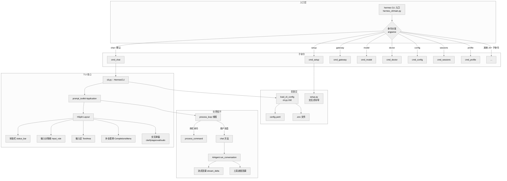
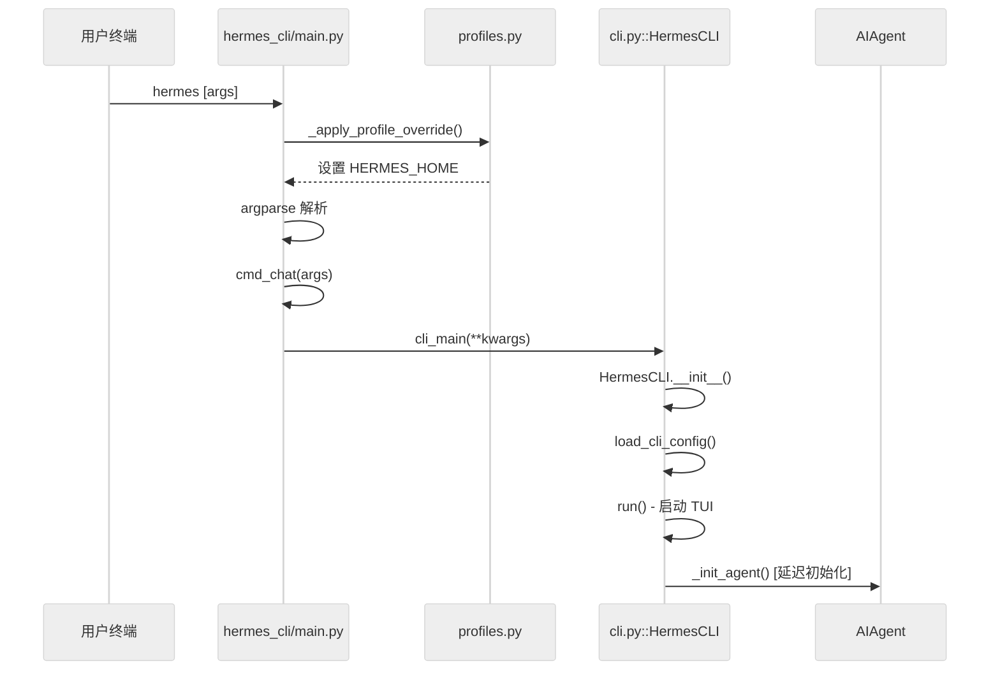
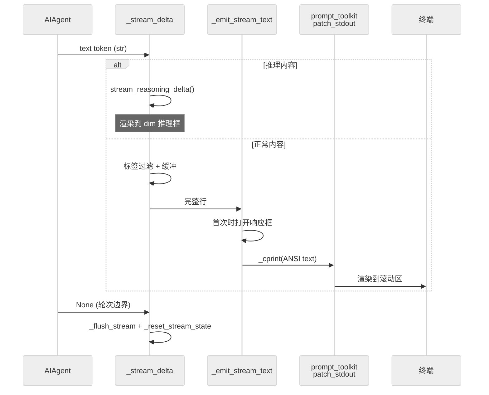
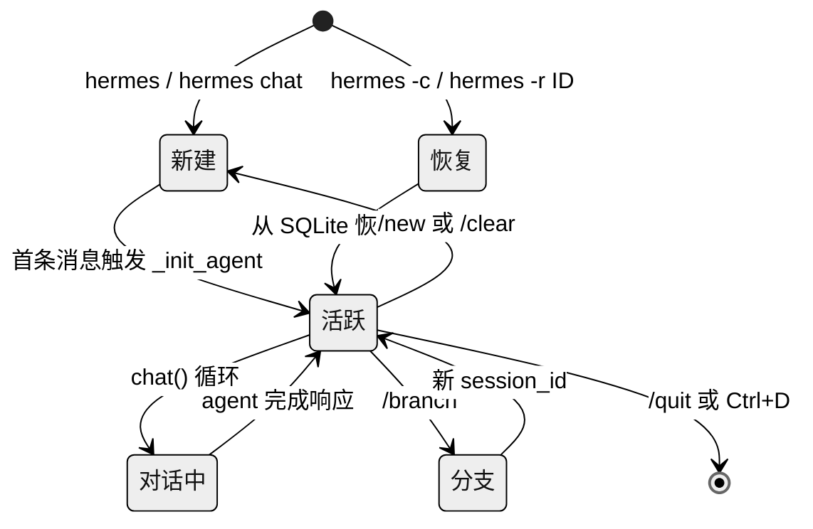
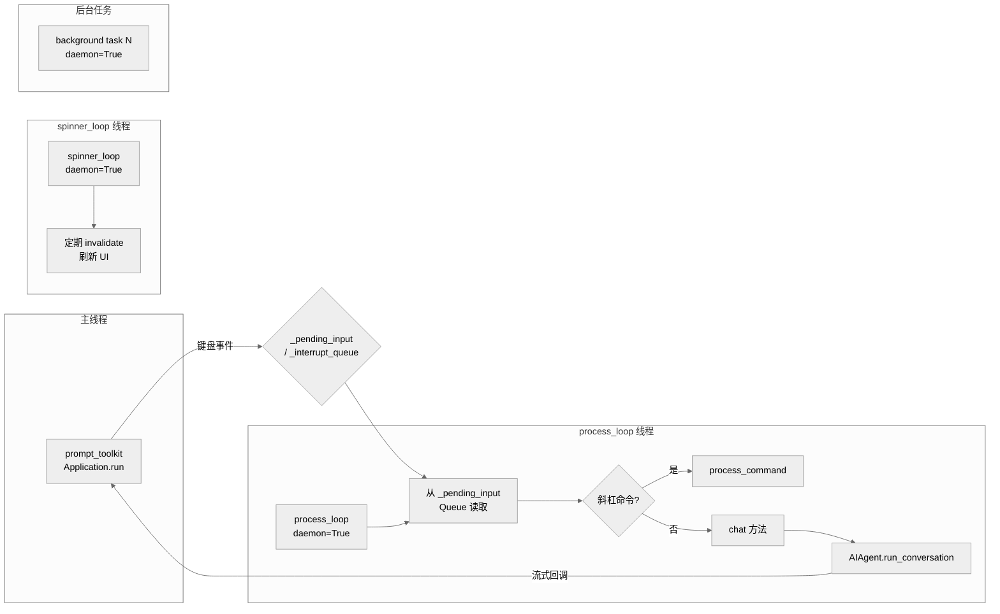

# 第四章：交互式 CLI

> **一句话概要**：Hermes Agent 的交互式 CLI 是一个基于 prompt_toolkit 构建的全功能终端 UI（TUI），包含约 36,000 行代码，实现了固定底部输入区、实时流式渲染、50+ 斜杠命令、多提供商模型切换、会话管理、皮肤主题引擎以及完整的 `hermes` 命令行工具链（setup、gateway、model、doctor 等 30+ 子命令）。

---

## 4.1 架构总览

### 4.1.1 系统架构图



### 4.1.2 双层启动流程

CLI 的启动涉及两个文件的协作：

1. **`hermes_cli/main.py`**（5,929 行）：作为 `hermes` 可执行文件的入口点（`main()` 函数在 `main.py:4399`），使用 argparse 解析命令行参数并分发到对应处理函数。
2. **`cli.py`**（9,878 行）：包含 `HermesCLI` 类和 TUI 的全部实现，由 `cmd_chat` 通过 `from cli import main as cli_main` 调用。



### 4.1.3 Profile 预解析机制

在任何模块导入之前，`_apply_profile_override()`（`main.py:83`）会预扫描 `sys.argv` 中的 `--profile/-p` 标志，设置 `HERMES_HOME` 环境变量。这一设计至关重要——因为许多模块在导入时就缓存了 `HERMES_HOME`（模块级常量），所以必须在所有 hermes 模块导入前完成路径覆盖。

---

## 4.2 TUI 架构（cli.py）

### 4.2.1 prompt_toolkit 布局

TUI 使用 prompt_toolkit 的 `Application` 构建，布局由 `_build_tui_layout_children`（`cli.py:8040`）方法组装为一个垂直堆叠（`HSplit`）：

```python
# cli.py:9239-9258
layout = Layout(
    HSplit(
        self._build_tui_layout_children(
            sudo_widget=sudo_widget,
            secret_widget=secret_widget,
            approval_widget=approval_widget,
            clarify_widget=clarify_widget,
            model_picker_widget=model_picker_widget,
            spinner_widget=spinner_widget,
            spacer=spacer,
            status_bar=status_bar,
            input_rule_top=input_rule_top,
            image_bar=image_bar,
            input_area=input_area,
            input_rule_bot=input_rule_bot,
            voice_status_bar=voice_status_bar,
            completions_menu=completions_menu,
        )
    )
)
```

**布局组件从上到下**：

| 组件 | 类型 | 说明 |
|------|------|------|
| `Window(height=0)` | 占位 | 零高度锚定点 |
| `sudo_widget` | `ConditionalContainer` | sudo 密码输入面板，仅在 `_sudo_state` 激活时可见 |
| `secret_widget` | `ConditionalContainer` | 密钥捕获面板（技能安装时） |
| `approval_widget` | `ConditionalContainer` | 危险命令审批面板（↑/↓ 选择） |
| `clarify_widget` | `ConditionalContainer` | 澄清工具多选面板 |
| `model_picker_widget` | `ConditionalContainer` | `/model` 快速切换面板 |
| `spinner_widget` | `ConditionalContainer` | 工具执行旋转动画 |
| `spacer` | `Window` | 弹性空白区，将内容推向底部 |
| `*extra_tui_widgets` | 扩展钩子 | 包装 CLI 可注入自定义组件 |
| `status_bar` | `ConditionalContainer` | 状态栏：模型/token/上下文/耗时/费用 |
| `input_rule_top` | `Window` | 输入区上方的铜色分隔线 |
| `image_bar` | `ConditionalContainer` | 剪贴板图片附件标签 |
| `input_area` | `TextArea` | 多行输入区（高度 1-8 行自适应） |
| `input_rule_bot` | `Window` | 输入区下方的分隔线 |
| `voice_status_bar` | `ConditionalContainer` | 语音模式状态指示 |
| `completions_menu` | `CompletionsMenu` | 斜杠命令自动补全菜单（最多 12 行） |

### 4.2.2 输入区（TextArea）

输入区是核心交互组件（`cli.py:8709-8723`）：

```python
input_area = TextArea(
    height=Dimension(min=1, max=8, preferred=1),
    prompt=get_prompt,
    style='class:input-area',
    multiline=True,
    wrap_lines=True,
    read_only=Condition(lambda: bool(cli_ref._command_running)),
    history=FileHistory(str(self._history_file)),
    completer=SlashCommandCompleter(...),
    complete_while_typing=True,
    auto_suggest=SlashCommandAutoSuggest(...),
)
```

**关键特性**：

- **动态高度**：`_input_height()`（`cli.py:8727`）根据内容的逻辑行数和视觉换行计算实际高度（1-8 行），支持 CJK 宽字符。
- **粘贴折叠**：`_on_text_changed`（`cli.py:8761`）检测大段粘贴（>5 行），自动保存为临时文件并替换为紧凑引用 `[Pasted text #N: M lines -> path]`。
- **密码遮罩**：`ConditionalProcessor` + `PasswordProcessor` 在 sudo/secret 状态下将输入显示为 `*`。
- **占位文本**：`_PlaceholderProcessor`（`cli.py:8813`）根据当前状态显示不同提示文本（录音中、转录中、等待审批等）。

### 4.2.3 键绑定

所有键绑定通过 `KeyBindings` 对象注册：

| 快捷键 | 处理函数 | 行为 |
|--------|----------|------|
| `Enter` | `handle_enter`（`cli.py:8219`） | 上下文感知提交：sudo/secret/approval/clarify/model-picker 各走自己的响应队列；agent 运行中走 `_interrupt_queue`；空闲走 `_pending_input` |
| `Alt+Enter` | `handle_alt_enter`（`cli.py:8328`） | 插入换行（多行输入） |
| `Ctrl+J` | `handle_ctrl_enter`（`cli.py:8333`） | 同上（大多数终端将 Ctrl+Enter 编码为 c-j） |
| `Tab` | `handle_tab`（`cli.py:8338`） | 三级优先：接受补全 > 接受自动建议 > 启动补全菜单 |
| `↑/↓` | `clarify_up/down` | 在 clarify/approval/model-picker 选项间导航（条件过滤器） |
| `Ctrl+C` | `handle_ctrl_c`（`cli.py:8441`） | 中断 agent；2 秒内双击强制退出 |
| `Ctrl+D` | `handle_ctrl_d`（`cli.py:8533`） | 退出 CLI |
| `Ctrl+Z` | `handle_ctrl_z`（`cli.py:8539`） | 挂起到后台（SIGTSTP） |
| `Ctrl+B` | `handle_voice_record`（`cli.py:8567`） | 语音录制切换 |
| `Ctrl+V` | `handle_ctrl_v`（`cli.py:8665`） | 检测剪贴板图片并附加 |

### 4.2.4 样式系统

TUI 样式由 `_tui_style_base`（`cli.py:9261`）定义基础色板，然后通过 `_build_tui_style_dict()`（`cli.py:7996`）叠加活动皮肤的 prompt_toolkit 颜色覆盖。核心样式类：

- `input-area`：输入文本色 `#FFF8DC`
- `status-bar`：深蓝底色 `bg:#1a1a2e`，配合 good/warn/bad/critical 四级上下文色
- `completion-menu`：深蓝底，金色高亮当前项
- `clarify-*`、`approval-*`、`sudo-*`：各交互面板的专用配色

---

## 4.3 斜杠命令系统

### 4.3.1 命令注册机制

所有斜杠命令在 `hermes_cli/commands.py` 中通过 `COMMAND_REGISTRY`（行 56）统一注册。每个命令由 `CommandDef` 数据类定义：

```python
@dataclass(frozen=True)
class CommandDef:
    name: str                          # 规范名称（不含斜杠）
    description: str                   # 人类可读描述
    category: str                      # 分类：Session, Configuration, Tools & Skills, Info, Exit
    aliases: tuple[str, ...] = ()      # 别名
    args_hint: str = ""                # 参数提示
    subcommands: tuple[str, ...] = ()  # Tab 补全子命令
    cli_only: bool = False             # 仅 CLI 可用
    gateway_only: bool = False         # 仅 gateway 可用
    gateway_config_gate: str | None = None  # 配置门控
```

注册表在导入时构建多个派生查找结构：
- `_COMMAND_LOOKUP`：名称/别名 -> `CommandDef` 映射（`commands.py:178`）
- `COMMANDS`：`"/name"` -> 描述字符串的扁平字典（向后兼容）
- `COMMANDS_BY_CATEGORY`：按分类分组
- `SUBCOMMANDS`：`"/name"` -> 子命令列表
- `GATEWAY_KNOWN_COMMANDS`：gateway 可识别的命令冻结集

`rebuild_lookups()`（`commands.py:189`）在插件命令注册后重建所有查找表。

### 4.3.2 命令补全与自动建议

- **`SlashCommandCompleter`**（`commands.py` 中定义，`cli.py:8705` 使用）：提供斜杠命令 + 技能命令 + 子命令的 Tab 补全。支持两阶段补全：先补全命令名，再补全子命令。
- **`SlashCommandAutoSuggest`**：结合历史建议和命令建议，以灰色幽灵文本显示在输入光标后方。

### 4.3.3 命令分发

`process_command`（`cli.py:5192`）是所有斜杠命令的分发中心。流程：

1. 通过 `resolve_command()` 将别名解析为规范名称
2. 大型 `if/elif` 链匹配规范名称并调用对应处理方法
3. 未匹配时依次尝试：用户自定义 `quick_commands` -> 插件命令 -> 技能命令 -> 前缀匹配

### 4.3.4 完整命令列表

**Session 类**：

| 命令 | 别名 | 说明 |
|------|------|------|
| `/new` | `/reset` | 开始新会话 |
| `/clear` | - | 清屏并重新开始 |
| `/history` | - | 显示对话历史 |
| `/save` | - | 保存当前对话 |
| `/retry` | - | 重试上一条消息 |
| `/undo` | - | 撤销最后一轮对话 |
| `/title [name]` | - | 设置会话标题 |
| `/branch [name]` | `/fork` | 分支当前会话 |
| `/compress [topic]` | - | 手动压缩上下文 |
| `/rollback [N]` | - | 文件系统检查点回滚 |
| `/stop` | - | 终止所有后台进程 |
| `/background <prompt>` | `/bg` | 后台运行任务 |
| `/btw <question>` | - | 临时侧问（不使用工具，不持久化） |
| `/queue <prompt>` | `/q` | 排队消息到下一轮 |
| `/status` | - | 显示会话信息 |
| `/resume [name]` | - | 恢复之前的会话 |

**Configuration 类**：

| 命令 | 说明 |
|------|------|
| `/config` | 显示当前配置 |
| `/model [model] [--global]` | 切换模型 |
| `/provider` | 显示提供商信息 |
| `/personality [name]` | 设置预定义人格 |
| `/statusbar` (别名 `/sb`) | 切换状态栏可见性 |
| `/verbose` | 循环工具进度级别：off -> new -> all -> verbose |
| `/yolo` | 切换 YOLO 模式（跳过所有命令审批） |
| `/reasoning [level]` | 管理推理深度和显示 |
| `/fast [mode]` | 切换优先处理模式 |
| `/skin [name]` | 切换主题皮肤 |
| `/voice [on\|off\|tts]` | 语音模式控制 |

**Tools & Skills 类**：

| 命令 | 说明 |
|------|------|
| `/tools [list\|disable\|enable]` | 管理工具启用/禁用 |
| `/toolsets` | 列出可用工具集 |
| `/skills [search\|browse\|inspect\|install]` | 技能管理 |
| `/cron [subcommand]` | 定时任务管理 |
| `/reload-mcp` (别名 `/reload_mcp`) | 重新加载 MCP 服务器 |
| `/browser [connect\|disconnect\|status]` | CDP 浏览器连接 |
| `/plugins` | 列出已安装插件 |

**Info 类**：

| 命令 | 说明 |
|------|------|
| `/help` | 显示可用命令 |
| `/usage` | 显示 token 使用和费用 |
| `/insights [days]` | 使用量分析 |
| `/paste` | 检查剪贴板图片 |
| `/image <path>` | 附加本地图片 |
| `/profile` | 显示活动 profile 信息 |
| `/platforms` (别名 `/gateway`) | 显示 gateway 平台状态 |

**Exit 类**：

| 命令 | 别名 | 说明 |
|------|------|------|
| `/quit` | `/exit`, `/q` | 退出 CLI |

---

## 4.4 流式输出渲染

### 4.4.1 流式架构

LLM 响应的实时流式渲染通过回调链实现：



### 4.4.2 流式回调

`_stream_delta`（`cli.py:2392`）是流式渲染的核心回调：

- **行缓冲**：将 token 追加到 `_stream_buf`，仅在遇到换行符时输出完整行。
- **推理标签过滤**：检测 `<think>`、`<REASONING_SCRATCHPAD>` 等标签，在流式过程中抑制原始 XML 标签的显示。当 `show_reasoning` 开启时，将推理内容路由到专用的 dim 推理框。
- **轮次边界**：收到 `None` 信号时刷新缓冲区并重置状态，确保工具执行反馈行在轮次之间正确渲染。

`_stream_reasoning_delta`（`cli.py:2338`）处理推理/思考 token：
- 首个推理 token 到达时打开带标签的推理框（`┌─ Reasoning ──...┐`）
- 内容以 dim 样式逐行流式输出
- 当正常内容开始时自动关闭推理框（`└──...┘`）

### 4.4.3 状态栏实时更新

`_get_status_bar_snapshot()`（`cli.py:1876`）收集 agent 状态，`_build_status_bar_text()`（`cli.py:2033`）格式化为单行文本，包含：

- 模型名称（缩短到 26 字符）
- 上下文 token 数和可视化进度条 `[████░░░░░░]`
- 会话输入/输出 token 数
- 缓存读/写 token 数
- API 调用次数
- 压缩次数
- 会话时长
- 预估费用

状态栏由 `spinner_loop`（`cli.py:9366`）后台线程以 100-1000ms 间隔刷新。

---

## 4.5 会话管理

### 4.5.1 会话生命周期



**会话 ID 格式**：`{YYYYMMDD_HHMMSS}_{6位hex}`（`cli.py:1794-1796`）

**恢复机制**（`_handle_resume_command`，`cli.py:4042`）：
1. 解析会话名称或 ID
2. 通过 `SessionDB` 查找会话
3. 加载对话历史（`get_messages_as_conversation`）
4. 可选地显示恢复的历史（`_display_resumed_history`，`cli.py:3080`）
5. 使用原始 `session_id` 继续对话

**分支**（`_handle_branch_command`，`cli.py:4121`）：创建新的 session_id，复制当前对话历史，实现会话探索的分叉。

### 4.5.2 对话历史持久化

会话数据通过 `hermes_state.SessionDB`（SQLite）持久化：
- `sessions` 表：session_id、标题、来源、时间戳等元数据
- `messages` 表：角色、内容、工具调用信息等
- 支持按标题/ID 搜索、分页浏览、导出为 JSONL

### 4.5.3 预填充消息

`_load_prefill_messages`（`cli.py:85`）支持从 JSON 文件加载少样本对话示例，注入到对话历史的开头但不持久化（ephemeral），用于引导 agent 的行为模式。

---

## 4.6 命令分发（hermes_cli/main.py）

### 4.6.1 主入口函数

`main()`（`main.py:4399`）使用 argparse 构建完整的命令树。关键设计：

- **默认命令**：无子命令时默认为 `chat`（`main.py:5907-5919`）
- **顶层快捷标志**：`--resume/-r` 和 `--continue/-c` 直接路由到 chat 命令
- **容器感知路由**：在 NixOS 容器模式下，所有子命令透明转发到容器内执行（`main.py:5878-5884`）
- **函数分发**：每个 subparser 通过 `set_defaults(func=cmd_xxx)` 绑定处理函数

### 4.6.2 完整子命令列表

| 子命令 | 处理函数 | 行号 | 说明 |
|--------|----------|------|------|
| `chat` | `cmd_chat` | 676 | 交互式对话（默认） |
| `setup` | `cmd_setup` | 979 | 交互式设置向导 |
| `model` | `cmd_model` | 985 | 选择默认模型 |
| `gateway` | `cmd_gateway` | 786 | 网关管理（start/stop/status/install/uninstall） |
| `whatsapp` | `cmd_whatsapp` | 792 | WhatsApp 设置向导 |
| `login` | `cmd_login` | 2789 | OAuth 登录 |
| `logout` | `cmd_logout` | 2795 | 清除认证 |
| `auth` | `cmd_auth` | 2801 | 凭据池管理（add/list/remove/reset） |
| `status` | `cmd_status` | 2807 | 全组件状态概览 |
| `cron` | `cmd_cron` | 2813 | 定时任务管理 |
| `webhook` | `cmd_webhook` | 2819 | Webhook 订阅管理 |
| `doctor` | `cmd_doctor` | 2825 | 诊断检查 |
| `dump` | `cmd_dump` | 2831 | 导出配置/诊断信息 |
| `config` | `cmd_config` | 2837 | 配置查看/编辑/设置 |
| `backup` | `cmd_backup` | 2843 | 备份 HERMES_HOME |
| `import` | `cmd_import` | 2849 | 导入备份 |
| `version` | `cmd_version` | 2855 | 显示版本 |
| `update` | `cmd_update` | 3587 | 更新到最新版本 |
| `uninstall` | `cmd_uninstall` | 2887 | 卸载 |
| `profile` | `cmd_profile` | 4120 | Profile 管理（create/use/delete/alias/export/import） |
| `sessions` | `cmd_sessions` | 5415 | 会话管理（list/browse/export/delete/prune/rename） |
| `skills` | `cmd_skills` | 5131 | 技能管理（browse/search/install/inspect/audit/publish） |
| `plugins` | `cmd_plugins` | 5187 | 插件管理（install/update/remove/enable/disable） |
| `tools` | `cmd_tools` | 5306 | 工具管理（list/disable/enable） |
| `mcp` | `cmd_mcp` | 5361 | MCP 服务器管理（serve/add/remove/list/test/configure） |
| `memory` | `cmd_memory` | 5231 | 记忆系统设置 |
| `insights` | `cmd_insights` | 5582 | 使用量分析 |
| `claw` | `cmd_claw` | 5677 | OpenClaw 迁移工具 |
| `acp` | `cmd_acp` | 5735 | ACP 服务器模式 |
| `completion` | `cmd_completion` | 4368 | Shell 补全脚本生成 |
| `logs` | `cmd_logs` | 4378 | 日志查看（支持 -f follow） |
| `pairing` | `cmd_pairing` | 5055 | 配对码管理 |
| `honcho` | - | （main.py 头部文档） | Honcho 记忆集成 |

### 4.6.3 TTY 守卫

需要交互式终端的命令（如 `model`、`setup`、`tools`）在执行前通过 `_require_tty()`（`main.py:53`）检查 `sys.stdin.isatty()`，防止在管道或非交互式环境中 100% CPU 空转。

---

## 4.7 设置向导（hermes setup）

### 4.7.1 向导结构

`run_setup_wizard`（`setup.py:2718`）是入口函数，支持完整向导和按节运行：

```
hermes setup            # 完整向导（自动检测新/旧安装）
hermes setup model      # 仅模型/提供商
hermes setup terminal   # 仅终端后端
hermes setup agent      # 仅 agent 设置
hermes setup gateway    # 仅消息平台
hermes setup tools      # 仅工具配置
hermes setup tts        # 仅 TTS 语音
```

### 4.7.2 向导步骤

向导通过 `SETUP_SECTIONS` 定义的分节函数实现：

| 步骤 | 函数 | 行号 | 内容 |
|------|------|------|------|
| 1. 模型与提供商 | `setup_model_provider` | 669 | 提供商选择 -> 凭据配置 -> 模型列表 -> 选择默认模型 |
| 2. 终端后端 | `setup_terminal_backend` | 1099 | local/docker/ssh/singularity/modal/daytona 后端配置 |
| 3. Agent 设置 | `setup_agent_settings` | 1467 | max_turns、压缩阈值、推理深度、人格、会话重置策略 |
| 4. 消息平台 | `setup_gateway` | 2146 | Telegram/Discord/Slack/Signal/WhatsApp 等平台配置 |
| 5. 工具配置 | `setup_tools` | 2314 | TTS、图片生成、代码沙箱、浏览器等工具设置 |

### 4.7.3 提供商选择流程

`select_provider_and_model`（`main.py:991`）实现了完整的提供商选择逻辑：

1. **主菜单**显示 7 个常用提供商（Nous、OpenRouter、Anthropic、OpenAI Codex、Qwen OAuth、GitHub Copilot、Hugging Face）
2. **"More providers..."** 展开 12 个额外提供商（Gemini、Z.AI、Kimi、MiniMax 等）
3. 用户自定义的 `custom_providers` 配置也出现在主菜单
4. 选择后进入凭据配置（OAuth 设备码流程 或 API key 输入）
5. 最后进入 curses 界面的模型选择器

交互菜单使用 `curses_radiolist`（来自 `hermes_cli/curses_ui.py`）实现键盘导航选择。

---

## 4.8 配置系统

### 4.8.1 配置加载链

配置加载涉及两个路径：

**CLI 启动时**（`cli.py:192`）的 `load_cli_config()`：
1. 检查 `{HERMES_HOME}/config.yaml`（用户配置，优先）
2. 回退到 `./cli-config.yaml`（项目配置）
3. 与硬编码的 `defaults` 字典深度合并
4. 扩展 `${ENV_VAR}` 引用
5. 将终端/浏览器/辅助模型配置桥接到环境变量

**通用加载**（`config.py:2249`）的 `load_config()`：
1. 读取 `~/.hermes/config.yaml`
2. 与 `DEFAULT_CONFIG` 深度合并
3. 规范化遗留键（root-level `max_turns`、`provider`、`base_url`）
4. 扩展环境变量引用

### 4.8.2 配置结构（config.yaml）

```yaml
model:
  default: "anthropic/claude-sonnet-4.5"  # 默认模型
  provider: "openrouter"                   # 推理提供商
  base_url: ""                            # 自定义端点
terminal:
  env_type: "local"       # local/docker/ssh/singularity/modal/daytona
  cwd: "."                # 工作目录
  timeout: 60             # 命令超时(秒)
  lifetime_seconds: 300   # 终端环境生命周期
compression:
  enabled: true
  threshold: 0.50         # 上下文使用率阈值
  summary_model: ""       # 摘要模型
agent:
  max_turns: 90           # 最大工具调用轮次
  system_prompt: ""       # 自定义系统提示
  reasoning_effort: ""    # 推理深度
  personalities: {...}    # 14 种预设人格
display:
  compact: false
  streaming: true         # 流式 token 渲染
  show_reasoning: false   # 显示推理过程
  skin: "default"         # 主题皮肤
  busy_input_mode: "interrupt"  # interrupt 或 queue
delegation:
  max_iterations: 45
  default_toolsets: [terminal, file, web]
  model: ""               # 子 agent 模型覆盖
smart_model_routing:
  enabled: false          # 简单/复杂问题路由
auxiliary:
  vision: {provider, model, base_url, api_key}
  web_extract: {provider, model, base_url, api_key}
security:
  redact_secrets: true
  tirith_enabled: true    # 命令安全扫描
```

### 4.8.3 配置管理命令

`hermes config` 子命令组（`main.py:5001`）：

| 命令 | 说明 |
|------|------|
| `hermes config show` | 显示当前配置 |
| `hermes config edit` | 在 $EDITOR 中编辑 config.yaml |
| `hermes config set key value` | 设置指定配置项（支持点分路径） |
| `hermes config path` | 打印 config.yaml 路径 |
| `hermes config env-path` | 打印 .env 文件路径 |
| `hermes config check` | 检查缺失/过时配置 |
| `hermes config migrate` | 更新配置到新版本 |

---

## 4.9 模型管理

### 4.9.1 模型选择流程

`hermes model`（`main.py:985` -> `select_provider_and_model`）提供完整的提供商 + 模型选择流程。在 CLI 交互中，`/model` 命令（`cli.py:5347` -> `_handle_model_switch`，`cli.py:4572`）支持：

- `/model sonnet` — 模糊匹配切换
- `/model anthropic/claude-opus-4.6` — 精确指定
- `/model --global` — 全局持久化更改（写入 config.yaml）
- `/model` （无参数）— 打开 curses 模型选择器

### 4.9.2 模型目录

`hermes_cli/models.py`（1,899 行）维护多个提供商的模型目录：

- **OpenRouter**：`OPENROUTER_MODELS` 列表作为离线后备，运行时通过 API 获取实时目录
- **GitHub Copilot**：通过 `COPILOT_MODELS_URL` 获取可用模型列表
- **其他提供商**：`setup.py` 中的 `_DEFAULT_PROVIDER_MODELS` 字典提供静态列表

`normalize_copilot_model_id`、`github_model_reasoning_efforts` 等辅助函数处理提供商特定的模型名称标准化和推理能力映射。

---

## 4.10 认证系统

### 4.10.1 架构

`hermes_cli/auth.py`（3,257 行）实现多提供商认证系统：

**Provider Registry**（`auth.py:102`）定义已知提供商：

| 提供商 | auth_type | 认证方式 |
|--------|-----------|----------|
| `nous` | `oauth_device_code` | Nous Portal OAuth 设备码流 |
| `openai-codex` | `oauth_external` | OpenAI OAuth（外部浏览器） |
| `qwen-oauth` | `oauth_external` | Qwen OAuth |
| `copilot` | `api_key` | GITHUB_TOKEN / gh auth |
| `copilot-acp` | `external_process` | 启动 `copilot --acp --stdio` |
| `gemini` | `api_key` | GOOGLE_API_KEY |
| `zai` | `api_key` | ZAI_API_KEY |
| `kimi-coding` | `api_key` | KIMI_API_KEY |
| `minimax` / `minimax-cn` | `api_key` | MINIMAX_API_KEY |
| `anthropic` | `api_key` | ANTHROPIC_API_KEY |
| 其他 | `api_key` | 各自的环境变量 |

### 4.10.2 OAuth 设备码流程

对于 Nous Portal 等 OAuth 提供商：

1. 向 Portal 请求设备码和用户码
2. 自动打开浏览器到验证 URL
3. 以可配置间隔轮询 token 端点
4. 获得 access_token 后自动铸造短期 agent key
5. 凭据持久化到 `~/.hermes/auth.json`（带文件锁的跨进程安全访问）
6. Token 过期前自动刷新（提前 120 秒）

### 4.10.3 凭据池

`hermes auth add/list/remove/reset` 支持凭据池管理——多个相同提供商的 API key 按策略轮换（round-robin 或 fallback），实现负载均衡和限速容忍。

---

## 4.11 Profile 系统

### 4.11.1 概念

`hermes_cli/profiles.py`（1,084 行）实现多配置文件支持。每个 Profile 是一个独立的 `HERMES_HOME` 目录，拥有自己的：

- `config.yaml` 和 `.env`
- 会话数据库、记忆文件、SOUL.md
- 技能、皮肤、日志、定时任务
- 隔离的 `home/` 目录（子进程工具配置不泄漏）

**默认 Profile** 是 `~/.hermes` 本身——零迁移成本。命名 Profile 位于 `~/.hermes/profiles/<name>/`。

### 4.11.2 Profile 命令

```
hermes profile create coder              # 创建空 profile
hermes profile create coder --clone      # 克隆配置和身份文件
hermes profile create coder --clone-all  # 完整克隆
hermes profile use coder                 # 设置为粘性默认
hermes profile alias coder               # 创建包装脚本（直接 `coder chat`）
hermes profile delete coder              # 删除 profile + 别名 + 服务
hermes -p coder chat                     # 通过标志指定 profile
hermes profile export coder              # 导出为存档
hermes profile import archive.tar.gz     # 导入存档
```

粘性默认通过 `~/.hermes/active_profile` 文件实现，`_apply_profile_override()` 在启动时读取。

---

## 4.12 Doctor 诊断

### 4.12.1 检查项目

`hermes doctor`（`doctor.py:162`，`run_doctor` 函数）执行系统性诊断：

| 检查类别 | 检查内容 |
|---------|----------|
| Python 环境 | 版本（3.10+ 推荐，3.11+ 用于训练工具）、虚拟环境 |
| 必需包 | openai, rich, dotenv, yaml, httpx |
| 可选包 | croniter, telegram, discord |
| 配置文件 | `.env` 存在性、API key 配置、config.yaml 存在性 |
| 配置版本 | 检测过时版本，支持 `--fix` 自动迁移 |
| 过时配置键 | 检测根级 `provider`/`base_url`（应在 `model:` 下） |
| 工具可用性 | 逐一检查所有注册工具的依赖和配置 |
| Gateway 服务 | systemd linger 状态（防止登出后服务停止） |
| 可选系统依赖 | Node.js（浏览器工具）、git、ffmpeg 等 |

每项检查输出 `✓` (ok) / `⚠` (warn) / `✗` (fail)，并收集可修复问题列表。`--fix` 标志尝试自动修复（创建缺失文件、迁移配置等）。

---

## 4.13 其他 CLI 子系统

### 4.13.1 Banner 与品牌展示

`hermes_cli/banner.py`（536 行）提供欢迎屏幕的纯显示函数：

- `HERMES_AGENT_LOGO`：Unicode 方块字 ASCII Art 标题
- `HERMES_CADUCEUS`：点阵双蛇杖图标
- `build_welcome_banner()`：使用 Rich Panel 构建欢迎面板，包含模型名、工作目录、可用工具、技能列表、上下文长度
- `_build_compact_banner()`（`cli.py:1398`）：窄终端（<80 列）的紧凑版

### 4.13.2 皮肤引擎

`hermes_cli/skin_engine.py`（723 行）实现数据驱动的主题系统：

- **内置皮肤**：`default`（金色/可爱风）、`ares`（深红/战神风）、`mono`（灰度极简）、`slate`（冷蓝开发者风）
- **用户皮肤**：`~/.hermes/skins/<name>.yaml`
- **可定制属性**：颜色（16 个可配色位）、旋转器动画、品牌文字、工具前缀符号、工具 emoji
- **切换方式**：`/skin <name>` 命令或 `display.skin` 配置项
- `/skin` 无参数时列出所有可用皮肤（内置 + 用户）

### 4.13.3 上下文提示

`hermes_cli/tips.py`（351 行）维护约 100 条单行提示，覆盖斜杠命令、CLI 标志、配置、快捷键、工具、gateway、技能、profile 和工作流技巧。`get_random_tip()` 在会话启动和 `/clear` 后随机展示一条。

### 4.13.4 Curses UI 组件

`hermes_cli/curses_ui.py`（445 行）提供共享的 curses 界面组件：

- `curses_checklist()`：多选清单（用于 `hermes tools`、`hermes skills config`）
- `curses_radiolist()`：单选菜单（用于 setup 向导）
- `flush_stdin()`：curses 退出后清空输入缓冲区（防止箭头键转义序列污染后续 `input()` 调用）
- 非 TTY 环境自动降级到文本界面

### 4.13.5 插件系统

`hermes_cli/plugins.py`（648 行）实现插件发现、加载和生命周期管理：

- **来源**：用户目录（`~/.hermes/plugins/`）、项目目录（`./.hermes/plugins/`）、pip 入口点
- **清单**：每个插件需要 `plugin.yaml` + `__init__.py` 的 `register(ctx)` 函数
- **注册**：通过 `PluginContext.register_tool()` 和钩子注册
- **生命周期钩子**：`pre_tool_call`、`post_tool_call`、`pre_llm_call`、`post_llm_call`、`pre_api_request` 等
- **命令注册**：插件可注册自定义斜杠命令，通过 `rebuild_lookups()` 集成到补全和帮助系统

### 4.13.6 Provider 身份

`hermes_cli/providers.py`（543 行）是提供商身份信息的单一事实来源，合并三个数据源：

1. **models.dev 目录**：109+ 提供商的 base URL、环境变量、模型元数据
2. **Hermes 覆盖层**（`HERMES_OVERLAYS` 字典）：传输类型、认证模式、聚合器标志
3. **用户配置**（config.yaml `providers:` 节）：自定义端点和覆盖

---

## 4.14 进程循环与线程模型

### 4.14.1 线程架构



**关键队列**：
- `_pending_input`（`queue.Queue`）：空闲时的用户输入
- `_interrupt_queue`（`queue.Queue`）：agent 运行时的中断消息（`cli.py:8306-8313`）

**中断机制**：当 agent 运行时用户输入并按 Enter：
- 如果 `busy_input_mode == "interrupt"`：消息进入 `_interrupt_queue`，`chat()` 方法在工具调用间检查此队列
- 如果 `busy_input_mode == "queue"`：消息进入 `_pending_input`，等到当前轮结束后处理

### 4.14.2 资源清理

`_run_cleanup()`（`cli.py:599`）通过 `atexit` 注册，在退出时依次清理：
1. 终端环境（Docker/SSH 容器、本地 shell）
2. 浏览器会话（Playwright/CDP）
3. MCP 服务器连接
4. 异步 HTTP 客户端
5. 插件 `on_session_finalize` 钩子
6. 记忆提供商（Honcho 等）关闭

---

## 4.15 关键文件索引

| 文件 | 行数 | 职责 |
|------|------|------|
| `cli.py` | 9,878 | TUI 主体：HermesCLI 类、prompt_toolkit 应用、流式渲染、斜杠命令分发、会话管理、语音模式 |
| `hermes_cli/main.py` | 5,929 | CLI 入口点：argparse 命令树、30+ cmd_xxx 处理函数、提供商选择流程 |
| `hermes_cli/config.py` | 3,095 | 配置管理：load/save/migrate、环境变量桥接、容器模式检测、managed 模式 |
| `hermes_cli/setup.py` | 3,168 | 设置向导：5 个模块化分节（model、terminal、agent、gateway、tools） |
| `hermes_cli/auth.py` | 3,257 | 认证系统：OAuth 设备码/外部浏览器流、API key 管理、凭据池、token 刷新 |
| `hermes_cli/gateway.py` | 2,811 | Gateway 管理：systemd/launchd 服务安装、start/stop/status/restart |
| `hermes_cli/models.py` | 1,899 | 模型目录：OpenRouter/Copilot/其他提供商的模型列表、在线获取、名称标准化 |
| `hermes_cli/commands.py` | 1,051 | 命令注册表：CommandDef 数据类、COMMAND_REGISTRY、补全器、自动建议、gateway 帮助生成 |
| `hermes_cli/profiles.py` | 1,084 | Profile 管理：create/clone/use/delete/alias/export/import |
| `hermes_cli/doctor.py` | 1,021 | 诊断检查：Python 环境、依赖包、配置文件、API key、工具可用性 |
| `hermes_cli/skin_engine.py` | 723 | 皮肤引擎：YAML 皮肤定义、内置预设、颜色/品牌/旋转器自定义 |
| `hermes_cli/plugins.py` | 648 | 插件系统：发现/加载/生命周期钩子/工具注册/命令注册 |
| `hermes_cli/providers.py` | 543 | 提供商身份：models.dev + Hermes 覆盖层合并、HermesOverlay 数据类 |
| `hermes_cli/banner.py` | 536 | 欢迎屏幕：ASCII Art、Rich Panel 面板、更新检查、版本标签 |
| `hermes_cli/curses_ui.py` | 445 | Curses 组件：多选清单、单选菜单、stdin 清空 |
| `hermes_cli/tips.py` | 351 | 上下文提示：~100 条随机展示的功能发现提示 |

---

## 4.16 设计亮点与技术决策

### 4.16.1 固定底部输入区

与传统 REPL 的滚动输入不同，Hermes 的输入区始终固定在终端底部。这通过 prompt_toolkit 的 `HSplit` 布局实现：一个弹性 `spacer` Window 占据所有可用空间，将输入组件推到底部。agent 的输出通过 `patch_stdout` 在输入区上方滚动显示。启动时打印 `\n * (terminal_lines - 1)` 行空行（`cli.py:8091-8094`），确保内容从底部开始。

### 4.16.2 上下文感知 Enter 键

`handle_enter`（`cli.py:8219`）是最复杂的键绑定处理器，根据 6 种不同的 UI 状态路由输入到不同的响应队列。优先级从高到低：sudo -> secret -> approval -> model-picker -> clarify freetext -> clarify choice -> normal。这避免了模态对话框的需要，所有交互都通过同一个输入区完成。

### 4.16.3 终端缩小时的幽灵行消除

`_resize_clear_ghosts()`（`cli.py:9334`）解决了一个微妙的问题：当终端缩小时，之前全宽的状态栏行被重排到多行，prompt_toolkit 的标准 resize 处理不会清理这些幽灵行。修复方法是在标准 resize 前，根据缩小比例人为增加 cursor 回退距离。

### 4.16.4 配置桥接到环境变量

`load_cli_config()`（`cli.py:192`）不仅加载配置，还将终端/浏览器/辅助模型配置桥接到环境变量（`cli.py:414-512`）。这使得 `terminal_tool.py` 等模块无需直接读取配置文件——它们只需检查标准环境变量。当配置文件显式设置了 `[terminal]` 节时覆盖 `.env` 中的值；否则 `.env` 优先。

### 4.16.5 命令注册中心化

所有斜杠命令在 `commands.py` 的 `COMMAND_REGISTRY` 中唯一定义。CLI 帮助、gateway 分发、Telegram BotCommands、Slack 映射、Tab 补全——全部从这个单一注册表派生。添加新命令只需一行 `CommandDef`，`rebuild_lookups()` 确保插件命令也无缝集成。
