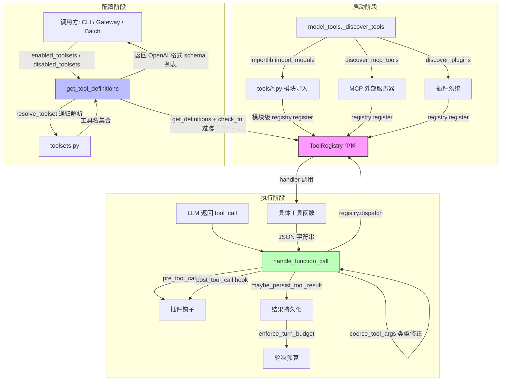
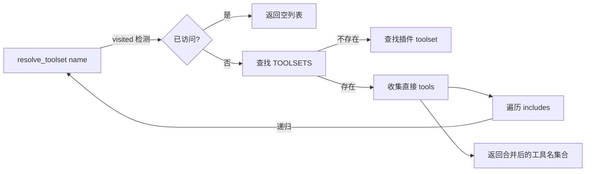
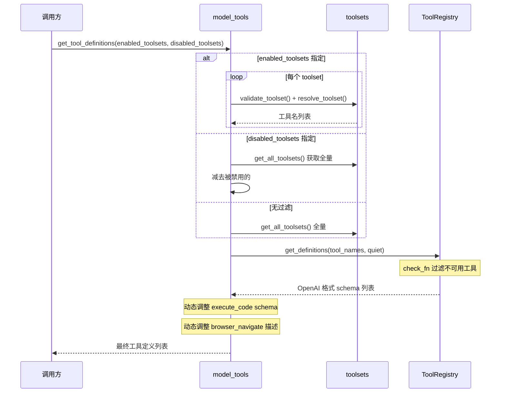
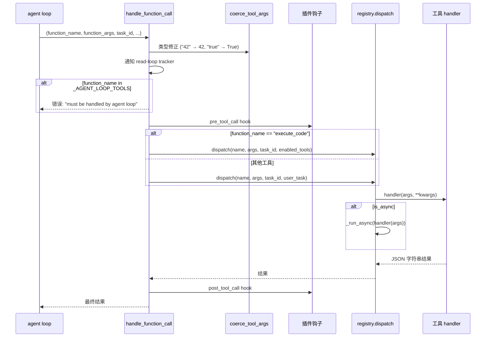
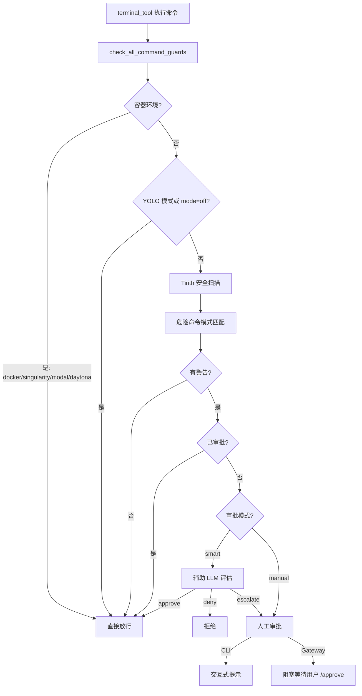

# 第五章：工具系统 (Tool System)

**一句话概述：** hermes-agent 采用基于中央注册表 (Central Registry) 的工具架构——每个工具文件在模块导入时通过 `registry.register()` 自注册其 schema、handler 和元数据；上层通过 toolset 组合机制筛选工具集合，再经由统一的分发器 (`handle_function_call`) 路由到具体处理函数，形成从注册到执行的完整生命周期。

---

## 1. 架构总览

### 1.1 系统架构图



### 1.2 导入链 (防循环导入设计)

```
tools/registry.py        ← 零外部导入，最底层
    ↑
tools/*.py               ← 导入 tools.registry，模块级注册
    ↑
model_tools.py           ← 导入 tools.registry + 全部工具模块
    ↑
run_agent.py / cli.py    ← 消费者
```

`registry.py` 不导入任何工具文件或 `model_tools`，从而保证在任何导入顺序下都不会出现循环依赖。这是整个系统的关键设计约束。

---

## 2. 注册模式 (Registration Pattern)

### 2.1 ToolEntry 数据结构

每个注册的工具在注册表中以 `ToolEntry` 对象存储，定义于 `tools/registry.py:24-45`：

```python
class ToolEntry:
    __slots__ = (
        "name", "toolset", "schema", "handler", "check_fn",
        "requires_env", "is_async", "description", "emoji",
        "max_result_size_chars",
    )
```

| 字段 | 类型 | 说明 |
|------|------|------|
| `name` | `str` | 工具唯一名称，如 `"read_file"` |
| `toolset` | `str` | 所属工具集，如 `"file"`, `"web"` |
| `schema` | `dict` | OpenAI function calling 格式的 JSON Schema |
| `handler` | `Callable` | 工具执行函数，签名 `(args: dict, **kwargs) -> str` |
| `check_fn` | `Callable` | 可用性检查函数，返回 `bool`；`None` 表示始终可用 |
| `requires_env` | `list` | 所需环境变量列表，用于 UI 展示和诊断 |
| `is_async` | `bool` | 标记 handler 是否为协程 |
| `emoji` | `str` | 工具在 UI 中的图标 |
| `max_result_size_chars` | `int/float/None` | 结果持久化阈值；`float('inf')` 表示永不持久化 |

### 2.2 注册方式：模块级函数调用

hermes-agent 不使用装饰器注册——每个工具文件在文件末尾（模块级代码）直接调用 `registry.register()`。这是一种**导入即注册** (import-time registration) 模式。

**典型注册示例** (`tools/file_tools.py:832-835`)：

```python
from tools.registry import registry

registry.register(
    name="read_file", toolset="file",
    schema=READ_FILE_SCHEMA,
    handler=_handle_read_file,
    check_fn=_check_file_reqs,
    emoji="📖",
    max_result_size_chars=float('inf'),
)
```

**Lambda 包装器模式** (`tools/web_tools.py:2082-2090`)——当 handler 签名与注册表约定不完全匹配时，用 lambda 适配：

```python
registry.register(
    name="web_search", toolset="web",
    schema=WEB_SEARCH_SCHEMA,
    handler=lambda args, **kw: web_search_tool(args.get("query", ""), limit=5),
    check_fn=check_web_api_key,
    requires_env=_web_requires_env(),
    emoji="🔍",
    max_result_size_chars=100_000,
)
```

### 2.3 发现流程

`model_tools._discover_tools()` (`model_tools.py:132-168`) 负责触发所有工具模块的导入：

```python
def _discover_tools():
    _modules = [
        "tools.web_tools",
        "tools.terminal_tool",
        "tools.file_tools",
        # ... 20+ 模块
    ]
    for mod_name in _modules:
        try:
            importlib.import_module(mod_name)
        except Exception as e:
            logger.warning("Could not import tool module %s: %s", mod_name, e)
```

此后还执行两个额外发现阶段：
1. **MCP 发现** (`model_tools.py:173-177`)：`discover_mcp_tools()` 连接外部 MCP 服务器，将其工具注册到同一注册表
2. **插件发现** (`model_tools.py:180-184`)：`discover_plugins()` 加载用户/项目级/pip 安装的插件

每个发现阶段都有独立的 try/except，确保某一阶段失败不影响其他工具的可用性。

### 2.4 反注册 (Deregister)

`registry.deregister(name)` (`tools/registry.py:95-110`) 用于动态移除工具，主要服务于 MCP 工具的热更新——当 MCP 服务器发送 `notifications/tools/list_changed` 时，会先反注册所有旧工具再重新注册。

---

## 3. 工具 Schema 格式

工具 schema 遵循 **OpenAI Function Calling** 格式。以 `read_file` 为例 (`tools/file_tools.py:739-751`)：

```python
READ_FILE_SCHEMA = {
    "name": "read_file",
    "description": "Read a text file with line numbers and pagination...",
    "parameters": {
        "type": "object",
        "properties": {
            "path": {"type": "string", "description": "Path to the file..."},
            "offset": {"type": "integer", "description": "Line number...",
                       "default": 1, "minimum": 1},
            "limit": {"type": "integer", "description": "Maximum lines...",
                      "default": 500, "maximum": 2000}
        },
        "required": ["path"]
    }
}
```

经 `registry.get_definitions()` 输出时，会包裹成标准格式 (`tools/registry.py:141-142`)：

```python
{"type": "function", "function": {**entry.schema, "name": entry.name}}
```

关键设计：`description` 字段承载大量行为指导信息（如 `read_file` 的描述中告知模型不要用 `cat`/`head`/`tail`），这是 hermes-agent 引导 LLM 正确使用工具的主要手段。

---

## 4. Toolset 组合系统

### 4.1 核心数据结构

`toolsets.py` 中的 `TOOLSETS` 字典定义了所有工具集，每个工具集包含三个字段：

```python
"web": {
    "description": "Web research and content extraction tools",
    "tools": ["web_search", "web_extract"],
    "includes": []   # 可引用其他 toolset 实现组合
}
```

### 4.2 _HERMES_CORE_TOOLS

`toolsets.py:31-63` 定义了一个共享列表 `_HERMES_CORE_TOOLS`，包含全部核心工具名（约 40 个）。所有消息平台 toolset（hermes-cli、hermes-telegram、hermes-discord 等）共享此列表，修改一处即同步更新所有平台。

### 4.3 递归解析算法

`resolve_toolset()` (`toolsets.py:410-467`) 实现带循环检测的递归解析：



特殊别名 `"all"` 和 `"*"` 会遍历所有已知 toolset 并合并。

### 4.4 内置 Toolset 分类

| 类别 | Toolset 名称 | 工具数量 | 说明 |
|------|-------------|---------|------|
| **原子 Toolset** | `web`, `search`, `vision`, `image_gen`, `terminal`, `file`, `moa`, `skills`, `browser`, `cronjob`, `messaging`, `rl`, `tts`, `todo`, `memory`, `session_search`, `clarify`, `code_execution`, `delegation`, `homeassistant` | 1-10 | 单一功能域 |
| **场景 Toolset** | `debugging`, `safe` | 组合 | 通过 `includes` 组合原子 toolset |
| **平台 Toolset** | `hermes-cli`, `hermes-telegram`, `hermes-discord`, `hermes-whatsapp`, `hermes-slack`, `hermes-signal`, `hermes-bluebubbles`, `hermes-homeassistant`, `hermes-email`, `hermes-mattermost`, `hermes-matrix`, `hermes-dingtalk`, `hermes-feishu`, `hermes-weixin`, `hermes-wecom`, `hermes-wecom-callback`, `hermes-sms`, `hermes-webhook` | ~40 | 使用 `_HERMES_CORE_TOOLS` |
| **特殊平台** | `hermes-acp`, `hermes-api-server`, `hermes-gateway` | 各异 | 编辑器/API/网关 专用集合 |

### 4.5 工具集分布 (Toolset Distributions)

`toolset_distributions.py` 为批处理/RL 训练场景提供概率采样机制。每个 distribution 定义各 toolset 的百分比概率：

```python
"image_gen": {
    "toolsets": {
        "image_gen": 90,  # 90% 概率启用
        "vision": 90,
        "web": 55,
        "terminal": 45,
        "moa": 10,
    }
}
```

`sample_toolsets_from_distribution()` 对每个 toolset 独立抛硬币，允许同时启用多个 toolset。当所有 toolset 都未选中时，保底选择概率最高的那个。

---

## 5. 工具分发流程

### 5.1 get_tool_definitions 流程

`model_tools.get_tool_definitions()` (`model_tools.py:234-353`) 是 schema 提供的入口：



两个动态 schema 调整值得注意：
1. **execute_code**：根据实际可用工具重建 sandbox 可用工具列表，避免模型幻觉调用不存在的工具 (`model_tools.py:314-321`)
2. **browser_navigate**：当 `web_search`/`web_extract` 不可用时，从描述中移除对它们的引用 (`model_tools.py:327-341`)

### 5.2 handle_function_call 分发流程

`model_tools.handle_function_call()` (`model_tools.py:459-548`) 是执行的入口：



### 5.3 代理循环拦截 (Agent-Loop Intercepted Tools)

四个工具被标记为 `_AGENT_LOOP_TOOLS`：`todo`、`memory`、`session_search`、`delegate_task`。这些工具需要访问代理级状态（如 `TodoStore`、`MemoryStore`），因此由 `run_agent.py` 的主循环直接处理，不经过 `handle_function_call` 的 `registry.dispatch`。注册表仍持有它们的 schema（用于发送给 LLM），但 dispatch 只返回一条错误提示。

### 5.4 类型强制转换 (Type Coercion)

`coerce_tool_args()` (`model_tools.py:372-408`) 解决 LLM 频繁将数字和布尔值以字符串形式返回的问题：

- `"42"` → `42`（schema 声明为 `integer`）
- `"true"` → `True`（schema 声明为 `boolean`）
- 支持 union types (`["integer", "string"]`)
- 转换失败时保留原始值，不会报错

### 5.5 异步桥接 (Async Bridging)

`_run_async()` (`model_tools.py:81-125`) 是同步→异步的唯一桥接点：

| 调用上下文 | 策略 |
|-----------|------|
| 已有运行中的事件循环（Gateway/RL） | 开新线程 + `asyncio.run()` |
| 工作线程（delegate_task 的线程池） | 使用线程本地持久事件循环 |
| 主线程（CLI） | 使用全局持久事件循环 |

使用持久事件循环（而非 `asyncio.run()` 的创建-销毁模式）是为了防止缓存的 httpx/AsyncOpenAI 客户端在事件循环关闭后触发 `"Event loop is closed"` 错误。

---

## 6. 工具分类总表

### 6.1 文件操作工具

| 工具名 | 文件 | Toolset | 描述 |
|--------|------|---------|------|
| `read_file` | `tools/file_tools.py` | `file` | 带行号和分页的文本文件读取 |
| `write_file` | `tools/file_tools.py` | `file` | 完整覆写文件内容 |
| `patch` | `tools/file_tools.py` | `file` | 模糊匹配的查找替换编辑（9种匹配策略） |
| `search_files` | `tools/file_tools.py` | `file` | 内容搜索 (grep) 和文件名搜索 (find) |

### 6.2 终端与进程工具

| 工具名 | 文件 | Toolset | 描述 |
|--------|------|---------|------|
| `terminal` | `tools/terminal_tool.py` | `terminal` | 多后端命令执行（local/Docker/Modal/SSH/Singularity/Daytona） |
| `process` | `tools/process_registry.py` | `terminal` | 后台进程管理（状态轮询、日志、kill、stdin 写入） |

### 6.3 Web 工具

| 工具名 | 文件 | Toolset | 描述 |
|--------|------|---------|------|
| `web_search` | `tools/web_tools.py` | `web` | 多后端 Web 搜索（Exa/Firecrawl/Parallel/Tavily） |
| `web_extract` | `tools/web_tools.py` | `web` | 网页内容提取并经 LLM 压缩摘要（异步） |

### 6.4 浏览器自动化工具

| 工具名 | 文件 | Toolset | 描述 |
|--------|------|---------|------|
| `browser_navigate` | `tools/browser_tool.py` | `browser` | 导航到指定 URL |
| `browser_snapshot` | `tools/browser_tool.py` | `browser` | 获取页面无障碍树快照 |
| `browser_click` | `tools/browser_tool.py` | `browser` | 点击页面元素（通过 ref 选择器） |
| `browser_type` | `tools/browser_tool.py` | `browser` | 在元素中输入文本 |
| `browser_scroll` | `tools/browser_tool.py` | `browser` | 页面滚动 |
| `browser_back` | `tools/browser_tool.py` | `browser` | 浏览器后退 |
| `browser_press` | `tools/browser_tool.py` | `browser` | 按键操作 |
| `browser_get_images` | `tools/browser_tool.py` | `browser` | 获取页面图片列表 |
| `browser_vision` | `tools/browser_tool.py` | `browser` | 对页面截图进行视觉分析 |
| `browser_console` | `tools/browser_tool.py` | `browser` | 执行 JavaScript / 查看控制台日志 |

### 6.5 视觉与生成工具

| 工具名 | 文件 | Toolset | 描述 |
|--------|------|---------|------|
| `vision_analyze` | `tools/vision_tools.py` | `vision` | 图片分析（下载→base64→LLM 视觉推理，异步） |
| `image_generate` | `tools/image_generation_tool.py` | `image_gen` | 基于 FAL.ai FLUX 2 Pro 的文生图（异步） |

### 6.6 规划与记忆工具

| 工具名 | 文件 | Toolset | 描述 |
|--------|------|---------|------|
| `todo` | `tools/todo_tool.py` | `todo` | 内存中任务列表管理（agent loop 拦截） |
| `memory` | `tools/memory_tool.py` | `memory` | 持久化文件记忆系统：MEMORY.md + USER.md（agent loop 拦截） |
| `session_search` | `tools/session_search_tool.py` | `session_search` | 在 SQLite FTS5 中搜索历史会话并 LLM 摘要（agent loop 拦截） |

### 6.7 代理协作工具

| 工具名 | 文件 | Toolset | 描述 |
|--------|------|---------|------|
| `delegate_task` | `tools/delegate_tool.py` | `delegation` | 子代理派发（隔离上下文、受限工具集、支持并行批处理） |
| `execute_code` | `tools/code_execution_tool.py` | `code_execution` | Python 脚本中程序化调用工具（PTC），减少 LLM 推理轮次 |
| `mixture_of_agents` | `tools/mixture_of_agents_tool.py` | `moa` | 多 LLM 协作推理（参考→聚合两阶段架构） |
| `clarify` | `tools/clarify_tool.py` | `clarify` | 向用户提问（多选/开放式），UI 层处理交互 |

### 6.8 通信工具

| 工具名 | 文件 | Toolset | 描述 |
|--------|------|---------|------|
| `send_message` | `tools/send_message_tool.py` | `messaging` | 跨平台消息发送（Telegram/Discord/Slack/SMS 等） |

### 6.9 音频工具

| 工具名 | 文件 | Toolset | 描述 |
|--------|------|---------|------|
| `text_to_speech` | `tools/tts_tool.py` | `tts` | 六后端 TTS（Edge/ElevenLabs/OpenAI/MiniMax/Mistral/NeuTTS） |

### 6.10 技能系统工具

| 工具名 | 文件 | Toolset | 描述 |
|--------|------|---------|------|
| `skills_list` | `tools/skills_tool.py` | `skills` | 列出可用技能及元数据（渐进式披露第一层） |
| `skill_view` | `tools/skills_tool.py` | `skills` | 查看技能完整内容和关联文件（第二/三层） |
| `skill_manage` | `tools/skill_manager_tool.py` | `skills` | 创建/编辑/删除/导入技能 |

### 6.11 定时任务工具

| 工具名 | 文件 | Toolset | 描述 |
|--------|------|---------|------|
| `cronjob` | `tools/cronjob_tools.py` | `cronjob` | 定时任务 CRUD + 暂停/恢复/触发 |

### 6.12 智能家居工具

| 工具名 | 文件 | Toolset | 描述 |
|--------|------|---------|------|
| `ha_list_entities` | `tools/homeassistant_tool.py` | `homeassistant` | 列出/过滤 HA 实体 |
| `ha_get_state` | `tools/homeassistant_tool.py` | `homeassistant` | 查询单个实体详细状态 |
| `ha_list_services` | `tools/homeassistant_tool.py` | `homeassistant` | 列出可用服务/动作 |
| `ha_call_service` | `tools/homeassistant_tool.py` | `homeassistant` | 调用 HA 服务（安全域阻断机制） |

### 6.13 RL 训练工具

| 工具名 | 文件 | Toolset | 描述 |
|--------|------|---------|------|
| `rl_list_environments` | `tools/rl_training_tool.py` | `rl` | 列出可用 RL 环境 |
| `rl_select_environment` | `tools/rl_training_tool.py` | `rl` | 选择 RL 环境 |
| `rl_get_current_config` | `tools/rl_training_tool.py` | `rl` | 查看当前 RL 配置 |
| `rl_edit_config` | `tools/rl_training_tool.py` | `rl` | 编辑 RL 配置 |
| `rl_start_training` | `tools/rl_training_tool.py` | `rl` | 启动 RL 训练 |
| `rl_check_status` | `tools/rl_training_tool.py` | `rl` | 检查训练状态 |
| `rl_stop_training` | `tools/rl_training_tool.py` | `rl` | 停止训练 |
| `rl_get_results` | `tools/rl_training_tool.py` | `rl` | 获取训练结果 |
| `rl_list_runs` | `tools/rl_training_tool.py` | `rl` | 列出训练记录 |
| `rl_test_inference` | `tools/rl_training_tool.py` | `rl` | 测试推理 |

### 6.14 MCP 动态工具

MCP 工具通过 `tools/mcp_tool.py` 动态注册，工具名格式为 `mcp_{server_name}_{tool_name}`。工具数量和内容取决于运行时连接的 MCP 服务器配置。

---

## 7. 审批系统 (Approval System)

### 7.1 架构概述

审批系统定义于 `tools/approval.py`，是终端命令执行的安全网关。入口函数为 `check_all_command_guards()`，综合了两层安全检测：



### 7.2 危险命令模式

`DANGEROUS_PATTERNS` (`tools/approval.py:75-133`) 定义了约 30 种危险命令正则表达式，包括：

- 递归删除 (`rm -r`)、格式化 (`mkfs`)、磁盘写入 (`dd`)
- SQL 危险操作（`DROP TABLE`、无 WHERE 的 `DELETE`、`TRUNCATE`）
- Shell 命令注入 (`bash -c`、`curl | sh`、heredoc 执行)
- Git 破坏性操作 (`reset --hard`、`push --force`、`clean -f`)
- 自我终止 (`pkill hermes`)
- 系统配置修改 (`sed -i /etc/`)

命令在检测前经过标准化处理 (`_normalize_command_for_detection`)：剥离 ANSI 转义序列、空字节、Unicode 全角字符标准化，防止混淆绕过。

### 7.3 审批状态管理

审批状态按会话 (session) 隔离，使用线程安全的 `threading.Lock`：

| 层级 | 作用域 | 机制 |
|------|--------|------|
| 单次 (`once`) | 仅本次命令 | 不持久化 |
| 会话 (`session`) | 当前会话内同类命令免审批 | `_session_approved` 字典 |
| 永久 (`always`) | 写入 `config.yaml` 的 `command_allowlist` | `_permanent_approved` 集合 |
| YOLO 模式 | 当前会话全部免审批 | `_session_yolo` 集合 |

### 7.4 智能审批 (Smart Approval)

当 `config.yaml` 中设置 `approvals.mode: smart` 时，触发辅助 LLM 评估 (`_smart_approve()`, `tools/approval.py:531-580`)。LLM 被要求回答 `APPROVE`/`DENY`/`ESCALATE`，用于自动放行低风险的误报（如 `python -c "print('hello')"`）。此设计灵感来自 OpenAI Codex 的 Smart Approvals 守护子代理。

### 7.5 Gateway 阻塞审批

Gateway 模式下 (`tools/approval.py:797-872`)，审批请求通过队列机制实现同步阻塞：
1. 创建 `_ApprovalEntry`（包含 `threading.Event`）
2. 加入会话队列 `_gateway_queues`
3. 通过注册的回调 `notify_cb` 通知用户
4. `entry.event.wait(timeout)` 阻塞代理线程
5. 用户 `/approve` 或 `/deny` 时由 `resolve_gateway_approval()` 解除阻塞

支持并发审批——多个子代理/execute_code 线程可同时阻塞，各自有独立的 `_ApprovalEntry`。

---

## 8. 工具结果持久化 (Tool Result Storage)

### 8.1 三层防溢出机制

`tools/tool_result_storage.py` 实现了三层防御，防止大工具输出淹没上下文窗口：


| 层级 | 触发条件 | 处理方式 | 默认阈值 |
|------|---------|---------|---------|
| **Layer 1** | 工具作者控制 | 工具内部截断输出 | 各工具自定 |
| **Layer 2** | 单个结果超过 `max_result_size_chars` | 完整输出写入沙箱 `/tmp/hermes-results/{id}.txt`，返回预览+路径引用 | 100,000 字符 |
| **Layer 3** | 单轮所有结果总和超过 `turn_budget` | 按大到小依次持久化最大结果 | 200,000 字符 |

### 8.2 预算配置

`tools/budget_config.py` 提供可配置的预算常量：

```python
@dataclass(frozen=True)
class BudgetConfig:
    default_result_size: int = 100_000   # Layer 2 默认阈值
    turn_budget: int = 200_000           # Layer 3 轮次预算
    preview_size: int = 1_500            # 持久化后的内联预览大小
    tool_overrides: Dict[str, int]       # 工具级阈值覆盖
```

阈值解析优先级：`PINNED_THRESHOLDS` > `tool_overrides` > 注册时的 `max_result_size_chars` > `default_result_size`。

`read_file` 被钉死为 `float('inf')`（永不持久化），防止出现"持久化→read_file 读取→再持久化"的无限循环。

### 8.3 沙箱写入

持久化通过 `env.execute()` 将内容写入沙箱（而非宿主机），确保在 Docker/SSH/Modal 等任何后端上都可被 `read_file` 访问。使用 heredoc 避免 shell 转义问题，并动态选择不与内容冲突的分隔符。

---

## 9. 中断机制 (Interrupt)

### 9.1 线程作用域中断

`tools/interrupt.py` 提供线程级中断信号，核心设计：

```python
_interrupted_threads: set[int] = set()   # 被中断的线程 ID 集合
_lock = threading.Lock()                 # 线程安全锁

def is_interrupted() -> bool:
    """检查当前线程是否被中断——每个线程只看到自己的中断状态。"""
    tid = threading.current_thread().ident
    with _lock:
        return tid in _interrupted_threads
```

这种设计对于 Gateway 场景至关重要——多个代理会话在同一进程的不同线程中并发运行，中断一个会话不能影响其他会话。

### 9.2 向后兼容代理

`_ThreadAwareEventProxy` 类 (`tools/interrupt.py:59-76`) 模拟 `threading.Event` 接口，将旧代码的 `_interrupt_event.is_set()` / `.set()` / `.clear()` 调用映射到线程安全的新实现。

### 9.3 工具中的中断检查

工具（特别是 `terminal_tool`）在命令执行期间轮询 `is_interrupted()`，发现中断信号后立即终止子进程并返回 `{"output": "[interrupted]", "returncode": 130}`。

---

## 10. 横切关注点

### 10.1 错误处理

所有错误都被标准化为 JSON 字符串返回，绝不抛出异常到调用方：

**注册表层面** (`tools/registry.py:159-166`)：
```python
def dispatch(self, name, args, **kwargs):
    try:
        # ... 调用 handler
    except Exception as e:
        return json.dumps({"error": f"Tool execution failed: {type(e).__name__}: {e}"})
```

**工具层面**——注册表提供便利函数 (`tools/registry.py:309-335`)：
```python
tool_error("file not found")          # → '{"error": "file not found"}'
tool_result(success=True, count=42)   # → '{"success": true, "count": 42}'
```

### 10.2 超时处理

| 工具 | 超时机制 | 默认值 |
|------|---------|--------|
| `terminal` | `FOREGROUND_MAX_TIMEOUT` 环境变量 | 600 秒 |
| `execute_code` | `DEFAULT_TIMEOUT` + 可配置 | 300 秒 |
| `_run_async` 线程池 | `future.result(timeout=300)` | 300 秒 |
| 审批等待 | `gateway_timeout` 配置 | 300 秒 |
| MCP 工具调用 | 每服务器可配置 `timeout` | 120 秒 |

### 10.3 插件钩子

`handle_function_call` 在工具执行前后分别触发 `pre_tool_call` 和 `post_tool_call` 钩子 (`model_tools.py:500-540`)，允许插件拦截、修改或记录工具调用。钩子异常被静默吞掉，不影响工具执行。

### 10.4 安全措施

| 措施 | 位置 | 说明 |
|------|------|------|
| 危险命令审批 | `tools/approval.py` | 30+ 正则模式 + 智能审批 |
| HA 域阻断 | `tools/homeassistant_tool.py:44-51` | 阻止 `shell_command`/`python_script` 等高危域 |
| URL 安全检查 | `tools/url_safety.py` | Web/Browser 工具的 URL 安全验证 |
| 网站策略检查 | `tools/website_policy.py` | 网站访问策略合规 |
| 设备路径阻断 | `tools/file_tools.py:62-80` | 阻止读取 `/dev/zero`、`/dev/random` 等设备文件 |
| Cron 提示注入扫描 | `tools/cronjob_tools.py:39-55` | 检测定时任务描述中的注入攻击 |
| 记忆内容扫描 | `tools/memory_tool.py:60+` | 检测记忆内容中的注入/渗出模式 |
| 子代理工具限制 | `tools/delegate_tool.py:32-38` | 阻止子代理使用 delegate_task/clarify/memory/send_message/execute_code |
| 敏感文本脱敏 | `agent/redact.py` | 文件读取和消息发送前的敏感信息脱敏 |
| 二进制文件检测 | `tools/binary_extensions.py` | 阻止读取二进制文件 |
| 读取大小限制 | `tools/file_tools.py:28` | 单次读取上限 100K 字符（可配置） |
| 读取循环检测 | `tools/file_tools.py` + `model_tools.py:489-494` | 追踪连续读取/搜索操作 |

---

## 11. 关键文件索引

| 文件路径 | 职责 |
|---------|------|
| `tools/registry.py` | 中央注册表单例，工具注册/反注册/schema 检索/分发/查询 |
| `model_tools.py` | 公共 API 层：工具发现、schema 提供、分发入口、异步桥接、类型强制转换 |
| `toolsets.py` | Toolset 组合定义：TOOLSETS 字典、递归解析、`_HERMES_CORE_TOOLS` 共享列表 |
| `toolset_distributions.py` | 批处理/RL 的工具集概率采样机制 |
| `tools/approval.py` | 危险命令审批：模式检测、会话/永久审批、智能审批、Gateway 阻塞审批 |
| `tools/tool_result_storage.py` | 大结果持久化（Layer 2 + Layer 3）和上下文窗口保护 |
| `tools/budget_config.py` | 持久化预算配置常量和阈值解析逻辑 |
| `tools/interrupt.py` | 线程作用域中断信号机制 |
| `tools/tool_backend_helpers.py` | Modal/Browser 后端选择、环境检测辅助函数 |
| `tools/file_tools.py` | 文件操作四件套：read_file / write_file / patch / search_files |
| `tools/terminal_tool.py` | 多后端终端命令执行 |
| `tools/web_tools.py` | 多后端 Web 搜索与内容提取 |
| `tools/browser_tool.py` | 浏览器自动化十件套，基于 agent-browser 无障碍树 |
| `tools/memory_tool.py` | 持久化文件记忆（MEMORY.md + USER.md） |
| `tools/todo_tool.py` | 内存任务列表 (TodoStore) |
| `tools/delegate_tool.py` | 子代理架构：隔离上下文、受限工具集、并行批处理 |
| `tools/code_execution_tool.py` | 程序化工具调用（PTC）：UDS/文件 RPC 两种传输 |
| `tools/send_message_tool.py` | 跨平台消息发送 |
| `tools/clarify_tool.py` | 交互式用户提问 |
| `tools/vision_tools.py` | 图片视觉分析 |
| `tools/image_generation_tool.py` | 文生图 (FAL.ai FLUX 2 Pro) |
| `tools/cronjob_tools.py` | 定时任务管理 |
| `tools/homeassistant_tool.py` | Home Assistant 智能家居控制 |
| `tools/session_search_tool.py` | 历史会话搜索与摘要 |
| `tools/skills_tool.py` | 技能列表与查看 |
| `tools/skill_manager_tool.py` | 技能 CRUD |
| `tools/mixture_of_agents_tool.py` | 多 LLM 协作推理 |
| `tools/tts_tool.py` | 六后端文本转语音 |
| `tools/rl_training_tool.py` | RL 训练全流程工具（10 个） |
| `tools/process_registry.py` | 后台进程注册表 |
| `tools/mcp_tool.py` | MCP 外部服务器连接与动态工具注册 |

---

## 12. 设计评估

### 12.1 架构优势

1. **导入即注册的解耦设计**：工具文件完全自包含，添加新工具只需创建文件并在 `_discover_tools` 列表中加入模块名
2. **可用性门控 (check_fn)**：工具只在满足前置条件时暴露给模型，避免幻觉调用不可用工具
3. **三层防溢出**：从工具内部→单结果→轮次聚合的递进保护，多层冗余
4. **线程安全的中断与审批**：为 Gateway 多会话并发场景精心设计
5. **动态 schema 调整**：根据实际可用工具修改 schema 描述，减少模型幻觉

### 12.2 可关注的复杂性

1. **Agent-loop 拦截模式**：四个工具的分发绕过了注册表，在 `run_agent.py` 中硬编码处理，增加了理解成本
2. **遗留 toolset 映射**：`_LEGACY_TOOLSET_MAP` 表明存在历史命名迁移，需要额外的兼容层
3. **异步桥接的三分支策略**：虽然有详细注释，但三种不同的事件循环管理路径增加了运维复杂度
