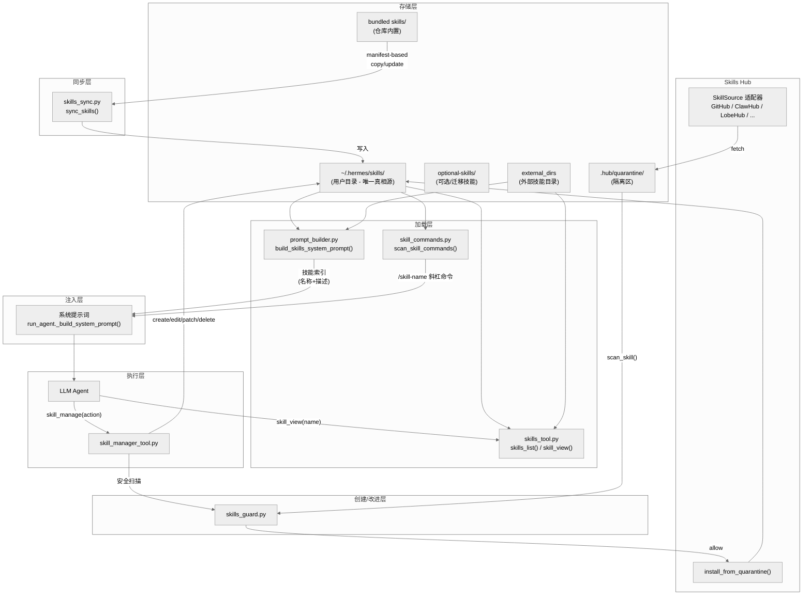
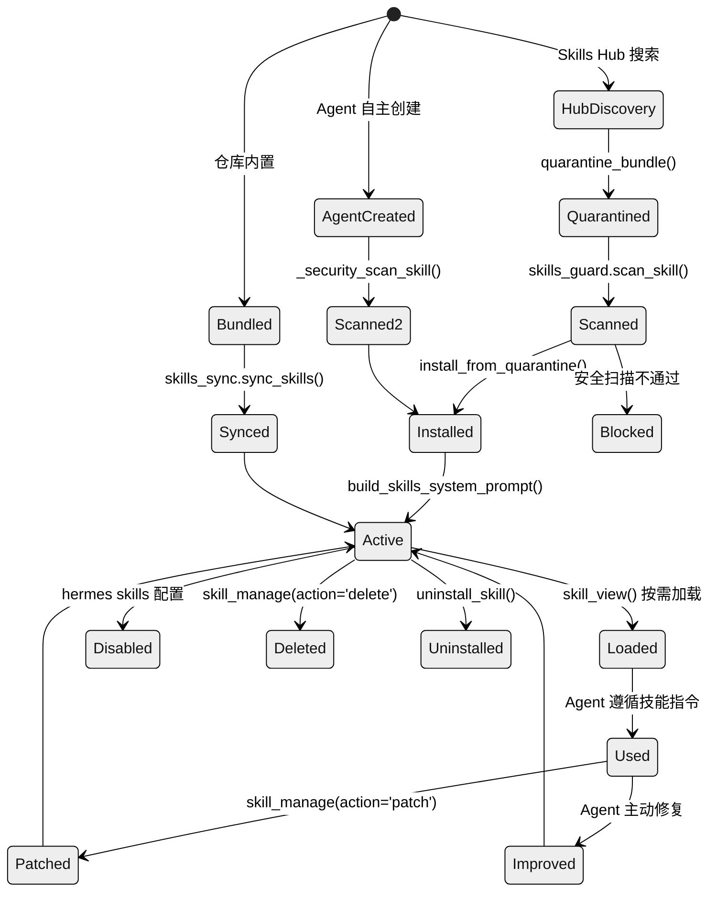
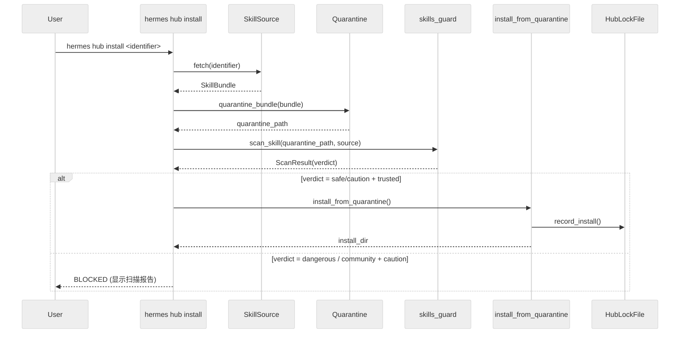

# 第六章：Skills 系统 — 程序性记忆与自改进机制

## 一句话总结

Skills 系统是 Hermes Agent 的**程序性记忆层**，它将成功的任务经验编码为结构化的 Markdown 技能文件，通过渐进式加载注入系统提示词，并形成"使用 -> 创建 -> 改进"的自进化闭环，同时集成社区技能市场（Skills Hub）实现跨用户知识共享。

---

## 架构总览



---

## 技能文件解剖

每个技能是一个**目录**，核心文件为 `SKILL.md`，遵循 YAML frontmatter + Markdown body 格式。这种设计与 agentskills.io 标准兼容。

### 目录结构

```
skills/
├── category-name/              # 分类目录
│   ├── DESCRIPTION.md          # 分类描述（可选）
│   └── skill-name/             # 技能目录
│       ├── SKILL.md            # 主指令文件（必需）
│       ├── references/         # 参考文档
│       │   ├── api.md
│       │   └── examples.md
│       ├── templates/          # 输出模板
│       │   └── config.yaml
│       ├── scripts/            # 可执行脚本
│       │   └── validate.py
│       └── assets/             # 补充文件（agentskills.io 标准）
└── another-skill/
    └── SKILL.md
```

### SKILL.md 格式

```yaml
---
name: skill-name              # 必需，最长 64 字符
description: Brief description # 必需，最长 1024 字符
version: 1.0.0                # 可选
license: MIT                  # 可选（agentskills.io）
platforms: [macos, linux]     # 可选 — 限定操作系统
prerequisites:                # 可选 — 旧式运行时需求
  env_vars: [API_KEY]
  commands: [curl, jq]
required_environment_variables:  # 新式环境变量声明
  - name: API_KEY
    prompt: "Enter your API key"
    help: "https://example.com/api-keys"
metadata:                     # 可选，任意键值对
  hermes:
    tags: [fine-tuning, llm]
    related_skills: [peft, lora]
    fallback_for_toolsets: [browser]   # 条件激活
    requires_toolsets: [terminal]      # 条件激活
    config:                            # 技能配置变量
      - key: wiki.path
        description: Wiki directory path
        default: "~/wiki"
---

# Skill Title

Full instructions and content here...
```

关键元数据字段说明：

| 字段 | 作用 | 定义位置 |
|------|------|----------|
| `name` | 技能唯一标识，用于命令生成和去重 | `skills_tool.py:551` |
| `description` | 渐进式披露 tier 1 中展示的摘要 | `skills_tool.py:557` |
| `platforms` | 操作系统过滤（`macos`/`linux`/`windows`） | `skill_utils.py:92-115` |
| `metadata.hermes.fallback_for_toolsets` | 当指定工具集可用时隐藏此技能 | `skill_utils.py:241-255` |
| `metadata.hermes.requires_toolsets` | 仅当指定工具集可用时显示此技能 | `skill_utils.py:241-255` |
| `metadata.hermes.config` | 声明 config.yaml 中的配置变量 | `skill_utils.py:261-317` |

---

## 技能生命周期



### 阶段详解

**1. 创建/获取**
- **内置技能**：仓库 `skills/` 目录包含 78 个预装技能，覆盖 26 个分类
- **Hub 安装**：通过 `hermes hub install` 从社区获取
- **Agent 创建**：Agent 在完成复杂任务后自主创建（`skill_manage(action='create')`）

**2. 同步**（`tools/skills_sync.py:176`）
- 使用 manifest 文件（`.bundled_manifest`）跟踪同步状态
- 每条记录格式为 `skill_name:origin_hash`，origin_hash 是 MD5 校验值
- 三种状态判断：新技能 -> 复制；未修改 -> 可更新；用户已修改 -> 跳过

**3. 安全扫描**（见"技能安全卫士"一节）

**4. 加载与注入**（见"技能加载与注入"一节）

**5. 使用与改进**
- Agent 使用技能后如发现问题，被指示立即用 `skill_manage(action='patch')` 修复
- 系统提示词中明确要求："If a skill you loaded was missing steps, had wrong commands, or needed pitfalls you discovered, update it before finishing."

---

## 技能加载与注入

### 渐进式披露架构（Progressive Disclosure）

受 Anthropic Claude Skills 系统启发，技能加载采用三层渐进式架构，最小化 token 消耗：

| 层级 | 内容 | 触发方式 | Token 成本 |
|------|------|----------|-----------|
| Tier 0 | 分类列表 + 技能计数 | `skills_categories()` | 极低 |
| Tier 1 | 名称 + 描述（每技能约 10 词） | `skills_list()` 或系统提示词自动注入 | 低 |
| Tier 2 | 完整 SKILL.md 内容 | `skill_view(name)` | 中 |
| Tier 3 | 支持文件（references/templates/scripts） | `skill_view(name, file_path)` | 按需 |

### 系统提示词注入流程

核心函数 `build_skills_system_prompt()`（`agent/prompt_builder.py:563`）负责构建注入系统提示词的技能索引：

```python
# prompt_builder.py:563-788 — 简化流程
def build_skills_system_prompt(available_tools, available_toolsets):
    # 1. 检查进程内 LRU 缓存（OrderedDict）
    # 2. 检查磁盘快照（.skills_prompt_snapshot.json）
    # 3. 若两层缓存都 miss → 全量文件系统扫描
    # 4. 构建按分类组织的技能索引
    # 5. 注入强制加载指令
```

**两层缓存机制**：

1. **进程内 LRU 缓存**（`_SKILLS_PROMPT_CACHE`，`prompt_builder.py:408`）：`OrderedDict` 实现，缓存键包含 `(skills_dir, external_dirs, available_tools, available_toolsets, platform_hint)`，保证不同平台和工具集组合得到不同缓存结果。

2. **磁盘快照**（`.skills_prompt_snapshot.json`，`prompt_builder.py:414`）：JSON 文件包含版本号、mtime/size manifest 和预解析的技能元数据。通过 `_build_skills_manifest()` 比对所有 SKILL.md 和 DESCRIPTION.md 文件的修改时间和大小来验证快照有效性。

**条件激活过滤**（`prompt_builder.py:532-560`）：

`_skill_should_show()` 函数根据技能声明的条件决定是否在索引中展示：
- `fallback_for_toolsets`：当主工具集可用时隐藏此后备技能
- `requires_toolsets`：仅当所需工具集可用时显示
- `fallback_for_tools` / `requires_tools`：工具级别的条件控制

**注入格式**：

最终注入系统提示词的格式为分层列表，包裹在 `<available_skills>` XML 标签中（`prompt_builder.py:757-779`）：

```
## Skills (mandatory)
Before replying, scan the skills below. If a skill matches...

<available_skills>
  mlops: Knowledge and Tools for Machine Learning Operations
    - axolotl: Fine-tuning framework for LLMs
    - huggingface-hub: Interact with HuggingFace...
  creative:
    - ascii-art: Generate ASCII art...
</available_skills>

Only proceed without loading a skill if genuinely none are relevant.
```

注入时附带**强制加载指令**，要求 Agent 在发现任何匹配技能时必须先通过 `skill_view()` 加载完整内容。

### 调用链路

```
run_agent.py:_build_system_prompt()
  └─> prompt_builder.build_skills_system_prompt()
      ├─> LRU cache hit? → 返回缓存
      ├─> disk snapshot valid? → 从快照构建
      └─> full scan:
          ├─> iter_skill_index_files(skills_dir, "SKILL.md")
          ├─> _parse_skill_file() → 解析 frontmatter
          ├─> skill_matches_platform() → 平台过滤
          ├─> get_disabled_skill_names() → 禁用过滤
          ├─> _skill_should_show() → 条件激活过滤
          ├─> _write_skills_snapshot() → 写磁盘快照
          └─> 遍历 external_dirs 补充外部技能
```

---

## Skills Hub：社区技能市场

Skills Hub 是技能的发现、安装和分发平台，核心实现在 `tools/skills_hub.py`（2,775 行），CLI 接口在 `hermes_cli/skills_hub.py`。

### 数据源适配器架构

所有数据源继承自抽象基类 `SkillSource`（`skills_hub.py:252`），统一定义四个方法：

```python
class SkillSource(ABC):
    def search(self, query: str, limit: int = 10) -> List[SkillMeta]: ...
    def fetch(self, identifier: str) -> Optional[SkillBundle]: ...
    def inspect(self, identifier: str) -> Optional[SkillMeta]: ...
    def source_id(self) -> str: ...
```

**已实现的数据源**：

| 适配器 | 行号 | 来源 | 信任级别 |
|--------|------|------|----------|
| `GitHubSource` | `skills_hub.py:284` | GitHub 仓库（含默认 taps） | trusted/community |
| `WellKnownSkillSource` | `skills_hub.py:663` | 已知技能站点 | community |
| `SkillsShSource` | `skills_hub.py:893` | skills.sh 注册表 | community |
| `ClawHubSource` | `skills_hub.py:1365` | ClawHub 平台 | community |
| `ClaudeMarketplaceSource` | `skills_hub.py:1852` | Claude Marketplace | community |
| `LobeHubSource` | `skills_hub.py:1950` | LobeHub 平台 | community |
| `OptionalSkillSource` | `skills_hub.py:2109` | 仓库内 optional-skills/ | builtin |

`GitHubSource` 的默认 taps 列表包含 `openai/skills`、`anthropics/skills`、`VoltAgent/awesome-agent-skills`、`garrytan/gstack`（`skills_hub.py:287-292`）。

### 安装流程



### Hub 状态目录

Hub 的所有状态存储在 `~/.hermes/skills/.hub/` 下：

| 文件/目录 | 路径常量 | 用途 |
|-----------|----------|------|
| `lock.json` | `LOCK_FILE` | 已安装技能的来源追踪（来源、信任级别、扫描结果、哈希值） |
| `quarantine/` | `QUARANTINE_DIR` | 下载后扫描前的隔离区 |
| `audit.log` | `AUDIT_LOG` | 安装/卸载操作审计日志 |
| `taps.json` | `TAPS_FILE` | 自定义 GitHub 仓库源 |
| `index-cache/` | `INDEX_CACHE_DIR` | 远程索引缓存（TTL 1 小时） |

### Taps 机制

`TapsManager`（`skills_hub.py:2400`）允许用户添加自定义 GitHub 仓库作为技能源：

```bash
hermes hub tap add owner/repo          # 添加 tap
hermes hub tap list                     # 列出所有 taps
hermes hub tap remove owner/repo       # 移除 tap
```

添加的 tap 会被 `GitHubSource` 在搜索时一并扫描。

---

## 技能自创建闭环

这是 Skills 系统最关键的设计 — Agent 能从成功经验中自主创建技能，形成"学习->记忆->复用"的自改进循环。

### 触发条件

系统提示词中定义了创建技能的触发条件（`prompt_builder.py:164-171` 的 `SKILLS_GUIDANCE`）：

> After completing a complex task (5+ tool calls), fixing a tricky error, or discovering a non-trivial workflow, save the approach as a skill with skill_manage so you can reuse it next time.

`skill_manage` 工具的 schema 描述（`skill_manager_tool.py:653-673`）进一步细化：

- 复杂任务成功（5+ 次工具调用）
- 克服了错误
- 用户纠正的方法有效
- 发现了非平凡的工作流
- 用户要求记住某个流程

### 创建流程

```python
# skill_manager_tool.py:292-346
def _create_skill(name, content, category):
    # 1. 验证名称（小写字母/数字/连字符，最长 64 字符）
    # 2. 验证 frontmatter（必须含 name + description）
    # 3. 验证内容大小（上限 100,000 字符）
    # 4. 检查名称冲突（跨所有目录）
    # 5. 创建目录 + 原子写入 SKILL.md
    # 6. 安全扫描（不通过则回滚删除）
    # 7. 返回成功结果
```

### 修改与改进

`skill_manage` 支持六种操作（`skill_manager_tool.py:588-647`）：

| 操作 | 说明 | 安全扫描 |
|------|------|----------|
| `create` | 创建新技能（完整 SKILL.md） | 是 |
| `patch` | 定向查找替换（支持模糊匹配） | 是 |
| `edit` | 完整重写 SKILL.md | 是 |
| `delete` | 删除整个技能目录 | 否 |
| `write_file` | 添加/覆盖支持文件 | 是 |
| `remove_file` | 删除支持文件 | 否 |

**关键设计**：每次写操作后都调用 `_security_scan_skill()`（`skill_manager_tool.py:56-74`），扫描不通过则自动回滚到原始内容。`patch` 操作使用 `fuzzy_find_and_replace`（`skill_manager_tool.py:428`）进行模糊匹配，避免因空白和缩进差异导致的精确匹配失败。

**缓存清除**：成功修改后调用 `clear_skills_system_prompt_cache(clear_snapshot=True)`（`skill_manager_tool.py:641-643`），确保下次构建系统提示词时重新扫描技能目录。

---

## 技能安全卫士（Skills Guard）

`tools/skills_guard.py` 是技能安全的核心守卫，所有外部技能和 Agent 创建的技能在安装前必须通过其扫描。

### 信任级别体系

| 级别 | 含义 | 来源 |
|------|------|------|
| `builtin` | 内置技能，永远信任 | 仓库自带、官方可选技能 |
| `trusted` | 受信源，允许 caution 级别 | `openai/skills`、`anthropics/skills` |
| `community` | 社区来源，任何发现即阻止 | 所有其他来源 |
| `agent-created` | Agent 创建，更宽松策略 | `skill_manage(action='create')` |

### 安装策略矩阵

`INSTALL_POLICY`（`skills_guard.py:42-47`）定义了信任级别与扫描结果的交叉决策：

| 信任级别 \ 扫描结果 | safe | caution | dangerous |
|---------------------|------|---------|-----------|
| builtin | allow | allow | allow |
| trusted | allow | allow | block |
| community | allow | block | block |
| agent-created | allow | allow | ask |

### 威胁检测

扫描引擎基于正则表达式静态分析，定义了覆盖 16 个类别的威胁模式（`skills_guard.py:82-484`）：

| 类别 | 模式数 | 典型检测 |
|------|--------|----------|
| `exfiltration` | 18 | 环境变量泄露（curl/wget + SECRET）、凭证文件读取、DNS 外泄 |
| `injection` | 15 | 提示注入（"ignore previous"）、角色劫持、HTML 隐藏指令 |
| `destructive` | 8 | `rm -rf /`、系统文件覆盖、磁盘格式化 |
| `persistence` | 11 | crontab、shell RC 修改、SSH authorized_keys |
| `network` | 8 | 反向 shell、隧道服务、webhook 泄露站点 |
| `obfuscation` | 14 | base64 解码执行、eval/exec、chr() 构建 |
| `execution` | 6 | subprocess、os.system、child_process |
| `traversal` | 5 | 路径穿越、/etc/passwd 访问 |
| `supply_chain` | 8 | curl pipe shell、未固定版本的包安装 |
| `privilege_escalation` | 5 | sudo、setuid、NOPASSWD |
| `credential_exposure` | 6 | 硬编码 API 密钥、私钥 |
| `mining` | 2 | 加密货币挖矿 |

### 结构检查

除正则扫描外，`_check_structure()`（`skills_guard.py:734-848`）检查目录层面的异常：

- 文件总数上限 50（`MAX_FILE_COUNT`）
- 总大小上限 1MB（`MAX_TOTAL_SIZE_KB`）
- 单文件上限 256KB（`MAX_SINGLE_FILE_KB`）
- 二进制/可执行文件检测（`.exe`、`.dll`、`.so` 等）
- 符号链接逃逸检测

### 不可见 Unicode 检测

扫描 17 种零宽度和不可见字符（`skills_guard.py:505-523`），防范基于文本隐藏的注入攻击（如零宽空格、RTL/LTR 覆盖字符）。

### 裁决逻辑

`_determine_verdict()`（`skills_guard.py:956-968`）：

- 无发现 -> `safe`
- 有 critical 级别发现 -> `dangerous`
- 有 high 级别发现 -> `caution`
- 仅 medium/low -> `caution`

---

## 技能同步

`tools/skills_sync.py` 负责将仓库内置的 `skills/` 目录同步到用户目录 `~/.hermes/skills/`。

### Manifest 机制

Manifest 文件位于 `~/.hermes/skills/.bundled_manifest`，格式为每行 `skill_name:origin_hash`（v2 格式），其中 `origin_hash` 是上次同步时内置技能的 MD5。旧的 v1 格式（仅技能名）会被自动迁移。

### 同步决策矩阵

`sync_skills()`（`skills_sync.py:176-301`）的决策逻辑：

| 状态 | 处理 |
|------|------|
| 新技能（不在 manifest 中） | 复制到用户目录，记录 origin_hash |
| 已有 + 用户未修改（user_hash == origin_hash） + 内置有更新 | 更新（备份 -> 复制 -> 删除备份） |
| 已有 + 用户已修改（user_hash != origin_hash） | **跳过** — 尊重用户修改 |
| 在 manifest 但用户已删除 | 尊重删除，不重新添加 |
| 在 manifest 但内置已移除 | 从 manifest 清理 |

### 原子性保障

更新操作先将旧副本移至 `.bak`，成功复制后删除备份；若复制失败则从备份恢复（`skills_sync.py:250-265`）。

---

## 技能分类体系

当前仓库包含 **78 个技能**，分布在 **26 个一级分类**中：

| 分类 | 示例技能 | 说明 |
|------|----------|------|
| `mlops` | axolotl, huggingface-hub, modal | ML 训练/推理/评估 |
| `creative` | ascii-art, manim-video, p5js, excalidraw | 创意内容生成 |
| `github` | github-pr-workflow, github-code-review | GitHub 工作流自动化 |
| `apple` | imessage, apple-notes, findmy | macOS 专属集成 |
| `gaming` | minecraft-modpack-server, pokemon-player | 游戏相关 |
| `media` | gif-search, youtube-content, songsee | 多媒体内容 |
| `mcp` | native-mcp, mcporter | MCP 工具集成 |
| `autonomous-ai-agents` | claude-code, codex, hermes-agent | 驾驭其他 AI agent |
| `software-development` | 多种开发工具 | 软件工程 |
| `research` | 研究工具 | 信息检索和分析 |

每个分类目录可包含 `DESCRIPTION.md` 文件，通过 frontmatter 的 `description` 字段提供分类描述，在 `skills_categories()` 和系统提示词中展示。

`optional-skills/` 目录包含 14 个子分类的额外技能，不默认安装，通过 `OptionalSkillSource` 在 Hub 中可见，用户可按需安装。

---

## 斜杠命令系统

### 技能命令扫描

`scan_skill_commands()`（`agent/skill_commands.py:200-262`）扫描所有技能目录，将每个技能注册为 `/skill-name` 格式的斜杠命令：

1. 遍历 `~/.hermes/skills/` 和 external_dirs 下的所有 SKILL.md
2. 解析 frontmatter 获取 name 和 description
3. 过滤：平台不兼容 -> 跳过，已禁用 -> 跳过
4. 将 name 标准化为连字符分隔的 slug（`cmd_name = name.lower().replace(' ', '-').replace('_', '-')`）
5. 注册为 `_skill_commands["/slug"]` 映射

### 命令调用流程

当用户输入 `/skill-name [args]` 时：

```python
# skill_commands.py:291-326
def build_skill_invocation_message(cmd_key, user_instruction, ...):
    # 1. 从 _skill_commands 获取技能信息
    # 2. _load_skill_payload() -> 调用 skill_view() 加载完整内容
    # 3. _build_skill_message() -> 格式化为系统消息
    #    - 包含激活提示："The user has invoked the 'X' skill"
    #    - 注入技能内容
    #    - 注入配置值（_inject_skill_config）
    #    - 列出可用支持文件
    #    - 附加用户指令
```

### 预加载模式

CLI 启动时可通过 `--skill` 参数预加载技能（`build_preloaded_skills_prompt()`，`skill_commands.py:329-368`），此时激活提示变为 "session-wide" 模式：

> The user launched this CLI session with the "X" skill preloaded. Treat its instructions as active guidance for the duration of this session.

---

## 与记忆系统的交互

Skills 系统与 Memory 系统形成互补的"程序性记忆 + 声明性记忆"架构：

| 维度 | Skills（程序性记忆） | Memory（声明性记忆） |
|------|---------------------|---------------------|
| 内容 | *怎么做* — 步骤、命令、工作流 | *知道什么* — 偏好、环境、事实 |
| 粒度 | 窄且深 — 一个技能解决一类任务 | 宽且浅 — 键值对/短段落 |
| 触发 | 匹配任务时显式加载（skill_view） | 每轮自动注入系统提示词 |
| 更新 | Agent 使用后主动 patch | Agent 发现新事实后 save |
| 大小 | 无全局上限（按需加载） | 紧凑（因为每轮都注入） |

系统提示词（`prompt_builder.py:144-156`）明确区分了两者的使用场景：

> Memory is injected into every turn, so keep it compact... If you've discovered a new way to do something, solved a problem that could be necessary later, save it as a skill with the skill tool.

技能的配置值（`metadata.hermes.config`）存储在 `config.yaml` 的 `skills.config.*` 命名空间下（`skill_utils.py:362`），由 `resolve_skill_config_values()` 在加载时解析并注入。

---

## 关键文件索引

| 文件 | 行数 | 核心职责 |
|------|------|----------|
| `tools/skills_tool.py` | ~1,359 | 技能的发现、列表、查看工具（渐进式披露 tier 0-3） |
| `tools/skills_hub.py` | ~2,775 | Skills Hub 数据源适配器、安装管线、状态管理 |
| `tools/skill_manager_tool.py` | ~762 | 技能的 CRUD 操作（create/patch/edit/delete/write_file/remove_file） |
| `tools/skills_guard.py` | ~978 | 安全扫描引擎（正则+结构+Unicode 检测） |
| `tools/skills_sync.py` | ~317 | 内置技能到用户目录的 manifest-based 同步 |
| `agent/skill_commands.py` | ~369 | 斜杠命令注册与调用（/skill-name） |
| `agent/skill_utils.py` | ~443 | 共享工具函数（frontmatter 解析、平台匹配、禁用列表、外部目录） |
| `agent/prompt_builder.py` | ~800+ | 系统提示词组装（含 `build_skills_system_prompt` 的两层缓存） |
| `hermes_cli/skills_config.py` | ~178 | `hermes skills` CLI — 技能启用/禁用配置 |
| `hermes_cli/skills_hub.py` | ~多 | `hermes hub` CLI — Hub 搜索/安装/卸载/tap 管理 |
| `skills/` | 78 个技能 | 内置技能库（26 个分类） |
| `optional-skills/` | 14 个分类 | 可选技能（通过 Hub 安装） |

---

## 设计亮点与权衡

**1. 渐进式披露的 token 经济学**

系统提示词中仅注入技能名称和描述（每技能约 10 个 token），完整内容通过 `skill_view()` 按需加载。这使得 78 个技能的索引只占约 800 token，而不是加载所有技能内容的数万 token。

**2. 隔离-扫描-安装三阶段管线**

社区技能先写入隔离区（`quarantine/`），扫描通过后才移入正式目录。扫描失败不留痕迹，Agent 创建的技能扫描不通过则自动回滚。

**3. 用户修改优先原则**

同步机制通过 origin_hash 对比检测用户修改，一旦检测到修改就跳过更新。这意味着用户对内置技能的定制不会被覆盖。

**4. 条件激活的智能过滤**

技能可声明自己是某工具集的后备方案（`fallback_for_toolsets`），当主工具集可用时自动隐藏。例如一个"手动浏览器操作"技能可在浏览器工具集不可用时才显示。

**5. 自改进的反馈闭环**

Agent 不仅消费技能，还被明确指示在使用技能后发现问题时立即修复（"patch it immediately"）。这形成了持续改进的飞轮：使用 -> 发现问题 -> 修复 -> 下次使用时已改进。这是 Hermes Agent 区别于传统 RAG 系统的核心设计。
