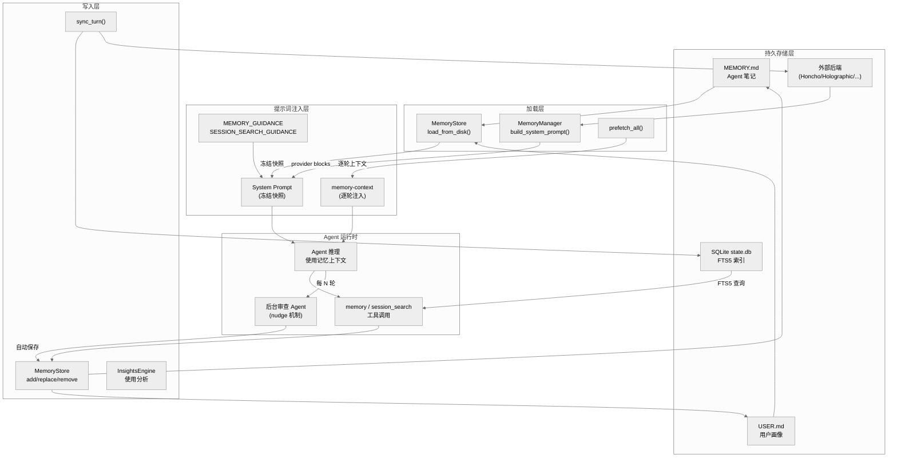
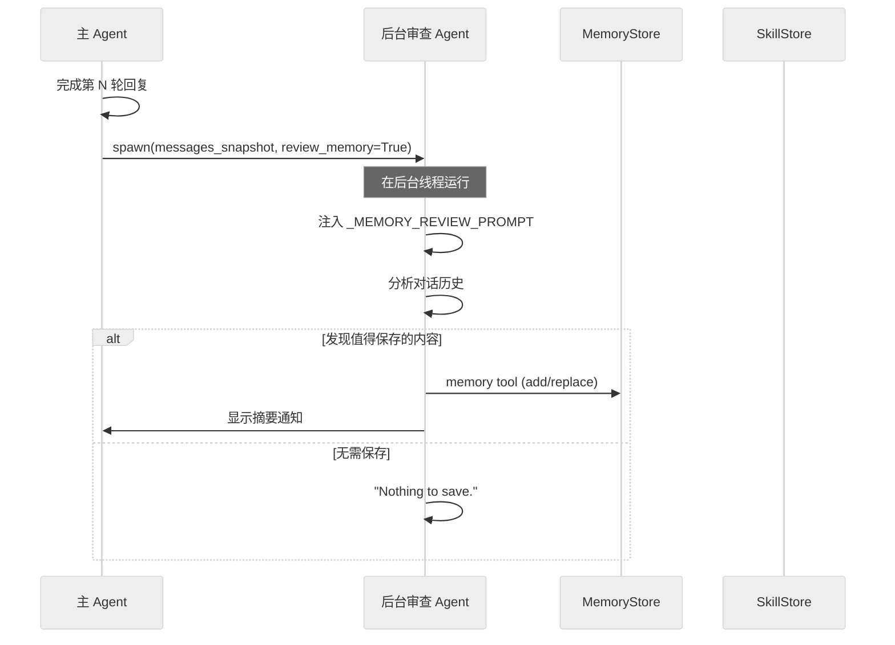
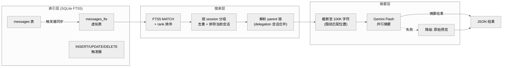
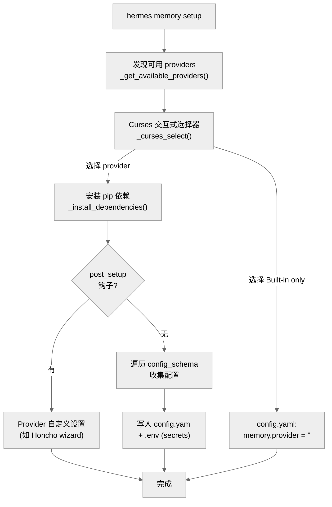
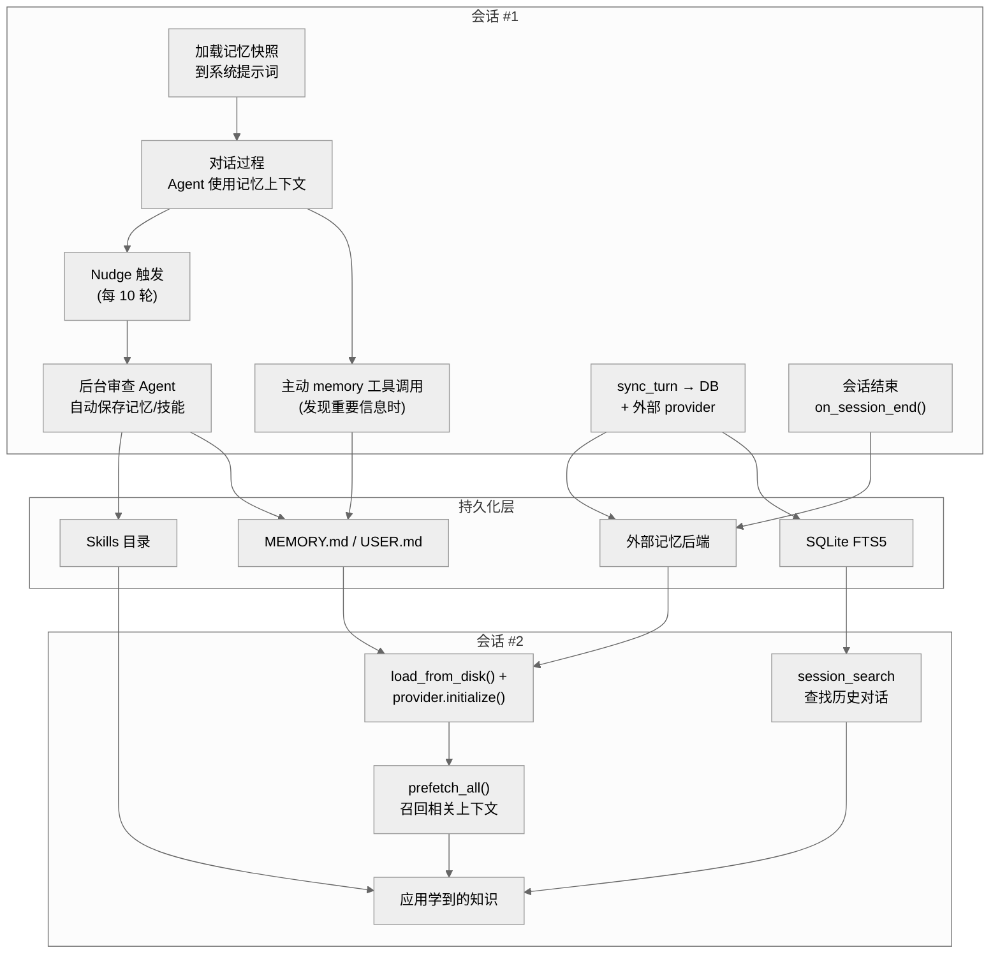

# 第七章：记忆与学习闭环

**Hermes Agent 的持久记忆系统、用户建模与跨会话搜索，共同构成了一个自我改进的学习循环。**

## 7.1 一句话总结

Hermes Agent 通过双存储文件记忆（MEMORY.md / USER.md）、可插拔的外部记忆后端、FTS5 全文会话搜索以及基于定时器的后台审查（nudge）机制，实现了一个完整的"感知-存储-检索-应用-改进"闭环——每次对话不仅服务当前任务，还为未来会话积累可复用的知识。

## 7.2 架构总览



## 7.3 Memory Tool：Agent 的笔记本

### 7.3.1 工具概览

`memory` 工具是 Agent 主动进行知识管理的入口，定义于 `tools/memory_tool.py`。它提供四种操作（`add`、`replace`、`remove`、`read`），作用于两个独立的存储目标：

| 目标 | 文件 | 用途 | 字符上限 |
|------|------|------|----------|
| `memory` | `MEMORY.md` | Agent 的个人笔记：环境事实、项目规约、工具怪癖 | 2200 |
| `user` | `USER.md` | 用户画像：偏好、沟通风格、工作习惯 | 1375 |

字符限制（非 token）由 `MemoryStore.__init__()` 接受配置（`tools/memory_tool.py:111`），默认值可在 `config.yaml` 的 `memory.memory_char_limit` / `memory.user_char_limit` 中覆盖。

### 7.3.2 CRUD 操作的并发安全

每个写操作遵循 **lock-reload-mutate-persist** 四步协议：

1. **文件锁**：`_file_lock()` 使用 `fcntl.flock(LOCK_EX)` 获取 `.lock` 旁路文件的排他锁（`tools/memory_tool.py:138-153`）
2. **重加载**：在锁内调用 `_reload_target()` 从磁盘重读，获取其他会话的最新写入（`tools/memory_tool.py:162-169`）
3. **变更**：执行 add/replace/remove 逻辑，包含去重、字符限额检查、子串匹配
4. **原子写入**：`_write_file()` 使用 `tempfile.mkstemp()` + `os.replace()` 实现原子重命名（`tools/memory_tool.py:408-436`），避免读者看到半写状态

`replace` 和 `remove` 使用 **子串匹配** 而非 ID 定位条目（`tools/memory_tool.py:261`），当多个条目匹配时要求用户提供更精确的子串。

### 7.3.3 安全扫描

所有写入内容经过 `_scan_memory_content()` 扫描（`tools/memory_tool.py:85-97`），检测两类威胁：

- **提示注入**：`ignore previous instructions`、`you are now`、`system prompt override` 等模式
- **数据外泄**：`curl` / `wget` 携带敏感环境变量、读取 `.env` / `credentials` 文件
- **不可见 Unicode**：零宽字符等注入载体

被拦截的内容返回明确错误信息，不会写入磁盘。

### 7.3.4 工具 Schema 中的行为引导

`MEMORY_SCHEMA` 的 `description` 字段（`tools/memory_tool.py:489-513`）嵌入了详细的使用指导：

- **何时保存**：用户纠正 Agent、分享偏好、Agent 发现环境事实
- **优先级**：用户偏好 > 环境事实 > 程序性知识
- **不应保存**：任务进度、会话结果、临时 TODO（这些由 `session_search` 处理）

这种"schema-as-guidance"模式让 LLM 在选择工具时就获得使用规范，无需额外的 system prompt 空间。

## 7.4 记忆存储：文件格式与目录结构

```
~/.hermes/memories/
├── MEMORY.md    # Agent 笔记
├── USER.md      # 用户画像
├── .MEMORY.md.lock  # 写入互斥锁
└── .USER.md.lock    # 写入互斥锁
```

**条目分隔符**：`\n§\n`（section sign），支持多行条目。文件内容示例：

```
User prefers dark mode and Vim keybindings.
§
Project uses Poetry for dependency management, Python 3.11.
§
Always run `make lint` before committing.
```

路径通过 `get_memory_dir()` 动态解析（`tools/memory_tool.py:43-45`），尊重 `HERMES_HOME` 环境变量的 profile 切换。

## 7.5 记忆上下文块：系统提示词注入

### 7.5.1 冻结快照模式

记忆系统采用 **冻结快照（frozen snapshot）** 设计，这是保证 LLM API prefix cache 命中率的关键：

1. **会话开始时**：`MemoryStore.load_from_disk()` 读取磁盘文件，捕获 `_system_prompt_snapshot`（`tools/memory_tool.py:119-135`）
2. **系统提示词构建**：`_build_system_prompt()` 调用 `format_for_system_prompt()` 获取冻结快照（`run_agent.py:3124-3133`）
3. **会话期间写入**：`add/replace/remove` 立即更新磁盘文件，但 **不修改** 系统提示词中的快照
4. **下次会话生效**：新会话的 `load_from_disk()` 读取最新状态

这意味着同一会话内的记忆修改对模型不可见（通过系统提示词），但工具调用的返回值始终反映实时状态（live state）。

### 7.5.2 渲染格式

`_render_block()` 将条目渲染为带标题和使用率指示器的块（`tools/memory_tool.py:367-383`）：

```
══════════════════════════════════════════════
MEMORY (your personal notes) [72% — 1,584/2,200 chars]
══════════════════════════════════════════════
User prefers dark mode and Vim keybindings.
§
Project uses Poetry for dependency management.
```

### 7.5.3 外部 Provider 的上下文注入

外部记忆 provider 通过两条路径注入上下文：

1. **系统提示词**：`MemoryManager.build_system_prompt()` 收集所有 provider 的 `system_prompt_block()`（`agent/memory_manager.py:146-163`）
2. **逐轮注入**：`prefetch_all()` 获取相关上下文，经 `build_memory_context_block()` 包装为 `<memory-context>` 标签后注入（`agent/memory_manager.py:54-69`）

`build_memory_context_block()` 添加了系统注释——"以下是回忆的记忆上下文，不是新的用户输入"——防止模型将召回的上下文误认为用户对话（`agent/memory_manager.py:63-65`）。内容还经过 `sanitize_context()` 清理栅栏标签注入（`agent/memory_manager.py:49-51`）。

### 7.5.4 系统提示词中的行为引导

`prompt_builder.py` 定义了两个关键常量：

- **`MEMORY_GUIDANCE`**（`agent/prompt_builder.py:144-156`）：指导 Agent 使用记忆工具的策略——优先保存减少用户重复纠正的信息，不保存任务进度
- **`SESSION_SEARCH_GUIDANCE`**（`agent/prompt_builder.py:158-162`）：指导 Agent 在用户引用过去对话时主动使用 `session_search`

这些引导仅在对应工具可用时注入（`run_agent.py:3072-3079`），避免无关工具的提示词污染。

## 7.6 Memory Nudge 系统：周期性后台审查

Nudge 机制是学习闭环中最独特的组件——它让 Agent 在不被明确要求的情况下，**主动审查对话并保存有价值的知识**。

### 7.6.1 触发条件

```python
# run_agent.py:7654-7660
if (self._memory_nudge_interval > 0
        and "memory" in self.valid_tool_names
        and self._memory_store):
    self._turns_since_memory += 1
    if self._turns_since_memory >= self._memory_nudge_interval:
        _should_review_memory = True
        self._turns_since_memory = 0
```

默认每 **10 轮** 用户对话触发一次（`run_agent.py:1093`），可通过 `memory.nudge_interval` 配置。计数器在触发后重置。

### 7.6.2 后台审查流程

当触发条件满足时，`_spawn_background_review()` 在 **后台线程** 中创建一个完整的 AIAgent 副本（`run_agent.py:2089-2159`）：



关键设计决策：

1. **不阻塞主会话**：审查在后台线程运行（`run_agent.py:10259-10267`），用户回复已经发送
2. **共享存储引用**：审查 Agent 直接引用主 Agent 的 `_memory_store`（`run_agent.py:2126`），写入立即反映到磁盘
3. **禁止递归 nudge**：审查 Agent 的 `_memory_nudge_interval` 设为 0（`run_agent.py:2129`）
4. **三种审查模式**：
   - `_MEMORY_REVIEW_PROMPT`（`run_agent.py:2054-2063`）：仅审查记忆——用户偏好、个人信息、行为期望
   - `_SKILL_REVIEW_PROMPT`（`run_agent.py:2065-2073`）：仅审查技能——非平凡方法、试错过程
   - `_COMBINED_REVIEW_PROMPT`（`run_agent.py:2075-2087`）：同时审查两者

## 7.7 Session Search：跨会话长期记忆

### 7.7.1 架构概览

`session_search` 工具（`tools/session_search_tool.py`）实现了对所有历史对话的全文搜索与摘要，是 Agent 的"长期记忆"能力。



### 7.7.2 FTS5 索引机制

`hermes_state.py:93-111` 定义了 FTS5 虚拟表及其同步触发器：

```sql
CREATE VIRTUAL TABLE IF NOT EXISTS messages_fts USING fts5(
    content,
    content=messages,
    content_rowid=id
);
```

三个触发器（`INSERT`、`DELETE`、`UPDATE`）保证 `messages_fts` 与 `messages` 表实时同步。查询通过 `SessionDB.search_messages()` 方法执行（`hermes_state.py:990-1066`），支持：

- 关键词搜索：`docker deployment`
- 短语匹配：`"exact phrase"`
- 布尔运算：`docker OR kubernetes`、`python NOT java`
- 前缀搜索：`deploy*`

查询经过 `_sanitize_fts5_query()` 安全化处理（`hermes_state.py:938-987`），防止 FTS5 语法错误。

### 7.7.3 搜索与摘要流程

`session_search()` 函数（`tools/session_search_tool.py:247-431`）的完整流程：

1. **FTS5 搜索**：获取 50 条匹配消息，按相关性排名
2. **会话分组**：合并同一会话的匹配，通过 `_resolve_to_parent()` 遍历 delegation 链找到根会话（`tools/session_search_tool.py:298-321`）
3. **排除当前会话**：避免返回 Agent 已有的上下文（`tools/session_search_tool.py:336-339`）
4. **内容截断**：`_truncate_around_matches()` 将对话截断至 ~100K 字符，以匹配位置为中心（`tools/session_search_tool.py:89-122`）
5. **并行摘要**：使用辅助模型（Gemini Flash）并行摘要所有匹配会话（`tools/session_search_tool.py:367-374`）
6. **降级处理**：摘要不可用时返回原始预览（`tools/session_search_tool.py:413-416`）

### 7.7.4 两种模式

| 模式 | 触发条件 | LLM 成本 | 返回内容 |
|------|----------|----------|----------|
| 近期浏览 | `query` 为空 | 零 | 最近 N 个会话的标题、预览、时间戳 |
| 关键词搜索 | `query` 非空 | Gemini Flash 摘要 | 匹配会话的结构化摘要 |

近期浏览模式（`_list_recent_sessions()`，`tools/session_search_tool.py:195-244`）直接查询数据库，不涉及 LLM 调用，适合"我们最近在做什么？"类型的问题。

## 7.8 用户建模：Honcho 集成

Honcho 是最具代表性的外部记忆 provider，实现了基于 **辩证式 Q&A（dialectic reasoning）** 的跨会话用户建模。

### 7.8.1 三种召回模式

`HonchoMemoryProvider` 支持三种 `recall_mode`（`plugins/memory/honcho/__init__.py:133`）：

| 模式 | 自动注入 | 工具可用 | 适用场景 |
|------|----------|----------|----------|
| `context` | 是 | 否 | 完全自动化，无需 Agent 主动操作 |
| `tools` | 否 | 是 | Agent 按需查询，节省 token |
| `hybrid` | 是 | 是 | 兼得两者优势（默认） |

### 7.8.2 四个工具

| 工具 | 功能 | LLM 成本 |
|------|------|----------|
| `honcho_profile` | 获取用户 Peer Card（结构化事实列表） | 无 |
| `honcho_search` | 语义搜索 Honcho 存储的用户上下文 | 无 |
| `honcho_context` | 自然语言问答（辩证推理） | 高 |
| `honcho_conclude` | 写入关于用户的结论 | 无 |

### 7.8.3 生命周期钩子

Honcho provider 利用 `MemoryProvider` 的完整生命周期：

- **`initialize()`**（`plugins/memory/honcho/__init__.py:195-274`）：配置解析、cron 守护、惰性会话初始化、记忆文件迁移、上下文预热
- **`system_prompt_block()`**（`plugins/memory/honcho/__init__.py:370-430`）：首轮 baking——首次调用时获取用户表征、Peer Card、AI 自我表征，缓存后续调用
- **`prefetch()` / `queue_prefetch()`**：基于节奏（cadence）的辩证查询，后台线程执行
- **`sync_turn()`**（`plugins/memory/honcho/__init__.py:573-602`）：非阻塞地将对话回合写入 Honcho，支持消息分块（>25K 字符自动拆分）
- **`on_memory_write()`**（`plugins/memory/honcho/__init__.py:604-620`）：镜像内置 `USER.md` 的写入为 Honcho 结论

### 7.8.4 成本控制

Honcho 实现了精细的成本控制（B5 特性），可通过 `honcho.json` 配置：

- `injectionFrequency`：`"every-turn"` 或 `"first-turn"`
- `contextCadence`：上下文 API 调用的最小间隔轮数
- `dialecticCadence`：辩证推理 API 调用的最小间隔轮数
- `reasoningLevelCap`：推理级别上限

## 7.9 Context Engine 插件

上下文引擎（`plugins/context_engine/`）是与记忆系统平行的可插拔组件，负责 **上下文压缩策略** 的选择。

`plugins/context_engine/__init__.py` 定义了发现和加载机制，与记忆插件系统平行：

- 通过 `config.yaml` 中的 `context.engine` 选择活跃引擎
- 默认引擎为 `compressor`（内置 ContextCompressor）
- 同一时间只能激活一个引擎
- 支持 `register(ctx)` 模式或自动发现 `ContextEngine` 子类

上下文引擎与记忆系统的交互点在于 `MemoryManager.on_pre_compress()`（`agent/memory_manager.py:285-302`）——压缩前通知所有记忆 provider 提取即将丢失的消息中的见解。

## 7.10 记忆插件生态

### 7.10.1 插件发现与加载

`plugins/memory/__init__.py` 实现了完整的插件生命周期管理：

1. **发现**：`discover_memory_providers()` 扫描 `plugins/memory/` 子目录（`plugins/memory/__init__.py:32-75`）
2. **加载**：`load_memory_provider()` 通过动态 import 加载模块（`plugins/memory/__init__.py:78-96`）
3. **注册**：支持 `register(ctx)` 模式和直接 `MemoryProvider` 子类发现
4. **限制**：`MemoryManager.add_provider()` 强制只允许一个外部 provider（`agent/memory_manager.py:86-108`）

### 7.10.2 已有插件一览

| 插件 | 描述 | 存储方式 | 特色 |
|------|------|----------|------|
| **honcho** | AI 原生记忆，辩证式用户建模 | 云端 API | Peer Card、语义搜索、结论持久化 |
| **holographic** | 本地 SQLite 事实存储 | 本地 SQLite | FTS5 搜索、信任评分、HRR 组合检索 |
| **hindsight** | 知识图谱长期记忆 | 云端 API | 实体解析、多策略检索 |
| **mem0** | 服务端 LLM 事实提取 | 云端 API | 语义搜索、重排序、自动去重 |
| **openviking** | 会话管理上下文数据库 | 云端 API | 分层检索、文件系统式知识浏览 |
| **byterover** | 持久知识树 | 本地 CLI | 分层检索、on_pre_compress 钩子 |
| **retaindb** | 云端混合搜索 | 云端 API | 7 种记忆类型 |
| **supermemory** | 语义长期记忆 | 云端 API | Profile 召回、会话摄取 |

### 7.10.3 MemoryProvider 抽象接口

`agent/memory_provider.py` 定义了所有记忆 provider 必须实现的契约：

```
核心方法（必须实现）：
├── name              → 标识符
├── is_available()    → 可用性检查（无网络调用）
├── initialize()      → 会话初始化
└── get_tool_schemas() → 工具 Schema 列表

可选钩子（按需覆盖）：
├── system_prompt_block()  → 系统提示词贡献
├── prefetch()             → 逐轮上下文召回
├── queue_prefetch()       → 后台预取
├── sync_turn()            → 回合同步
├── on_turn_start()        → 轮次开始通知
├── on_session_end()       → 会话结束提取
├── on_pre_compress()      → 压缩前见解提取
├── on_memory_write()      → 内置记忆写入镜像
├── on_delegation()        → 子 Agent 完成通知
├── get_config_schema()    → 配置字段声明
├── save_config()          → 配置持久化
└── shutdown()             → 清理资源
```

`initialize()` 的 `kwargs` 始终包含 `hermes_home`（由 `MemoryManager.initialize_all()` 自动注入，`agent/memory_manager.py:345-362`），确保所有 provider 能解析 profile 范围的存储路径。

## 7.11 Insights Engine：使用分析

`agent/insights.py` 中的 `InsightsEngine` 对历史会话数据进行多维度分析，是学习闭环的"反思"组件。

### 7.11.1 分析维度

```python
report = engine.generate(days=30)
```

`generate()` 方法（`agent/insights.py:112-162`）产出六个维度的报告：

| 维度 | 方法 | 内容 |
|------|------|------|
| **总览** | `_compute_overview()` | 会话数、消息数、token 消耗、成本估算、活跃时长 |
| **模型分布** | `_compute_model_breakdown()` | 按模型分组的 session/token/成本统计 |
| **平台分布** | `_compute_platform_breakdown()` | CLI / Telegram / Discord 等平台使用分布 |
| **工具使用** | `_compute_tool_breakdown()` | 工具调用排行与占比 |
| **活跃模式** | `_compute_activity_patterns()` | 星期分布、小时分布、连续使用天数 |
| **标记会话** | `_compute_top_sessions()` | 最长会话、最多消息、最多 token、最多工具调用 |

### 7.11.2 成本估算

成本估算基于 `agent/usage_pricing.py` 的定价表，区分已知定价模型和自定义/自托管模型（`agent/insights.py:36-78`）。对于无已知定价的模型，报告标注 "N/A" 而非猜测。

### 7.11.3 双格式输出

- **终端格式**：`format_terminal()`（`agent/insights.py:599-727`）——带 Unicode 图表的等宽文本
- **消息平台格式**：`format_gateway()`（`agent/insights.py:729-790`）——Markdown 格式的精简报告

## 7.12 Memory Setup：配置向导

`hermes_cli/memory_setup.py` 实现了交互式记忆 provider 配置，入口为 `hermes memory setup`。

### 7.12.1 流程



### 7.12.2 配置分层

- **非敏感配置**：写入 `config.yaml` 的 `memory.<provider>` 节，或通过 `save_config()` 写入 provider 原生位置（如 `honcho.json`）
- **敏感配置**：API key 等写入 `$HERMES_HOME/.env`，通过 `_write_env_vars()` 追加或更新
- **依赖安装**：读取 `plugin.yaml` 的 `pip_dependencies`，使用 `uv pip install` 安装

## 7.13 学习闭环：端到端描述

综合以上所有组件，Hermes Agent 的学习闭环如下：



### 闭环的六个阶段

1. **感知（Perception）**：每次用户消息都是新信息的潜在来源。Agent 通过对话理解用户意图、偏好和环境。

2. **存储（Storage）**：三条并行存储路径：
   - **主动存储**：Agent 在对话中直接调用 `memory` 工具
   - **被动存储**：后台审查 Agent（nudge 机制）定期自动审查并保存
   - **会话归档**：每轮对话自动写入 SQLite + 外部 provider

3. **索引（Indexing）**：FTS5 触发器实时维护全文索引；外部 provider 各自维护语义索引。

4. **检索（Retrieval）**：下次会话通过三层检索获取知识：
   - **系统提示词**：冻结快照直接嵌入（零延迟）
   - **逐轮预取**：外部 provider 的 `prefetch()` 提供相关上下文
   - **按需搜索**：`session_search` 查找特定历史话题

5. **应用（Application）**：Agent 利用检索到的知识执行当前任务——减少重复提问、维持一致偏好、复用已验证的方案。

6. **改进（Improvement）**：技能系统与记忆系统协同——如果 Agent 通过试错解决了问题，nudge 机制不仅保存记忆，还可能创建或更新技能文件，使未来相同场景的处理更高效。

### 区别于传统 RAG 的关键设计

| 特征 | 传统 RAG | Hermes 学习闭环 |
|------|---------|----------------|
| 知识来源 | 外部文档 | Agent 自身经验 |
| 写入时机 | 预处理阶段 | 对话过程中 + 后台审查 |
| 索引更新 | 批量重建 | 实时触发器 |
| 摘要策略 | 固定分块 | 以查询为中心的动态截断 |
| 用户建模 | 无 | 辩证式推理（Honcho） |
| 自我改进 | 无 | Nudge → 记忆 + 技能自动积累 |

## 7.14 关键文件索引

| 文件 | 职责 | 关键函数/类 |
|------|------|------------|
| `tools/memory_tool.py` | Memory 工具实现 | `MemoryStore`, `memory_tool()`, `_scan_memory_content()` |
| `agent/memory_manager.py` | Provider 编排器 | `MemoryManager`, `build_memory_context_block()` |
| `agent/memory_provider.py` | Provider 抽象基类 | `MemoryProvider` ABC |
| `plugins/memory/__init__.py` | 插件发现与加载 | `discover_memory_providers()`, `load_memory_provider()` |
| `plugins/memory/honcho/__init__.py` | Honcho 集成 | `HonchoMemoryProvider` |
| `plugins/context_engine/__init__.py` | 上下文引擎发现 | `discover_context_engines()`, `load_context_engine()` |
| `tools/session_search_tool.py` | 跨会话搜索 | `session_search()`, `_summarize_session()` |
| `hermes_state.py` | SQLite + FTS5 | `SessionDB.search_messages()`, FTS5 虚拟表定义 |
| `agent/insights.py` | 使用分析引擎 | `InsightsEngine.generate()` |
| `hermes_cli/memory_setup.py` | 配置向导 | `cmd_setup()`, `cmd_status()` |
| `agent/prompt_builder.py` | 行为引导常量 | `MEMORY_GUIDANCE`, `SESSION_SEARCH_GUIDANCE` |
| `run_agent.py:1089-1112` | 记忆初始化 | 配置读取、`MemoryStore` 实例化 |
| `run_agent.py:2054-2159` | 后台审查 | `_MEMORY_REVIEW_PROMPT`, `_spawn_background_review()` |
| `run_agent.py:3041-3160` | 系统提示词组装 | `_build_system_prompt()` 记忆注入段 |
| `run_agent.py:7654-7660` | Nudge 触发逻辑 | 轮次计数与触发判断 |
