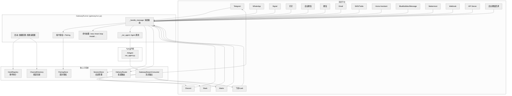
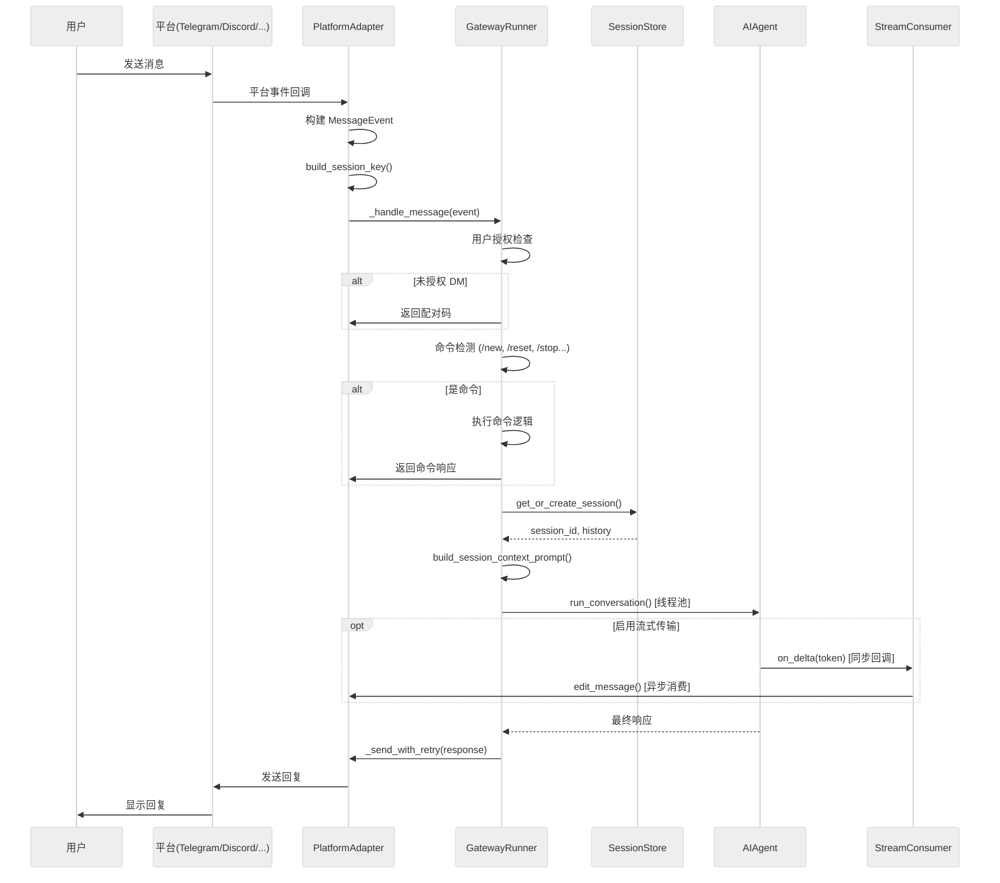

# 第八章：Gateway 与消息平台

## 8.1 一句话概述

Gateway 是 Hermes Agent 面向外部世界的常驻进程，它通过统一的适配器抽象将 18 个异构消息平台（Telegram、Discord、Slack、微信、飞书等）接入同一个 AI Agent 内核，实现"一个 Agent，多端对话"的架构。

---

## 8.2 架构总览



**关键设计原则：**

- **适配器模式**：每个平台实现 `BasePlatformAdapter` 抽象类，Gateway 核心不感知平台细节
- **单进程并发**：所有平台适配器运行在同一个 asyncio 事件循环中，Agent 通过 `run_in_executor` 在线程池中执行
- **Session 隔离**：通过确定性 Session Key 将不同平台、不同聊天、不同用户的对话隔离到独立会话
- **流式传输**：通过 `GatewayStreamConsumer` 将 Agent 的逐 token 输出实时推送到支持消息编辑的平台

---

## 8.3 Gateway 生命周期

### 8.3.1 启动流程

当用户执行 `hermes gateway start` 时，入口在 `gateway/run.py`。该文件在模块级别完成大量初始化工作：

1. **SSL 证书检测** (`_ensure_ssl_certs()`, `run.py:35-72`)：自动探测系统 CA 证书路径，兼容 NixOS 等非标准环境
2. **环境变量桥接** (`run.py:89-206`)：从 `~/.hermes/config.yaml` 读取配置并桥接到 `os.environ`，使 `os.getenv()` 可读取终端、辅助模型、Agent 超时等设置
3. **IPv4 偏好** (`run.py:210-216`)：可选强制 IPv4 以绕过 GFW 等 IPv6 问题

`GatewayRunner.__init__()` (`run.py:532`) 创建核心组件：

```python
class GatewayRunner:
    def __init__(self, config: Optional[GatewayConfig] = None):
        self.config = config or load_gateway_config()
        self.adapters: Dict[Platform, BasePlatformAdapter] = {}
        self.session_store = SessionStore(...)
        self.delivery_router = DeliveryRouter(self.config)
        self.pairing_store = PairingStore()
        self.hooks = HookRegistry()
        self._running_agents: Dict[str, Any] = {}     # session_key -> AIAgent
        self._agent_cache: Dict[str, tuple] = {}       # session_key -> (AIAgent, signature)
        self._pending_approvals: Dict[str, Dict] = {}  # exec 审批跟踪
```

`start()` 方法 (`run.py:1465`) 按以下顺序执行：

1. **Hook 发现与加载**：扫描 `~/.hermes/hooks/` 目录，注册事件处理器
2. **进程恢复**：从 checkpoint 恢复上次崩溃前的后台进程
3. **会话悬挂**：将上次 Gateway 退出时仍在运行的会话标记为 suspended，防止死循环恢复
4. **平台连接循环**：遍历所有配置的平台，调用 `_create_adapter()` 创建适配器，然后 `adapter.connect()`
5. **后台任务启动**：会话过期监控、频道目录定时刷新、Gateway watcher（监控更新/重启信号）

```python
for platform, platform_config in self.config.platforms.items():
    if not platform_config.enabled:
        continue
    adapter = self._create_adapter(platform, platform_config)
    adapter.set_message_handler(self._handle_message)
    adapter.set_fatal_error_handler(self._handle_adapter_fatal_error)
    success = await adapter.connect()
    if success:
        self.adapters[platform] = adapter
```

### 8.3.2 优雅重启

`gateway/restart.py` 定义了重启常量。Gateway 使用 exit code 75（`GATEWAY_SERVICE_RESTART_EXIT_CODE`，来自 sysexits.h 的 `EX_TEMPFAIL`）通知服务管理器执行重启。重启过程包含 drain 阶段（等待活跃 Agent 完成），超时可通过 `restart_drain_timeout` 配置。

### 8.3.3 关闭流程

Gateway 在收到 SIGTERM/SIGINT 时执行优雅关闭：

- 标记 draining 状态，拒绝新消息
- 等待活跃 Agent 完成（带超时）
- 断开所有平台连接
- 写入 `.clean_shutdown` 标记文件，下次启动时跳过会话悬挂

---

## 8.4 平台抽象层

### 8.4.1 BasePlatformAdapter

`gateway/platforms/base.py`（1,998 行）定义了所有平台适配器的基类。核心抽象方法：

| 方法签名 | 用途 | 必须实现 |
|----------|------|----------|
| `async def connect() -> bool` | 连接平台并开始接收消息 | **是** |
| `async def disconnect()` | 断开连接 | **是** |
| `async def send(chat_id, content, reply_to, metadata) -> SendResult` | 发送文本消息 | **是** |
| `async def edit_message(chat_id, message_id, content) -> SendResult` | 编辑已发送的消息 | 否（默认返回失败） |
| `async def send_typing(chat_id, metadata)` | 发送"正在输入"指示器 | 否 |
| `async def send_image(chat_id, image_url, caption) -> SendResult` | 发送图片（URL） | 否（降级为文本） |
| `async def send_image_file(chat_id, image_path, caption) -> SendResult` | 发送本地图片 | 否（降级为文本） |
| `async def send_voice(chat_id, audio_path, caption) -> SendResult` | 发送语音消息 | 否（降级为文本） |
| `async def send_video(chat_id, video_path, caption) -> SendResult` | 发送视频 | 否（降级为文本） |
| `async def send_document(chat_id, file_path, caption) -> SendResult` | 发送文件 | 否（降级为文本） |
| `async def send_animation(chat_id, animation_url, caption) -> SendResult` | 发送 GIF 动图 | 否（降级为 send_image） |

**关键数据结构：**

- **`MessageEvent`** (`base.py:602`)：标准化入站消息，包含 `text`、`message_type`（枚举：TEXT/PHOTO/VOICE/DOCUMENT/STICKER/COMMAND 等）、`source`（SessionSource）、`media_urls`、`reply_to_text` 等
- **`SendResult`** (`base.py:667`)：发送结果，含 `success`、`message_id`、`error`、`retryable`
- **`MessageType`** (`base.py:581`)：消息类型枚举，支持文本、位置、图片、视频、音频、语音、文档、贴纸、命令

### 8.4.2 基类提供的通用能力

`BasePlatformAdapter` 不仅定义接口，还实现了大量通用逻辑：

1. **消息缓存系统**（`base.py:262-578`）：
   - 图片缓存：`cache_image_from_url()` / `cache_image_from_bytes()` — 下载平台图片到本地，供 vision 工具分析
   - 音频缓存：`cache_audio_from_url()` / `cache_audio_from_bytes()` — 下载语音消息到本地，供 STT 转写
   - 文档缓存：`cache_document_from_bytes()` — 缓存 PDF/DOCX 等文件
   - SSRF 防护：`_ssrf_redirect_guard()` 阻止重定向到内部网络

2. **媒体提取**（`base.py:998-1246`）：
   - `extract_images()` — 从 Markdown/HTML 中提取图片 URL
   - `extract_media()` — 提取 `MEDIA:/path` 标签和 `[[audio_as_voice]]` 指令
   - `extract_local_files()` — 检测响应文本中的本地文件路径

3. **发送重试**（`_send_with_retry()`, `base.py:1331`）：网络错误自动重试（指数退避），格式错误降级为纯文本

4. **消息队列**（`base.py:676-699`）：`merge_pending_message_event()` 处理照片连拍/相册的合并队列

5. **处理生命周期钩子**（`base.py:1291-1309`）：`on_processing_start()` / `on_processing_complete(outcome)` — 子类可重写以添加反应表情（如 Discord 的 `👀`/`✅`/`❌`）

6. **平台锁**（`base.py:827-854`）：防止同一平台的多个 Gateway 实例同时运行

---

## 8.5 消息处理全流程

### 8.5.1 入站消息流



### 8.5.2 详细步骤解析

**步骤 1：平台适配器接收消息**

每个平台适配器以平台特有的方式接收消息（Telegram 轮询、Discord WebSocket、Slack Socket Mode 等），然后构建标准化的 `MessageEvent`：

```python
event = MessageEvent(
    text="用户消息文本",
    message_type=MessageType.TEXT,
    source=SessionSource(
        platform=Platform.TELEGRAM,
        chat_id="123456789",
        chat_type="dm",
        user_id="987654321",
        user_name="Alice",
    ),
    media_urls=["/cache/images/img_abc123.jpg"],  # 已缓存到本地
)
```

**步骤 2：BasePlatformAdapter.handle_message()** (`base.py:1429`)

基类的 `handle_message()` 生成 session key，检查是否有活跃会话正在处理中。如果正在处理：
- 特殊命令（`/approve`、`/stop`、`/new` 等）绕过队列直接分发
- 照片消息合并到待处理队列（支持照片连拍）
- 普通消息触发中断或排队（取决于 `busy_input_mode` 配置）

**步骤 3：GatewayRunner._handle_message()** (`run.py:2369`)

这是核心消息处理管线：

1. **内部事件检测**：系统生成的事件（后台进程通知）跳过用户授权
2. **用户授权**：检查 allowlist / pairing store / `GATEWAY_ALLOW_ALL_USERS`
3. **僵死会话驱逐**：检测并驱逐超时/挂起的 `_running_agents` 条目
4. **运行中 Agent 交互**：对活跃 Agent 的 `/stop`（强制中断）、`/new`（重置）、`/status`（查看状态）
5. **命令处理**：`/model`（切换模型）、`/voice`（语音模式）、`/compress`、`/restart` 等
6. **Session 管理**：通过 `session_store.get_or_create_session()` 获取或创建会话
7. **语音处理**：自动 STT 转写语音消息
8. **图片处理**：注入视觉描述提示
9. **上下文构建**：`build_session_context_prompt()` 生成动态系统提示
10. **Agent 调用**：通过 `_run_agent()` 在线程池中运行 `AIAgent.run_conversation()`

**步骤 4：Agent 执行** (`run.py:7252`)

`_run_agent()` 方法在线程池中运行，负责：

- 解析平台特定的工具集配置
- 从 `_agent_cache` 复用 AIAgent 实例（保持 prompt cache 有效）
- 设置进度回调（`progress_callback`）用于工具执行状态消息
- 配置流式传输（`stream_delta_callback`）
- 执行 `agent.run_conversation()` 并返回结果

---

## 8.6 会话管理

### 8.6.1 Session Key 构建

`build_session_key()` (`session.py:436`) 是会话隔离的核心。它根据消息来源构建确定性的字符串键：

| 聊天类型 | Key 格式 | 示例 |
|----------|----------|------|
| DM | `agent:main:{platform}:dm:{chat_id}` | `agent:main:telegram:dm:123456` |
| DM + Thread | `agent:main:{platform}:dm:{chat_id}:{thread_id}` | `agent:main:telegram:dm:123:456` |
| 群聊（按用户隔离） | `agent:main:{platform}:group:{chat_id}:{user_id}` | `agent:main:discord:group:111:222` |
| Thread（共享） | `agent:main:{platform}:group:{chat_id}:{thread_id}` | `agent:main:slack:group:C01:T01` |
| Thread（按用户隔离） | `agent:main:{platform}:group:{chat_id}:{thread_id}:{user_id}` | 需启用 `thread_sessions_per_user` |

关键策略：
- **DM**：每个私聊独立会话，thread_id 进一步细分
- **群聊**：默认按用户隔离（`group_sessions_per_user=True`），每个用户在同一群中有独立对话
- **Thread**：默认共享（`thread_sessions_per_user=False`），同一 thread 中所有用户共享对话上下文

### 8.6.2 SessionStore

`SessionStore` (`session.py:495`) 管理会话的完整生命周期：

- **持久化**：会话索引存储在 `~/.hermes/sessions/sessions.json`，对话历史存储在 SQLite（`hermes_state.SessionDB`）+ JSONL 文件
- **重置策略** (`SessionResetPolicy`, `config.py:99`)：
  - `daily`：每天固定时间重置（默认凌晨 4 点）
  - `idle`：空闲指定时间后重置（默认 1440 分钟 = 24 小时）
  - `both`：以上两者先触发者为准
  - `none`：不自动重置
- **Token 跟踪**：每个 SessionEntry 记录 `input_tokens`、`output_tokens`、`cache_read_tokens`、`estimated_cost_usd`
- **记忆刷新**：会话过期前自动触发 `_flush_memories_for_session()` (`run.py:698`)，Agent 在后台线程中回顾对话并保存重要信息

### 8.6.3 Session Context

`gateway/session_context.py`（128 行）使用 Python `contextvars.ContextVar` 替代了之前基于 `os.environ` 的会话状态。这是并发安全的关键——当多个消息同时处理时，每个 asyncio task 拥有独立的上下文变量副本，不会互相覆盖：

```python
_SESSION_PLATFORM: ContextVar[str] = ContextVar("HERMES_SESSION_PLATFORM", default="")
_SESSION_CHAT_ID: ContextVar[str] = ContextVar("HERMES_SESSION_CHAT_ID", default="")
_SESSION_THREAD_ID: ContextVar[str] = ContextVar("HERMES_SESSION_THREAD_ID", default="")
# ... 共 7 个变量
```

`get_session_env()` 提供向后兼容的接口：先查 ContextVar，再查 `os.environ`，最后返回默认值。

---

## 8.7 配对与授权系统

`gateway/pairing.py`（309 行）实现了基于一次性代码的用户配对流程：

1. **未授权用户发送 DM** -> Gateway 生成 8 字符配对码（使用 32 字符无歧义字母表 `ABCDEFGHJKLMNPQRSTUVWXYZ23456789`）
2. **机器人发送配对码** -> 用户将代码告知管理员
3. **管理员执行** `hermes pairing approve {platform} {code}` -> 用户加入已批准列表

安全特性（遵循 OWASP + NIST SP 800-63-4）：
- 加密随机数生成（`secrets.choice()`）
- 1 小时代码过期
- 每个平台最多 3 个待处理配对码
- 速率限制：每个用户每 10 分钟 1 次请求
- 5 次失败尝试后锁定 1 小时
- 文件权限：`chmod 0600`

存储位置：`~/.hermes/platforms/pairing/`，包含 `{platform}-pending.json` 和 `{platform}-approved.json`。

---

## 8.8 平台适配器对比

| 平台 | 文件 | 代码行数 | 消息编辑 | 语音 | 图片 | 贴纸 | Thread | 反应 | 连接方式 |
|------|------|---------|---------|------|------|------|--------|------|---------|
| Telegram | `telegram.py` | 2,780 | ✅ | ✅ 收发 | ✅ | ✅ 缓存描述 | ✅ Forum Topics | — | 轮询 (python-telegram-bot) |
| Discord | `discord.py` | 2,957 | ✅ | ✅ 收发+频道语音 | ✅ | — | ✅ 自动创建 | ✅ 👀✅❌ | WebSocket (discord.py) |
| Feishu/Lark | `feishu.py` | 3,623 | ✅ | ✅ 收发 | ✅ | — | — | ✅ ACK emoji | WebSocket / Webhook |
| Slack | `slack.py` | 1,670 | ✅ | ✅ | ✅ | — | ✅ 原生 | — | Socket Mode (slack-bolt) |
| Matrix | `matrix.py` | 2,045 | ✅ | ✅ | ✅ | — | ✅ 自动 | ✅ 👀✅❌ | Sync (mautrix, E2EE可选) |
| WhatsApp | `whatsapp.py` | 912 | ✅ | ✅ 收 | ✅ | — | — | — | Node.js Bridge (Baileys) |
| API Server | `api_server.py` | 1,838 | — | — | — | — | — | — | HTTP REST (aiohttp) |
| WeCom | `wecom.py` | 1,431 | — | ✅ 收发 | ✅ | — | — | — | WebSocket |
| Weixin | `weixin.py` | 1,776 | — | — | ✅ | — | — | — | Long-poll (iLink Bot) |
| Signal | `signal.py` | 841 | — | ✅ 收发 | ✅ | ✅ 群组 | — | — | SSE + JSON-RPC (signal-cli) |
| Mattermost | `mattermost.py` | 733 | ✅ | ✅ | ✅ | — | ✅ | — | REST + WebSocket |
| BlueBubbles | `bluebubbles.py` | 926 | — | ✅ 收发 | ✅ | — | — | ✅ Tapback | Webhook + REST |
| Webhook | `webhook.py` | 672 | — | — | — | — | — | — | HTTP Webhook (aiohttp) |
| Email | `email.py` | 625 | — | — | ✅ | — | ✅ 邮件线程 | — | IMAP轮询 + SMTP |
| Home Assistant | `homeassistant.py` | 449 | — | — | — | — | — | — | WebSocket |
| WeComCallback | `wecom_callback.py` | 387 | — | — | — | — | — | — | HTTP 回调 |
| SMS | `sms.py` | 373 | — | — | — | — | — | — | Webhook + REST (Twilio) |
| DingTalk | `dingtalk.py` | 334 | — | — | — | — | — | — | Stream Mode (dingtalk-stream) |

### 8.8.1 显示配置分层

`gateway/display_config.py`（206 行）按平台能力将适配器分为四个等级，控制工具进度消息、流式传输等显示行为：

| 等级 | 平台 | 工具进度 | 流式传输 |
|------|------|---------|---------|
| Tier 1 (高) | Telegram, Discord | `all` | 跟随全局 |
| Tier 2 (中) | Slack, Mattermost, Matrix, Feishu | `new` | 跟随全局 |
| Tier 3 (低) | Signal, WhatsApp, BlueBubbles, 微信, 企微, 钉钉 | `off` | 关闭 |
| Tier 4 (极简) | Email, SMS, Webhook, Home Assistant | `off` | 关闭 |

配置解析优先级：`display.platforms.<platform>.<key>` > `display.<key>` > 内建平台默认值 > 全局默认值。

---

## 8.9 Hook 系统

`gateway/hooks.py`（170 行）实现了轻量级事件钩子系统，在关键生命周期节点触发用户自定义处理器。

### 8.9.1 支持的事件

| 事件 | 触发时机 | 上下文数据 |
|------|---------|----------|
| `gateway:startup` | Gateway 进程启动 | — |
| `session:start` | 新会话创建 | platform, chat_id |
| `session:end` | 会话结束（/new, /reset） | platform, chat_id |
| `session:reset` | 会话重置完成 | platform, chat_id |
| `agent:start` | Agent 开始处理消息 | platform, session_key |
| `agent:step` | 工具调用循环每一步 | tool_name, args |
| `agent:end` | Agent 完成处理 | response, token_usage |
| `command:*` | 任意斜杠命令执行（通配符） | command, args |

### 8.9.2 Hook 结构

每个 Hook 是 `~/.hermes/hooks/{hook-name}/` 目录，包含：
- `HOOK.yaml`：元数据（name, description, events 列表）
- `handler.py`：Python 处理器，导出 `async def handle(event_type, context)` 或同步版本

`HookRegistry.emit()` (`hooks.py:138`) 支持精确匹配和通配符匹配（`command:*` 匹配所有 `command:reset`、`command:new` 等）。所有 Hook 错误被捕获并记录，**永远不会阻塞主管线**。

### 8.9.3 内置 Hook：BOOT.md

`gateway/builtin_hooks/boot_md.py`（80 行）是唯一的内置 Hook。它在 `gateway:startup` 事件触发时：

1. 读取 `~/.hermes/BOOT.md`
2. 在后台线程中创建一次性 AIAgent 执行启动检查清单
3. 如果 Agent 回复 `[SILENT]`，则静默完成；否则记录输出

---

## 8.10 跨平台特性

### 8.10.1 消息镜像

`gateway/mirror.py`（132 行）实现跨平台消息镜像。当通过 `send_message` 工具或 cron 投递向某个平台发送消息时，`mirror_to_session()` 将消息追加到目标会话的对话历史中：

```python
mirror_msg = {
    "role": "assistant",
    "content": message_text,
    "mirror": True,
    "mirror_source": source_label,  # e.g. "cli", "cron"
}
```

这确保了通过 CLI 或定时任务发送的消息在 Agent 下次对话时可见——Agent 知道"我之前向 Telegram 发送了什么"。

### 8.10.2 频道目录

`gateway/channel_directory.py`（276 行）维护所有可达频道/联系人的缓存目录，存储在 `~/.hermes/channel_directory.json`：

- 启动时构建，每 5 分钟刷新
- Discord：枚举所有可见 text channels（含 guild 信息）
- Slack：通过 Web API 列出已加入的频道
- 其他平台：从 `sessions.json` 的会话历史中提取已知联系人

`send_message` 工具通过此目录将人类可读的频道名称解析为数字 ID。

### 8.10.3 投递路由

`gateway/delivery.py`（256 行）处理定时任务和跨平台消息的投递：

**DeliveryTarget 格式**：
- `"origin"` — 回到消息来源
- `"local"` — 保存到本地文件
- `"telegram"` — Telegram 主频道
- `"telegram:123456"` — 指定 Telegram 聊天
- `"telegram:123456:789"` — 指定聊天 + thread

`DeliveryRouter.deliver()` 遍历所有目标，分发到对应平台适配器或本地文件系统。

---

## 8.11 流式传输

### 8.11.1 GatewayStreamConsumer

`gateway/stream_consumer.py`（585 行）是将 Agent 同步回调桥接到异步平台消息的关键组件：

```
Agent 线程 ──[on_delta(text)]──> Queue ──[run() 异步任务]──> edit_message()
```

**设计细节**：

1. **线程安全桥接**：Agent 在线程池中运行，通过 `on_delta()` 同步回调向 `queue.Queue` 写入 token
2. **异步消费者**：`run()` 异步任务从队列中读取，按配置的间隔（默认 1 秒）和缓冲阈值（默认 40 字符）决定是否刷新
3. **渐进式编辑**：先发送初始消息，后续通过 `edit_message()` 更新内容，附带光标符号 `" ▉"`
4. **Flood control**：连续 3 次编辑失败（rate limit）后自动禁用渐进式编辑，降级为最终一次性发送
5. **消息分片**：当累积文本超过平台限制时，通过 `truncate_message()` 智能分片
6. **段落分割**：`on_segment_break()` 在工具边界处结束当前消息段，开始新消息

**StreamConsumerConfig** (`stream_consumer.py:41`)：
```python
@dataclass
class StreamConsumerConfig:
    edit_interval: float = 1.0    # 编辑间隔（秒）
    buffer_threshold: int = 40    # 触发编辑的最小字符数
    cursor: str = " ▉"           # 流式光标
```

---

## 8.12 API Server

`gateway/platforms/api_server.py`（1,838 行）提供 OpenAI 兼容的 HTTP API，使任何兼容前端（Open WebUI、LobeChat、LibreChat、ChatBox 等）都能接入 Hermes Agent。

### 8.12.1 端点

| 端点 | 方法 | 用途 |
|------|------|------|
| `/v1/chat/completions` | POST | OpenAI Chat Completions 格式（无状态，可选通过 `X-Hermes-Session-Id` 保持会话） |
| `/v1/responses` | POST | OpenAI Responses API 格式（通过 `previous_response_id` 有状态） |
| `/v1/responses/{id}` | GET | 检索存储的 response |
| `/v1/responses/{id}` | DELETE | 删除存储的 response |
| `/v1/models` | GET | 列出 hermes-agent 为可用模型 |
| `/v1/runs` | POST | 启动异步 run，返回 run_id（202） |
| `/v1/runs/{id}/events` | GET | SSE 流式结构化生命周期事件 |
| `/health` | GET | 健康检查 |

### 8.12.2 ResponseStore

`ResponseStore` (`api_server.py:64`) 使用 SQLite WAL 模式持久化 Responses API 状态，LRU 策略限制最多 100 条记录。支持 gateway 重启后恢复对话链。

### 8.12.3 安全

- 默认监听 `127.0.0.1:8642`（仅本地访问）
- 如果绑定到网络可达地址且未设置 `API_AUTH_TOKEN`，启动时发出安全警告
- 支持 HMAC 签名验证
- 请求体大小限制：1 MB

---

## 8.13 语音处理

### 8.13.1 入站语音

当用户发送语音消息时，各平台适配器将音频下载到本地缓存（`~/.hermes/cache/audio/`），然后 Gateway 调用 STT（Speech-to-Text）将其转写为文本。转写结果作为用户消息的文本内容传入 Agent。

可通过 `/voice off` 命令禁用自动 TTS 回复，持久化到 `~/.hermes/gateway_voice_mode.json`。

### 8.13.2 Discord 频道语音

Discord 适配器独有的 `VoiceReceiver` 类 (`discord.py:85`) 实现了实时语音频道监听：

- 连接 Discord 语音频道（VoiceClient）
- 解密 RTP 数据包（NaCl + DAVE E2EE）
- Opus 解码为 PCM
- 按用户缓冲音频，检测 1.5 秒静默间隔
- 完成一段话后通过回调交付语音数据

### 8.13.3 贴纸缓存

`gateway/sticker_cache.py`（111 行）为 Telegram 贴纸维护视觉描述缓存：

- 首次收到贴纸时调用 vision 工具生成描述（1-2 句话）
- 以 `file_unique_id` 为键缓存到 `~/.hermes/sticker_cache.json`
- 后续收到相同贴纸直接使用缓存描述

---

## 8.14 状态与监控

`gateway/status.py`（430 行）提供基于 PID 文件的 Gateway 运行状态检测：

- **PID 文件**：`~/.hermes/gateway.pid` — 用于检测 Gateway 是否存活
- **运行时状态文件**：`~/.hermes/gateway_state.json` — 记录每个平台的连接状态、错误信息
- **作用域锁**：`~/.local/state/hermes/gateway-locks/` — 防止同一 token 的多个 Gateway 实例运行
- **跨平台兼容**：Windows 使用 `taskkill /T /F` 替代 `SIGKILL`

---

## 8.15 关键文件索引

| 文件 | 行数 | 职责 |
|------|------|------|
| `gateway/run.py` | 8,836 | Gateway 主进程：启动、消息路由、Agent 调用、命令处理 |
| `gateway/platforms/base.py` | 1,998 | 平台适配器基类：抽象接口 + 通用能力（缓存、重试、媒体提取） |
| `gateway/session.py` | 1,080 | 会话管理：Session Key 构建、SessionStore、上下文提示生成 |
| `gateway/config.py` | 1,090 | 配置管理：Platform 枚举、GatewayConfig、SessionResetPolicy |
| `gateway/stream_consumer.py` | 585 | 流式传输：同步→异步桥接、渐进式消息编辑 |
| `gateway/status.py` | 430 | 运行状态：PID 文件、作用域锁、平台连接状态 |
| `gateway/pairing.py` | 309 | 配对授权：一次性代码生成、速率限制、安全存储 |
| `gateway/channel_directory.py` | 276 | 频道目录：可达频道/联系人缓存与名称解析 |
| `gateway/delivery.py` | 256 | 投递路由：DeliveryTarget 解析、多目标分发 |
| `gateway/display_config.py` | 206 | 显示配置：按平台分层的工具进度/流式传输设置 |
| `gateway/hooks.py` | 170 | 事件钩子：发现、加载、触发用户自定义处理器 |
| `gateway/mirror.py` | 132 | 跨平台镜像：将外发消息写入目标会话历史 |
| `gateway/session_context.py` | 128 | 会话上下文变量：并发安全的 ContextVar 替代 os.environ |
| `gateway/sticker_cache.py` | 111 | 贴纸缓存：视觉描述缓存避免重复分析 |
| `gateway/restart.py` | 20 | 重启常量：exit code、drain timeout 解析 |
| `gateway/builtin_hooks/boot_md.py` | 80 | 内置 Hook：启动时执行 BOOT.md |
| `gateway/platforms/feishu.py` | 3,623 | 飞书/Lark 适配器（最大） |
| `gateway/platforms/discord.py` | 2,957 | Discord 适配器（含语音频道） |
| `gateway/platforms/telegram.py` | 2,780 | Telegram 适配器（最成熟） |
| `gateway/platforms/api_server.py` | 1,838 | OpenAI 兼容 REST API |

---

## 8.16 设计亮点与工程决策

### 8.16.1 Agent 缓存与 Prompt Cache

`GatewayRunner._agent_cache` (`run.py:580`) 按 session_key 缓存 AIAgent 实例。这不只是为了避免重复初始化——它确保 Anthropic 等支持 prompt caching 的提供商可以复用前缀缓存，将后续请求的 token 成本降低约 90%。缓存以 config signature 为失效键，配置变更时自动创建新实例。

### 8.16.2 并发安全的 AGENT_PENDING_SENTINEL

`_AGENT_PENDING_SENTINEL` (`run.py:314`) 是一个哨兵对象，在 Agent 创建之前就放入 `_running_agents` 字典中。这解决了一个微妙的竞态条件：在 async guard check 和实际 Agent 创建之间的 await gap 中，第二条消息可能绕过"已运行"检查。

### 8.16.3 PII 脱敏

`build_session_context_prompt()` (`session.py:187`) 在构建系统提示时支持 PII 脱敏。对 WhatsApp、Signal、Telegram、BlueBubbles 等平台（不需要原始 ID 来 @ 提及用户），用户 ID 和聊天 ID 会被替换为确定性哈希值。Discord 被排除，因为其 `<@user_id>` 提及语法需要真实 ID。

### 8.16.4 Busy Input 模式

当 Agent 正在处理消息时，新消息的处理策略由 `busy_input_mode` 控制：
- `interrupt`（默认）：中断当前 Agent，用新消息重新处理
- `queue`：排队等待当前处理完成
- `ignore`：静默丢弃

这解决了聊天场景中用户快速连续发消息的常见问题。
