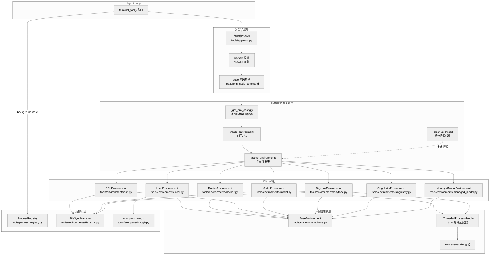
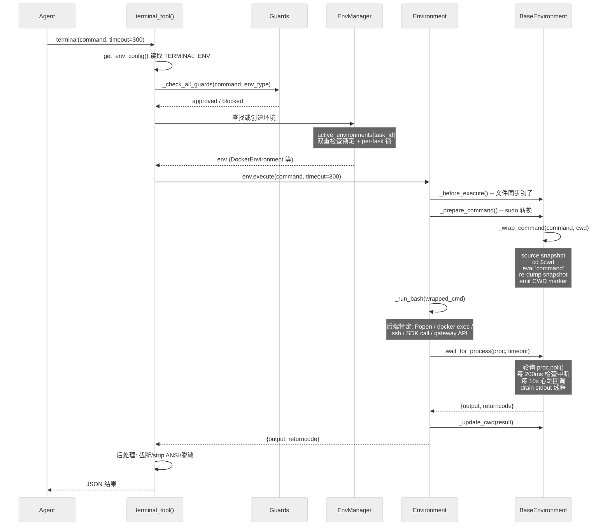
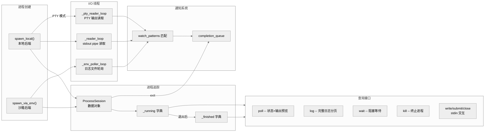

# 第九章: 终端后端与执行环境

## 一句话总结

Hermes 的终端系统通过统一的 `BaseEnvironment` 抽象层, 将命令执行请求分发到六种不同的后端(Local, Docker, SSH, Modal, Daytona, Singularity), 每种后端实现相同的"每次调用生成新进程"模型, 同时通过会话快照(session snapshot)在跨调用间保持环境变量和工作目录的持久性.

---

## 架构总览



---

## 后端抽象: BaseEnvironment 接口

所有执行后端继承自 `BaseEnvironment`(`tools/environments/base.py:226`). 该基类定义了统一的执行模型:

### 核心接口

| 方法 | 类型 | 说明 |
|------|------|------|
| `_run_bash(cmd_string, login, timeout, stdin_data)` | 抽象方法 | 启动一个 bash 进程执行命令, 返回 `ProcessHandle` |
| `cleanup()` | 抽象方法 | 释放后端资源(容器/连接/实例) |
| `execute(command, cwd, timeout, stdin_data)` | 统一入口 | 命令预处理 -> 包装 -> 执行 -> 等待 -> CWD 更新 |
| `init_session()` | 会话初始化 | 捕获 login shell 的完整环境快照 |
| `_wrap_command(command, cwd)` | 命令包装 | 注入快照加载/CWD 追踪/环境变量导出 |
| `_wait_for_process(proc, timeout)` | 进程等待 | 轮询式等待, 支持中断检测和超时终止 |
| `_before_execute()` | 钩子 | 执行前触发文件同步(SSH/Modal/Daytona 覆写) |

### ProcessHandle 协议

`ProcessHandle`(`tools/environments/base.py:125`) 是所有后端进程句柄的鸭子类型协议:

```python
class ProcessHandle(Protocol):
    def poll(self) -> int | None: ...
    def kill(self) -> None: ...
    def wait(self, timeout: float | None = None) -> int: ...
    @property
    def stdout(self) -> IO[str] | None: ...
    @property
    def returncode(self) -> int | None: ...
```

本地后端直接返回 `subprocess.Popen`(天然符合该协议). SDK 类后端(Modal, Daytona)通过 `_ThreadedProcessHandle`(`tools/environments/base.py:143`) 适配: 该类在后台线程中运行阻塞式 SDK 调用, 通过 `os.pipe()` 暴露 stdout, 并将 `cancel_fn` 绑定到后端特定的取消操作.

### 会话快照机制

`init_session()`(`tools/environments/base.py:289`) 在后端构造后执行一次, 通过 `bash -l` 登录 shell 捕获:

1. `export -p` -- 所有环境变量
2. `declare -f` -- Shell 函数(过滤内部前缀)
3. `alias -p` -- 所有别名
4. `shopt -s expand_aliases` / `set +e` / `set +u` -- Shell 选项

快照文件保存在 `/tmp/hermes-snap-{session_id}.sh`, 后续每次命令执行通过 `_wrap_command()` source 该快照, 实现跨调用的环境一致性. 命令执行后会 re-dump `export -p` 更新快照, 确保新设置的环境变量在下次调用中可用.

### CWD 持久化

工作目录通过两种互补机制追踪:

- **文件方式**(本地后端): 每次命令结束写 `pwd -P` 到临时文件 `/tmp/hermes-cwd-{session_id}.txt`, 下次调用时读取 (`tools/environments/local.py:296`)
- **标记方式**(远程后端): 在 stdout 末尾注入 `__HERMES_CWD_{session_id}__{path}__HERMES_CWD_{session_id}__` 标记, 由 `_extract_cwd_from_output()` 解析并从输出中剥离 (`tools/environments/base.py:467`)

---

## 后端对比表

| 后端 | 文件 | 进程隔离 | GPU | 持久化方式 | 文件同步 | 成本模型 | stdin 模式 |
|------|------|----------|-----|-----------|----------|----------|-----------|
| **Local** | `local.py` | 无(主机直接执行) | 主机 GPU | N/A | 无需 | 免费 | pipe |
| **Docker** | `docker.py` | 容器隔离, cap-drop ALL | 需配置 | bind mount(workspace/home) | 无需(绑定挂载) | 免费 | pipe |
| **SSH** | `ssh.py` | 远程主机 | 远程 GPU | 远程文件系统 | FileSyncManager | 远程机器费用 | pipe |
| **Modal (Direct)** | `modal.py` | 云沙箱 | Modal GPU | 文件系统快照 | FileSyncManager | 按用量计费 | heredoc |
| **Modal (Managed)** | `managed_modal.py` | 网关托管沙箱 | Modal GPU | 终止前快照 | 无(网关管理) | 按用量计费 | payload |
| **Daytona** | `daytona.py` | 云沙箱 | 平台 GPU | stop/start 保留沙箱 | FileSyncManager | 按用量计费 | heredoc |
| **Singularity** | `singularity.py` | 容器隔离, --containall | 主机 GPU | overlay 目录 | 无需(绑定挂载) | 免费 | pipe |

---

## 命令执行流程

以一个 `terminal(command="pip install numpy", timeout=300)` 调用为例, 完整的执行流如下:



### 关键步骤详解

**1. 配置读取** (`terminal_tool.py:602`): `_get_env_config()` 从环境变量读取全部配置, 包括 `TERMINAL_ENV` (后端类型), `TERMINAL_CWD` (工作目录), `TERMINAL_TIMEOUT` (默认超时), 以及各后端特定参数(镜像名/SSH 配置/资源限制). 容器后端会过滤掉明显是主机路径的 CWD 值.

**2. 安全检查** (`terminal_tool.py:1313`): 分两层:
- `_check_all_guards()` 调用 `tools/approval.py` 的统合守卫, 包含 Tirith 策略检查和危险命令模式匹配
- `_validate_workdir()` (`terminal_tool.py:160`) 使用字符 allowlist 正则 `^[A-Za-z0-9/_\-.~ +@=,]+$` 拒绝含 shell 元字符的 workdir

**3. 环境获取** (`terminal_tool.py:1232`): 使用双重检查锁定模式(全局锁 `_env_lock` + per-task 创建锁 `_creation_locks`), 确保同一 task_id 的并发调用复用同一沙箱而非各自创建. 支持 `_task_env_overrides` 注册表为特定任务覆盖镜像/CWD 等配置.

**4. sudo 处理** (`terminal_tool.py:448`): `_transform_sudo_command()` 进行精细的 shell 解析(引号/转义/注释感知), 仅将真正的 `sudo` 命令词替换为 `sudo -S -p ''`, 通过 stdin 传递密码. 密码来源优先级: `SUDO_PASSWORD` 环境变量 > 会话缓存 > 交互式提示(45秒超时).

**5. 命令包装** (`tools/environments/base.py:330`): `_wrap_command()` 生成一个完整的 bash 脚本:
```bash
source /tmp/hermes-snap-{id}.sh 2>/dev/null || true  # 恢复快照
cd {cwd} || exit 126                                   # 切换目录
eval '{command}'                                        # 执行命令
__hermes_ec=$?
export -p > /tmp/hermes-snap-{id}.sh 2>/dev/null       # 更新快照
pwd -P > /tmp/hermes-cwd-{id}.txt 2>/dev/null          # 记录 CWD
printf '\n__HERMES_CWD_...%s__HERMES_CWD_...\n' "$(pwd -P)"  # CWD 标记
exit $__hermes_ec
```

**6. 输出后处理** (`terminal_tool.py:1509`): 对超长输出(>50K 字符)执行 head/tail 截断(40% 头部 + 60% 尾部), 再 strip ANSI 转义序列, 最后通过 `redact_sensitive_text()` 脱敏可能泄露的密钥.

---

## 各后端实现细节

### Local 后端

`LocalEnvironment` (`tools/environments/local.py:216`) 是最轻量的后端. `_run_bash()` 直接调用 `subprocess.Popen` 执行 `bash -c` 命令. 在 Unix 上通过 `os.setsid` 创建新进程组, 使 `_kill_process()` 能通过 `os.killpg()` 终止整棵进程树.

环境变量安全由 `_make_run_env()` (`local.py:186`) 保障, 该函数:
- 从 `_HERMES_PROVIDER_ENV_BLOCKLIST` 移除所有 LLM API 密钥/消息平台令牌等 100+ 个敏感变量
- 尊重 `env_passthrough` 机制: 技能声明或用户配置的变量跳过过滤
- 通过 `_HERMES_FORCE_` 前缀支持强制覆盖
- 注入 `get_subprocess_home()` 实现 HOME 目录隔离

Windows 支持通过 `_find_bash()` (`local.py:141`) 自动搜索 Git Bash, 检查常见安装路径并支持 `HERMES_GIT_BASH_PATH` 自定义.

### Docker 后端

`DockerEnvironment` (`tools/environments/docker.py:217`) 是安全加固最完善的后端. 构造时启动一个 `docker run -d ... sleep infinity` 容器, 后续命令通过 `docker exec` 注入.

安全硬化措施 (`docker.py:134`):
```
--cap-drop ALL              # 移除所有 Linux 能力
--cap-add DAC_OVERRIDE      # 仅保留: 写入绑定挂载目录
--cap-add CHOWN             # 仅保留: 包管理器设置文件所有权
--cap-add FOWNER            # 仅保留: 包管理器修改文件
--security-opt no-new-privileges  # 禁止提权
--pids-limit 256            # PID 数量限制
--tmpfs /tmp:rw,nosuid,size=512m  # 大小受限的 tmpfs
--init                      # tini 作为 PID 1, 回收僵尸进程
```

持久化通过绑定挂载实现: `persistent=True` 时, `{HERMES_HOME}/sandboxes/docker/{task_id}/workspace` 和 `home` 挂载到容器的 `/workspace` 和 `/root`; 非持久模式使用 tmpfs. 支持显式卷挂载(`docker_volumes`)和主机 CWD 直通(`TERMINAL_DOCKER_MOUNT_CWD_TO_WORKSPACE`).

凭证文件(`get_credential_file_mounts`)、技能目录(`get_skills_directory_mount`)和缓存目录(`get_cache_directory_mounts`)均以只读模式挂载.

资源限制: CPU (`--cpus`)、内存 (`--memory`)、磁盘 (`--storage-opt`, 仅 XFS+pquota 上的 overlay2 支持, 通过探测检测).

### SSH 后端

`SSHEnvironment` (`tools/environments/ssh.py:31`) 在远程机器上执行命令. 核心设计:

- **ControlMaster 连接复用**: 通过 `ControlPath`/`ControlMaster=auto`/`ControlPersist=300` 实现 SSH 连接池, 避免每次命令建立新连接
- **文件同步**: 使用 `FileSyncManager` 将本地凭证/技能/缓存同步到远程 `~/.hermes/` 目录
- **批量上传优化**: `_ssh_bulk_upload()` (`ssh.py:141`) 通过 `tar -c | ssh tar -x` 管道在单次 TCP 流中传输所有文件, 将 O(N) 次 scp 降为 1 次流式传输
- `_run_bash()` 简单地通过 SSH 执行 `bash -c` 命令

### Modal 后端 (Direct)

`ModalEnvironment` (`tools/environments/modal.py:147`) 使用 Modal SDK 直接创建云沙箱. 关键设计:

- **异步适配**: `_AsyncWorker` 内部类维护独立事件循环线程, 通过 `run_coroutine_threadsafe()` 桥接 Modal 的 async API
- **镜像解析**: `_resolve_modal_image()` (`modal.py:83`) 支持注册表镜像、快照 ID (`im-` 前缀)、和自动 Python 注入(对 ubuntu/debian 镜像)
- **快照持久化**: cleanup 时调用 `sandbox.snapshot_filesystem.aio()` 创建文件系统快照, ID 存储在 `~/.hermes/modal_snapshots.json`; 下次创建时先尝试从快照恢复, 失败则回退到基础镜像
- **文件同步**: 使用 `FileSyncManager`, 单文件通过 base64 管道上传, 批量通过 `tar.gz | base64 | stdin` 流式传输(规避 Modal 64KB `ARG_MAX_BYTES` 限制)
- **stdin 模式**: `_stdin_mode = "heredoc"` -- 因 SDK 无法直接管道 stdin, 通过 shell heredoc 嵌入

### Modal 后端 (Managed)

`ManagedModalEnvironment` (`tools/environments/managed_modal.py:36`) 是 Modal 的网关托管变体, 继承自 `BaseModalExecutionEnvironment` (`tools/environments/modal_utils.py:58`).

与 Direct Modal 的核心区别:
- **不使用 BaseEnvironment.execute()**: 完全覆写 `execute()`, 因为网关服务端已管理 CWD 追踪、环境快照等责任
- **HTTP API 交互**: 通过 `requests` 调用网关 REST API (`/v1/sandboxes/`, `/v1/sandboxes/{id}/execs`)
- **轮询模式**: `_stdin_mode = "payload"` -- stdin 数据作为 JSON 载荷发送; 执行结果通过轮询 exec 状态获取
- **幂等创建**: 使用 `x-idempotency-key` 头防止重复创建沙箱
- **无凭证直通**: 明确不支持主机凭证文件挂载(`_guard_unsupported_credential_passthrough`)

`BaseModalExecutionEnvironment` 提供了 Modal 共享的执行流: 命令准备 -> sudo 管道包装 -> 启动 exec -> 轮询结果(含中断检测和超时).

### Daytona 后端

`DaytonaEnvironment` (`tools/environments/daytona.py:29`) 使用 Daytona Python SDK. 特点:

- **沙箱复用**: 持久模式下先按名称(`hermes-{task_id}`)查找已有沙箱并 start, 失败则按标签查找遗留沙箱, 最后才创建新沙箱
- **批量上传**: `_daytona_bulk_upload()` 使用 SDK 的 `upload_files()` 将所有文件合并为单次 multipart POST
- **清理策略**: 持久模式下 `cleanup()` 调用 `sandbox.stop()`(保留文件系统), 非持久模式调用 `daytona.delete()`

### Singularity/Apptainer 后端

`SingularityEnvironment` (`tools/environments/singularity.py:156`) 用于 HPC 环境. 特点:

- **SIF 缓存**: `_get_or_build_sif()` 将 `docker://` 镜像引用转换为本地 SIF 文件, 带线程锁避免并发构建
- **持久化**: 通过 overlay 目录(`--overlay`)实现, 目录路径记录在 `singularity_snapshots.json`
- **安全隔离**: `--containall`(完全隔离) + `--no-home`(不挂载主机 home)
- **Scratch 目录**: 优先使用 `/scratch`(HPC 标准), 回退到 `{HERMES_HOME}/sandboxes/singularity/`

---

## 进程管理

`ProcessRegistry` (`tools/process_registry.py:106`) 是后台进程的统一管理器, 追踪通过 `terminal(background=true)` 启动的所有进程.

### 核心架构



### 本地进程 vs 沙箱进程

**本地进程** (`spawn_local`, `process_registry.py:286`):
- 通过 `subprocess.Popen` 直接创建, 后台线程 `_reader_loop` 实时读取 stdout
- 支持 PTY 模式(`ptyprocess` / `winpty`), 用于交互式 CLI 工具
- 环境变量经过 `_sanitize_subprocess_env()` 脱敏
- `PYTHONUNBUFFERED=1` 强制 Python 脚本无缓冲输出

**沙箱进程** (`spawn_via_env`, `process_registry.py:398`):
- 通过 `env.execute()` 在沙箱内启动 `nohup bash -lc <command>`, 将输出重定向到日志文件
- 后台线程 `_env_poller_loop` 每 2 秒通过 `env.execute("cat logfile")` 读取输出
- 通过 `kill -0 $(cat pidfile)` 检测进程存活, 读取 `.exit` 文件获取退出码

### 输出缓冲

每个 `ProcessSession` 维护一个滚动输出缓冲区(`output_buffer`), 上限 200KB (`MAX_OUTPUT_CHARS`). 超出时保留最新部分. 输出经过 shell 噪声清理(`_clean_shell_noise`)和 watch pattern 扫描.

### Watch Patterns 与通知

Watch patterns 提供基于内容匹配的通知:
- 每个进程可注册多个字符串模式
- 新输出逐行匹配, 命中时推入 `completion_queue`
- **限速**: 每 10 秒窗口最多 8 条通知(`WATCH_MAX_PER_WINDOW`)
- **过载保护**: 持续超限 45 秒后永久禁用该进程的 watch(`WATCH_OVERLOAD_KILL_SECONDS`)

### 崩溃恢复

`_write_checkpoint()` 将运行中进程的元数据(PID, 命令, task_id, 通知配置)写入 `{HERMES_HOME}/processes.json`. 网关重启后 `recover_from_checkpoint()` 探测 PID 存活状态, 将仍在运行的进程恢复为 detached 会话(无 stdout 管道, 但可查状态/终止). 仅恢复 `pid_scope="host"` 的进程, 沙箱 PID 在容器重建后无效.

---

## 文件同步

`FileSyncManager` (`tools/environments/file_sync.py:74`) 为远程后端(SSH, Modal, Daytona)提供宿主机到沙箱的文件同步:

### 同步内容

通过 `iter_sync_files()` (`file_sync.py:30`) 收集三类文件:
1. **凭证文件** -- 技能声明的 OAuth 令牌等
2. **技能目录** -- 本地和外部技能的脚本/模板
3. **缓存文件** -- 文档/图片/音频/截图

### 变更检测

使用 `(mtime, size)` 元组作为文件指纹. `_synced_files` 字典记录已同步文件的远程路径到指纹的映射. 每次 sync 周期:
- 比较当前文件集与已同步集, 检测新增/变更
- 检测已删除(已同步集中有但当前集中无)
- 批量上传 + 批量删除

### 事务性保证

sync 操作是事务性的: 在执行前快照 `_synced_files`, 全部操作成功后才提交新状态; 任一操作失败则回滚, 下次重试全部操作.

### 限速

默认 5 秒同步间隔(`_SYNC_INTERVAL_SECONDS`), 除非 `force=True` 或 `HERMES_FORCE_FILE_SYNC=1`. 首次 `init` 时强制全量同步.

### 各后端差异

| 后端 | 单文件上传 | 批量上传 | 删除 |
|------|-----------|----------|------|
| SSH | scp over ControlMaster | tar pipe over SSH | ssh rm -f |
| Modal | base64 pipe via exec stdin | tar.gz + base64 pipe via exec stdin | exec rm -f |
| Daytona | SDK upload_file() | SDK upload_files() multipart POST | exec rm -f |
| Docker/Singularity | 不需要(绑定挂载) | 不需要 | 不需要 |

---

## 环境持久化模型

### Docker

持久化 = 绑定挂载. `{HERMES_HOME}/sandboxes/docker/{task_id}/workspace` 和 `/home` 目录在容器生命周期外存在. 容器被清理后重建时, 挂载相同目录恢复状态.

### Modal (Direct)

持久化 = 文件系统快照. `cleanup()` 时调用 `sandbox.snapshot_filesystem()` 生成不可变快照 ID(如 `im-xxx`), 存储在本地 JSON(`modal_snapshots.json`). 下次创建沙箱时以该快照 ID 作为 image 参数, Modal 服务端恢复完整文件系统状态. 快照恢复失败(如快照过期)会自动回退到基础镜像.

### Modal (Managed)

持久化由网关服务端管理. `cleanup()` 发送 `POST /v1/sandboxes/{id}/terminate` 并设 `snapshotBeforeTerminate: true`, 由网关决定快照策略.

### Daytona

持久化 = 沙箱 stop/start. `cleanup()` 调用 `sandbox.stop()` 暂停沙箱(文件系统保留), 下次构造时 `sandbox.start()` 恢复. 这是最直接的持久化模型 -- 整个沙箱状态(进程状态除外)原封不动保留.

### Singularity

持久化 = overlay 目录. `--overlay {dir}` 将所有写操作记录在宿主机的 overlay 目录中. 实例停止后 overlay 目录保留, 下次启动时重新挂载恢复. overlay 路径记录在 `singularity_snapshots.json`.

---

## 安全模型

### 命令审批

所有命令经过 `_check_all_guards()` (`terminal_tool.py:148`) 检查:
1. **Tirith 策略引擎** -- 可配置的策略规则
2. **危险命令模式匹配** -- 检测 `rm -rf /`, `chmod 777`, `curl | bash` 等模式
3. 被阻止的命令返回 `status: "blocked"`, 需审批的返回 `status: "approval_required"`

### workdir 注入防护

`_validate_workdir()` (`terminal_tool.py:160`) 使用严格的字符 allowlist:
```python
_WORKDIR_SAFE_RE = re.compile(r'^[A-Za-z0-9/_\-.~ +@=,]+$')
```
拒绝所有 shell 元字符(`; | & $ ( ) ` \` 等), 从源头阻止 workdir 参数的命令注入.

### 环境变量隔离

`_HERMES_PROVIDER_ENV_BLOCKLIST` (`local.py:107`) 维护 100+ 个必须从子进程环境中移除的变量, 涵盖:
- 所有 LLM 提供商 API 密钥(OpenAI, Anthropic, Google, DeepSeek 等)
- 消息平台令牌(Telegram, Discord, Slack, Signal, WhatsApp)
- 工具凭证(GitHub, Modal, Daytona, Firecrawl)
- 网关配置

`env_passthrough.py` 提供选择性放行: 技能通过 `required_environment_variables` 声明所需变量, 或用户在 `config.yaml` 的 `terminal.env_passthrough` 中显式配置. 使用 `ContextVar` 实现网关多会话隔离.

### Docker 容器安全

Docker 后端 (`docker.py:134`) 应用深度防御:
- `--cap-drop ALL` + 最小 capability 添加(DAC_OVERRIDE, CHOWN, FOWNER)
- `--security-opt no-new-privileges` 禁止任何形式的提权
- `--pids-limit 256` 防止 fork bomb
- tmpfs 挂载带 `nosuid` 和大小限制

### Singularity 容器安全

`--containall`(隔离所有命名空间) + `--no-home`(不暴露主机 home 目录).

---

## 配置系统

### 环境变量配置

所有配置通过环境变量注入, `_get_env_config()` (`terminal_tool.py:602`) 统一读取:

| 变量 | 默认值 | 说明 |
|------|--------|------|
| `TERMINAL_ENV` | `local` | 后端类型: local/docker/singularity/modal/daytona/ssh |
| `TERMINAL_CWD` | 后端相关 | 工作目录(local=`os.getcwd()`, 其余=`/root`) |
| `TERMINAL_TIMEOUT` | `180` | 默认命令超时(秒) |
| `TERMINAL_LIFETIME_SECONDS` | `300` | 空闲环境清理时间(秒) |
| `TERMINAL_DOCKER_IMAGE` | `nikolaik/python-nodejs:python3.11-nodejs20` | Docker 镜像 |
| `TERMINAL_MODAL_IMAGE` | 同上 | Modal 镜像 |
| `TERMINAL_DAYTONA_IMAGE` | 同上 | Daytona 镜像 |
| `TERMINAL_CONTAINER_CPU` | `1` | 容器 CPU 核数 |
| `TERMINAL_CONTAINER_MEMORY` | `5120` | 容器内存(MB) |
| `TERMINAL_CONTAINER_DISK` | `51200` | 容器磁盘(MB) |
| `TERMINAL_CONTAINER_PERSISTENT` | `true` | 是否启用持久化 |
| `TERMINAL_SSH_HOST/USER/PORT/KEY` | - | SSH 连接参数 |
| `TERMINAL_MODAL_MODE` | `auto` | Modal 模式: direct/managed/auto |
| `TERMINAL_MAX_FOREGROUND_TIMEOUT` | `600` | 前台命令最大超时 |
| `TERMINAL_SANDBOX_DIR` | `{HERMES_HOME}/sandboxes` | 沙箱存储根目录 |

### Per-task 覆盖

`register_task_env_overrides()` (`terminal_tool.py:557`) 允许基础设施代码(如 TerminalBench2Env)为特定 task_id 注册自定义镜像/CWD, 在环境创建时优先于全局配置.

### 后端切换

后端选择由 `TERMINAL_ENV` 决定. Modal 后端额外受 `TERMINAL_MODAL_MODE` 控制:
- `direct`: 直接使用 Modal SDK(需本地凭证)
- `managed`: 通过网关 API 管理(需 Nous 用户令牌)
- `auto`: 优先 managed, 回退到 direct

`_get_modal_backend_state()` (`terminal_tool.py:681`) 和 `resolve_modal_backend_state()` 综合检测凭证可用性和网关就绪状态, 决定实际使用的 Modal 传输方式.

---

## 关键文件索引

| 文件 | 行数 | 职责 |
|------|------|------|
| `tools/terminal_tool.py` | 1,777 | 终端工具入口: 配置读取、安全检查、环境管理、命令执行、输出后处理、工具注册 |
| `tools/environments/base.py` | 579 | 基类: BaseEnvironment、ProcessHandle 协议、_ThreadedProcessHandle、会话快照、CWD 追踪 |
| `tools/environments/local.py` | 315 | 本地后端: Popen 执行、环境变量过滤、bash 查找、进程组管理 |
| `tools/environments/docker.py` | 561 | Docker 后端: 安全加固、资源限制、绑定挂载持久化、凭证挂载 |
| `tools/environments/ssh.py` | 259 | SSH 后端: ControlMaster 连接池、tar pipe 批量上传、文件同步 |
| `tools/environments/modal.py` | 435 | Modal Direct 后端: 异步适配、快照持久化、base64 文件传输 |
| `tools/environments/managed_modal.py` | 283 | Modal Managed 后端: 网关 HTTP API、轮询执行、幂等创建 |
| `tools/environments/modal_utils.py` | 186 | Modal 共享逻辑: 命令准备、heredoc 包装、sudo 管道、轮询循环 |
| `tools/environments/daytona.py` | 230 | Daytona 后端: SDK 沙箱管理、stop/start 持久化、批量上传 |
| `tools/environments/singularity.py` | 263 | Singularity 后端: SIF 缓存、overlay 持久化、HPC scratch 目录 |
| `tools/environments/file_sync.py` | 169 | 文件同步: mtime 变更检测、事务性同步、限速、批量操作 |
| `tools/process_registry.py` | 1,173 | 进程注册表: 后台进程追踪、输出缓冲、通知队列、崩溃恢复 |
| `tools/env_passthrough.py` | 104 | 环境变量穿透: 技能声明注册、config.yaml 配置、ContextVar 会话隔离 |
