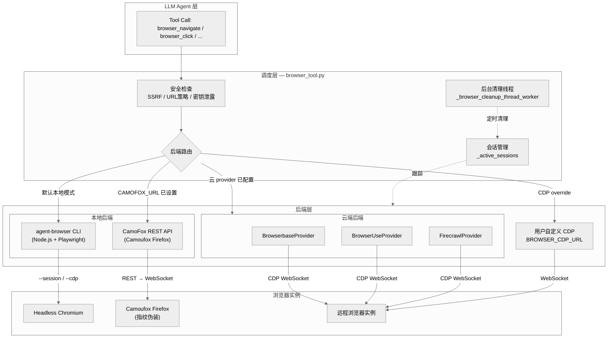
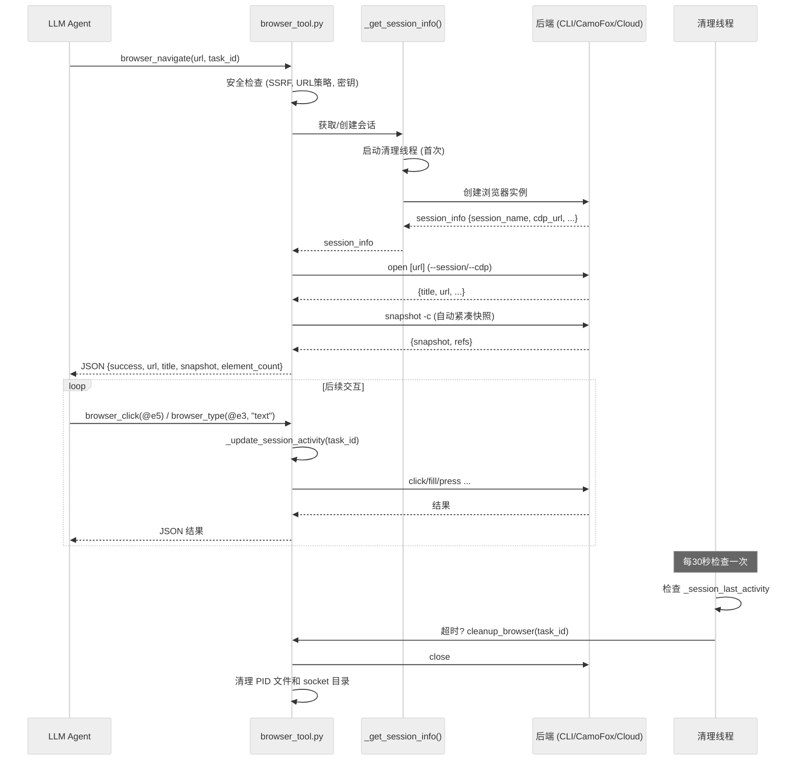
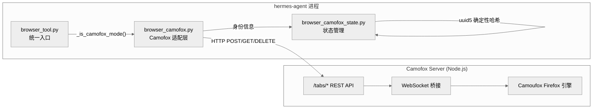
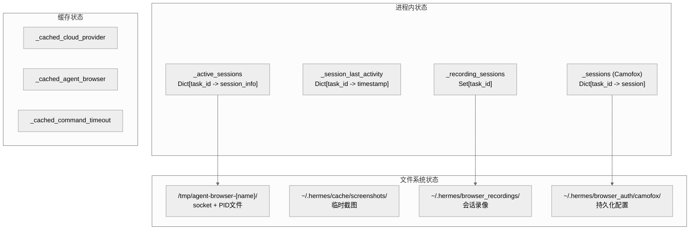
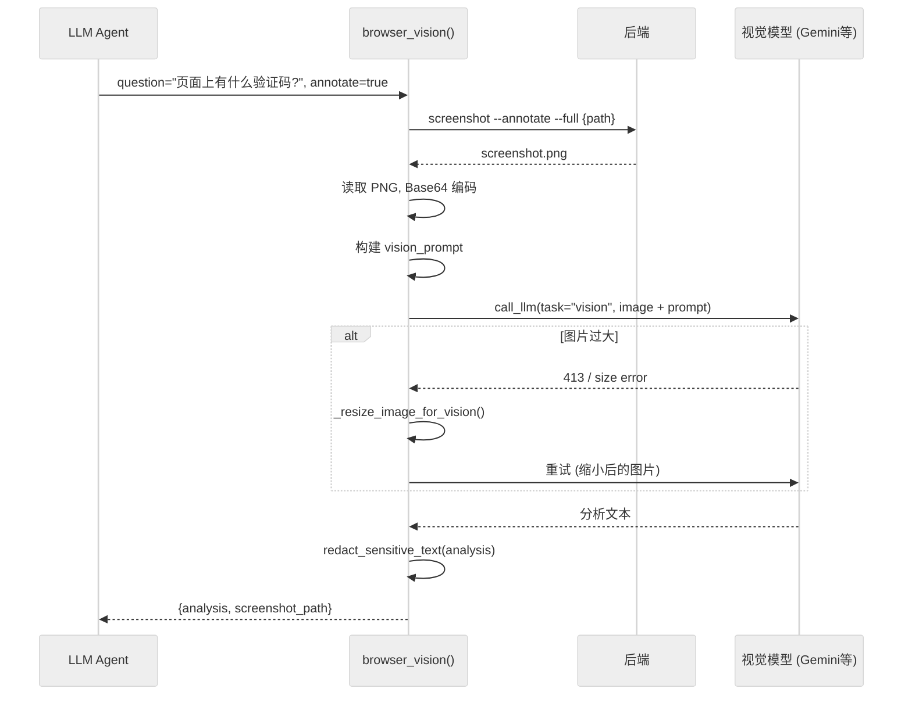
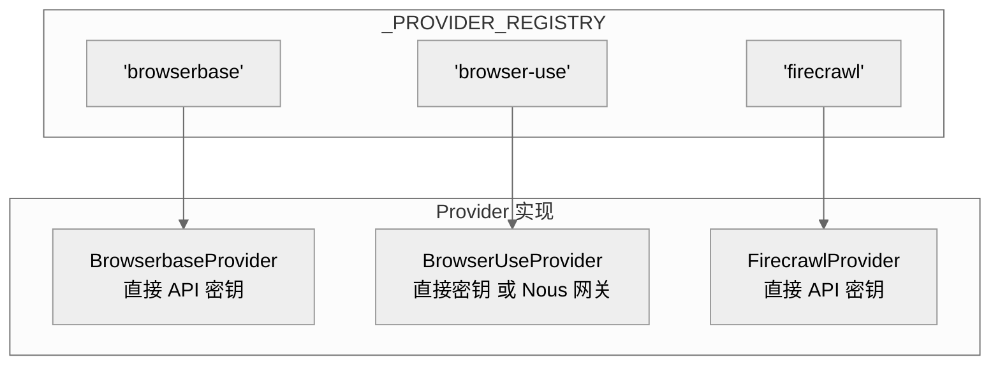

# 第十章：浏览器自动化

## 一句话总结

hermes-agent 的浏览器自动化系统通过多后端抽象层（本地 Chromium、CamoFox 反检测 Firefox、三种云浏览器服务），以 `agent-browser` CLI 和 REST API 为桥梁，为 LLM Agent 提供基于无障碍树（Accessibility Tree）的页面交互能力，涵盖导航、点击、输入、截图与视觉分析全链路。

## 架构总览



## 工具清单

浏览器工具集共注册 **10 个工具**，全部归属 `browser` toolset，在 `tools/browser_tool.py:2306-2387` 完成注册。所有工具共享同一个可用性检查函数 `check_browser_requirements()`。

| 工具名称 | 功能说明 | 关键参数 | 注册行号 |
|---------|---------|---------|---------|
| `browser_navigate` | 导航到指定 URL，自动返回紧凑快照 | `url: str` | `browser_tool.py:2306` |
| `browser_snapshot` | 获取当前页面无障碍树快照 | `full: bool` | `browser_tool.py:2316` |
| `browser_click` | 通过 ref ID 点击元素 | `ref: str` (如 `@e5`) | `browser_tool.py:2323` |
| `browser_type` | 向输入框填写文本（先清空再输入） | `ref: str`, `text: str` | `browser_tool.py:2331` |
| `browser_scroll` | 上下滚动页面（500px/次） | `direction: "up"\|"down"` | `browser_tool.py:2339` |
| `browser_back` | 浏览器历史后退 | 无 | `browser_tool.py:2347` |
| `browser_press` | 按下键盘按键 | `key: str` (如 `Enter`) | `browser_tool.py:2355` |
| `browser_get_images` | 提取页面所有图片的 URL 和 alt 文本 | 无 | `browser_tool.py:2364` |
| `browser_vision` | 截图并通过视觉模型分析页面 | `question: str`, `annotate: bool` | `browser_tool.py:2372` |
| `browser_console` | 获取控制台日志/错误，或执行 JavaScript | `clear: bool`, `expression: str` | `browser_tool.py:2380` |

### 工具交互范式

LLM Agent 与浏览器的交互遵循"快照驱动"范式：

1. **导航** (`browser_navigate`) -- 自动附带紧凑快照，无需额外调用
2. **快照解读** -- 快照中的交互元素标记为 `@eN` 形式的 ref ID
3. **元素操作** (`browser_click`, `browser_type`) -- 通过 ref ID 精准定位
4. **视觉补充** (`browser_vision`) -- 当无障碍树无法捕获的视觉信息（CAPTCHA、复杂布局）时使用

这种范式使得不具备视觉能力的纯文本模型也能有效操作浏览器。

## 浏览器生命周期



### 阶段详解

#### 1. 启动与会话创建

会话创建由 `_get_session_info()` (`browser_tool.py:806`) 统一管理，基于 `task_id` 实现会话隔离。创建逻辑按优先级选择后端：

```
CDP override (BROWSER_CDP_URL) > 云 Provider > 本地 agent-browser
```

具体路径（`browser_tool.py:836-849`）：

- **CDP override**: 当设置了 `BROWSER_CDP_URL` 环境变量时，直接连接用户指定的 Chrome DevTools Protocol 端点。`_resolve_cdp_override()` (`browser_tool.py:181`) 支持 WebSocket 完整 URL、HTTP 发现端点、裸 host:port 三种格式。
- **云 Provider**: 通过 `_get_cloud_provider()` (`browser_tool.py:258`) 查找配置的云服务商，调用 `provider.create_session()` 获取远程浏览器的 CDP WebSocket URL。
- **本地模式**: 生成唯一的 `session_name` (`h_{uuid}`)，后续通过 `agent-browser --session {name}` 启动/复用本地 Chromium 守护进程。

线程安全通过 `_cleanup_lock` 保证：会话创建在锁外进行（避免云 API 调用阻塞其他线程），但写入 `_active_sessions` 时加锁，并做 double-check 防止并发重复创建。

#### 2. 命令执行

所有 agent-browser CLI 命令由 `_run_browser_command()` (`browser_tool.py:967`) 统一执行。关键设计：

- **进程隔离**: 每次命令启动子进程，通过 `--session`（本地）或 `--cdp`（云/CDP）指定后端
- **Socket 目录隔离**: 每个 task 在 `{tmpdir}/agent-browser-{session_name}/` 下创建独立目录，防止并行 worker 冲突（`browser_tool.py:1039-1043`）
- **I/O 策略**: 使用临时文件而非管道捕获 stdout/stderr，因为 agent-browser 守护进程会继承管道 fd 导致 `communicate()` 永远等不到 EOF（`browser_tool.py:1069-1077`）
- **PATH 扩展**: 自动注入 Hermes 管理的 Node.js、Homebrew 版本化 Node 目录（`browser_tool.py:1049-1066`）
- **超时控制**: 可配置 `browser.command_timeout`，默认 30 秒，最低 5 秒（`browser_tool.py:146`）

#### 3. 快照处理

快照是 LLM 理解页面的核心数据。当快照文本超过 `SNAPSHOT_SUMMARIZE_THRESHOLD`（8000 字符）时，系统采用分层处理策略：

1. **LLM 摘要** (`_extract_relevant_content()`, `browser_tool.py:1180`): 当存在用户任务上下文时，调用辅助 LLM 提取与任务相关的内容，保留 ref ID
2. **结构化截断** (`_truncate_snapshot()`, `browser_tool.py:1236`): 按行边界截断，避免拆断无障碍树元素，附加被省略行数提示

快照处理中会通过 `redact_sensitive_text()` 过滤敏感信息，防止 API 密钥等数据泄漏到辅助模型。

#### 4. 清理与资源回收

系统实现了多层清理保障：

| 层次 | 触发条件 | 实现位置 |
|------|---------|---------|
| **主动清理** | 任务完成时调用 `cleanup_browser()` | `browser_tool.py:2112` |
| **不活跃超时** | 5 分钟无操作（可配置） | `_cleanup_inactive_browser_sessions()` (`browser_tool.py:448`) |
| **孤儿进程回收** | 清理线程启动时一次性扫描 | `_reap_orphaned_browser_sessions()` (`browser_tool.py:476`) |
| **进程退出** | `atexit` 注册 | `_emergency_cleanup_all_sessions()` (`browser_tool.py:408`) |
| **截图清理** | 每小时检查一次，清除 24 小时前的截图 | `_cleanup_old_screenshots()` (`browser_tool.py:2065`) |
| **录像清理** | 清除 72 小时前的录像 | `_cleanup_old_recordings()` (`browser_tool.py:2089`) |

后台清理线程 (`_browser_cleanup_thread_worker()`, `browser_tool.py:560`) 以 daemon 模式运行，每 30 秒检查一次不活跃会话。启动时还会执行一次性的孤儿进程扫描——遍历 `/tmp/agent-browser-h_*` 和 `/tmp/agent-browser-cdp_*` 目录，找到不在当前进程跟踪中的 PID 文件并发送 `SIGTERM`。

## CamoFox 反检测浏览器后端

### 是什么

CamoFox 是一个自托管的 Node.js 服务器，封装了 **Camoufox**——一个具有 C++ 级指纹伪装能力的 Firefox 分支浏览器。它通过 REST API 暴露与 hermes-agent 浏览器工具一一对应的操作接口。

### 为什么使用

传统的 headless Chromium 容易被网站的 Bot 检测系统识别。CamoFox 提供了更深层次的反检测能力：

- **C++ 级指纹伪装**: Camoufox 在浏览器引擎底层修改指纹特征，而非通过 JavaScript 注入（容易被检测）
- **Firefox 内核**: 许多 Bot 检测系统专门针对 Chromium 系列浏览器，使用 Firefox 本身就是一种回避策略
- **VNC 支持**: 可通过 VNC URL 实时观看浏览器操作，便于调试和用户监督
- **持久化配置**: 支持 managed persistence 模式，浏览器配置文件（含 cookies、session）可跨任务保持

### 架构集成



### 路由机制

每个浏览器工具函数在入口处检查 `_is_camofox_mode()` (`browser_tool.py:90-92`)，如果 `CAMOFOX_URL` 环境变量已设置，则委托给 `browser_camofox.py` 中对应的 `camofox_*` 函数。以 `browser_navigate` 为例 (`browser_tool.py:1317-1319`)：

```python
if _is_camofox_mode():
    from tools.browser_camofox import camofox_navigate
    return camofox_navigate(url, task_id)
```

注意路由发生在安全检查（SSRF、URL 策略、密钥泄露防护）**之后**，确保 CamoFox 后端同样受到安全策略约束。

### 会话管理

CamoFox 使用独立的会话管理系统 (`browser_camofox.py:113-145`)，与 agent-browser 的 `_active_sessions` 分开维护：

- **会话映射**: `_sessions: Dict[str, Dict]` -- `task_id` 到 `{user_id, tab_id, session_key, managed}` 的映射
- **Tab 生命周期**: 首次导航时通过 `POST /tabs` 创建 tab，后续操作通过 `tab_id` 路由到同一 tab
- **两种身份模式**:
  - **临时模式** (默认): `user_id = hermes_{random_hex}`
  - **持久模式** (`browser.camofox.managed_persistence = true`): 使用 `browser_camofox_state.py` 中 `uuid5` 确定性哈希生成稳定的 `user_id`，使 Camofox 服务器可以映射到同一持久化浏览器配置目录

### 功能限制

CamoFox 后端存在一些功能差异：

| 功能 | agent-browser | CamoFox | 说明 |
|-----|--------------|---------|------|
| 控制台日志 | 完整支持 | 不支持 | `camofox_console()` 返回空结果 (`browser_camofox.py:575`) |
| JS 执行 | `eval` 命令 | `/tabs/{id}/eval` (可选) | 可能返回 404/501 |
| 像素级滚动 | `scroll down 500` | 不支持像素参数 | 通过 5 次重复调用模拟 (`browser_tool.py:1564`) |
| 图片提取 | JS `eval` 提取 | 从无障碍树解析 | `camofox_get_images()` 解析快照文本 (`browser_camofox.py:438`) |

## 状态管理

### 会话状态架构



### 线程安全设计

浏览器工具运行在多线程环境中（子 agent 通过 `ThreadPoolExecutor` 并发执行），因此所有共享状态都通过 `_cleanup_lock` (`browser_tool.py:405`) 保护：

- `_active_sessions` 的读写
- `_session_last_activity` 的读写
- `_recording_sessions` 的读写
- 会话创建的 double-check 模式 (`browser_tool.py:851-857`)

CamoFox 模块有自己的 `_sessions_lock` (`browser_camofox.py:115`)。

### 会话隔离

每个 `task_id` 对应独立的浏览器会话，确保并行子 agent 之间不会互相干扰。隔离的粒度包括：

- 独立的浏览器实例（本地模式下的独立 Chromium 进程）
- 独立的 socket 目录（`/tmp/agent-browser-{session_name}/`）
- 独立的活跃时间追踪
- 独立的 PID 文件和生命周期管理

## 视觉分析集成

`browser_vision` (`browser_tool.py:1887`) 是连接浏览器截图与多模态 LLM 的桥梁。

### 工作流程



### 关键设计点

1. **截图持久化**: 截图保存在 `~/.hermes/cache/screenshots/` 下，不会在分析后立即删除，即使视觉分析失败，截图仍可通过 `MEDIA:<path>` 分享给用户 (`browser_tool.py:2059-2061`)

2. **图片自动缩放**: 当视觉 API 因图片过大拒绝请求时，自动调用 `_resize_image_for_vision()` 缩小后重试 (`browser_tool.py:2020-2034`)

3. **元素标注模式**: `annotate=true` 时，截图上叠加 `[N]` 标签，每个 `[N]` 映射到 `@eN` ref ID，实现视觉感知与操作命令的统一 (`browser_tool.py:2048-2049`)

4. **超时配置**: 视觉分析超时默认 120 秒（本地视觉模型如 llama.cpp 可能需要更长时间），可通过 `auxiliary.vision.timeout` 配置 (`browser_tool.py:1989-1997`)

5. **模型选择**: 通过 `AUXILIARY_VISION_MODEL` 环境变量指定视觉模型，通过 `call_llm(task="vision")` 路由到辅助 LLM 客户端 (`browser_tool.py:171-173`)

6. **安全脱敏**: 视觉模型返回的分析文本经过 `redact_sensitive_text()` 过滤，防止视觉模型读取截图中显示的 API 密钥并回传到对话上下文 (`browser_tool.py:2040-2041`)

## Provider 抽象层

### 抽象基类

`CloudBrowserProvider` (`browser_providers/base.py:7`) 定义了四个抽象方法：

| 方法 | 职责 | 调用时机 |
|------|------|---------|
| `provider_name()` | 返回人类可读名称 | 日志和诊断信息 |
| `is_configured()` | 检查凭据是否就绪 | 工具注册时的可用性门控 |
| `create_session()` | 创建云浏览器会话 | 首次使用浏览器时 |
| `close_session()` | 释放会话 | 任务结束或超时清理 |
| `emergency_cleanup()` | 紧急清理（进程退出） | atexit 回调 |

### Provider 实现对比



| 特性 | Browserbase | Browser Use | Firecrawl |
|------|------------|-------------|-----------|
| **配置方式** | `BROWSERBASE_API_KEY` + `BROWSERBASE_PROJECT_ID` | `BROWSER_USE_API_KEY` 或 Nous 托管网关 | `FIRECRAWL_API_KEY` |
| **API 端点** | `api.browserbase.com/v1/sessions` | `api.browser-use.com/api/v3/browsers` | `api.firecrawl.dev/v2/browser` |
| **代理支持** | 住宅代理（需付费计划） | 网关模式自带代理 | 无 |
| **高级隐身** | `advancedStealth`（需 Scale 计划） | 无 | 无 |
| **会话保活** | `keepAlive`（需付费） | 无 | TTL 配置 |
| **幂等创建** | 无 | 管理模式下有幂等键 (`browser_use.py:24`) | 无 |
| **关闭方式** | `POST /sessions/{id}` + `REQUEST_RELEASE` | `PATCH /browsers/{id}` + `stop` | `DELETE /browser/{id}` |
| **回退逻辑** | 402 时逐步降级（去 keepAlive → 去 proxies） | 无 | 无 |

### Provider 选择逻辑

`_get_cloud_provider()` (`browser_tool.py:258-299`) 的选择优先级：

1. **配置文件显式指定**: `config["browser"]["cloud_provider"]` 直接映射到 `_PROVIDER_REGISTRY`
2. **`local` 显式值**: 禁用所有云后端
3. **自动回退**: Browser Use (优先) → Browserbase (次选)

Browser Use 优先是因为它支持 Nous 订阅用户的托管网关模式（无需用户自己提供 API 密钥），而 Browserbase 仅支持用户自持凭据。

## 安全防护

浏览器工具实现了四层安全防护，全部在实际浏览器操作之前执行：

### 1. 密钥泄露防护 (`browser_tool.py:1286-1294`)

检查 URL 中是否包含 API 密钥或令牌（通过正则 `_PREFIX_RE`），同时检查 URL 编码形式（如 `%2D` 编码绕过）。防止 prompt injection 诱导 Agent 将密钥嵌入 URL 发送到恶意服务器。

### 2. SSRF 防护 (`browser_tool.py:1301-1305`)

通过 `is_safe_url()` 检查目标地址是否为私有/内部地址。**仅对云后端生效**——本地后端中用户已拥有完整的本地网络访问权限，SSRF 检查无安全增益。还支持通过 `browser.allow_private_urls` 配置项关闭检查。

### 3. 重定向后 SSRF 检查 (`browser_tool.py:1344-1350`)

导航成功后，如果最终 URL 与请求 URL 不同，再次检查是否重定向到了私有地址。如果是，则自动导航到 `about:blank` 防止后续 `browser_snapshot` 泄露内部内容。

### 4. 网站策略检查 (`browser_tool.py:1308-1314`)

通过 `check_website_access()` 检查目标 URL 是否被配置文件中的黑名单策略阻止。

### 5. 快照/分析脱敏

所有发送到辅助 LLM（摘要提取、视觉分析）的内容，以及辅助 LLM 返回的结果，均经过 `redact_sensitive_text()` 过滤 (`browser_tool.py:1215-1216`, `browser_tool.py:2040-2041`)。

## 关键文件索引

| 文件路径 | 行数 | 职责 |
|---------|------|------|
| `tools/browser_tool.py` | 2,387 | 浏览器工具主模块：10 个工具定义、后端路由、会话管理、安全检查、快照处理、视觉分析、清理逻辑 |
| `tools/browser_camofox.py` | 593 | CamoFox REST API 适配层：将 hermes 工具调用转换为 Camofox HTTP 请求 |
| `tools/browser_camofox_state.py` | 48 | CamoFox 持久化状态管理：基于 Hermes profile 的确定性身份生成 |
| `tools/browser_providers/base.py` | 60 | `CloudBrowserProvider` 抽象基类：定义 provider 接口契约 |
| `tools/browser_providers/browserbase.py` | 218 | Browserbase 云浏览器实现：支持代理、高级隐身、会话保活 |
| `tools/browser_providers/browser_use.py` | 216 | Browser Use 云浏览器实现：支持直接 API 和 Nous 托管网关两种模式 |
| `tools/browser_providers/firecrawl.py` | 108 | Firecrawl 云浏览器实现：基于 TTL 的轻量会话管理 |
| `tools/browser_providers/__init__.py` | 10 | 包入口：导出 `CloudBrowserProvider` |
| `tools/url_safety.py` | -- | SSRF 防护：URL → IP 解析后检查私有地址范围 |
| `tools/website_policy.py` | -- | 网站访问策略：基于配置的 URL 黑名单检查 |
| `tools/tool_backend_helpers.py` | -- | 辅助函数：provider 名称规范化 |

## 设计亮点与工程决策

### 1. 双模态页面理解

系统同时支持文本模态（无障碍树快照）和视觉模态（截图 + 视觉 LLM），形成互补。无障碍树是主要通道——结构化、token 高效、可直接引用元素；视觉分析是补充通道——处理 CAPTCHA、视觉验证、复杂布局等文本快照无法捕获的场景。

### 2. 临时文件替代管道

`_run_browser_command()` 使用临时文件而非 `subprocess.PIPE` 捕获输出 (`browser_tool.py:1069-1077`)。这是一个非显而易见但关键的工程决策：agent-browser 的守护进程模式会继承父进程的文件描述符，使用管道时守护进程持有管道写端，导致父进程的 `communicate()` 永远等不到 EOF。

### 3. macOS Socket 路径长度问题

macOS 的 `TMPDIR` 通常为 `/var/folders/xx/.../T/`（约 51 字符），加上会话名称后很容易超过 Unix domain socket 的 104 字节限制。`_socket_safe_tmpdir()` (`browser_tool.py:363`) 在 macOS 上强制使用 `/tmp` 绕过此问题。

### 4. 渐进式降级

Browserbase provider 在遇到 402（付费功能不可用）时自动降级：先尝试去除 `keepAlive`，再尝试去除 `proxies` (`browserbase.py:105-133`)。这确保了即使用户的计划不支持高级功能，浏览器仍能正常工作。

### 5. 孤儿进程回收

进程异常退出（SIGKILL、崩溃）时内存中的会话跟踪丢失，但 Node.js 守护进程和 Chromium 仍在运行。`_reap_orphaned_browser_sessions()` (`browser_tool.py:476`) 通过扫描临时目录中的 PID 文件找到并杀死这些孤儿进程，防止资源泄漏。

### 6. 信号处理的权衡

早期版本安装了 SIGINT/SIGTERM 处理器来执行清理，但这与 prompt_toolkit 的异步事件循环冲突——在按键回调内引发的 `SystemExit` 会损坏协程状态，使进程无法被杀死。最终选择仅通过 `atexit` 注册清理 (`browser_tool.py:435-441`)，在所有正常退出路径（包括 `sys.exit()`）下确保浏览器会话被关闭。
